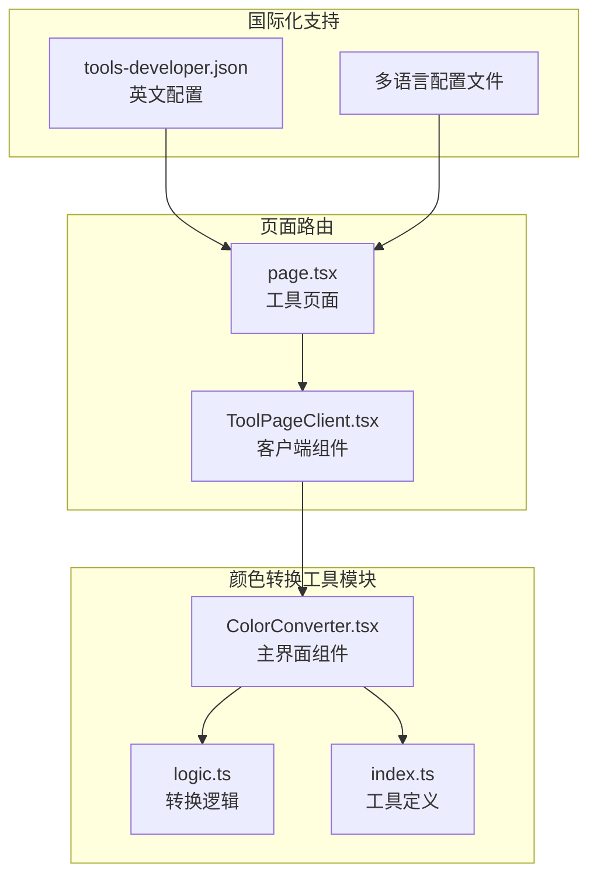
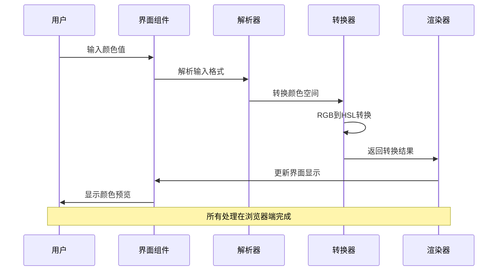
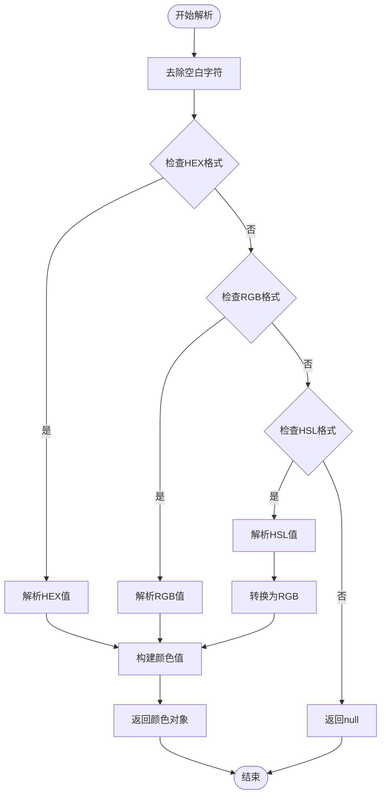
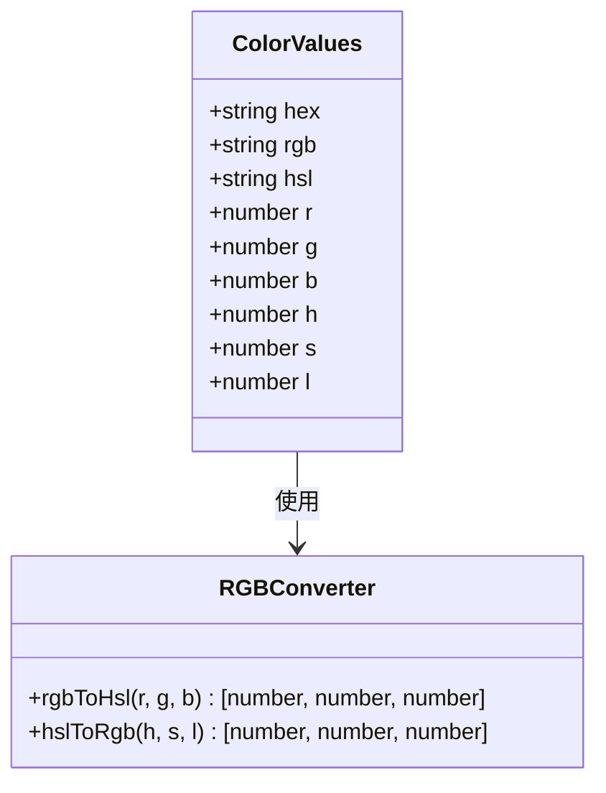
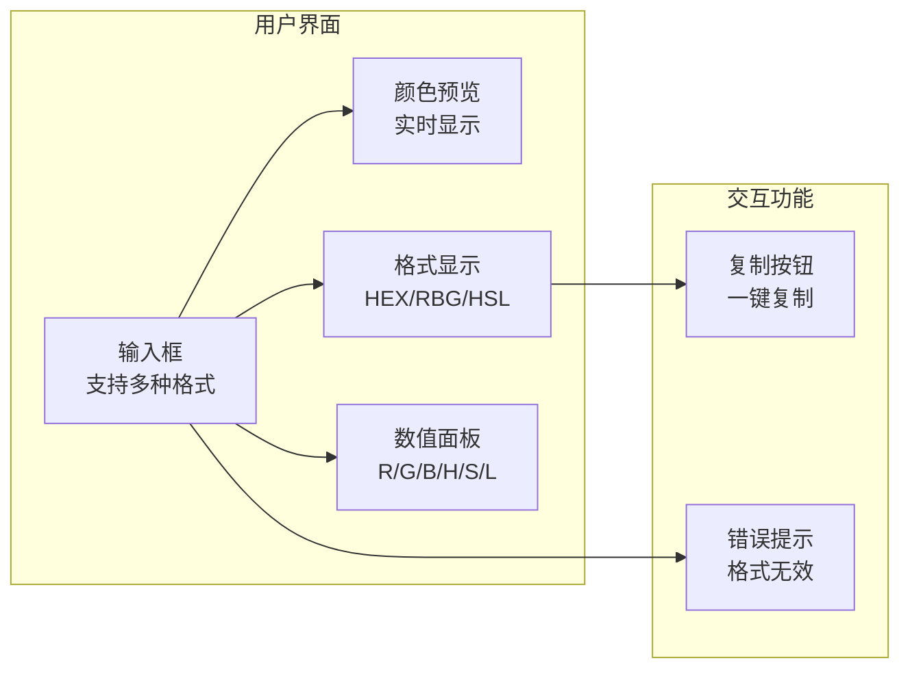
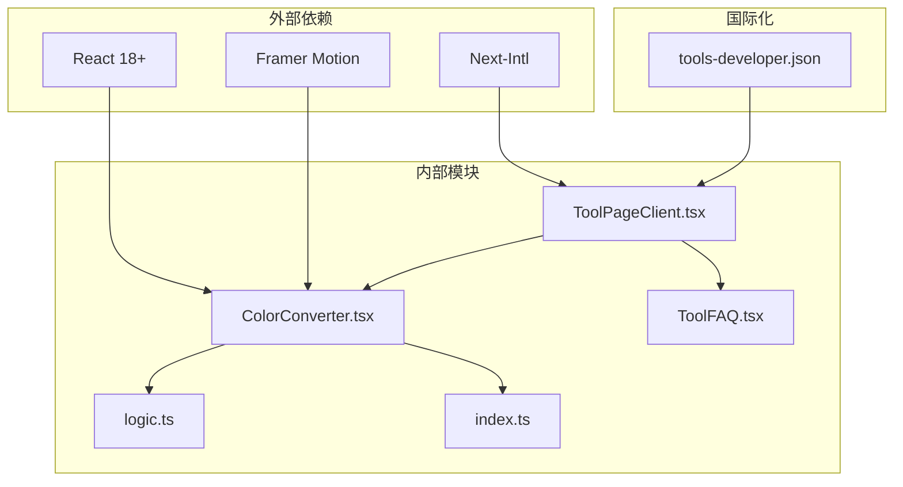

# 颜色转换工具

<cite>
**本文档引用的文件**
- [ColorConverter.tsx](file://src/tools/developer/color-converter/ColorConverter.tsx)
- [logic.ts](file://src/tools/developer/color-converter/logic.ts)
- [index.ts](file://src/tools/developer/color-converter/index.ts)
- [tools-developer.json](file://messages/en/tools-developer.json)
- [ToolPageClient.tsx](file://src/app/[locale]/tools/[category]/[slug]/ToolPageClient.tsx)
- [page.tsx](file://src/app/[locale]/tools/[category]/[slug]/page.tsx)
- [ToolFAQ.tsx](file://src/components/tool/ToolFAQ.tsx)
</cite>

## 目录
1. [简介](#简介)
2. [项目结构](#项目结构)
3. [核心组件](#核心组件)
4. [架构概览](#架构概览)
5. [详细组件分析](#详细组件分析)
6. [颜色理论基础](#颜色理论基础)
7. [颜色空间转换详解](#颜色空间转换详解)
8. [使用示例与应用场景](#使用示例与应用场景)
9. [依赖关系分析](#依赖关系分析)
10. [性能考虑](#性能考虑)
11. [故障排除指南](#故障排除指南)
12. [结论](#结论)

## 简介

颜色转换工具是一个功能强大的在线颜色格式转换器，支持在十六进制（HEX）、RGB数值和HSL角度格式之间进行实时转换。该工具采用纯JavaScript实现，所有处理都在浏览器端完成，确保用户隐私和数据安全。

该工具专为前端开发者、UI/UX设计师和品牌管理者设计，提供了直观的颜色转换界面，支持实时预览功能，让用户能够即时看到颜色转换的效果。工具支持不透明颜色格式，未来计划添加透明度支持。

## 项目结构

颜色转换工具位于媒体工具箱项目的开发者工具类别中，采用模块化架构设计：



**图表来源**
- [ColorConverter.tsx:1-99](file://src/tools/developer/color-converter/ColorConverter.tsx#L1-L99)
- [logic.ts:1-114](file://src/tools/developer/color-converter/logic.ts#L1-L114)
- [index.ts:1-37](file://src/tools/developer/color-converter/index.ts#L1-L37)

**章节来源**
- [ColorConverter.tsx:1-99](file://src/tools/developer/color-converter/ColorConverter.tsx#L1-L99)
- [logic.ts:1-114](file://src/tools/developer/color-converter/logic.ts#L1-L114)
- [index.ts:1-37](file://src/tools/developer/color-converter/index.ts#L1-L37)

## 核心组件

### 主界面组件 (ColorConverter)

主界面组件采用React Hooks模式，实现了完整的颜色转换功能：

- **状态管理**: 使用useState和useMemo管理输入状态和计算结果
- **实时转换**: 输入变更时自动触发颜色转换
- **格式支持**: 自动识别和转换HEX、RGB、HSL格式
- **用户反馈**: 提供颜色预览和错误提示功能

### 转换逻辑模块 (logic)

转换逻辑模块提供了完整的颜色空间转换算法：

- **输入解析**: 支持多种颜色格式的输入解析
- **数学转换**: 实现RGB到HSL的精确转换算法
- **格式标准化**: 统一输出格式和数值范围
- **边界处理**: 处理颜色值的边界情况和异常输入

**章节来源**
- [ColorConverter.tsx:8-99](file://src/tools/developer/color-converter/ColorConverter.tsx#L8-L99)
- [logic.ts:13-46](file://src/tools/developer/color-converter/logic.ts#L13-L46)

## 架构概览

颜色转换工具采用前后端分离的架构设计，所有计算在客户端完成：



**图表来源**
- [ColorConverter.tsx:12-15](file://src/tools/developer/color-converter/ColorConverter.tsx#L12-L15)
- [logic.ts:48-67](file://src/tools/developer/color-converter/logic.ts#L48-L67)

## 详细组件分析

### 颜色解析器 (parseColor)

颜色解析器负责识别和解析用户输入的颜色格式：



**图表来源**
- [logic.ts:13-46](file://src/tools/developer/color-converter/logic.ts#L13-L46)

### 颜色值构建器 (buildColorValues)

颜色值构建器负责将RGB值转换为各种格式：



**图表来源**
- [logic.ts:48-67](file://src/tools/developer/color-converter/logic.ts#L48-L67)
- [logic.ts:69-86](file://src/tools/developer/color-converter/logic.ts#L69-L86)

**章节来源**
- [logic.ts:48-114](file://src/tools/developer/color-converter/logic.ts#L48-L114)

### 用户界面组件

用户界面组件提供了直观的交互体验：



**图表来源**
- [ColorConverter.tsx:25-98](file://src/tools/developer/color-converter/ColorConverter.tsx#L25-L98)

**章节来源**
- [ColorConverter.tsx:25-98](file://src/tools/developer/color-converter/ColorConverter.tsx#L25-L98)

## 颜色理论基础

### 色彩模型概述

颜色转换工具基于三种主要的色彩模型：

1. **RGB模型**: 基于红、绿、蓝三原色的加色模型
2. **HSL模型**: 基于色相、饱和度、亮度的颜色表示
3. **HEX模型**: 十六进制颜色编码系统

### 颜色空间特点

| 颜色空间 | 基础原理 | 应用场景 | 优势 |
|---------|---------|---------|------|
| RGB | 加色混合 | 屏显设备 | 直观的数值范围 |
| HSL | 人类感知 | 设计应用 | 符合视觉认知 |
| HEX | 十六进制编码 | Web开发 | 简洁的代码表示 |

### 颜色属性解释

- **色相 (Hue)**: 颜色的基本类型，0-360°表示
- **饱和度 (Saturation)**: 颜色的纯度，0-100%表示
- **亮度 (Lightness)**: 颜色的明暗程度，0-100%表示
- **红绿蓝 (RGB)**: 三基色的强度值，0-255表示

## 颜色空间转换详解

### RGB到HSL转换算法

RGB到HSL的转换涉及复杂的数学计算：

```mermaid
flowchart TD
RGB[RGB输入<br/>r,g,b ∈ [0,255]] --> Normalize[归一化<br/>r/=255, g/=255, b/=255]
Normalize --> MaxMin[计算最大最小值<br/>max=max(r,g,b), min=min(r,g,b)]
MaxMin --> Lightness[计算亮度<br/>L=(max+min)/2]
Lightness --> CheckEqual{max==min?}
CheckEqual --> |是| HSLGray[HSL灰色<br/>H=0, S=0]
CheckEqual --> |否| Delta[计算色差<br/>Δ=max-min]
Delta --> Saturation[计算饱和度<br/>S=Δ/(1-|2L-1|)]
Saturation --> Hue[计算色相<br/>根据max值分支计算]
Hue --> Output[HSL输出<br/>H∈[0,360], S,L∈[0,100]]
```

**图表来源**
- [logic.ts:69-86](file://src/tools/developer/color-converter/logic.ts#L69-L86)

### HSL到RGB转换算法

HSL到RGB的转换使用调色板算法：

```mermaid
algorithm
### HSL到RGB转换步骤
1. **输入归一化**
- h = H/360
- s = S/100
- l = L/100
2. **特殊情况处理**
- 如果 s = 0，则 R=G=B=l
3. **计算中间值**
- q = if(l < 0.5) l*(1+s) else l+s-l*s
- p = 2*l - q
4. **计算RGB分量**
- R = hue2rgb(p, q, h+1/3)
- G = hue2rgb(p, q, h)
- B = hue2rgb(p, q, h-1/3)
```

**图表来源**
- [logic.ts:88-113](file://src/tools/developer/color-converter/logic.ts#L88-L113)

**章节来源**
- [logic.ts:69-113](file://src/tools/developer/color-converter/logic.ts#L69-L113)

## 使用示例与应用场景

### 常见使用场景

#### 1. CSS开发中的颜色转换

```javascript
// 从设计稿获取HEX颜色
const designColor = "#3B82F6";

// 转换为RGB用于CSS滤镜
const rgbColor = parseColor(designColor);
console.log(rgbColor.rgb); // rgb(59, 130, 246)

// 调整亮度生成主题色
const lighterColor = adjustLightness(rgbColor.hsl, 20);
```

#### 2. 品牌色彩管理

```javascript
// 统一品牌色彩格式
const brandColors = {
  primary: "#10B981",
  secondary: "#8B5CF6",
  accent: "#F59E0B"
};

// 转换为HSL便于调整
Object.keys(brandColors).forEach(key => {
  const hsl = parseColor(brandColors[key]).hsl;
  console.log(`${key}: ${hsl}`);
});
```

#### 3. 主题定制

```javascript
// 生成明暗主题
function generateTheme(baseColor, isDark = false) {
  const color = parseColor(baseColor);
  const lightnessAdjustment = isDark ? 30 : -30;
  const themedColor = adjustLightness(color.hsl, lightnessAdjustment);
  return themedColor;
}

const darkTheme = generateTheme("#3B82F6", true);
const lightTheme = generateTheme("#3B82F6", false);
```

### 颜色对比度计算

虽然当前版本不直接提供对比度计算，但可以通过以下方式实现：

```javascript
// 计算颜色对比度的辅助函数
function calculateContrastRatio(color1, color2) {
  const luminance1 = getLuminance(color1);
  const luminance2 = getLuminance(color2);
  return (Math.max(luminance1, luminance2) + 0.05) / (Math.min(luminance1, luminance2) + 0.05);
}

function getLuminance(hexColor) {
  const rgb = parseColor(hexColor);
  // 使用标准相对亮度公式
  return 0.2126 * rgb.r + 0.7152 * rgb.g + 0.0722 * rgb.b;
}
```

### 色彩和谐理论应用

#### 1. 单色调配色方案
- 选择一个基本色
- 通过调整亮度生成渐变
- 适用于简洁、专业的设计

#### 2. 互补色配色方案  
- 选择色相差180°的颜色
- 提供强烈的视觉对比
- 适用于需要突出重点的设计

#### 3. 三分色配色方案
- 在色轮上等距分布的三种颜色
- 平衡且富有活力
- 适用于动态、现代的设计

**章节来源**
- [tools-developer.json:326-370](file://messages/en/tools-developer.json#L326-L370)

## 依赖关系分析

### 组件依赖关系



**图表来源**
- [ToolPageClient.tsx:1-59](file://src/app/[locale]/tools/[category]/[slug]/ToolPageClient.tsx#L1-L59)
- [page.tsx:1-109](file://src/app/[locale]/tools/[category]/[slug]/page.tsx#L1-L109)

### 性能优化策略

1. **懒加载组件**: 使用React.lazy实现按需加载
2. **状态缓存**: useMemo避免重复计算
3. **事件防抖**: 减少频繁输入的计算开销
4. **虚拟化列表**: 处理大量颜色历史记录

**章节来源**
- [ToolPageClient.tsx:26-42](file://src/app/[locale]/tools/[category]/[slug]/ToolPageClient.tsx#L26-L42)
- [ColorConverter.tsx:12-15](file://src/tools/developer/color-converter/ColorConverter.tsx#L12-L15)

## 性能考虑

### 计算复杂度分析

- **颜色解析**: O(1) - 固定的正则表达式匹配
- **RGB到HSL转换**: O(1) - 基本数学运算
- **HSL到RGB转换**: O(1) - 调色板算法
- **界面更新**: O(n) - n为显示的格式数量

### 内存使用优化

1. **对象池**: 复用ColorValues对象
2. **字符串缓存**: 缓存格式化后的字符串
3. **事件监听**: 合理管理DOM事件绑定

### 浏览器兼容性

- 支持现代浏览器的ES6+语法
- 使用Web标准API确保跨平台兼容
- 提供降级方案处理不支持的功能

## 故障排除指南

### 常见问题及解决方案

#### 1. 颜色格式识别失败

**问题**: 输入的颜色值无法被识别
**解决方法**:
- 检查格式是否符合规范
- 确认颜色值在有效范围内
- 验证十六进制格式的正确性

#### 2. 转换结果不准确

**问题**: 颜色转换出现偏差
**解决方法**:
- 确认输入格式的正确性
- 检查数值范围的有效性
- 验证浏览器的JavaScript引擎

#### 3. 界面显示异常

**问题**: 颜色预览或格式显示不正确
**解决方法**:
- 刷新页面重新加载
- 检查浏览器的JavaScript功能
- 清除浏览器缓存后重试

### 调试技巧

1. **控制台日志**: 使用console.log输出中间结果
2. **单元测试**: 为转换函数编写测试用例
3. **边界测试**: 测试极端颜色值的处理

**章节来源**
- [ColorConverter.tsx:38-42](file://src/tools/developer/color-converter/ColorConverter.tsx#L38-L42)

## 结论

颜色转换工具是一个功能完善、性能优秀的在线颜色格式转换器。它基于纯JavaScript实现，确保了用户隐私和数据安全，同时提供了直观易用的界面和准确的转换算法。

### 主要优势

1. **隐私保护**: 所有处理在浏览器端完成
2. **实时反馈**: 即时的颜色预览和转换结果
3. **格式多样**: 支持HEX、RGB、HSL等多种格式
4. **用户体验**: 简洁直观的界面设计
5. **国际化支持**: 多语言界面和文档

### 技术特色

- 基于React Hooks的状态管理
- 纯数学算法实现的颜色转换
- 模块化的代码结构设计
- 完善的国际化支持体系

### 发展方向

未来版本计划添加的功能：
- RGBA和HSLA透明度支持
- 颜色对比度计算功能
- 颜色和谐理论应用
- 批量颜色处理能力
- 颜色历史记录管理

该工具为前端开发、UI设计和品牌管理提供了强有力的技术支持，是现代数字内容创作不可或缺的工具之一。