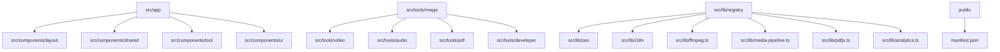
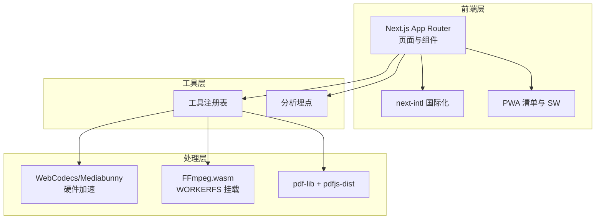
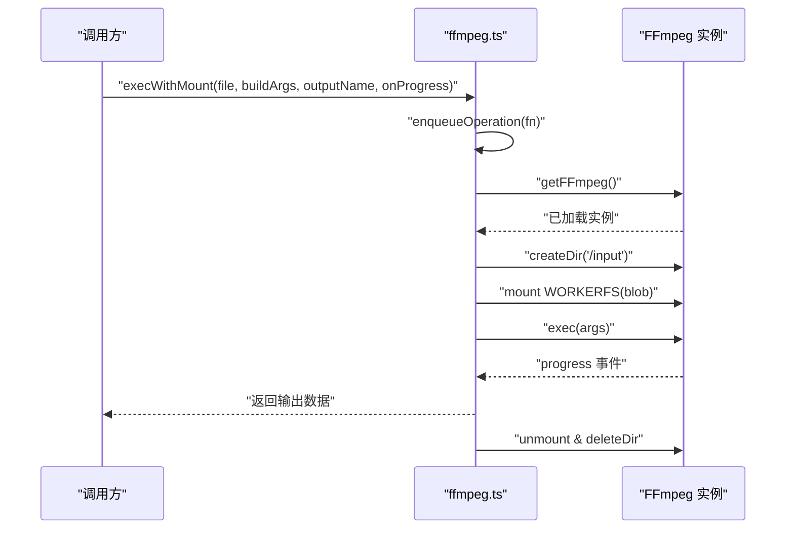
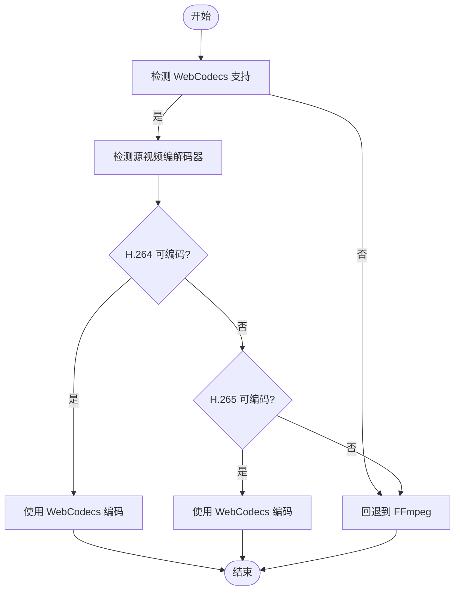
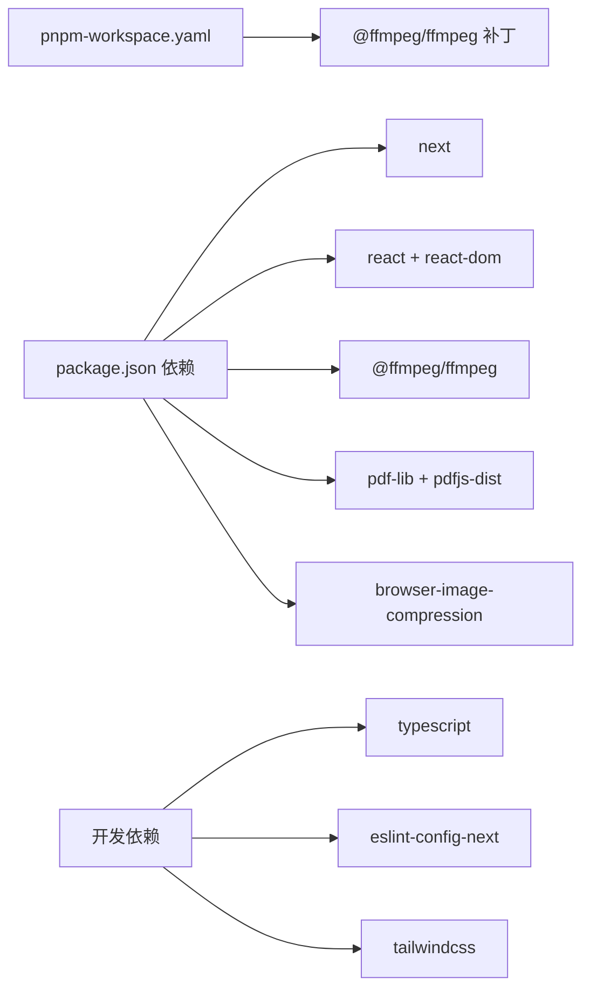

# 快速开始

<cite>
**本文引用的文件**
- [README.md](file://README.md)
- [package.json](file://package.json)
- [next.config.ts](file://next.config.ts)
- [eslint.config.mjs](file://eslint.config.mjs)
- [tsconfig.json](file://tsconfig.json)
- [postcss.config.mjs](file://postcss.config.mjs)
- [pnpm-workspace.yaml](file://pnpm-workspace.yaml)
- [patches/@ffmpeg__ffmpeg@0.12.15.patch](file://patches/@ffmpeg__ffmpeg@0.12.15.patch)
- [src/lib/ffmpeg.ts](file://src/lib/ffmpeg.ts)
- [src/lib/media-pipeline.ts](file://src/lib/media-pipeline.ts)
- [src/lib/pdfjs.ts](file://src/lib/pdfjs.ts)
- [src/lib/analytics.ts](file://src/lib/analytics.ts)
- [src/app/layout.tsx](file://src/app/layout.tsx)
- [public/manifest.json](file://public/manifest.json)
</cite>

## 目录
1. [简介](#简介)
2. [项目结构](#项目结构)
3. [核心组件](#核心组件)
4. [架构总览](#架构总览)
5. [详细组件分析](#详细组件分析)
6. [依赖分析](#依赖分析)
7. [性能考虑](#性能考虑)
8. [故障排除指南](#故障排除指南)
9. [结论](#结论)
10. [附录](#附录)

## 简介
媒体工具箱是一个基于浏览器的隐私优先型多媒体处理工具集合，所有处理均在本地完成，不上传任何文件。项目采用 Next.js 16 App Router、TypeScript、Tailwind CSS v4，并通过 FFmpeg.wasm、pdf-lib + pdfjs-dist、browser-image-compression 等库实现图片、视频、音频、PDF 和开发者工具的在线处理。项目支持 21 种语言，具备暗色模式、离线 PWA、SEO 友好与静态生成能力。

## 项目结构
本项目采用按功能域划分的目录组织方式，便于扩展与维护。核心目录与职责如下：
- src/app：Next.js App Router 页面与布局
- src/components：布局、共享组件、工具壳与基础 UI 组件
- src/tools：按类别划分的工具模块（image、video、audio、pdf、developer）
- src/lib：工具注册表、SEO、国际化、媒体处理（FFmpeg、WebCodecs/Mediabunny）、PDFJS、分析埋点等
- public：静态资源与 PWA 清单
- scripts：构建脚本（如清理 RSC 缓存）
- messages：多语言翻译文件（21 个 locale）

图表来源
- [src/app/layout.tsx:1-48](file://src/app/layout.tsx#L1-L48)
- [src/lib/ffmpeg.ts:1-144](file://src/lib/ffmpeg.ts#L1-L144)
- [src/lib/media-pipeline.ts:1-175](file://src/lib/media-pipeline.ts#L1-L175)
- [src/lib/pdfjs.ts:1-16](file://src/lib/pdfjs.ts#L1-L16)
- [src/lib/analytics.ts:1-138](file://src/lib/analytics.ts#L1-L138)
- [public/manifest.json:1-29](file://public/manifest.json#L1-L29)

章节来源
- [README.md:55-78](file://README.md#L55-L78)

## 核心组件
- 媒体处理管线
  - FFmpeg.wasm 单例加载与队列执行，避免并发冲突与内存拷贝
  - WebCodecs/Mediabunny 作为硬件加速替代方案，自动回退至 FFmpeg
- PDF 处理
  - pdfjs-dist Worker 配置与懒加载
- 分析埋点
  - Google Analytics 事件追踪，严格控制敏感字段长度
- 国际化与 SEO
  - next-intl 插件与静态导出配置，PWA 清单与元数据

章节来源
- [src/lib/ffmpeg.ts:1-144](file://src/lib/ffmpeg.ts#L1-L144)
- [src/lib/media-pipeline.ts:1-175](file://src/lib/media-pipeline.ts#L1-L175)
- [src/lib/pdfjs.ts:1-16](file://src/lib/pdfjs.ts#L1-L16)
- [src/lib/analytics.ts:1-138](file://src/lib/analytics.ts#L1-L138)
- [next.config.ts:1-13](file://next.config.ts#L1-L13)
- [public/manifest.json:1-29](file://public/manifest.json#L1-L29)

## 架构总览
项目采用“浏览器端本地处理 + 静态导出”的架构。媒体处理通过 FFmpeg.wasm 或 WebCodecs/Mediabunny 执行；国际化与 SEO 由 next-intl 与静态导出配置保障；PWA 通过清单与 Service Worker 提供离线能力。

图表来源
- [src/lib/media-pipeline.ts:1-175](file://src/lib/media-pipeline.ts#L1-L175)
- [src/lib/ffmpeg.ts:1-144](file://src/lib/ffmpeg.ts#L1-L144)
- [src/lib/pdfjs.ts:1-16](file://src/lib/pdfjs.ts#L1-L16)
- [src/lib/analytics.ts:1-138](file://src/lib/analytics.ts#L1-L138)
- [next.config.ts:1-13](file://next.config.ts#L1-L13)
- [public/manifest.json:1-29](file://public/manifest.json#L1-L29)

## 详细组件分析

### FFmpeg.wasm 加载与执行
- 单例加载与错误恢复：首次加载失败会终止并抛出异常，避免重复尝试
- 进度事件绑定：统一设置/移除进度回调，防止泄漏
- 任务队列：串行执行所有 FFmpeg 操作，规避并发冲突
- WORKERFS 挂载：直接挂载 File 对象，避免内存复制，降低峰值占用

图表来源
- [src/lib/ffmpeg.ts:99-142](file://src/lib/ffmpeg.ts#L99-L142)

章节来源
- [src/lib/ffmpeg.ts:1-144](file://src/lib/ffmpeg.ts#L1-L144)

### WebCodecs/Mediabunny 硬件加速路径
- 能力检测：编码器/解码器存在性判断
- 视频编解码器检测：H.264/H.265 能力查询与源视频编解码器识别
- 回退策略：当 WebCodecs 无法处理或性能不佳时回退至 FFmpeg

图表来源
- [src/lib/media-pipeline.ts:7-141](file://src/lib/media-pipeline.ts#L7-L141)

章节来源
- [src/lib/media-pipeline.ts:1-175](file://src/lib/media-pipeline.ts#L1-L175)

### PDF 处理与 Worker 配置
- 懒加载 pdfjs-dist 并配置 Worker 路径
- 避免重复配置，保证全局唯一

章节来源
- [src/lib/pdfjs.ts:1-16](file://src/lib/pdfjs.ts#L1-L16)

### 分析埋点与隐私保护
- 事件参数接口化，统一追踪
- 敏感字段截断，避免记录文件名等信息
- 工具级追踪工厂，简化调用

章节来源
- [src/lib/analytics.ts:1-138](file://src/lib/analytics.ts#L1-L138)

### 国际化与静态导出
- next-intl 插件集成
- 静态导出、图片未优化、尾斜杠配置

章节来源
- [next.config.ts:1-13](file://next.config.ts#L1-L13)

## 依赖分析
- 包管理器：推荐使用 pnpm，工作区包含对 @ffmpeg/ffmpeg 的补丁
- 运行时依赖：Next.js、React、FFmpeg.wasm、pdf-lib、pdfjs-dist、browser-image-compression、tesseract.js 等
- 开发依赖：TypeScript、Tailwind CSS v4、ESLint Next 配置、类型声明等

图表来源
- [pnpm-workspace.yaml:1-3](file://pnpm-workspace.yaml#L1-L3)
- [patches/@ffmpeg__ffmpeg@0.12.15.patch:1-14](file://patches/@ffmpeg__ffmpeg@0.12.15.patch#L1-L14)
- [package.json:11-43](file://package.json#L11-L43)

章节来源
- [package.json:1-45](file://package.json#L1-L45)
- [pnpm-workspace.yaml:1-3](file://pnpm-workspace.yaml#L1-L3)
- [patches/@ffmpeg__ffmpeg@0.12.15.patch:1-14](file://patches/@ffmpeg__ffmpeg@0.12.15.patch#L1-L14)

## 性能考虑
- 媒体处理
  - 使用 WORKERFS 挂载避免内存拷贝，降低峰值内存
  - 串行队列执行，避免并发冲突导致的性能抖动
  - WebCodecs 优先，硬件加速显著提升处理速度
- 构建与导出
  - 静态导出（export）减少运行时开销，适合 Cloudflare Pages 部署
  - Tailwind CSS v4 与按需引入优化样式体积
- 代码质量
  - ESLint Next 配置与自定义忽略规则，保持代码一致性

章节来源
- [src/lib/ffmpeg.ts:99-142](file://src/lib/ffmpeg.ts#L99-L142)
- [src/lib/media-pipeline.ts:1-175](file://src/lib/media-pipeline.ts#L1-L175)
- [next.config.ts:6-10](file://next.config.ts#L6-L10)
- [eslint.config.mjs:1-19](file://eslint.config.mjs#L1-L19)

## 故障排除指南
- 安装与依赖
  - 使用 pnpm 并应用工作区补丁以修复 @ffmpeg/ffmpeg 的兼容性问题
  - 若遇到 FFmpeg 加载失败，检查 CDN 可达性与网络代理
- 开发服务器
  - 确认 Node.js 版本满足项目需求（TypeScript 5、Next.js 16）
  - 如需更快的热重载，使用 pnpm dev（Turbopack）
- 构建与导出
  - 静态导出模式下，确保图片未优化与尾斜杠配置正确
  - 构建产物输出到 out/ 目录，可直接部署到静态托管平台
- 代码检查
  - 使用 pnpm lint 运行 ESLint，遵循 Next.js 最佳实践
- 浏览器兼容性
  - WebCodecs 不可用时自动回退至 FFmpeg
  - Windows 上可提示安装 HEVC 扩展以启用硬件解码

章节来源
- [README.md:35-49](file://README.md#L35-L49)
- [pnpm-workspace.yaml:1-3](file://pnpm-workspace.yaml#L1-L3)
- [patches/@ffmpeg__ffmpeg@0.12.15.patch:1-14](file://patches/@ffmpeg__ffmpeg@0.12.15.patch#L1-L14)
- [next.config.ts:6-10](file://next.config.ts#L6-L10)
- [eslint.config.mjs:1-19](file://eslint.config.mjs#L1-L19)
- [src/lib/media-pipeline.ts:98-104](file://src/lib/media-pipeline.ts#L98-L104)

## 结论
媒体工具箱提供了完整的浏览器端媒体处理能力，结合硬件加速与静态导出，兼顾性能与隐私。通过清晰的目录结构与模块化设计，开发者可以快速添加新工具并维护多语言支持。建议优先使用 pnpm 与提供的补丁，配合 ESLint 与静态导出配置，获得最佳开发与部署体验。

## 附录

### 环境设置与安装
- Node.js 版本：满足 TypeScript 5 与 Next.js 16 的最低要求
- 包管理器：推荐 pnpm
- 依赖安装：使用 pnpm install
- 启动开发服务器：pnpm dev
- 构建静态站点：pnpm build
- 代码检查：pnpm lint

章节来源
- [README.md:35-49](file://README.md#L35-L49)
- [package.json:5-10](file://package.json#L5-L10)

### 开发服务器与构建流程
- 开发服务器：Next.js dev（Turbopack），默认端口 3000
- 构建命令：Next.js build，输出静态文件到 out/
- 部署：Cloudflare Pages 等静态托管服务

章节来源
- [README.md:41-53](file://README.md#L41-L53)
- [package.json:6-8](file://package.json#L6-L8)
- [next.config.ts:7-10](file://next.config.ts#L7-L10)

### 项目配置选项
- 静态导出：output: "export"
- 图片优化：images.unoptimized: true
- 尾斜杠：trailingSlash: true
- ESLint：继承 eslint-config-next，自定义忽略规则

章节来源
- [next.config.ts:6-10](file://next.config.ts#L6-L10)
- [eslint.config.mjs:1-19](file://eslint.config.mjs#L1-L19)

### 常见开发任务示例
- 启动热重载服务器：pnpm dev
- 运行代码检查：pnpm lint
- 构建生产版本：pnpm build
- 预览静态导出：pnpm start（在 out/ 目录）

章节来源
- [README.md:35-49](file://README.md#L35-L49)
- [package.json:5-10](file://package.json#L5-L10)

### 添加新工具的步骤
- 在对应分类目录创建工具目录与文件
- 在工具注册表中注册新工具
- 为全部 21 个 locale 添加翻译键值

章节来源
- [README.md:80-84](file://README.md#L80-L84)