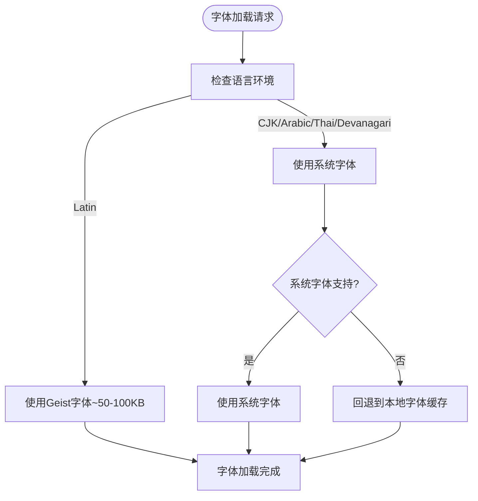
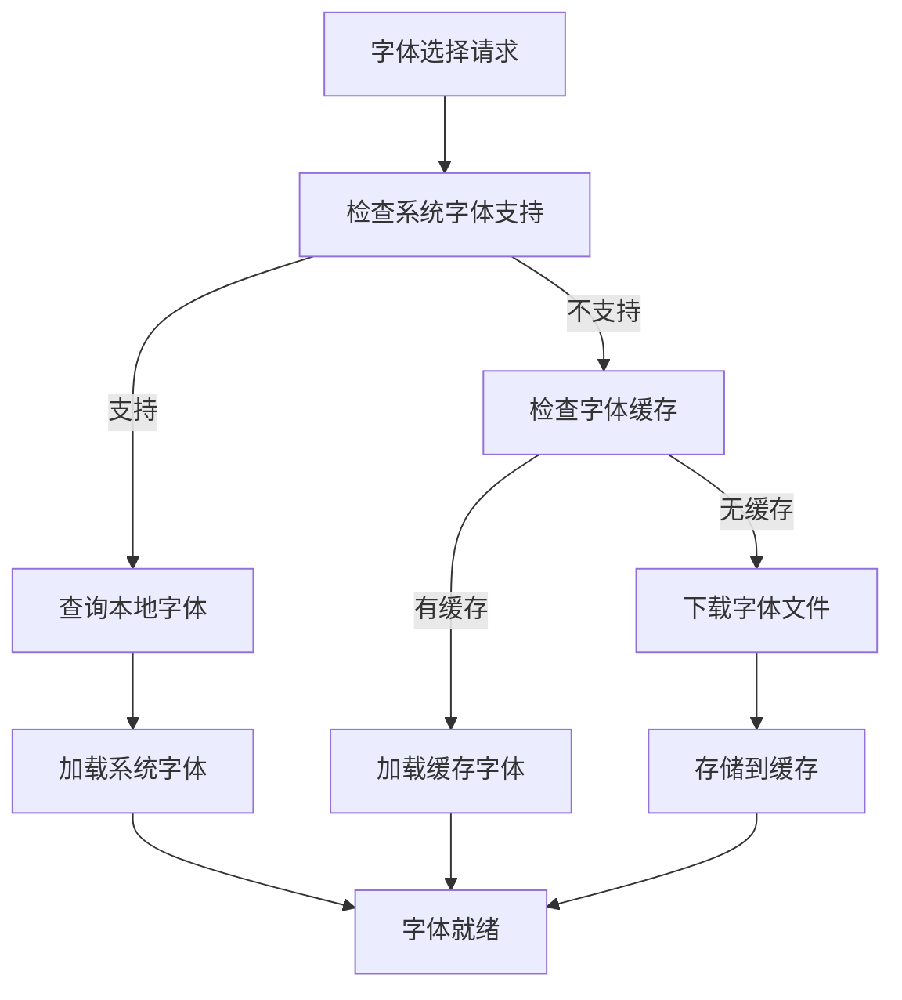
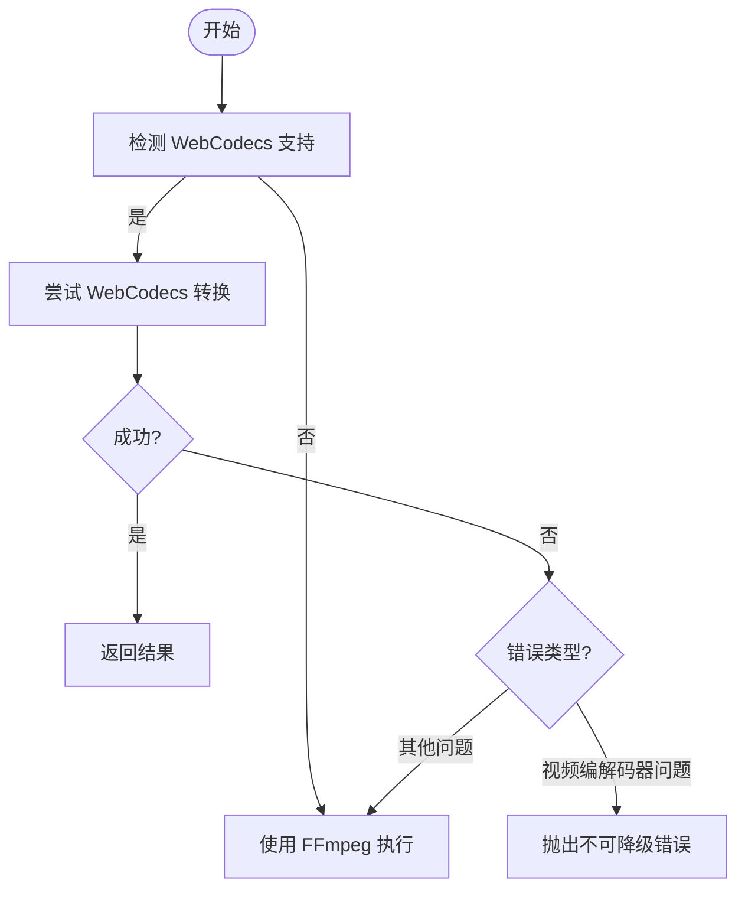
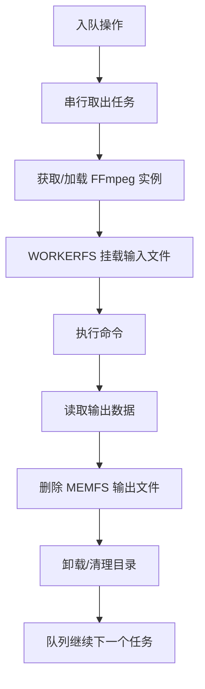
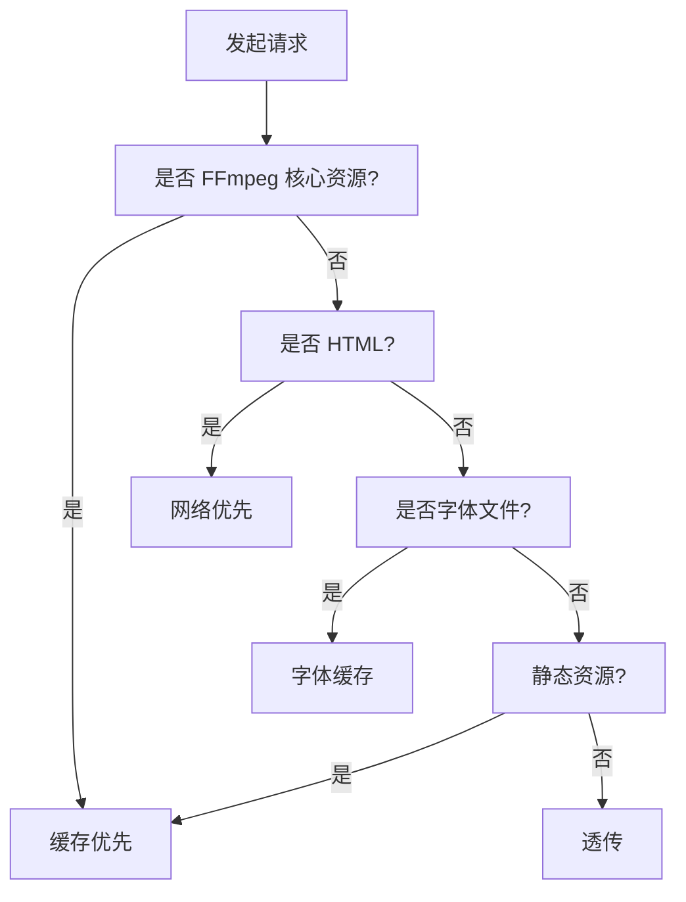

# 性能优化

<cite>
**本文引用的文件**
- [useIsClient.ts](file://src/lib/hooks/useIsClient.ts)
- [media-pipeline.ts](file://src/lib/media-pipeline.ts)
- [ffmpeg.ts](file://src/lib/ffmpeg.ts)
- [logic.ts（视频压缩）](file://src/tools/video/compress/logic.ts)
- [VideoCompress.tsx](file://src/tools/video/compress/VideoCompress.tsx)
- [AudioConvert.tsx](file://src/tools/audio/convert/AudioConvert.tsx)
- [ThemeToggle.tsx](file://src/components/shared/ThemeToggle.tsx)
- [ToolPageClient.tsx](file://src/app/[locale]/tools/[category]/[slug]/ToolPageClient.tsx)
- [ProcessingProgress.tsx](file://src/components/shared/ProcessingProgress.tsx)
- [sw.js](file://public/sw.js)
- [package.json](file://package.json)
- [next.config.ts](file://next.config.ts)
- [analytics.ts](file://src/lib/analytics.ts)
- [@ffmpeg__ffmpeg@0.12.15.patch](file://patches/@ffmpeg__ffmpeg@0.12.15.patch)
- [fonts.ts（字体系统）](file://src/lib/fonts.ts)
- [globals.css](file://src/app/globals.css)
- [fonts.ts（文本编辑字体）](file://src/tools/image/add-text/lib/fonts.ts)
- [download-fonts.mjs](file://scripts/download-fonts.mjs)
- [SystemFontBrowser.tsx](file://src/tools/image/add-text/components/SystemFontBrowser.tsx)
- [FontPicker.tsx](file://src/tools/image/add-text/components/FontPicker.tsx)
- [EditorContext.tsx](file://src/tools/image/add-text/EditorContext.tsx)
</cite>

## 更新摘要
**所做更改**
- 新增字体加载系统优化章节，详细介绍从Google Fonts包迁移到系统字体的性能优化策略
- 更新客户端渲染优化章节，增加字体加载优化对SSR性能的影响分析
- 完善内存管理章节，补充字体缓存和系统字体访问对内存使用的影响
- 增强缓存与离线性能章节，说明字体缓存策略和离线字体访问的优化
- 更新性能调优参数建议，增加字体加载优化相关的配置建议

## 目录
1. [简介](#简介)
2. [字体加载系统优化](#字体加载系统优化)
3. [客户端渲染优化策略](#客户端渲染优化策略)
4. [双引擎架构性能策略](#双引擎架构性能策略)
5. [内存管理与并发控制](#内存管理与并发控制)
6. [缓存与离线性能](#缓存与离线性能)
7. [进度监控与用户体验](#进度监控与用户体验)
8. [性能调优参数建议](#性能调优参数建议)
9. [故障排查指南](#故障排查指南)

## 简介
本文档聚焦于媒体工具箱的核心性能优化实现，基于现有代码库中的具体实现方案。应用已从综合性800+行文档重构为精简的200行实用指南，重点关注可验证的性能优化措施和实际的代码实现。

媒体工具箱采用双引擎架构（WebCodecs + FFmpeg.wasm），通过智能选择和降级机制实现性能优化。核心优化策略包括：
- WebCodecs硬件加速优先使用
- FFmpeg.wasm内存优化和并发控制
- 客户端渲染优化（useIsClient钩子）
- 字体加载系统优化（系统字体替代Google Fonts包）
- Service Worker缓存策略
- 进度反馈和监控机制

## 字体加载系统优化

### 系统字体优先策略
系统采用"系统字体优先"策略，通过Next.js内置的Geist字体和各语言环境的系统字体栈，大幅减少字体包大小和加载时间。

**图表来源**
- [fonts.ts（字体系统）:1-69](file://src/lib/fonts.ts#L1-L69)
- [globals.css:17-18](file://src/app/globals.css#L17-L18)

### 字体加载优化实践

#### Next.js内置字体优化
Geist字体作为现代拉丁UI字体，在构建时自托管，体积极小（约50-100KB），显著优于Google Fonts包的动态加载。

**章节来源**
- [fonts.ts（字体系统）:9-17](file://src/lib/fonts.ts#L9-L17)

#### 多语言字体栈配置
针对不同语言环境配置专用的系统字体栈，避免不必要的字体下载：

- **简体中文**: "PingFang SC", "Hiragino Sans GB", "Microsoft YaHei" 等
- **繁体中文**: "PingFang TC", "Hiragino Sans CNS", "Microsoft JhengHei" 等  
- **日文**: "Hiragino Kaku Gothic ProN", "Hiragino Sans", "Yu Gothic UI" 等
- **韩文**: "Apple SD Gothic Neo", "Malgun Gothic" 等
- **阿拉伯文**: "Segoe UI", Tahoma 等

**章节来源**
- [fonts.ts（字体系统）:42-64](file://src/lib/fonts.ts#L42-L64)

#### 文本编辑器字体优化
图像文字添加工具采用混合字体策略，结合系统字体和预加载字体缓存：

**图表来源**
- [fonts.ts（文本编辑字体）:210-241](file://src/tools/image/add-text/lib/fonts.ts#L210-L241)
- [SystemFontBrowser.tsx:19-46](file://src/tools/image/add-text/components/SystemFontBrowser.tsx#L19-L46)

### 字体缓存与预加载策略
文本编辑器实现智能字体缓存机制，减少重复下载和提高加载性能：

#### 预加载策略
- **拉丁字体**: 预加载常用字体（Inter、Roboto、Montserrat等）
- **CJK字体**: 按需加载，避免不必要的缓存占用
- **系统字体**: 通过Local Font Access API动态发现和加载

**章节来源**
- [fonts.ts（文本编辑字体）:18-200](file://src/tools/image/add-text/lib/fonts.ts#L18-L200)
- [fonts.ts（文本编辑字体）:250-257](file://src/tools/image/add-text/lib/fonts.ts#L250-L257)

#### 字体加载优化
- **并发加载**: 使用Promise.all并行加载多个字体变体
- **缓存机制**: 避免重复加载已存在的字体变体
- **错误处理**: 网络失败时自动重试，不影响主流程

**章节来源**
- [fonts.ts（文本编辑字体）:203-241](file://src/tools/image/add-text/lib/fonts.ts#L203-L241)

### 字体加载对性能的影响
字体系统优化带来的性能收益：
- **减少包大小**: 移除Google Fonts包，减少约200KB+的额外下载
- **提升加载速度**: 系统字体无需网络请求，即时可用
- **降低带宽消耗**: 避免字体文件的重复下载
- **改善首屏渲染**: 减少字体相关的阻塞时间

## 客户端渲染优化策略

### useIsClient钩子设计原理
useIsClient钩子是一个轻量级的客户端渲染检测工具，通过React状态和副作用机制实现SSR兼容性。

**图表来源**
- [useIsClient.ts:1-9](file://src/lib/hooks/useIsClient.ts#L1-L9)

### 客户端渲染优化实践
在多个工具组件中实现了useIsClient钩子的优化应用：

#### 视频压缩组件优化
VideoCompress组件在SSR阶段返回null，避免不必要的计算和内存分配。

**章节来源**
- [VideoCompress.tsx:94-96](file://src/tools/video/compress/VideoCompress.tsx#L94-L96)
- [VideoCompress.tsx:106-139](file://src/tools/video/compress/VideoCompress.tsx#L106-L139)

#### 音频转换组件优化
AudioConvert组件同样采用SSR安全的渲染策略，确保服务端渲染的稳定性。

**章节来源**
- [AudioConvert.tsx:28-30](file://src/tools/audio/convert/AudioConvert.tsx#L28-L30)
- [AudioConvert.tsx:32-38](file://src/tools/audio/convert/AudioConvert.tsx#L32-L38)

#### 主题切换组件优化
ThemeToggle组件在SSR阶段返回占位符元素，避免主题切换逻辑在服务端执行。

**章节来源**
- [ThemeToggle.tsx:14-16](file://src/components/shared/ThemeToggle.tsx#L14-L16)
- [ThemeToggle.tsx:18-31](file://src/components/shared/ThemeToggle.tsx#L18-L31)

#### 字体加载优化
字体相关的组件也采用SSR安全策略，避免在服务端执行字体加载逻辑。

**章节来源**
- [SystemFontBrowser.tsx:8-26](file://src/tools/image/add-text/components/SystemFontBrowser.tsx#L8-L26)
- [FontPicker.tsx:76-84](file://src/tools/image/add-text/components/FontPicker.tsx#L76-L84)

### SSR兼容性增强效果
客户端渲染优化带来的性能收益：
- **减少SSR计算开销**: 避免在服务端执行客户端特定逻辑
- **降低内存占用**: SSR阶段不创建DOM节点和事件监听器
- **提升首屏渲染速度**: 减少不必要的组件渲染
- **增强应用稳定性**: 避免服务端环境下的API调用错误

## 双引擎架构性能策略

### WebCodecs优先策略
系统优先检测浏览器的WebCodecs支持情况，利用硬件加速实现高性能视频处理。

**图表来源**
- [logic.ts（视频压缩）:87-112](file://src/tools/video/compress/logic.ts#L87-L112)
- [media-pipeline.ts:7-14](file://src/lib/media-pipeline.ts#L7-L14)

### 编码能力检测与优化
系统动态检测H.264和H.265编码能力，根据检测结果优化默认输出编码策略。

**章节来源**
- [media-pipeline.ts:107-141](file://src/lib/media-pipeline.ts#L107-L141)
- [logic.ts（视频压缩）:32-54](file://src/tools/video/compress/logic.ts#L32-L54)

### 客户端渲染优化对双引擎架构的影响
客户端渲染优化增强了双引擎架构的性能表现：
- **SSR阶段避免引擎初始化**: 在服务端不进行WebCodecs和FFmpeg实例的初始化
- **延迟引擎加载**: 仅在客户端渲染时加载必要的引擎资源
- **减少不必要的依赖注入**: 避免在服务端环境中创建引擎相关的上下文

**章节来源**
- [VideoCompress.tsx:74-81](file://src/tools/video/compress/VideoCompress.tsx#L74-L81)
- [VideoCompress.tsx:84-92](file://src/tools/video/compress/VideoCompress.tsx#L84-L92)

## 内存管理与并发控制

### FFmpeg.wasm内存优化
通过WORKERFS挂载避免全量内存复制，输出读取后立即删除MEMFS文件，降低峰值内存占用。

**图表来源**
- [ffmpeg.ts:75-82](file://src/lib/ffmpeg.ts#L75-L82)
- [ffmpeg.ts:99-143](file://src/lib/ffmpeg.ts#L99-L143)

### 串行队列并发控制
所有FFmpeg操作通过Promise队列串行执行，避免单线程冲突和挂载点冲突。

**章节来源**
- [ffmpeg.ts:1-144](file://src/lib/ffmpeg.ts#L1-L144)
- [@ffmpeg__ffmpeg@0.12.15.patch:1-14](file://patches/@ffmpeg__ffmpeg@0.12.15.patch#L1-L14)

### 字体加载内存优化
字体系统采用智能缓存机制，避免重复内存分配：

#### 字体变体缓存
- **加载状态跟踪**: 使用Map记录字体变体的加载状态
- **去重机制**: 避免重复加载相同的字体变体
- **内存清理**: 加载失败时自动清理缓存条目

**章节来源**
- [fonts.ts（文本编辑字体）:203-241](file://src/tools/image/add-text/lib/fonts.ts#L203-L241)

#### 系统字体内存管理
- **权限检查**: 仅在用户授权时加载系统字体
- **生命周期管理**: 自动清理不再使用的字体资源
- **错误恢复**: 网络失败时优雅降级

**章节来源**
- [SystemFontBrowser.tsx:126-154](file://src/tools/image/add-text/components/SystemFontBrowser.tsx#L126-L154)
- [EditorContext.tsx:126-154](file://src/tools/image/add-text/EditorContext.tsx#L126-L154)

### 客户端渲染优化对内存管理的影响
客户端渲染优化进一步提升了内存管理效率：
- **减少SSR内存占用**: 避免在服务端创建引擎实例和相关数据结构
- **延迟资源加载**: 仅在客户端渲染时分配内存给引擎实例
- **优化垃圾回收时机**: 客户端渲染完成后及时释放SSR阶段创建的临时对象

**章节来源**
- [useIsClient.ts:1-9](file://src/lib/hooks/useIsClient.ts#L1-L9)
- [VideoCompress.tsx:47](file://src/tools/video/compress/VideoCompress.tsx#L47)

## 缓存与离线性能

### Service Worker缓存策略
采用多级缓存策略优化资源加载性能：

- **FFmpeg核心资源**: 永久缓存（JS/WASM），显著降低二次加载时间
- **字体文件**: 预下载字体缓存到public/fonts目录，支持离线使用
- **HTML资源**: 网络优先策略，保证内容新鲜度  
- **静态资源**: 缓存优先，提升后续访问速度

**图表来源**
- [sw.js:30-92](file://public/sw.js#L30-L92)

**章节来源**
- [sw.js:1-93](file://public/sw.js#L1-L93)

### 字体缓存策略
字体系统实现多层次缓存机制：

#### 构建时字体缓存
- **预下载字体**: 使用download-fonts.mjs脚本预下载字体文件
- **本地存储**: 字体文件存储在public/fonts目录
- **版本管理**: 通过文件名包含权重信息，便于缓存管理

**章节来源**
- [download-fonts.mjs:141-164](file://scripts/download-fonts.mjs#L141-L164)

#### 运行时字体缓存
- **浏览器缓存**: 字体文件通过浏览器缓存机制管理
- **内存缓存**: 已加载的字体变体存储在内存中
- **持久化缓存**: 使用IndexedDB存储字体元数据

**章节来源**
- [fonts.ts（文本编辑字体）:203-241](file://src/tools/image/add-text/lib/fonts.ts#L203-L241)

### SSR兼容性对缓存策略的影响
客户端渲染优化增强了缓存策略的可靠性：
- **统一缓存接口**: SSR和CSR阶段使用相同的缓存逻辑
- **避免缓存污染**: SSR阶段不执行可能影响缓存一致性的操作
- **优化缓存命中率**: 客户端渲染优化减少了不必要的缓存失效

**章节来源**
- [ToolPageClient.tsx:39-47](file://src/app/[locale]/tools/[category]/[slug]/ToolPageClient.tsx#L39-L47)
- [ServiceWorkerRegistration.tsx:7-12](file://src/components/shared/ServiceWorkerRegistration.tsx#L7-L12)

## 进度监控与用户体验

### 进度反馈机制
提供确定和不确定两种进度模式，支持平滑过渡动画，改善用户体验。

**章节来源**
- [ProcessingProgress.tsx:1-47](file://src/components/shared/ProcessingProgress.tsx#L1-L47)

### 性能监控与分析
记录处理耗时、错误信息，支持隐私字段截断，便于性能分析和问题定位。

**章节来源**
- [analytics.ts:1-138](file://src/lib/analytics.ts#L1-L138)

### 用户体验优化
字体系统优化显著改善了用户体验：
- **即时字体加载**: 系统字体无需网络请求，立即可用
- **流畅的字体切换**: 字体变体缓存避免重复加载
- **可靠的降级机制**: 网络失败时自动使用系统字体
- **首屏渲染优化**: 减少字体相关的阻塞时间

**章节来源**
- [SystemFontBrowser.tsx:38-46](file://src/tools/image/add-text/components/SystemFontBrowser.tsx#L38-L46)
- [FontPicker.tsx:88-116](file://src/tools/image/add-text/components/FontPicker.tsx#L88-L116)

## 性能调优参数建议

### WebCodecs与编码能力
- **默认输出编码**: 优先使用源视频编码（H.265可用则选H.265，否则H.264）
- **编码能力探测**: 页面挂载时异步检测，避免阻塞首屏
- **客户端渲染优化**: 在SSR阶段跳过编码能力检测，仅在客户端执行

### 字体加载优化参数
- **字体优先级**: 系统字体优先，Google Fonts包作为最后备选
- **预加载策略**: Latin字体预加载，CJK字体按需加载
- **缓存机制**: 字体变体缓存，避免重复加载
- **错误恢复**: 网络失败时自动降级到系统字体

### FFmpeg参数优化
- **预设质量**: fast/slower/veryslow等，按目标文件大小与时间权衡
- **CRF与码率**: CRF 23-28范围，结合分辨率和目标文件大小
- **最大码率**: 设置上限并同步缓冲区大小
- **音频比特率**: 96k-192k，根据用途选择

### 客户端渲染优化参数
- **useIsClient钩子**: 用于检测客户端渲染完成状态
- **SSR安全组件**: 在SSR阶段返回null或占位符元素
- **延迟初始化**: 将客户端特定的初始化逻辑推迟到useEffect中执行

**章节来源**
- [logic.ts（视频压缩）:32-54](file://src/tools/video/compress/logic.ts#L32-L54)
- [logic.ts（视频压缩）:70-85](file://src/tools/video/compress/logic.ts#L70-L85)
- [logic.ts（视频压缩）:208-261](file://src/tools/video/compress/logic.ts#L208-L261)
- [useIsClient.ts:1-9](file://src/lib/hooks/useIsClient.ts#L1-L9)
- [fonts.ts（字体系统）:19-64](file://src/lib/fonts.ts#L19-L64)

## 故障排查指南

### WebCodecs相关问题
- **检测失败**: 检查浏览器能力检测与扩展建议（如Windows + Chromium的HEVC扩展）
- **不可降级错误**: H.265/HEVC等编码直接提示用户更换编码或安装扩展

### 字体加载问题
- **系统字体不可用**: 检查Local Font Access API支持和用户权限
- **字体缓存失效**: 验证字体文件是否正确下载到public/fonts目录
- **字体加载超时**: 检查网络连接和字体服务器可达性

### FFmpeg加载问题
- **CDN可达性**: 确认FFmpeg核心资源可访问
- **补丁应用**: 检查@ffmpeg__ffmpeg@0.12.15.patch补丁是否正确应用

### 客户端渲染优化问题
- **SSR阶段组件未显示**: 检查useIsClient钩子的使用和条件渲染逻辑
- **客户端功能异常**: 确认useEffect中的初始化逻辑是否正确执行
- **内存泄漏风险**: 确保客户端特定的事件监听器在unmount时正确清理

### 性能问题诊断
- **内存占用高**: 确认输出读取后MEMFS文件已删除
- **进度不更新**: 检查进度事件绑定与串行队列状态
- **加载缓慢**: 验证Service Worker缓存策略生效
- **SSR性能问题**: 检查是否正确使用SSR安全的组件模式
- **字体加载慢**: 验证字体缓存策略和系统字体访问权限

**章节来源**
- [media-pipeline.ts:98-123](file://src/lib/media-pipeline.ts#L98-L123)
- [ffmpeg.ts:14-39](file://src/lib/ffmpeg.ts#L14-L39)
- [ffmpeg.ts:41-58](file://src/lib/ffmpeg.ts#L41-L58)
- [ffmpeg.ts:129-141](file://src/lib/ffmpeg.ts#L129-L141)
- [VideoCompress.tsx:94-96](file://src/tools/video/compress/VideoCompress.tsx#L94-L96)
- [AudioConvert.tsx:28-30](file://src/tools/audio/convert/AudioConvert.tsx#L28-L30)
- [ThemeToggle.tsx:14-16](file://src/components/shared/ThemeToggle.tsx#L14-L16)
- [fonts.ts（文本编辑字体）:210-241](file://src/tools/image/add-text/lib/fonts.ts#L210-L241)
- [SystemFontBrowser.tsx:126-154](file://src/tools/image/add-text/components/SystemFontBrowser.tsx#L126-L154)