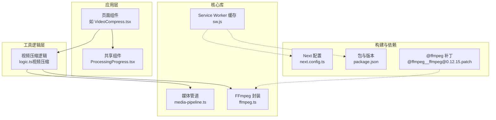
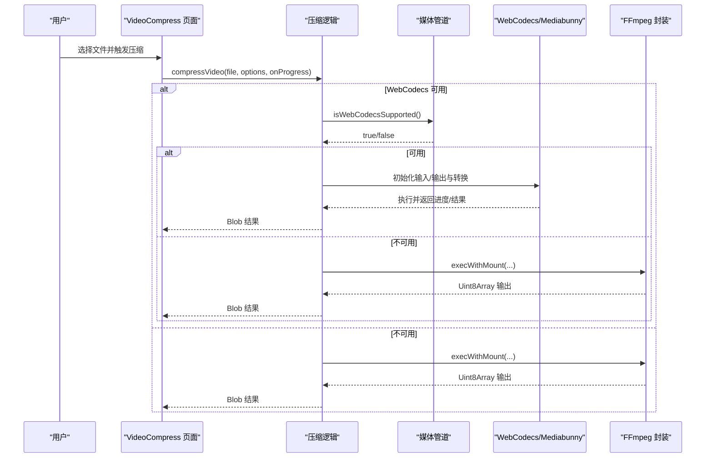
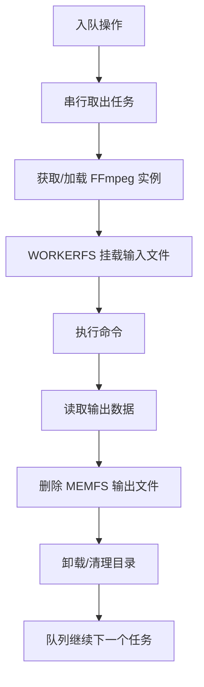
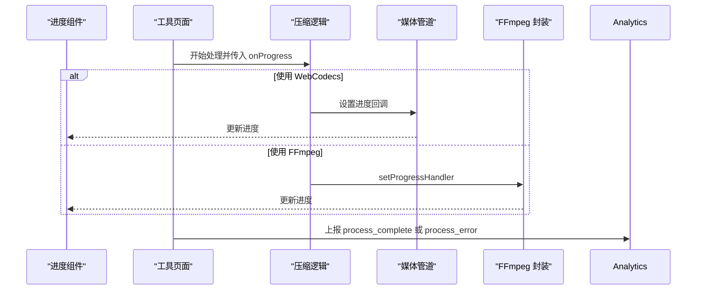
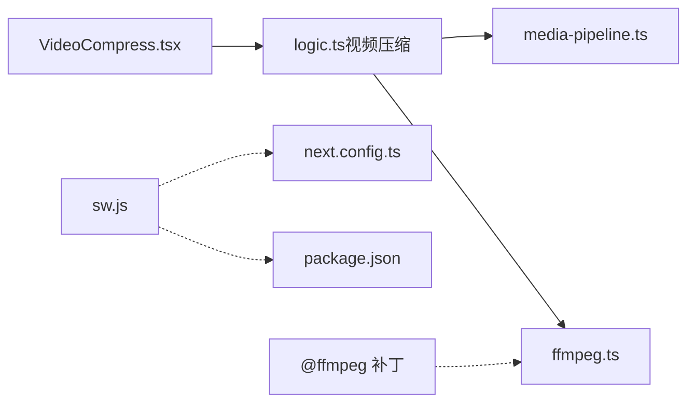

# 性能优化

<cite>
**本文引用的文件**
- [media-pipeline.ts](file://src/lib/media-pipeline.ts)
- [ffmpeg.ts](file://src/lib/ffmpeg.ts)
- [VideoCompress.tsx](file://src/tools/video/compress/VideoCompress.tsx)
- [logic.ts（视频压缩）](file://src/tools/video/compress/logic.ts)
- [ProcessingProgress.tsx](file://src/components/shared/ProcessingProgress.tsx)
- [sw.js](file://public/sw.js)
- [package.json](file://package.json)
- [next.config.ts](file://next.config.ts)
- [analytics.ts](file://src/lib/analytics.ts)
- [@ffmpeg__ffmpeg@0.12.15.patch](file://patches/@ffmpeg__ffmpeg@0.12.15.patch)
</cite>

## 目录
1. [简介](#简介)
2. [项目结构](#项目结构)
3. [核心组件](#核心组件)
4. [架构总览](#架构总览)
5. [详细组件分析](#详细组件分析)
6. [依赖关系分析](#依赖关系分析)
7. [性能考量与优化建议](#性能考量与优化建议)
8. [故障排查指南](#故障排查指南)
9. [结论](#结论)
10. [附录：调优参数与配置建议](#附录调优参数与配置建议)

## 简介
本文件面向性能工程师与开发者，系统梳理媒体工具箱在双引擎架构下的性能优化策略，覆盖以下主题：
- 双引擎选择与降级：WebCodecs 与 FFmpeg.wasm 的智能切换与不可降级场景
- 内存管理：大文件处理、避免重复拷贝、及时释放资源
- 缓存机制：浏览器 Service Worker 对 FFmpeg 核心资源的持久缓存
- 并发与队列：串行化执行以规避单线程限制与挂载冲突
- 进度反馈与监控：进度条、错误事件与性能指标采集
- PWA 离线与缓存策略：HTML 与静态资源的离线可用性
- 具体调优参数与配置建议

## 项目结构
媒体工具箱采用 Next.js 应用，工具功能按类别组织在 src/tools 下，核心性能相关逻辑集中在 src/lib 与具体工具页面中。

图表来源
- [VideoCompress.tsx:1-200](file://src/tools/video/compress/VideoCompress.tsx#L1-L200)
- [logic.ts（视频压缩）:1-262](file://src/tools/video/compress/logic.ts#L1-L262)
- [media-pipeline.ts:1-175](file://src/lib/media-pipeline.ts#L1-L175)
- [ffmpeg.ts:1-144](file://src/lib/ffmpeg.ts#L1-L144)
- [sw.js:1-93](file://public/sw.js#L1-L93)
- [next.config.ts:1-13](file://next.config.ts#L1-L13)
- [package.json:1-45](file://package.json#L1-L45)
- [@ffmpeg__ffmpeg@0.12.15.patch:1-14](file://patches/@ffmpeg__ffmpeg@0.12.15.patch#L1-L14)

章节来源
- [VideoCompress.tsx:1-200](file://src/tools/video/compress/VideoCompress.tsx#L1-L200)
- [logic.ts（视频压缩）:1-262](file://src/tools/video/compress/logic.ts#L1-L262)
- [media-pipeline.ts:1-175](file://src/lib/media-pipeline.ts#L1-L175)
- [ffmpeg.ts:1-144](file://src/lib/ffmpeg.ts#L1-L144)
- [sw.js:1-93](file://public/sw.js#L1-L93)
- [next.config.ts:1-13](file://next.config.ts#L1-L13)
- [package.json:1-45](file://package.json#L1-L45)
- [@ffmpeg__ffmpeg@0.12.15.patch:1-14](file://patches/@ffmpeg__ffmpeg@0.12.15.patch#L1-L14)

## 核心组件
- 媒体管道（WebCodecs 能力检测与降级）
  - 能力检测、错误类型、编码能力探测、源视频编解码器检测等
- FFmpeg 封装（单线程串行队列、WORKERFS 挂载、进度回调）
  - 单例懒加载、进度事件绑定、操作队列、内存释放
- 视频压缩工具（双引擎选择与降级）
  - WebCodecs 优先，遇到特定问题直接抛出不可降级错误
- 进度 UI 组件
  - 支持确定/不确定进度条展示
- Service Worker 缓存策略
  - FFmpeg 核心资源永久缓存、HTML 网络优先、静态资源缓存优先
- 分析与监控
  - 处理完成/错误事件上报，隐私字段截断

章节来源
- [media-pipeline.ts:1-175](file://src/lib/media-pipeline.ts#L1-L175)
- [ffmpeg.ts:1-144](file://src/lib/ffmpeg.ts#L1-L144)
- [logic.ts（视频压缩）:1-262](file://src/tools/video/compress/logic.ts#L1-L262)
- [ProcessingProgress.tsx:1-47](file://src/components/shared/ProcessingProgress.tsx#L1-L47)
- [sw.js:1-93](file://public/sw.js#L1-L93)
- [analytics.ts:1-138](file://src/lib/analytics.ts#L1-L138)

## 架构总览
双引擎架构通过“WebCodecs 优先 + FFmpeg.wasm 降级”的策略实现高性能与兼容性的平衡。WebCodecs 在支持硬件加速时优先使用；当遇到不支持的视频编解码器或无法满足需求的场景时，根据错误类型决定是否降级到 FFmpeg。对于明确不可降级的错误（如 H.265/HEVC 等），直接提示用户。

图表来源
- [VideoCompress.tsx:101-134](file://src/tools/video/compress/VideoCompress.tsx#L101-L134)
- [logic.ts（视频压缩）:87-112](file://src/tools/video/compress/logic.ts#L87-L112)
- [media-pipeline.ts:7-14](file://src/lib/media-pipeline.ts#L7-L14)
- [ffmpeg.ts:99-143](file://src/lib/ffmpeg.ts#L99-L143)

## 详细组件分析

### WebCodecs 与 FFmpeg.wasm 双引擎选择与降级
- 能力检测：检查浏览器是否具备 Video/Audio 编解码器接口
- 错误分类：
  - WebCodecsFallbackError：可降级场景（如音频不支持），转 FFmpeg
  - UnsupportedVideoCodecError：不可降级场景（如 H.265/HEVC 等），直接报错
- 编码能力探测：对 H.264/H.265 的编码能力进行检测，动态调整默认输出编码
- 源视频编解码器检测：用于默认输出编码策略与提示

图表来源
- [logic.ts（视频压缩）:94-112](file://src/tools/video/compress/logic.ts#L94-L112)
- [media-pipeline.ts:32-53](file://src/lib/media-pipeline.ts#L32-L53)

章节来源
- [media-pipeline.ts:7-175](file://src/lib/media-pipeline.ts#L7-L175)
- [logic.ts（视频压缩）:87-112](file://src/tools/video/compress/logic.ts#L87-L112)

### FFmpeg.wasm 内存管理与并发控制
- 单例懒加载：避免重复初始化与网络请求
- 进度事件：统一监听与转换为百分比
- 串行队列：所有操作通过 Promise 队列串行执行，规避单线程冲突
- WORKERFS 挂载：直接挂载 File 对象，避免 fetchFile/writeFile 的全量内存复制
- 输出读取后立即删除 MEMFS 文件，降低峰值内存占用
- 修复补丁：针对打包器的导入行为进行兼容性处理

图表来源
- [ffmpeg.ts:75-82](file://src/lib/ffmpeg.ts#L75-L82)
- [ffmpeg.ts:99-143](file://src/lib/ffmpeg.ts#L99-L143)

章节来源
- [ffmpeg.ts:1-144](file://src/lib/ffmpeg.ts#L1-L144)
- [@ffmpeg__ffmpeg@0.12.15.patch:1-14](file://patches/@ffmpeg__ffmpeg@0.12.15.patch#L1-L14)

### 进度反馈与监控
- 进度 UI：支持确定与不确定两种模式，平滑过渡动画
- 处理完成/错误事件：记录耗时、工具类别、错误信息（隐私字段截断）

图表来源
- [ProcessingProgress.tsx:14-46](file://src/components/shared/ProcessingProgress.tsx#L14-L46)
- [logic.ts（视频压缩）:197-201](file://src/tools/video/compress/logic.ts#L197-L201)
- [ffmpeg.ts:41-58](file://src/lib/ffmpeg.ts#L41-L58)
- [analytics.ts:128-137](file://src/lib/analytics.ts#L128-L137)

章节来源
- [ProcessingProgress.tsx:1-47](file://src/components/shared/ProcessingProgress.tsx#L1-L47)
- [analytics.ts:1-138](file://src/lib/analytics.ts#L1-L138)

### PWA 缓存策略与离线性能
- FFmpeg 核心资源（JS/WASM）：永久缓存，命中即用，显著降低二次加载时间
- HTML：网络优先策略，保证内容新鲜度
- 静态资源：缓存优先，提升后续访问速度
- 仅 GET 且同源请求生效，跨域请求不拦截

图表来源
- [sw.js:30-92](file://public/sw.js#L30-L92)

章节来源
- [sw.js:1-93](file://public/sw.js#L1-L93)

## 依赖关系分析
- 工具页面依赖工具逻辑与核心库
- 工具逻辑依赖媒体管道与 FFmpeg 封装
- Service Worker 与构建配置影响资源加载与缓存
- 包管理器锁定版本，补丁修复打包器兼容性

图表来源
- [VideoCompress.tsx:1-200](file://src/tools/video/compress/VideoCompress.tsx#L1-L200)
- [logic.ts（视频压缩）:1-262](file://src/tools/video/compress/logic.ts#L1-L262)
- [media-pipeline.ts:1-175](file://src/lib/media-pipeline.ts#L1-L175)
- [ffmpeg.ts:1-144](file://src/lib/ffmpeg.ts#L1-L144)
- [sw.js:1-93](file://public/sw.js#L1-L93)
- [next.config.ts:1-13](file://next.config.ts#L1-L13)
- [package.json:1-45](file://package.json#L1-L45)
- [@ffmpeg__ffmpeg@0.12.15.patch:1-14](file://patches/@ffmpeg__ffmpeg@0.12.15.patch#L1-L14)

章节来源
- [package.json:1-45](file://package.json#L1-L45)
- [next.config.ts:1-13](file://next.config.ts#L1-L13)

## 性能考量与优化建议
- 引擎选择
  - 优先启用 WebCodecs，利用硬件加速；对 H.265/HEVC 等不可降级场景直接提示
  - 动态探测 H.264/H.265 编码能力，合理设置默认输出编码
- 内存与 IO
  - 使用 WORKERFS 挂载避免全量内存复制；输出读取后立即删除 MEMFS 文件
  - 控制并发，所有 FFmpeg 操作串行执行，避免挂载点冲突
- 进度与体验
  - 提供确定/不确定进度反馈，减少等待焦虑
  - 对长耗时任务提供预估耗时与分步进度
- 缓存与离线
  - 固化 FFmpeg 核心资源缓存，显著降低冷启动成本
  - HTML 网络优先，静态资源缓存优先，结合 PWA 提升离线可用性
- 监控与可观测性
  - 记录处理耗时与错误，便于定位瓶颈与回归
  - 隐私字段截断，避免敏感信息泄露

[本节为通用性能建议，无需特定文件引用]

## 故障排查指南
- WebCodecs 不可用
  - 检查浏览器能力检测与扩展建议（如 Windows + Chromium 的 HEVC 扩展）
  - 若为 H.265/HEVC 等不可降级错误，提示用户更换编码或安装扩展
- FFmpeg 加载失败
  - 确认 CDN 可达性与跨域策略；查看加载 Promise 的异常链路
  - 检查补丁是否正确应用，避免打包器导入异常
- 进度不更新
  - 确认进度事件绑定与清理逻辑；确保串行队列未被异常中断
- 内存占用高
  - 确认输出读取后已删除 MEMFS 文件；避免重复写入与保留中间产物

章节来源
- [media-pipeline.ts:98-123](file://src/lib/media-pipeline.ts#L98-L123)
- [ffmpeg.ts:14-39](file://src/lib/ffmpeg.ts#L14-L39)
- [ffmpeg.ts:41-58](file://src/lib/ffmpeg.ts#L41-L58)
- [ffmpeg.ts:129-141](file://src/lib/ffmpeg.ts#L129-L141)
- [@ffmpeg__ffmpeg@0.12.15.patch:1-14](file://patches/@ffmpeg__ffmpeg@0.12.15.patch#L1-L14)

## 结论
媒体工具箱通过“WebCodecs 优先 + FFmpeg.wasm 降级”的双引擎架构，在保证兼容性的同时最大化性能收益。配合 WORKERFS 内存优化、串行队列并发控制、Service Worker 缓存与进度反馈体系，整体性能与用户体验得到显著提升。建议在实际部署中结合监控数据持续迭代参数与策略。

[本节为总结性内容，无需特定文件引用]

## 附录：调优参数与配置建议
- WebCodecs 与编码能力
  - 默认输出编码：优先与源一致（若 H.265 可用则选 H.265，否则 H.264）
  - 编码能力探测：在页面挂载时异步检测，避免阻塞首屏
- FFmpeg 参数
  - 预设质量：fast/slower/veryslow 等，按目标文件大小与时间权衡
  - 关键字节率：CRF 与分辨率联动映射，避免过高码率导致体积过大
  - 最大码率：设置上限并同步缓冲区大小，防止突发带宽不足
  - 音频比特率：根据用途选择 96k~192k
- 进度与 UI
  - 进度回调频率：避免过于频繁的重绘，建议节流
  - 不确定进度：使用动画指示，提升感知速度
- 缓存策略
  - FFmpeg 核心资源：永久缓存，版本号固定
  - HTML：网络优先，确保内容新鲜
  - 静态资源：缓存优先，结合 CDN 与压缩
- 监控与日志
  - 处理耗时：process_complete.duration_ms
  - 错误信息：process_error.error_message（隐私截断）
  - 工具维度：tool_slug/tool_category

章节来源
- [logic.ts（视频压缩）:32-54](file://src/tools/video/compress/logic.ts#L32-L54)
- [logic.ts（视频压缩）:70-85](file://src/tools/video/compress/logic.ts#L70-L85)
- [logic.ts（视频压缩）:208-261](file://src/tools/video/compress/logic.ts#L208-L261)
- [sw.js:30-92](file://public/sw.js#L30-L92)
- [analytics.ts:128-137](file://src/lib/analytics.ts#L128-L137)