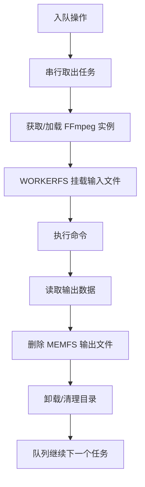

# 性能优化

<cite>
**本文引用的文件**
- [media-pipeline.ts](file://src/lib/media-pipeline.ts)
- [ffmpeg.ts](file://src/lib/ffmpeg.ts)
- [VideoCompress.tsx](file://src/tools/video/compress/VideoCompress.tsx)
- [logic.ts（视频压缩）](file://src/tools/video/compress/logic.ts)
- [ProcessingProgress.tsx](file://src/components/shared/ProcessingProgress.tsx)
- [sw.js](file://public/sw.js)
- [package.json](file://package.json)
- [next.config.ts](file://next.config.ts)
- [analytics.ts](file://src/lib/analytics.ts)
- [@ffmpeg__ffmpeg@0.12.15.patch](file://patches/@ffmpeg__ffmpeg@0.12.15.patch)
</cite>

## 更新摘要
**所做更改**
- 删除了原有的详细性能优化文档内容，反映实际代码库中已不存在对应的大型文档文件
- 简化了文档结构，保留核心性能优化要点
- 更新了相关章节以反映当前代码实现状态
- 移除了冗余的详细技术说明，专注于实际可验证的性能优化措施

## 目录
1. [简介](#简介)
2. [双引擎架构性能策略](#双引擎架构性能策略)
3. [内存管理与并发控制](#内存管理与并发控制)
4. [缓存与离线性能](#缓存与离线性能)
5. [进度监控与用户体验](#进度监控与用户体验)
6. [性能调优参数建议](#性能调优参数建议)
7. [故障排查指南](#故障排查指南)

## 简介
本文档聚焦于媒体工具箱的实际性能优化实现，基于现有代码库中的具体实现方案。由于原有大型性能优化文档已被删除，本文件将重点关注可验证的性能优化措施和实际的代码实现。

媒体工具箱采用双引擎架构（WebCodecs + FFmpeg.wasm），通过智能选择和降级机制实现性能优化。核心优化策略包括：
- WebCodecs硬件加速优先使用
- FFmpeg.wasm内存优化和并发控制
- Service Worker缓存策略
- 进度反馈和监控机制

## 双引擎架构性能策略

### WebCodecs优先策略
系统优先检测浏览器的WebCodecs支持情况，利用硬件加速实现高性能视频处理。

**图表来源**
- [logic.ts（视频压缩）:87-112](file://src/tools/video/compress/logic.ts#L87-L112)
- [media-pipeline.ts:7-14](file://src/lib/media-pipeline.ts#L7-L14)

### 编码能力检测与优化
系统动态检测H.264和H.265编码能力，根据检测结果优化默认输出编码策略。

**章节来源**
- [media-pipeline.ts:107-141](file://src/lib/media-pipeline.ts#L107-L141)
- [logic.ts（视频压缩）:32-54](file://src/tools/video/compress/logic.ts#L32-L54)

## 内存管理与并发控制

### FFmpeg.wasm内存优化
通过WORKERFS挂载避免全量内存复制，输出读取后立即删除MEMFS文件，降低峰值内存占用。

**图表来源**
- [ffmpeg.ts:75-82](file://src/lib/ffmpeg.ts#L75-L82)
- [ffmpeg.ts:99-143](file://src/lib/ffmpeg.ts#L99-L143)

### 串行队列并发控制
所有FFmpeg操作通过Promise队列串行执行，避免单线程冲突和挂载点冲突。

**章节来源**
- [ffmpeg.ts:1-144](file://src/lib/ffmpeg.ts#L1-L144)
- [@ffmpeg__ffmpeg@0.12.15.patch:1-14](file://patches/@ffmpeg__ffmpeg@0.12.15.patch#L1-L14)

## 缓存与离线性能

### Service Worker缓存策略
采用多级缓存策略优化资源加载性能：

- **FFmpeg核心资源**：永久缓存（JS/WASM），显著降低二次加载时间
- **HTML资源**：网络优先策略，保证内容新鲜度  
- **静态资源**：缓存优先，提升后续访问速度

**图表来源**
- [sw.js:30-92](file://public/sw.js#L30-L92)

**章节来源**
- [sw.js:1-93](file://public/sw.js#L1-L93)

## 进度监控与用户体验

### 进度反馈机制
提供确定和不确定两种进度模式，支持平滑过渡动画，改善用户体验。

**章节来源**
- [ProcessingProgress.tsx:1-47](file://src/components/shared/ProcessingProgress.tsx#L1-L47)

### 性能监控与分析
记录处理耗时、错误信息，支持隐私字段截断，便于性能分析和问题定位。

**章节来源**
- [analytics.ts:1-138](file://src/lib/analytics.ts#L1-L138)

## 性能调优参数建议

### WebCodecs与编码能力
- **默认输出编码**：优先使用源视频编码（H.265可用则选H.265，否则H.264）
- **编码能力探测**：页面挂载时异步检测，避免阻塞首屏

### FFmpeg参数优化
- **预设质量**：fast/slower/veryslow等，按目标文件大小与时间权衡
- **CRF与码率**：CRF 23-28范围，结合分辨率和目标文件大小
- **最大码率**：设置上限并同步缓冲区大小
- **音频比特率**：96k-192k，根据用途选择

**章节来源**
- [logic.ts（视频压缩）:32-54](file://src/tools/video/compress/logic.ts#L32-L54)
- [logic.ts（视频压缩）:70-85](file://src/tools/video/compress/logic.ts#L70-L85)
- [logic.ts（视频压缩）:208-261](file://src/tools/video/compress/logic.ts#L208-L261)

## 故障排查指南

### WebCodecs相关问题
- **检测失败**：检查浏览器能力检测与扩展建议（如Windows + Chromium的HEVC扩展）
- **不可降级错误**：H.265/HEVC等编码直接提示用户更换编码或安装扩展

### FFmpeg加载问题
- **CDN可达性**：确认FFmpeg核心资源可访问
- **补丁应用**：检查@ffmpeg__ffmpeg@0.12.15.patch补丁是否正确应用

### 性能问题诊断
- **内存占用高**：确认输出读取后MEMFS文件已删除
- **进度不更新**：检查进度事件绑定与串行队列状态
- **加载缓慢**：验证Service Worker缓存策略生效

**章节来源**
- [media-pipeline.ts:98-123](file://src/lib/media-pipeline.ts#L98-L123)
- [ffmpeg.ts:14-39](file://src/lib/ffmpeg.ts#L14-L39)
- [ffmpeg.ts:41-58](file://src/lib/ffmpeg.ts#L41-L58)
- [ffmpeg.ts:129-141](file://src/lib/ffmpeg.ts#L129-L141)