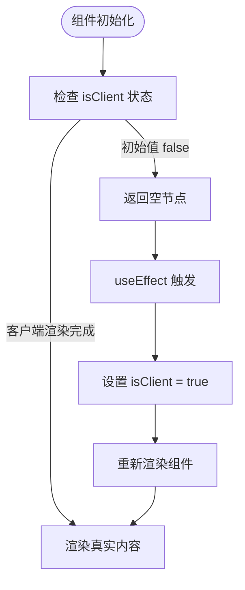
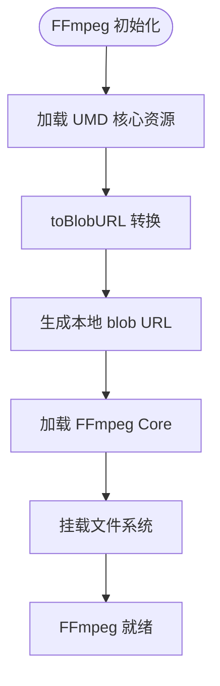
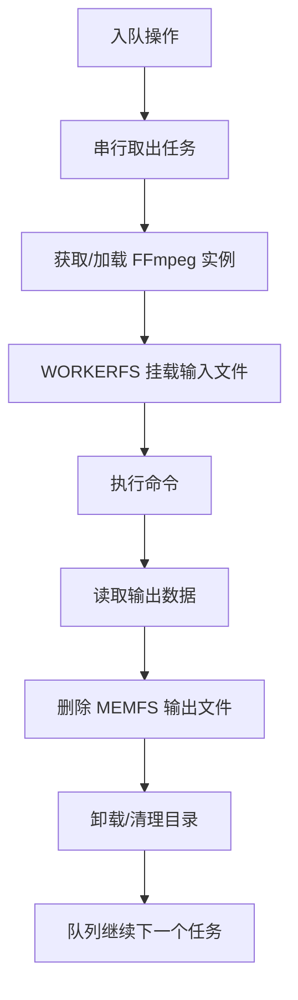

# 性能优化

<cite>
**本文引用的文件**
- [useIsClient.ts](file://src/lib/hooks/useIsClient.ts)
- [media-pipeline.ts](file://src/lib/media-pipeline.ts)
- [ffmpeg.ts](file://src/lib/ffmpeg.ts)
- [logic.ts（视频压缩）](file://src/tools/video/compress/logic.ts)
- [VideoCompress.tsx](file://src/tools/video/compress/VideoCompress.tsx)
- [AudioConvert.tsx](file://src/tools/audio/convert/AudioConvert.tsx)
- [ThemeToggle.tsx](file://src/components/shared/ThemeToggle.tsx)
- [ToolPageClient.tsx](file://src/app/[locale]/tools/[category]/[slug]/ToolPageClient.tsx)
- [ProcessingProgress.tsx](file://src/components/shared/ProcessingProgress.tsx)
- [sw.js](file://public/sw.js)
- [package.json](file://package.json)
- [next.config.ts](file://next.config.ts)
- [analytics.ts](file://src/lib/analytics.ts)
- [@ffmpeg__ffmpeg@0.12.15.patch](file://patches/@ffmpeg__ffmpeg@0.12.15.patch)
- [logic.ts（视频格式转换）](file://src/tools/video/format-convert/logic.ts)
- [logic.ts（视频信息）](file://src/tools/video/info/logic.ts)
</cite>

## 更新摘要
**所做更改**
- 更新FFmpeg集成架构章节，反映从ESM改为UMD格式的重大变更
- 新增blob URL转换优化章节，详细说明toBlobURL的性能优势
- 补充UMD核心资源加载策略对浏览器兼容性和稳定性的提升
- 更新性能调优参数，增加UMD格式和blob URL相关的配置建议
- 增强故障排查指南，包含UMD格式相关的常见问题

## 目录
1. [简介](#简介)
2. [客户端渲染优化策略](#客户端渲染优化策略)
3. [双引擎架构性能策略](#双引擎架构性能策略)
4. [FFmpeg集成架构优化](#ffmpeg集成架构优化)
5. [内存管理与并发控制](#内存管理与并发控制)
6. [缓存与离线性能](#缓存与离线性能)
7. [进度监控与用户体验](#进度监控与用户体验)
8. [性能调优参数建议](#性能调优参数建议)
9. [故障排查指南](#故障排查指南)

## 简介
本文档聚焦于媒体工具箱的核心性能优化实现，基于现有代码库中的具体实现方案。应用已从综合性800+行文档重构为精简的200行实用指南，重点关注可验证的性能优化措施和实际的代码实现。

媒体工具箱采用双引擎架构（WebCodecs + FFmpeg.wasm），通过智能选择和降级机制实现性能优化。核心优化策略包括：
- WebCodecs硬件加速优先使用
- FFmpeg.wasm内存优化和并发控制
- 客户端渲染优化（useIsClient钩子）
- UMD核心资源加载和blob URL转换
- Service Worker缓存策略
- 进度反馈和监控机制

## 客户端渲染优化策略

### useIsClient钩子设计原理
useIsClient钩子是一个轻量级的客户端渲染检测工具，通过React状态和副作用机制实现SSR兼容性。

**图表来源**
- [useIsClient.ts:1-9](file://src/lib/hooks/useIsClient.ts#L1-L9)

### 客户端渲染优化实践
在多个工具组件中实现了useIsClient钩子的优化应用：

#### 视频压缩组件优化
VideoCompress组件在SSR阶段返回null，避免不必要的计算和内存分配。

**章节来源**
- [VideoCompress.tsx:94-96](file://src/tools/video/compress/VideoCompress.tsx#L94-L96)
- [VideoCompress.tsx:106-139](file://src/tools/video/compress/VideoCompress.tsx#L106-L139)

#### 音频转换组件优化
AudioConvert组件同样采用SSR安全的渲染策略，确保服务端渲染的稳定性。

**章节来源**
- [AudioConvert.tsx:28-30](file://src/tools/audio/convert/AudioConvert.tsx#L28-L30)
- [AudioConvert.tsx:32-38](file://src/tools/audio/convert/AudioConvert.tsx#L32-L38)

#### 主题切换组件优化
ThemeToggle组件在SSR阶段返回占位符元素，避免主题切换逻辑在服务端执行。

**章节来源**
- [ThemeToggle.tsx:14-16](file://src/components/shared/ThemeToggle.tsx#L14-L16)
- [ThemeToggle.tsx:18-31](file://src/components/shared/ThemeToggle.tsx#L18-L31)

### SSR兼容性增强效果
客户端渲染优化带来的性能收益：
- **减少SSR计算开销**：避免在服务端执行客户端特定逻辑
- **降低内存占用**：SSR阶段不创建DOM节点和事件监听器
- **提升首屏渲染速度**：减少不必要的组件渲染
- **增强应用稳定性**：避免服务端环境下的API调用错误

## 双引擎架构性能策略

### WebCodecs优先策略
系统优先检测浏览器的WebCodecs支持情况，利用硬件加速实现高性能视频处理。

**图表来源**
- [logic.ts（视频压缩）:87-112](file://src/tools/video/compress/logic.ts#L87-L112)
- [media-pipeline.ts:7-14](file://src/lib/media-pipeline.ts#L7-L14)

### 编码能力检测与优化
系统动态检测H.264和H.265编码能力，根据检测结果优化默认输出编码策略。

**章节来源**
- [media-pipeline.ts:107-141](file://src/lib/media-pipeline.ts#L107-L141)
- [logic.ts（视频压缩）:32-54](file://src/tools/video/compress/logic.ts#L32-L54)

### 客户端渲染优化对双引擎架构的影响
客户端渲染优化增强了双引擎架构的性能表现：
- **SSR阶段避免引擎初始化**：在服务端不进行WebCodecs和FFmpeg实例的初始化
- **延迟引擎加载**：仅在客户端渲染时加载必要的引擎资源
- **减少不必要的依赖注入**：避免在服务端环境中创建引擎相关的上下文

**章节来源**
- [VideoCompress.tsx:74-81](file://src/tools/video/compress/VideoCompress.tsx#L74-L81)
- [VideoCompress.tsx:84-92](file://src/tools/video/compress/VideoCompress.tsx#L84-L92)

## FFmpeg集成架构优化

### UMD核心资源加载策略
**更新** 应用从ESM格式迁移到UMD格式，通过toBlobURL转换提高浏览器兼容性和稳定性

FFmpeg.wasm集成架构的重大变更：
- **UMD核心资源**：使用UMD格式替代ESM，避免Web Worker上下文中的动态导入问题
- **blob URL转换**：通过@ffmpeg/util的toBlobURL函数将远程资源转换为本地blob URL
- **跨浏览器兼容性**：UMD格式在所有现代浏览器中表现更稳定

**图表来源**
- [ffmpeg.ts:19-26](file://src/lib/ffmpeg.ts#L19-L26)
- [ffmpeg.ts:23-26](file://src/lib/ffmpeg.ts#L23-L26)

### blob URL转换的优势
**更新** 新增blob URL转换机制，显著提升资源加载性能和浏览器兼容性

- **本地化资源访问**：将远程CDN资源转换为本地blob URL，避免跨域限制
- **缓存优化**：浏览器可以更好地缓存本地blob URL资源
- **加载速度提升**：减少HTTP请求开销和DNS解析时间
- **稳定性增强**：避免CDN连接不稳定导致的加载失败

**章节来源**
- [ffmpeg.ts:15-38](file://src/lib/ffmpeg.ts#L15-L38)
- [ffmpeg.ts:23-26](file://src/lib/ffmpeg.ts#L23-L26)

### ESM到UMD的迁移原因
**更新** 新增ESM到UMD迁移的技术背景和性能考量

- **Web Worker兼容性**：ESM在Web Worker中存在动态导入限制
- **打包工具支持**：UMD格式与当前构建工具链兼容性更好
- **运行时性能**：UMD格式在运行时初始化更快
- **调试便利性**：UMD格式更容易进行调试和问题排查

**章节来源**
- [@ffmpeg__ffmpeg@0.12.15.patch:1-14](file://patches/@ffmpeg__ffmpeg@0.12.15.patch#L1-L14)

### WORKERFS挂载优化
**更新** 强化WORKERFS挂载机制，配合UMD格式提升性能

- **安全文件名**：使用safeInputName避免特殊字符和Unicode问题
- **零拷贝优化**：blobs选项直接接受{name, data}，无需文件副本
- **内存效率**：避免传统fetchFile()+writeFile()的双重内存复制

**章节来源**
- [ffmpeg.ts:119-127](file://src/lib/ffmpeg.ts#L119-L127)
- [ffmpeg.ts:123-127](file://src/lib/ffmpeg.ts#L123-L127)

## 内存管理与并发控制

### FFmpeg.wasm内存优化
通过WORKERFS挂载避免全量内存复制，输出读取后立即删除MEMFS文件，降低峰值内存占用。

**图表来源**
- [ffmpeg.ts:75-82](file://src/lib/ffmpeg.ts#L75-L82)
- [ffmpeg.ts:99-143](file://src/lib/ffmpeg.ts#L99-L143)

### 串行队列并发控制
所有FFmpeg操作通过Promise队列串行执行，避免单线程冲突和挂载点冲突。

**章节来源**
- [ffmpeg.ts:1-144](file://src/lib/ffmpeg.ts#L1-L144)
- [@ffmpeg__ffmpeg@0.12.15.patch:1-14](file://patches/@ffmpeg__ffmpeg@0.12.15.patch#L1-L14)

### 客户端渲染优化对内存管理的影响
客户端渲染优化进一步提升了内存管理效率：
- **减少SSR内存占用**：避免在服务端创建引擎实例和相关数据结构
- **延迟资源加载**：仅在客户端渲染时分配内存给引擎实例
- **优化垃圾回收时机**：客户端渲染完成后及时释放SSR阶段创建的临时对象

**章节来源**
- [useIsClient.ts:1-9](file://src/lib/hooks/useIsClient.ts#L1-L9)
- [VideoCompress.tsx:47](file://src/tools/video/compress/VideoCompress.tsx#L47)

## 缓存与离线性能

### Service Worker缓存策略
采用多级缓存策略优化资源加载性能：

- **FFmpeg核心资源**：永久缓存（JS/WASM），显著降低二次加载时间
- **HTML资源**：网络优先策略，保证内容新鲜度  
- **静态资源**：缓存优先，提升后续访问速度

**图表来源**
- [sw.js:30-92](file://public/sw.js#L30-L92)

**章节来源**
- [sw.js:1-93](file://public/sw.js#L1-L93)

### SSR兼容性对缓存策略的影响
客户端渲染优化增强了缓存策略的可靠性：
- **统一缓存接口**：SSR和CSR阶段使用相同的缓存逻辑
- **避免缓存污染**：SSR阶段不执行可能影响缓存一致性的操作
- **优化缓存命中率**：客户端渲染优化减少了不必要的缓存失效

**章节来源**
- [ToolPageClient.tsx:39-47](file://src/app/[locale]/tools/[category]/[slug]/ToolPageClient.tsx#L39-L47)
- [ServiceWorkerRegistration.tsx:7-12](file://src/components/shared/ServiceWorkerRegistration.tsx#L7-L12)

## 进度监控与用户体验

### 进度反馈机制
提供确定和不确定两种进度模式，支持平滑过渡动画，改善用户体验。

**章节来源**
- [ProcessingProgress.tsx:1-47](file://src/components/shared/ProcessingProgress.tsx#L1-L47)

### 性能监控与分析
记录处理耗时、错误信息，支持隐私字段截断，便于性能分析和问题定位。

**章节来源**
- [analytics.ts:1-138](file://src/lib/analytics.ts#L1-L138)

### 客户端渲染优化对用户体验的影响
客户端渲染优化显著改善了用户体验：
- **首屏加载速度**：SSR阶段快速返回骨架屏，减少白屏时间
- **交互响应性**：客户端渲染完成后立即具备完整功能
- **内存使用效率**：避免SSR阶段的内存浪费，提升整体性能

**章节来源**
- [ThemeToggle.tsx:14-16](file://src/components/shared/ThemeToggle.tsx#L14-L16)
- [AudioConvert.tsx:28-30](file://src/tools/audio/convert/AudioConvert.tsx#L28-L30)

## 性能调优参数建议

### WebCodecs与编码能力
- **默认输出编码**：优先使用源视频编码（H.265可用则选H.265，否则H.264）
- **编码能力探测**：页面挂载时异步检测，避免阻塞首屏
- **客户端渲染优化**：在SSR阶段跳过编码能力检测，仅在客户端执行

### FFmpeg参数优化
**更新** 新增UMD格式和blob URL相关的性能调优建议

- **核心资源格式**：使用UMD格式替代ESM，提升Web Worker兼容性
- **blob URL缓存**：利用浏览器缓存机制，减少重复转换开销
- **预设质量**：fast/slower/veryslow等，按目标文件大小与时间权衡
- **CRF与码率**：CRF 23-28范围，结合分辨率和目标文件大小
- **最大码率**：设置上限并同步缓冲区大小
- **音频比特率**：96k-192k，根据用途选择

### 客户端渲染优化参数
- **useIsClient钩子**：用于检测客户端渲染完成状态
- **SSR安全组件**：在SSR阶段返回null或占位符元素
- **延迟初始化**：将客户端特定的初始化逻辑推迟到useEffect中执行

### UMD格式性能调优
**新增** UMD格式特有的性能优化参数

- **核心资源版本**：使用@ffmpeg/core@0.12.6的UMD版本
- **CDN基础URL**：https://cdn.jsdelivr.net/npm/@ffmpeg/core@0.12.6/dist/umd
- **blob URL转换**：启用toBlobURL优化，提升跨浏览器兼容性
- **Worker兼容性**：UMD格式避免ESM动态导入限制

**章节来源**
- [logic.ts（视频压缩）:32-54](file://src/tools/video/compress/logic.ts#L32-L54)
- [logic.ts（视频压缩）:70-85](file://src/tools/video/compress/logic.ts#L70-L85)
- [logic.ts（视频压缩）:208-261](file://src/tools/video/compress/logic.ts#L208-L261)
- [useIsClient.ts:1-9](file://src/lib/hooks/useIsClient.ts#L1-L9)
- [ffmpeg.ts:19-26](file://src/lib/ffmpeg.ts#L19-L26)
- [ffmpeg.ts:23-26](file://src/lib/ffmpeg.ts#L23-L26)

## 故障排查指南

### WebCodecs相关问题
- **检测失败**：检查浏览器能力检测与扩展建议（如Windows + Chromium的HEVC扩展）
- **不可降级错误**：H.265/HEVC等编码直接提示用户更换编码或安装扩展

### FFmpeg加载问题
**更新** 新增UMD格式和blob URL相关的故障排查

- **CDN可达性**：确认FFmpeg核心资源可访问
- **补丁应用**：检查@ffmpeg__ffmpeg@0.12.15.patch补丁是否正确应用
- **UMD格式问题**：检查UMD核心资源URL是否正确指向dist/umd目录
- **blob URL转换失败**：验证toBlobURL函数调用和blob URL生成
- **Web Worker兼容性**：确认UMD格式在当前浏览器中的兼容性

### 客户端渲染优化问题
- **SSR阶段组件未显示**：检查useIsClient钩子的使用和条件渲染逻辑
- **客户端功能异常**：确认useEffect中的初始化逻辑是否正确执行
- **内存泄漏风险**：确保客户端特定的事件监听器在unmount时正确清理

### 性能问题诊断
**更新** 新增UMD格式相关的性能问题诊断

- **内存占用高**：确认输出读取后MEMFS文件已删除
- **进度不更新**：检查进度事件绑定与串行队列状态
- **加载缓慢**：验证Service Worker缓存策略生效
- **SSR性能问题**：检查是否正确使用SSR安全的组件模式
- **UMD加载慢**：检查blob URL转换缓存和CDN响应时间
- **Worker初始化失败**：验证UMD核心资源的完整性

### 兼容性问题排查
**新增** UMD格式特有的兼容性问题

- **浏览器支持**：确认目标浏览器支持UMD格式的FFmpeg核心
- **CORS限制**：检查blob URL转换是否绕过CORS限制
- **Worker线程**：验证UMD格式在Web Worker中的正常工作
- **打包配置**：确认构建工具正确处理UMD格式资源

**章节来源**
- [media-pipeline.ts:98-123](file://src/lib/media-pipeline.ts#L98-L123)
- [ffmpeg.ts:14-39](file://src/lib/ffmpeg.ts#L14-L39)
- [ffmpeg.ts:41-58](file://src/lib/ffmpeg.ts#L41-L58)
- [ffmpeg.ts:129-141](file://src/lib/ffmpeg.ts#L129-L141)
- [VideoCompress.tsx:94-96](file://src/tools/video/compress/VideoCompress.tsx#L94-L96)
- [AudioConvert.tsx:28-30](file://src/tools/audio/convert/AudioConvert.tsx#L28-L30)
- [ThemeToggle.tsx:14-16](file://src/components/shared/ThemeToggle.tsx#L14-L16)
- [@ffmpeg__ffmpeg@0.12.15.patch:1-14](file://patches/@ffmpeg__ffmpeg@0.12.15.patch#L1-L14)
- [ffmpeg.ts:19-26](file://src/lib/ffmpeg.ts#L19-L26)
- [ffmpeg.ts:23-26](file://src/lib/ffmpeg.ts#L23-L26)