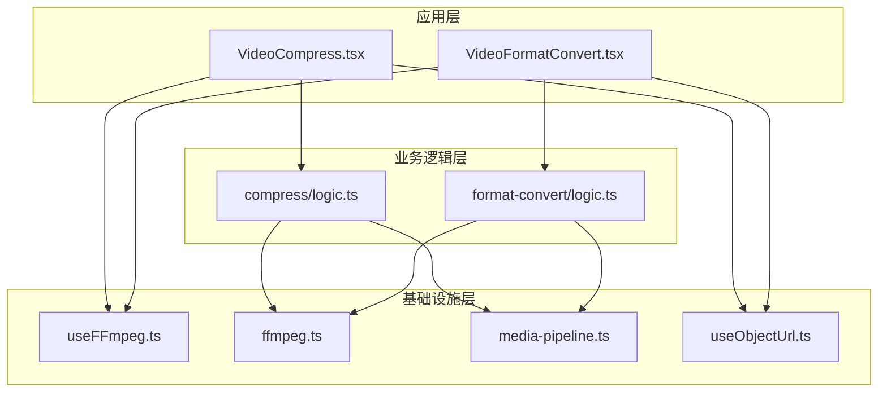
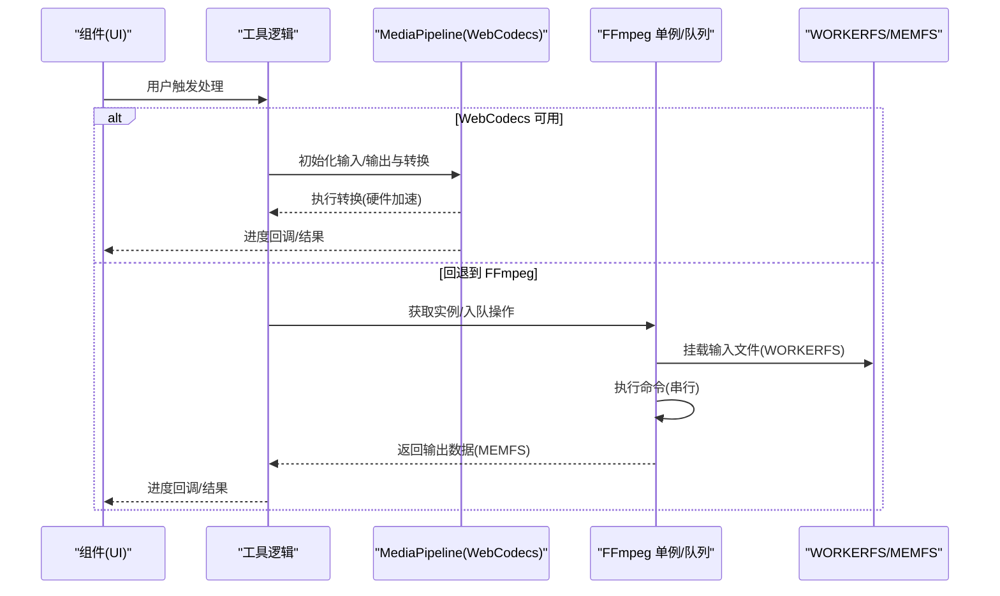
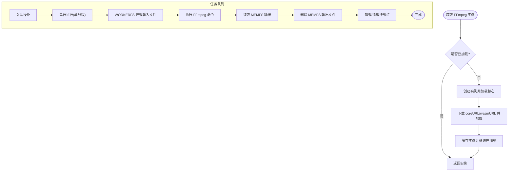
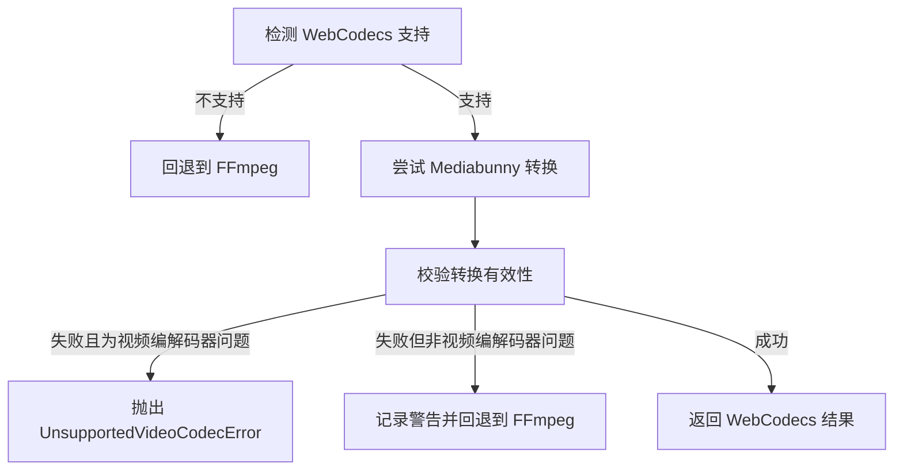
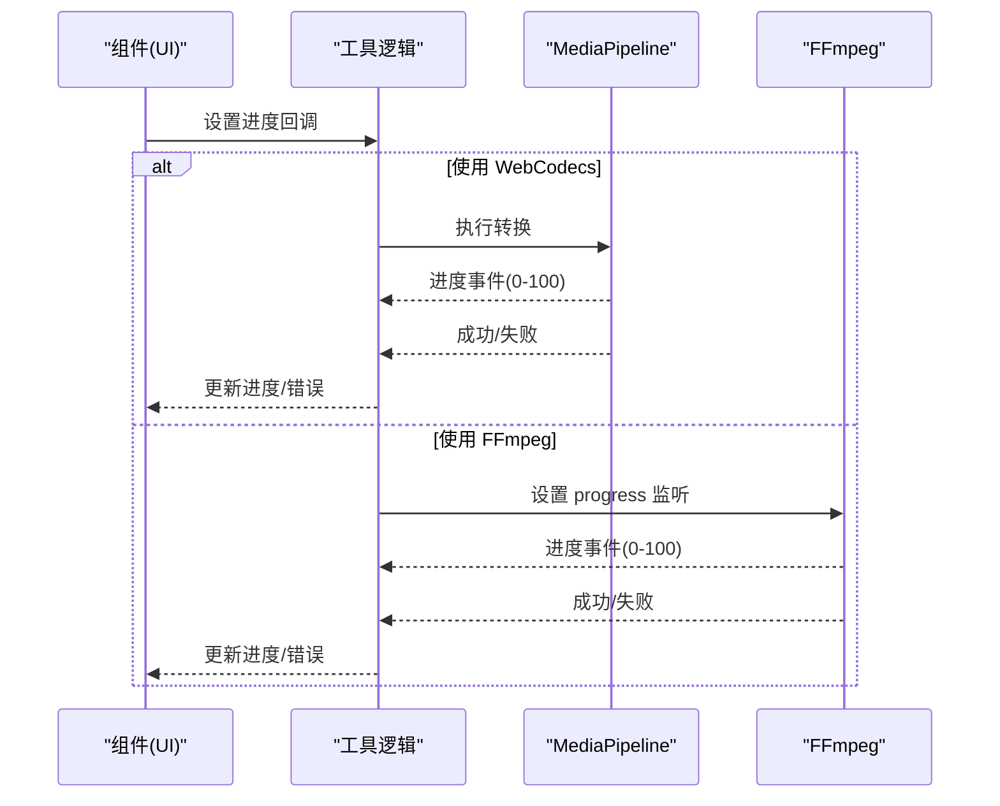
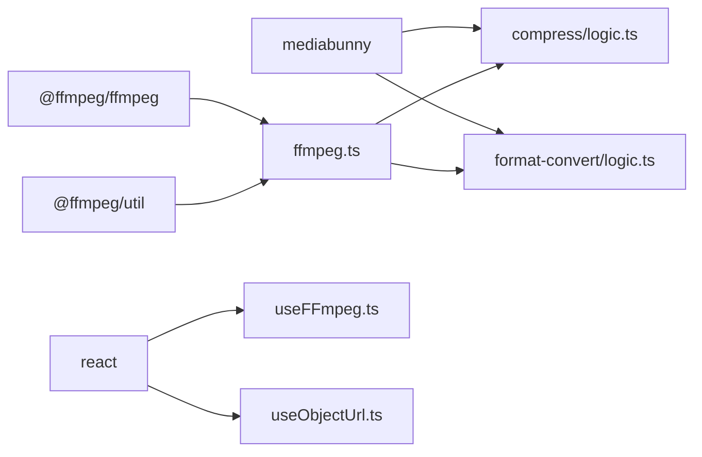

# FFmpeg 性能优化

<cite>
**本文档引用的文件**
- [ffmpeg.ts](file://src/lib/ffmpeg.ts)
- [media-pipeline.ts](file://src/lib/media-pipeline.ts)
- [useFFmpeg.ts](file://src/lib/hooks/useFFmpeg.ts)
- [logic.ts（视频压缩）](file://src/tools/video/compress/logic.ts)
- [logic.ts（视频格式转换）](file://src/tools/video/format-convert/logic.ts)
- [VideoCompress.tsx](file://src/tools/video/compress/VideoCompress.tsx)
- [VideoFormatConvert.tsx](file://src/tools/video/format-convert/VideoFormatConvert.tsx)
- [useObjectUrl.ts](file://src/lib/hooks/useObjectUrl.ts)
- [package.json](file://package.json)
- [README.md](file://README.md)
</cite>

## 目录
1. [简介](#简介)
2. [项目结构](#项目结构)
3. [核心组件](#核心组件)
4. [架构总览](#架构总览)
5. [详细组件分析](#详细组件分析)
6. [依赖关系分析](#依赖关系分析)
7. [性能考量](#性能考量)
8. [故障排除指南](#故障排除指南)
9. [结论](#结论)
10. [附录](#附录)

## 简介
本文件面向 FFmpeg.wasm 在浏览器端的性能优化，围绕以下主题展开：FFmpeg 实例管理策略（懒加载与单例复用）、任务队列与并发控制、内存管理与垃圾回收、进度跟踪与错误处理（含超时与重试建议）、性能监控指标与基准测试方法，以及配置优化与故障排除。文档同时结合项目中的 WebCodecs/Mediabunny 路径作为硬件加速替代方案，帮助在合适场景下减少对 FFmpeg.wasm 的依赖以提升整体性能。

## 项目结构
该项目采用 Next.js App Router 结构，媒体处理相关逻辑集中在 src/lib 与各工具目录的 logic.ts 文件中。FFmpeg.wasm 的封装位于 src/lib/ffmpeg.ts，通用媒体管道能力（WebCodecs 支持、错误类型、位率解析等）位于 src/lib/media-pipeline.ts。具体工具如视频压缩、格式转换分别在 src/tools/video/compress 与 src/tools/video/format-convert 下，通过 logic.ts 封装调用 FFmpeg 或 WebCodecs。

图表来源
- [ffmpeg.ts:1-144](file://src/lib/ffmpeg.ts#L1-L144)
- [media-pipeline.ts:1-105](file://src/lib/media-pipeline.ts#L1-L105)
- [useFFmpeg.ts:1-41](file://src/lib/hooks/useFFmpeg.ts#L1-L41)
- [logic.ts（视频压缩）:1-257](file://src/tools/video/compress/logic.ts#L1-L257)
- [logic.ts（视频格式转换）:1-134](file://src/tools/video/format-convert/logic.ts#L1-L134)
- [VideoCompress.tsx:1-529](file://src/tools/video/compress/VideoCompress.tsx#L1-L529)
- [VideoFormatConvert.tsx:1-141](file://src/tools/video/format-convert/VideoFormatConvert.tsx#L1-L141)
- [useObjectUrl.ts:1-21](file://src/lib/hooks/useObjectUrl.ts#L1-L21)

章节来源
- [README.md:55-78](file://README.md#L55-L78)

## 核心组件
- FFmpeg 单例与任务队列：通过单例实例与 Promise 队列保证 FFmpeg.wasm 的串行执行，避免并发冲突与资源竞争。
- WebCodecs/Mediabunny 管道：在支持的浏览器上优先使用硬件加速路径，不支持时回退至 FFmpeg。
- 进度回调与错误类型：统一的进度事件与专用错误类型，便于 UI 层展示与异常分支处理。
- 对象 URL 生命周期管理：自动创建与撤销 Blob/Object URL，降低内存泄漏风险。

章节来源
- [ffmpeg.ts:1-144](file://src/lib/ffmpeg.ts#L1-L144)
- [media-pipeline.ts:1-105](file://src/lib/media-pipeline.ts#L1-L105)
- [useFFmpeg.ts:1-41](file://src/lib/hooks/useFFmpeg.ts#L1-L41)
- [useObjectUrl.ts:1-21](file://src/lib/hooks/useObjectUrl.ts#L1-L21)

## 架构总览
下图展示了从 UI 到底层处理的调用链路，以及在不同能力下的选择策略。

图表来源
- [logic.ts（视频压缩）:85-201](file://src/tools/video/compress/logic.ts#L85-L201)
- [logic.ts（视频格式转换）:32-115](file://src/tools/video/format-convert/logic.ts#L32-L115)
- [ffmpeg.ts:75-144](file://src/lib/ffmpeg.ts#L75-L144)
- [media-pipeline.ts:7-105](file://src/lib/media-pipeline.ts#L7-L105)

## 详细组件分析

### 组件一：FFmpeg 实例管理与任务队列
- 单例与懒加载：首次调用时才加载 FFmpeg 核心并缓存实例；重复调用直接返回已加载实例，避免重复初始化。
- 串行队列：所有 FFmpeg 操作通过 Promise 队列串行执行，确保同一时间仅有一个任务在运行，规避并发冲突。
- 进度回调：动态绑定/解绑 progress 事件，保证在任务执行期间只设置一次回调，防止重复监听导致的 UI 异常。
- 内存释放：读取输出后立即删除 MEMFS 中的临时文件，降低峰值内存占用。
- WORKERFS 挂载：将 File 对象直接挂载为只读输入，避免两次全量内存拷贝（fetchFile + writeFile）。

图表来源
- [ffmpeg.ts:10-39](file://src/lib/ffmpeg.ts#L10-L39)
- [ffmpeg.ts:75-82](file://src/lib/ffmpeg.ts#L75-L82)
- [ffmpeg.ts:99-144](file://src/lib/ffmpeg.ts#L99-L144)

章节来源
- [ffmpeg.ts:1-144](file://src/lib/ffmpeg.ts#L1-L144)

### 组件二：WebCodecs/Mediabunny 管道与回退策略
- 能力检测：根据浏览器是否支持 WebCodecs 编解码器决定是否启用硬件加速路径。
- 转换验证：严格校验转换结果，若出现不支持的编解码器（如 HEVC/VP9/AV1），抛出专用错误并阻止回退到 FFmpeg（避免性能劣化）。
- 硬件加速：优先使用硬件加速编码器，必要时进行软硬混合处理。
- 错误类型：区分“其他编解码器问题”与“视频编解码器问题”，前者允许回退，后者直接报错。

图表来源
- [media-pipeline.ts:7-14](file://src/lib/media-pipeline.ts#L7-L14)
- [media-pipeline.ts:59-91](file://src/lib/media-pipeline.ts#L59-L91)
- [logic.ts（视频压缩）:92-110](file://src/tools/video/compress/logic.ts#L92-L110)
- [logic.ts（视频格式转换）:38-56](file://src/tools/video/format-convert/logic.ts#L38-L56)

章节来源
- [media-pipeline.ts:1-105](file://src/lib/media-pipeline.ts#L1-L105)
- [logic.ts（视频压缩）:1-257](file://src/tools/video/compress/logic.ts#L1-L257)
- [logic.ts（视频格式转换）:1-134](file://src/tools/video/format-convert/logic.ts#L1-L134)

### 组件三：进度跟踪与错误处理
- 进度回调：通过 FFmpeg 的 progress 事件将进度映射到 0-100 的整数，供 UI 展示。
- 错误类型：
  - WebCodecsFallbackError：指示 WebCodecs 不可用的原因，区分视频编解码器问题与其他问题。
  - UnsupportedVideoCodecError：当检测到不支持的视频编解码器时直接终止流程，避免低效回退。
- UI 层处理：组件根据错误类型显示不同提示，并在特定平台（如 Windows + Chromium）建议安装 HEVC 扩展。

图表来源
- [ffmpeg.ts:41-58](file://src/lib/ffmpeg.ts#L41-L58)
- [logic.ts（视频压缩）:92-110](file://src/tools/video/compress/logic.ts#L92-L110)
- [logic.ts（视频格式转换）:38-56](file://src/tools/video/format-convert/logic.ts#L38-L56)
- [VideoCompress.tsx:74-103](file://src/tools/video/compress/VideoCompress.tsx#L74-L103)
- [VideoFormatConvert.tsx:37-58](file://src/tools/video/format-convert/VideoFormatConvert.tsx#L37-L58)

章节来源
- [ffmpeg.ts:41-58](file://src/lib/ffmpeg.ts#L41-L58)
- [media-pipeline.ts:32-53](file://src/lib/media-pipeline.ts#L32-L53)
- [VideoCompress.tsx:74-103](file://src/tools/video/compress/VideoCompress.tsx#L74-L103)
- [VideoFormatConvert.tsx:37-58](file://src/tools/video/format-convert/VideoFormatConvert.tsx#L37-L58)

### 组件四：内存管理与对象 URL 生命周期
- FFmpeg 内存释放：读取输出后立即删除 MEMFS 中的临时文件，避免长时间驻留内存。
- 对象 URL 生命周期：组件使用自定义 Hook 管理 Blob/Object URL 的创建与撤销，防止内存泄漏。
- 输入挂载：WORKERFS 直接挂载 File 对象，避免额外的内存拷贝。

章节来源
- [ffmpeg.ts:129-132](file://src/lib/ffmpeg.ts#L129-L132)
- [useObjectUrl.ts:1-21](file://src/lib/hooks/useObjectUrl.ts#L1-L21)

## 依赖关系分析
- FFmpeg.wasm 与 util：用于实例化与核心资源加载。
- mediabunny：提供 WebCodecs 硬件加速转换能力。
- React Hooks：封装 FFmpeg 加载状态与对象 URL 生命周期管理。

图表来源
- [package.json:11-31](file://package.json#L11-L31)
- [ffmpeg.ts:1-1](file://src/lib/ffmpeg.ts#L1-L1)
- [media-pipeline.ts:1-1](file://src/lib/media-pipeline.ts#L1-L1)
- [useFFmpeg.ts:1-1](file://src/lib/hooks/useFFmpeg.ts#L1-L1)
- [useObjectUrl.ts:1-1](file://src/lib/hooks/useObjectUrl.ts#L1-L1)

章节来源
- [package.json:11-31](file://package.json#L11-L31)

## 性能考量
- 实例管理
  - 懒加载与单例：避免重复初始化，降低冷启动开销。
  - 串行队列：规避并发冲突，稳定吞吐。
- 任务队列与并发控制
  - 通过 Promise 队列串行化所有 FFmpeg 操作，确保单线程执行，避免资源争用。
  - 建议：在 UI 层对用户提交的任务进行节流/合并，减少频繁入队。
- 内存管理
  - 读取输出后立即删除 MEMFS 文件，降低峰值内存。
  - 使用 WORKERFS 挂载 File 对象，避免 fetchFile + writeFile 的两倍内存拷贝。
  - 对象 URL 在不再使用时及时撤销，防止内存泄漏。
- 进度与错误处理
  - 统一进度回调映射，便于 UI 精确反馈。
  - 专用错误类型帮助快速定位问题类型，避免无意义的回退。
- 性能监控与基准测试
  - 建议：在关键路径埋点（加载核心、挂载输入、执行命令、读取输出、删除临时文件），统计各阶段耗时与内存峰值。
  - 指标：处理时间（总/阶段）、内存峰值、CPU 占用、成功率、失败原因分布。
  - 方法：固定分辨率/码率/时长的基准集，多次运行取中位数/分位数，对比不同预设/回退策略的影响。
- 配置优化建议
  - WebCodecs 优先：在支持的浏览器上尽可能使用硬件加速。
  - 预加载：在页面空闲时预加载 FFmpeg 核心，缩短首次使用延迟。
  - 参数调优：根据目标分辨率与帧率动态计算码率，避免过度压缩导致质量下降。
  - 超时与重试：为 FFmpeg 命令设置合理超时（基于文件大小与复杂度），失败时按指数退避重试（建议上限 3 次）。

## 故障排除指南
- 浏览器不支持 WebCodecs 或 FFmpeg
  - 现象：界面提示不支持。
  - 处理：检查浏览器版本与平台支持情况，引导用户升级或更换浏览器。
- 不支持的视频编解码器
  - 现象：抛出 UnsupportedVideoCodecError。
  - 处理：提示用户安装 HEVC 扩展（Windows + Chromium），或改用其他工具。
- WebCodecs 转换失败但可回退
  - 现象：抛出 WebCodecsFallbackError。
  - 处理：记录原因并回退到 FFmpeg；若为视频编解码器问题则直接报错。
- 进度异常或不更新
  - 现象：进度条不动或异常跳变。
  - 处理：确认 progress 事件绑定是否正确，避免重复绑定；检查 UI 层是否正确接收 0-100 的整数值。
- 内存占用过高
  - 现象：长时间运行后内存持续上升。
  - 处理：确认是否及时删除 MEMFS 输出文件与撤销对象 URL；避免在 UI 层长期持有大对象引用。
- 首次加载缓慢
  - 现象：首次使用耗时较长。
  - 处理：启用预加载策略；优化 CDN 与缓存；考虑将核心资源内嵌或使用 Service Worker 缓存。

章节来源
- [VideoCompress.tsx:66-72](file://src/tools/video/compress/VideoCompress.tsx#L66-L72)
- [VideoFormatConvert.tsx:29-35](file://src/tools/video/format-convert/VideoFormatConvert.tsx#L29-L35)
- [logic.ts（视频压缩）:92-110](file://src/tools/video/compress/logic.ts#L92-L110)
- [logic.ts（视频格式转换）:38-56](file://src/tools/video/format-convert/logic.ts#L38-L56)
- [ffmpeg.ts:41-58](file://src/lib/ffmpeg.ts#L41-L58)
- [ffmpeg.ts:129-132](file://src/lib/ffmpeg.ts#L129-L132)
- [useObjectUrl.ts:1-21](file://src/lib/hooks/useObjectUrl.ts#L1-L21)

## 结论
本项目通过“WebCodecs 硬件加速优先 + FFmpeg.wasm 回退”的双轨策略，在大多数场景下获得更佳的性能与用户体验。配合懒加载、单例复用、串行队列、WORKERFS 挂载与及时内存回收等优化手段，有效降低了内存峰值与处理时间。建议在生产环境中引入完善的性能监控与基准测试体系，并结合参数调优与预加载策略进一步提升稳定性与响应速度。

## 附录
- 相关文件路径
  - FFmpeg 封装：[ffmpeg.ts](file://src/lib/ffmpeg.ts)
  - WebCodecs 管道：[media-pipeline.ts](file://src/lib/media-pipeline.ts)
  - 工具逻辑（视频压缩）：[logic.ts（视频压缩）](file://src/tools/video/compress/logic.ts)
  - 工具逻辑（格式转换）：[logic.ts（视频格式转换）](file://src/tools/video/format-convert/logic.ts)
  - UI 组件（视频压缩）：[VideoCompress.tsx](file://src/tools/video/compress/VideoCompress.tsx)
  - UI 组件（格式转换）：[VideoFormatConvert.tsx](file://src/tools/video/format-convert/VideoFormatConvert.tsx)
  - 对象 URL 生命周期：[useObjectUrl.ts](file://src/lib/hooks/useObjectUrl.ts)
  - 依赖声明：[package.json](file://package.json)
  - 项目概览：[README.md](file://README.md)