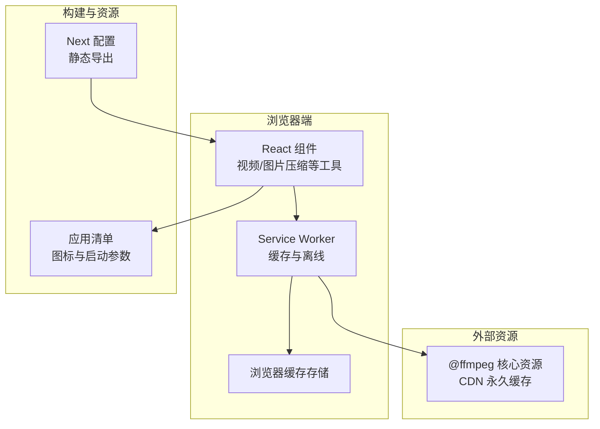
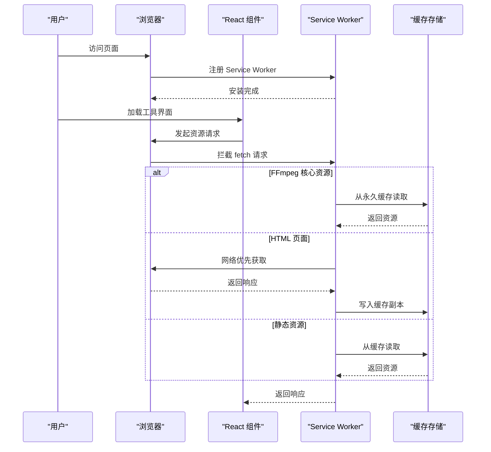
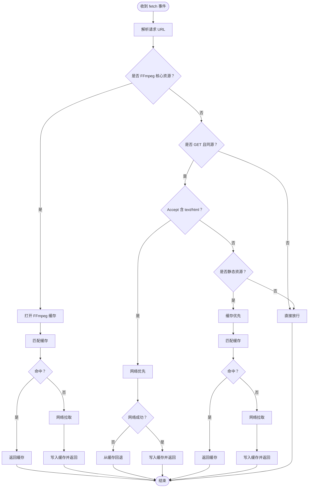
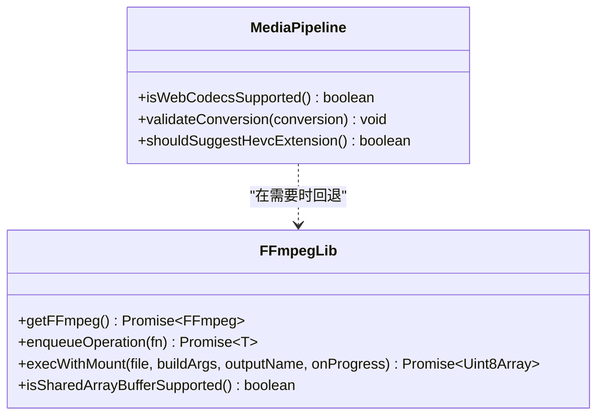
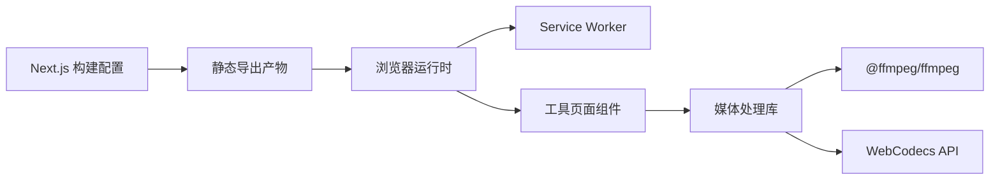

# PWA 性能优化

<cite>
**本文引用的文件**
- [public/sw.js](file://public/sw.js)
- [public/manifest.json](file://public/manifest.json)
- [src/components/shared/ServiceWorkerRegistration.tsx](file://src/components/shared/ServiceWorkerRegistration.tsx)
- [src/lib/ffmpeg.ts](file://src/lib/ffmpeg.ts)
- [src/lib/media-pipeline.ts](file://src/lib/media-pipeline.ts)
- [src/tools/video/compress/VideoCompress.tsx](file://src/tools/video/compress/VideoCompress.tsx)
- [src/tools/image/compress/ImageCompress.tsx](file://src/tools/image/compress/ImageCompress.tsx)
- [next.config.ts](file://next.config.ts)
- [package.json](file://package.json)
- [src/lib/analytics.ts](file://src/lib/analytics.ts)
</cite>

## 目录
1. [简介](#简介)
2. [项目结构](#项目结构)
3. [核心组件](#核心组件)
4. [架构总览](#架构总览)
5. [详细组件分析](#详细组件分析)
6. [依赖关系分析](#依赖关系分析)
7. [性能考量](#性能考量)
8. [故障排查指南](#故障排查指南)
9. [结论](#结论)
10. [附录](#附录)

## 简介
本技术文档聚焦于该 PWA 在浏览器端本地处理与离线能力方面的性能优化实践，覆盖 Service Worker 缓存策略与网络请求优化、离线缓存机制（静态资源与动态内容）、后台同步与状态管理、应用清单配置优化（图标与启动画面）、以及性能监控与测试方法。文档以仓库中现有实现为依据，结合代码级分析与可视化图示，帮助开发者理解并进一步优化 PWA 的加载速度、运行效率与离线体验。

## 项目结构
该项目采用 Next.js 应用框架，前端通过 React 组件提供媒体处理工具，Service Worker 负责缓存与离线支持，应用清单定义 PWA 行为与外观。构建配置导出静态站点，减少首屏渲染与服务器端开销。

图表来源
- [public/sw.js:1-93](file://public/sw.js#L1-L93)
- [public/manifest.json:1-29](file://public/manifest.json#L1-L29)
- [next.config.ts:1-13](file://next.config.ts#L1-L13)

章节来源
- [next.config.ts:1-13](file://next.config.ts#L1-L13)
- [package.json:1-45](file://package.json#L1-L45)

## 核心组件
- Service Worker：负责安装、激活与按类型分发的 fetch 处理，区分 FFmpeg 核心资源、HTML 页面与静态资源的缓存策略。
- 应用清单：定义主题色、背景色、图标集合与显示模式，提升安装体验与启动画面性能。
- 媒体处理管线：在浏览器内使用 WebCodecs 或 FFmpeg.wasm 进行硬件加速或回退处理，避免上传与远程依赖。
- 安装提示与注册：在客户端注册 Service Worker 并提供安装引导。
- 构建配置：静态导出与图片优化，降低首屏与资源体积。

章节来源
- [public/sw.js:1-93](file://public/sw.js#L1-L93)
- [public/manifest.json:1-29](file://public/manifest.json#L1-L29)
- [src/lib/ffmpeg.ts:1-144](file://src/lib/ffmpeg.ts#L1-L144)
- [src/lib/media-pipeline.ts:1-105](file://src/lib/media-pipeline.ts#L1-L105)
- [src/components/shared/ServiceWorkerRegistration.tsx:1-16](file://src/components/shared/ServiceWorkerRegistration.tsx#L1-L16)

## 架构总览
下图展示 PWA 的关键交互路径：用户访问页面触发 Service Worker 注册；SW 根据请求类型选择缓存优先或网络优先策略；媒体工具根据设备能力选择 WebCodecs 或 FFmpeg.wasm 执行本地处理。

图表来源
- [public/sw.js:30-92](file://public/sw.js#L30-L92)
- [src/components/shared/ServiceWorkerRegistration.tsx:5-12](file://src/components/shared/ServiceWorkerRegistration.tsx#L5-L12)

## 详细组件分析

### Service Worker 性能优化策略
- 缓存命名与版本化：通过独立缓存空间区分页面、静态资源与 FFmpeg 核心资源，便于精准清理与更新。
- 安装与激活：安装阶段跳过等待，激活阶段清理旧缓存键并声明接管，确保新版本立即生效。
- 请求分发与策略：
  - FFmpeg 核心资源：永久缓存（URL 包含版本），命中即返回，未命中再网络拉取并写入缓存。
  - HTML 页面：网络优先策略，保证内容新鲜度，并在网络失败时回退到缓存。
  - 静态资源：缓存优先策略，命中即返回，未命中再网络拉取并写入缓存。
- 跨域与非 GET 请求：仅处理同源 GET 请求，避免跨站风险与副作用。

图表来源
- [public/sw.js:30-92](file://public/sw.js#L30-L92)

章节来源
- [public/sw.js:1-93](file://public/sw.js#L1-L93)

### 离线缓存机制
- 页面缓存：HTML 采用网络优先策略，确保内容新鲜度；失败时回退到缓存，保障离线可用性。
- 静态资源缓存：JS/CSS/字体/图片等采用缓存优先策略，显著降低重复访问延迟。
- FFmpeg 核心资源缓存：永久缓存，避免每次加载下载，提升视频处理工具的首次可用性与稳定性。

章节来源
- [public/sw.js:57-91](file://public/sw.js#L57-L91)

### 后台同步与状态管理
- 当前实现未显式使用 Background Sync API。若需在离线状态下排队数据同步，可在 Service Worker 中扩展 sync 事件监听，并在应用层维护待同步队列与状态标记。
- 建议：
  - 使用浏览器存储记录待同步任务与状态。
  - 在网络恢复后触发同步流程，完成后清理已成功任务。
  - 对幂等操作进行去重与重试控制，避免重复执行。

（本节为通用优化建议，不直接对应具体文件）

### 应用清单配置优化
- 图标与启动画面：
  - 提供多尺寸 PNG 图标，包含可掩码图标选项，适配不同设备密度与系统样式。
  - 设置合适的主题色与背景色，提升启动画面与安装后的视觉一致性。
- 显示模式与入口：
  - standalone 显示模式提供更接近原生应用的体验。
  - 合理设置 start_url，确保安装后可直接进入目标页面。

章节来源
- [public/manifest.json:1-29](file://public/manifest.json#L1-L29)

### 媒体处理与性能优化
- WebCodecs 优先：检测浏览器是否支持 WebCodecs 编解码器，优先使用硬件加速路径，减少内存占用与 CPU 开销。
- 回退 FFmpeg.wasm：当 WebCodecs 不可用或遇到不支持的编解码器时，自动回退至 FFmpeg.wasm；通过队列串行化避免并发冲突。
- 文件挂载与内存优化：使用 WORKERFS 直接挂载输入文件，避免多次内存拷贝；处理完成后及时释放 MEMFS 数据，降低峰值内存。
- 进度回调与错误处理：统一设置进度事件监听，捕获并分类错误（如不支持的编解码器），向用户反馈并提供扩展建议（如 Windows 上安装 HEVC 扩展）。

图表来源
- [src/lib/media-pipeline.ts:7-105](file://src/lib/media-pipeline.ts#L7-L105)
- [src/lib/ffmpeg.ts:10-144](file://src/lib/ffmpeg.ts#L10-L144)

章节来源
- [src/lib/media-pipeline.ts:1-105](file://src/lib/media-pipeline.ts#L1-L105)
- [src/lib/ffmpeg.ts:1-144](file://src/lib/ffmpeg.ts#L1-L144)
- [src/tools/video/compress/VideoCompress.tsx:66-103](file://src/tools/video/compress/VideoCompress.tsx#L66-L103)
- [src/tools/image/compress/ImageCompress.tsx:138-178](file://src/tools/image/compress/ImageCompress.tsx#L138-L178)

### 安装提示与注册
- 客户端注册 Service Worker，避免阻塞主线程；在支持的环境中弹出安装提示，提升 PWA 安装率。
- 通过 beforeinstallprompt 事件收集用户选择，尊重用户偏好并持久化。

章节来源
- [src/components/shared/ServiceWorkerRegistration.tsx:1-16](file://src/components/shared/ServiceWorkerRegistration.tsx#L1-L16)
- [src/components/shared/InstallPrompt.tsx:14-43](file://src/components/shared/InstallPrompt.tsx#L14-L43)

## 依赖关系分析
- 构建与导出：Next.js 静态导出与图片优化，减少首屏与资源体积。
- 媒体处理：依赖 @ffmpeg/ffmpeg 与 @ffmpeg/util 用于 FFmpeg.wasm 加载与执行；同时集成 WebCodecs 作为硬件加速路径。
- UI 与工具：各工具页面基于 React 组件实现，调用媒体处理库与浏览器 API。

图表来源
- [next.config.ts:6-10](file://next.config.ts#L6-L10)
- [package.json:11-32](file://package.json#L11-L32)
- [src/lib/ffmpeg.ts:1-39](file://src/lib/ffmpeg.ts#L1-L39)
- [src/lib/media-pipeline.ts:7-14](file://src/lib/media-pipeline.ts#L7-L14)

章节来源
- [next.config.ts:1-13](file://next.config.ts#L1-L13)
- [package.json:1-45](file://package.json#L1-L45)

## 性能考量
- 缓存策略权衡
  - HTML 网络优先：保证内容新鲜度，适合频繁更新的页面。
  - 静态资源缓存优先：显著降低重复访问延迟，适合稳定不变的资源。
  - FFmpeg 永久缓存：避免每次加载下载，提升工具可用性。
- 资源体积与加载
  - 静态导出与图片未优化配置减少服务器端压力，但需关注资源体积与压缩策略。
  - 通过 Service Worker 缓存与浏览器缓存叠加，缩短二次访问时间。
- 处理性能
  - WebCodecs 硬件加速优先，回退 FFmpeg.wasm 时注意串行化与内存释放，避免卡顿与崩溃。
- 用户体验
  - 安装提示与主题色/背景色一致，提升 PWA 安装意愿与启动体验。

（本节为通用指导，不直接分析具体文件）

## 故障排查指南
- Service Worker 注册失败
  - 现有实现静默处理注册异常，建议在开发环境输出日志以便定位问题。
- 缓存命中异常
  - 检查请求是否为 GET 且同源；确认缓存键与版本号是否正确；验证缓存空间是否被清理。
- FFmpeg 加载失败
  - 确认 CDN 可达性与跨域设置；检查 wasm 与 js 资源加载顺序与完整性。
- 媒体处理报错
  - 不支持的编解码器会抛出特定错误，需提示用户更换格式或安装扩展。
- 安装提示不出现
  - 确保 beforeinstallprompt 事件被正确监听与触发；检查用户交互时机。

章节来源
- [src/components/shared/ServiceWorkerRegistration.tsx:7-11](file://src/components/shared/ServiceWorkerRegistration.tsx#L7-L11)
- [public/sw.js:30-55](file://public/sw.js#L30-L55)
- [src/lib/ffmpeg.ts:14-39](file://src/lib/ffmpeg.ts#L14-L39)
- [src/lib/media-pipeline.ts:48-53](file://src/lib/media-pipeline.ts#L48-L53)
- [src/components/shared/InstallPrompt.tsx:22-29](file://src/components/shared/InstallPrompt.tsx#L22-L29)

## 结论
该 PWA 已具备完善的 Service Worker 缓存策略与媒体处理回退机制，配合静态导出与应用清单优化，能够有效提升首屏性能与离线可用性。建议后续在后台同步、安装率统计与离线功能测试方面进一步完善，以形成闭环的性能监控与优化体系。

## 附录

### 实际配置示例与性能测试指南
- Service Worker 缓存策略验证
  - 验证 FFmpeg 核心资源是否永久缓存并快速命中。
  - 验证 HTML 页面在网络失败时可从缓存回退。
  - 验证静态资源缓存优先策略下的重复访问延迟。
- 离线功能测试
  - 断网后刷新页面，确认 HTML 与静态资源仍可加载。
  - 使用媒体工具页面，验证 WebCodecs 与 FFmpeg.wasm 路径均可用。
- 安装率统计
  - 在安装提示组件中埋点 beforeinstallprompt 事件与用户选择结果。
  - 在媒体处理完成时记录处理耗时与成功率，辅助性能评估。
- 性能评估指标
  - 首屏加载时间（TTI）、缓存命中率、处理平均耗时、安装转化率。
  - 建议使用浏览器开发者工具与 Lighthouse 进行基准测试与回归对比。

章节来源
- [src/lib/analytics.ts:106-115](file://src/lib/analytics.ts#L106-L115)
- [src/tools/video/compress/VideoCompress.tsx:74-103](file://src/tools/video/compress/VideoCompress.tsx#L74-L103)
- [src/tools/image/compress/ImageCompress.tsx:138-178](file://src/tools/image/compress/ImageCompress.tsx#L138-L178)