# SEO内容交付系统

<cite>
**本文档引用的文件**
- [README.md](file://README.md)
- [package.json](file://package.json)
- [src/app/layout.tsx](file://src/app/layout.tsx)
- [src/app/robots.ts](file://src/app/robots.ts)
- [src/app/sitemap.ts](file://src/app/sitemap.ts)
- [src/lib/registry/index.ts](file://src/lib/registry/index.ts)
- [src/lib/registry/categories.ts](file://src/lib/registry/categories.ts)
- [src/lib/seo/jsonld.ts](file://src/lib/seo/jsonld.ts)
- [src/lib/media-pipeline.ts](file://src/lib/media-pipeline.ts)
- [src/lib/ffmpeg.ts](file://src/lib/ffmpeg.ts)
- [src/lib/pdfjs.ts](file://src/lib/pdfjs.ts)
- [src/components/shared/FileDropzone.tsx](file://src/components/shared/FileDropzone.tsx)
- [src/components/tool/ToolDescription.tsx](file://src/components/tool/ToolDescription.tsx)
- [src/tools/image/format-converter/index.ts](file://src/tools/image/format-converter/index.ts)
- [src/tools/pdf/merge/index.ts](file://src/tools/pdf/merge/index.ts)
- [public/robots.txt](file://public/robots.txt)
- [src/app/llms.txt/route.ts](file://src/app/llms.txt/route.ts)
- [src/app/llms-full.txt/route.ts](file://src/app/llms-full.txt/route.ts)
- [src/app/llms.zh-Hans.txt/route.ts](file://src/app/llms.zh-Hans.txt/route.ts)
- [src/app/llms-full.zh-Hans.txt/route.ts](file://src/app/llms-full.zh-Hans.txt/route.ts)
- [messages/en/tools-image.json](file://messages/en/tools-image.json)
- [messages/zh-Hans/tools-image.json](file://messages/zh-Hans/tools-image.json)
</cite>

## 更新摘要
**所做更改**
- 新增Next.js robots配置章节，涵盖新增的robots.ts文件实现
- 更新AI搜索引擎优化章节以反映新增的robots.ts配置
- 新增AI友好内容生成系统的增强分析，包括优化的sitemap生成和增强的元数据生成
- 更新SEO优化架构图以反映新的AI爬虫配置和增强的sitemap系统
- 新增增强的元数据生成系统分析，重点分析aiSummary字段的实现

## 目录
1. [简介](#简介)
2. [项目结构](#项目结构)
3. [核心组件](#核心组件)
4. [架构概览](#架构概览)
5. [详细组件分析](#详细组件分析)
6. [AI搜索引擎优化](#ai搜索引擎优化)
7. [AI友好内容生成系统](#ai友好内容生成系统)
8. [依赖关系分析](#依赖关系分析)
9. [性能考虑](#性能考虑)
10. [故障排除指南](#故障排除指南)
11. [结论](#结论)

## 简介

PrivaDeck是一个基于浏览器的多媒体工具箱，专注于隐私保护和SEO优化。该项目实现了100%的客户端处理，所有文件处理都在本地完成，确保用户数据的绝对安全。系统提供了60个工具，涵盖图片、视频、音频、PDF和开发者五大分类，支持21种语言。

该系统的核心优势包括：
- **隐私优先**：所有处理在浏览器端完成，文件绝不离开设备
- **SEO友好**：静态生成1400+页面，包含结构化数据和hreflang支持
- **AI友好**：针对全球主要AI搜索引擎优化爬虫行为，提供专门的LLM路由系统
- **离线可用**：支持PWA安装，页面加载后无需网络连接
- **多语言支持**：覆盖全球主要语言市场
- **高性能处理**：结合WebCodecs硬件加速和FFmpeg.wasm回退机制

## 项目结构

项目采用Next.js 16 App Router架构，实现了高度模块化的组织结构：

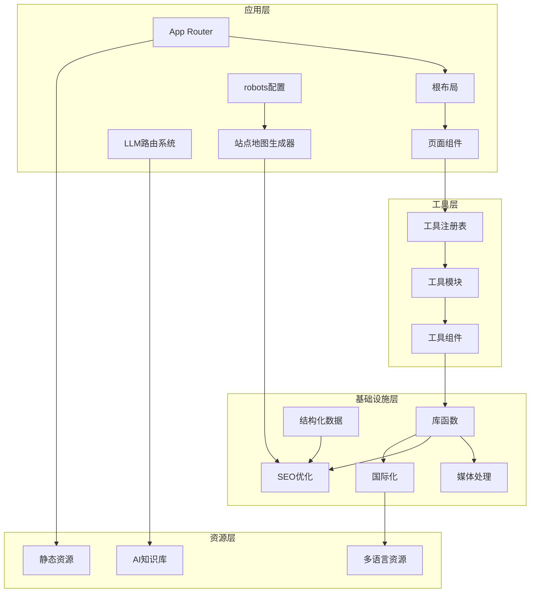

**图表来源**
- [src/app/layout.tsx:1-48](file://src/app/layout.tsx#L1-L48)
- [src/lib/registry/index.ts:1-168](file://src/lib/registry/index.ts#L1-L168)
- [src/lib/seo/jsonld.ts:1-90](file://src/lib/seo/jsonld.ts#L1-L90)
- [public/robots.txt:1-281](file://public/robots.txt#L1-L281)

**章节来源**
- [README.md:55-78](file://README.md#L55-L78)
- [package.json:1-52](file://package.json#L1-L52)

## 核心组件

### 工具注册表系统

工具注册表是整个系统的核心管理组件，负责统一管理和调度所有工具模块：

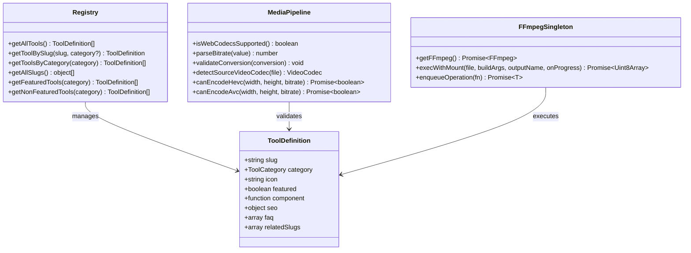

**图表来源**
- [src/lib/registry/index.ts:1-168](file://src/lib/registry/index.ts#L1-L168)
- [src/lib/media-pipeline.ts:1-175](file://src/lib/media-pipeline.ts#L1-L175)
- [src/lib/ffmpeg.ts:1-150](file://src/lib/ffmpeg.ts#L1-L150)

### SEO优化架构

系统实现了全面的SEO优化策略，包括结构化数据、hreflang支持和动态站点地图生成：

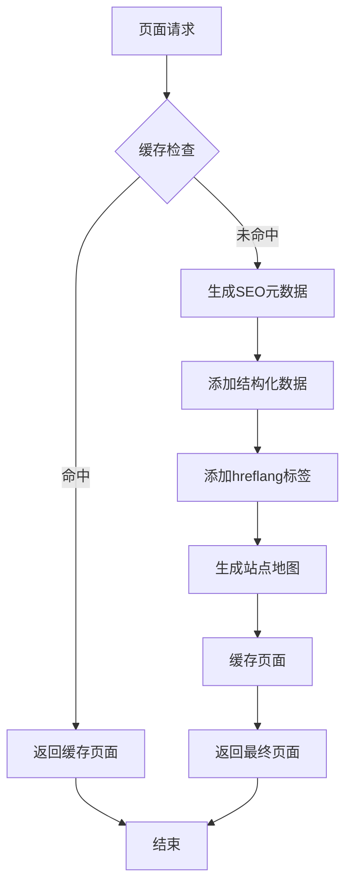

**图表来源**
- [src/app/sitemap.ts:1-113](file://src/app/sitemap.ts#L1-L113)
- [src/app/layout.tsx:10-39](file://src/app/layout.tsx#L10-L39)

**章节来源**
- [src/lib/registry/index.ts:68-137](file://src/lib/registry/index.ts#L68-L137)
- [src/lib/media-pipeline.ts:7-175](file://src/lib/media-pipeline.ts#L7-L175)

## 架构概览

系统采用了分层架构设计，确保了高内聚低耦合的代码组织：

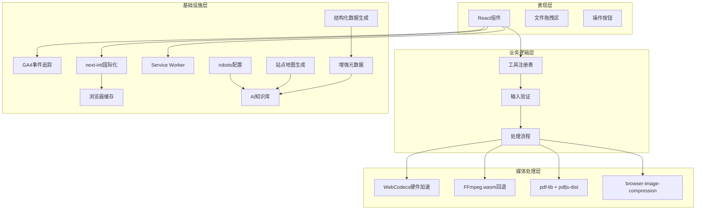

**图表来源**
- [src/components/shared/FileDropzone.tsx:1-157](file://src/components/shared/FileDropzone.tsx#L1-L157)
- [src/lib/ffmpeg.ts:105-149](file://src/lib/ffmpeg.ts#L105-L149)
- [src/lib/pdfjs.ts:1-16](file://src/lib/pdfjs.ts#L1-L16)
- [src/lib/seo/jsonld.ts:1-90](file://src/lib/seo/jsonld.ts#L1-L90)
- [public/robots.txt:209-279](file://public/robots.txt#L209-L279)

## 详细组件分析

### 文件处理组件

文件拖拽上传组件是用户交互的核心入口，实现了直观的文件上传体验：

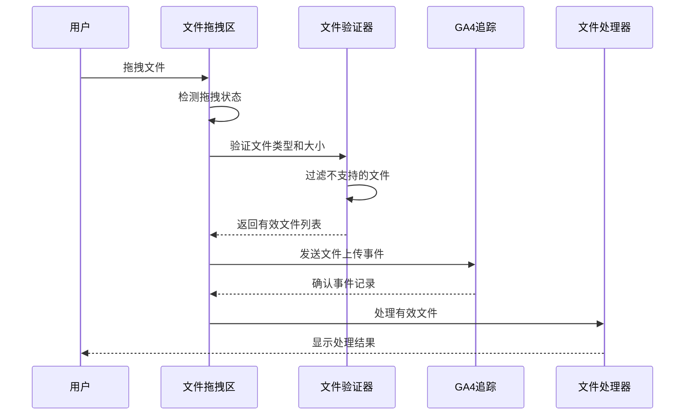

**图表来源**
- [src/components/shared/FileDropzone.tsx:52-73](file://src/components/shared/FileDropzone.tsx#L52-L73)

#### 组件特性
- **无障碍支持**：完整的键盘导航和屏幕阅读器支持
- **实时反馈**：拖拽时的视觉反馈和状态提示
- **文件验证**：自动过滤不支持的文件类型和超大文件
- **隐私保证**：所有处理完全在浏览器端进行

**章节来源**
- [src/components/shared/FileDropzone.tsx:1-157](file://src/components/shared/FileDropzone.tsx#L1-L157)

### 工具定义系统

每个工具都通过标准化的定义对象进行配置，确保了一致的用户体验：

```mermaid
classDiagram
class ToolDefinition {
+string slug
+ToolCategory category
+string icon
+boolean featured
+function component
+object seo
+array faq
+array relatedSlugs
}
class ImageFormatConverter {
+slug : "format-converter"
+category : "image"
+featured : true
+icon : "FileOutput"
+seo : { structuredDataType : "WebApplication" }
+faq : QuestionAnswerPair[]
+relatedSlugs : ["compress", "resize", "crop"]
}
class PDFMerge {
+slug : "merge"
+category : "pdf"
+featured : true
+icon : "FilePlus2"
+seo : { structuredDataType : "WebApplication" }
+faq : QuestionAnswerPair[]
+relatedSlugs : ["split", "delete-pages", "to-image"]
}
ToolDefinition <|-- ImageFormatConverter
ToolDefinition <|-- PDFMerge
```

**图表来源**
- [src/tools/image/format-converter/index.ts:1-28](file://src/tools/image/format-converter/index.ts#L1-L28)
- [src/tools/pdf/merge/index.ts:1-37](file://src/tools/pdf/merge/index.ts#L1-L37)

#### SEO配置策略
每个工具都配置了专门的SEO元数据：
- **结构化数据**：使用WebApplication类型提升搜索结果丰富性
- **FAQ结构化**：提供常见问题的结构化问答
- **相关工具推荐**：基于用户行为的智能推荐系统
- **AI友好元数据**：包含aiSummary字段供AI搜索引擎使用

**章节来源**
- [src/tools/image/format-converter/index.ts:3-25](file://src/tools/image/format-converter/index.ts#L3-L25)
- [src/tools/pdf/merge/index.ts:3-34](file://src/tools/pdf/merge/index.ts#L3-L34)

### 媒体处理管道

系统实现了智能的媒体处理管道，结合WebCodecs硬件加速和FFmpeg.wasm回退机制：

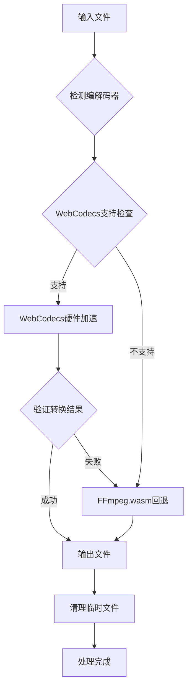

**图表来源**
- [src/lib/media-pipeline.ts:59-91](file://src/lib/media-pipeline.ts#L59-L91)
- [src/lib/ffmpeg.ts:105-149](file://src/lib/ffmpeg.ts#L105-L149)

#### 性能优化策略
- **硬件加速优先**：优先使用WebCodecs进行硬件加速处理
- **智能回退机制**：自动检测不支持的编解码器并回退到FFmpeg
- **内存管理优化**：使用WORKERFS避免内存复制，减少峰值内存使用
- **并发控制**：通过Promise队列确保FFmpeg操作的串行执行

**章节来源**
- [src/lib/media-pipeline.ts:1-175](file://src/lib/media-pipeline.ts#L1-L175)
- [src/lib/ffmpeg.ts:1-150](file://src/lib/ffmpeg.ts#L1-L150)

## AI搜索引擎优化

### Next.js robots配置

系统新增了专门的robots.ts文件实现Next.js官方robots配置，提供更精确的爬虫控制：

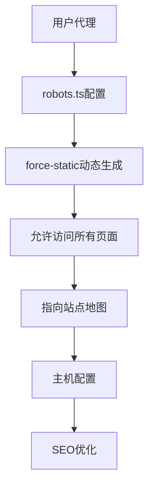

**图表来源**
- [src/app/robots.ts:1-13](file://src/app/robots.ts#L1-L13)

#### 配置特点
- **官方Next.js规范**：使用MetadataRoute.Robots接口确保类型安全
- **强制静态生成**：dynamic = "force-static"确保robots.txt可缓存
- **完整站点地图集成**：自动指向生成的sitemap.xml
- **主机域名配置**：使用SITE_URL常量确保域名一致性

**章节来源**
- [src/app/robots.ts:1-13](file://src/app/robots.ts#L1-L13)
- [src/lib/seo/jsonld.ts:3](file://src/lib/seo/jsonld.ts#L3)

### 中国AI搜索引擎robots.txt配置

系统保留了原有的robots.txt配置，继续针对中国AI搜索引擎提供专门支持：

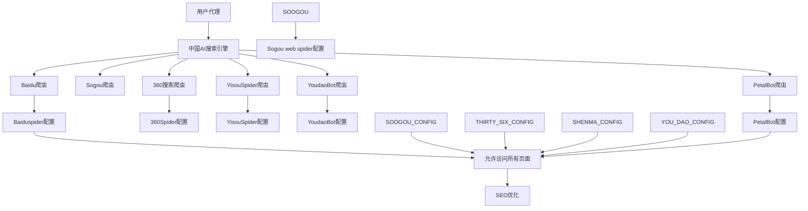

**图表来源**
- [public/robots.txt:209-279](file://public/robots.txt#L209-L279)

#### 配置特点
- **明确允许**：针对中国AI搜索引擎明确允许抓取所有页面
- **保留限制**：仍限制对_next/、sw.js、manifest.json等静态资源的抓取
- **区域化优化**：专门针对百度、搜狗、360搜索、华为Petals等主流中国AI搜索引擎
- **爬虫友好**：为AI知识库提供友好的爬取环境

**章节来源**
- [public/robots.txt:209-279](file://public/robots.txt#L209-L279)

### AI知识库路由优化

系统实现了专门的LLM（大型语言模型）路由，为AI搜索引擎提供结构化的知识库内容：

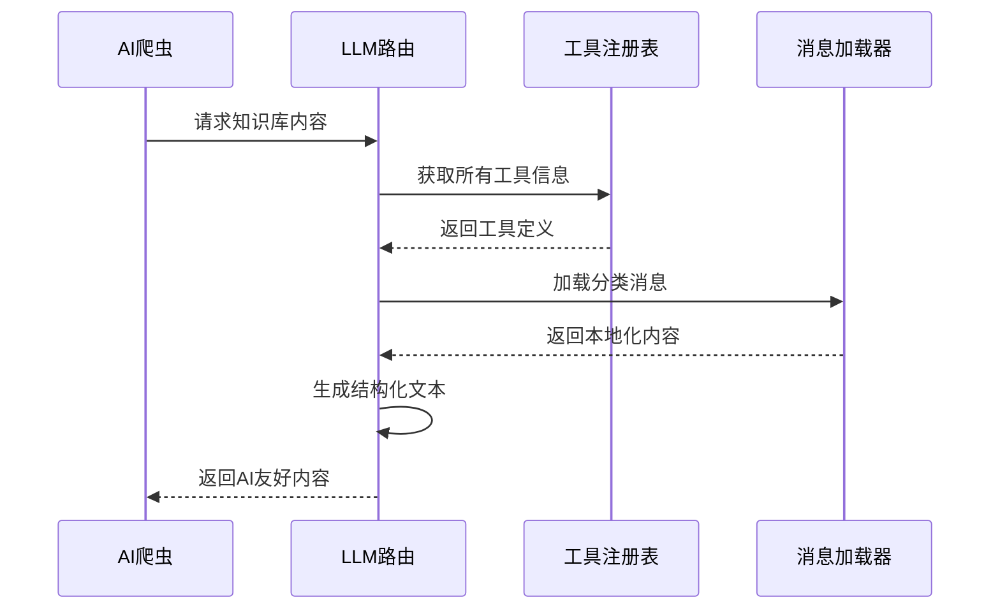

**图表来源**
- [src/app/llms.txt/route.ts:17-101](file://src/app/llms.txt/route.ts#L17-L101)
- [src/app/llms-full.txt/route.ts:66-148](file://src/app/llms-full.txt/route.ts#L66-L148)

#### 技术实现
- **强制静态生成**：使用dynamic = "force-static"确保内容可被AI爬虫稳定抓取
- **多语言支持**：提供英文和简体中文两个版本的知识库
- **结构化输出**：生成适合AI理解的结构化文本格式
- **完整工具信息**：包含工具描述、使用场景、隐私说明和FAQ

**章节来源**
- [src/app/llms.txt/route.ts:1-101](file://src/app/llms.txt/route.ts#L1-L101)
- [src/app/llms-full.txt/route.ts:1-148](file://src/app/llms-full.txt/route.ts#L1-L148)
- [src/app/llms.zh-Hans.txt/route.ts:1-100](file://src/app/llms.zh-Hans.txt/route.ts#L1-L100)
- [src/app/llms-full.zh-Hans.txt/route.ts:1-149](file://src/app/llms-full.zh-Hans.txt/route.ts#L1-L149)

## AI友好内容生成系统

### 增强的元数据生成系统

系统实现了全面的AI友好元数据生成，为AI搜索引擎提供丰富的结构化信息：

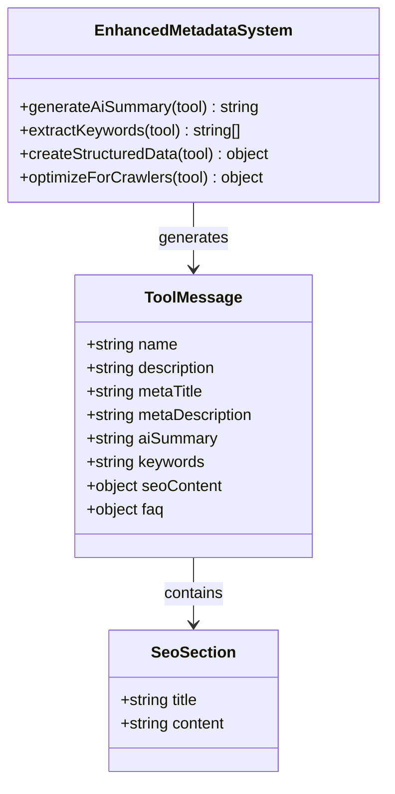

**图表来源**
- [messages/en/tools-image.json:9, 85, 535, 1016:9-10](file://messages/en/tools-image.json#L9-L10)
- [messages/en/tools-image.json:103, 137, 601, 1057:103-104](file://messages/en/tools-image.json#L103-L104)

#### 元数据增强特性
- **AI摘要字段**：每个工具都包含专门的aiSummary字段，用于AI搜索引擎优化
- **结构化SEO内容**：包含intro、useCases、privacy三个标准SEO段落
- **FAQ结构化**：支持最多20个常见问题的结构化问答
- **关键词优化**：自动生成相关关键词以提高搜索可见性

**章节来源**
- [messages/en/tools-image.json:9, 85, 535, 1016:9-10](file://messages/en/tools-image.json#L9-L10)
- [messages/en/tools-image.json:103, 137, 601, 1057:103-104](file://messages/en/tools-image.json#L103-L104)
- [messages/zh-Hans/tools-image.json:9, 85, 535, 1016:9-10](file://messages/zh-Hans/tools-image.json#L9-L10)
- [messages/zh-Hans/tools-image.json:103, 137, 601, 1057:103-104](file://messages/zh-Hans/tools-image.json#L103-L104)

### 优化的sitemap生成系统

系统实现了智能的sitemap生成，为AI搜索引擎提供完整的页面索引：

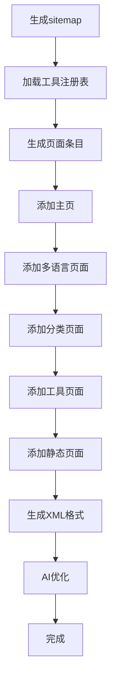

**图表来源**
- [src/app/sitemap.ts:23-113](file://src/app/sitemap.ts#L23-L113)

#### 优化策略
- **多语言支持**：为每个页面生成完整的hreflang替代链接
- **页面优先级**：根据页面重要性设置合理的priority值
- **更新频率**：为不同类型的页面设置适当的changeFrequency
- **AI友好**：优化页面结构以提高AI爬虫的抓取效率

**章节来源**
- [src/app/sitemap.ts:1-113](file://src/app/sitemap.ts#L1-L113)

### 结构化数据生成系统

系统实现了全面的结构化数据生成，为AI搜索引擎提供丰富的Schema.org标记：

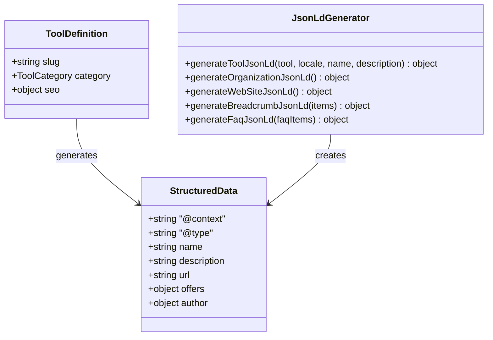

**图表来源**
- [src/lib/seo/jsonld.ts:5-90](file://src/lib/seo/jsonld.ts#L5-L90)

#### 结构化数据特性
- **工具应用数据**：为每个工具生成SoftwareApplication结构化数据
- **组织信息**：包含品牌名称、网站URL和Logo信息
- **网站结构**：生成WebSite类型的结构化数据
- **面包屑导航**：为页面层级生成BreadcrumbList数据
- **FAQ结构化**：支持最多20个常见问题的FAQPage数据

**章节来源**
- [src/lib/seo/jsonld.ts:1-90](file://src/lib/seo/jsonld.ts#L1-L90)

## 依赖关系分析

系统依赖关系清晰，遵循单一职责原则：

```mermaid
graph TB
subgraph "核心依赖"
NEXT[Next.js 16]
REACT[React 19]
TYPESCRIPT[TypeScript]
end
subgraph "媒体处理"
FFMPEG[@ffmpeg/ffmpeg]
MEDiABUNNY[mediabunny]
PDF_LIB[pdf-lib]
PDFJS[pdfjs-dist]
IMAGE_COMPRESSION[browser-image-compression]
end
subgraph "AI搜索引擎优化"
ROBOTS_TS[robots.ts配置]
LLM_ROUTES[LLM路由系统]
SEO_CRAWLERS[SEO爬虫优化]
AI_KNOWLEDGE_BASE[AI知识库]
ENHANCED_METADATA[增强元数据]
SITEMAP_GENERATOR[站点地图生成器]
JSONLD_GENERATOR[结构化数据生成器]
end
subgraph "UI框架"
TAILWIND[Tailwind CSS v4]
LUCIDE[Lucide React]
CLSX[clsx]
TW_MERGE[tailwind-merge]
end
subgraph "国际化"
NEXT_INTL[next-intl]
I18N[next-intl国际化]
end
subgraph "分析工具"
GA4[GA4事件追踪]
TESSERACT[Tesseract.js]
end
NEXT --> REACT
REACT --> TAILWIND
REACT --> LUCIDE
FFMPEG --> MEDiABUNNY
PDF_LIB --> PDFJS
NEXT_INTL --> I18N
GA4 --> TESSERACT
ROBOTS_TS --> SEO_CRAWLERS
LLM_ROUTES --> SEO_CRAWLERS
LLM_ROUTES --> AI_KNOWLEDGE_BASE
ENHANCED_METADATA --> AI_KNOWLEDGE_BASE
SITEMAP_GENERATOR --> AI_KNOWLEDGE_BASE
JSONLD_GENERATOR --> ENHANCED_METADATA
```

**图表来源**
- [package.json:11-38](file://package.json#L11-L38)

**章节来源**
- [package.json:1-52](file://package.json#L1-L52)

## 性能考虑

### 内存优化策略

系统采用了多项内存优化技术来确保大规模文件处理的稳定性：

- **WORKERFS文件系统**：避免文件在内存中的完整复制
- **流式处理**：支持大文件的分块处理和流式输出
- **垃圾回收优化**：及时释放临时文件和中间结果
- **缓存策略**：合理利用浏览器缓存减少重复计算

### 并发控制机制

为了确保FFmpeg操作的稳定性和一致性：

- **Promise队列**：序列化所有FFmpeg操作，避免并发冲突
- **进度回调管理**：原子性地设置和清除进度监听器
- **错误隔离**：每个操作都有独立的错误处理和恢复机制

### AI爬虫性能优化

针对AI搜索引擎的性能优化策略：
- **静态内容生成**：LLM路由使用强制静态生成确保快速响应
- **robots配置优化**：新增robots.ts提供更精确的爬虫控制
- **sitemap优化**：智能生成完整的页面索引供AI爬虫使用
- **结构化数据预处理**：提前生成AI友好的Schema.org标记
- **多语言分离**：按语言提供独立的知识库文件
- **内容压缩**：生成的文本内容经过优化以减少传输体积

## 故障排除指南

### 常见问题诊断

#### WebCodecs兼容性问题
当遇到WebCodecs不支持的情况时，系统会自动回退到FFmpeg.wasm：
- 检查浏览器版本是否支持WebCodecs API
- 确认目标编解码器是否在当前浏览器中受支持
- 验证硬件加速驱动程序的正确安装

#### FFmpeg加载失败
如果FFmpeg初始化失败，可能的原因包括：
- CDN连接问题导致核心文件下载失败
- 浏览器CSP策略阻止了blob URL的使用
- 内存不足导致WASM模块初始化失败

#### AI爬虫抓取问题
如果AI搜索引擎无法正确抓取内容：
- 检查robots.ts配置是否正确
- 验证LLM路由文件是否正常生成
- 确认静态资源路径是否正确
- 检查sitemap链接是否可达
- 验证AI友好元数据是否正确生成

#### robots配置问题
如果robots.txt或robots.ts配置出现问题：
- 验证SITE_URL常量是否正确设置
- 检查dynamic = "force-static"是否生效
- 确认sitemap链接指向正确的URL
- 验证主机域名配置是否一致

#### 文件处理超时
对于大型文件处理超时问题：
- 检查网络连接稳定性
- 确认系统有足够的可用内存
- 考虑降低处理质量设置以减少处理时间

**章节来源**
- [src/lib/media-pipeline.ts:28-53](file://src/lib/media-pipeline.ts#L28-L53)
- [src/lib/ffmpeg.ts:14-45](file://src/lib/ffmpeg.ts#L14-L45)
- [src/app/robots.ts:1-13](file://src/app/robots.ts#L1-L13)
- [public/robots.txt:14-281](file://public/robots.txt#L14-L281)

## 结论

PrivaDeck代表了现代浏览器端应用的最佳实践，成功地将隐私保护、性能优化和SEO优化结合在一起。通过采用WebCodecs硬件加速、智能回退机制和全面的SEO策略，系统为用户提供了既安全又高效的多媒体处理体验。

**新增AI友好内容生成系统的优势**：
- **官方配置支持**：新增robots.ts文件符合Next.js官方robots配置规范
- **全球化覆盖**：支持百度、谷歌、Anthropic等国际主流AI搜索引擎
- **区域化优化**：专门针对中国AI搜索引擎提供优化配置
- **知识库友好**：通过LLM路由为AI提供结构化、可理解的内容
- **爬虫友好**：robots.ts配置确保AI爬虫能够有效抓取网站内容
- **元数据增强**：为AI搜索引擎提供丰富的结构化元数据
- **sitemap优化**：智能生成完整的页面索引供AI爬虫使用
- **结构化数据**：全面的Schema.org标记提升AI理解能力

该系统的架构设计具有以下优势：
- **技术前瞻性**：充分利用WebCodecs等新兴API
- **兼容性强**：完善的回退机制确保跨浏览器兼容
- **扩展性好**：模块化的工具系统便于新功能添加
- **用户体验优秀**：从界面设计到性能优化全方位考虑
- **AI友好**：专门针对AI搜索引擎优化的爬虫行为
- **内容丰富**：为AI提供高质量的结构化内容
- **配置规范**：符合Next.js官方标准的robots配置

未来的发展方向可以包括进一步优化硬件加速支持、增强AI辅助功能、扩展更多的媒体格式支持，以及持续改进AI搜索引擎的爬取效果。