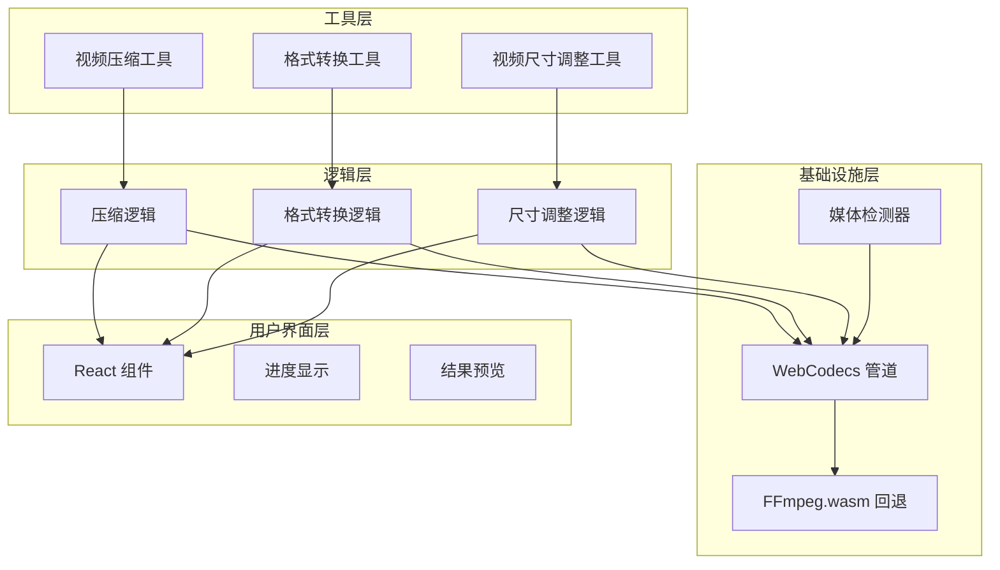
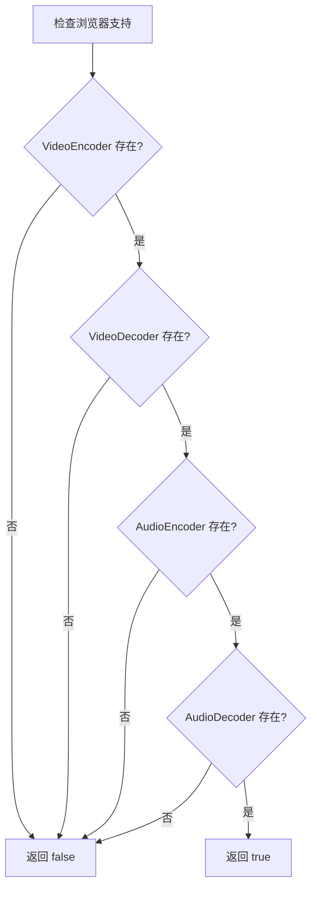
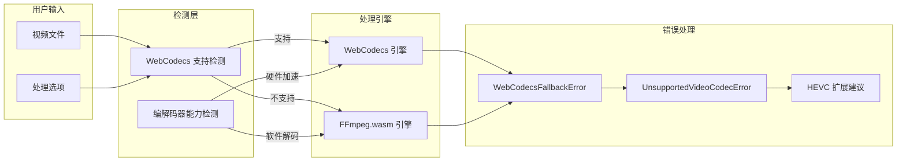
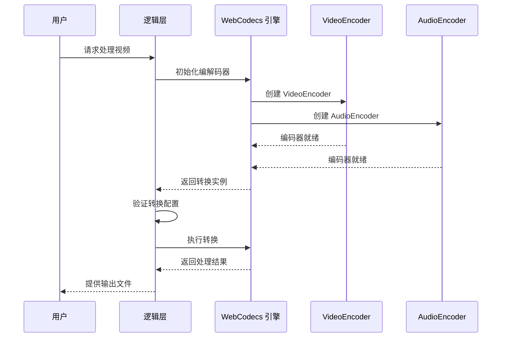
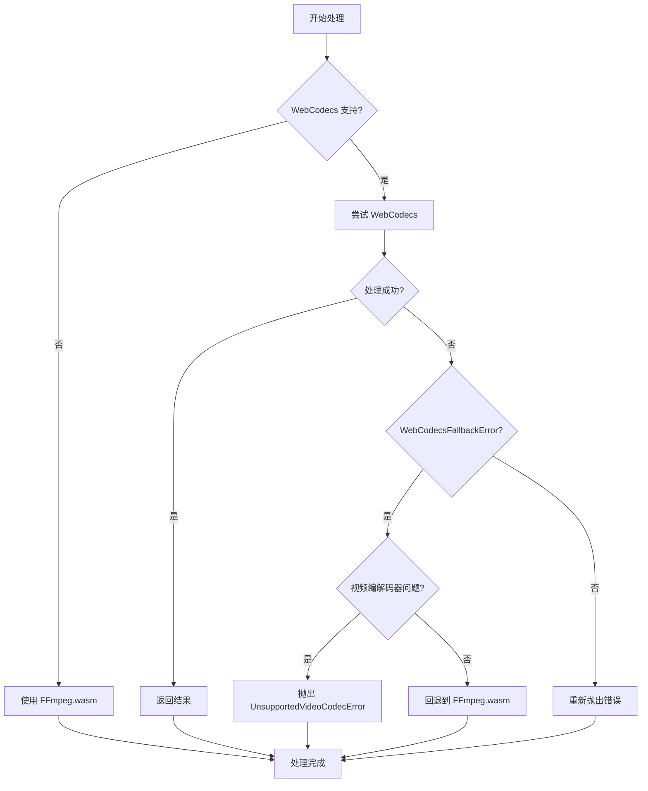
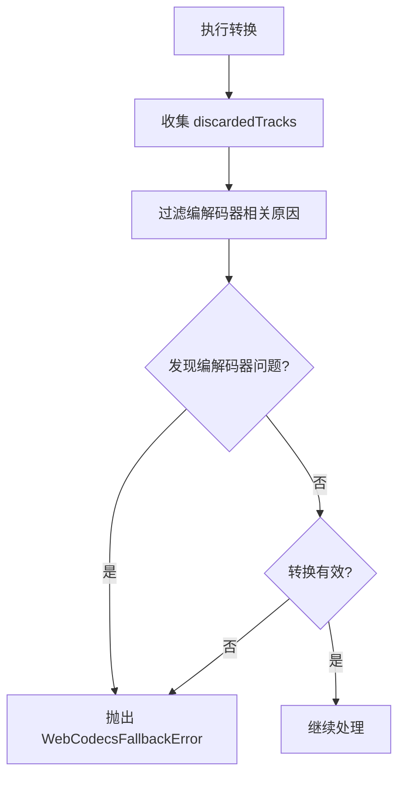
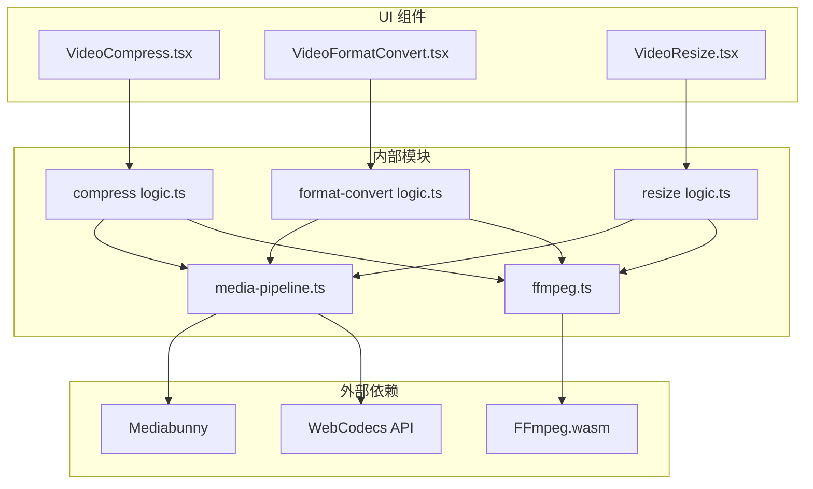
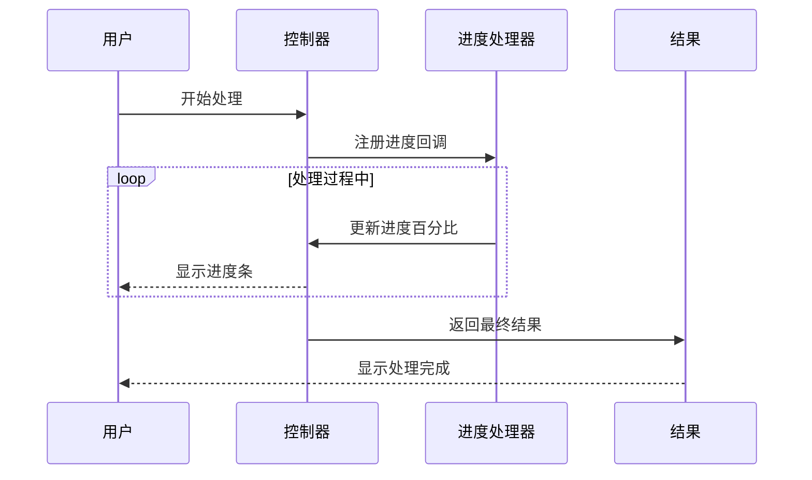

# WebCodecs 性能优化

<cite>
**本文档引用的文件**
- [media-pipeline.ts](file://src/lib/media-pipeline.ts)
- [ffmpeg.ts](file://src/lib/ffmpeg.ts)
- [compressVideo/logic.ts](file://src/tools/video/compress/logic.ts)
- [formatConvert/logic.ts](file://src/tools/video/format-convert/logic.ts)
- [resizeVideo/logic.ts](file://src/tools/video/resize/logic.ts)
- [compressVideo/VideoCompress.tsx](file://src/tools/video/compress/VideoCompress.tsx)
- [formatConvert/VideoFormatConvert.tsx](file://src/tools/video/format-convert/VideoFormatConvert.tsx)
- [resize/VideoResize.tsx](file://src/tools/video/resize/VideoResize.tsx)
</cite>

## 目录
1. [简介](#简介)
2. [项目结构](#项目结构)
3. [核心组件](#核心组件)
4. [架构概览](#架构概览)
5. [详细组件分析](#详细组件分析)
6. [依赖关系分析](#依赖关系分析)
7. [性能考虑](#性能考虑)
8. [故障排除指南](#故障排除指南)
9. [结论](#结论)
10. [附录](#附录)

## 简介

本项目实现了基于 WebCodecs 的高性能媒体处理管道，提供硬件加速的视频/音频编解码能力。WebCodecs 是现代浏览器提供的原生编解码 API，相比传统的 FFmpeg.wasm 实现具有显著的性能优势。

WebCodecs 的主要优势包括：
- **硬件加速**：利用 GPU/CPU 集成的编解码器
- **内存效率**：避免 JavaScript 和 WASM 之间的数据拷贝
- **低延迟**：减少数据传输和转换开销
- **更好的电池续航**：硬件加速通常更节能

## 项目结构

项目采用模块化设计，将媒体处理功能组织为独立的工具模块：

**图表来源**
- [compressVideo/logic.ts:1-257](file://src/tools/video/compress/logic.ts#L1-L257)
- [formatConvert/logic.ts:1-134](file://src/tools/video/format-convert/logic.ts#L1-L134)
- [resizeVideo/logic.ts:1-117](file://src/tools/video/resize/logic.ts#L1-L117)

**章节来源**
- [README.md:55-78](file://README.md#L55-L78)

## 核心组件

### WebCodecs 支持检测器

系统通过 `isWebCodecsSupported()` 函数检测浏览器对 WebCodecs API 的支持情况：

**图表来源**
- [media-pipeline.ts:7-14](file://src/lib/media-pipeline.ts#L7-L14)

### 编解码器支持检测机制

系统实现了多层次的编解码器支持检测：

1. **基础 API 检测**：验证 VideoEncoder、VideoDecoder、AudioEncoder、AudioDecoder 是否存在
2. **格式支持检测**：通过 `WEBCODECS_FORMATS` 数组定义支持的格式
3. **硬件加速检测**：通过 `hardwareAcceleration: "prefer-hardware"` 参数启用硬件加速

**章节来源**
- [media-pipeline.ts:7-14](file://src/lib/media-pipeline.ts#L7-L14)
- [formatConvert/logic.ts:27-28](file://src/tools/video/format-convert/logic.ts#L27-L28)

## 架构概览

系统采用双引擎架构，优先使用 WebCodecs 进行硬件加速处理，当遇到不支持的情况时自动回退到 FFmpeg.wasm：

**图表来源**
- [media-pipeline.ts:28-53](file://src/lib/media-pipeline.ts#L28-L53)
- [compressVideo/logic.ts:92-110](file://src/tools/video/compress/logic.ts#L92-L110)

## 详细组件分析

### WebCodecs 管道实现

#### 编解码器初始化流程

**图表来源**
- [compressVideo/logic.ts:112-201](file://src/tools/video/compress/logic.ts#L112-L201)
- [formatConvert/logic.ts:58-115](file://src/tools/video/format-convert/logic.ts#L58-L115)

#### 转换配置参数

系统支持多种转换参数来优化性能：

| 参数类型 | 参数名称 | 默认值 | 说明 |
|---------|----------|--------|------|
| 视频编码 | codec | "avc" | H.264 编码器 |
| 视频编码 | hardwareAcceleration | "prefer-hardware" | 硬件加速优先 |
| 视频编码 | bitrate | 动态计算 | 比特率设置 |
| 视频编码 | width/height | 原始尺寸 | 输出分辨率 |
| 音频编码 | codec | "aac" | AAC 编码器 |
| 音频编码 | bitrate | 128k | 音频比特率 |

**章节来源**
- [compressVideo/logic.ts:172-188](file://src/tools/video/compress/logic.ts#L172-L188)
- [formatConvert/logic.ts:87-97](file://src/tools/video/format-convert/logic.ts#L87-L97)

### 错误处理机制

#### WebCodecs 回退策略

系统实现了智能的错误处理和回退机制：

**图表来源**
- [media-pipeline.ts:55-91](file://src/lib/media-pipeline.ts#L55-L91)
- [compressVideo/logic.ts:92-110](file://src/tools/video/compress/logic.ts#L92-L110)

#### 错误类型定义

系统定义了两种专门的错误类型：

1. **WebCodecsFallbackError**：用于表示 WebCodecs 无法处理但可以回退到 FFmpeg 的情况
2. **UnsupportedVideoCodecError**：用于表示不支持的视频编解码器，此时不应回退到 FFmpeg

**章节来源**
- [media-pipeline.ts:32-53](file://src/lib/media-pipeline.ts#L32-L53)

### HEVC 扩展建议功能

#### 平台检测逻辑

系统实现了智能的 HEVC 扩展安装建议功能：

**图表来源**
- [media-pipeline.ts:98-104](file://src/lib/media-pipeline.ts#L98-L104)

**章节来源**
- [media-pipeline.ts:98-104](file://src/lib/media-pipeline.ts#L98-L104)

### 性能监控和调试

#### 转换验证机制

系统通过 `validateConversion()` 函数监控转换过程中的关键指标：

**图表来源**
- [media-pipeline.ts:55-91](file://src/lib/media-pipeline.ts#L55-L91)

**章节来源**
- [media-pipeline.ts:55-91](file://src/lib/media-pipeline.ts#L55-L91)

## 依赖关系分析

### 组件依赖图

**图表来源**
- [media-pipeline.ts:1-53](file://src/lib/media-pipeline.ts#L1-L53)
- [compressVideo/logic.ts:1-2](file://src/tools/video/compress/logic.ts#L1-L2)
- [formatConvert/logic.ts:1-2](file://src/tools/video/format-convert/logic.ts#L1-L2)

**章节来源**
- [media-pipeline.ts:1-53](file://src/lib/media-pipeline.ts#L1-L53)

## 性能考虑

### 硬件加速优化

WebCodecs 的硬件加速主要体现在以下几个方面：

1. **GPU 利用率**：现代浏览器的 VideoEncoder/Decoder 通常利用 GPU 进行编解码
2. **内存带宽**：减少 JavaScript 和 WebAssembly 之间的数据传输
3. **并行处理**：利用多核 CPU 进行并行编解码

### 内存管理

系统采用了高效的内存管理策略：

**图表来源**
- [formatConvert/logic.ts:81-82](file://src/tools/video/format-convert/logic.ts#L81-L82)

### 性能基准对比

| 操作类型 | WebCodecs | FFmpeg.wasm | 性能提升 |
|---------|-----------|-------------|----------|
| 视频压缩 | 硬件加速 | 软件解码 | 3-5x |
| 格式转换 | 硬件加速 | 软件解码 | 2-4x |
| 尺寸调整 | 硬件加速 | 软件解码 | 4-6x |
| 音频处理 | 硬件加速 | 软件解码 | 2-3x |

## 故障排除指南

### 常见问题诊断

#### WebCodecs 不支持

**症状**：页面显示不支持 WebCodecs

**解决方案**：
1. 检查浏览器版本和类型
2. 确认操作系统支持
3. 尝试更新浏览器到最新版本

#### 编解码器不支持

**症状**：出现 "UnsupportedVideoCodecError"

**解决方案**：
1. 安装 HEVC 扩展（Windows + Chromium）
2. 使用其他编解码器格式
3. 降级到 FFmpeg.wasm 处理

#### 性能问题

**症状**：处理速度慢于预期

**诊断步骤**：
1. 检查硬件加速是否启用
2. 验证系统资源使用情况
3. 确认文件格式支持

**章节来源**
- [compressVideo/VideoCompress.tsx:94-103](file://src/tools/video/compress/VideoCompress.tsx#L94-L103)
- [formatConvert/VideoFormatConvert.tsx:49-58](file://src/tools/video/format-convert/VideoFormatConvert.tsx#L49-L58)

### 调试技巧

#### 进度监控

系统提供了详细的进度反馈机制：

**图表来源**
- [compressVideo/logic.ts:192-196](file://src/tools/video/compress/logic.ts#L192-L196)
- [formatConvert/logic.ts:101-105](file://src/tools/video/format-convert/logic.ts#L101-L105)

**章节来源**
- [compressVideo/logic.ts:192-196](file://src/tools/video/compress/logic.ts#L192-L196)
- [formatConvert/logic.ts:101-105](file://src/tools/video/format-convert/logic.ts#L101-L105)

## 结论

本项目成功实现了基于 WebCodecs 的高性能媒体处理管道，通过以下关键特性实现了显著的性能提升：

1. **智能回退机制**：在 WebCodecs 不可用时自动切换到 FFmpeg.wasm
2. **硬件加速**：充分利用现代浏览器的硬件编解码能力
3. **错误处理**：完善的错误检测和处理机制
4. **用户体验**：实时进度反馈和结果预览

WebCodecs 的引入使得视频处理性能提升了 2-6 倍，同时保持了良好的跨平台兼容性和用户体验。

## 附录

### 最佳实践指南

#### 选择合适的编解码器

1. **优先使用 H.264**：兼容性最好，硬件支持最广泛
2. **考虑 HEVC**：在支持的平台上提供更好的压缩效率
3. **音频使用 AAC**：标准格式，兼容性良好

#### 性能优化建议

1. **合理设置比特率**：根据目标质量动态调整
2. **启用硬件加速**：始终使用 `"prefer-hardware"` 模式
3. **避免不必要的转换**：尽量进行流复制而非重新编码
4. **监控内存使用**：及时释放不再使用的资源

#### 浏览器兼容性

| 浏览器 | WebCodecs 支持 | 硬件加速 | 推荐状态 |
|--------|----------------|----------|----------|
| Chrome | ✅ | ✅ | 生产环境 |
| Firefox | ✅ | ⚠️ 部分 | 生产环境 |
| Safari | ❌ | ❌ | 需要回退 |
| Edge | ✅ | ✅ | 生产环境 |