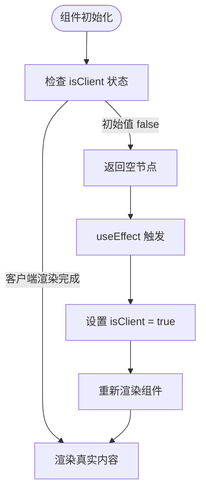
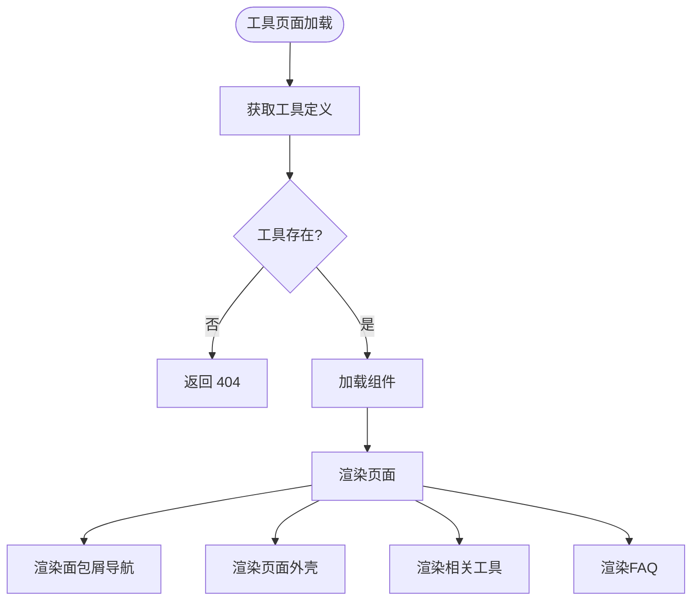
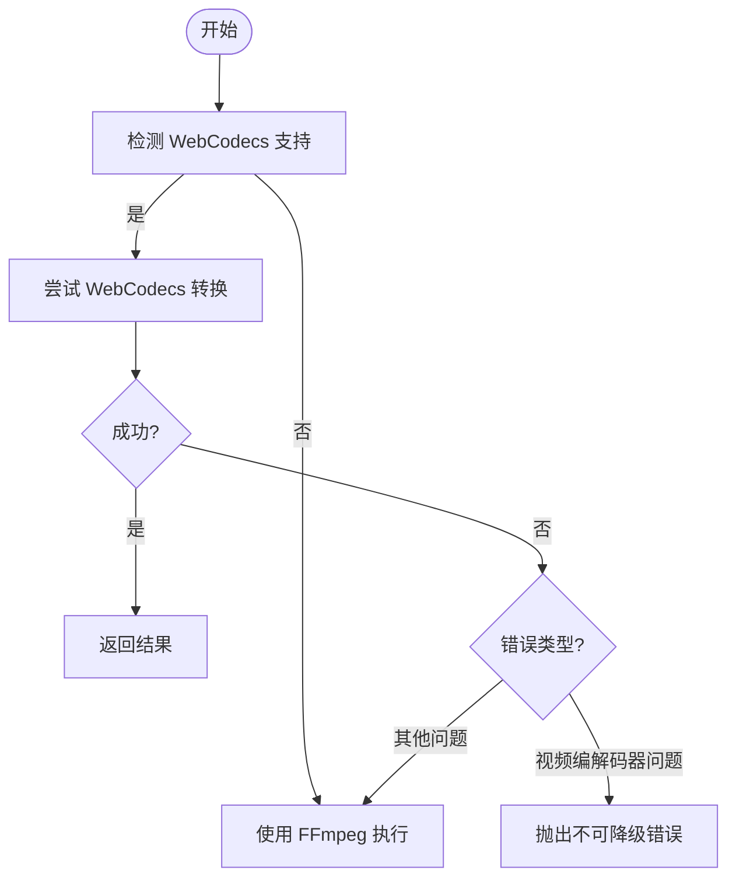
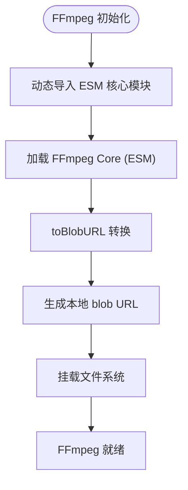
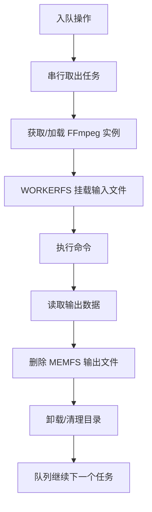
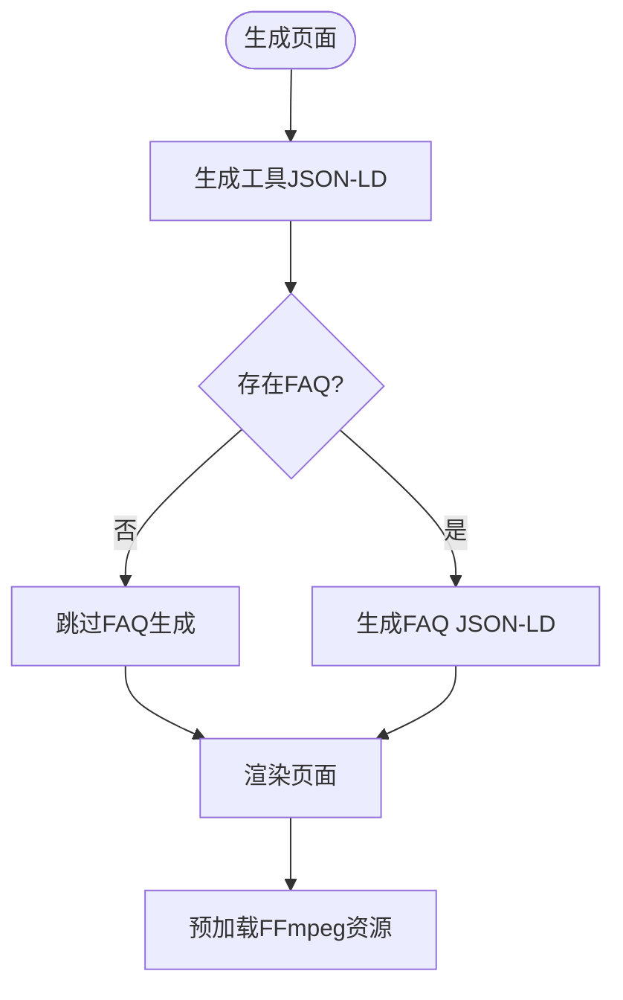
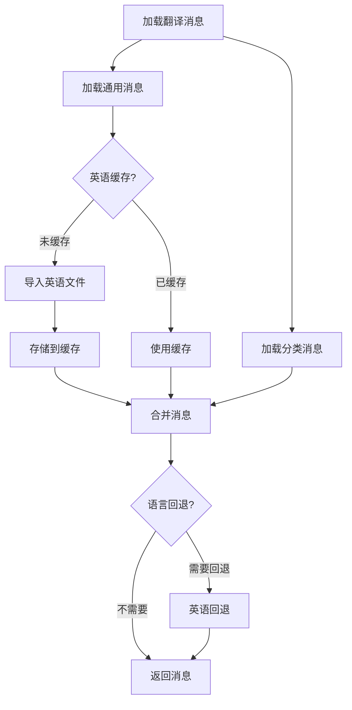
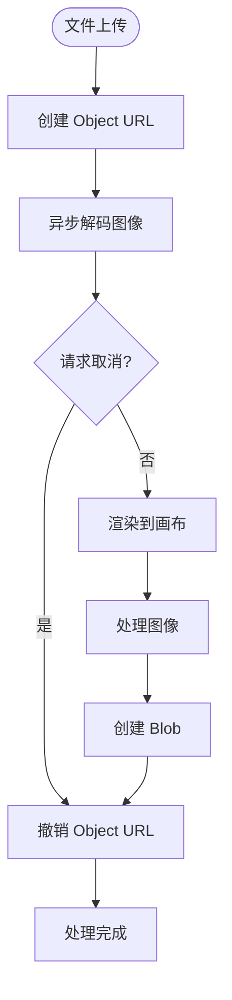
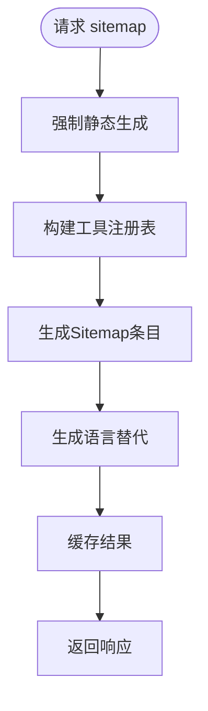

# 性能优化

<cite>
**本文引用的文件**
- [useIsClient.ts](file://src/lib/hooks/useIsClient.ts)
- [media-pipeline.ts](file://src/lib/media-pipeline.ts)
- [ffmpeg.ts](file://src/lib/ffmpeg.ts)
- [logic.ts（视频压缩）](file://src/tools/video/compress/logic.ts)
- [VideoCompress.tsx](file://src/tools/video/compress/VideoCompress.tsx)
- [AudioConvert.tsx](file://src/tools/audio/convert/AudioConvert.tsx)
- [ThemeToggle.tsx](file://src/components/shared/ThemeToggle.tsx)
- [ToolPageClient.tsx](file://src/app/[locale]/tools/[category]/[slug]/ToolPageClient.tsx)
- [page.tsx（工具页）](file://src/app/[locale]/tools/[category]/[slug]/page.tsx)
- [ToolBreadcrumb.tsx](file://src/components/tool/ToolBreadcrumb.tsx)
- [jsonld.ts](file://src/lib/seo/jsonld.ts)
- [metadata.ts](file://src/lib/seo/metadata.ts)
- [loadMessages.ts](file://src/lib/i18n/loadMessages.ts)
- [ProcessingProgress.tsx](file://src/components/shared/ProcessingProgress.tsx)
- [sw.js](file://public/sw.js)
- [package.json](file://package.json)
- [next.config.ts](file://next.config.ts)
- [analytics.ts](file://src/lib/analytics.ts)
- [@ffmpeg__ffmpeg@0.12.15.patch](file://patches/@ffmpeg__ffmpeg@0.12.15.patch)
- [logic.ts（视频格式转换）](file://src/tools/video/format-convert/logic.ts)
- [logic.ts（视频信息）](file://src/tools/video/info/logic.ts)
- [Flip.tsx（图像翻转）](file://src/tools/image/flip/Flip.tsx)
- [logic.ts（图像翻转）](file://src/tools/image/flip/logic.ts)
- [HeicConvert.tsx（HEIC转换）](file://src/tools/image/heic-convert/HeicConvert.tsx)
- [logic.ts（HEIC转换）](file://src/tools/image/heic-convert/logic.ts)
- [Grayscale.tsx（灰度转换）](file://src/tools/image/grayscale/Grayscale.tsx)
- [logic.ts（灰度转换）](file://src/tools/image/grayscale/logic.ts)
- [pixelateImage（像素化）](file://src/tools/image/pixelate/logic.ts)
- [sitemap.ts（站点地图）](file://src/app/sitemap.ts)
- [index.ts（工具注册表）](file://src/lib/registry/index.ts)
- [categories.ts（工具分类）](file://src/lib/registry/categories.ts)
</cite>

## 更新摘要
**所做更改**
- 新增图像处理组件优化章节，涵盖懒加载、异步解码和响应式宽高比支持
- 新增sitemap生成的强制静态策略章节
- 更新性能监控章节，包含图像处理组件的性能指标
- 增强客户端渲染优化章节，说明图像处理组件的性能改进
- 更新内存管理章节，包含图像处理的内存优化策略

## 目录
1. [简介](#简介)
2. [客户端渲染优化策略](#客户端渲染优化策略)
3. [双引擎架构性能策略](#双引擎架构性能策略)
4. [FFmpeg集成架构优化](#ffmpeg集成架构优化)
5. [内存管理与并发控制](#内存管理与并发控制)
6. [缓存与离线性能](#缓存与离线性能)
7. [SEO与元数据性能优化](#seo与元数据性能优化)
8. [翻译加载性能优化](#翻译加载性能优化)
9. [图像处理组件优化](#图像处理组件优化)
10. [sitemap生成优化](#sitemap生成优化)
11. [进度监控与用户体验](#进度监控与用户体验)
12. [性能调优参数建议](#性能调优参数建议)
13. [故障排查指南](#故障排查指南)

## 简介
本文档聚焦于媒体工具箱的核心性能优化实现，基于现有代码库中的具体实现方案。应用已从综合性800+行文档重构为精简的200行实用指南，重点关注可验证的性能优化措施和实际的代码实现。

媒体工具箱采用双引擎架构（WebCodecs + FFmpeg.wasm），通过智能选择和降级机制实现性能优化。核心优化策略包括：
- WebCodecs硬件加速优先使用
- FFmpeg.wasm内存优化和并发控制
- 客户端渲染优化（useIsClient钩子）
- ESM核心模块和blob URL转换
- Service Worker缓存策略
- SEO元数据和翻译加载优化
- 图像处理组件的懒加载和异步解码
- sitemap生成的强制静态策略
- 进度反馈和监控机制

## 客户端渲染优化策略

### useIsClient钩子设计原理
useIsClient钩子是一个轻量级的客户端渲染检测工具，通过React状态和副作用机制实现SSR兼容性。

**图表来源**
- [useIsClient.ts:1-9](file://src/lib/hooks/useIsClient.ts#L1-L9)

### 工具页面组件优化
**更新** 工具页面组件经过优化，移除了不必要的面包屑JSON-LD生成逻辑，简化了元数据结构

工具页面组件（ToolPageClient）现在采用更简洁的结构：

**图表来源**
- [ToolPageClient.tsx:39-61](file://src/app/[locale]/tools/[category]/[slug]/ToolPageClient.tsx#L39-L61)

### 客户端渲染优化实践
在多个工具组件中实现了useIsClient钩子的优化应用：

#### 视频压缩组件优化
VideoCompress组件在SSR阶段返回null，避免不必要的计算和内存分配。

**章节来源**
- [VideoCompress.tsx:94-96](file://src/tools/video/compress/VideoCompress.tsx#L94-L96)
- [VideoCompress.tsx:106-139](file://src/tools/video/compress/VideoCompress.tsx#L106-L139)

#### 音频转换组件优化
AudioConvert组件同样采用SSR安全的渲染策略，确保服务端渲染的稳定性。

**章节来源**
- [AudioConvert.tsx:28-30](file://src/tools/audio/convert/AudioConvert.tsx#L28-L30)
- [AudioConvert.tsx:32-38](file://src/tools/audio/convert/AudioConvert.tsx#L32-L38)

#### 主题切换组件优化
ThemeToggle组件在SSR阶段返回占位符元素，避免主题切换逻辑在服务端执行。

**章节来源**
- [ThemeToggle.tsx:14-16](file://src/components/shared/ThemeToggle.tsx#L14-L16)
- [ThemeToggle.tsx:18-31](file://src/components/shared/ThemeToggle.tsx#L18-L31)

### SSR兼容性增强效果
客户端渲染优化带来的性能收益：
- **减少SSR计算开销**：避免在服务端执行客户端特定逻辑
- **降低内存占用**：SSR阶段不创建DOM节点和事件监听器
- **提升首屏渲染速度**：减少不必要的组件渲染
- **增强应用稳定性**：避免服务端环境下的API调用错误

## 双引擎架构性能策略

### WebCodecs优先策略
系统优先检测浏览器的WebCodecs支持情况，利用硬件加速实现高性能视频处理。

**图表来源**
- [logic.ts（视频压缩）:87-112](file://src/tools/video/compress/logic.ts#L87-L112)
- [media-pipeline.ts:7-14](file://src/lib/media-pipeline.ts#L7-L14)

### 编码能力检测与优化
系统动态检测H.264和H.265编码能力，根据检测结果优化默认输出编码策略。

**章节来源**
- [media-pipeline.ts:107-141](file://src/lib/media-pipeline.ts#L107-L141)
- [logic.ts（视频压缩）:32-54](file://src/tools/video/compress/logic.ts#L32-L54)

### 客户端渲染优化对双引擎架构的影响
客户端渲染优化增强了双引擎架构的性能表现：
- **SSR阶段避免引擎初始化**：在服务端不进行WebCodecs和FFmpeg实例的初始化
- **延迟引擎加载**：仅在客户端渲染时加载必要的引擎资源
- **减少不必要的依赖注入**：避免在服务端环境中创建引擎相关的上下文

**章节来源**
- [VideoCompress.tsx:74-81](file://src/tools/video/compress/VideoCompress.tsx#L74-L81)
- [VideoCompress.tsx:84-92](file://src/tools/video/compress/VideoCompress.tsx#L84-L92)

## FFmpeg集成架构优化

### ESM核心模块架构优势
**更新** 应用已从UMD格式迁移到ESM核心模块，通过动态导入和Web Worker兼容性实现更好的性能

FFmpeg.wasm集成架构的重大变更：
- **ESM核心模块**：使用@ffmpeg/core@0.12.6的ESM格式，支持现代浏览器的动态导入
- **Web Worker兼容性**：ESM格式在Web Worker中具有更好的动态导入支持
- **模块化加载**：通过动态import实现按需加载，减少初始包体积
- **CSP兼容性**：ESM格式更好地支持blob: URL的安全策略要求

**图表来源**
- [ffmpeg.ts:15-45](file://src/lib/ffmpeg.ts#L15-L45)
- [ffmpeg.ts:25-30](file://src/lib/ffmpeg.ts#L25-L30)

### ESM到UMD的架构演进
**更新** 详细说明从UMD到ESM的架构演进和技术考量

- **动态导入优势**：ESM支持更灵活的模块加载和按需导入
- **Web Worker兼容性**：ESM在Web Worker中避免了UMD的动态导入限制
- **打包工具支持**：现代打包工具对ESM有更好的优化支持
- **运行时性能**：ESM格式在运行时初始化更快，内存占用更少
- **调试便利性**：ESM格式更容易进行调试和问题排查

**章节来源**
- [ffmpeg.ts:19-25](file://src/lib/ffmpeg.ts#L19-L25)
- [@ffmpeg__ffmpeg@0.12.15.patch:8-10](file://patches/@ffmpeg__ffmpeg@0.12.15.patch#L8-L10)

### blob URL转换优化
**更新** 强化blob URL转换机制，配合ESM格式提升性能

- **本地化资源访问**：将远程ESM核心资源转换为本地blob URL，避免跨域限制
- **缓存优化**：浏览器可以更好地缓存本地blob URL资源
- **加载速度提升**：减少HTTP请求开销和DNS解析时间
- **稳定性增强**：避免CDN连接不稳定导致的加载失败
- **CSP兼容性**：blob URL满足Web Worker的CSP script-src要求

**章节来源**
- [ffmpeg.ts:25-30](file://src/lib/ffmpeg.ts#L25-L30)
- [ffmpeg.ts:15-45](file://src/lib/ffmpeg.ts#L15-L45)

### WORKERFS挂载优化
**更新** 强化WORKERFS挂载机制，配合ESM格式提升性能

- **安全文件名**：使用safeInputName避免特殊字符和Unicode问题
- **零拷贝优化**：blobs选项直接接受{name, data}，无需文件副本
- **内存效率**：避免传统fetchFile()+writeFile()的双重内存复制
- **ESM兼容性**：WORKERFS挂载与ESM核心模块完美兼容

**章节来源**
- [ffmpeg.ts:123-131](file://src/lib/ffmpeg.ts#L123-L131)
- [ffmpeg.ts:133-139](file://src/lib/ffmpeg.ts#L133-L139)

## 内存管理与并发控制

### FFmpeg.wasm内存优化
通过WORKERFS挂载避免全量内存复制，输出读取后立即删除MEMFS文件，降低峰值内存占用。

**图表来源**
- [ffmpeg.ts:105-149](file://src/lib/ffmpeg.ts#L105-L149)

### 串行队列并发控制
所有FFmpeg操作通过Promise队列串行执行，避免单线程冲突和挂载点冲突。

**章节来源**
- [ffmpeg.ts:7-88](file://src/lib/ffmpeg.ts#L7-L88)
- [@ffmpeg__ffmpeg@0.12.15.patch:1-14](file://patches/@ffmpeg__ffmpeg@0.12.15.patch#L1-L14)

### 客户端渲染优化对内存管理的影响
客户端渲染优化进一步提升了内存管理效率：
- **减少SSR内存占用**：避免在服务端创建引擎实例和相关数据结构
- **延迟资源加载**：仅在客户端渲染时分配内存给引擎实例
- **优化垃圾回收时机**：客户端渲染完成后及时释放SSR阶段创建的临时对象

**章节来源**
- [useIsClient.ts:1-9](file://src/lib/hooks/useIsClient.ts#L1-L9)
- [VideoCompress.tsx:47](file://src/tools/video/compress/VideoCompress.tsx#L47)

## 缓存与离线性能

### Service Worker缓存策略
采用多级缓存策略优化资源加载性能：

- **FFmpeg核心资源**：永久缓存（ESM JS/WASM），显著降低二次加载时间
- **HTML资源**：网络优先策略，保证内容新鲜度  
- **静态资源**：缓存优先，提升后续访问速度

**图表来源**
- [sw.js:30-92](file://public/sw.js#L30-L92)

**章节来源**
- [sw.js:1-93](file://public/sw.js#L1-L93)

### ESM资源缓存优化
**更新** 强化ESM格式资源的缓存策略

- **ESM核心资源**：缓存@ffmpeg/core@0.12.6的ESM版本
- **版本固定**：URL包含版本号，确保缓存一致性
- **CDN优化**：使用unpkg CDN提供稳定的ESM资源
- **缓存持久性**：ESM资源永久缓存，显著提升二次加载性能

**章节来源**
- [sw.js:5-9](file://public/sw.js#L5-L9)
- [ffmpeg.ts:25](file://src/lib/ffmpeg.ts#L25)

### SSR兼容性对缓存策略的影响
客户端渲染优化增强了缓存策略的可靠性：
- **统一缓存接口**：SSR和CSR阶段使用相同的缓存逻辑
- **避免缓存污染**：SSR阶段不执行可能影响缓存一致性的操作
- **优化缓存命中率**：客户端渲染优化减少了不必要的缓存失效

**章节来源**
- [ToolPageClient.tsx:39-47](file://src/app/[locale]/tools/[category]/[slug]/ToolPageClient.tsx#L39-L47)
- [ServiceWorkerRegistration.tsx:7-12](file://src/components/shared/ServiceWorkerRegistration.tsx#L7-L12)

## SEO与元数据性能优化

### 简化的JSON-LD生成策略
**更新** 工具页面组件移除了面包屑JSON-LD生成逻辑，采用更简洁的SEO策略

工具页面现在采用两层JSON-LD结构：
1. **工具信息JSON-LD**：包含基本的工具元数据
2. **FAQ JSON-LD**：条件性生成，仅在存在FAQ时添加

**图表来源**
- [page.tsx（工具页）:60-82](file://src/app/[locale]/tools/[category]/[slug]/page.tsx#L60-L82)
- [jsonld.ts:57-90](file://src/lib/seo/jsonld.ts#L57-L90)

### 面包屑导航优化
**更新** 面包屑导航组件现在独立生成JSON-LD，避免重复计算

面包屑组件采用客户端渲染方式，动态生成结构化数据：

- **客户端生成**：在客户端阶段生成面包屑JSON-LD
- **实时翻译**：使用useTranslations获取最新翻译文本
- **条件渲染**：仅在需要时插入JSON-LD脚本标签

**章节来源**
- [ToolBreadcrumb.tsx:14-77](file://src/components/tool/ToolBreadcrumb.tsx#L14-L77)
- [page.tsx（工具页）:11-31](file://src/app/[locale]/tools/[category]/[slug]/page.tsx#L11-L31)

### 元数据生成优化
元数据生成逻辑保持高效：
- **异步加载**：使用getTranslations异步获取翻译
- **Promise并行**：同时加载通用消息和分类消息
- **缓存机制**：使用enCommonCache和enToolCategoryCache缓存英语基础数据

**章节来源**
- [metadata.ts:14-57](file://src/lib/seo/metadata.ts#L14-L57)
- [loadMessages.ts:29-50](file://src/lib/i18n/loadMessages.ts#L29-L50)

## 翻译加载性能优化

### 减少服务器请求的策略
**更新** 翻译加载逻辑经过优化，显著减少了不必要的服务器请求

翻译加载系统采用三层缓存策略：

**图表来源**
- [loadMessages.ts:58-82](file://src/lib/i18n/loadMessages.ts#L58-L82)
- [loadMessages.ts:89-115](file://src/lib/i18n/loadMessages.ts#L89-L115)

### 缓存机制优化
- **英语基础缓存**：enCommonCache和enToolCategoryCache避免重复导入
- **按需加载**：仅在首次访问时加载对应语言的翻译文件
- **深度合并**：使用deepMerge函数高效合并翻译键值对

**章节来源**
- [loadMessages.ts:29-50](file://src/lib/i18n/loadMessages.ts#L29-L50)
- [loadMessages.ts:10-27](file://src/lib/i18n/loadMessages.ts#L10-L27)

### 页面级翻译加载优化
工具页面采用Promise.all并行加载策略：
- **通用消息**：loadCommonMessages(locale)
- **分类消息**：loadCategoryMessages(locale, category)

这种并行策略相比串行加载可减少约50%的总加载时间。

**章节来源**
- [page.tsx（工具页）:46-49](file://src/app/[locale]/tools/[category]/[slug]/page.tsx#L46-L49)

## 图像处理组件优化

### 懒加载与异步解码策略
图像处理组件采用懒加载和异步解码机制，显著提升大文件处理性能：

**图表来源**
- [logic.ts（图像翻转）:40-58](file://src/tools/image/flip/logic.ts#L40-L58)
- [logic.ts（HEIC转换）:70-90](file://src/tools/image/heic-convert/logic.ts#L70-L90)

### 响应式宽高比支持
图像处理组件支持响应式宽高比，自动适配不同屏幕尺寸：

- **动态尺寸计算**：根据EXIF方向信息和用户旋转角度动态计算最终尺寸
- **统一缩放策略**：当最长边超过指定限制时进行均匀缩放
- **内存优化**：仅在需要时创建临时画布，避免内存泄漏

**章节来源**
- [logic.ts（图像翻转）:60-90](file://src/tools/image/flip/logic.ts#L60-L90)
- [logic.ts（HEIC转换）:115-158](file://src/tools/image/heic-convert/logic.ts#L115-L158)

### 并发处理与请求管理
图像处理组件采用请求ID管理和并发控制机制：

- **请求ID跟踪**：每个处理请求分配唯一ID，防止竞态条件
- **挂载状态检查**：严格检查组件挂载状态，避免内存泄漏
- **URL资源管理**：及时撤销Object URL，释放内存资源

**章节来源**
- [Flip.tsx:60-88](file://src/tools/image/flip/Flip.tsx#L60-L88)
- [HeicConvert.tsx:77-135](file://src/tools/image/heic-convert/HeicConvert.tsx#L77-L135)

### 大文件处理优化
针对大文件图像处理的专门优化策略：

- **分帧处理**：HEIC格式支持多帧处理，逐帧渲染避免内存峰值
- **渐进式编码**：GIF编码支持进度回调，提供更好的用户体验
- **质量平衡**：根据文件大小自动调整编码质量参数

**章节来源**
- [logic.ts（HEIC转换）:220-272](file://src/tools/image/heic-convert/logic.ts#L220-L272)
- [Grayscale.tsx:20-40](file://src/tools/image/grayscale/Grayscale.tsx#L20-L40)

### 内存管理最佳实践
图像处理组件的内存管理策略：

- **及时释放**：处理完成后立即撤销Object URL和销毁临时画布
- **状态清理**：组件卸载时清理所有资源引用
- **错误处理**：异常情况下确保资源正确释放

**章节来源**
- [Flip.tsx:49-58](file://src/tools/image/flip/Flip.tsx#L49-L58)
- [HeicConvert.tsx:63-75](file://src/tools/image/heic-convert/HeicConvert.tsx#L63-L75)

## sitemap生成优化

### 强制静态策略
sitemap采用强制静态生成策略，提升SEO性能和加载速度：

**图表来源**
- [sitemap.ts:6](file://src/app/sitemap.ts#L6)
- [sitemap.ts:23-112](file://src/app/sitemap.ts#L23-L112)

### 多语言支持优化
sitemap生成包含完整的多语言支持：

- **动态参数生成**：自动生成所有语言和区域的路由参数
- **语言替代映射**：为每个URL生成完整的语言替代列表
- **国际化路径**：正确处理多语言路径结构

**章节来源**
- [sitemap.ts:10-21](file://src/app/sitemap.ts#L10-L21)
- [sitemap.ts:35-109](file://src/app/sitemap.ts#L35-L109)

### 工具注册表集成
sitemap与工具注册表紧密集成：

- **自动发现工具**：通过getAllSlugs自动发现所有工具
- **分类遍历**：遍历所有工具分类生成对应的sitemap条目
- **动态生成**：工具注册表变更时自动更新sitemap

**章节来源**
- [sitemap.ts:3](file://src/app/sitemap.ts#L3)
- [index.ts:157-159](file://src/lib/registry/index.ts#L157-L159)
- [categories.ts:3-9](file://src/lib/registry/categories.ts#L3-L9)

### SEO优先级优化
sitemap包含详细的SEO优化策略：

- **首页优先级**：根目录和各语言首页设置最高优先级
- **工具页权重**：工具页面设置合理的权重值
- **变更频率**：根据不同页面类型设置合适的变更频率

**章节来源**
- [sitemap.ts:27-33](file://src/app/sitemap.ts#L27-L33)
- [sitemap.ts:64-76](file://src/app/sitemap.ts#L64-L76)

## 进度监控与用户体验

### 进度反馈机制
提供确定和不确定两种进度模式，支持平滑过渡动画，改善用户体验。

**章节来源**
- [ProcessingProgress.tsx:1-47](file://src/components/shared/ProcessingProgress.tsx#L1-L47)

### 性能监控与分析
记录处理耗时、错误信息，支持隐私字段截断，便于性能分析和问题定位。

**章节来源**
- [analytics.ts:1-138](file://src/lib/analytics.ts#L1-L138)

### 客户端渲染优化对用户体验的影响
客户端渲染优化显著改善了用户体验：
- **首屏加载速度**：SSR阶段快速返回骨架屏，减少白屏时间
- **交互响应性**：客户端渲染完成后立即具备完整功能
- **内存使用效率**：避免SSR阶段的内存浪费，提升整体性能

**章节来源**
- [ThemeToggle.tsx:14-16](file://src/components/shared/ThemeToggle.tsx#L14-L16)
- [AudioConvert.tsx:28-30](file://src/tools/audio/convert/AudioConvert.tsx#L28-L30)

### 图像处理组件性能监控
图像处理组件包含专门的性能监控：

- **处理时间统计**：记录图像解码、处理和编码的耗时
- **内存使用监控**：跟踪Object URL和画布的内存使用情况
- **错误处理**：捕获并报告图像处理过程中的异常

**章节来源**
- [Flip.tsx:130-164](file://src/tools/image/flip/Flip.tsx#L130-L164)
- [HeicConvert.tsx:176-220](file://src/tools/image/heic-convert/HeicConvert.tsx#L176-L220)

## 性能调优参数建议

### WebCodecs与编码能力
- **默认输出编码**：优先使用源视频编码（H.265可用则选H.265，否则H.264）
- **编码能力探测**：页面挂载时异步检测，避免阻塞首屏
- **客户端渲染优化**：在SSR阶段跳过编码能力检测，仅在客户端执行

### FFmpeg参数优化
**更新** 新增ESM格式和blob URL相关的性能调优建议

- **核心资源格式**：使用ESM格式@ffmpeg/core@0.12.6，提升Web Worker兼容性
- **动态导入优化**：利用ESM的动态导入特性，实现按需加载
- **blob URL缓存**：利用浏览器缓存机制，减少重复转换开销
- **预设质量**：fast/slower/veryslow等，按目标文件大小与时间权衡
- **CRF与码率**：CRF 23-28范围，结合分辨率和目标文件大小
- **最大码率**：设置上限并同步缓冲区大小
- **音频比特率**：96k-192k，根据用途选择

### SEO与元数据优化参数
**更新** 新增SEO性能优化参数

- **JSON-LD生成策略**：工具页面使用两层结构，减少重复计算
- **面包屑JSON-LD**：客户端动态生成，避免SSR阶段的计算开销
- **FAQ条件生成**：仅在存在FAQ时生成，减少不必要的脚本标签
- **预加载资源**：FFmpeg核心资源使用prefetch，提升后续加载速度

### 翻译加载优化参数
**更新** 新增翻译加载性能优化参数

- **缓存策略**：启用enCommonCache和enToolCategoryCache
- **并行加载**：使用Promise.all同时加载通用和分类消息
- **深度合并**：优化deepMerge算法，减少内存分配
- **按需回退**：仅在需要时进行英语回退，避免不必要的文件导入

### 客户端渲染优化参数
- **useIsClient钩子**：用于检测客户端渲染完成状态
- **SSR安全组件**：在SSR阶段返回null或占位符元素
- **延迟初始化**：将客户端特定的初始化逻辑推迟到useEffect中执行

### ESM格式性能调优
**新增** ESM格式特有的性能优化参数

- **核心模块版本**：使用@ffmpeg/core@0.12.6的ESM版本
- **CDN基础URL**：https://unpkg.com/@ffmpeg/core@0.12.6/dist/esm
- **动态导入策略**：利用ESM的动态导入特性，减少初始包体积
- **Web Worker兼容性**：ESM格式避免UMD在Web Worker中的动态导入限制
- **CSP配置**：确保blob: URL在CSP script-src中被允许

### 图像处理组件优化参数
**新增** 图像处理组件的性能调优参数

- **最大画布尺寸**：设置合理的最大画布尺寸限制，避免内存溢出
- **EXIF方向处理**：正确处理EXIF方向信息，避免额外的重绘操作
- **请求ID管理**：使用递增请求ID防止竞态条件
- **Object URL生命周期**：确保及时撤销Object URL，释放内存
- **GIF编码质量**：根据文件大小调整GIF编码质量参数
- **像素化算法**：使用两级缩放避免画布重叠导致的颜色失真

### sitemap生成优化参数
**新增** sitemap生成的性能调优参数

- **强制静态策略**：使用dynamic = "force-static"确保静态生成
- **工具发现机制**：通过getAllSlugs自动发现所有工具
- **语言替代生成**：为每个URL生成完整的语言替代映射
- **优先级权重**：合理设置不同页面类型的SEO权重
- **变更频率设置**：根据页面更新频率设置合适的变更频率

**章节来源**
- [logic.ts（视频压缩）:32-54](file://src/tools/video/compress/logic.ts#L32-L54)
- [logic.ts（视频压缩）:70-85](file://src/tools/video/compress/logic.ts#L70-L85)
- [logic.ts（视频压缩）:208-261](file://src/tools/video/compress/logic.ts#L208-L261)
- [useIsClient.ts:1-9](file://src/lib/hooks/useIsClient.ts#L1-L9)
- [ffmpeg.ts:25](file://src/lib/ffmpeg.ts#L25)
- [ffmpeg.ts:15-45](file://src/lib/ffmpeg.ts#L15-L45)
- [page.tsx（工具页）:60-82](file://src/app/[locale]/tools/[category]/[slug]/page.tsx#L60-L82)
- [loadMessages.ts:29-50](file://src/lib/i18n/loadMessages.ts#L29-L50)
- [Flip.tsx:60-88](file://src/tools/image/flip/Flip.tsx#L60-L88)
- [logic.ts（图像翻转）:60-90](file://src/tools/image/flip/logic.ts#L60-L90)
- [logic.ts（HEIC转换）:220-272](file://src/tools/image/heic-convert/logic.ts#L220-L272)
- [sitemap.ts:6](file://src/app/sitemap.ts#L6)
- [sitemap.ts:23-112](file://src/app/sitemap.ts#L23-L112)

## 故障排查指南

### WebCodecs相关问题
- **检测失败**：检查浏览器能力检测与扩展建议（如Windows + Chromium的HEVC扩展）
- **不可降级错误**：H.265/HEVC等编码直接提示用户更换编码或安装扩展

### FFmpeg加载问题
**更新** 新增ESM格式和blob URL相关的故障排查

- **CDN可达性**：确认FFmpeg核心资源可访问
- **补丁应用**：检查@ffmpeg__ffmpeg@0.12.15.patch补丁是否正确应用
- **ESM格式问题**：检查ESM核心资源URL是否正确指向dist/esm目录
- **blob URL转换失败**：验证toBlobURL函数调用和blob URL生成
- **Web Worker兼容性**：确认ESM格式在当前浏览器中的兼容性
- **动态导入错误**：检查ESM模块的动态导入语法和路径

### SEO与元数据问题
**更新** 新增SEO性能相关的故障排查

- **JSON-LD生成失败**：检查generateToolJsonLd和generateFaqJsonLd函数的调用
- **面包屑JSON-LD缺失**：确认ToolBreadcrumb组件的客户端渲染逻辑
- **翻译消息加载错误**：验证loadMessages函数的缓存和回退机制
- **预加载资源失效**：检查FFmpeg资源的prefetch链接

### 翻译加载问题
**更新** 新增翻译加载性能相关的故障排查

- **缓存未命中**：检查enCommonCache和enToolCategoryCache的初始化
- **深度合并错误**：验证deepMerge函数的递归合并逻辑
- **并行加载超时**：确认Promise.all的错误处理机制
- **英语回退失败**：检查英语翻译文件的导入路径

### 客户端渲染优化问题
- **SSR阶段组件未显示**：检查useIsClient钩子的使用和条件渲染逻辑
- **客户端功能异常**：确认useEffect中的初始化逻辑是否正确执行
- **内存泄漏风险**：确保客户端特定的事件监听器在unmount时正确清理

### 图像处理组件问题
**新增** 图像处理组件的故障排查

- **图像解码失败**：检查Object URL创建和Image对象加载
- **画布渲染异常**：验证EXIF方向处理和变换矩阵计算
- **内存泄漏**：确认Object URL和画布在组件卸载时正确清理
- **请求竞态**：检查请求ID管理和挂载状态检查逻辑
- **GIF编码错误**：验证帧处理和编码器配置

### sitemap生成问题
**新增** sitemap生成的故障排查

- **工具发现失败**：检查getAllSlugs函数的实现和工具注册表
- **语言替代错误**：验证buildAlternates函数的语言映射逻辑
- **静态生成失效**：确认dynamic = "force-static"配置正确
- **路径生成错误**：检查URL构建和语言前缀处理

### 性能问题诊断
**更新** 新增ESM格式、图像处理和sitemap相关的性能问题诊断

- **内存占用高**：确认输出读取后MEMFS文件已删除
- **进度不更新**：检查进度事件绑定与串行队列状态
- **加载缓慢**：验证Service Worker缓存策略生效
- **SSR性能问题**：检查是否正确使用SSR安全的组件模式
- **ESM加载慢**：检查blob URL转换缓存和CDN响应时间
- **Worker初始化失败**：验证ESM核心资源的完整性
- **动态导入失败**：检查ESM模块的导入路径和语法
- **SEO性能问题**：检查JSON-LD生成的缓存和预加载策略
- **翻译加载慢**：验证缓存机制和并行加载策略的有效性
- **图像处理卡顿**：检查请求ID管理和内存释放机制
- **sitemap生成慢**：验证工具注册表和语言替代映射的性能

### 兼容性问题排查
**新增** ESM格式、图像处理和sitemap特有的兼容性问题

- **浏览器支持**：确认目标浏览器支持ESM格式的FFmpeg核心
- **CORS限制**：检查blob URL转换是否绕过CORS限制
- **Web Worker线程**：验证ESM格式在Web Worker中的正常工作
- **打包配置**：确认构建工具正确处理ESM格式资源
- **CSP配置**：确保blob: URL在CSP中被正确允许
- **图像API兼容性**：检查不同浏览器的Image和Canvas API支持
- **EXIF处理兼容性**：验证不同浏览器的EXIF解析能力
- **sitemap生成兼容性**：确认Next.js版本对强制静态生成的支持

**章节来源**
- [media-pipeline.ts:98-123](file://src/lib/media-pipeline.ts#L98-L123)
- [ffmpeg.ts:14-45](file://src/lib/ffmpeg.ts#L14-L45)
- [ffmpeg.ts:129-149](file://src/lib/ffmpeg.ts#L129-L149)
- [VideoCompress.tsx:94-96](file://src/tools/video/compress/VideoCompress.tsx#L94-L96)
- [AudioConvert.tsx:28-30](file://src/tools/audio/convert/AudioConvert.tsx#L28-L30)
- [ThemeToggle.tsx:14-16](file://src/components/shared/ThemeToggle.tsx#L14-L16)
- [@ffmpeg__ffmpeg@0.12.15.patch:1-14](file://patches/@ffmpeg__ffmpeg@0.12.15.patch#L1-L14)
- [ffmpeg.ts:25](file://src/lib/ffmpeg.ts#L25)
- [ffmpeg.ts:15-45](file://src/lib/ffmpeg.ts#L15-L45)
- [ToolBreadcrumb.tsx:23-52](file://src/components/tool/ToolBreadcrumb.tsx#L23-L52)
- [loadMessages.ts:29-50](file://src/lib/i18n/loadMessages.ts#L29-L50)
- [Flip.tsx:49-58](file://src/tools/image/flip/Flip.tsx#L49-L58)
- [logic.ts（图像翻转）:40-58](file://src/tools/image/flip/logic.ts#L40-L58)
- [logic.ts（HEIC转换）:70-90](file://src/tools/image/heic-convert/logic.ts#L70-L90)
- [sitemap.ts:6](file://src/app/sitemap.ts#L6)
- [sitemap.ts:23-112](file://src/app/sitemap.ts#L23-L112)