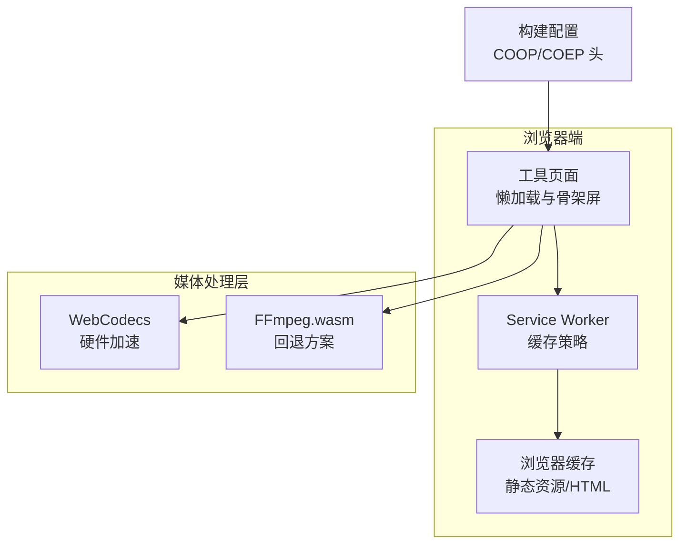
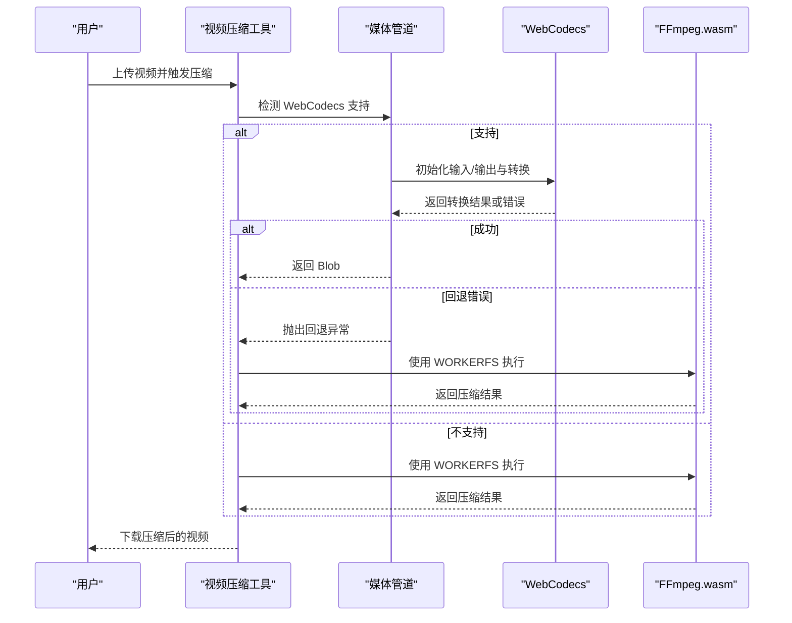
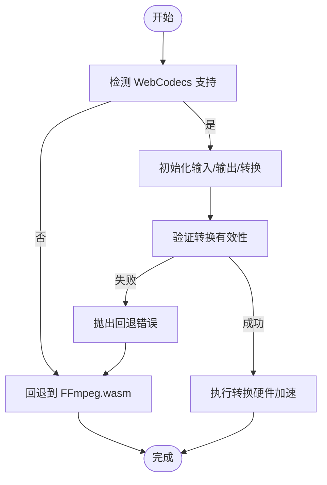
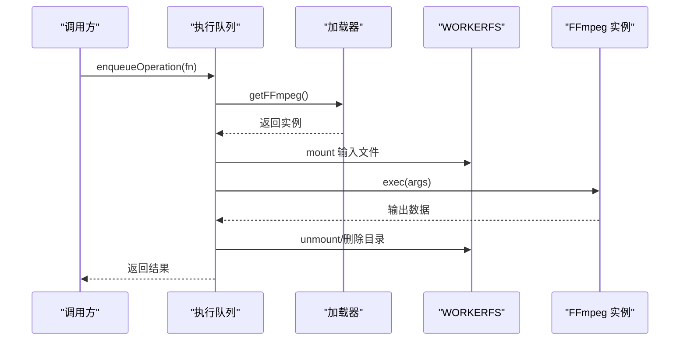
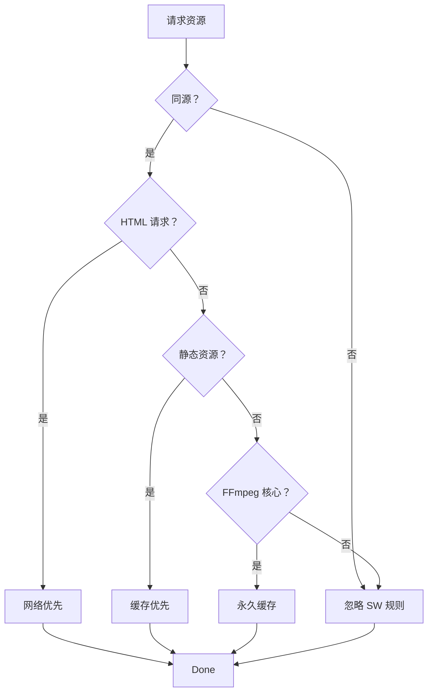
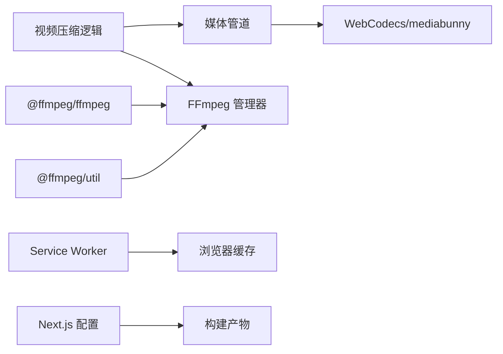

# 性能优化

<cite>
**本文引用的文件**
- [package.json](file://package.json)
- [next.config.ts](file://next.config.ts)
- [tsconfig.json](file://tsconfig.json)
- [src/lib/ffmpeg.ts](file://src/lib/ffmpeg.ts)
- [src/lib/media-pipeline.ts](file://src/lib/media-pipeline.ts)
- [src/tools/video/compress/logic.ts](file://src/tools/video/compress/logic.ts)
- [src/tools/image/compress/logic.ts](file://src/tools/image/compress/logic.ts)
- [src/app/[locale]/tools/[category]/[slug]/ToolPageClient.tsx](file://src/app/[locale]/tools/[category]/[slug]/ToolPageClient.tsx)
- [src/components/shared/ServiceWorkerRegistration.tsx](file://src/components/shared/ServiceWorkerRegistration.tsx)
- [public/sw.js](file://public/sw.js)
- [patches/@ffmpeg__ffmpeg@0.12.15.patch](file://patches/@ffmpeg__ffmpeg@0.12.15.patch)
- [src/lib/hooks/useFFmpeg.ts](file://src/lib/hooks/useFFmpeg.ts)
- [src/lib/hooks/useObjectUrl.ts](file://src/lib/hooks/useObjectUrl.ts)
- [src/lib/pdfjs.ts](file://src/lib/pdfjs.ts)
- [src/lib/analytics.ts](file://src/lib/analytics.ts)
</cite>

## 目录
1. [简介](#简介)
2. [项目结构](#项目结构)
3. [核心组件](#核心组件)
4. [架构总览](#架构总览)
5. [详细组件分析](#详细组件分析)
6. [依赖关系分析](#依赖关系分析)
7. [性能考虑](#性能考虑)
8. [故障排查指南](#故障排查指南)
9. [结论](#结论)
10. [附录](#附录)

## 简介
本文件面向 PrivaDeck 媒体工具箱的性能优化，围绕以下主题展开：WebCodecs 的硬件加速与内存效率、FFmpeg.wasm 的内存管理与任务调度、懒加载与代码分割、缓存策略（浏览器缓存、Service Worker 缓存、应用内缓存）、构建优化（打包器选择、Tree Shaking、压缩）、性能监控与分析、以及 PWA 的离线与后台能力。内容基于仓库中实际实现进行提炼，并提供可操作的优化建议。

## 项目结构
项目采用 Next.js 应用结构，媒体处理逻辑集中在工具页面与通用库中：
- 工具页面通过客户端组件按需加载具体工具，结合 React Suspense 提供骨架屏体验
- 媒体处理分为两套路径：优先使用 WebCodecs（硬件加速），不支持时回退到 FFmpeg.wasm
- Service Worker 负责静态资源与 FFmpeg 核心文件的缓存
- 构建配置启用输出导出模式与跨源隔离头，以支持共享内存与更高性能

**图表来源**
- [next.config.ts:6-27](file://next.config.ts#L6-L27)
- [src/app/[locale]/tools/[category]/[slug]/ToolPageClient.tsx:26-42](file://src/app/[locale]/tools/[category]/[slug]/ToolPageClient.tsx#L26-L42)
- [public/sw.js:30-92](file://public/sw.js#L30-L92)

**章节来源**
- [next.config.ts:6-27](file://next.config.ts#L6-L27)
- [src/app/[locale]/tools/[category]/[slug]/ToolPageClient.tsx:26-42](file://src/app/[locale]/tools/[category]/[slug]/ToolPageClient.tsx#L26-L42)

## 核心组件
- WebCodecs 媒体管道：检测浏览器支持、验证转换结果、提示 HEVC 扩展安装、抛出回退错误
- FFmpeg.wasm 管理：单例实例、加载队列、任务串行化、WORKERFS 挂载避免内存拷贝、进度回调管理
- 懒加载与代码分割：React.lazy + 缓存 + Suspense 骨架屏
- Service Worker 缓存：永久缓存 FFmpeg 核心文件、静态资源优先策略、HTML 网络优先
- 构建优化：跨源隔离头、输出导出模式、模块解析策略
- 性能监控：事件埋点与隐私保护参数截断

**章节来源**
- [src/lib/media-pipeline.ts:7-104](file://src/lib/media-pipeline.ts#L7-L104)
- [src/lib/ffmpeg.ts:10-143](file://src/lib/ffmpeg.ts#L10-L143)
- [src/app/[locale]/tools/[category]/[slug]/ToolPageClient.tsx:26-42](file://src/app/[locale]/tools/[category]/[slug]/ToolPageClient.tsx#L26-L42)
- [public/sw.js:30-92](file://public/sw.js#L30-L92)
- [next.config.ts:6-27](file://next.config.ts#L6-L27)
- [src/lib/analytics.ts:106-137](file://src/lib/analytics.ts#L106-L137)

## 架构总览
媒体处理流程在运行时根据浏览器能力自动选择最优路径：
- 若 WebCodecs 可用且转换有效，则直接使用硬件编码/解码
- 若遇到不支持的视频编解码器或转换无效，则抛出回退错误，必要时回退到 FFmpeg.wasm
- FFmpeg.wasm 使用 WORKERFS 挂载输入文件，避免两次内存拷贝；所有操作通过串行队列执行，保证单线程一致性

**图表来源**
- [src/lib/media-pipeline.ts:7-104](file://src/lib/media-pipeline.ts#L7-L104)
- [src/tools/video/compress/logic.ts:85-110](file://src/tools/video/compress/logic.ts#L85-L110)
- [src/lib/ffmpeg.ts:99-143](file://src/lib/ffmpeg.ts#L99-L143)

## 详细组件分析

### WebCodecs 媒体处理与硬件加速
- 能力检测：通过全局对象存在性判断是否支持视频/音频编解码器
- 转换验证：确保未丢弃关键轨道（音视频），避免无声或黑屏
- 错误分类：区分“可回退”与“不可回退”的编解码器问题
- 硬件加速：显式请求硬件加速，提升吞吐与能耗表现
- 兼容性提示：在 Windows + Chromium 场景提示安装 HEVC 扩展

**图表来源**
- [src/lib/media-pipeline.ts:7-104](file://src/lib/media-pipeline.ts#L7-L104)
- [src/tools/video/compress/logic.ts:112-201](file://src/tools/video/compress/logic.ts#L112-L201)

**章节来源**
- [src/lib/media-pipeline.ts:7-104](file://src/lib/media-pipeline.ts#L7-L104)
- [src/tools/video/compress/logic.ts:85-110](file://src/tools/video/compress/logic.ts#L85-L110)

### FFmpeg.wasm 内存管理与任务调度
- 单例与延迟加载：首次使用时异步加载核心与 wasm，避免首屏阻塞
- 串行队列：所有操作排队执行，避免并发挂载冲突与状态竞争
- WORKERFS 挂载：直接将 File 对象映射为只读输入，避免内存拷贝
- 进度回调：原子地设置/清理进度监听，防止泄漏
- 输出清理：读取 MEMFS 后立即删除，降低峰值内存占用
- 构建补丁：禁用特定打包器对核心模块的错误解析，提升兼容性

**图表来源**
- [src/lib/ffmpeg.ts:75-82](file://src/lib/ffmpeg.ts#L75-L82)
- [src/lib/ffmpeg.ts:105-142](file://src/lib/ffmpeg.ts#L105-L142)

**章节来源**
- [src/lib/ffmpeg.ts:10-39](file://src/lib/ffmpeg.ts#L10-L39)
- [src/lib/ffmpeg.ts:75-82](file://src/lib/ffmpeg.ts#L75-L82)
- [src/lib/ffmpeg.ts:99-143](file://src/lib/ffmpeg.ts#L99-L143)
- [patches/@ffmpeg__ffmpeg@0.12.15.patch:1-14](file://patches/@ffmpeg__ffmpeg@0.12.15.patch#L1-L14)

### 懒加载策略与代码分割
- React.lazy + 缓存：同一工具的组件仅创建一次并缓存，避免重复加载
- Suspense 骨架屏：在组件加载期间显示占位，改善感知性能
- 客户端组件：工具页面客户端组件负责懒加载与骨架屏包裹

**图表来源**
- [src/app/[locale]/tools/[category]/[slug]/ToolPageClient.tsx:26-42](file://src/app/[locale]/tools/[category]/[slug]/ToolPageClient.tsx#L26-L42)

**章节来源**
- [src/app/[locale]/tools/[category]/[slug]/ToolPageClient.tsx:26-42](file://src/app/[locale]/tools/[category]/[slug]/ToolPageClient.tsx#L26-L42)

### 缓存机制设计
- Service Worker 缓存：
  - FFmpeg 核心文件：永久缓存（版本号固定）
  - HTML：网络优先策略，保持内容新鲜
  - 静态资源：缓存优先策略，减少带宽
- 浏览器缓存：配合导出模式与静态资源路径，最大化命中率
- 应用内缓存：懒加载组件缓存、对象 URL 生命周期管理

**图表来源**
- [public/sw.js:30-92](file://public/sw.js#L30-L92)

**章节来源**
- [public/sw.js:1-93](file://public/sw.js#L1-L93)
- [src/components/shared/ServiceWorkerRegistration.tsx:5-15](file://src/components/shared/ServiceWorkerRegistration.tsx#L5-L15)
- [src/lib/hooks/useObjectUrl.ts:7-20](file://src/lib/hooks/useObjectUrl.ts#L7-L20)

### 构建优化配置
- 输出导出模式：便于静态部署与边缘分发
- 图片优化：关闭 Next.js 图片优化，避免额外开销
- 跨源隔离头：设置 COOP/COEP，支持共享内存与更高性能
- 模块解析：bundler 策略提升打包器兼容性
- TypeScript：严格模式与增量编译提升开发体验

**章节来源**
- [next.config.ts:6-27](file://next.config.ts#L6-L27)
- [tsconfig.json:10-23](file://tsconfig.json#L10-L23)

### 性能监控与分析
- 事件埋点：统一的事件参数接口，支持文件上传/下载、复制点击、搜索、相关工具点击、FAQ 展开、主题切换、语言切换、分享点击、处理完成/错误等
- 隐私保护：对长字符串进行截断，避免记录文件名等敏感信息
- 工具级追踪器：为每个工具生成追踪器，自动填充工具类别与名称，记录处理耗时与错误

**章节来源**
- [src/lib/analytics.ts:11-96](file://src/lib/analytics.ts#L11-L96)
- [src/lib/analytics.ts:128-137](file://src/lib/analytics.ts#L128-L137)

## 依赖关系分析
- 工具层依赖媒体管道与 FFmpeg 管理器
- 媒体管道依赖浏览器原生 WebCodecs 与第三方 mediabunny
- FFmpeg 管理器依赖 @ffmpeg/ffmpeg 与 @ffmpeg/util
- Service Worker 依赖浏览器缓存 API
- 构建层依赖 Next.js 与打包器配置

**图表来源**
- [src/tools/video/compress/logic.ts:1-3](file://src/tools/video/compress/logic.ts#L1-L3)
- [src/lib/media-pipeline.ts:1-5](file://src/lib/media-pipeline.ts#L1-L5)
- [src/lib/ffmpeg.ts:1-6](file://src/lib/ffmpeg.ts#L1-L6)
- [public/sw.js:1-93](file://public/sw.js#L1-L93)
- [next.config.ts:1-29](file://next.config.ts#L1-L29)

**章节来源**
- [package.json:11-31](file://package.json#L11-L31)

## 性能考虑
- WebCodecs 硬件加速
  - 优先使用硬件编码/解码，显著降低 CPU 占用与发热
  - 对不支持的视频编解码器（如 H.265/HEVC、VP9、AV1）直接回退到 FFmpeg.wasm
  - 在 Windows + Chromium 上提示安装 HEVC 扩展以获得硬件解码
- FFmpeg.wasm 内存优化
  - 使用 WORKERFS 挂载输入文件，避免两次内存拷贝
  - 所有操作串行执行，避免并发挂载冲突
  - 输出读取后立即删除 MEMFS 文件，降低峰值内存
  - 通过补丁规避打包器对核心模块的错误解析
- 懒加载与代码分割
  - React.lazy + 缓存避免重复加载
  - Suspense 骨架屏提升感知性能
- 缓存策略
  - Service Worker 永久缓存 FFmpeg 核心文件，显著缩短二次加载时间
  - 静态资源缓存优先，HTML 网络优先，平衡新鲜度与性能
- 构建优化
  - 导出模式 + COOP/COEP 头提升跨源隔离能力
  - 模块解析策略与严格 TS 配置提升打包与类型检查效率
- 应用内缓存
  - 对象 URL 生命周期管理，及时 revoke，避免内存泄漏
  - PDF.js Worker 配置一次性，避免重复初始化

**章节来源**
- [src/lib/media-pipeline.ts:7-104](file://src/lib/media-pipeline.ts#L7-L104)
- [src/lib/ffmpeg.ts:99-143](file://src/lib/ffmpeg.ts#L99-L143)
- [src/app/[locale]/tools/[category]/[slug]/ToolPageClient.tsx:26-42](file://src/app/[locale]/tools/[category]/[slug]/ToolPageClient.tsx#L26-L42)
- [public/sw.js:30-92](file://public/sw.js#L30-L92)
- [src/lib/hooks/useObjectUrl.ts:7-20](file://src/lib/hooks/useObjectUrl.ts#L7-L20)
- [src/lib/pdfjs.ts:3-13](file://src/lib/pdfjs.ts#L3-L13)

## 故障排查指南
- WebCodecs 回退错误
  - 当出现“不可回退”的视频编解码器问题时，应提示用户更换视频格式或安装扩展
  - 对于音频编解码器问题，可继续回退到 FFmpeg.wasm
- FFmpeg.wasm 加载失败
  - 检查 CDN 可达性与 COEP/COOP 设置
  - 确认 Service Worker 是否正确缓存了核心文件
- 进度回调异常
  - 确保在任务开始前设置进度监听，在结束时清理
- 内存占用过高
  - 确认输出读取后已删除 MEMFS 文件
  - 检查是否存在未清理的对象 URL
- Service Worker 缓存未生效
  - 确认同源策略与 GET 请求
  - 检查缓存命名与激活流程

**章节来源**
- [src/lib/media-pipeline.ts:28-53](file://src/lib/media-pipeline.ts#L28-L53)
- [src/lib/ffmpeg.ts:41-58](file://src/lib/ffmpeg.ts#L41-L58)
- [src/lib/ffmpeg.ts:129-132](file://src/lib/ffmpeg.ts#L129-L132)
- [src/lib/hooks/useObjectUrl.ts:7-20](file://src/lib/hooks/useObjectUrl.ts#L7-L20)
- [public/sw.js:30-92](file://public/sw.js#L30-L92)

## 结论
本项目通过“WebCodecs 硬件加速优先 + FFmpeg.wasm 回退”的双轨策略，结合懒加载、Service Worker 缓存、内存管理与构建优化，实现了在浏览器端高效、稳定、可扩展的媒体处理能力。建议持续关注浏览器能力变化与新特性（如更广泛的硬件编解码支持），并配合性能监控数据迭代优化。

## 附录
- 相关依赖版本与用途
  - @ffmpeg/ffmpeg：WebAssembly 版本的 FFmpeg
  - @ffmpeg/util：提供 toBlobURL 等工具
  - mediabunny：基于 WebCodecs 的媒体转换库
  - browser-image-compression：图片压缩
  - pdfjs-dist：PDF 渲染与处理
  - tesseract.js：OCR 文字识别
  - js-yaml：YAML 解析
  - fflate：ZIP 压缩

**章节来源**
- [package.json:11-31](file://package.json#L11-L31)