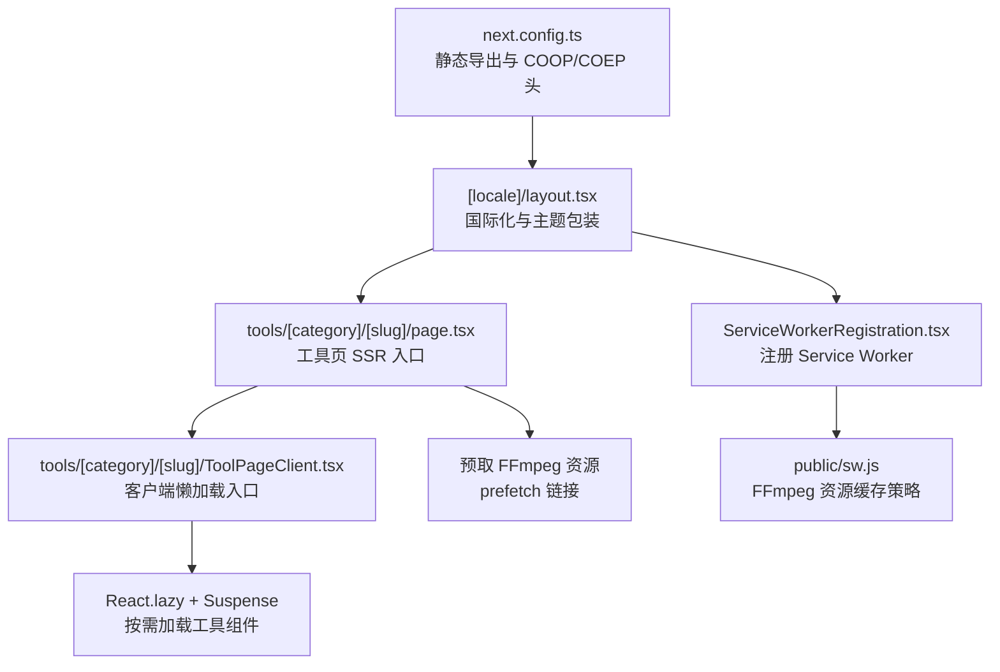
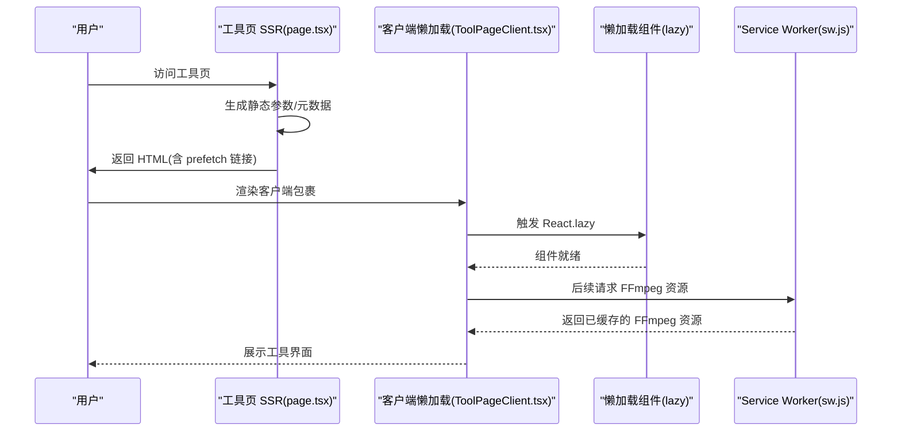
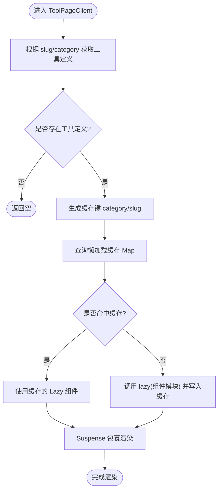
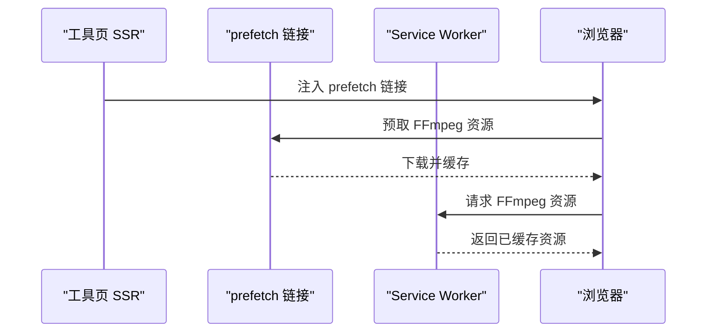
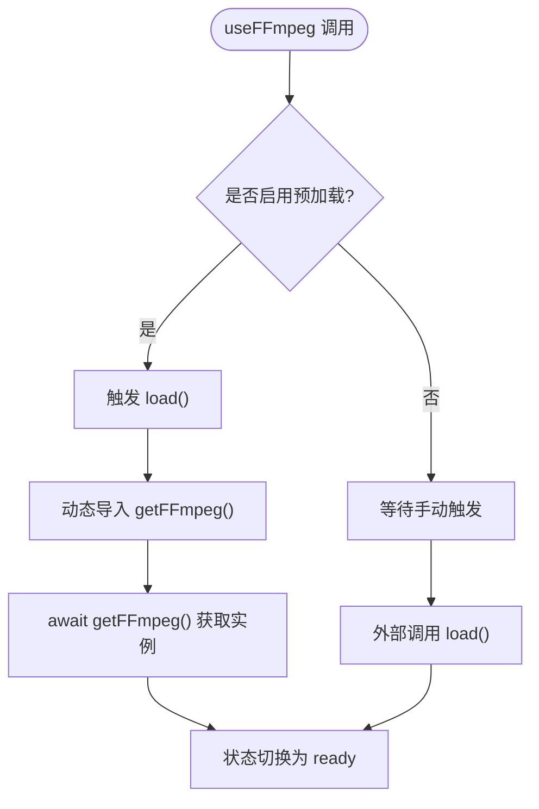
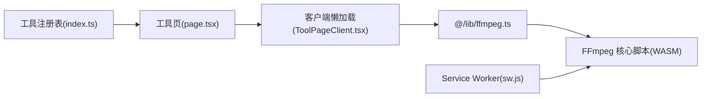

# 懒加载策略

<cite>
**本文引用的文件**
- [src/app/[locale]/layout.tsx](file://src/app/[locale]/layout.tsx)
- [src/app/[locale]/tools/[category]/[slug]/page.tsx](file://src/app/[locale]/tools/[category]/[slug]/page.tsx)
- [src/app/[locale]/tools/[category]/[slug]/ToolPageClient.tsx](file://src/app/[locale]/tools/[category]/[slug]/ToolPageClient.tsx)
- [src/lib/ffmpeg.ts](file://src/lib/ffmpeg.ts)
- [src/lib/hooks/useFFmpeg.ts](file://src/lib/hooks/useFFmpeg.ts)
- [src/components/shared/ServiceWorkerRegistration.tsx](file://src/components/shared/ServiceWorkerRegistration.tsx)
- [public/sw.js](file://public/sw.js)
- [next.config.ts](file://next.config.ts)
- [package.json](file://package.json)
- [src/lib/registry/index.ts](file://src/lib/registry/index.ts)
- [src/lib/analytics.ts](file://src/lib/analytics.ts)
</cite>

## 目录
1. [引言](#引言)
2. [项目结构](#项目结构)
3. [核心组件](#核心组件)
4. [架构总览](#架构总览)
5. [详细组件分析](#详细组件分析)
6. [依赖关系分析](#依赖关系分析)
7. [性能考量](#性能考量)
8. [故障排查指南](#故障排查指南)
9. [结论](#结论)
10. [附录](#附录)

## 引言
本文件系统性梳理本项目的懒加载策略与实现，重点覆盖以下方面：
- 动态导入与 Suspense 使用：在工具页面中通过 React.lazy 与 Suspense 实现按需加载与骨架屏体验。
- 代码分割策略：按路由级别进行代码分割，并结合稳定缓存避免重复创建懒加载组件。
- 预加载与预取：对关键资源（如 FFmpeg 核心脚本）进行预取与 Service Worker 缓存。
- 服务端渲染中的懒加载优化：SSR 与 CSR 的平衡策略，以及静态导出环境下的行为。
- 性能监控：加载时间与用户体验指标的采集与分析。
- 实际配置示例与最佳实践：针对不同场景的懒加载策略选择建议。

## 项目结构
项目采用 Next.js App Router 结构，工具页面按路由动态生成，每个工具页面由服务端渲染（SSR）负责生成静态参数与元数据，客户端侧通过懒加载加载具体工具组件。

图表来源
- [src/app/[locale]/layout.tsx:32-76](file://src/app/[locale]/layout.tsx#L32-L76)
- [src/app/[locale]/tools/[category]/[slug]/page.tsx:33-108](file://src/app/[locale]/tools/[category]/[slug]/page.tsx#L33-L108)
- [src/app/[locale]/tools/[category]/[slug]/ToolPageClient.tsx:29-58](file://src/app/[locale]/tools/[category]/[slug]/ToolPageClient.tsx#L29-L58)
- [src/components/shared/ServiceWorkerRegistration.tsx:5-14](file://src/components/shared/ServiceWorkerRegistration.tsx#L5-L14)
- [public/sw.js:1-92](file://public/sw.js#L1-L92)
- [next.config.ts:6-27](file://next.config.ts#L6-L27)

章节来源
- [src/app/[locale]/layout.tsx:32-76](file://src/app/[locale]/layout.tsx#L32-L76)
- [src/app/[locale]/tools/[category]/[slug]/page.tsx:33-108](file://src/app/[locale]/tools/[category]/[slug]/page.tsx#L33-L108)
- [src/app/[locale]/tools/[category]/[slug]/ToolPageClient.tsx:29-58](file://src/app/[locale]/tools/[category]/[slug]/ToolPageClient.tsx#L29-L58)
- [next.config.ts:6-27](file://next.config.ts#L6-L27)

## 核心组件
- 工具页 SSR 入口：负责生成静态参数、元数据与国际化消息，并注入预取链接与客户端包裹。
- 客户端懒加载入口：使用 React.lazy 与 Suspense 对工具组件进行按需加载，并提供骨架屏占位。
- FFmpeg 加载器：封装动态导入与实例化逻辑，支持预加载与进度监听。
- Service Worker：对 FFmpeg 核心脚本进行持久缓存，提升后续加载性能。
- 注册器：在客户端注册 Service Worker，确保离线与缓存能力生效。

章节来源
- [src/app/[locale]/tools/[category]/[slug]/page.tsx:33-108](file://src/app/[locale]/tools/[category]/[slug]/page.tsx#L33-L108)
- [src/app/[locale]/tools/[category]/[slug]/ToolPageClient.tsx:29-58](file://src/app/[locale]/tools/[category]/[slug]/ToolPageClient.tsx#L29-L58)
- [src/lib/ffmpeg.ts:10-39](file://src/lib/ffmpeg.ts#L10-L39)
- [src/lib/hooks/useFFmpeg.ts:8-37](file://src/lib/hooks/useFFmpeg.ts#L8-L37)
- [src/components/shared/ServiceWorkerRegistration.tsx:5-14](file://src/components/shared/ServiceWorkerRegistration.tsx#L5-L14)
- [public/sw.js:1-92](file://public/sw.js#L1-L92)

## 架构总览
下图展示从用户访问到工具组件加载的关键流程，包括 SSR、懒加载与缓存路径：

图表来源
- [src/app/[locale]/tools/[category]/[slug]/page.tsx:94-99](file://src/app/[locale]/tools/[category]/[slug]/page.tsx#L94-L99)
- [src/app/[locale]/tools/[category]/[slug]/ToolPageClient.tsx:33-42](file://src/app/[locale]/tools/[category]/[slug]/ToolPageClient.tsx#L33-L42)
- [public/sw.js:34-49](file://public/sw.js#L34-L49)

## 详细组件分析

### 动态导入与 Suspense 使用
- 在工具页客户端入口中，通过 useMemo 缓存懒加载组件，避免重复创建；使用 React.lazy 动态导入工具组件；通过 Suspense 提供骨架屏占位，改善首屏体验。
- 工具定义来自注册表，按 slug 与 category 精确匹配，保证组件与路由一致。

图表来源
- [src/app/[locale]/tools/[category]/[slug]/ToolPageClient.tsx:29-42](file://src/app/[locale]/tools/[category]/[slug]/ToolPageClient.tsx#L29-L42)
- [src/lib/registry/index.ts:139-147](file://src/lib/registry/index.ts#L139-L147)

章节来源
- [src/app/[locale]/tools/[category]/[slug]/ToolPageClient.tsx:29-58](file://src/app/[locale]/tools/[category]/[slug]/ToolPageClient.tsx#L29-L58)
- [src/lib/registry/index.ts:139-147](file://src/lib/registry/index.ts#L139-L147)

### 代码分割策略
- 路由级代码分割：工具页按 locale/category/slug 生成静态参数，每个工具页面独立构建，天然形成代码分割边界。
- 组件级懒加载：工具组件通过动态导入按需加载，减少初始包体积。
- 稳定缓存：懒加载组件在内存中缓存，避免重复创建与重复下载。

章节来源
- [src/app/[locale]/tools/[category]/[slug]/page.tsx:13-22](file://src/app/[locale]/tools/[category]/[slug]/page.tsx#L13-L22)
- [src/app/[locale]/tools/[category]/[slug]/ToolPageClient.tsx:26-42](file://src/app/[locale]/tools/[category]/[slug]/ToolPageClient.tsx#L26-L42)

### 预加载与预取机制
- 预取关键资源：在工具页 SSR 中注入 prefetch 链接，预取 FFmpeg 核心脚本与 WASM 文件，降低首次使用延迟。
- Service Worker 缓存：对 FFmpeg 资源进行永久缓存，后续请求直接命中缓存，显著提升性能。
- 静态导出与跨域隔离：next.config.ts 设置静态导出与 COOP/COEP 头，保障 WebAssembly 与共享内存相关能力。

图表来源
- [src/app/[locale]/tools/[category]/[slug]/page.tsx:94-99](file://src/app/[locale]/tools/[category]/[slug]/page.tsx#L94-L99)
- [public/sw.js:34-49](file://public/sw.js#L34-L49)
- [next.config.ts:16-26](file://next.config.ts#L16-L26)

章节来源
- [src/app/[locale]/tools/[category]/[slug]/page.tsx:94-99](file://src/app/[locale]/tools/[category]/[slug]/page.tsx#L94-L99)
- [public/sw.js:1-92](file://public/sw.js#L1-L92)
- [next.config.ts:6-27](file://next.config.ts#L6-L27)

### 服务端渲染中的懒加载优化
- SSR 与 CSR 平衡：SSR 生成页面骨架与预取资源，CSR 仅处理交互与懒加载组件，避免重复渲染。
- 静态导出：next.config.ts 输出为 export，适合静态托管平台，懒加载在 CSR 阶段生效。
- 国际化与主题：根布局提供国际化与主题上下文，确保懒加载组件在正确环境中渲染。

章节来源
- [src/app/[locale]/layout.tsx:32-76](file://src/app/[locale]/layout.tsx#L32-L76)
- [src/app/[locale]/tools/[category]/[slug]/page.tsx:33-108](file://src/app/[locale]/tools/[category]/[slug]/page.tsx#L33-L108)
- [next.config.ts:7](file://next.config.ts#L7)

### FFmpeg 动态加载与预加载
- 动态导入：通过动态 import 加载 @ffmpeg/ffmpeg 与 @ffmpeg/util，按需初始化实例。
- 预加载钩子：useFFmpeg 支持 preload 选项，在组件挂载时提前触发加载，缩短首次使用等待。
- 进度监听：通过事件回调监听处理进度，结合 UI 进度条反馈。
- 执行队列：将操作串行化，避免并发冲突，提升稳定性。

图表来源
- [src/lib/hooks/useFFmpeg.ts:8-37](file://src/lib/hooks/useFFmpeg.ts#L8-L37)
- [src/lib/ffmpeg.ts:10-39](file://src/lib/ffmpeg.ts#L10-L39)

章节来源
- [src/lib/hooks/useFFmpeg.ts:8-37](file://src/lib/hooks/useFFmpeg.ts#L8-L37)
- [src/lib/ffmpeg.ts:10-39](file://src/lib/ffmpeg.ts#L10-L39)

### Service Worker 与缓存策略
- 持久缓存：对 FFmpeg 核心脚本（包含版本号）进行永久缓存，避免重复下载。
- HTML 与静态资源：HTML 采用网络优先策略，静态资源采用缓存优先策略，兼顾新鲜度与性能。
- 生命周期管理：安装阶段跳过等待，激活阶段清理旧缓存并接管客户端。

章节来源
- [public/sw.js:1-92](file://public/sw.js#L1-L92)
- [src/components/shared/ServiceWorkerRegistration.tsx:5-14](file://src/components/shared/ServiceWorkerRegistration.tsx#L5-L14)

## 依赖关系分析
- 工具注册表：集中管理所有工具的元数据与导入路径，为懒加载提供稳定映射。
- 动态导入链路：工具页 SSR -> 客户端懒加载 -> 动态导入 -> 组件渲染。
- 资源依赖：FFmpeg 核心脚本与 WASM 通过预取与 Service Worker 缓存降低加载成本。

图表来源
- [src/lib/registry/index.ts:139-147](file://src/lib/registry/index.ts#L139-L147)
- [src/app/[locale]/tools/[category]/[slug]/page.tsx:33-108](file://src/app/[locale]/tools/[category]/[slug]/page.tsx#L33-L108)
- [src/app/[locale]/tools/[category]/[slug]/ToolPageClient.tsx:29-58](file://src/app/[locale]/tools/[category]/[slug]/ToolPageClient.tsx#L29-L58)
- [src/lib/ffmpeg.ts:10-39](file://src/lib/ffmpeg.ts#L10-L39)
- [public/sw.js:34-49](file://public/sw.js#L34-L49)

章节来源
- [src/lib/registry/index.ts:139-147](file://src/lib/registry/index.ts#L139-L147)
- [src/app/[locale]/tools/[category]/[slug]/page.tsx:33-108](file://src/app/[locale]/tools/[category]/[slug]/page.tsx#L33-L108)
- [src/app/[locale]/tools/[category]/[slug]/ToolPageClient.tsx:29-58](file://src/app/[locale]/tools/[category]/[slug]/ToolPageClient.tsx#L29-L58)
- [src/lib/ffmpeg.ts:10-39](file://src/lib/ffmpeg.ts#L10-L39)
- [public/sw.js:34-49](file://public/sw.js#L34-L49)

## 性能考量
- 首屏加载时间：通过预取与缓存显著降低 FFmpeg 资源下载时间；懒加载减少初始包体积。
- 用户体验：骨架屏与进度反馈提升感知性能；错误与不支持场景的降级提示。
- 资源新鲜度：HTML 采用网络优先策略，确保内容更新；静态资源与 FFmpeg 资源采用缓存优先策略，提升复用率。
- 跨域隔离：COOP/COEP 头确保 SharedArrayBuffer 与 WebAssembly 的可用性，提升多媒体处理性能。

章节来源
- [src/app/[locale]/tools/[category]/[slug]/ToolPageClient.tsx:16-24](file://src/app/[locale]/tools/[category]/[slug]/ToolPageClient.tsx#L16-L24)
- [src/lib/ffmpeg.ts:10-39](file://src/lib/ffmpeg.ts#L10-L39)
- [public/sw.js:58-69](file://public/sw.js#L58-L69)
- [next.config.ts:16-26](file://next.config.ts#L16-L26)

## 故障排查指南
- FFmpeg 初始化失败：检查动态导入路径与 CDN 可达性；确认 Service Worker 是否成功缓存核心脚本。
- 懒加载组件未渲染：确认工具定义存在且 slug/category 匹配；检查懒加载缓存是否被意外清空。
- 骨架屏不消失：检查 Suspense fallback 是否正确包裹；确认组件异步加载完成。
- Service Worker 未生效：确认浏览器支持 Service Worker；检查注册逻辑与缓存策略。
- 性能异常：核对预取链接是否生效；检查缓存命中情况与网络策略。

章节来源
- [src/lib/ffmpeg.ts:10-39](file://src/lib/ffmpeg.ts#L10-L39)
- [src/app/[locale]/tools/[category]/[slug]/ToolPageClient.tsx:29-58](file://src/app/[locale]/tools/[category]/[slug]/ToolPageClient.tsx#L29-L58)
- [src/components/shared/ServiceWorkerRegistration.tsx:5-14](file://src/components/shared/ServiceWorkerRegistration.tsx#L5-L14)
- [public/sw.js:1-92](file://public/sw.js#L1-L92)

## 结论
本项目通过“路由级代码分割 + 动态导入 + Suspense 骨架屏 + 预取 + Service Worker 缓存”的组合策略，实现了高效的懒加载与良好的用户体验。配合静态导出与跨域隔离配置，既满足了性能要求，又兼顾了可维护性与可扩展性。建议在新增工具时遵循现有模式，统一使用注册表与懒加载入口，确保一致的性能与体验表现。

## 附录
- 实际配置示例与最佳实践
  - 路由级代码分割：保持每个工具页面独立构建，利用 SSR 生成静态参数与元数据。
  - 动态导入与 Suspense：在客户端入口中使用 React.lazy 与 Suspense，提供骨架屏占位。
  - 预取关键资源：对 FFmpeg 核心脚本与 WASM 进行预取，并通过 Service Worker 持久缓存。
  - 预加载钩子：在可能的交互前（如页面可见或即将进入工具页）触发预加载，缩短首次使用等待。
  - 性能监控：结合分析埋点记录处理时长与错误，持续优化加载策略与用户体验。

章节来源
- [src/app/[locale]/tools/[category]/[slug]/page.tsx:94-99](file://src/app/[locale]/tools/[category]/[slug]/page.tsx#L94-L99)
- [src/app/[locale]/tools/[category]/[slug]/ToolPageClient.tsx:29-58](file://src/app/[locale]/tools/[category]/[slug]/ToolPageClient.tsx#L29-L58)
- [src/lib/hooks/useFFmpeg.ts:8-37](file://src/lib/hooks/useFFmpeg.ts#L8-L37)
- [public/sw.js:1-92](file://public/sw.js#L1-L92)
- [src/lib/analytics.ts:128-137](file://src/lib/analytics.ts#L128-L137)