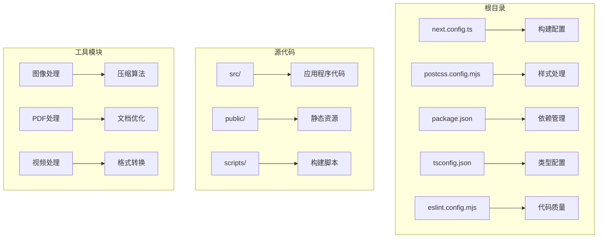
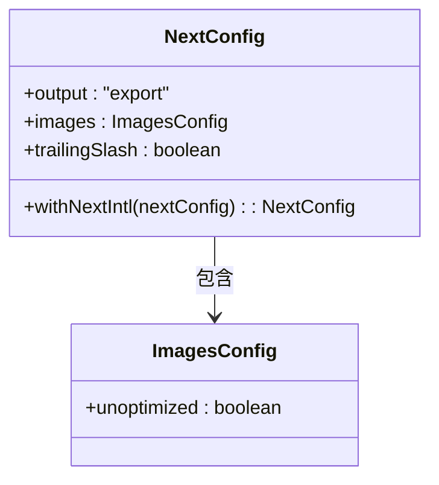
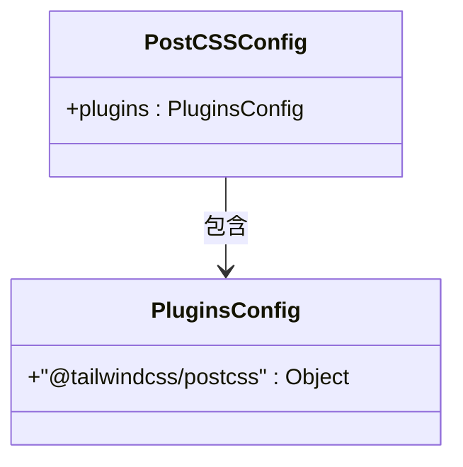
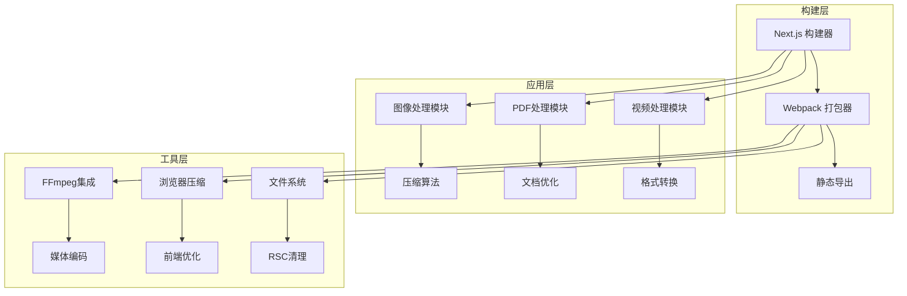
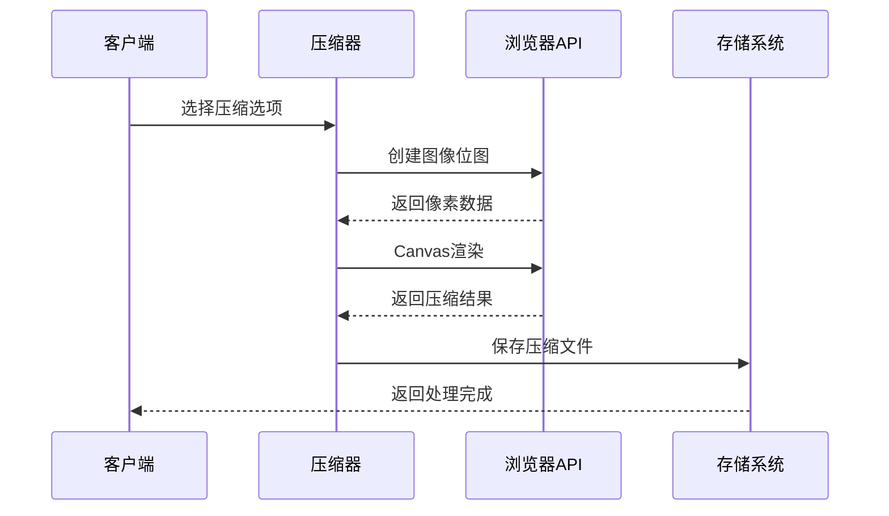
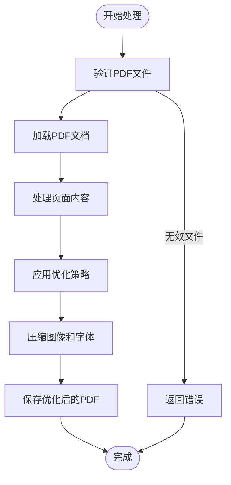
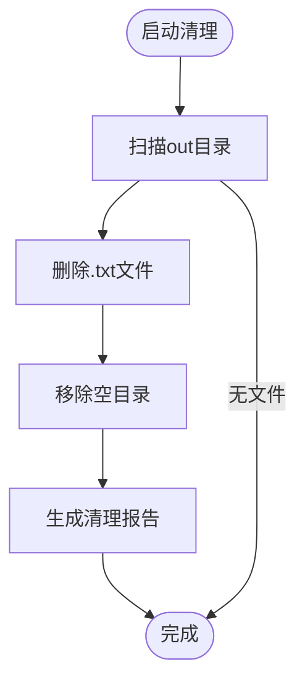
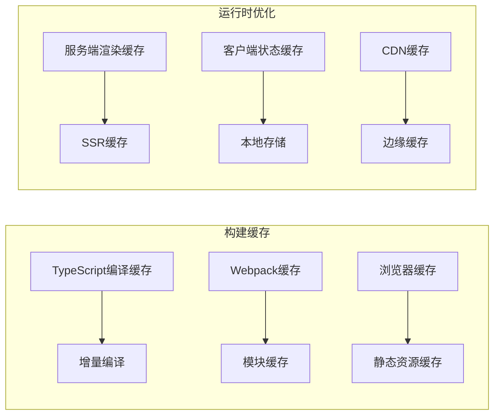

# 构建优化

<cite>
**本文档引用的文件**
- [next.config.ts](file://next.config.ts)
- [postcss.config.mjs](file://postcss.config.mjs)
- [package.json](file://package.json)
- [tsconfig.json](file://tsconfig.json)
- [eslint.config.mjs](file://eslint.config.mjs)
- [clean-rsc.mjs](file://scripts/clean-rsc.mjs)
- [logic.ts](file://src/tools/image/compress/logic.ts)
- [CompressPdf.tsx](file://src/tools/pdf/compress/CompressPdf.tsx)
- [ImageCompress.tsx](file://src/tools/image/compress/ImageCompress.tsx)
</cite>

## 目录
1. [简介](#简介)
2. [项目结构](#项目结构)
3. [核心组件](#核心组件)
4. [架构概览](#架构概览)
5. [详细组件分析](#详细组件分析)
6. [依赖关系分析](#依赖关系分析)
7. [性能考虑](#性能考虑)
8. [故障排除指南](#故障排除指南)
9. [结论](#结论)

## 简介

本项目是一个基于 Next.js 的媒体工具箱应用，提供了多种媒体处理功能，包括图像压缩、PDF 处理、视频转换等。本文档专注于构建优化方面，深入分析项目的构建配置、性能优化策略和监控方法。

该项目使用 Next.js 16.2.1 框架，采用 TypeScript 开发，集成了多种媒体处理库如 FFmpeg、浏览器图像压缩库等。构建系统通过 Webpack 进行打包，支持静态导出模式。

## 项目结构

项目采用标准的 Next.js 结构，主要目录组织如下：



**图表来源**
- [next.config.ts:1-13](file://next.config.ts#L1-L13)
- [package.json:1-45](file://package.json#L1-L45)

**章节来源**
- [next.config.ts:1-13](file://next.config.ts#L1-L13)
- [package.json:1-45](file://package.json#L1-L45)
- [tsconfig.json:1-35](file://tsconfig.json#L1-L35)

## 核心组件

### 构建配置组件

项目的核心构建配置位于 `next.config.ts` 文件中，当前配置相对简洁但功能完整：



**图表来源**
- [next.config.ts:6-10](file://next.config.ts#L6-L10)

### 样式处理组件

PostCSS 配置通过 `postcss.config.mjs` 文件管理，目前仅集成 Tailwind CSS 插件：



**图表来源**
- [postcss.config.mjs:1-8](file://postcss.config.mjs#L1-L8)

### 类型系统组件

TypeScript 配置在 `tsconfig.json` 中定义，采用现代 ES2017 目标：

**章节来源**
- [next.config.ts:1-13](file://next.config.ts#L1-L13)
- [postcss.config.mjs:1-8](file://postcss.config.mjs#L1-L8)
- [tsconfig.json:1-35](file://tsconfig.json#L1-L35)

## 架构概览

项目采用模块化架构设计，各功能模块独立开发并通过统一的构建系统进行打包：



**图表来源**
- [next.config.ts:6-10](file://next.config.ts#L6-L10)
- [package.json:11-32](file://package.json#L11-L32)

## 详细组件分析

### 图像压缩优化组件

图像压缩功能是项目的核心优化组件之一，实现了多种压缩策略：



**图表来源**
- [ImageCompress.tsx:154-372](file://src/tools/image/compress/ImageCompress.tsx#L154-L372)
- [logic.ts:1-46](file://src/tools/image/compress/logic.ts#L1-L46)

#### 压缩策略分析

项目实现了多种预设压缩策略：

| 预设名称 | 质量参数 | 最大文件大小 | 尺寸限制 | 适用场景 |
|---------|---------|-------------|---------|----------|
| high-quality | 90% | 10MB | 无限制 | 高质量需求 |
| balanced | 75% | 1MB | 无限制 | 平衡方案 |
| small-file | 50% | 1MB | 1920px宽高 | 文件大小敏感 |
| custom | 可配置 | 可配置 | 可配置 | 自定义需求 |

**章节来源**
- [logic.ts:26-34](file://src/tools/image/compress/logic.ts#L26-L34)
- [ImageCompress.tsx:191-372](file://src/tools/image/compress/ImageCompress.tsx#L191-L372)

### PDF处理优化组件

PDF压缩功能提供了专业的文档优化能力：



**图表来源**
- [CompressPdf.tsx:82-130](file://src/tools/pdf/compress/CompressPdf.tsx#L82-L130)

**章节来源**
- [CompressPdf.tsx:82-130](file://src/tools/pdf/compress/CompressPdf.tsx#L82-L130)

### 构建脚本优化组件

项目包含专门的 RSC 清理脚本，用于优化构建输出：



**图表来源**
- [clean-rsc.mjs:1-35](file://scripts/clean-rsc.mjs#L1-L35)

**章节来源**
- [clean-rsc.mjs:1-35](file://scripts/clean-rsc.mjs#L1-L35)

## 依赖关系分析

项目依赖关系呈现清晰的层次结构：

```mermaid
graph TB
subgraph "运行时依赖"
A[next@16.2.1] --> B[核心框架]
C[react@19.2.3] --> D[UI库]
E[react-dom@19.2.3] --> F[DOM操作]
G[typescript@5] --> H[类型安全]
end
subgraph "开发依赖"
I[eslint@9] --> J[代码质量]
K[tailwindcss@4] --> L[样式框架]
M[postcss] --> N[CSS处理]
end
subgraph "媒体处理依赖"
O[@ffmpeg/ffmpeg@0.12.15] --> P[视频处理]
Q[browser-image-compression@2.0.2] --> R[图像压缩]
S[mediabunny@1.40.1] --> T[媒体转换]
end
A --> O
C --> Q
G --> I
```

**图表来源**
- [package.json:11-42](file://package.json#L11-L42)

**章节来源**
- [package.json:1-45](file://package.json#L1-L45)

## 性能考虑

### 构建性能优化

项目在构建配置上采用了多项优化策略：

1. **静态导出模式**: 使用 `output: "export"` 配置，支持静态站点生成
2. **图片优化**: 启用 `images: { unoptimized: true }`，避免不必要的图片处理
3. **尾随斜杠**: 设置 `trailingSlash: true`，改善SEO和缓存

### 代码分割策略

项目通过以下方式实现代码分割：

- **按需加载**: 使用 React.lazy 和动态导入
- **路由级分割**: Next.js 自动的路由级代码分割
- **组件级分割**: 功能模块的独立打包

### 缓存策略



## 故障排除指南

### 常见构建问题

1. **FFmpeg加载失败**
   - 检查网络连接和CDN可用性
   - 验证浏览器兼容性（SharedArrayBuffer支持）

2. **图片压缩异常**
   - 确认浏览器支持Canvas API
   - 检查文件格式兼容性

3. **PDF处理错误**
   - 验证PDF文件完整性
   - 检查内存限制和文件大小

### 性能监控指标

建议监控以下关键指标：

- **构建时间**: 分析各阶段耗时
- **包大小**: 监控bundle体积变化
- **运行时性能**: FPS、内存使用率
- **用户交互**: 首屏加载时间、交互延迟

**章节来源**
- [eslint.config.mjs:1-18](file://eslint.config.mjs#L1-L18)

## 结论

本项目在构建优化方面展现了良好的实践，通过合理的配置和模块化设计实现了高效的构建流程。主要优化点包括：

1. **简洁的构建配置**: 最小化配置减少复杂性
2. **模块化架构**: 功能分离便于维护和优化
3. **性能优先**: 静态导出和代码分割策略
4. **工具集成**: 专业媒体处理库的合理使用

未来可以考虑的优化方向：
- 实施更精细的代码分割策略
- 添加构建产物分析工具
- 优化第三方库的加载策略
- 实现更完善的性能监控体系