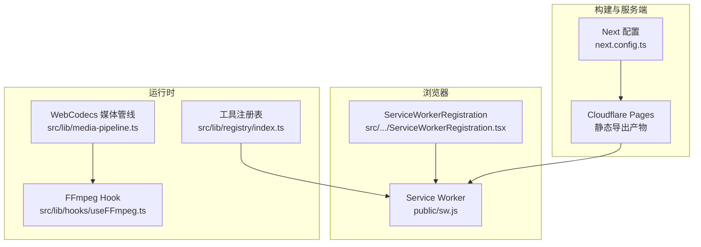
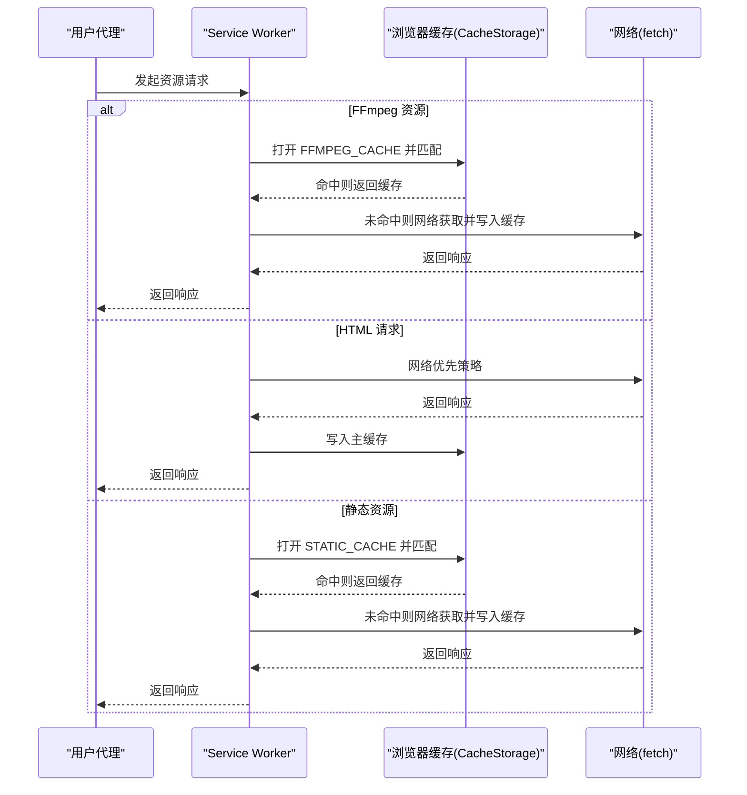
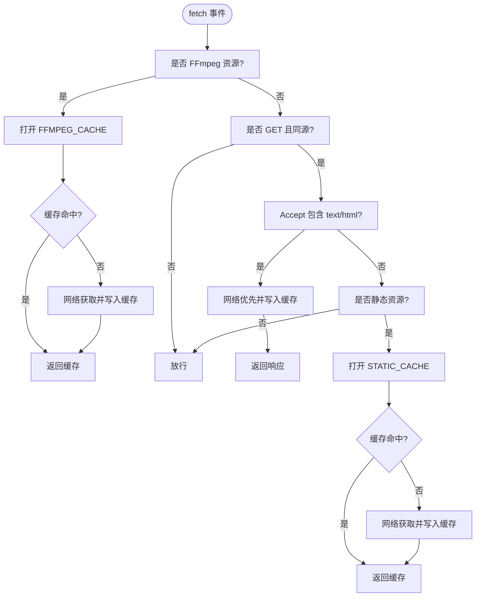
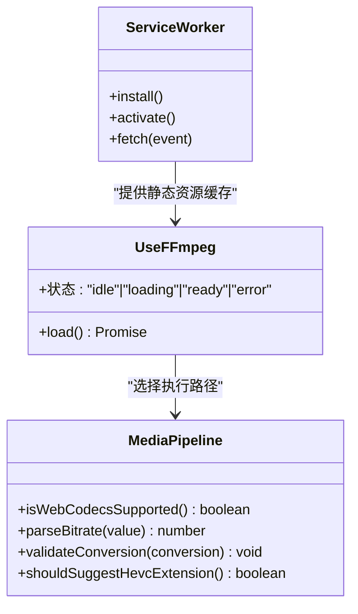
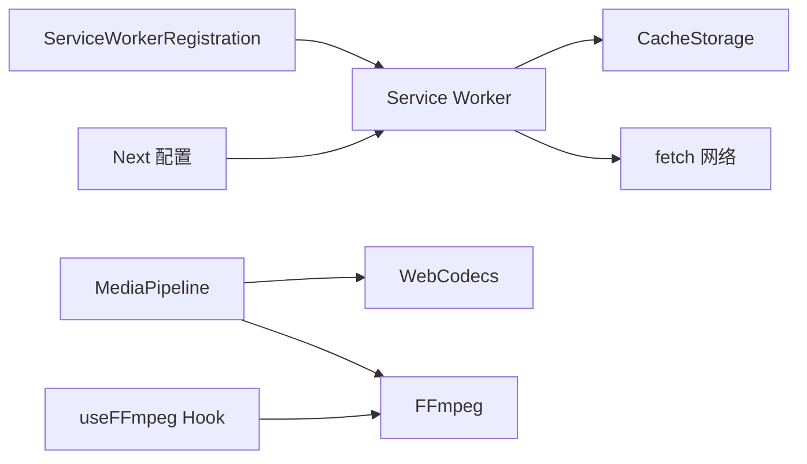

# 缓存机制

<cite>
**本文引用的文件**
- [public/sw.js](file://public/sw.js)
- [src/components/shared/ServiceWorkerRegistration.tsx](file://src/components/shared/ServiceWorkerRegistration.tsx)
- [next.config.ts](file://next.config.ts)
- [src/lib/media-pipeline.ts](file://src/lib/media-pipeline.ts)
- [src/lib/hooks/useFFmpeg.ts](file://src/lib/hooks/useFFmpeg.ts)
- [src/lib/registry/index.ts](file://src/lib/registry/index.ts)
- [src/lib/analytics.ts](file://src/lib/analytics.ts)
</cite>

## 目录
1. [简介](#简介)
2. [项目结构](#项目结构)
3. [核心组件](#核心组件)
4. [架构总览](#架构总览)
5. [详细组件分析](#详细组件分析)
6. [依赖关系分析](#依赖关系分析)
7. [性能考虑](#性能考虑)
8. [故障排除指南](#故障排除指南)
9. [结论](#结论)
10. [附录](#附录)

## 简介
本文件系统性梳理媒体工具箱项目的缓存机制，覆盖浏览器缓存策略（HTTP 缓存头与缓存控制）、Service Worker 缓存实现（存储与更新）、应用内缓存设计（内存与持久化）、缓存失效与更新（版本管理与清理）、缓存性能监控（命中率与效果分析），并提供配置示例与故障排除建议。项目采用静态导出部署于 Cloudflare Pages，结合 Service Worker 实现离线与加速访问，并通过 WebCodecs/FFmpeg 路径在运行时进行媒体处理。

## 项目结构
与缓存相关的关键位置：
- 浏览器端缓存与离线：Service Worker 注册与缓存逻辑位于 public/sw.js；React 组件负责注册。
- 构建与头部缓存策略：Next 配置中设置 COOP/COEP 头以支持跨源隔离，便于缓存与性能优化。
- 运行时媒体处理：WebCodecs 优先路径，不支持时回退到 FFmpeg；FFmpeg 初始化通过 React Hook 管理状态。
- 工具注册与页面路由：工具清单与页面生成影响静态资源缓存命中与版本更新。

图表来源
- [public/sw.js:1-93](file://public/sw.js#L1-L93)
- [src/components/shared/ServiceWorkerRegistration.tsx:1-16](file://src/components/shared/ServiceWorkerRegistration.tsx#L1-L16)
- [next.config.ts:1-30](file://next.config.ts#L1-L30)
- [src/lib/media-pipeline.ts:1-105](file://src/lib/media-pipeline.ts#L1-L105)
- [src/lib/hooks/useFFmpeg.ts:1-41](file://src/lib/hooks/useFFmpeg.ts#L1-L41)
- [src/lib/registry/index.ts:1-164](file://src/lib/registry/index.ts#L1-L164)

章节来源
- [public/sw.js:1-93](file://public/sw.js#L1-L93)
- [src/components/shared/ServiceWorkerRegistration.tsx:1-16](file://src/components/shared/ServiceWorkerRegistration.tsx#L1-L16)
- [next.config.ts:1-30](file://next.config.ts#L1-L30)
- [src/lib/media-pipeline.ts:1-105](file://src/lib/media-pipeline.ts#L1-L105)
- [src/lib/hooks/useFFmpeg.ts:1-41](file://src/lib/hooks/useFFmpeg.ts#L1-L41)
- [src/lib/registry/index.ts:1-164](file://src/lib/registry/index.ts#L1-L164)

## 核心组件
- Service Worker 缓存策略：按资源类型区分缓存策略（FFmpeg 永久缓存、HTML 网络优先、静态资源缓存优先），并进行版本化缓存命名与激活期清理。
- 浏览器缓存头：通过 Next 配置注入 COOP/COEP 头，提升跨源隔离下的缓存与共享内存使用能力。
- 应用内缓存：React Hook 管理 FFmpeg 初始化状态，避免重复加载；媒体管线根据浏览器能力选择 WebCodecs 或 FFmpeg。
- 工具注册与版本：工具清单集中管理，页面静态导出后由 SW 缓存，版本升级通过缓存命名变更触发清理与更新。

章节来源
- [public/sw.js:1-93](file://public/sw.js#L1-L93)
- [next.config.ts:10-26](file://next.config.ts#L10-L26)
- [src/lib/hooks/useFFmpeg.ts:1-41](file://src/lib/hooks/useFFmpeg.ts#L1-L41)
- [src/lib/media-pipeline.ts:1-105](file://src/lib/media-pipeline.ts#L1-L105)
- [src/lib/registry/index.ts:135-164](file://src/lib/registry/index.ts#L135-L164)

## 架构总览
整体缓存架构分为三层：
- 构建层：静态导出与头部策略（COOP/COEP）确保跨源隔离与缓存一致性。
- 传输层：Service Worker 在 fetch 事件中拦截请求，按规则选择缓存或网络响应。
- 运行时层：WebCodecs 优先，不满足时回退 FFmpeg；React Hook 控制初始化与状态。

图表来源
- [public/sw.js:30-92](file://public/sw.js#L30-L92)

## 详细组件分析

### Service Worker 缓存实现
- 缓存命名与版本化
  - 使用独立缓存名区分不同资源类型：主应用缓存、FFmpeg 持久缓存、静态资源缓存。
  - 激活阶段删除旧缓存键，确保版本升级时清理过期内容。
- 请求拦截与策略
  - FFmpeg 资源：永久缓存（URL 含版本号），缓存优先策略。
  - HTML：网络优先策略，保持页面内容新鲜，失败时回退缓存。
  - 静态资源：缓存优先策略，网络回退并写入缓存。
  - 非 GET 或跨域请求：直接放行（除 FFmpeg 特例）。
- 错误处理
  - 网络失败时尝试从缓存返回，失败则返回错误响应，避免崩溃。

图表来源
- [public/sw.js:30-92](file://public/sw.js#L30-L92)

章节来源
- [public/sw.js:1-93](file://public/sw.js#L1-L93)

### 浏览器缓存头与跨源隔离
- COOP/COEP 头注入
  - 通过 Next 配置为所有路径添加 Cross-Origin-Opener-Policy 与 Cross-Origin-Embedder-Policy 头，提升跨源隔离能力，有利于缓存共享与性能优化。
- 对缓存的影响
  - 跨源隔离可减少因跨源限制导致的缓存失效与降级行为，提高静态资源与缓存命中率。

章节来源
- [next.config.ts:10-26](file://next.config.ts#L10-L26)

### 应用内缓存设计（内存与持久化）
- 内存缓存（React Hook）
  - 通过 useFFmpeg Hook 管理 FFmpeg 实例状态（idle/loading/ready/error），避免重复初始化与网络加载，降低首帧延迟。
- 持久化缓存（Service Worker）
  - 将静态资源与 FFmpeg 资源持久化至 CacheStorage，实现离线可用与二次访问加速。
- 媒体处理路径
  - WebCodecs 优先：硬件加速、低延迟；不满足时回退 FFmpeg，保证兼容性。

图表来源
- [src/lib/hooks/useFFmpeg.ts:1-41](file://src/lib/hooks/useFFmpeg.ts#L1-L41)
- [src/lib/media-pipeline.ts:1-105](file://src/lib/media-pipeline.ts#L1-L105)
- [public/sw.js:11-28](file://public/sw.js#L11-L28)

章节来源
- [src/lib/hooks/useFFmpeg.ts:1-41](file://src/lib/hooks/useFFmpeg.ts#L1-L41)
- [src/lib/media-pipeline.ts:1-105](file://src/lib/media-pipeline.ts#L1-L105)

### 缓存失效与更新机制
- 版本化缓存命名
  - 主缓存、FFmpeg 缓存、静态缓存分别命名，升级时通过新名称区分旧缓存，激活阶段统一清理。
- 激活期清理
  - activate 事件中枚举缓存键，删除非当前版本的缓存，释放空间并确保一致性。
- 页面与资源更新
  - HTML 网络优先策略确保页面内容最新；静态资源缓存优先策略提升复用率；FFmpeg 资源永久缓存（URL 含版本号）。

章节来源
- [public/sw.js:15-28](file://public/sw.js#L15-L28)
- [public/sw.js:33-50](file://public/sw.js#L33-L50)
- [public/sw.js:57-69](file://public/sw.js#L57-L69)
- [public/sw.js:71-91](file://public/sw.js#L71-L91)

### 缓存性能监控与分析
- 可观测性指标建议
  - 缓存命中率：统计来自缓存的请求数占总请求数的比例。
  - 命中延迟：缓存命中与网络命中的平均耗时对比。
  - 缓存大小：各缓存组的条目数量与体积。
  - 回退次数：HTML 网络失败回退缓存的次数。
- 数据采集与隐私
  - 可参考现有分析模块对事件参数进行标准化与敏感字段截断，避免记录文件名等敏感信息。
- 实施建议
  - 在 Service Worker 中埋点统计命中/回退/错误事件，结合浏览器开发者工具 Network 面板与 Application 面板验证命中情况。

章节来源
- [src/lib/analytics.ts:113-124](file://src/lib/analytics.ts#L113-L124)
- [src/lib/analytics.ts:128-137](file://src/lib/analytics.ts#L128-L137)

## 依赖关系分析
- 组件耦合
  - ServiceWorkerRegistration 仅负责注册 SW，不直接依赖业务逻辑，耦合度低。
  - SW 与工具清单无直接耦合，但工具页面静态导出会参与缓存命中。
- 外部依赖
  - FFmpeg 通过动态导入与 Hook 管理生命周期，避免在 SSR 阶段加载。
  - WebCodecs 能力检测决定执行路径，提升性能与兼容性。

图表来源
- [src/components/shared/ServiceWorkerRegistration.tsx:5-12](file://src/components/shared/ServiceWorkerRegistration.tsx#L5-L12)
- [public/sw.js:30-92](file://public/sw.js#L30-L92)
- [src/lib/media-pipeline.ts:7-14](file://src/lib/media-pipeline.ts#L7-L14)
- [src/lib/hooks/useFFmpeg.ts:13-31](file://src/lib/hooks/useFFmpeg.ts#L13-L31)

章节来源
- [src/components/shared/ServiceWorkerRegistration.tsx:1-16](file://src/components/shared/ServiceWorkerRegistration.tsx#L1-L16)
- [public/sw.js:1-93](file://public/sw.js#L1-L93)
- [src/lib/media-pipeline.ts:1-105](file://src/lib/media-pipeline.ts#L1-L105)
- [src/lib/hooks/useFFmpeg.ts:1-41](file://src/lib/hooks/useFFmpeg.ts#L1-L41)

## 性能考虑
- 资源分层缓存
  - FFmpeg 永久缓存：URL 含版本号，避免重复下载。
  - HTML 网络优先：保持内容新鲜，减少陈旧页面风险。
  - 静态资源缓存优先：最大化复用率，降低带宽与延迟。
- 跨源隔离
  - COOP/COEP 头有助于缓存共享与共享内存使用，提升整体性能。
- 媒体处理优化
  - WebCodecs 优先路径减少 JS 解码/编码开销；不满足时回退 FFmpeg，保证兼容性。

## 故障排除指南
- Service Worker 未生效
  - 检查浏览器是否支持 Service Worker，确认注册调用是否执行。
  - 查看浏览器开发者工具 Application 面板中 Service Worker 状态与缓存组。
- 缓存未命中或频繁回退
  - 确认请求方法与来源符合策略（GET 且同源）。
  - 检查 HTML 是否走网络优先策略，必要时调整 Accept 头或路由。
- FFmpeg 加载失败
  - 观察 useFFmpeg Hook 的状态变化，确认动态导入是否成功。
  - 若多次失败，检查网络连通性与 CDN 可用性。
- 跨源隔离导致的异常
  - 确认 COOP/COEP 头是否正确注入，缺失可能导致某些功能受限。
- 缓存清理无效
  - 激活阶段会清理旧缓存键，若仍存在旧内容，检查缓存命名与版本号是否一致。

章节来源
- [src/components/shared/ServiceWorkerRegistration.tsx:5-12](file://src/components/shared/ServiceWorkerRegistration.tsx#L5-L12)
- [public/sw.js:52-55](file://public/sw.js#L52-L55)
- [src/lib/hooks/useFFmpeg.ts:13-31](file://src/lib/hooks/useFFmpeg.ts#L13-L31)
- [next.config.ts:16-22](file://next.config.ts#L16-L22)

## 结论
该项目通过“跨源隔离 + Service Worker 分层缓存 + 运行时媒体处理路径”实现了高效稳定的缓存体系：静态资源与 FFmpeg 资源持久化，HTML 网络优先保证新鲜度，版本化命名与激活清理确保平滑升级。配合可观测性埋点与合理的错误处理，可在生产环境中获得良好的用户体验与性能表现。

## 附录
- 配置示例要点
  - Service Worker：按资源类型选择缓存策略；版本化命名；激活清理。
  - Next：注入 COOP/COEP 头；静态导出模式。
  - React Hook：管理 FFmpeg 初始化状态，避免重复加载。
- 最佳实践
  - 为关键静态资源启用长缓存；为 HTML 启用短缓存或网络优先。
  - 定期评估缓存命中率与体积，平衡加载速度与存储成本。
  - 在升级时采用新缓存命名，确保平滑过渡。