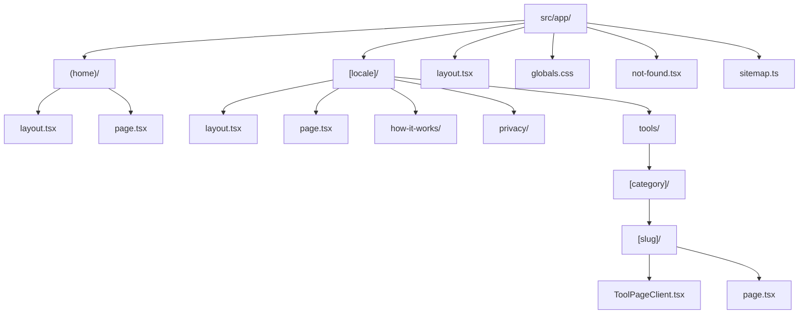
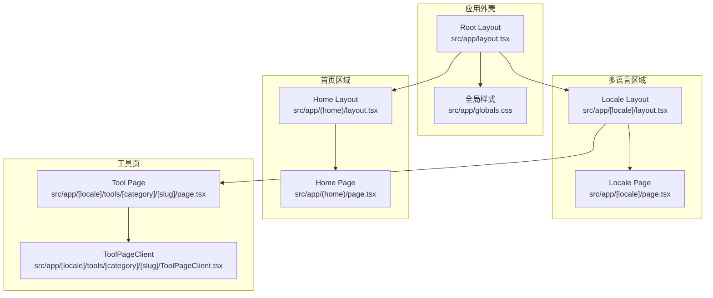
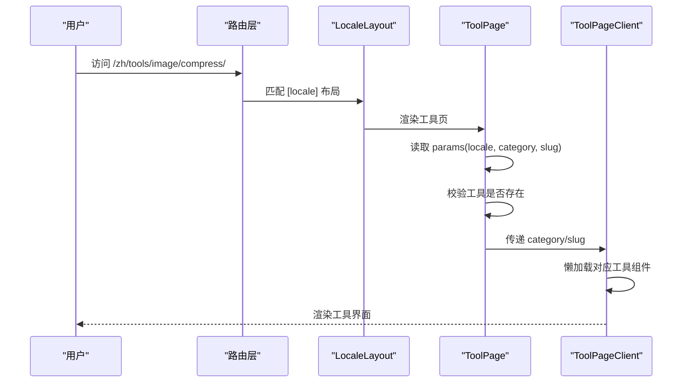
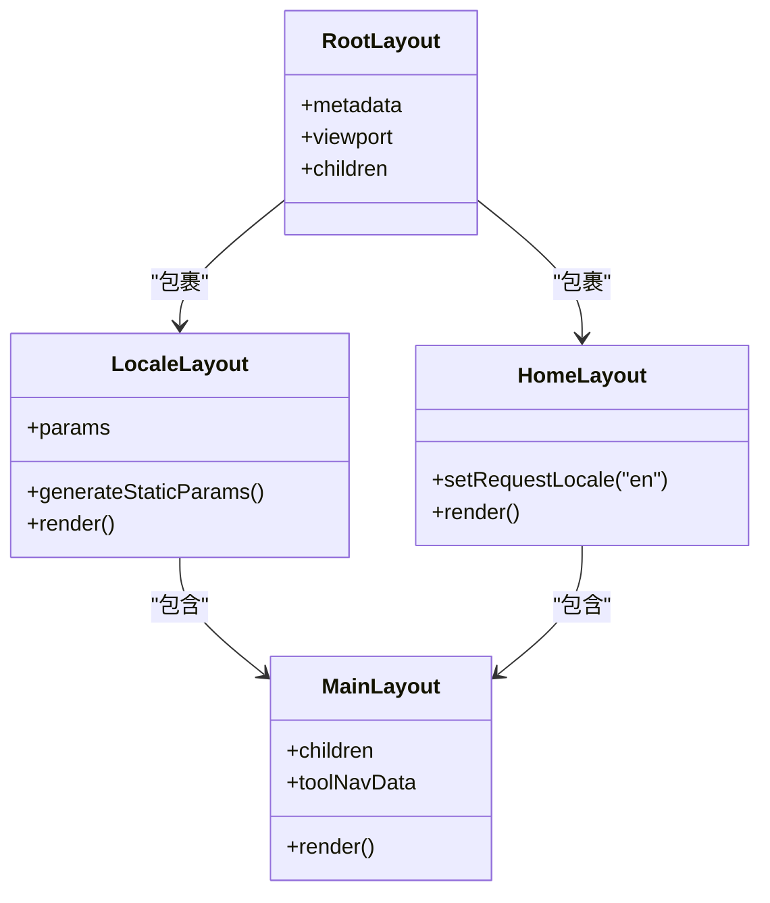
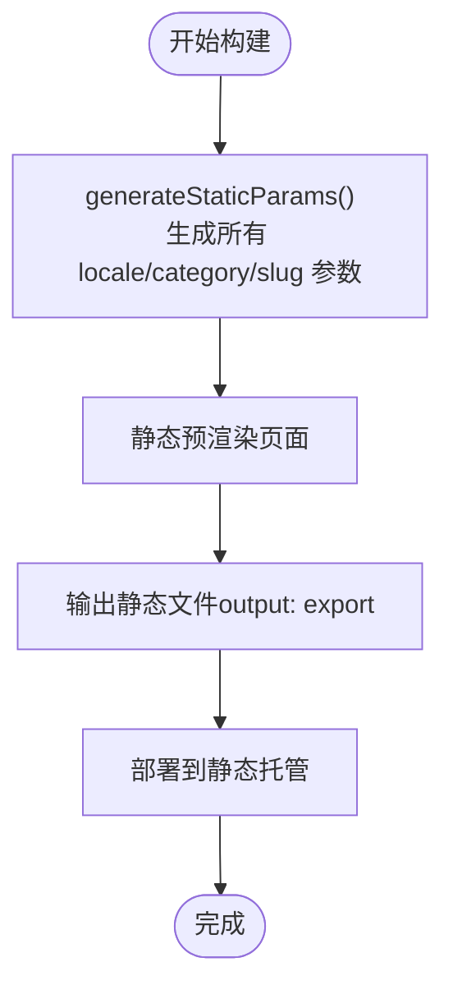
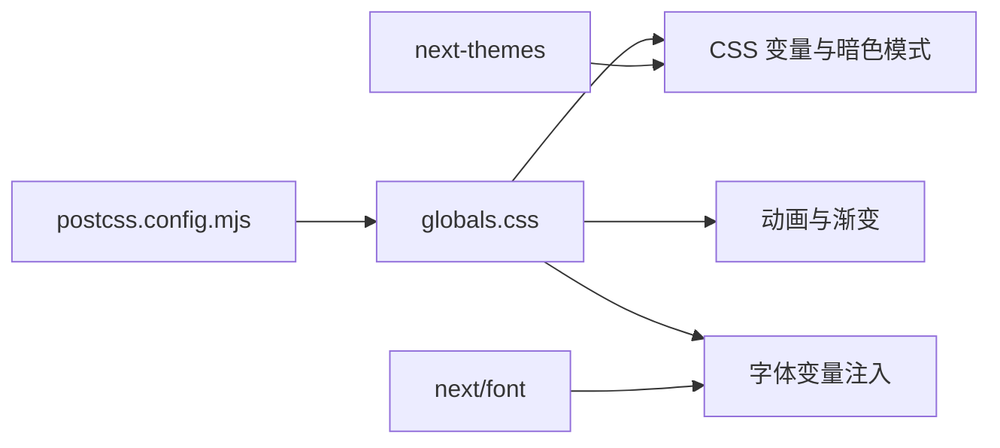
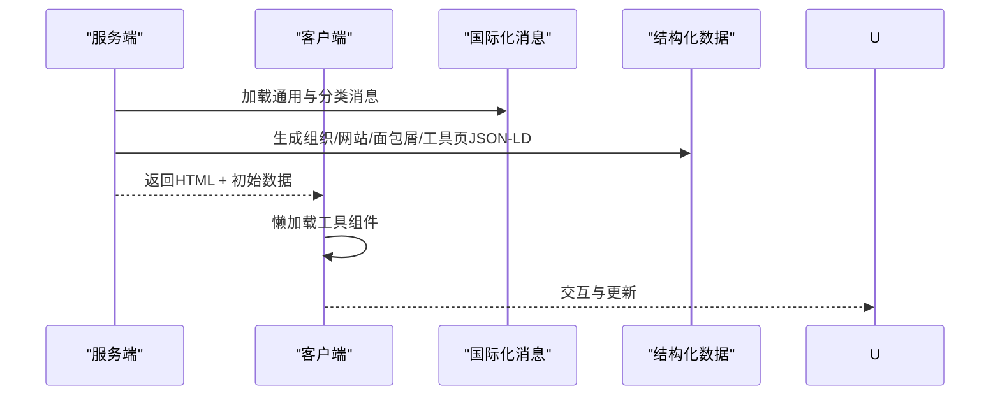
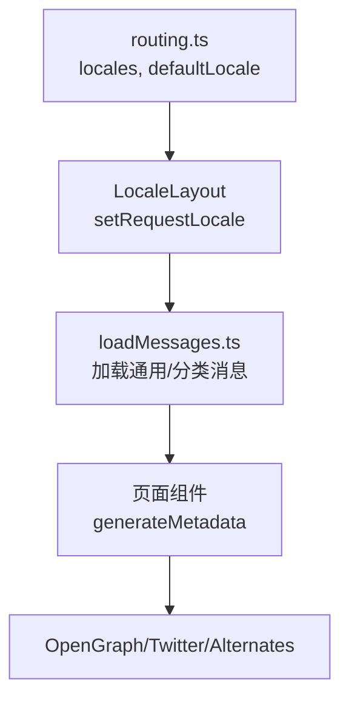
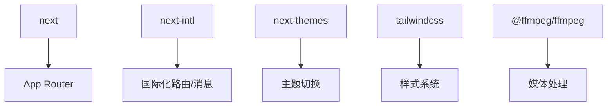

# App Router架构

<cite>
**本文引用的文件**
- [src/app/layout.tsx](file://src/app/layout.tsx)
- [src/app/globals.css](file://src/app/globals.css)
- [next.config.ts](file://next.config.ts)
- [package.json](file://package.json)
- [src/i18n/routing.ts](file://src/i18n/routing.ts)
- [src/app/[locale]/layout.tsx](file://src/app/[locale]/layout.tsx)
- [src/app/[locale]/page.tsx](file://src/app/[locale]/page.tsx)
- [src/app/(home)/layout.tsx](file://src/app/(home)/layout.tsx)
- [src/app/(home)/page.tsx](file://src/app/(home)/page.tsx)
- [src/components/layout/MainLayout.tsx](file://src/components/layout/MainLayout.tsx)
- [src/app/[locale]/tools/[category]/[slug]/page.tsx](file://src/app/[locale]/tools/[category]/[slug]/page.tsx)
- [src/app/[locale]/tools/[category]/[slug]/ToolPageClient.tsx](file://src/app/[locale]/tools/[category]/[slug]/ToolPageClient.tsx)
- [src/lib/i18n/loadMessages.ts](file://src/lib/i18n/loadMessages.ts)
- [src/lib/seo/jsonld.ts](file://src/lib/seo/jsonld.ts)
- [postcss.config.mjs](file://postcss.config.mjs)
</cite>

## 目录
1. [简介](#简介)
2. [项目结构](#项目结构)
3. [核心组件](#核心组件)
4. [架构总览](#架构总览)
5. [详细组件分析](#详细组件分析)
6. [依赖分析](#依赖分析)
7. [性能考虑](#性能考虑)
8. [故障排查指南](#故障排查指南)
9. [结论](#结论)
10. [附录](#附录)

## 简介
本文件系统性阐述媒体工具箱在 Next.js App Router 架构下的设计与实现，重点覆盖以下方面：
- App Router 的设计理念与 Pages Router 的差异
- 路由系统：动态路由、嵌套路由与路由组的使用
- 布局系统：根布局、页面布局与组件布局的层次关系
- 静态生成（SSG）：静态导出与预渲染策略
- 样式系统：CSS 模块化与 Tailwind v4 的组织方式
- 数据获取：服务端渲染（SSR）、客户端渲染（CSR）与混合渲染
- SEO 与用户体验：结构化数据、多语言与可访问性
- 性能优化与最佳实践

## 项目结构
媒体工具箱采用 Next.js App Router 的目录约定，核心入口位于 src/app 下，按功能域组织路由层级，并通过路由组实现特定路径的独立布局空间。

图表来源
- [src/app/layout.tsx:1-48](file://src/app/layout.tsx#L1-L48)
- [src/app/globals.css:1-128](file://src/app/globals.css#L1-L128)
- [src/app/(home)/layout.tsx](file://src/app/(home)/layout.tsx#L1-L63)
- [src/app/(home)/page.tsx](file://src/app/(home)/page.tsx#L1-L76)
- [src/app/[locale]/layout.tsx](file://src/app/[locale]/layout.tsx#L1-L77)
- [src/app/[locale]/page.tsx](file://src/app/[locale]/page.tsx#L1-L93)
- [src/app/[locale]/tools/[category]/[slug]/page.tsx](file://src/app/[locale]/tools/[category]/[slug]/page.tsx#L1-L109)
- [src/app/[locale]/tools/[category]/[slug]/ToolPageClient.tsx](file://src/app/[locale]/tools/[category]/[slug]/ToolPageClient.tsx#L1-L59)

章节来源
- [src/app/layout.tsx:1-48](file://src/app/layout.tsx#L1-L48)
- [src/app/globals.css:1-128](file://src/app/globals.css#L1-L128)
- [src/app/[locale]/layout.tsx:1-77](file://src/app/[locale]/layout.tsx#L1-L77)
- [src/app/[locale]/page.tsx:1-93](file://src/app/[locale]/page.tsx#L1-L93)
- [src/app/(home)/layout.tsx:1-63](file://src/app/(home)/layout.tsx#L1-L63)
- [src/app/(home)/page.tsx:1-76](file://src/app/(home)/page.tsx#L1-L76)
- [src/app/[locale]/tools/[category]/[slug]/page.tsx:1-109](file://src/app/[locale]/tools/[category]/[slug]/page.tsx#L1-L109)
- [src/app/[locale]/tools/[category]/[slug]/ToolPageClient.tsx:1-59](file://src/app/[locale]/tools/[category]/[slug]/ToolPageClient.tsx#L1-L59)

## 核心组件
- 全局元数据与视口配置：在根布局中集中定义站点标题、描述、OpenGraph、Twitter 卡片以及主题色等。
- 根样式与主题：通过全局 CSS 变量与 Tailwind v4 主题变量统一颜色与字体；支持暗色模式与动画变量。
- 国际化路由与布局：基于 next-intl 定义多语言路由与布局，支持静态参数生成与语言切换。
- 工具页客户端渲染：按需懒加载工具组件，结合骨架屏与缓存提升首屏性能。
- 结构化数据：为首页、站点、工具页与面包屑生成 Schema.org 结构化数据，增强 SEO。

章节来源
- [src/app/layout.tsx:10-39](file://src/app/layout.tsx#L10-L39)
- [src/app/globals.css:21-57](file://src/app/globals.css#L21-L57)
- [src/app/[locale]/layout.tsx:32-76](file://src/app/[locale]/layout.tsx#L32-L76)
- [src/app/[locale]/tools/[category]/[slug]/ToolPageClient.tsx:29-58](file://src/app/[locale]/tools/[category]/[slug]/ToolPageClient.tsx#L29-L58)
- [src/lib/seo/jsonld.ts:5-32](file://src/lib/seo/jsonld.ts#L5-L32)

## 架构总览
App Router 将“路由即组件”的思想贯彻到底：每个路径对应一个页面组件，页面组件可组合布局组件形成完整的页面结构。国际化通过路由参数与服务端设置实现，工具页采用按需懒加载与结构化数据增强 SEO。

图表来源
- [src/app/layout.tsx:1-48](file://src/app/layout.tsx#L1-L48)
- [src/app/globals.css:1-128](file://src/app/globals.css#L1-L128)
- [src/app/[locale]/layout.tsx](file://src/app/[locale]/layout.tsx#L1-L77)
- [src/app/[locale]/page.tsx](file://src/app/[locale]/page.tsx#L1-L93)
- [src/app/(home)/layout.tsx](file://src/app/(home)/layout.tsx#L1-L63)
- [src/app/(home)/page.tsx](file://src/app/(home)/page.tsx#L1-L76)
- [src/app/[locale]/tools/[category]/[slug]/page.tsx](file://src/app/[locale]/tools/[category]/[slug]/page.tsx#L1-L109)
- [src/app/[locale]/tools/[category]/[slug]/ToolPageClient.tsx](file://src/app/[locale]/tools/[category]/[slug]/ToolPageClient.tsx#L1-L59)

## 详细组件分析

### 路由系统与动态路由
- 动态路由参数
  - 多语言路由：[locale] 接收语言代码，用于国际化内容与链接生成。
  - 工具路由：[category] 与 [slug] 组合定位具体工具，支持按需懒加载与结构化数据生成。
- 静态参数生成
  - 在工具页中通过 generateStaticParams 生成所有 locale/category/slug 的静态路由，确保全量预渲染。
- 嵌套路由与路由组
  - 首页使用路由组 (home) 将英文根路径与多语言路径解耦，避免重复渲染与冲突。
- notFound 处理
  - 当工具不存在时，使用 notFound 触发 404 页面，保证一致的错误处理体验。

图表来源
- [src/app/[locale]/layout.tsx:32-76](file://src/app/[locale]/layout.tsx#L32-L76)
- [src/app/[locale]/tools/[category]/[slug]/page.tsx:33-108](file://src/app/[locale]/tools/[category]/[slug]/page.tsx#L33-L108)
- [src/app/[locale]/tools/[category]/[slug]/ToolPageClient.tsx:29-58](file://src/app/[locale]/tools/[category]/[slug]/ToolPageClient.tsx#L29-L58)

章节来源
- [src/app/[locale]/tools/[category]/[slug]/page.tsx:13-31](file://src/app/[locale]/tools/[category]/[slug]/page.tsx#L13-L31)
- [src/app/[locale]/tools/[category]/[slug]/page.tsx:41-44](file://src/app/[locale]/tools/[category]/[slug]/page.tsx#L41-L44)
- [src/app/(home)/layout.tsx:26-62](file://src/app/(home)/layout.tsx#L26-L62)

### 布局系统与层次关系
- 根布局（Root Layout）
  - 定义全局元数据与视口配置，作为所有页面的容器。
- 多语言布局（Locale Layout）
  - 设置语言环境、字体变量、主题提供者、国际化消息与全局组件（安装提示、服务工作线程注册等）。
- 首页布局（Home Layout）
  - 专门针对英文根路径的布局，固定语言与导航数据。
- 页面布局（Page）
  - 各页面负责生成页面级元数据与内容，如首页与工具页。
- 组件布局（MainLayout）
  - 提供头部、侧边栏、搜索对话框、移动端导航与工具导航上下文，统一页面结构。

图表来源
- [src/app/layout.tsx:41-47](file://src/app/layout.tsx#L41-L47)
- [src/app/[locale]/layout.tsx:32-76](file://src/app/[locale]/layout.tsx#L32-L76)
- [src/app/(home)/layout.tsx:26-62](file://src/app/(home)/layout.tsx#L26-L62)
- [src/components/layout/MainLayout.tsx:16-56](file://src/components/layout/MainLayout.tsx#L16-L56)

章节来源
- [src/app/layout.tsx:10-39](file://src/app/layout.tsx#L10-L39)
- [src/app/[locale]/layout.tsx:32-76](file://src/app/[locale]/layout.tsx#L32-L76)
- [src/app/(home)/layout.tsx:26-62](file://src/app/(home)/layout.tsx#L26-L62)
- [src/components/layout/MainLayout.tsx:16-56](file://src/components/layout/MainLayout.tsx#L16-L56)

### 静态生成（SSG）与预渲染策略
- 静态导出
  - next.config.ts 中启用 output: "export"，构建产物可直接部署到静态托管平台。
- 预渲染策略
  - 工具页通过 generateStaticParams 生成所有 locale/category/slug 的静态路由，确保每个工具页面在构建期完成预渲染。
  - 首页与多语言首页也生成对应的静态参数，保证根路径与多语言路径的可用性。
- 图像优化
  - images.unoptimized: true 配合静态导出，避免 Next.js 图像优化带来的额外复杂度。

图表来源
- [next.config.ts:6-10](file://next.config.ts#L6-L10)
- [src/app/[locale]/tools/[category]/[slug]/page.tsx:13-22](file://src/app/[locale]/tools/[category]/[slug]/page.tsx#L13-L22)
- [src/app/[locale]/page.tsx:13-15](file://src/app/[locale]/page.tsx#L13-L15)
- [src/app/(home)/page.tsx:13](file://src/app/(home)/page.tsx#L13)

章节来源
- [next.config.ts:6-10](file://next.config.ts#L6-L10)
- [src/app/[locale]/tools/[category]/[slug]/page.tsx:13-22](file://src/app/[locale]/tools/[category]/[slug]/page.tsx#L13-L22)
- [src/app/[locale]/page.tsx:13-15](file://src/app/[locale]/page.tsx#L13-L15)
- [src/app/(home)/page.tsx:13](file://src/app/(home)/page.tsx#L13)

### 样式系统与CSS模块化
- 全局样式
  - 使用 Tailwind v4 与自定义 CSS 变量，集中定义颜色、阴影、渐变与动画。
  - 支持暗色模式，通过 .dark 类切换变量值。
- 字体与主题
  - 通过 next/font 加载 Geist 字体变量，注入到 body 上下文。
  - next-themes 提供主题切换能力，支持系统默认主题。
- PostCSS 集成
  - 通过 @tailwindcss/postcss 插件启用 Tailwind 指令与实用类。

图表来源
- [src/app/globals.css:1-128](file://src/app/globals.css#L1-L128)
- [src/app/[locale]/layout.tsx:18-26](file://src/app/[locale]/layout.tsx#L18-L26)
- [src/app/[locale]/layout.tsx:54-L61](file://src/app/[locale]/layout.tsx#L54-L61)
- [postcss.config.mjs:1-8](file://postcss.config.mjs#L1-L8)

章节来源
- [src/app/globals.css:21-57](file://src/app/globals.css#L21-L57)
- [src/app/[locale]/layout.tsx:18-26](file://src/app/[locale]/layout.tsx#L18-L26)
- [src/app/[locale]/layout.tsx:54-L61](file://src/app/[locale]/layout.tsx#L54-L61)
- [postcss.config.mjs:1-8](file://postcss.config.mjs#L1-L8)

### 数据获取策略：SSR、CSR 与混合渲染
- 服务端渲染（SSR）
  - 工具页与首页在服务端生成元数据与国际化消息，随后在客户端进行交互。
- 客户端渲染（CSR）
  - 工具页客户端组件通过懒加载与 Suspense 实现 CSR，减少首屏体积。
- 混合渲染
  - 服务端负责 SEO 与首屏内容，客户端负责交互与动态行为，兼顾性能与体验。

图表来源
- [src/app/[locale]/tools/[category]/[slug]/page.tsx:46-L54](file://src/app/[locale]/tools/[category]/[slug]/page.tsx#L46-L54)
- [src/app/[locale]/tools/[category]/[slug]/page.tsx:62-L76](file://src/app/[locale]/tools/[category]/[slug]/page.tsx#L62-L76)
- [src/app/[locale]/tools/[category]/[slug]/ToolPageClient.tsx:29-L58](file://src/app/[locale]/tools/[category]/[slug]/ToolPageClient.tsx#L29-L58)

章节来源
- [src/app/[locale]/tools/[category]/[slug]/page.tsx:46-L54](file://src/app/[locale]/tools/[category]/[slug]/page.tsx#L46-L54)
- [src/app/[locale]/tools/[category]/[slug]/ToolPageClient.tsx:29-L58](file://src/app/[locale]/tools/[category]/[slug]/ToolPageClient.tsx#L29-L58)

### 国际化与路由配置
- 路由定义
  - 使用 defineRouting 指定支持的语言列表、默认语言与 RTL 语言集合。
- 布局与页面
  - LocaleLayout 通过 setRequestLocale 与 NextIntlClientProvider 注入翻译消息。
  - 首页与工具页分别在服务端生成页面级元数据与结构化数据。
- 消息加载
  - loadCommonMessages 与 loadCategoryMessages 分别加载通用与分类翻译，支持按需合并。

图表来源
- [src/i18n/routing.ts:1-18](file://src/i18n/routing.ts#L1-L18)
- [src/app/[locale]/layout.tsx:45-L49](file://src/app/[locale]/layout.tsx#L45-L49)
- [src/lib/i18n/loadMessages.ts:8-26](file://src/lib/i18n/loadMessages.ts#L8-L26)
- [src/app/[locale]/page.tsx:17-L61](file://src/app/[locale]/page.tsx#L17-L61)

章节来源
- [src/i18n/routing.ts:1-18](file://src/i18n/routing.ts#L1-L18)
- [src/app/[locale]/layout.tsx:45-L49](file://src/app/[locale]/layout.tsx#L45-L49)
- [src/lib/i18n/loadMessages.ts:8-26](file://src/lib/i18n/loadMessages.ts#L8-L26)
- [src/app/[locale]/page.tsx:17-L61](file://src/app/[locale]/page.tsx#L17-L61)

### SEO 与用户体验
- 结构化数据
  - 生成 Organization、WebSite、BreadcrumbList 与 FAQPage 等 JSON-LD，提升搜索可见性。
- 元数据
  - 首页与工具页分别生成 title、description、canonical、alternates 与 OpenGraph/Twitter 卡片。
- 用户体验
  - 懒加载与骨架屏减少首屏等待；移动端导航与搜索对话框提升可达性；暗色模式与动画变量增强视觉体验。

章节来源
- [src/lib/seo/jsonld.ts:5-32](file://src/lib/seo/jsonld.ts#L5-L32)
- [src/app/[locale]/page.tsx:17-L61](file://src/app/[locale]/page.tsx#L17-L61)
- [src/app/[locale]/tools/[category]/[slug]/page.tsx:62-L76](file://src/app/[locale]/tools/[category]/[slug]/page.tsx#L62-L76)
- [src/app/[locale]/tools/[category]/[slug]/ToolPageClient.tsx:16-L24](file://src/app/[locale]/tools/[category]/[slug]/ToolPageClient.tsx#L16-L24)

## 依赖分析
- 核心依赖
  - next: App Router 与构建工具
  - next-intl: 国际化路由与消息
  - next-themes: 主题切换
  - tailwindcss: 样式框架
  - @ffmpeg/ffmpeg: 媒体处理（按需加载）
- 开发依赖
  - eslint、typescript、tailwindcss v4

图表来源
- [package.json:11-32](file://package.json#L11-L32)

章节来源
- [package.json:11-32](file://package.json#L11-L32)

## 性能考虑
- 代码分割与懒加载
  - 工具页客户端组件使用 lazy 与缓存，避免重复加载与内存占用。
- 骨架屏与 Suspense
  - 在工具页中使用骨架屏与 Suspense，改善首屏感知性能。
- 静态导出与预渲染
  - 通过 generateStaticParams 与 output: "export"，减少运行时开销。
- 图像优化
  - 在静态导出场景下关闭图像优化，简化部署流程。
- 动画与可访问性
  - 遵循 prefers-reduced-motion，降低动画对部分用户的不适。

章节来源
- [src/app/[locale]/tools/[category]/[slug]/ToolPageClient.tsx:29-L58](file://src/app/[locale]/tools/[category]/[slug]/ToolPageClient.tsx#L29-L58)
- [src/app/[locale]/tools/[category]/[slug]/page.tsx:94-L99](file://src/app/[locale]/tools/[category]/[slug]/page.tsx#L94-L99)
- [next.config.ts:6-10](file://next.config.ts#L6-L10)
- [src/app/globals.css:122-127](file://src/app/globals.css#L122-L127)

## 故障排查指南
- 404 页面
  - 工具页若未找到对应工具，将触发 notFound，检查 slug 与类别是否匹配。
- 国际化问题
  - LocaleLayout 中校验语言是否在支持列表内，若不匹配则返回 404。
- 结构化数据缺失
  - 确认 generateToolJsonLd、generateBreadcrumbJsonLd 与 generateFaqJsonLd 的调用顺序与参数正确。
- 首屏空白或闪烁
  - 检查 ToolSkeleton 是否正确渲染，Suspense fallback 是否生效。

章节来源
- [src/app/[locale]/tools/[category]/[slug]/page.tsx:41-L44](file://src/app/[locale]/tools/[category]/[slug]/page.tsx#L41-L44)
- [src/app/[locale]/layout.tsx:41-L43](file://src/app/[locale]/layout.tsx#L41-L43)
- [src/app/[locale]/tools/[category]/[slug]/page.tsx:78-L93](file://src/app/[locale]/tools/[category]/[slug]/page.tsx#L78-L93)

## 结论
媒体工具箱以 App Router 为核心，结合静态导出、国际化与结构化数据，实现了高性能、可扩展且对 SEO 友好的前端架构。通过路由组、动态路由与懒加载等技术手段，既满足了多语言与工具页面的复杂需求，又保持了良好的用户体验与可维护性。

## 附录
- 示例路径参考
  - 多语言首页：[src/app/[locale]/page.tsx](file://src/app/[locale]/page.tsx#L1-L93)
  - 英文首页：[src/app/(home)/page.tsx](file://src/app/(home)/page.tsx#L1-L76)
  - 工具页服务端渲染：[src/app/[locale]/tools/[category]/[slug]/page.tsx](file://src/app/[locale]/tools/[category]/[slug]/page.tsx#L1-L109)
  - 工具页客户端渲染：[src/app/[locale]/tools/[category]/[slug]/ToolPageClient.tsx](file://src/app/[locale]/tools/[category]/[slug]/ToolPageClient.tsx#L1-L59)
  - 全局样式与主题：[src/app/globals.css:1-128](file://src/app/globals.css#L1-L128)
  - 根布局元数据：[src/app/layout.tsx:1-48](file://src/app/layout.tsx#L1-L48)
  - 国际化路由配置：[src/i18n/routing.ts:1-18](file://src/i18n/routing.ts#L1-L18)
  - 结构化数据生成：[src/lib/seo/jsonld.ts:1-90](file://src/lib/seo/jsonld.ts#L1-L90)
  - 静态导出配置：[next.config.ts:1-13](file://next.config.ts#L1-L13)
  - PostCSS 配置：[postcss.config.mjs:1-8](file://postcss.config.mjs#L1-L8)