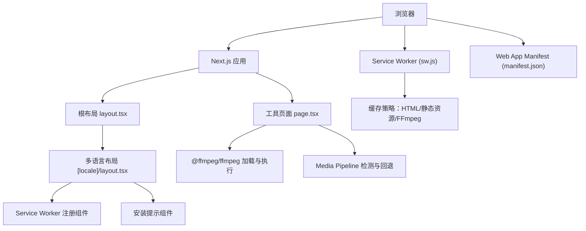
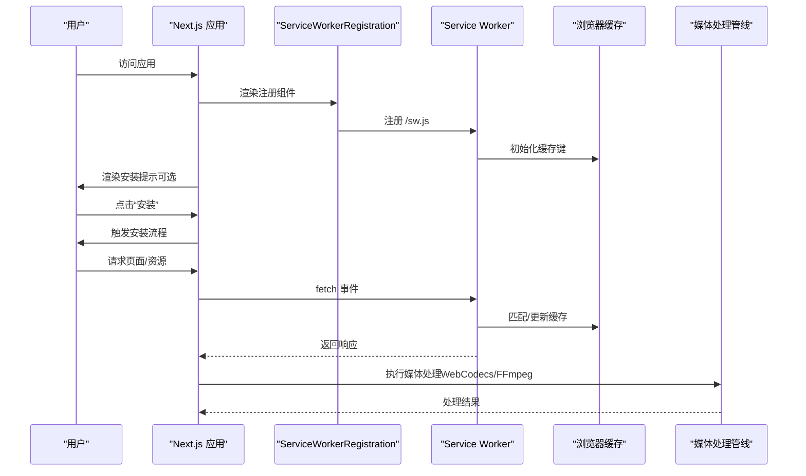
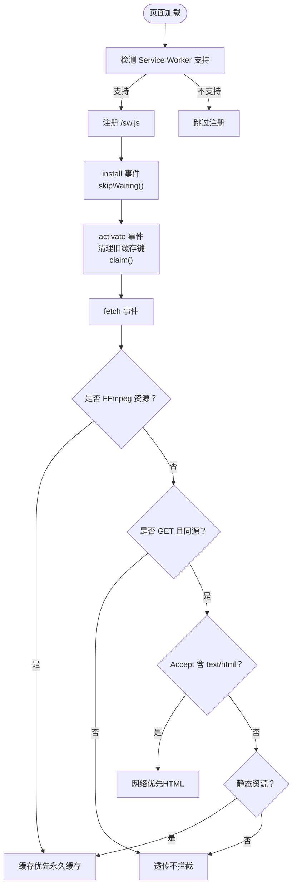
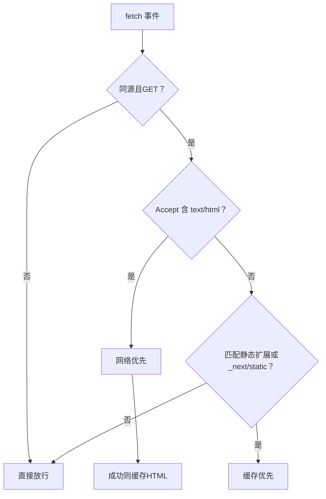
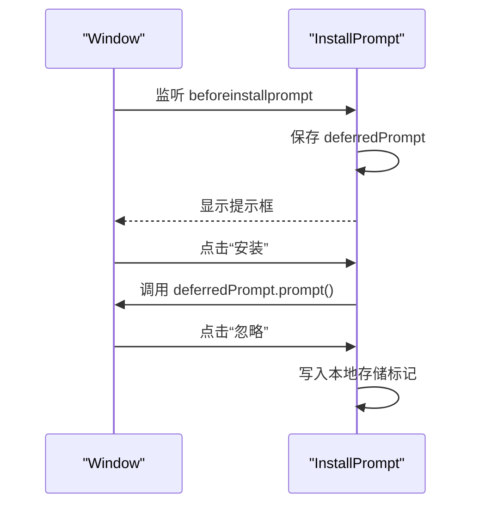
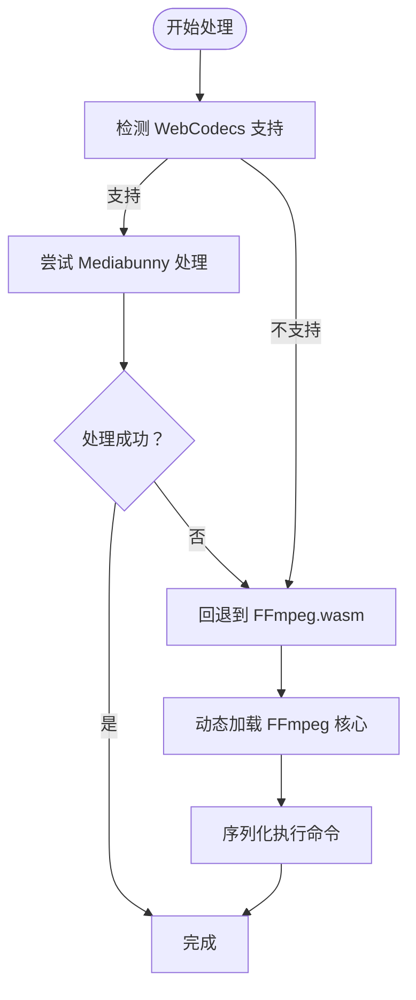
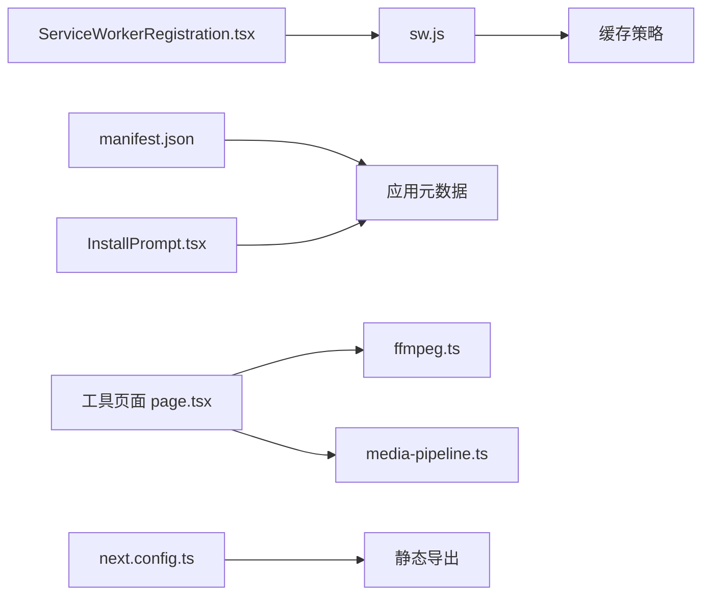

# PWA架构

<cite>
**本文引用的文件**
- [public/manifest.json](file://public/manifest.json)
- [public/sw.js](file://public/sw.js)
- [src/app/layout.tsx](file://src/app/layout.tsx)
- [src/app/[locale]/layout.tsx](file://src/app/[locale]/layout.tsx)
- [src/components/shared/ServiceWorkerRegistration.tsx](file://src/components/shared/ServiceWorkerRegistration.tsx)
- [src/components/shared/InstallPrompt.tsx](file://src/components/shared/InstallPrompt.tsx)
- [src/lib/media-pipeline.ts](file://src/lib/media-pipeline.ts)
- [src/lib/ffmpeg.ts](file://src/lib/ffmpeg.ts)
- [src/app/[locale]/tools/[category]/[slug]/page.tsx](file://src/app/[locale]/tools/[category]/[slug]/page.tsx)
- [next.config.ts](file://next.config.ts)
- [package.json](file://package.json)
</cite>

## 目录
1. [简介](#简介)
2. [项目结构](#项目结构)
3. [核心组件](#核心组件)
4. [架构总览](#架构总览)
5. [组件详解](#组件详解)
6. [依赖关系分析](#依赖关系分析)
7. [性能考量](#性能考量)
8. [故障排查指南](#故障排查指南)
9. [结论](#结论)
10. [附录](#附录)

## 简介
本文件系统化梳理媒体工具箱（PrivaDeck）的PWA架构与实现策略，覆盖Service Worker注册与缓存策略、Web App Manifest配置、应用安装提示、离线能力、媒体处理集成（WebCodecs与FFmpeg.wasm）、性能优化与监控、以及部署与跨平台兼容性。文档以代码为依据，结合可视化图示帮助读者快速理解并落地实践。

## 项目结构
媒体工具箱基于Next.js 16构建，采用静态导出（export）模式，便于在CDN或静态托管平台（如Cloudflare Pages）上部署。PWA相关资产位于public目录，运行时逻辑通过React组件注入到根布局中。

图表来源
- [src/app/layout.tsx:1-48](file://src/app/layout.tsx#L1-L48)
- [src/app/[locale]/layout.tsx](file://src/app/[locale]/layout.tsx#L1-L77)
- [src/components/shared/ServiceWorkerRegistration.tsx:1-16](file://src/components/shared/ServiceWorkerRegistration.tsx#L1-L16)
- [src/components/shared/InstallPrompt.tsx:1-71](file://src/components/shared/InstallPrompt.tsx#L1-L71)
- [src/app/[locale]/tools/[category]/[slug]/page.tsx](file://src/app/[locale]/tools/[category]/[slug]/page.tsx#L1-L109)
- [public/sw.js:1-93](file://public/sw.js#L1-L93)
- [public/manifest.json:1-29](file://public/manifest.json#L1-L29)

章节来源
- [next.config.ts:1-13](file://next.config.ts#L1-L13)
- [package.json:1-45](file://package.json#L1-L45)

## 核心组件
- Service Worker注册与缓存：通过客户端组件在根布局挂载，负责注册sw.js；sw.js实现HTML网络优先、静态资源缓存优先、以及FFmpeg核心永久缓存策略。
- 安装提示：监听beforeinstallprompt事件，提供“安装”和“忽略”交互，避免强制打断用户。
- Web App Manifest：定义应用名称、显示模式、主题色、背景色、图标集与分类等。
- 媒体处理管线：优先使用WebCodecs（Mediabunny）进行硬件加速编解码，不支持或不满足条件时回退至FFmpeg.wasm；同时通过预取链接优化首次加载体验。

章节来源
- [src/components/shared/ServiceWorkerRegistration.tsx:1-16](file://src/components/shared/ServiceWorkerRegistration.tsx#L1-L16)
- [public/sw.js:1-93](file://public/sw.js#L1-L93)
- [public/manifest.json:1-29](file://public/manifest.json#L1-L29)
- [src/lib/media-pipeline.ts:1-175](file://src/lib/media-pipeline.ts#L1-L175)
- [src/lib/ffmpeg.ts:1-144](file://src/lib/ffmpeg.ts#L1-L144)
- [src/app/[locale]/tools/[category]/[slug]/page.tsx](file://src/app/[locale]/tools/[category]/[slug]/page.tsx#L94-L99)

## 架构总览
下图展示了PWA从浏览器到Service Worker再到媒体处理的整体流程，以及离线与安装提示的关键节点。

图表来源
- [src/components/shared/ServiceWorkerRegistration.tsx:1-16](file://src/components/shared/ServiceWorkerRegistration.tsx#L1-L16)
- [public/sw.js:1-93](file://public/sw.js#L1-L93)
- [src/lib/media-pipeline.ts:1-175](file://src/lib/media-pipeline.ts#L1-L175)
- [src/lib/ffmpeg.ts:1-144](file://src/lib/ffmpeg.ts#L1-L144)

## 组件详解

### Service Worker 注册与生命周期
- 注册位置：在根布局中渲染ServiceWorkerRegistration组件，确保页面初始化即尝试注册。
- 注册方式：调用navigator.serviceWorker.register("/sw.js")，失败静默处理，不影响主流程。
- 生命周期事件：
  - install：跳过等待，尽快激活新版本。
  - activate：清理旧缓存键，claim所有clients，确保新SW立即生效。
  - fetch：根据请求类型与来源选择不同策略。

图表来源
- [src/components/shared/ServiceWorkerRegistration.tsx:1-16](file://src/components/shared/ServiceWorkerRegistration.tsx#L1-L16)
- [public/sw.js:1-93](file://public/sw.js#L1-L93)

章节来源
- [src/components/shared/ServiceWorkerRegistration.tsx:1-16](file://src/components/shared/ServiceWorkerRegistration.tsx#L1-L16)
- [public/sw.js:11-28](file://public/sw.js#L11-L28)

### 缓存策略与离线能力
- HTML：网络优先策略，保证内容新鲜度；请求成功后写入缓存，失败时回退到缓存或错误响应。
- 静态资源（JS/CSS/图片/字体）：缓存优先策略，提升二次访问速度。
- FFmpeg核心资源：永久缓存策略，URL包含版本号，确保稳定复用。
- 预取：工具页面在需要时对FFmpeg核心资源发起prefetch，缩短首次加载时间。

图表来源
- [public/sw.js:30-92](file://public/sw.js#L30-L92)
- [src/app/[locale]/tools/[category]/[slug]/page.tsx](file://src/app/[locale]/tools/[category]/[slug]/page.tsx#L94-L99)

章节来源
- [public/sw.js:30-92](file://public/sw.js#L30-L92)
- [src/app/[locale]/tools/[category]/[slug]/page.tsx](file://src/app/[locale]/tools/[category]/[slug]/page.tsx#L94-L99)

### Web App Manifest 配置
- 名称与短名：用于应用标题与安装后显示。
- 描述：简述隐私优先、本地处理、零上传。
- 入口路径：start_url="/"。
- 显示模式：standalone，提供类原生体验。
- 主题色与背景色：统一视觉风格。
- 图标集：包含192x192、512x512及maskable用途图标，适配不同设备与系统样式。
- 分类：utilities、productivity，利于应用商店归类。

章节来源
- [public/manifest.json:1-29](file://public/manifest.json#L1-L29)
- [src/app/layout.tsx:10-39](file://src/app/layout.tsx#L10-L39)

### 应用安装提示（Add to Home Screen）
- 事件监听：beforeinstallprompt，阻止默认弹窗，保存事件对象，控制显示时机。
- 用户交互：提供“安装”按钮触发prompt()，“忽略”按钮写入本地存储标记，避免重复打扰。
- 体验优化：仅在未被忽略时显示，减少干扰。

图表来源
- [src/components/shared/InstallPrompt.tsx:1-71](file://src/components/shared/InstallPrompt.tsx#L1-L71)

章节来源
- [src/components/shared/InstallPrompt.tsx:1-71](file://src/components/shared/InstallPrompt.tsx#L1-L71)

### 媒体处理集成：WebCodecs 与 FFmpeg.wasm
- WebCodecs优先：检测Video/Audio编码器/解码器可用性，优先使用Mediabunny进行硬件加速处理。
- 回退策略：当检测到不支持的视频编解码或转换无效时，抛出自定义错误并回退至FFmpeg.wasm。
- FFmpeg加载：按需动态加载@ffmpeg/core的JS/WASM资源，设置进度回调，序列化并发操作，避免内存拷贝。
- 工具页面优化：在视频/音频工具页预取FFmpeg核心资源，降低首次处理延迟。

图表来源
- [src/lib/media-pipeline.ts:7-175](file://src/lib/media-pipeline.ts#L7-L175)
- [src/lib/ffmpeg.ts:10-144](file://src/lib/ffmpeg.ts#L10-L144)
- [src/app/[locale]/tools/[category]/[slug]/page.tsx](file://src/app/[locale]/tools/[category]/[slug]/page.tsx#L94-L99)

章节来源
- [src/lib/media-pipeline.ts:1-175](file://src/lib/media-pipeline.ts#L1-L175)
- [src/lib/ffmpeg.ts:1-144](file://src/lib/ffmpeg.ts#L1-L144)
- [src/app/[locale]/tools/[category]/[slug]/page.tsx](file://src/app/[locale]/tools/[category]/[slug]/page.tsx#L94-L99)

### 推送通知与后台同步
- 当前仓库未发现推送通知与后台同步的实现代码。若需引入，建议：
  - 在Service Worker中注册push事件与后台同步事件。
  - 使用浏览器权限API管理通知授权。
  - 设计消息队列与重试机制，确保离线场景下的可靠性。
- 本节为概念性说明，不对应具体源码。

## 依赖关系分析
- 运行时依赖：@ffmpeg/ffmpeg、@ffmpeg/util、mediabunny、pdfjs、tesseract.js等。
- 构建配置：Next.js 16，静态导出（export），图片未优化（unoptimized）以适配静态托管。
- PWA相关：Service Worker脚本、Manifest文件、安装提示组件、媒体处理库。

图表来源
- [public/sw.js:1-93](file://public/sw.js#L1-L93)
- [public/manifest.json:1-29](file://public/manifest.json#L1-L29)
- [src/components/shared/ServiceWorkerRegistration.tsx:1-16](file://src/components/shared/ServiceWorkerRegistration.tsx#L1-L16)
- [src/components/shared/InstallPrompt.tsx:1-71](file://src/components/shared/InstallPrompt.tsx#L1-L71)
- [src/app/[locale]/tools/[category]/[slug]/page.tsx](file://src/app/[locale]/tools/[category]/[slug]/page.tsx#L1-L109)
- [src/lib/ffmpeg.ts:1-144](file://src/lib/ffmpeg.ts#L1-L144)
- [src/lib/media-pipeline.ts:1-175](file://src/lib/media-pipeline.ts#L1-L175)
- [next.config.ts:1-13](file://next.config.ts#L1-L13)

章节来源
- [package.json:11-32](file://package.json#L11-L32)
- [next.config.ts:6-10](file://next.config.ts#L6-L10)

## 性能考量
- 首次加载优化
  - 预取：工具页面对FFmpeg核心资源发起prefetch，缩短首次处理时间。
  - 静态导出：Next export减少服务器端渲染开销，适合CDN分发。
  - 图片优化：关闭自动优化，配合手动压缩与格式选择（如AVIF）。
- 资源缓存
  - HTML网络优先，兼顾新鲜度；静态资源缓存优先，显著提升二次访问速度。
  - FFmpeg核心永久缓存，避免重复下载。
- 网络请求处理
  - Service Worker统一拦截，减少重复网络往返；离线时可直接返回缓存。
- 媒体处理性能
  - WebCodecs优先，硬件加速；不支持时回退FFmpeg.wasm，避免阻塞主线程。
  - 进度回调与序列化执行，改善用户体验与稳定性。

章节来源
- [src/app/[locale]/tools/[category]/[slug]/page.tsx](file://src/app/[locale]/tools/[category]/[slug]/page.tsx#L94-L99)
- [public/sw.js:57-91](file://public/sw.js#L57-L91)
- [src/lib/media-pipeline.ts:7-175](file://src/lib/media-pipeline.ts#L7-L175)
- [src/lib/ffmpeg.ts:10-144](file://src/lib/ffmpeg.ts#L10-L144)
- [next.config.ts:7-9](file://next.config.ts#L7-L9)

## 故障排查指南
- Service Worker未注册
  - 检查浏览器是否支持Service Worker，确认注册路径正确，查看控制台错误。
  - 参考：[ServiceWorkerRegistration.tsx:7-11](file://src/components/shared/ServiceWorkerRegistration.tsx#L7-L11)
- 缓存命中异常
  - 确认请求方法为GET且同源；检查缓存键命名与清理逻辑。
  - 参考：[sw.js fetch 事件:52-55](file://public/sw.js#L52-L55)、[sw.js activate:15-28](file://public/sw.js#L15-L28)
- FFmpeg加载失败
  - 核对CDN地址可达性与跨域设置；检查wasm加载与内存分配。
  - 参考：[ffmpeg.ts 加载流程:14-39](file://src/lib/ffmpeg.ts#L14-L39)
- WebCodecs不支持或回退频繁
  - 检查浏览器支持情况与目标编解码器；必要时引导安装扩展（如HEVC）。
  - 参考：[media-pipeline.ts 支持检测:7-14](file://src/lib/media-pipeline.ts#L7-L14)、[canEncodeHevc/canEncodeAvc:110-141](file://src/lib/media-pipeline.ts#L110-L141)

章节来源
- [src/components/shared/ServiceWorkerRegistration.tsx:7-11](file://src/components/shared/ServiceWorkerRegistration.tsx#L7-L11)
- [public/sw.js:15-28](file://public/sw.js#L15-L28)
- [src/lib/ffmpeg.ts:14-39](file://src/lib/ffmpeg.ts#L14-L39)
- [src/lib/media-pipeline.ts:7-14](file://src/lib/media-pipeline.ts#L7-L14)

## 结论
媒体工具箱的PWA架构以Service Worker为核心，结合静态导出与预取策略，在保证隐私与离线可用性的前提下，最大化首屏性能与媒体处理效率。通过WebCodecs优先与FFmpeg回退的混合方案，系统在现代浏览器上获得最佳体验，并在受限环境下仍可稳定工作。建议后续补充推送通知与后台同步能力，进一步增强离线场景下的交互与可靠性。

## 附录

### PWA测试方法
- Lighthouse：评估PWA得分、缓存策略有效性、离线可用性与性能基线。
- 浏览器开发者工具：Network面板验证缓存命中；Application面板查看Service Worker状态与缓存容量。
- 离线测试：断网或禁用网络后验证HTML与静态资源回退逻辑。
- 安装提示：在支持的平台上触发beforeinstallprompt，验证“安装”与“忽略”流程。

### 性能监控指标
- 首次内容绘制（FCP）、最大内容绘制（LCP）、累积布局偏移（CLS）。
- 首次有效绘制（FID）与交互延迟（INP）。
- 缓存命中率、Service Worker激活成功率、FFmpeg加载耗时。
- WebCodecs与FFmpeg处理时延对比、内存峰值与GC频率。

### 部署策略与跨平台兼容性
- 部署：Next export输出静态文件，推荐Cloudflare Pages、Vercel静态托管或自建CDN。
- 跨平台：iOS Safari支持standalone模式与安装；Android Chrome支持PWA；桌面端Chrome/Edge/Firefox均支持Service Worker。
- 兼容性：WebCodecs在部分浏览器（尤其是Windows Chromium）可能缺少HEVC扩展，需引导安装或回退FFmpeg。