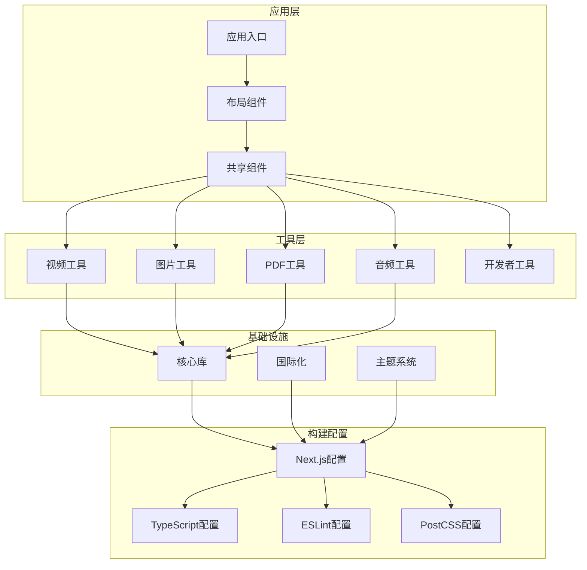
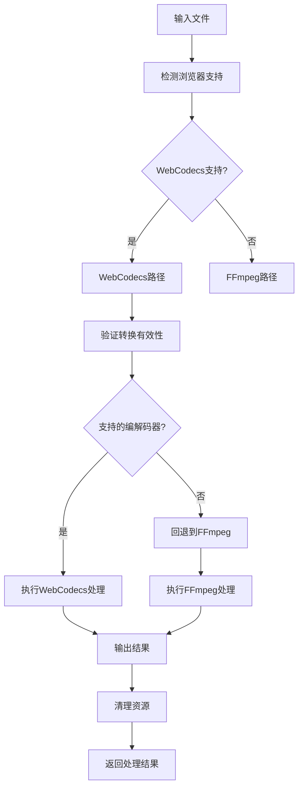
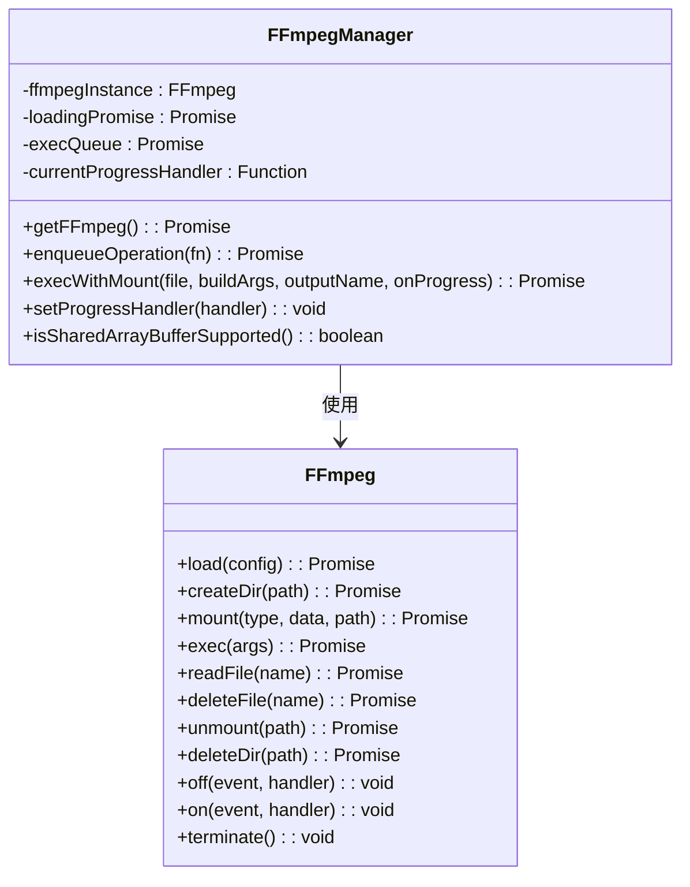
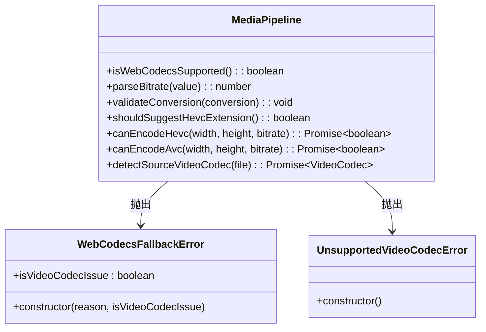
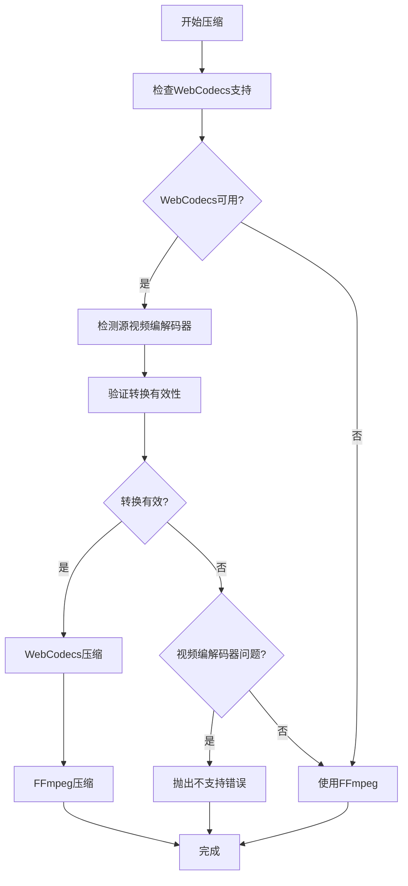
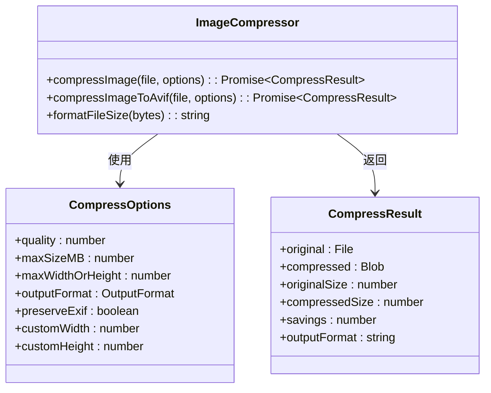
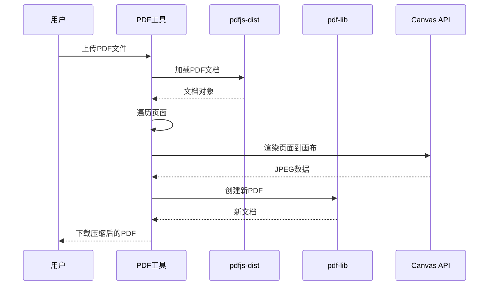
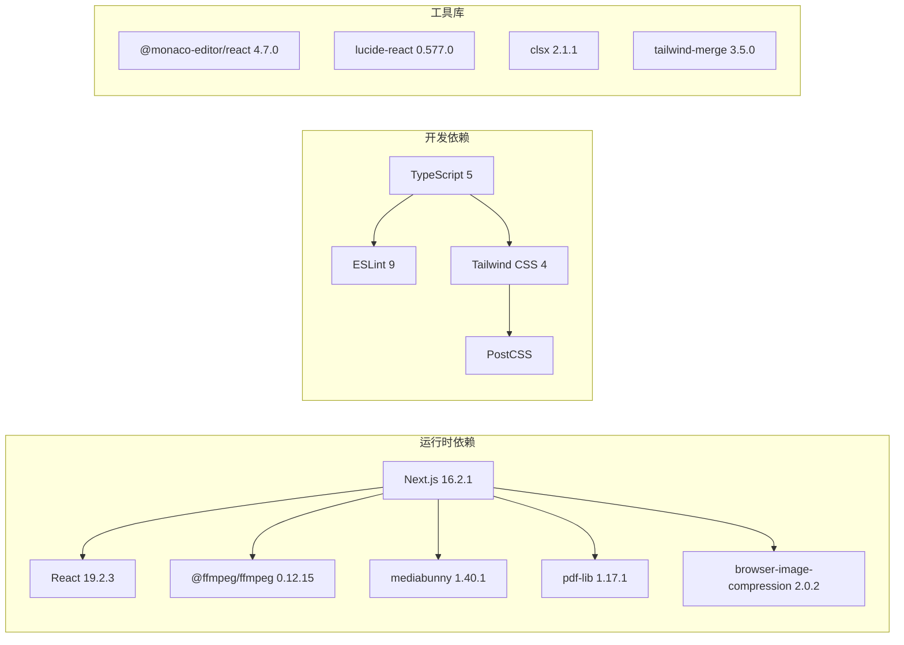
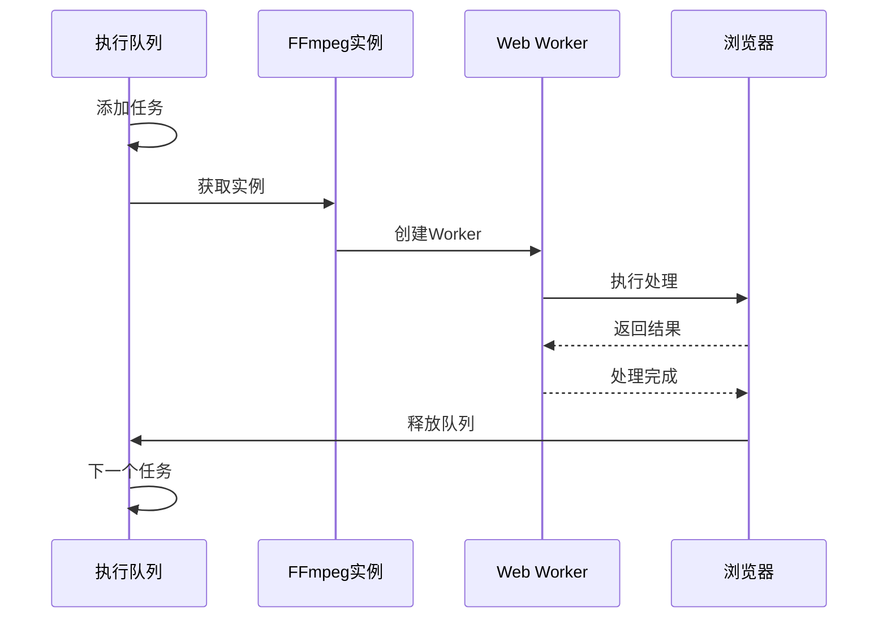

# 依赖现代化

<cite>
**本文档引用的文件**
- [package.json](file://package.json)
- [pnpm-workspace.yaml](file://pnpm-workspace.yaml)
- [next.config.ts](file://next.config.ts)
- [tsconfig.json](file://tsconfig.json)
- [eslint.config.mjs](file://eslint.config.mjs)
- [@ffmpeg__ffmpeg@0.12.15.patch](file://patches/@ffmpeg__ffmpeg@0.12.15.patch)
- [ffmpeg.ts](file://src/lib/ffmpeg.ts)
- [media-pipeline.ts](file://src/lib/media-pipeline.ts)
- [postcss.config.mjs](file://postcss.config.mjs)
- [layout.tsx](file://src/app/layout.tsx)
- [logic.ts（视频压缩）](file://src/tools/video/compress/logic.ts)
- [logic.ts（图片压缩）](file://src/tools/image/compress/logic.ts)
- [logic.ts（PDF压缩）](file://src/tools/pdf/compress/logic.ts)
- [ProcessingProgress.tsx](file://src/components/shared/ProcessingProgress.tsx)
</cite>

## 目录
1. [简介](#简介)
2. [项目结构](#项目结构)
3. [核心组件](#核心组件)
4. [架构概览](#架构概览)
5. [详细组件分析](#详细组件分析)
6. [依赖分析](#依赖分析)
7. [性能考虑](#性能考虑)
8. [故障排除指南](#故障排除指南)
9. [结论](#结论)

## 简介

这是一个基于现代前端技术栈构建的媒体工具箱应用，专注于提供隐私友好的在线媒体处理工具。该项目采用了最新的前端开发技术和依赖管理策略，实现了高效的媒体处理功能，包括视频压缩、图片优化、PDF处理等。

项目的核心特色在于其依赖现代化策略，通过使用最新的Next.js版本、TypeScript配置、以及现代化的媒体处理库，为用户提供高性能的浏览器端媒体处理体验。

## 项目结构

该项目采用模块化的组织方式，主要分为以下几个核心部分：



**图表来源**
- [package.json:1-47](file://package.json#L1-L47)
- [next.config.ts:1-13](file://next.config.ts#L1-L13)
- [tsconfig.json:1-35](file://tsconfig.json#L1-L35)

**章节来源**
- [package.json:1-47](file://package.json#L1-L47)
- [next.config.ts:1-13](file://next.config.ts#L1-L13)
- [tsconfig.json:1-35](file://tsconfig.json#L1-L35)

## 核心组件

### 媒体处理管道

项目实现了双引擎媒体处理架构，结合了WebCodecs硬件加速和FFmpeg.wasm传统方案：



**图表来源**
- [media-pipeline.ts:1-175](file://src/lib/media-pipeline.ts#L1-L175)
- [ffmpeg.ts:1-144](file://src/lib/ffmpeg.ts#L1-L144)

### 处理进度管理系统

项目实现了统一的进度跟踪机制，支持确定性和不确定性进度条：


**图表来源**
- [ProcessingProgress.tsx:1-59](file://src/components/shared/ProcessingProgress.tsx#L1-L59)
- [logic.ts（视频压缩）:87-112](file://src/tools/video/compress/logic.ts#L87-L112)

**章节来源**
- [media-pipeline.ts:1-175](file://src/lib/media-pipeline.ts#L1-L175)
- [ffmpeg.ts:1-144](file://src/lib/ffmpeg.ts#L1-L144)
- [ProcessingProgress.tsx:1-59](file://src/components/shared/ProcessingProgress.tsx#L1-L59)

## 架构概览

项目采用了现代化的全栈架构设计，结合了客户端渲染和静态生成的优势：

```mermaid
graph TB
subgraph "客户端层"
REACT[React 19]
NEXT[Next.js 16.2.1]
I18N[next-intl]
THEME[next-themes]
end
subgraph "媒体处理层"
WEBCODECS[WebCodecs API]
FFMPEG[FFmpeg.wasm]
MEDiABUNNY[Mediabunny]
end
subgraph "工具库层"
IMAGE_COMP[browser-image-compression]
AVIF[@jsquash/avif]
PDF_LIB[pdf-lib]
PDFJS[pdfjs-dist]
end
subgraph "构建工具层"
TYPESCRIPT[TypeScript 5]
TAILWIND[Tailwind CSS 4]
ESLINT[ESLint 9]
POSTCSS[PostCSS]
end
REACT --> NEXT
NEXT --> I18N
NEXT --> THEME
NEXT --> WEBCODECS
NEXT --> FFMPEG
NEXT --> MEDiABUNNY
NEXT --> IMAGE_COMP
NEXT --> AVIF
NEXT --> PDF_LIB
NEXT --> PDFJS
TYPESCRIPT --> TAILWIND
TYPESCRIPT --> ESLINT
TYPESCRIPT --> POSTCSS
```

**图表来源**
- [package.json:11-34](file://package.json#L11-L34)
- [next.config.ts:1-13](file://next.config.ts#L1-L13)
- [tsconfig.json:1-35](file://tsconfig.json#L1-L35)

## 详细组件分析

### FFmpeg集成组件

项目实现了高度优化的FFmpeg集成，支持动态加载和内存管理：



**图表来源**
- [ffmpeg.ts:1-144](file://src/lib/ffmpeg.ts#L1-L144)

### WebCodecs媒体管道

实现了基于WebCodecs的硬件加速媒体处理：



**图表来源**
- [media-pipeline.ts:1-175](file://src/lib/media-pipeline.ts#L1-L175)

### 视频压缩工具

实现了智能的视频压缩算法，自动选择最优处理路径：



**图表来源**
- [logic.ts（视频压缩）:87-112](file://src/tools/video/compress/logic.ts#L87-L112)
- [logic.ts（视频压缩）:114-206](file://src/tools/video/compress/logic.ts#L114-L206)
- [logic.ts（视频压缩）:208-261](file://src/tools/video/compress/logic.ts#L208-L261)

**章节来源**
- [ffmpeg.ts:1-144](file://src/lib/ffmpeg.ts#L1-L144)
- [media-pipeline.ts:1-175](file://src/lib/media-pipeline.ts#L1-L175)
- [logic.ts（视频压缩）:87-112](file://src/tools/video/compress/logic.ts#L87-L112)

### 图片压缩工具

集成了多种图片格式支持和优化算法：



**图表来源**
- [logic.ts（图片压缩）:83-123](file://src/tools/image/compress/logic.ts#L83-L123)

**章节来源**
- [logic.ts（图片压缩）:1-135](file://src/tools/image/compress/logic.ts#L1-L135)

### PDF处理工具

实现了基于pdf-lib和pdfjs的PDF处理功能：



**图表来源**
- [logic.ts（PDF压缩）:12-66](file://src/tools/pdf/compress/logic.ts#L12-L66)

**章节来源**
- [logic.ts（PDF压缩）:1-73](file://src/tools/pdf/compress/logic.ts#L1-L73)

## 依赖分析

### 核心依赖现代化

项目采用了最新的依赖版本，确保了最佳的性能和安全性：



**图表来源**
- [package.json:11-34](file://package.json#L11-L34)
- [package.json:35-45](file://package.json#L35-L45)

### 依赖管理策略

项目采用了pnpm工作区和补丁机制来管理复杂的依赖关系：

```mermaid
flowchart TD
PNPM_WORKSPACE[pnpm-workspace.yaml] --> PATCHES[补丁文件]
PATCHES --> FFMEG_PATCH[@ffmpeg/ffmpeg@0.12.15.patch]
FFMEG_PATCH --> BUILD[构建过程]
BUILD --> WEBPACK[Webpack兼容性]
BUILD --> VITE[Vite兼容性]
BUILD --> MODULE_TYPE[模块类型修复]
WEBPACK --> PRODUCTION[生产环境]
VITE --> DEVELOPMENT[开发环境]
MODULE_TYPE --> BUNDLER[打包器支持]
```

**图表来源**
- [pnpm-workspace.yaml:1-3](file://pnpm-workspace.yaml#L1-L3)
- [@ffmpeg__ffmpeg@0.12.15.patch:1-14](file://patches/@ffmpeg__ffmpeg@0.12.15.patch#L1-L14)

**章节来源**
- [package.json:11-45](file://package.json#L11-L45)
- [pnpm-workspace.yaml:1-3](file://pnpm-workspace.yaml#L1-L3)
- [@ffmpeg__ffmpeg@0.12.15.patch:1-14](file://patches/@ffmpeg__ffmpeg@0.12.15.patch#L1-L14)

## 性能考虑

### 内存优化策略

项目实现了多项内存优化措施，确保在浏览器环境中高效运行：

1. **FFmpeg内存管理**：使用WORKERFS挂载避免内存复制
2. **WebCodecs硬件加速**：利用GPU进行媒体处理
3. **渐进式加载**：按需加载媒体处理库
4. **资源清理**：及时释放Canvas和WebAssembly资源

### 并发控制



**图表来源**
- [ffmpeg.ts:75-82](file://src/lib/ffmpeg.ts#L75-L82)

## 故障排除指南

### 常见问题诊断

1. **FFmpeg加载失败**
   - 检查CDN连接是否正常
   - 验证浏览器对WebAssembly的支持
   - 确认网络代理设置

2. **WebCodecs不支持**
   - 检查浏览器版本和平台支持
   - 验证硬件加速设置
   - 考虑降级到FFmpeg方案

3. **内存不足错误**
   - 减少同时处理的文件数量
   - 优化图像分辨率设置
   - 清理浏览器缓存

**章节来源**
- [ffmpeg.ts:20-28](file://src/lib/ffmpeg.ts#L20-L28)
- [media-pipeline.ts:28-53](file://src/lib/media-pipeline.ts#L28-L53)

## 结论

该项目成功实现了依赖现代化的最佳实践，通过以下关键策略提供了卓越的用户体验：

1. **技术栈现代化**：采用最新版本的Next.js、React、TypeScript等核心技术
2. **性能优化**：结合WebCodecs硬件加速和FFmpeg.wasm传统方案
3. **依赖管理**：使用pnpm工作区和补丁机制解决复杂依赖问题
4. **开发体验**：集成ESLint 9、Tailwind CSS 4等现代化开发工具
5. **隐私保护**：所有处理都在浏览器本地进行，无需服务器上传

这种依赖现代化策略不仅提升了应用的性能和稳定性，还为未来的功能扩展奠定了坚实的基础。项目展示了如何在保持代码质量的同时，充分利用现代前端技术的优势。