# 依赖现代化

<cite>
**本文档引用的文件**
- [package.json](file://package.json)
- [pnpm-workspace.yaml](file://pnpm-workspace.yaml)
- [next.config.ts](file://next.config.ts)
- [tsconfig.json](file://tsconfig.json)
- [eslint.config.mjs](file://eslint.config.mjs)
- [@ffmpeg__ffmpeg@0.12.15.patch](file://patches/@ffmpeg__ffmpeg@0.12.15.patch)
- [ffmpeg.ts](file://src/lib/ffmpeg.ts)
- [media-pipeline.ts](file://src/lib/media-pipeline.ts)
- [postcss.config.mjs](file://postcss.config.mjs)
- [layout.tsx](file://src/app/layout.tsx)
- [logic.ts（视频压缩）](file://src/tools/video/compress/logic.ts)
- [logic.ts（图片压缩）](file://src/tools/image/compress/logic.ts)
- [logic.ts（PDF压缩）](file://src/tools/pdf/compress/logic.ts)
- [ProcessingProgress.tsx](file://src/components/shared/ProcessingProgress.tsx)
- [ExifEditor.tsx](file://src/tools/image/exif-editor/ExifEditor.tsx)
- [types.ts](file://src/tools/image/exif-editor/types.ts)
- [readExif.ts](file://src/tools/image/exif-editor/logic/readExif.ts)
- [writeExif.ts](file://src/tools/image/exif-editor/logic/writeExif.ts)
- [writeJpegExif.ts](file://src/tools/image/exif-editor/logic/writeJpegExif.ts)
- [writePngExif.ts](file://src/tools/image/exif-editor/logic/writePngExif.ts)
- [writeWebpExif.ts](file://src/tools/image/exif-editor/logic/writeWebpExif.ts)
- [exportJson.ts](file://src/tools/image/exif-editor/logic/exportJson.ts)
- [exportCsv.ts](file://src/tools/image/exif-editor/logic/exportCsv.ts)
- [formatters.ts](file://src/tools/image/exif-editor/logic/formatters.ts)
- [piexifjs.d.ts](file://src/types/piexifjs.d.ts)
</cite>

## 更新摘要
**所做更改**
- 新增EXIF编辑器工具章节，详细介绍exifr和piexifjs依赖的应用
- 更新依赖分析章节，包含新增的exifr@^7.1.3和piexifjs@^1.0.6依赖
- 新增EXIF编辑器架构图和组件关系图
- 更新性能考虑章节，添加EXIF处理相关的优化策略

## 目录
1. [简介](#简介)
2. [项目结构](#项目结构)
3. [核心组件](#核心组件)
4. [架构概览](#架构概览)
5. [详细组件分析](#详细组件分析)
6. [EXIF编辑器工具](#exif编辑器工具)
7. [依赖分析](#依赖分析)
8. [性能考虑](#性能考虑)
9. [故障排除指南](#故障排除指南)
10. [结论](#结论)

## 简介

这是一个基于现代前端技术栈构建的媒体工具箱应用，专注于提供隐私友好的在线媒体处理工具。该项目采用了最新的前端开发技术和依赖管理策略，实现了高效的媒体处理功能，包括视频压缩、图片优化、PDF处理等。

项目的核心特色在于其依赖现代化策略，通过使用最新的Next.js版本、TypeScript配置、以及现代化的媒体处理库，为用户提供高性能的浏览器端媒体处理体验。

**更新** 新增EXIF编辑器工具，提供高级EXIF解析和元数据写入功能支持，基于exifr@^7.1.3和piexifjs@^1.0.6依赖实现。

## 项目结构

该项目采用模块化的组织方式，主要分为以下几个核心部分：

```mermaid
graph TB
subgraph "应用层"
APP[应用入口]
LAYOUT[布局组件]
COMPONENTS[共享组件]
END
subgraph "工具层"
VIDEO[视频工具]
IMAGE[图片工具]
AUDIO[音频工具]
PDF[PDF工具]
DEVELOPER[开发者工具]
EXIF[EXIF编辑器工具]
END
subgraph "基础设施"
LIB[核心库]
I18N[国际化]
THEME[主题系统]
END
subgraph "构建配置"
NEXT[Next.js配置]
TS[TypeScript配置]
ESLINT[ESLint配置]
POSTCSS[PostCSS配置]
END
APP --> LAYOUT
LAYOUT --> COMPONENTS
COMPONENTS --> VIDEO
COMPONENTS --> IMAGE
COMPONENTS --> AUDIO
COMPONENTS --> PDF
COMPONENTS --> DEVELOPER
COMPONENTS --> EXIF
VIDEO --> LIB
IMAGE --> LIB
PDF --> LIB
AUDIO --> LIB
EXIF --> LIB
LIB --> NEXT
I18N --> NEXT
THEME --> NEXT
NEXT --> TS
NEXT --> ESLINT
NEXT --> POSTCSS
```

**图表来源**
- [package.json:1-50](file://package.json#L1-L50)
- [next.config.ts:1-13](file://next.config.ts#L1-L13)
- [tsconfig.json:1-35](file://tsconfig.json#L1-L35)

**章节来源**
- [package.json:1-50](file://package.json#L1-L50)
- [next.config.ts:1-13](file://next.config.ts#L1-L13)
- [tsconfig.json:1-35](file://tsconfig.json#L1-L35)

## 核心组件

### 媒体处理管道

项目实现了双引擎媒体处理架构，结合了WebCodecs硬件加速和FFmpeg.wasm传统方案：

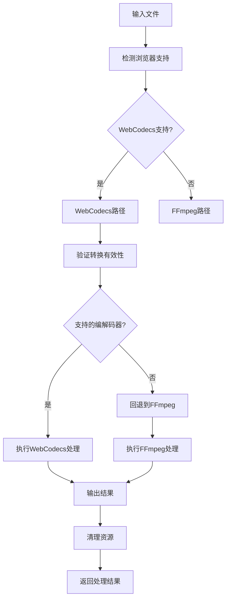

**图表来源**
- [media-pipeline.ts:1-175](file://src/lib/media-pipeline.ts#L1-L175)
- [ffmpeg.ts:1-144](file://src/lib/ffmpeg.ts#L1-L144)

### 处理进度管理系统

项目实现了统一的进度跟踪机制，支持确定性和不确定性进度条：

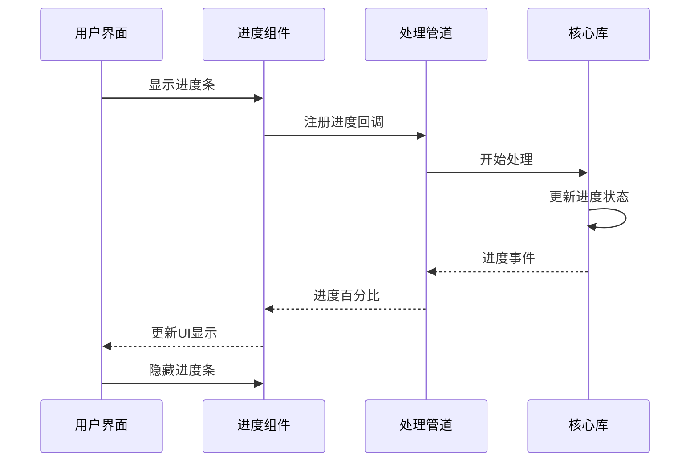

**图表来源**
- [ProcessingProgress.tsx:1-59](file://src/components/shared/ProcessingProgress.tsx#L1-L59)
- [logic.ts（视频压缩）:87-112](file://src/tools/video/compress/logic.ts#L87-L112)

**章节来源**
- [media-pipeline.ts:1-175](file://src/lib/media-pipeline.ts#L1-L175)
- [ffmpeg.ts:1-144](file://src/lib/ffmpeg.ts#L1-L144)
- [ProcessingProgress.tsx:1-59](file://src/components/shared/ProcessingProgress.tsx#L1-L59)

## 架构概览

项目采用了现代化的全栈架构设计，结合了客户端渲染和静态生成的优势：

```mermaid
graph TB
subgraph "客户端层"
REACT[React 19]
NEXT[Next.js 16.2.1]
I18N[next-intl]
THEME[next-themes]
END
subgraph "媒体处理层"
WEBCODECS[WebCodecs API]
FFMPEG[FFmpeg.wasm]
MEDiABUNNY[Mediabunny]
END
subgraph "工具库层"
IMAGE_COMP[browser-image-compression]
AVIF[@jsquash/avif]
PDF_LIB[pdf-lib]
PDFJS[pdfjs-dist]
EXIFR[exifr@^7.1.3]
PIEXIFJS[piexifjs@^1.0.6]
END
subgraph "构建工具层"
TYPESCRIPT[TypeScript 5]
TAILWIND[Tailwind CSS 4]
ESLINT[ESLint 9]
POSTCSS[PostCSS]
END
REACT --> NEXT
NEXT --> I18N
NEXT --> THEME
NEXT --> WEBCODECS
NEXT --> FFMPEG
NEXT --> MEDiABUNNY
NEXT --> IMAGE_COMP
NEXT --> AVIF
NEXT --> PDF_LIB
NEXT --> PDFJS
NEXT --> EXIFR
NEXT --> PIEXIFJS
TYPESCRIPT --> ESLINT
TYPESCRIPT --> TAILWIND
TYPESCRIPT --> POSTCSS
```

**图表来源**
- [package.json:11-34](file://package.json#L11-L34)
- [next.config.ts:1-13](file://next.config.ts#L1-L13)
- [tsconfig.json:1-35](file://tsconfig.json#L1-L35)

## 详细组件分析

### FFmpeg集成组件

项目实现了高度优化的FFmpeg集成，支持动态加载和内存管理：

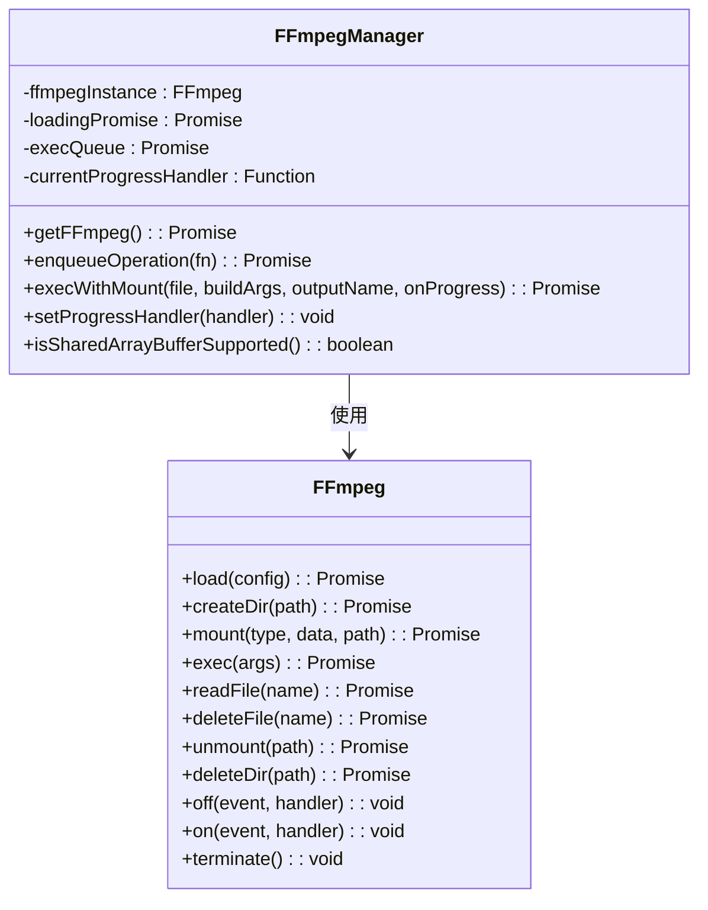

**图表来源**
- [ffmpeg.ts:1-144](file://src/lib/ffmpeg.ts#L1-L144)

### WebCodecs媒体管道

实现了基于WebCodecs的硬件加速媒体处理：

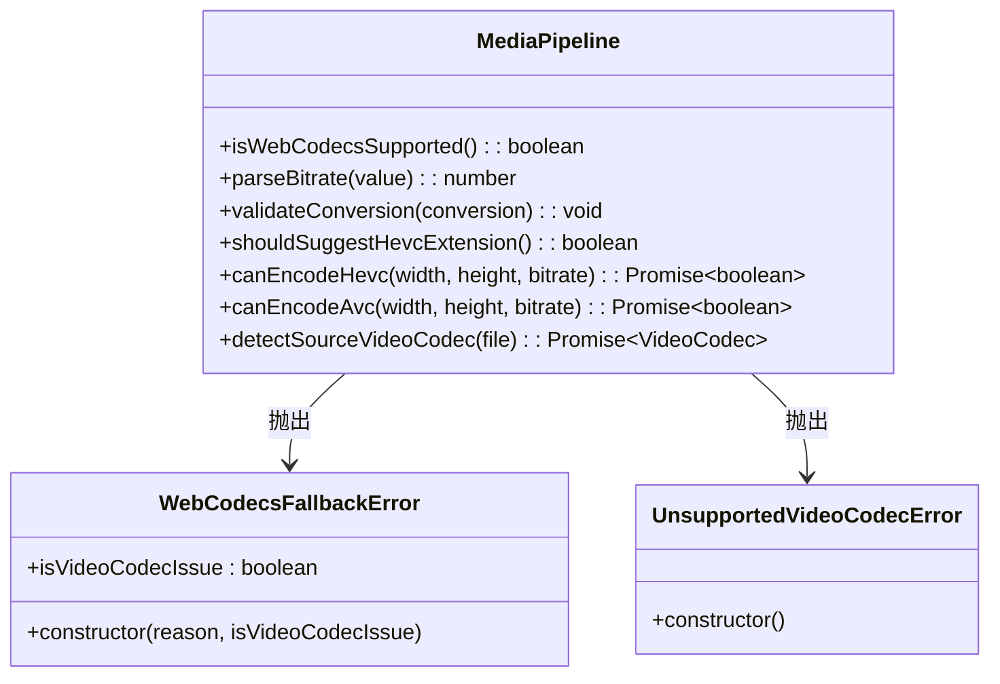

**图表来源**
- [media-pipeline.ts:1-175](file://src/lib/media-pipeline.ts#L1-L175)

### 视频压缩工具

实现了智能的视频压缩算法，自动选择最优处理路径：

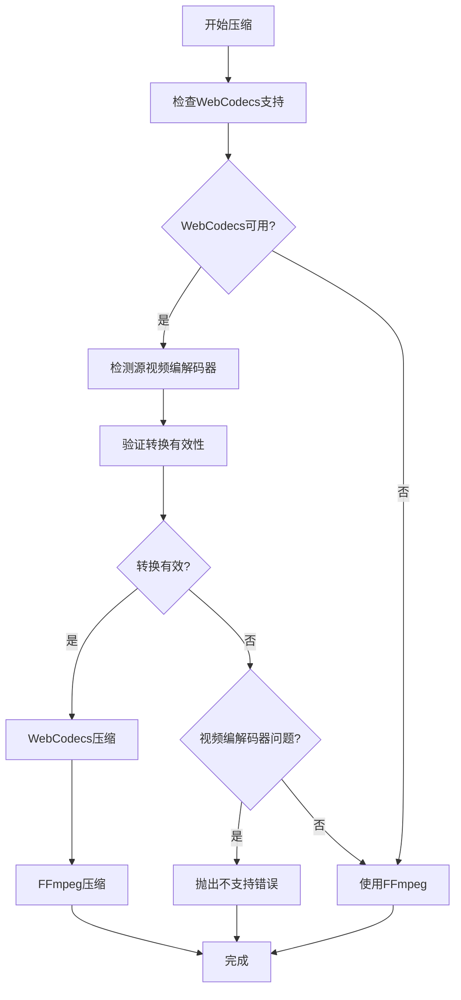

**图表来源**
- [logic.ts（视频压缩）:87-112](file://src/tools/video/compress/logic.ts#L87-L112)
- [logic.ts（视频压缩）:114-206](file://src/tools/video/compress/logic.ts#L114-L206)
- [logic.ts（视频压缩）:208-261](file://src/tools/video/compress/logic.ts#L208-L261)

**章节来源**
- [ffmpeg.ts:1-144](file://src/lib/ffmpeg.ts#L1-L144)
- [media-pipeline.ts:1-175](file://src/lib/media-pipeline.ts#L1-L175)
- [logic.ts（视频压缩）:87-112](file://src/tools/video/compress/logic.ts#L87-L112)

### 图片压缩工具

集成了多种图片格式支持和优化算法：

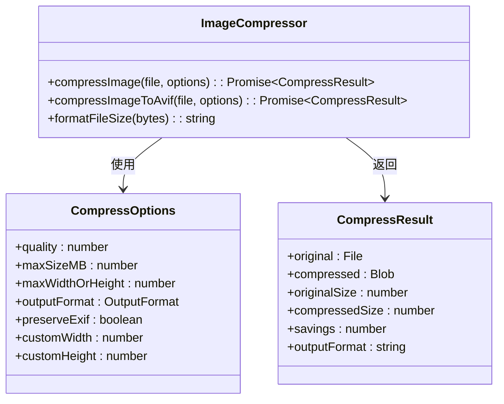

**图表来源**
- [logic.ts（图片压缩）:83-123](file://src/tools/image/compress/logic.ts#L83-L123)

**章节来源**
- [logic.ts（图片压缩）:1-135](file://src/tools/image/compress/logic.ts#L1-L135)

### PDF处理工具

实现了基于pdf-lib和pdfjs的PDF处理功能：

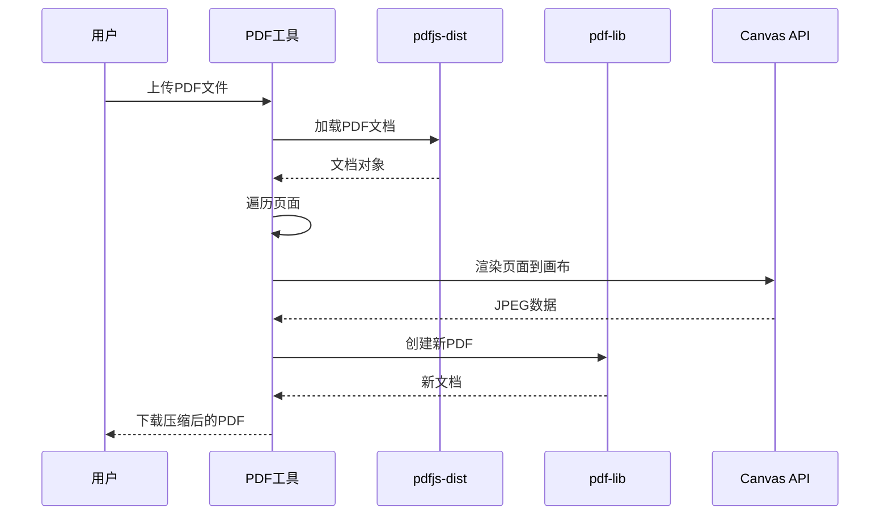

**图表来源**
- [logic.ts（PDF压缩）:12-66](file://src/tools/pdf/compress/logic.ts#L12-L66)

**章节来源**
- [logic.ts（PDF压缩）:1-73](file://src/tools/pdf/compress/logic.ts#L1-L73)

## EXIF编辑器工具

### EXIF编辑器架构

EXIF编辑器工具提供了完整的EXIF元数据读取、编辑和写入功能，基于exifr和piexifjs库实现：

```mermaid
graph TB
subgraph "EXIF编辑器架构"
EXIF_EDITOR[ExifEditor.tsx] --> READ_EXIF[readExif.ts]
EXIF_EDITOR --> WRITE_EXIF[writeExif.ts]
EXIF_EDITOR --> TYPES[types.ts]
READ_EXIF --> EXIFR[exifr@^7.1.3]
WRITE_EXIF --> WRITE_JPEG[writeJpegExif.ts]
WRITE_EXIF --> WRITE_PNG[writePngExif.ts]
WRITE_EXIF --> WRITE_WEBP[writeWebpExif.ts]
WRITE_JPEG --> PIEXIFJS[piexifjs@^1.0.6]
WRITE_PNG --> PIEXIFJS
WRITE_WEBP --> PIEXIFJS
EXIF_EDITOR --> EXPORT_JSON[exportJson.ts]
EXIF_EDITOR --> EXPORT_CSV[exportCsv.ts]
EXIF_EDITOR --> FORMATTERS[formatters.ts]
END
```

**图表来源**
- [ExifEditor.tsx:1-304](file://src/tools/image/exif-editor/ExifEditor.tsx#L1-L304)
- [readExif.ts:1-146](file://src/tools/image/exif-editor/logic/readExif.ts#L1-L146)
- [writeExif.ts:1-44](file://src/tools/image/exif-editor/logic/writeExif.ts#L1-L44)

### EXIF数据流处理

EXIF编辑器实现了完整的数据流处理管道，从文件读取到元数据写入：

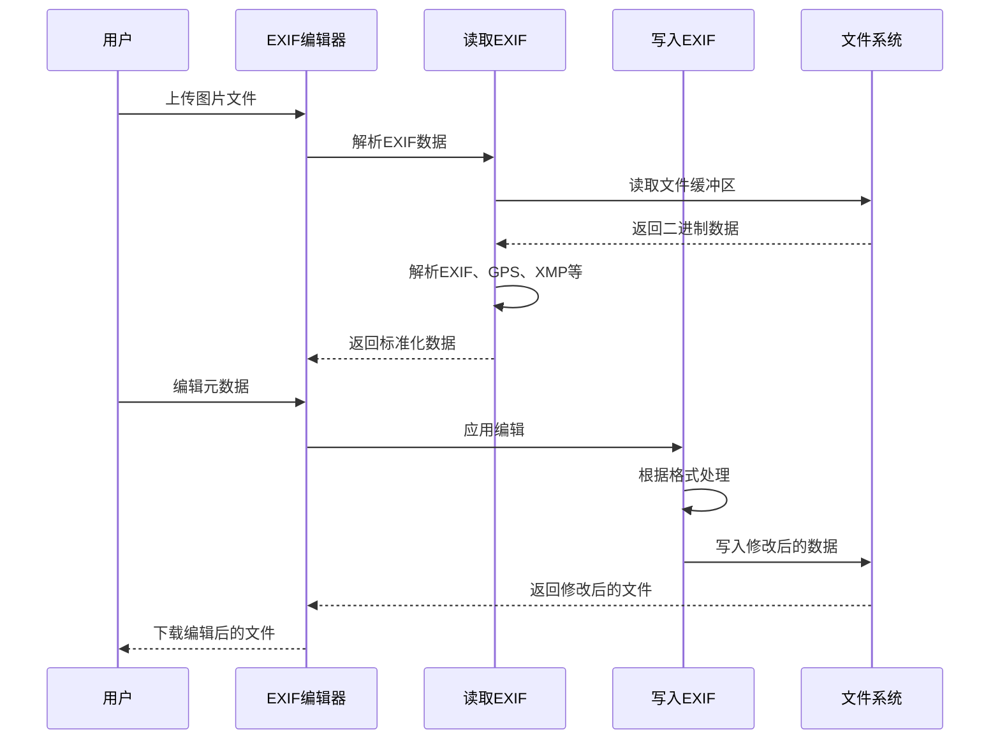

**图表来源**
- [ExifEditor.tsx:55-74](file://src/tools/image/exif-editor/ExifEditor.tsx#L55-L74)
- [writeExif.ts:7-25](file://src/tools/image/exif-editor/logic/writeExif.ts#L7-L25)

### EXIF数据模型

EXIF编辑器使用标准化的数据模型来表示和处理EXIF信息：

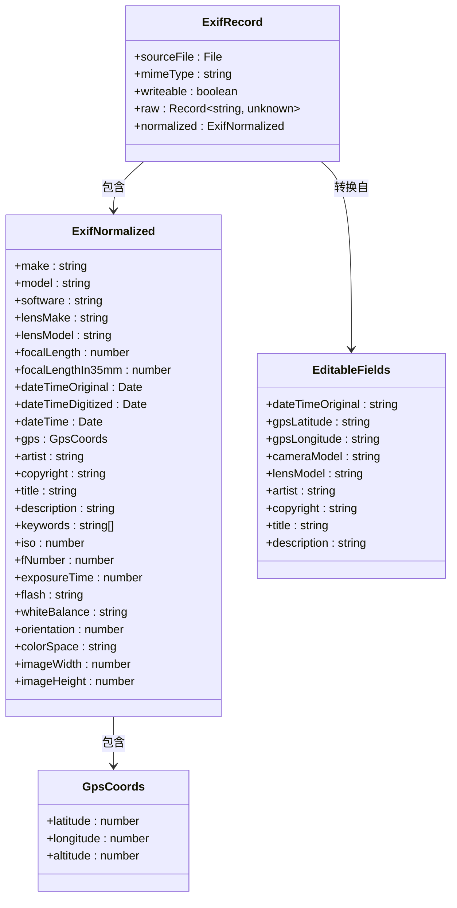

**图表来源**
- [types.ts:7-41](file://src/tools/image/exif-editor/types.ts#L7-L41)
- [types.ts:43-53](file://src/tools/image/exif-editor/types.ts#L43-L53)

### EXIF解析流程

EXIF编辑器使用exifr库进行高级解析，支持多种元数据格式：

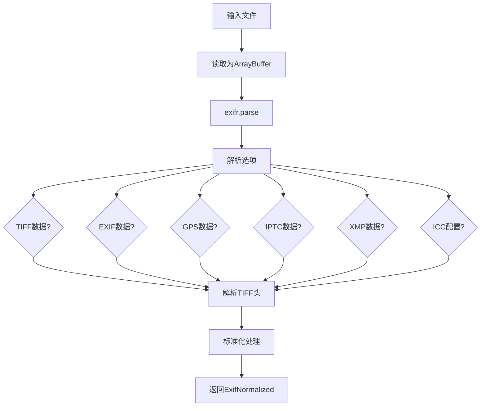

**图表来源**
- [readExif.ts:20-42](file://src/tools/image/exif-editor/logic/readExif.ts#L20-L42)
- [readExif.ts:5-18](file://src/tools/image/exif-editor/logic/readExif.ts#L5-L18)

### 元数据写入机制

EXIF编辑器根据不同的图片格式使用piexifjs库进行精确的元数据写入：

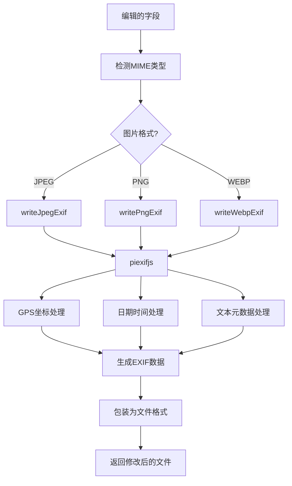

**图表来源**
- [writeExif.ts:15-25](file://src/tools/image/exif-editor/logic/writeExif.ts#L15-L25)
- [writeJpegExif.ts:76-92](file://src/tools/image/exif-editor/logic/writeJpegExif.ts#L76-L92)

**章节来源**
- [ExifEditor.tsx:1-304](file://src/tools/image/exif-editor/ExifEditor.tsx#L1-L304)
- [types.ts:1-111](file://src/tools/image/exif-editor/types.ts#L1-L111)
- [readExif.ts:1-146](file://src/tools/image/exif-editor/logic/readExif.ts#L1-L146)
- [writeExif.ts:1-44](file://src/tools/image/exif-editor/logic/writeExif.ts#L1-L44)
- [writeJpegExif.ts:1-108](file://src/tools/image/exif-editor/logic/writeJpegExif.ts#L1-L108)
- [writePngExif.ts:150-191](file://src/tools/image/exif-editor/logic/writePngExif.ts#L150-L191)
- [writeWebpExif.ts:216-297](file://src/tools/image/exif-editor/logic/writeWebpExif.ts#L216-L297)
- [exportJson.ts:1-51](file://src/tools/image/exif-editor/logic/exportJson.ts#L1-L51)
- [exportCsv.ts:1-62](file://src/tools/image/exif-editor/logic/exportCsv.ts#L1-L62)
- [formatters.ts:1-92](file://src/tools/image/exif-editor/logic/formatters.ts#L1-L92)
- [piexifjs.d.ts:1-51](file://src/types/piexifjs.d.ts#L1-L51)

## 依赖分析

### 核心依赖现代化

项目采用了最新的依赖版本，确保了最佳的性能和安全性：

```mermaid
graph LR
subgraph "运行时依赖"
NEXT[Next.js 16.2.1]
REACT[React 19.2.3]
FFMEG["@ffmpeg/ffmpeg 0.12.15"]
MEDiABUNNY["mediabunny 1.40.1"]
PDF_LIB["pdf-lib 1.17.1"]
IMAGE_COMP["browser-image-compression 2.0.2"]
EXIFR["exifr 7.1.3"]
PIEXIFJS["piexifjs 1.0.6"]
END
subgraph "开发依赖"
TYPESCRIPT[TypeScript 5]
ESLINT[ESLint 9]
TAILWIND[Tailwind CSS 4]
POSTCSS[PostCSS]
END
subgraph "工具库"
MONACO["@monaco-editor/react 4.7.0"]
LUCIDE["lucide-react 0.577.0"]
CLSX["clsx 2.1.1"]
TAILWIND_MERGE["tailwind-merge 3.5.0"]
END
NEXT --> REACT
NEXT --> FFMEG
NEXT --> MEDiABUNNY
NEXT --> PDF_LIB
NEXT --> IMAGE_COMP
NEXT --> EXIFR
NEXT --> PIEXIFJS
TYPESCRIPT --> ESLINT
TYPESCRIPT --> TAILWIND
TAILWIND --> POSTCSS
```

**图表来源**
- [package.json:11-34](file://package.json#L11-L34)
- [package.json:35-45](file://package.json#L35-L45)

### EXIF相关依赖

新增的exifr和piexifjs依赖为EXIF编辑器工具提供了强大的元数据处理能力：

**exifr@^7.1.3** 提供了高级的EXIF解析功能，支持：
- 多种元数据格式解析（EXIF、GPS、IPTC、XMP、ICC）
- 自动数据类型转换和标准化
- 错误容错处理
- 高性能的二进制数据解析

**piexifjs@^1.0.6** 提供了精确的EXIF写入功能，支持：
- JPEG、PNG、WebP格式的EXIF元数据写入
- GPS坐标格式转换（度分秒到十进制度）
- 元数据字段的条件设置和删除
- TIFF格式的EXIF数据封装

### 依赖管理策略

项目采用了pnpm工作区和补丁机制来管理复杂的依赖关系：

```mermaid
flowchart TD
PNPM_WORKSPACE[pnpm-workspace.yaml] --> PATCHES[补丁文件]
PATCHES --> FFMEG_PATCH[@ffmpeg/ffmpeg@0.12.15.patch]
FFMEG_PATCH --> BUILD[构建过程]
BUILD --> WEBPACK[Webpack兼容性]
BUILD --> VITE[Vite兼容性]
BUILD --> MODULE_TYPE[模块类型修复]
WEBPACK --> PRODUCTION[生产环境]
VITE --> DEVELOPMENT[开发环境]
MODULE_TYPE --> BUNDLER[打包器支持]
```

**图表来源**
- [pnpm-workspace.yaml:1-3](file://pnpm-workspace.yaml#L1-L3)
- [@ffmpeg__ffmpeg@0.12.15.patch:1-14](file://patches/@ffmpeg__ffmpeg@0.12.15.patch#L1-L14)

**章节来源**
- [package.json:11-45](file://package.json#L11-L45)
- [pnpm-workspace.yaml:1-3](file://pnpm-workspace.yaml#L1-L3)
- [@ffmpeg__ffmpeg@0.12.15.patch:1-14](file://patches/@ffmpeg__ffmpeg@0.12.15.patch#L1-L14)

## 性能考虑

### 内存优化策略

项目实现了多项内存优化措施，确保在浏览器环境中高效运行：

1. **FFmpeg内存管理**：使用WORKERFS挂载避免内存复制
2. **WebCodecs硬件加速**：利用GPU进行媒体处理
3. **渐进式加载**：按需加载媒体处理库
4. **资源清理**：及时释放Canvas和WebAssembly资源

### EXIF处理优化

**EXIF数据解析优化**：
- 使用ArrayBuffer进行零拷贝解析
- 智能的数据类型推断和转换
- 缓存解析结果减少重复计算
- 异步处理避免阻塞主线程

**EXIF写入优化**：
- 条件性元数据处理，仅修改已编辑的字段
- 格式特定的优化策略
- 内存友好的数据流处理
- 批量操作减少文件系统访问

### 并发控制

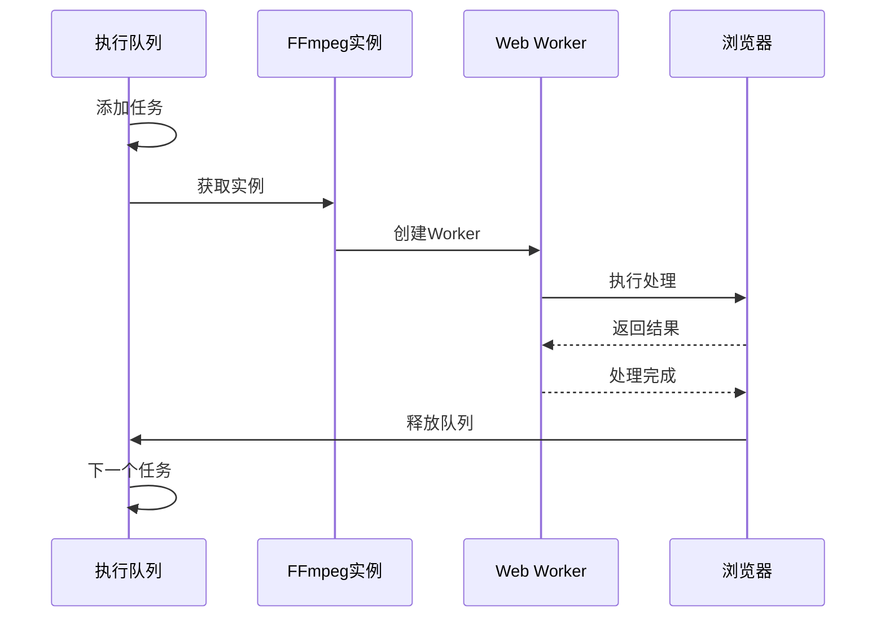

**图表来源**
- [ffmpeg.ts:75-82](file://src/lib/ffmpeg.ts#L75-L82)

## 故障排除指南

### 常见问题诊断

1. **FFmpeg加载失败**
   - 检查CDN连接是否正常
   - 验证浏览器对WebAssembly的支持
   - 确认网络代理设置

2. **WebCodecs不支持**
   - 检查浏览器版本和平台支持
   - 验证硬件加速设置
   - 考虑降级到FFmpeg方案

3. **内存不足错误**
   - 减少同时处理的文件数量
   - 优化图像分辨率设置
   - 清理浏览器缓存

4. **EXIF处理错误**
   - 验证文件格式支持（JPEG、PNG、WebP）
   - 检查文件完整性
   - 确认EXIF数据的有效性
   - 查看浏览器控制台错误信息

**章节来源**
- [ffmpeg.ts:20-28](file://src/lib/ffmpeg.ts#L20-L28)
- [media-pipeline.ts:28-53](file://src/lib/media-pipeline.ts#L28-L53)
- [readExif.ts:23-30](file://src/tools/image/exif-editor/logic/readExif.ts#L23-L30)

## 结论

该项目成功实现了依赖现代化的最佳实践，通过以下关键策略提供了卓越的用户体验：

1. **技术栈现代化**：采用最新版本的Next.js、React、TypeScript等核心技术
2. **性能优化**：结合WebCodecs硬件加速和FFmpeg.wasm传统方案
3. **依赖管理**：使用pnpm工作区和补丁机制解决复杂依赖问题
4. **开发体验**：集成ESLint 9、Tailwind CSS 4等现代化开发工具
5. **隐私保护**：所有处理都在浏览器本地进行，无需服务器上传
6. **功能扩展**：新增EXIF编辑器工具，提供专业的元数据处理能力

**更新** 新增的exifr@^7.1.3和piexifjs@^1.0.6依赖显著增强了应用的功能性，使用户能够进行高级的EXIF元数据编辑和管理，包括相机信息、地理位置、拍摄参数等专业元数据的读取、编辑和写入。

这种依赖现代化策略不仅提升了应用的性能和稳定性，还为未来的功能扩展奠定了坚实的基础。项目展示了如何在保持代码质量的同时，充分利用现代前端技术的优势，为用户提供更加丰富和专业的媒体处理工具。