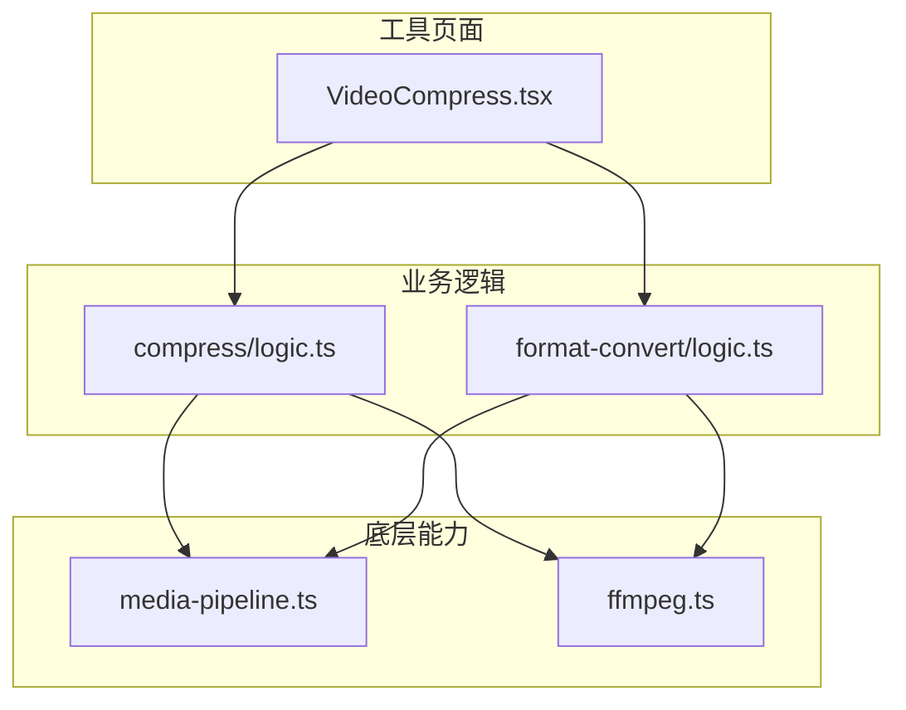
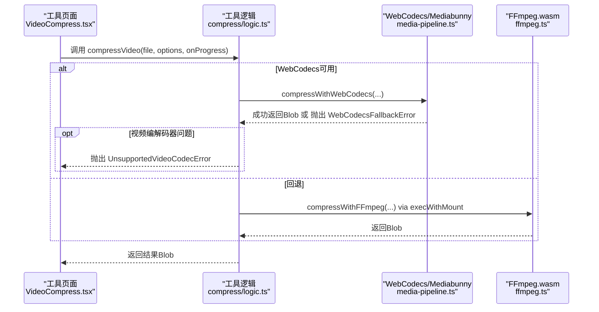
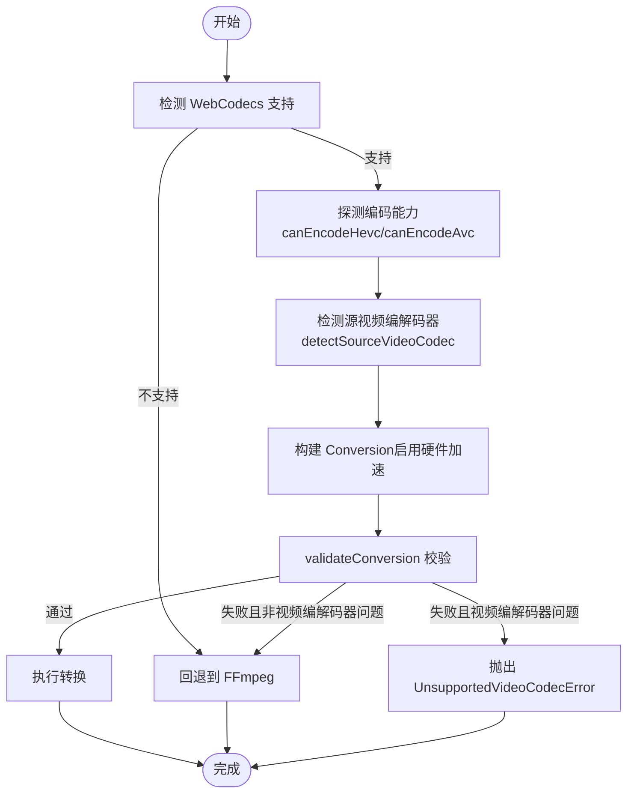
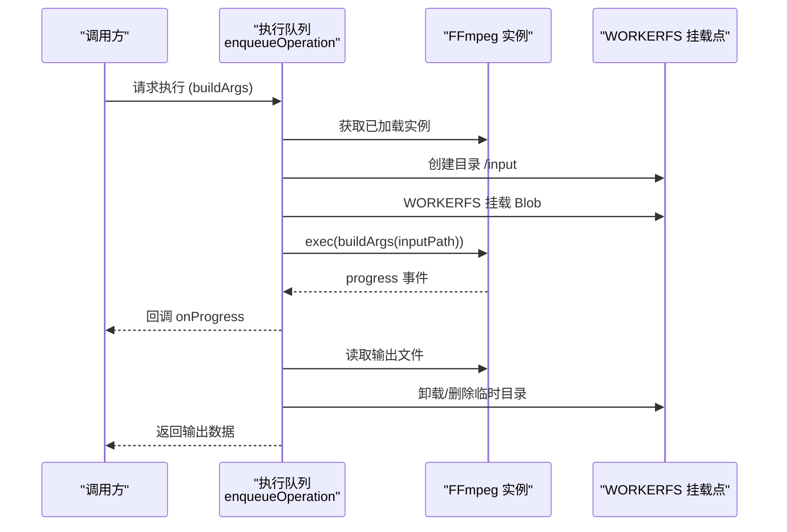
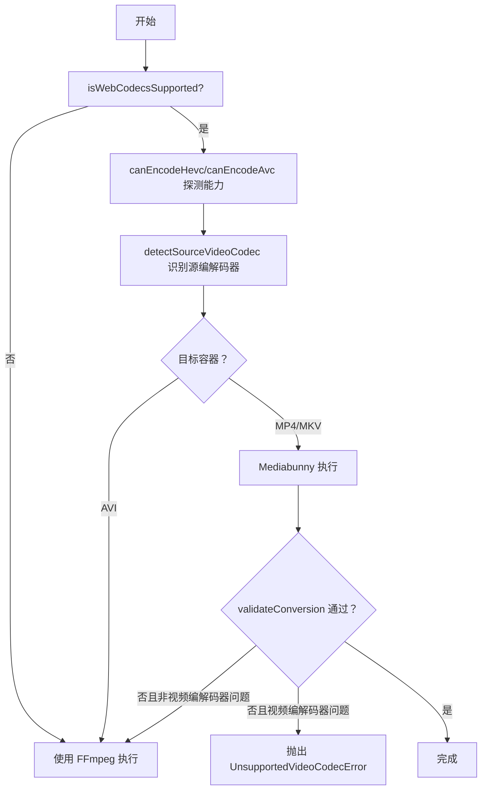
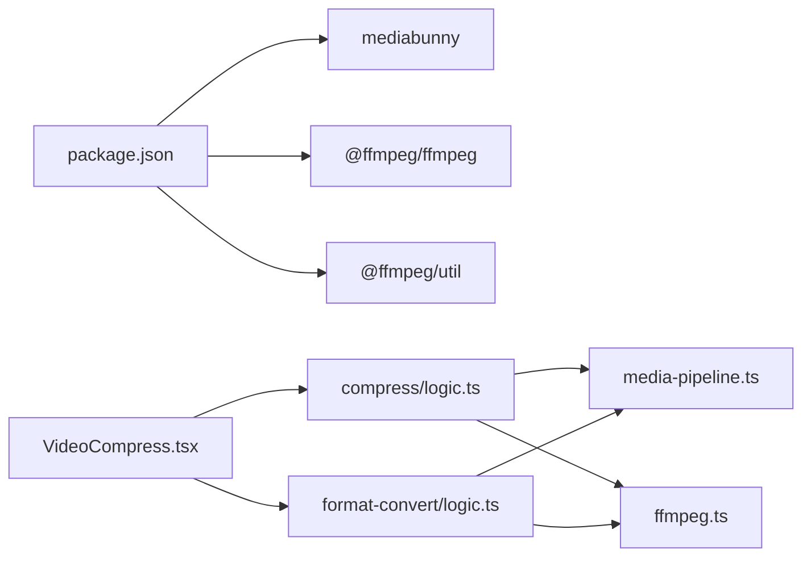

# 双引擎架构

<cite>
**本文引用的文件**
- [media-pipeline.ts](file://src/lib/media-pipeline.ts)
- [ffmpeg.ts](file://src/lib/ffmpeg.ts)
- [logic.ts（压缩）](file://src/tools/video/compress/logic.ts)
- [VideoCompress.tsx](file://src/tools/video/compress/VideoCompress.tsx)
- [logic.ts（格式转换）](file://src/tools/video/format-convert/logic.ts)
- [package.json](file://package.json)
- [@ffmpeg__ffmpeg@0.12.15.patch](file://patches/@ffmpeg__ffmpeg@0.12.15.patch)
</cite>

## 目录
1. [引言](#引言)
2. [项目结构](#项目结构)
3. [核心组件](#核心组件)
4. [架构总览](#架构总览)
5. [详细组件分析](#详细组件分析)
6. [依赖关系分析](#依赖关系分析)
7. [性能考量](#性能考量)
8. [故障排除指南](#故障排除指南)
9. [结论](#结论)
10. [附录](#附录)

## 引言
本技术文档聚焦媒体工具箱的“双引擎架构”，系统阐述WebCodecs与FFmpeg.wasm两种处理引擎的设计理念、协作机制与回退策略。WebCodecs引擎通过Mediabunny提供硬件加速的视频/音频编解码；FFmpeg.wasm引擎基于@ffmpeg/ffmpeg在浏览器中执行命令式转码。文档覆盖引擎选择策略（浏览器兼容性、编解码器支持、性能评估）、回退触发条件（UnsupportedVideoCodecError、WebCodecsFallbackError）、具体切换流程与调试技巧，并给出面向不同媒体格式与浏览器能力的自动选优建议。

## 项目结构
媒体工具箱采用按功能域分层的组织方式：工具页面负责用户交互与状态管理，业务逻辑封装在各工具的logic模块中，底层能力由src/lib目录下的媒体管道与FFmpeg封装提供。

图表来源
- [VideoCompress.tsx:1-200](file://src/tools/video/compress/VideoCompress.tsx#L1-L200)
- [logic.ts（压缩）:1-262](file://src/tools/video/compress/logic.ts#L1-L262)
- [logic.ts（格式转换）:1-152](file://src/tools/video/format-convert/logic.ts#L1-L152)
- [media-pipeline.ts:1-175](file://src/lib/media-pipeline.ts#L1-L175)
- [ffmpeg.ts:1-144](file://src/lib/ffmpeg.ts#L1-L144)

章节来源
- [VideoCompress.tsx:1-200](file://src/tools/video/compress/VideoCompress.tsx#L1-L200)
- [logic.ts（压缩）:1-262](file://src/tools/video/compress/logic.ts#L1-L262)
- [logic.ts（格式转换）:1-152](file://src/tools/video/format-convert/logic.ts#L1-L152)
- [media-pipeline.ts:1-175](file://src/lib/media-pipeline.ts#L1-L175)
- [ffmpeg.ts:1-144](file://src/lib/ffmpeg.ts#L1-L144)

## 核心组件
- WebCodecs/Mediabunny管道
  - 能力检测：isWebCodecsSupported
  - 编解码器能力探测：canEncodeHevc、canEncodeAvc
  - 源视频编解码器检测：detectSourceVideoCodec
  - 转换有效性校验：validateConversion
  - 错误类型：WebCodecsFallbackError、UnsupportedVideoCodecError
  - HEVC扩展提示：shouldSuggestHevcExtension
- FFmpeg.wasm封装
  - 单实例加载与缓存：getFFmpeg
  - 进度事件绑定与解绑：setProgressHandler
  - 串行化队列：enqueueOperation
  - WORKERFS挂载直读：execWithMount
  - SharedArrayBuffer支持检测：isSharedArrayBufferSupported
- 工具逻辑
  - 压缩：compressVideo（优先WebCodecs，失败时回退FFmpeg）
  - 格式转换：convertVideoFormat（MP4/MKV走WebCodecs，AVI走FFmpeg）

章节来源
- [media-pipeline.ts:1-175](file://src/lib/media-pipeline.ts#L1-L175)
- [ffmpeg.ts:1-144](file://src/lib/ffmpeg.ts#L1-L144)
- [logic.ts（压缩）:1-262](file://src/tools/video/compress/logic.ts#L1-L262)
- [logic.ts（格式转换）:1-152](file://src/tools/video/format-convert/logic.ts#L1-L152)

## 架构总览
双引擎架构以“优先WebCodecs、必要时回退FFmpeg”为核心策略。WebCodecs路径通过Mediabunny进行硬件加速编解码；当遇到不支持的编解码器或转换无效时，抛出WebCodecsFallbackError，其中若为视频编解码器问题则直接终止并抛出UnsupportedVideoCodecError，避免低性能回退；否则回退至FFmpeg.wasm执行。

图表来源
- [VideoCompress.tsx:101-134](file://src/tools/video/compress/VideoCompress.tsx#L101-L134)
- [logic.ts（压缩）:87-112](file://src/tools/video/compress/logic.ts#L87-L112)
- [media-pipeline.ts:114-206](file://src/lib/media-pipeline.ts#L114-L206)
- [ffmpeg.ts:99-143](file://src/lib/ffmpeg.ts#L99-L143)

## 详细组件分析

### WebCodecs引擎（Mediabunny）
- 硬件加速特性
  - 使用VideoEncoder/Decoder与AudioEncoder/Decoder进行编解码
  - 在Conversion配置中启用hardwareAcceleration: "prefer-hardware"
  - 通过canEncodeHevc/canEncodeAvc动态探测编码能力
- 编解码器支持与回退
  - detectSourceVideoCodec用于识别源视频是否为H.264/H.265
  - validateConversion对所有轨道（视频+音频）进行编解码器相关丢弃原因检查
  - WebCodecsFallbackError区分“视频编解码器问题”与“其他问题”
  - shouldSuggestHevcExtension针对Windows+Chromium场景提示安装HEVC扩展
- 性能与体验
  - 首次加载后复用实例，减少初始化开销
  - 通过进度回调实时反馈处理进度

图表来源
- [media-pipeline.ts:7-14](file://src/lib/media-pipeline.ts#L7-L14)
- [media-pipeline.ts:110-141](file://src/lib/media-pipeline.ts#L110-L141)
- [media-pipeline.ts:149-174](file://src/lib/media-pipeline.ts#L149-L174)
- [media-pipeline.ts:59-91](file://src/lib/media-pipeline.ts#L59-L91)
- [logic.ts（压缩）:94-112](file://src/tools/video/compress/logic.ts#L94-L112)

章节来源
- [media-pipeline.ts:1-175](file://src/lib/media-pipeline.ts#L1-L175)
- [logic.ts（压缩）:114-206](file://src/tools/video/compress/logic.ts#L114-L206)

### FFmpeg.wasm引擎（@ffmpeg/ffmpeg）
- WebAssembly实现与性能特点
  - 通过toBlobURL加载coreURL与wasmURL，首次加载后缓存实例
  - 使用WORKERFS挂载输入文件，避免内存复制，降低峰值占用
  - 串行化执行队列（promise queue）保证单线程安全
  - 进度事件通过ffmpeg.on("progress")监听并映射到0-100%
- 关键接口
  - getFFmpeg：懒加载与缓存
  - execWithMount：挂载文件、执行命令、读取输出、清理资源
  - enqueueOperation：将任意操作串行化执行
  - isSharedArrayBufferSupported：检测SharedArrayBuffer支持

图表来源
- [ffmpeg.ts:75-82](file://src/lib/ffmpeg.ts#L75-L82)
- [ffmpeg.ts:99-143](file://src/lib/ffmpeg.ts#L99-L143)

章节来源
- [ffmpeg.ts:1-144](file://src/lib/ffmpeg.ts#L1-L144)
- [@ffmpeg__ffmpeg@0.12.15.patch:1-14](file://patches/@ffmpeg__ffmpeg@0.12.15.patch#L1-L14)

### 引擎选择策略与自动选优
- 通用策略
  - 若isWebCodecsSupported为真，优先尝试WebCodecs路径
  - 对于MP4/MKV格式，若WebCodecs可用则走Mediabunny；对于AVI格式直接回退FFmpeg
  - 对于压缩任务，先按质量预设生成选项，再注入目标编码器（默认H.264，若可编码H.265则优先）
- 兼容性与能力检测
  - canEncodeHevc/canEncodeAvc动态探测编码能力
  - detectSourceVideoCodec识别源视频编解码器，辅助默认编码器选择
  - shouldSuggestHevcExtension提示Windows+Chromium用户安装HEVC扩展
- 回退触发条件
  - WebCodecsFallbackError：当转换被判定无效或存在编解码器相关丢弃时
  - UnsupportedVideoCodecError：当视频编解码器问题导致无法继续（避免低性能回退）

图表来源
- [logic.ts（压缩）:87-112](file://src/tools/video/compress/logic.ts#L87-L112)
- [logic.ts（格式转换）:38-63](file://src/tools/video/format-convert/logic.ts#L38-L63)
- [media-pipeline.ts:110-141](file://src/lib/media-pipeline.ts#L110-L141)
- [media-pipeline.ts:149-174](file://src/lib/media-pipeline.ts#L149-L174)
- [media-pipeline.ts:59-91](file://src/lib/media-pipeline.ts#L59-L91)

章节来源
- [logic.ts（压缩）:1-262](file://src/tools/video/compress/logic.ts#L1-L262)
- [logic.ts（格式转换）:1-152](file://src/tools/video/format-convert/logic.ts#L1-L152)
- [media-pipeline.ts:1-175](file://src/lib/media-pipeline.ts#L1-L175)

### 回退机制与错误处理
- WebCodecsFallbackError
  - 当Conversion无效或存在编解码器相关丢弃时抛出
  - 区分“视频编解码器问题”与“其他问题”
- UnsupportedVideoCodecError
  - 当视频编解码器问题导致无法继续时抛出，避免低性能回退
- UI层处理
  - VideoCompress.tsx捕获UnsupportedVideoCodecError并显示相应提示

章节来源
- [media-pipeline.ts:32-53](file://src/lib/media-pipeline.ts#L32-L53)
- [logic.ts（压缩）:98-110](file://src/tools/video/compress/logic.ts#L98-L110)
- [VideoCompress.tsx:123-133](file://src/tools/video/compress/VideoCompress.tsx#L123-L133)

## 依赖关系分析
- 外部依赖
  - mediabunny：WebCodecs/Mediabunny管道与能力探测
  - @ffmpeg/ffmpeg：FFmpeg.wasm核心
  - @ffmpeg/util：toBlobURL加载WASM资源
- 内部依赖
  - 工具逻辑依赖media-pipeline与ffmpeg封装
  - 页面组件依赖工具逻辑与媒体管道能力检测

图表来源
- [package.json:11-32](file://package.json#L11-L32)
- [VideoCompress.tsx:1-28](file://src/tools/video/compress/VideoCompress.tsx#L1-L28)
- [logic.ts（压缩）:1-2](file://src/tools/video/compress/logic.ts#L1-L2)
- [logic.ts（格式转换）:1-2](file://src/tools/video/format-convert/logic.ts#L1-L2)
- [media-pipeline.ts:1-5](file://src/lib/media-pipeline.ts#L1-L5)
- [ffmpeg.ts:1-5](file://src/lib/ffmpeg.ts#L1-L5)

章节来源
- [package.json:1-45](file://package.json#L1-L45)
- [media-pipeline.ts:1-5](file://src/lib/media-pipeline.ts#L1-L5)
- [ffmpeg.ts:1-5](file://src/lib/ffmpeg.ts#L1-L5)

## 性能考量
- WebCodecs路径
  - 启用hardwareAcceleration: "prefer-hardware"，利用GPU硬件加速
  - 通过validateConversion避免无声/黑屏等静默失败
  - detectSourceVideoCodec与canEncodeHevc/canEncodeAvc减少不必要的转换
- FFmpeg路径
  - WORKERFS挂载避免内存复制，降低峰值占用
  - 串行化队列确保并发安全与稳定性
  - 进度事件映射到0-100%，提升用户体验
- 选择策略对性能的影响
  - 优先WebCodecs可显著缩短处理时间与降低CPU占用
  - 对于不支持的编解码器（如H.265/VP9/AV1），直接抛出UnsupportedVideoCodecError避免低效回退

章节来源
- [media-pipeline.ts:177-193](file://src/lib/media-pipeline.ts#L177-L193)
- [ffmpeg.ts:99-143](file://src/lib/ffmpeg.ts#L99-L143)
- [logic.ts（压缩）:94-112](file://src/tools/video/compress/logic.ts#L94-L112)

## 故障排除指南
- 浏览器兼容性
  - 若isWebCodecsSupported为false，自动回退FFmpeg
  - 若isSharedArrayBufferSupported为false，页面提示不支持
- HEVC相关问题
  - shouldSuggestHevcExtension为true时，提示用户安装Windows HEVC扩展
  - canEncodeHevc返回false时，避免尝试H.265编码
- 编解码器问题
  - WebCodecsFallbackError：检查源视频编解码器与目标容器是否匹配
  - UnsupportedVideoCodecError：直接提示不支持该视频编解码器
- FFmpeg加载失败
  - 检查网络连通性与CDN可达性
  - 查看控制台错误日志，确认coreURL/wasmURL加载成功
- 进度异常
  - 确认ffmpeg.on("progress")事件绑定正确
  - 避免重复设置进度处理器，确保原子性清理

章节来源
- [VideoCompress.tsx:93-99](file://src/tools/video/compress/VideoCompress.tsx#L93-L99)
- [media-pipeline.ts:98-104](file://src/lib/media-pipeline.ts#L98-L104)
- [media-pipeline.ts:110-123](file://src/lib/media-pipeline.ts#L110-L123)
- [ffmpeg.ts:19-28](file://src/lib/ffmpeg.ts#L19-L28)
- [ffmpeg.ts:41-58](file://src/lib/ffmpeg.ts#L41-L58)

## 结论
双引擎架构通过WebCodecs/Mediabunny实现硬件加速与流畅体验，同时以严格的回退策略保障兼容性与稳定性。借助能力探测、编解码器识别与错误分类，系统能够在不同浏览器与媒体格式下自动选择最优路径，并在遇到不支持的编解码器时避免低性能回退。FFmpeg.wasm作为可靠的后备方案，在复杂场景中提供强大的转码能力与可控的性能表现。

## 附录
- 关键API与类型
  - WebCodecs能力检测：isWebCodecsSupported
  - 编码能力探测：canEncodeHevc、canEncodeAvc
  - 源编解码器检测：detectSourceVideoCodec
  - 转换校验：validateConversion
  - 错误类型：WebCodecsFallbackError、UnsupportedVideoCodecError
  - FFmpeg封装：getFFmpeg、execWithMount、enqueueOperation、isSharedArrayBufferSupported
- 代码片段路径（仅路径，不含具体代码内容）
  - WebCodecs能力检测：[media-pipeline.ts:7-14](file://src/lib/media-pipeline.ts#L7-L14)
  - 编码能力探测：[media-pipeline.ts:110-141](file://src/lib/media-pipeline.ts#L110-L141)
  - 源编解码器检测：[media-pipeline.ts:149-174](file://src/lib/media-pipeline.ts#L149-L174)
  - 转换校验：[media-pipeline.ts:59-91](file://src/lib/media-pipeline.ts#L59-L91)
  - FFmpeg加载与挂载：[ffmpeg.ts:10-39](file://src/lib/ffmpeg.ts#L10-L39)、[ffmpeg.ts:99-143](file://src/lib/ffmpeg.ts#L99-L143)
  - 压缩流程（WebCodecs/回退）：[logic.ts（压缩）:87-112](file://src/tools/video/compress/logic.ts#L87-L112)
  - 格式转换（容器策略）：[logic.ts（格式转换）:38-63](file://src/tools/video/format-convert/logic.ts#L38-L63)