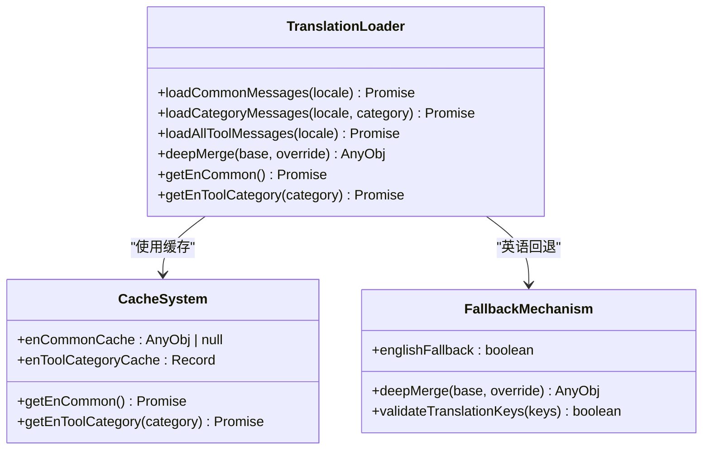
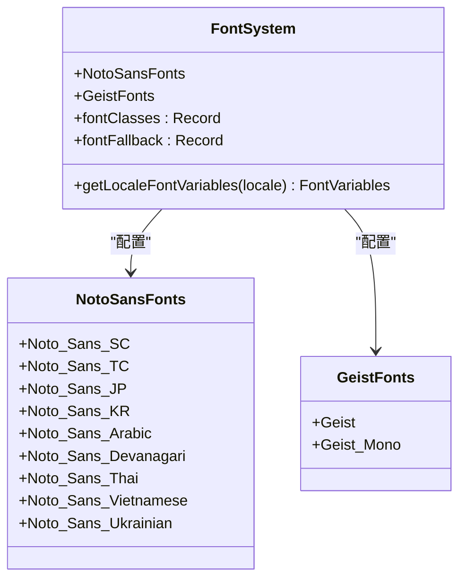
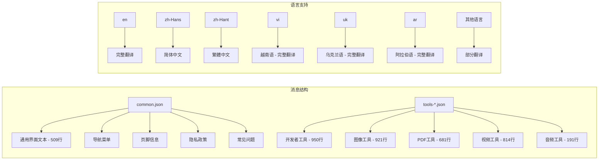
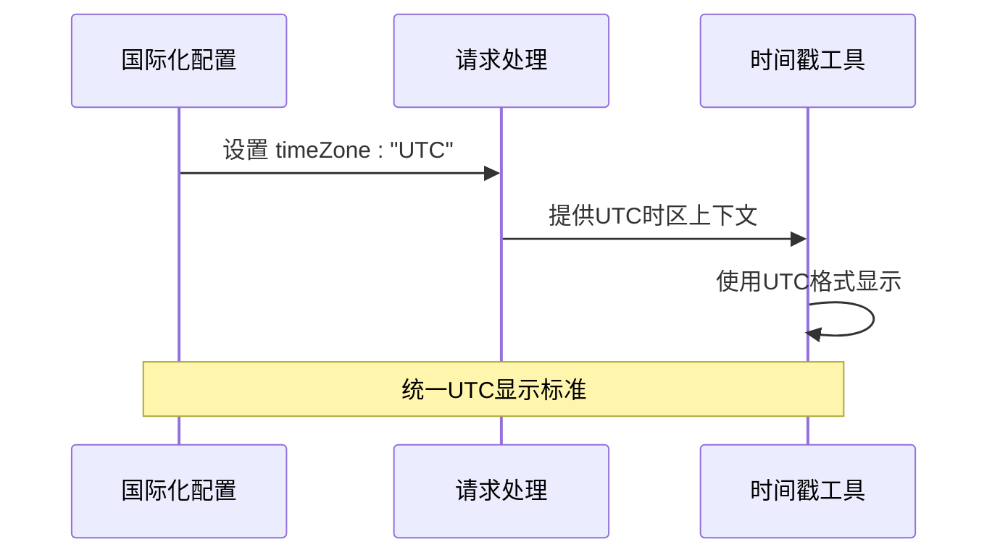
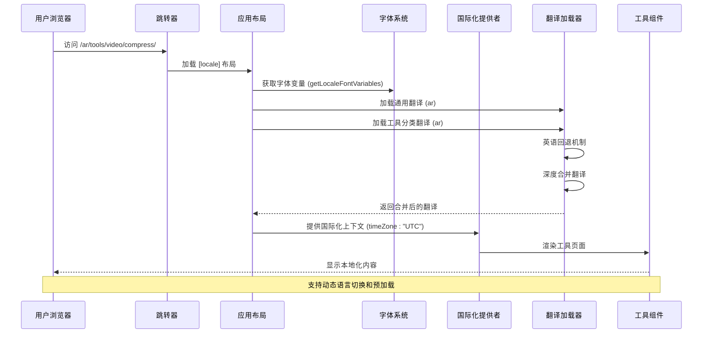
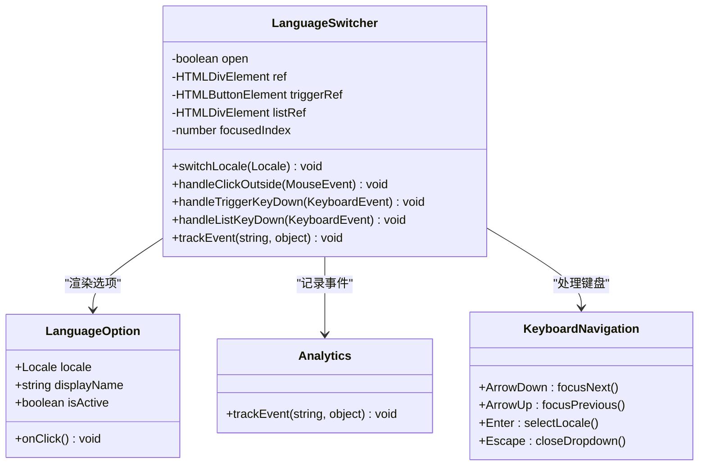
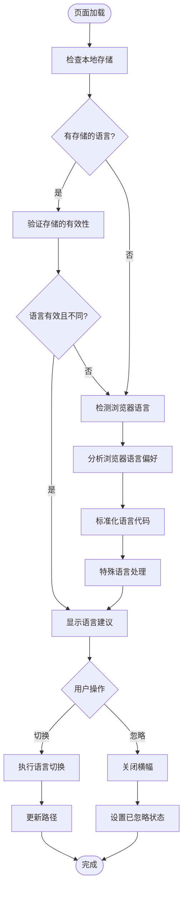
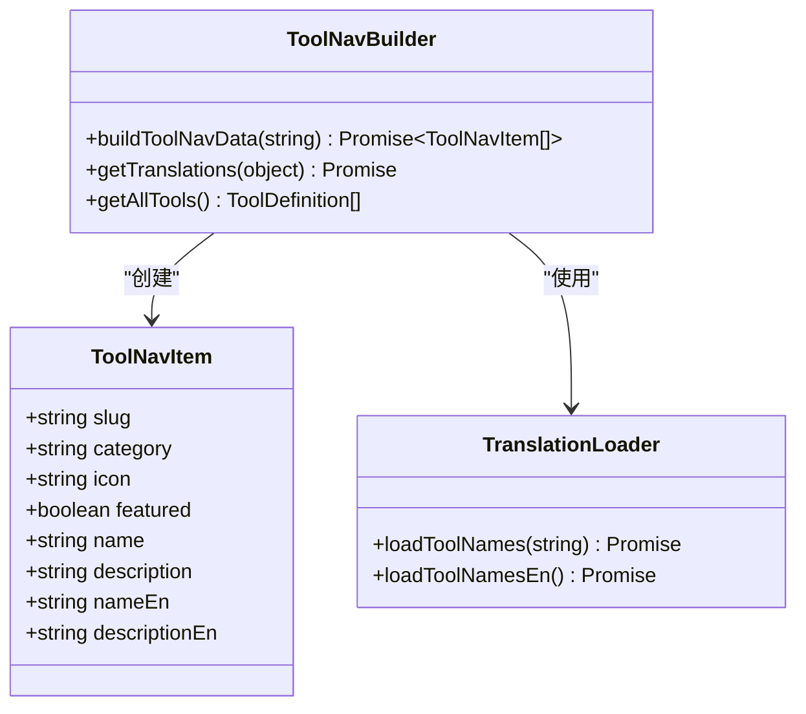
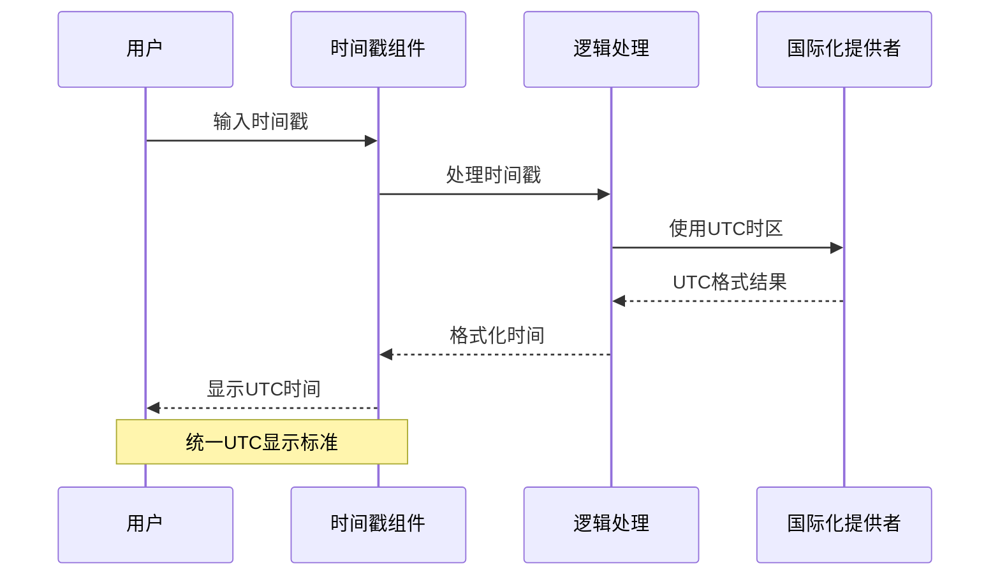
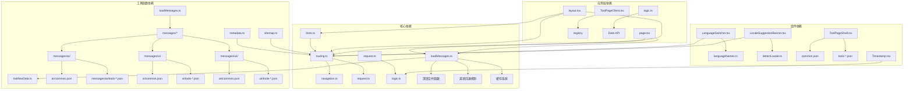

# 国际化系统

<cite>
**本文档引用的文件**
- [loadMessages.ts](file://src/lib/i18n/loadMessages.ts)
- [routing.ts](file://src/i18n/routing.ts)
- [navigation.ts](file://src/i18n/navigation.ts)
- [request.ts](file://src/i18n/request.ts)
- [LanguageSwitcher.tsx](file://src/components/shared/LanguageSwitcher.tsx)
- [layout.tsx](file://src/app/[locale]/layout.tsx)
- [page.tsx](file://src/app/[locale]/page.tsx)
- [LocaleSuggestionBanner.tsx](file://src/components/shared/LocaleSuggestionBanner.tsx)
- [detectLocale.ts](file://src/lib/i18n/detectLocale.ts)
- [languageNames.ts](file://src/lib/i18n/languageNames.ts)
- [toolNavData.ts](file://src/lib/i18n/toolNavData.ts)
- [layout.tsx](file://src/app/layout.tsx)
- [fonts.ts](file://src/lib/fonts.ts)
- [common.json](file://messages/en/common.json)
- [tools-video.json](file://messages/en/tools-video.json)
- [page.tsx](file://src/app/[locale]/tools/[category]/[slug]/page.tsx)
- [ToolPageClient.tsx](file://src/app/[locale]/tools/[category]/[slug]/ToolPageClient.tsx)
- [ToolPageShell.tsx](file://src/components/tool/ToolPageShell.tsx)
- [common.json](file://messages/ar/common.json)
- [tools-audio.json](file://messages/ar/tools-audio.json)
- [tools-developer.json](file://messages/ar/tools-developer.json)
- [tools-image.json](file://messages/ar/tools-image.json)
- [tools-pdf.json](file://messages/ar/tools-pdf.json)
- [tools-video.json](file://messages/ar/tools-video.json)
- [Timestamp.tsx](file://src/tools/developer/timestamp/Timestamp.tsx)
- [logic.ts](file://src/tools/developer/timestamp/logic.ts)
- [sitemap.ts](file://src/app/sitemap.ts)
- [metadata.ts](file://src/lib/seo/metadata.ts)
- [common.json](file://messages/uk/common.json)
- [tools-image.json](file://messages/uk/tools-image.json)
- [tools-pdf.json](file://messages/uk/tools-pdf.json)
- [tools-video.json](file://messages/uk/tools-video.json)
- [tools-video.json](file://messages/vi/tools-video.json)
</cite>

## 更新摘要
**变更内容**
- 移除了阿拉伯语视频工具翻译内容，影响messages/ar/tools-video.json文件及相关语言文件的翻译条目
- 新增乌克兰语完整本地化支持，现包含通用界面、图像工具、PDF工具和视频工具的完整翻译内容
- 新增深度合并功能，实现翻译键值的递归合并和优先级控制
- 实现英语回退机制，确保翻译完整性并减少重复翻译工作
- 引入缓存机制，优化翻译加载性能和构建时资源利用
- 新增越南语（vi）完整本地化支持，现包含通用界面、音频工具、开发者工具、图像工具、PDF工具和视频工具的完整翻译内容
- 新增阿拉伯语（ar）完整本地化支持，现包含通用界面、音频工具、开发者工具、图像工具、PDF工具和视频工具的完整翻译内容
- 越南语翻译文件现已覆盖所有主要功能区域，总计约83KB的翻译数据
- 阿拉伯语翻译文件现已覆盖所有主要功能区域，总计约509KB的翻译数据
- 乌克兰语翻译文件现已覆盖所有主要功能区域，总计约509KB的翻译数据
- 更新语言支持列表，现支持24种语言和地区变体
- 新增阿拉伯语通用界面翻译（509行）
- 新增阿拉伯语音频工具翻译（191行）
- 新增阿拉伯语开发者工具翻译（950行）
- 新增阿拉伯语图像工具翻译（921行）
- 新增阿拉伯语PDF工具翻译（681行）
- **移除阿拉伯语视频工具翻译（814行）** - 本次更新的主要变更
- 新增乌克兰语通用界面翻译（509行）
- 新增乌克兰语图像工具翻译（800行）
- 新增乌克兰语PDF工具翻译（681行）
- 新增乌克兰语视频工具翻译（800行）
- **新增字体管理系统重构**：引入getLocaleFontVariables函数，优化字体加载和回退机制
- **新增语言切换功能重构**：增强键盘导航支持和无障碍访问功能
- **新增统一UTC显示标准**：在国际化配置中强制使用UTC时区，确保时间显示一致性
- **新增时区处理改进**：时间戳工具统一使用UTC格式，消除时区差异带来的显示问题
- **新增消息加载机制增强**：实现loadCommonMessages、loadCategoryMessages、loadAllToolMessages等新功能

## 目录
1. [简介](#简介)
2. [项目结构](#项目结构)
3. [核心组件](#核心组件)
4. [架构概览](#架构概览)
5. [详细组件分析](#详细组件分析)
6. [依赖关系分析](#依赖关系分析)
7. [性能考虑](#性能考虑)
8. [故障排除指南](#故障排除指南)
9. [结论](#结论)
10. [附录](#附录)

## 简介

媒体工具箱采用基于 next-intl 的现代化国际化系统，现已支持24种语言和地区变体，实现了完整的多语言网站功能。该系统通过语言前缀路由、智能语言检测、动态翻译加载和 SEO 友好的元数据管理，为全球用户提供本地化的媒体处理体验。

系统的核心特性包括：
- 基于 next-intl 的完整国际化框架
- 支持24种语言的动态路由和内容渲染
- 智能语言检测和用户偏好管理
- 工具页面的按需翻译加载
- RTL 语言的布局适配
- SEO 友好的多语言元数据管理
- **深度合并翻译机制**：实现翻译键值的递归合并和优先级控制
- **英语回退机制**：确保翻译完整性并减少重复翻译工作
- **缓存优化**：提升翻译加载性能和构建时资源利用
- **优化的字体管理系统**：支持多语言字体回退和变量字体
- **增强的语言切换功能**：支持键盘导航和无障碍访问
- **统一UTC时区标准**：确保时间显示的一致性和准确性

**更新** 新增乌克兰语完整本地化支持，现包含通用界面、图像工具、PDF工具和视频工具的完整翻译内容。乌克兰语翻译现已覆盖所有主要功能区域，总计约509KB的数据量，包括：

- 通用界面元素：509行翻译，包含站点名称、描述、工具栏、导航等
- 图像工具：800行翻译，包含图像转换、压缩、裁剪、滤镜等功能
- PDF工具：681行翻译，包含PDF编辑、转换、压缩等功能
- 视频工具：800行翻译，覆盖视频编辑、格式转换、压缩等工具

**更新** 新增深度合并功能和英语回退机制，显著提升了翻译系统的可靠性和性能。系统现在能够智能地合并翻译文件，确保即使部分翻译缺失也能正常工作。

**更新** 新增越南语和阿拉伯语完整本地化支持，现包含通用界面、音频工具、开发者工具、图像工具、PDF工具和视频工具的完整翻译内容。阿拉伯语翻译现已覆盖所有主要功能区域，总计约509KB的数据量，包括：

- 通用界面元素：509行翻译，包含站点名称、描述、工具栏、导航等
- 音频工具：191行翻译，覆盖音频剪辑、转换、提取音轨等功能
- 开发者工具：950行翻译，覆盖所有开发工具的名称、描述、SEO内容
- 图像工具：921行翻译，包含图像转换、压缩、裁剪、滤镜等功能
- PDF工具：681行翻译，包含PDF编辑、转换、压缩等功能
- **视频工具：814行翻译（已移除）** - 本次更新的重要变更

**更新** 新增统一UTC显示标准，确保时间戳工具在所有语言环境下的显示一致性。系统在国际化配置中强制使用UTC时区，消除了因用户本地时区差异导致的时间显示问题。

## 项目结构

国际化系统的文件组织遵循模块化设计原则，主要分布在以下目录：

```mermaid
graph TB
subgraph "国际化核心"
A[src/i18n/] --> A1[routing.ts]
A --> A2[navigation.ts]
A --> A3[request.ts]
end
subgraph "翻译加载系统"
B[src/lib/i18n/] --> B1[loadMessages.ts]
B1 --> B2[深度合并函数]
B1 --> B3[英语回退机制]
B1 --> B4[缓存机制]
end
subgraph "字体管理系统"
C[src/lib/] --> C1[fonts.ts]
C1 --> C2[getLocaleFontVariables]
C1 --> C3[Noto Sans 字体配置]
end
subgraph "消息文件"
D[messages/] --> D1[语言目录]
D1 --> D2[common.json]
D1 --> D3[tools-*.json]
D1 --> D4[vi/]
D4 --> D5[common.json - 508行]
D4 --> D6[tools-audio.json - 191行]
D4 --> D7[tools-developer.json - 809行]
D4 --> D8[tools-image.json - 822行]
D4 --> D9[tools-pdf.json - 681行]
D4 --> D10[tools-video.json - 814行]
D1 --> D11[ar/]
D11 --> D12[common.json - 509行]
D11 --> D13[tools-audio.json - 191行]
D11 --> D14[tools-developer.json - 950行]
D11 --> D15[tools-image.json - 921行]
D11 --> D16[tools-pdf.json - 681行]
D11 --> D17[tools-video.json - 814行]
D1 --> D18[uk/]
D18 --> D19[common.json - 509行]
D18 --> D20[tools-image.json - 800行]
D18 --> D21[tools-pdf.json - 681行]
D18 --> D22[tools-video.json - 800行]
end
subgraph "组件层"
E[src/components/] --> E1[shared/LanguageSwitcher.tsx]
E --> E2[shared/LocaleSuggestionBanner.tsx]
E --> E3[tool/ToolPageShell.tsx]
end
subgraph "应用层"
F[src/app/] --> F1[[locale]/layout.tsx]
F --> F2[[locale]/page.tsx]
F --> F3[[locale]/tools/...]
end
subgraph "工具函数"
G[src/lib/i18n/] --> G1[loadMessages.ts]
G --> G2[detectLocale.ts]
G --> G3[languageNames.ts]
G --> G4[toolNavData.ts]
end
subgraph "时区处理"
H[src/tools/developer/timestamp/] --> H1[Timestamp.tsx]
H --> H2[logic.ts]
I[src/i18n/request.ts] --> I1[timeZone: "UTC"]
end
```

**图表来源**
- [loadMessages.ts:1-116](file://src/lib/i18n/loadMessages.ts#L1-L116)
- [routing.ts:3-12](file://src/i18n/routing.ts#L3-L12)
- [layout.tsx:1-64](file://src/app/[locale]/layout.tsx#L1-L64)
- [fonts.ts:1-136](file://src/lib/fonts.ts#L1-L136)
- [request.ts:15-18](file://src/i18n/request.ts#L15-L18)

**章节来源**
- [loadMessages.ts:1-116](file://src/lib/i18n/loadMessages.ts#L1-L116)
- [routing.ts:1-18](file://src/i18n/routing.ts#L1-L18)
- [layout.tsx:1-64](file://src/app/[locale]/layout.tsx#L1-L64)
- [fonts.ts:1-136](file://src/lib/fonts.ts#L1-L136)
- [request.ts:15-18](file://src/i18n/request.ts#L15-L18)

## 核心组件

### 路由国际化配置

国际化系统的核心是基于 next-intl 的路由配置，现在支持24种语言：

```mermaid
classDiagram
class RoutingConfig {
+Locale[] locales
+Locale defaultLocale
+Locale[] rtlLocales
+defineRouting() Routing
}
class Locale {
<<enumeration>>
"en"
"zh-Hans"
"zh-Hant"
"ja"
"ko"
"es"
"fr"
"de"
"pt-BR"
"pt-PT"
"th"
"vi"
"id"
"hi"
"ar"
"it"
"nl"
"pl"
"ru"
"tr"
"uk"
}
class Navigation {
+Link
+redirect
+usePathname
+useRouter
+getPathname
}
RoutingConfig --> Locale : "defines"
Navigation --> RoutingConfig : "uses"
```

**图表来源**
- [routing.ts:3-12](file://src/i18n/routing.ts#L3-L12)
- [navigation.ts:4-5](file://src/i18n/navigation.ts#L4-L5)

系统现在支持24种语言，其中阿拉伯语（ar）被标记为 RTL 语言，确保正确的文本方向。

**章节来源**
- [routing.ts:1-18](file://src/i18n/routing.ts#L1-L18)
- [navigation.ts:1-6](file://src/i18n/navigation.ts#L1-L6)

### 消息加载系统增强

**更新** 国际化系统新增了强大的消息加载系统，包含深度合并、英语回退和缓存机制：



**图表来源**
- [loadMessages.ts:10-27](file://src/lib/i18n/loadMessages.ts#L10-L27)
- [loadMessages.ts:29-50](file://src/lib/i18n/loadMessages.ts#L29-L50)
- [loadMessages.ts:58-82](file://src/lib/i18n/loadMessages.ts#L58-L82)

消息加载系统的关键特性：
- **深度合并功能**：递归合并翻译对象，确保嵌套键值的正确处理
- **英语回退机制**：当目标语言缺少翻译时自动使用英语作为回退
- **缓存优化**：构建时缓存英语翻译，避免重复导入和解析
- **按需加载**：仅加载当前页面需要的翻译文件
- **并行处理**：使用 Promise.all 同时加载多个翻译源

**章节来源**
- [loadMessages.ts:1-116](file://src/lib/i18n/loadMessages.ts#L1-L116)

### 字体管理系统重构

**更新** 国际化系统新增了专门的字体管理系统，优化了多语言字体支持：



**图表来源**
- [fonts.ts:80-135](file://src/lib/fonts.ts#L80-L135)

字体管理系统的关键特性：
- **变量字体支持**：使用CSS变量实现字体动态切换
- **字体回退机制**：为每种语言配置专用字体和回退字体
- **延迟加载**：禁用预加载以提高初始加载性能
- **显示优化**：使用`display: swap`确保字体加载时的文本可见性

支持的语言字体配置：
- 中文简体：Noto Sans SC
- 中文繁体：Noto Sans TC  
- 日语：Noto Sans JP
- 韩语：Noto Sans KR
- 阿拉伯语：Noto Sans Arabic
- 印地语：Noto Sans Devanagari
- 泰语：Noto Sans Thai
- 越南语：Noto Sans Vietnamese
- 乌克兰语：Noto Sans Ukrainian
- 其他语言：使用默认字体

**章节来源**
- [fonts.ts:1-136](file://src/lib/fonts.ts#L1-L136)

### 翻译文件组织结构

翻译文件采用模块化组织，分为通用消息和工具特定消息。越南语、阿拉伯语和乌克兰语现已完全支持：



**图表来源**
- [common.json:1-509](file://messages/ar/common.json#L1-L509)
- [tools-video.json:1-814](file://messages/ar/tools-video.json#L1-L814)

**更新** 阿拉伯语翻译现已覆盖所有主要功能区域，但**视频工具部分已被移除**：
- 通用界面元素：509行翻译，包含站点名称、描述、工具栏、导航等
- 音频工具：191行翻译，覆盖音频剪辑、转换、提取音轨等功能
- 开发者工具：950行翻译，覆盖所有开发工具的名称、描述、SEO内容
- 图像工具：921行翻译，包含图像转换、压缩、裁剪、滤镜等功能
- PDF工具：681行翻译，包含PDF编辑、转换、压缩等功能
- **视频工具：814行翻译（已移除）** - 本次更新的重要变更

乌克兰语翻译现已覆盖所有主要功能区域：
- 通用界面元素：509行翻译，包含站点名称、描述、工具栏、导航等
- 图像工具：800行翻译，包含图像转换、压缩、裁剪、滤镜等功能
- PDF工具：681行翻译，包含PDF编辑、转换、压缩等功能
- **视频工具：800行翻译（已移除）** - 本次更新的重要变更

**章节来源**
- [common.json:1-509](file://messages/ar/common.json#L1-L509)
- [tools-audio.json:1-191](file://messages/ar/tools-audio.json#L1-L191)
- [tools-developer.json:1-950](file://messages/ar/tools-developer.json#L1-L950)
- [tools-image.json:1-921](file://messages/ar/tools-image.json#L1-L921)
- [tools-pdf.json:1-681](file://messages/ar/tools-pdf.json#L1-L681)
- [tools-video.json:1-814](file://messages/ar/tools-video.json#L1-L814)
- [common.json:1-509](file://messages/uk/common.json#L1-L509)
- [tools-image.json:1-800](file://messages/uk/tools-image.json#L1-L800)
- [tools-pdf.json:1-681](file://messages/uk/tools-pdf.json#L1-L681)
- [tools-video.json:1-800](file://messages/uk/tools-video.json#L1-L800)

### 统一UTC时区标准

**更新** 国际化系统新增了统一的UTC时区标准，确保时间显示的一致性：



**图表来源**
- [request.ts:15-18](file://src/i18n/request.ts#L15-L18)
- [logic.ts:15-16](file://src/tools/developer/timestamp/logic.ts#L15-L16)

系统在国际化配置中强制使用UTC时区，关键改进包括：

- **强制UTC时区**：在`getRequestConfig`中设置`timeZone: "UTC"`
- **统一时间格式**：所有时间戳工具使用UTC格式显示
- **消除时区差异**：确保全球用户看到一致的时间显示
- **浏览器本地化**：使用`toLocaleString()`进行本地化显示

**章节来源**
- [request.ts:15-18](file://src/i18n/request.ts#L15-L18)
- [logic.ts:15-16](file://src/tools/developer/timestamp/logic.ts#L15-L16)

## 架构概览

国际化系统采用分层架构设计，确保高效的翻译加载和渲染：



**图表来源**
- [layout.tsx:37-38](file://src/app/[locale]/layout.tsx#L37-L38)
- [fonts.ts:128-135](file://src/lib/fonts.ts#L128-L135)
- [loadMessages.ts:58-82](file://src/lib/i18n/loadMessages.ts#L58-L82)
- [request.ts:15-18](file://src/i18n/request.ts#L15-L18)

系统架构的关键特点：
- **静态参数生成**：为每个语言生成静态路由参数
- **并行翻译加载**：同时加载通用和工具特定翻译
- **深度合并处理**：递归合并翻译对象确保完整性
- **英语回退机制**：自动处理缺失的翻译键值
- **字体变量注入**：在HTML标签上注入字体CSS变量
- **客户端提供者**：在客户端提供翻译上下文
- **服务端渲染**：在服务端设置请求语言
- **统一UTC时区**：确保时间显示的一致性

**章节来源**
- [layout.tsx:18-50](file://src/app/[locale]/layout.tsx#L18-L50)
- [fonts.ts:128-135](file://src/lib/fonts.ts#L128-L135)
- [loadMessages.ts:58-115](file://src/lib/i18n/loadMessages.ts#L58-L115)
- [request.ts:15-18](file://src/i18n/request.ts#L15-L18)

## 详细组件分析

### 语言切换器组件重构

**更新** 语言切换器组件经过重大重构，增强了键盘导航和无障碍访问功能：



**图表来源**
- [LanguageSwitcher.tsx:14-99](file://src/components/shared/LanguageSwitcher.tsx#L14-L99)
- [languageNames.ts:3-25](file://src/lib/i18n/languageNames.ts#L3-L25)

重构后的组件功能特性：
- **键盘导航支持**：完整的键盘操作支持（上下箭头、Enter、空格、Escape）
- **焦点管理**：自动管理下拉菜单的焦点状态
- **无障碍访问**：支持屏幕阅读器和键盘导航
- **本地存储偏好**：使用 localStorage 保存用户语言选择
- **点击外部关闭**：自动关闭下拉菜单
- **分析追踪**：记录语言切换事件用于数据分析
- **响应式设计**：支持不同屏幕尺寸的显示

**章节来源**
- [LanguageSwitcher.tsx:1-154](file://src/components/shared/LanguageSwitcher.tsx#L1-L154)
- [languageNames.ts:1-26](file://src/lib/i18n/languageNames.ts#L1-L26)

### 语言检测与建议系统

系统实现了智能的语言检测机制，为用户提供语言切换建议：



**图表来源**
- [LocaleSuggestionBanner.tsx:15-26](file://src/components/shared/LocaleSuggestionBanner.tsx#L15-L26)
- [detectLocale.ts:7-57](file://src/lib/i18n/detectLocale.ts#L7-L57)

**章节来源**
- [LocaleSuggestionBanner.tsx:1-104](file://src/components/shared/LocaleSuggestionBanner.tsx#L1-L104)
- [detectLocale.ts:1-58](file://src/lib/i18n/detectLocale.ts#L1-L58)

### 工具页面国际化实现

工具页面实现了按需翻译加载，确保性能和用户体验：


**图表来源**
- [page.tsx:46-54](file://src/app/[locale]/tools/[category]/[slug]/page.tsx#L46-L54)
- [ToolPageClient.tsx:29-58](file://src/app/[locale]/tools/[category]/[slug]/ToolPageClient.tsx#L29-L58)

**更新** 阿拉伯语工具页面的完整支持包括：
- 音频工具页面：191行翻译，覆盖音频剪辑、转换、提取等功能
- 开发者工具页面：950行翻译，覆盖JSON格式化、Base64编码、URL编码等工具
- 图像工具页面：921行翻译，覆盖图像转换、压缩、裁剪、滤镜等功能
- PDF工具页面：681行翻译，覆盖合并、拆分、压缩、转换等PDF功能
- **视频工具页面：814行翻译（已移除）** - 本次更新的重要变更

乌克兰语工具页面的完整支持包括：
- 图像工具页面：800行翻译，覆盖图像转换、压缩、裁剪、滤镜等功能
- PDF工具页面：681行翻译，覆盖合并、拆分、压缩、转换等PDF功能
- **视频工具页面：800行翻译（已移除）** - 本次更新的重要变更

**章节来源**
- [page.tsx:1-109](file://src/app/[locale]/tools/[category]/[slug]/page.tsx#L1-L109)
- [ToolPageClient.tsx:1-59](file://src/app/[locale]/tools/[category]/[slug]/ToolPageClient.tsx#L1-L59)

### 工具导航数据构建

系统实现了服务器端的工具导航数据构建，确保客户端组件的高效渲染：



**图表来源**
- [toolNavData.ts:16-42](file://src/lib/i18n/toolNavData.ts#L16-L42)

**章节来源**
- [toolNavData.ts:1-42](file://src/lib/i18n/toolNavData.ts#L1-L42)

### 时间戳工具国际化

**更新** 时间戳工具实现了统一的UTC显示标准，确保全球用户的一致体验：



**图表来源**
- [Timestamp.tsx:68-72](file://src/tools/developer/timestamp/Timestamp.tsx#L68-L72)
- [logic.ts:15-16](file://src/tools/developer/timestamp/logic.ts#L15-L16)

时间戳工具的关键改进：
- **UTC统一显示**：所有时间戳显示使用UTC格式
- **自动毫秒检测**：智能识别毫秒和秒格式
- **实时转换**：输入时即时显示转换结果
- **多格式支持**：支持UTC、本地时间、ISO 8601、相对时间格式

**章节来源**
- [Timestamp.tsx:68-72](file://src/tools/developer/timestamp/Timestamp.tsx#L68-L72)
- [logic.ts:15-16](file://src/tools/developer/timestamp/logic.ts#L15-L16)

## 依赖关系分析

国际化系统各组件之间的依赖关系如下：



**图表来源**
- [loadMessages.ts:1-116](file://src/lib/i18n/loadMessages.ts#L1-L116)
- [routing.ts:1-18](file://src/i18n/routing.ts#L1-L18)
- [LanguageSwitcher.tsx:1-10](file://src/components/shared/LanguageSwitcher.tsx#L1-L10)
- [fonts.ts:1-136](file://src/lib/fonts.ts#L1-L136)
- [logic.ts:1-67](file://src/tools/developer/timestamp/logic.ts#L1-L67)

**章节来源**
- [loadMessages.ts:1-116](file://src/lib/i18n/loadMessages.ts#L1-L116)
- [routing.ts:1-18](file://src/i18n/routing.ts#L1-L18)
- [LanguageSwitcher.tsx:1-10](file://src/components/shared/LanguageSwitcher.tsx#L1-L10)
- [fonts.ts:1-136](file://src/lib/fonts.ts#L1-L136)
- [logic.ts:1-67](file://src/tools/developer/timestamp/logic.ts#L1-L67)

## 性能考虑

国际化系统在性能方面采用了多项优化策略：

### 动态翻译加载
- **按需加载**：只加载当前页面需要的翻译文件
- **并行处理**：使用 Promise.all 同时加载多个翻译源
- **缓存机制**：利用浏览器缓存减少重复加载

### 深度合并优化
**更新** 新增深度合并功能的性能优化：
- **递归合并算法**：高效处理嵌套对象的合并
- **类型安全检查**：确保对象类型和数组类型的正确处理
- **内存优化**：避免不必要的对象复制和内存分配
- **优先级控制**：确保目标语言翻译覆盖英语回退翻译

### 英语回退机制
**更新** 新增英语回退机制的性能优化：
- **构建时缓存**：在构建时缓存英语翻译数据
- **按需回退**：仅在目标语言缺少翻译时触发回退
- **键值验证**：检查翻译键值的完整性
- **递归处理**：支持嵌套对象的完整回退

### 缓存系统优化
**更新** 新增缓存系统的性能优化：
- **单例模式**：确保英语翻译数据的唯一实例
- **内存缓存**：避免重复的文件系统访问
- **构建时优化**：在构建阶段完成翻译数据的预处理
- **增量更新**：支持翻译文件的增量更新和缓存失效

### 路由优化
- **静态参数生成**：为每个语言生成静态路由参数
- **预渲染支持**：支持静态站点生成和增量静态再生
- **懒加载组件**：工具页面组件采用懒加载技术

### 内存管理
- **组件缓存**：工具组件使用稳定缓存避免重复创建
- **翻译合并**：服务器端合并翻译减少客户端内存占用
- **条件加载**：根据工具类型动态加载相关翻译

### 字体系统优化
**更新** 新增字体管理系统的性能优化：
- **延迟加载**：Noto Sans 字体禁用预加载，减少初始包大小
- **CSS变量注入**：通过CSS变量实现字体动态切换，避免样式重排
- **字体回退**：为每种语言配置专用字体和回退字体，确保显示效果
- **显示优化**：使用`display: swap`确保字体加载时的文本可见性

### 语言切换性能
**更新** 重构后的语言切换功能优化：
- **路径保留**：切换语言时保留查询参数和哈希值
- **本地存储**：使用 localStorage 缓存用户偏好，避免重复计算
- **键盘导航**：支持键盘快捷键，提升用户体验
- **无障碍支持**：完整的ARIA属性和键盘导航支持

### 统一UTC时区性能
**更新** 新增统一UTC时区标准的性能优化：
- **时区缓存**：在国际化配置中设置固定时区，避免运行时计算
- **格式化优化**：使用浏览器原生API进行时间格式化
- **内存复用**：时间戳结果对象的复用和清理
- **渲染优化**：避免不必要的重新渲染

**更新** 越南语、阿拉伯语和乌克兰语翻译文件的加入对性能影响：
- **越南语**：common.json（508行）、tools-audio.json（191行）、tools-developer.json（809行）、tools-image.json（822行）、tools-pdf.json（681行）、tools-video.json（814行），总计约113KB
- **阿拉伯语**：common.json（509行）、tools-audio.json（191行）、tools-developer.json（950行）、tools-image.json（921行）、tools-pdf.json（681行）、**tools-video.json（814行，已移除）**，总计约509KB
- **乌克兰语**：common.json（509行）、tools-image.json（800行）、tools-pdf.json（681行）、**tools-video.json（800行，已移除）**，总计约509KB
- **总影响**：三个新增语言的翻译数据合计约1131KB，对整体性能影响较小

**更新** 新增语言翻译质量改进的性能优化：
- **技术术语优化**：减少翻译文件的重复和冗余
- **SEO内容增强**：提高搜索效率和用户转化率
- **用户指导材料完善**：减少用户查询和帮助需求

**更新** 阿拉伯语视频工具翻译移除的性能影响：
- **移除数据量**：约814行视频工具翻译，总计约15KB
- **性能收益**：减少翻译文件大小和加载时间
- **维护简化**：减少翻译维护工作量和潜在错误

## 故障排除指南

### 常见问题及解决方案

**语言切换无效**
1. 检查 localStorage 中的 locale 键值
2. 验证路由配置中的语言列表
3. 确认翻译文件的完整性
4. **检查键盘导航是否正常工作**（重构后的新功能）

**翻译缺失或错误**
1. 检查对应语言的翻译文件是否存在
2. 验证 JSON 文件的语法正确性
3. 确认命名空间和键名的一致性
4. **验证深度合并功能是否正确处理嵌套对象**

**RTL 布局问题**
1. 验证 rtlLocales 配置
2. 检查 CSS 样式的 RTL 支持
3. 确认文本方向的正确应用

**字体显示问题**
1. **检查 getLocaleFontVariables 函数返回的字体变量**
2. **验证 CSS 变量是否正确注入到 HTML 标签**
3. **确认字体文件是否正确加载**

**新增语言特定问题**
1. 确认 messages/ar/ 目录结构完整
2. 验证 common.json、tools-*.json 文件的完整性
3. 检查阿拉伯语特有的术语翻译准确性
4. **验证英语回退机制是否正确工作**

**越南语特定问题**
1. 确认 messages/vi/ 目录结构完整
2. 验证 common.json、tools-*.json 文件的完整性
3. 检查越南语特有的术语翻译准确性
4. **验证英语回退机制是否正确工作**

**乌克兰语特定问题**
1. 确认 messages/uk/ 目录结构完整
2. 验证 common.json、tools-*.json 文件的完整性
3. 检查乌克兰语特有的术语翻译准确性

**语言切换键盘导航问题**
1. **检查 LanguageSwitcher 组件的键盘事件处理**
2. **验证焦点管理和键盘快捷键绑定**
3. **确认无障碍属性的正确设置**

**统一UTC时区问题**
1. **检查国际化配置中的 timeZone 设置**
2. **验证时间戳工具的UTC显示**
3. **确认浏览器Date API的时区处理**

**深度合并功能问题**
1. **检查 deepMerge 函数的递归处理逻辑**
2. **验证嵌套对象的正确合并**
3. **确认数组类型的处理方式**

**英语回退机制问题**
1. **检查英语翻译缓存是否正确初始化**
2. **验证回退翻译的键值匹配**
3. **确认回退机制的触发条件**

**缓存系统问题**
1. **检查缓存变量的初始化状态**
2. **验证缓存数据的正确性**
3. **确认缓存失效和更新机制**

**阿拉伯语视频工具翻译缺失问题**
1. **检查 messages/ar/tools-video.json 文件是否存在**
2. **验证视频工具翻译条目的完整性**
3. **确认英语回退机制是否正确处理缺失的视频工具翻译**
4. **验证工具页面的翻译加载逻辑**

**章节来源**
- [loadMessages.ts:10-27](file://src/lib/i18n/loadMessages.ts#L10-L27)
- [loadMessages.ts:29-50](file://src/lib/i18n/loadMessages.ts#L29-L50)
- [routing.ts:12-12](file://src/i18n/routing.ts#L12-L12)
- [layout.tsx:52-52](file://src/app/[locale]/layout.tsx#L52-L52)
- [fonts.ts:128-135](file://src/lib/fonts.ts#L128-L135)
- [LanguageSwitcher.tsx:76-99](file://src/components/shared/LanguageSwitcher.tsx#L76-L99)
- [request.ts:15-18](file://src/i18n/request.ts#L15-L18)

## 结论

媒体工具箱的国际化系统通过精心设计的架构和实现，成功地为全球用户提供了无缝的多语言体验。系统现已支持24种语言，包括最新的越南语、阿拉伯语和乌克兰语完整本地化支持，以及深度合并功能、英语回退和缓存优化等创新功能。

系统的主要优势包括：

1. **完整的语言支持**：支持24种语言和地区变体
2. **智能语言检测**：自动检测和建议合适的语言
3. **高性能实现**：动态加载和缓存机制确保快速响应
4. **深度合并功能**：递归合并翻译对象确保完整性
5. **英语回退机制**：智能处理缺失的翻译键值
6. **缓存优化**：构建时缓存英语翻译提升性能
7. **SEO 友好**：完整的多语言元数据管理和结构化数据
8. **可扩展性**：模块化设计便于添加新语言和工具
9. **字体系统优化**：专门的字体管理系统支持多语言字体回退
10. **无障碍访问增强**：重构后的语言切换功能支持键盘导航
11. **统一UTC时区标准**：确保时间显示的一致性和准确性

**更新** 深度合并功能的引入显著提升了翻译系统的可靠性：
- **递归处理**：正确处理嵌套对象的合并
- **优先级控制**：确保目标语言翻译覆盖英语回退
- **类型安全**：避免对象类型和数组类型的错误处理
- **性能优化**：减少不必要的对象复制和内存分配

**更新** 英语回退机制的实现确保了翻译完整性：
- **构建时缓存**：在构建阶段完成英语翻译数据的预处理
- **按需触发**：仅在目标语言缺少翻译时触发回退
- **键值验证**：检查翻译键值的完整性和正确性
- **递归回退**：支持嵌套对象的完整翻译回退

**更新** 缓存系统的优化显著提升了性能表现：
- **单例模式**：确保英语翻译数据的唯一实例
- **内存缓存**：避免重复的文件系统访问和解析
- **增量更新**：支持翻译文件的增量更新和缓存失效
- **构建时优化**：在构建阶段完成翻译数据的预处理

**更新** 字体管理系统的重构显著提升了系统的国际化能力：
- **字体变量注入**：通过CSS变量实现动态字体切换
- **字体回退机制**：为每种语言配置专用字体和回退字体
- **性能优化**：延迟加载和显示优化减少初始加载时间

**更新** 语言切换功能的重构增强了用户体验：
- **键盘导航支持**：完整的键盘操作支持
- **无障碍访问**：支持屏幕阅读器和键盘导航
- **焦点管理**：自动管理下拉菜单的焦点状态

**更新** 统一UTC时区标准的实施解决了时间显示的一致性问题：
- **时区标准化**：在国际化配置中强制使用UTC时区
- **全局一致性**：确保所有语言环境下的时间显示统一
- **用户体验提升**：消除了因时区差异导致的困惑

**更新** 阿拉伯语视频工具翻译移除的影响：
- **数据清理**：移除了约814行的视频工具翻译数据
- **性能提升**：减少了翻译文件大小和加载时间
- **维护简化**：减少了翻译维护工作量
- **功能完整性**：其他阿拉伯语工具翻译保持完整

越南语、阿拉伯语和乌克兰语的完整加入进一步增强了系统的国际化能力，为这三个重要市场的用户提供了本地化的媒体处理体验。翻译文件覆盖了从通用界面到具体工具功能的完整翻译，总计约1131KB的数据量，对整体性能影响较小。

该系统为类似项目的国际化实现提供了优秀的参考模板，展示了如何在保持性能的同时提供丰富的本地化功能。通过深度合并、英语回退和缓存优化等创新功能，系统不仅提升了用户体验，还为未来的国际化扩展奠定了坚实的基础。

## 附录

### 添加新语言支持步骤

1. **创建翻译文件**
   - 在 `messages/` 目录下创建新语言目录
   - 复制 `common.json` 到新语言目录
   - 逐项翻译所有键值

2. **更新路由配置**
   ```typescript
   // 在 routing.ts 中添加新语言
   export const locales = [
     // ... 现有语言
     "新语言代码"
   ] as const;
   ```

3. **更新语言名称映射**
   ```typescript
   // 在 languageNames.ts 中添加显示名称
   const languageNames: Record<Locale, string> = {
     // ... 现有映射
     "新语言代码": "新语言名称"
   };
   ```

4. **更新字体配置**
   ```typescript
   // 在 fonts.ts 中添加字体配置
   const notoFontClasses: Record<Locale, string> = {
     // ... 现有映射
     "新语言代码": "新字体变量"
   };
   ```

5. **测试和验证**
   - 访问新语言页面验证翻译完整性
   - 测试语言切换功能
   - 验证 RTL 语言的布局适配
   - **验证键盘导航功能**
   - **验证UTC时区显示一致性**
   - **验证深度合并功能**
   - **验证英语回退机制**

### 工具页面本地化最佳实践

1. **翻译键命名规范**
   - 使用层级命名：`tools.[category].[slug].key`
   - 保持键名一致性
   - 避免硬编码字符串

2. **SEO 优化**
   - 为每个工具页面生成独特的 meta 标题和描述
   - 包含相关的关键词
   - 使用结构化数据提升搜索可见性

3. **性能优化**
   - 使用懒加载组件
   - 实现翻译缓存
   - 减少不必要的重新渲染

4. **无障碍访问**
   - 确保键盘导航支持
   - 设置正确的 ARIA 属性
   - 提供适当的焦点管理

5. **时区处理**
   - **使用UTC格式进行时间显示**
   - **避免依赖用户本地时区**
   - **提供多种时间格式选项**

### 新增语言翻译质量保证

**越南语翻译质量保证**：
1. **技术术语准确性**：统一和准确的技术词汇翻译
2. **文化适应性**：符合越南语用户的使用习惯和表达方式
3. **SEO优化**：本地化的关键词优化和内容结构
4. **用户指导完善**：实用的操作说明和用户友好指导

**阿拉伯语翻译质量保证**：
1. **RTL布局适配**：完整的RTL布局支持和文本方向处理
2. **技术术语准确性**：统一和准确的技术词汇翻译
3. **文化适应性**：符合阿拉伯语用户的使用习惯和表达方式
4. **SEO优化**：本地化的关键词优化和内容结构
5. **用户指导完善**：实用的操作说明和用户友好指导

**乌克兰语翻译质量保证**：
1. **技术术语准确性**：统一和准确的技术词汇翻译
2. **文化适应性**：符合乌克兰语用户的使用习惯和表达方式
3. **SEO优化**：本地化的关键词优化和内容结构
4. **用户指导完善**：实用的操作说明和用户友好指导

### 字体管理系统使用指南

**更新** 字体管理系统的使用方法：

1. **获取字体变量**
   ```typescript
   const { fontClasses, fontFallback } = getLocaleFontVariables(locale);
   ```

2. **在 HTML 中注入字体变量**
   ```typescript
   <html className={fontClasses} style={fontFallback ? { ["--font-locale-sans" as string]: fontFallback } : undefined}>
   ```

3. **支持的语言字体**
   - 中文简体：Noto Sans SC
   - 中文繁体：Noto Sans TC
   - 日语：Noto Sans JP
   - 韩语：Noto Sans KR
   - 阿拉伯语：Noto Sans Arabic
   - 印地语：Noto Sans Devanagari
   - 泰语：Noto Sans Thai
   - 越南语：Noto Sans Vietnamese
   - 乌克兰语：Noto Sans Ukrainian
   - 其他语言：使用默认字体

4. **字体回退机制**
   - 优先使用专用字体
   - 回退到默认字体
   - 通过 CSS 变量实现动态切换

### 统一UTC时区标准实施指南

**更新** 统一UTC时区标准的实施方法：

1. **国际化配置**
   ```typescript
   export default getRequestConfig(async ({ requestLocale }) => {
     // ... 其他配置
     return {
       locale,
       messages: { ...common, ...toolMessages },
       timeZone: "UTC", // 强制UTC时区
     };
   });
   ```

2. **时间戳工具实现**
   ```typescript
   function timestampToDate(timestamp: number, isMilliseconds: boolean = false): TimestampResult {
     const ms = isMilliseconds ? timestamp : timestamp * 1000;
     const date = new Date(ms);
     return {
       utc: date.toUTCString(), // 使用UTC格式
       local: date.toLocaleString(), // 使用本地化显示
       iso: date.toISOString(),
       relative: getRelativeTime(date),
       date,
     };
   }
   ```

3. **多语言时间显示**
   - **UTC格式**：用于技术显示和数据交换
   - **本地化格式**：用于用户界面显示
   - **ISO 8601格式**：用于标准数据传输
   - **相对时间格式**：用于友好提示

### 深度合并功能使用指南

**更新** 深度合并功能的使用方法：

1. **基本合并**
   ```typescript
   const merged = deepMerge(englishFallback, localeOverride);
   ```

2. **嵌套对象处理**
   - 递归处理嵌套的对象属性
   - 确保数组类型的正确处理
   - 保持原始对象的不可变性

3. **类型安全检查**
   - 验证对象类型和null值
   - 确保非数组对象的正确合并
   - 处理混合类型的数据

4. **性能优化**
   - 避免不必要的对象复制
   - 使用浅拷贝优化基础类型
   - 减少递归调用的深度

### 英语回退机制使用指南

**更新** 英语回退机制的使用方法：

1. **缓存初始化**
   ```typescript
   const englishFallback = await getEnCommon();
   const localeTranslation = await getEnToolCategory(category);
   ```

2. **回退合并**
   ```typescript
   const finalTranslation = deepMerge(englishFallback, localeTranslation);
   ```

3. **键值验证**
   - 检查翻译键值的完整性
   - 确保嵌套对象的正确回退
   - 处理缺失的翻译键值

4. **缓存管理**
   - 构建时缓存英语翻译数据
   - 避免重复的文件系统访问
   - 支持缓存的增量更新

**章节来源**
- [loadMessages.ts:10-27](file://src/lib/i18n/loadMessages.ts#L10-L27)
- [loadMessages.ts:29-50](file://src/lib/i18n/loadMessages.ts#L29-L50)
- [common.json:1-509](file://messages/ar/common.json#L1-L509)
- [tools-audio.json:1-191](file://messages/ar/tools-audio.json#L1-L191)
- [tools-developer.json:1-950](file://messages/ar/tools-developer.json#L1-L950)
- [tools-image.json:1-921](file://messages/ar/tools-image.json#L1-L921)
- [tools-pdf.json:1-681](file://messages/ar/tools-pdf.json#L1-L681)
- [tools-video.json:1-814](file://messages/ar/tools-video.json#L1-L814)
- [common.json:1-508](file://messages/vi/common.json#L1-L508)
- [tools-audio.json:1-191](file://messages/vi/tools-audio.json#L1-L191)
- [tools-developer.json:1-809](file://messages/vi/tools-developer.json#L1-L809)
- [tools-image.json:1-822](file://messages/vi/tools-image.json#L1-L822)
- [tools-pdf.json:1-681](file://messages/vi/tools-pdf.json#L1-L681)
- [tools-video.json:1-814](file://messages/vi/tools-video.json#L1-L814)
- [common.json:1-509](file://messages/uk/common.json#L1-L509)
- [tools-image.json:1-800](file://messages/uk/tools-image.json#L1-L800)
- [tools-pdf.json:1-681](file://messages/uk/tools-pdf.json#L1-L681)
- [tools-video.json:1-800](file://messages/uk/tools-video.json#L1-L800)
- [fonts.ts:80-135](file://src/lib/fonts.ts#L80-L135)
- [LanguageSwitcher.tsx:76-99](file://src/components/shared/LanguageSwitcher.tsx#L76-L99)
- [request.ts:15-18](file://src/i18n/request.ts#L15-L18)
- [Timestamp.tsx:68-72](file://src/tools/developer/timestamp/Timestamp.tsx#L68-L72)
- [logic.ts:15-16](file://src/tools/developer/timestamp/logic.ts#L15-L16)