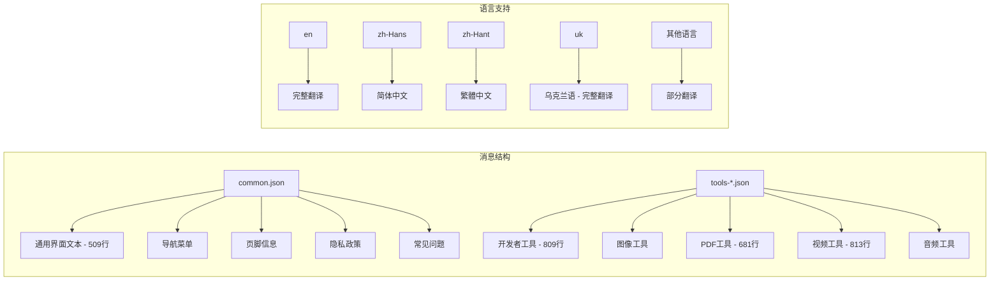
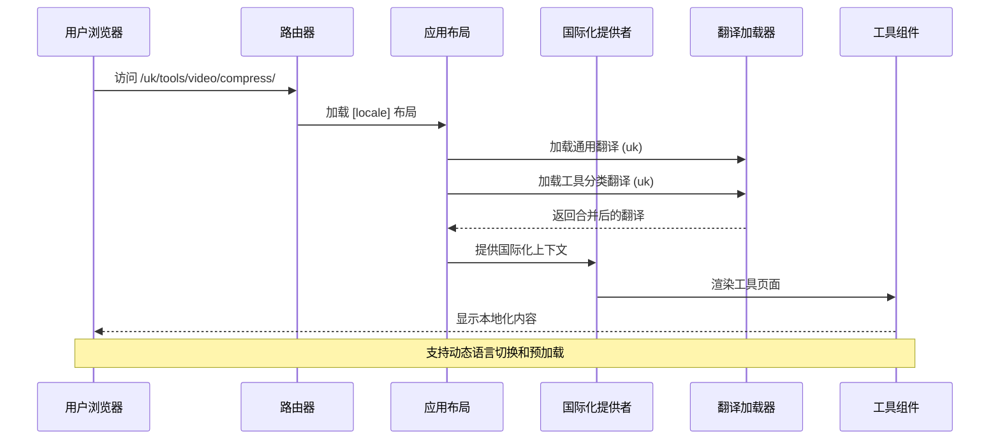
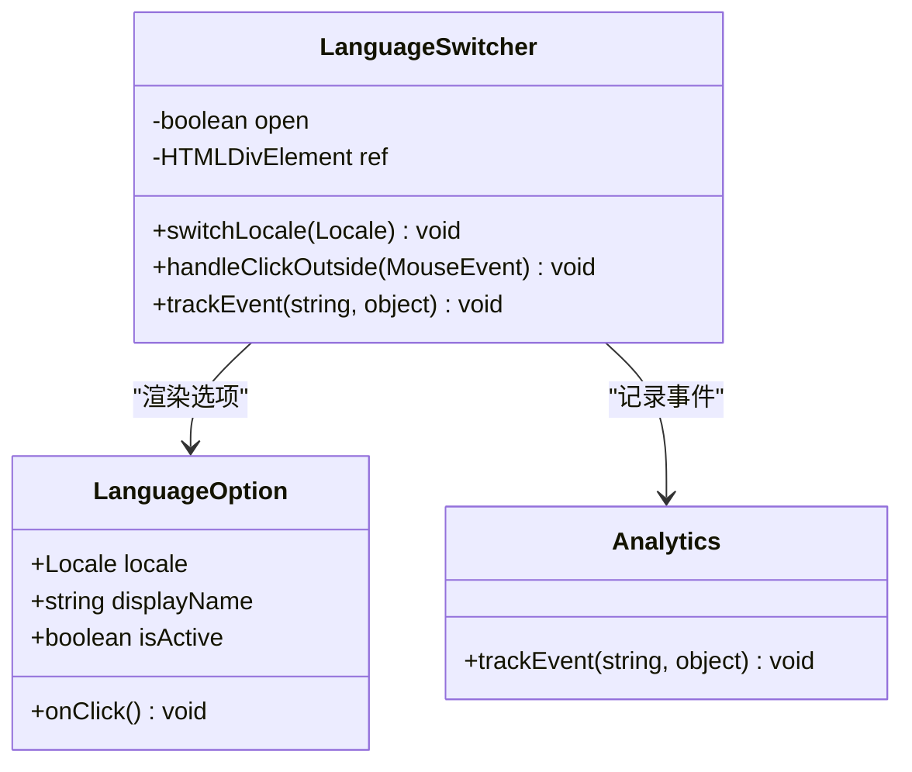
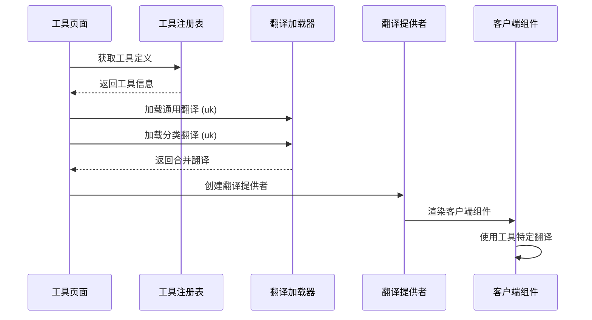
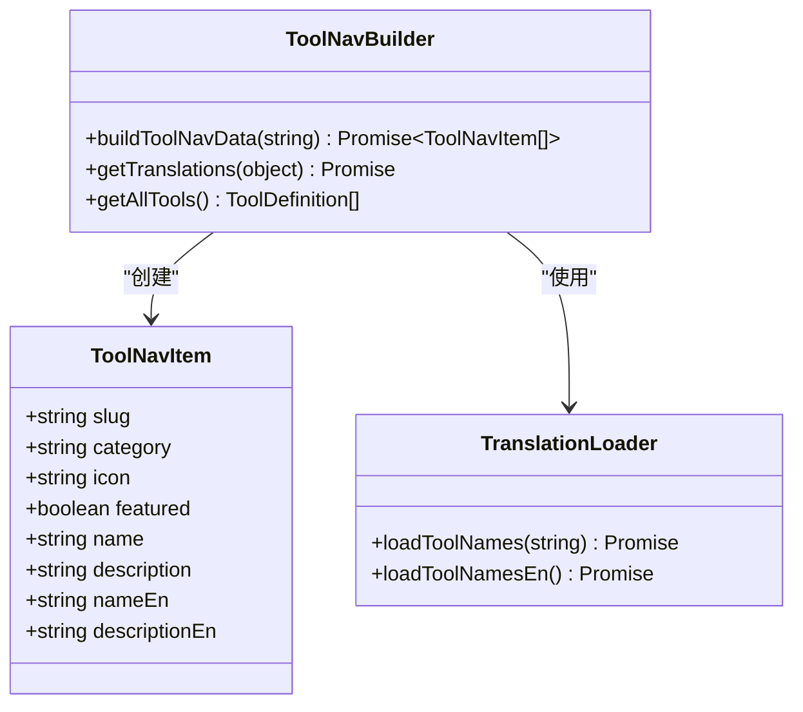
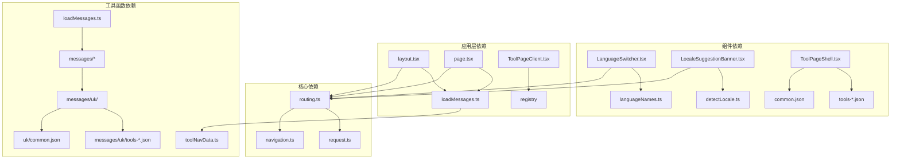

# 国际化系统

<cite>
**本文档引用的文件**
- [routing.ts](file://src/i18n/routing.ts)
- [navigation.ts](file://src/i18n/navigation.ts)
- [request.ts](file://src/i18n/request.ts)
- [LanguageSwitcher.tsx](file://src/components/shared/LanguageSwitcher.tsx)
- [layout.tsx](file://src/app/[locale]/layout.tsx)
- [page.tsx](file://src/app/[locale]/page.tsx)
- [LocaleSuggestionBanner.tsx](file://src/components/shared/LocaleSuggestionBanner.tsx)
- [detectLocale.ts](file://src/lib/i18n/detectLocale.ts)
- [loadMessages.ts](file://src/lib/i18n/loadMessages.ts)
- [languageNames.ts](file://src/lib/i18n/languageNames.ts)
- [toolNavData.ts](file://src/lib/i18n/toolNavData.ts)
- [layout.tsx](file://src/app/layout.tsx)
- [common.json](file://messages/en/common.json)
- [tools-video.json](file://messages/en/tools-video.json)
- [page.tsx](file://src/app/[locale]/tools/[category]/[slug]/page.tsx)
- [ToolPageClient.tsx](file://src/app/[locale]/tools/[category]/[slug]/ToolPageClient.tsx)
- [ToolPageShell.tsx](file://src/components/tool/ToolPageShell.tsx)
- [common.json](file://messages/uk/common.json)
- [tools-developer.json](file://messages/uk/tools-developer.json)
- [tools-pdf.json](file://messages/uk/tools-pdf.json)
- [tools-video.json](file://messages/uk/tools-video.json)
</cite>

## 更新摘要
**变更内容**
- 新增乌克兰语（uk）完整本地化支持
- 更新语言支持列表，现支持23种语言
- 新增乌克兰语通用界面翻译（509行）
- 新增乌克兰语开发者工具翻译（809行）
- 新增乌克兰语PDF工具翻译（681行）
- 新增乌克兰语视频工具翻译（813行）

## 目录
1. [简介](#简介)
2. [项目结构](#项目结构)
3. [核心组件](#核心组件)
4. [架构概览](#架构概览)
5. [详细组件分析](#详细组件分析)
6. [依赖关系分析](#依赖关系分析)
7. [性能考虑](#性能考虑)
8. [故障排除指南](#故障排除指南)
9. [结论](#结论)
10. [附录](#附录)

## 简介

媒体工具箱采用基于 next-intl 的现代化国际化系统，现已支持23种语言和地区变体，实现了完整的多语言网站功能。该系统通过语言前缀路由、智能语言检测、动态翻译加载和 SEO 友好的元数据管理，为全球用户提供本地化的媒体处理体验。

系统的核心特性包括：
- 基于 next-intl 的完整国际化框架
- 支持23种语言的动态路由和内容渲染
- 智能语言检测和用户偏好管理
- 工具页面的按需翻译加载
- RTL 语言的布局适配
- SEO 友好的多语言元数据管理

**更新** 新增乌克兰语完整本地化支持，现包含通用界面、开发者工具、PDF工具和视频工具的完整翻译内容。

## 项目结构

国际化系统的文件组织遵循模块化设计原则，主要分布在以下目录：

```mermaid
graph TB
subgraph "国际化核心"
A[src/i18n/] --> A1[routing.ts]
A --> A2[navigation.ts]
A --> A3[request.ts]
end
subgraph "消息文件"
B[messages/] --> B1[语言目录]
B1 --> B2[common.json]
B1 --> B3[tools-*.json]
B1 --> B4[uk/]
B4 --> B5[common.json - 509行]
B4 --> B6[tools-developer.json - 809行]
B4 --> B7[tools-pdf.json - 681行]
B4 --> B8[tools-video.json - 813行]
end
subgraph "组件层"
C[src/components/] --> C1[shared/LanguageSwitcher.tsx]
C --> C2[shared/LocaleSuggestionBanner.tsx]
C --> C3[tool/ToolPageShell.tsx]
end
subgraph "应用层"
D[src/app/] --> D1[[locale]/layout.tsx]
D --> D2[[locale]/page.tsx]
D --> D3[[locale]/tools/...]
end
subgraph "工具函数"
E[src/lib/i18n/] --> E1[loadMessages.ts]
E --> E2[detectLocale.ts]
E --> E3[languageNames.ts]
E --> E4[toolNavData.ts]
end
```

**图表来源**
- [routing.ts:1-18](file://src/i18n/routing.ts#L1-L18)
- [layout.tsx:1-77](file://src/app/[locale]/layout.tsx#L1-L77)
- [loadMessages.ts:1-56](file://src/lib/i18n/loadMessages.ts#L1-L56)

**章节来源**
- [routing.ts:1-18](file://src/i18n/routing.ts#L1-L18)
- [layout.tsx:1-77](file://src/app/[locale]/layout.tsx#L1-L77)
- [loadMessages.ts:1-56](file://src/lib/i18n/loadMessages.ts#L1-L56)

## 核心组件

### 路由国际化配置

国际化系统的核心是基于 next-intl 的路由配置，现在支持23种语言：

```mermaid
classDiagram
class RoutingConfig {
+Locale[] locales
+Locale defaultLocale
+Locale[] rtlLocales
+defineRouting() Routing
}
class Locale {
<<enumeration>>
"en"
"zh-Hans"
"zh-Hant"
"ja"
"ko"
"es"
"fr"
"de"
"pt-BR"
"pt-PT"
"th"
"vi"
"id"
"hi"
"ar"
"it"
"nl"
"pl"
"ru"
"tr"
"uk"
}
class Navigation {
+Link
+redirect
+usePathname
+useRouter
+getPathname
}
RoutingConfig --> Locale : "defines"
Navigation --> RoutingConfig : "uses"
```

**图表来源**
- [routing.ts:3-12](file://src/i18n/routing.ts#L3-L12)
- [navigation.ts:4-5](file://src/i18n/navigation.ts#L4-L5)

系统现在支持23种语言，其中阿拉伯语（ar）被标记为 RTL 语言，确保正确的文本方向。

**章节来源**
- [routing.ts:1-18](file://src/i18n/routing.ts#L1-L18)
- [navigation.ts:1-6](file://src/i18n/navigation.ts#L1-L6)

### 翻译文件组织结构

翻译文件采用模块化组织，分为通用消息和工具特定消息。乌克兰语现已完全支持：



**图表来源**
- [common.json:1-509](file://messages/uk/common.json#L1-L509)
- [tools-video.json:1-813](file://messages/uk/tools-video.json#L1-L813)

乌克兰语翻译现已覆盖所有主要功能区域：
- 通用界面元素：509行翻译，包含站点名称、描述、工具栏、导航等
- 开发者工具：809行翻译，覆盖所有开发工具的名称、描述、SEO内容
- PDF工具：681行翻译，包含PDF编辑、转换、压缩等功能
- 视频工具：813行翻译，覆盖视频编辑、格式转换、压缩等工具

**章节来源**
- [common.json:1-509](file://messages/uk/common.json#L1-L509)
- [tools-developer.json:1-809](file://messages/uk/tools-developer.json#L1-L809)
- [tools-pdf.json:1-681](file://messages/uk/tools-pdf.json#L1-L681)
- [tools-video.json:1-813](file://messages/uk/tools-video.json#L1-L813)

## 架构概览

国际化系统采用分层架构设计，确保高效的翻译加载和渲染：



**图表来源**
- [layout.tsx:46-49](file://src/app/[locale]/layout.tsx#L46-L49)
- [loadMessages.ts:32-55](file://src/lib/i18n/loadMessages.ts#L32-L55)

系统架构的关键特点：
- **静态参数生成**：为每个语言生成静态路由参数
- **并行翻译加载**：同时加载通用和工具特定翻译
- **客户端提供者**：在客户端提供翻译上下文
- **服务端渲染**：在服务端设置请求语言

**章节来源**
- [layout.tsx:28-50](file://src/app/[locale]/layout.tsx#L28-L50)
- [loadMessages.ts:32-55](file://src/lib/i18n/loadMessages.ts#L32-L55)

## 详细组件分析

### 语言切换器组件

语言切换器提供了直观的用户界面来切换应用程序语言：



**图表来源**
- [LanguageSwitcher.tsx:15-74](file://src/components/shared/LanguageSwitcher.tsx#L15-L74)
- [languageNames.ts:3-25](file://src/lib/i18n/languageNames.ts#L3-L25)

组件功能特性：
- **本地存储偏好**：使用 localStorage 保存用户语言选择
- **点击外部关闭**：自动关闭下拉菜单
- **分析追踪**：记录语言切换事件用于数据分析
- **响应式设计**：支持不同屏幕尺寸的显示

**章节来源**
- [LanguageSwitcher.tsx:1-74](file://src/components/shared/LanguageSwitcher.tsx#L1-L74)
- [languageNames.ts:1-26](file://src/lib/i18n/languageNames.ts#L1-L26)

### 语言检测与建议系统

系统实现了智能的语言检测机制，为用户提供语言切换建议：


**图表来源**
- [LocaleSuggestionBanner.tsx:15-26](file://src/components/shared/LocaleSuggestionBanner.tsx#L15-L26)
- [detectLocale.ts:7-57](file://src/lib/i18n/detectLocale.ts#L7-L57)

**章节来源**
- [LocaleSuggestionBanner.tsx:1-104](file://src/components/shared/LocaleSuggestionBanner.tsx#L1-L104)
- [detectLocale.ts:1-58](file://src/lib/i18n/detectLocale.ts#L1-L58)

### 工具页面国际化实现

工具页面实现了按需翻译加载，确保性能和用户体验：



**图表来源**
- [page.tsx:46-54](file://src/app/[locale]/tools/[category]/[slug]/page.tsx#L46-L54)
- [ToolPageClient.tsx:29-58](file://src/app/[locale]/tools/[category]/[slug]/ToolPageClient.tsx#L29-L58)

乌克兰语工具页面的完整支持包括：
- 开发者工具页面：809行翻译，覆盖JSON格式化、Base64编码、URL编码等工具
- PDF工具页面：681行翻译，覆盖合并、拆分、压缩、转换等PDF功能
- 视频工具页面：813行翻译，覆盖格式转换、压缩、编辑等视频处理功能

**章节来源**
- [page.tsx:1-109](file://src/app/[locale]/tools/[category]/[slug]/page.tsx#L1-L109)
- [ToolPageClient.tsx:1-59](file://src/app/[locale]/tools/[category]/[slug]/ToolPageClient.tsx#L1-L59)

### 工具导航数据构建

系统实现了服务器端的工具导航数据构建，确保客户端组件的高效渲染：



**图表来源**
- [toolNavData.ts:16-42](file://src/lib/i18n/toolNavData.ts#L16-L42)

**章节来源**
- [toolNavData.ts:1-42](file://src/lib/i18n/toolNavData.ts#L1-L42)

## 依赖关系分析

国际化系统各组件之间的依赖关系如下：



**图表来源**
- [routing.ts:1-18](file://src/i18n/routing.ts#L1-L18)
- [LanguageSwitcher.tsx:1-10](file://src/components/shared/LanguageSwitcher.tsx#L1-L10)
- [loadMessages.ts:1-56](file://src/lib/i18n/loadMessages.ts#L1-L56)

**章节来源**
- [routing.ts:1-18](file://src/i18n/routing.ts#L1-L18)
- [LanguageSwitcher.tsx:1-10](file://src/components/shared/LanguageSwitcher.tsx#L1-L10)
- [loadMessages.ts:1-56](file://src/lib/i18n/loadMessages.ts#L1-L56)

## 性能考虑

国际化系统在性能方面采用了多项优化策略：

### 动态翻译加载
- **按需加载**：只加载当前页面需要的翻译文件
- **并行处理**：使用 Promise.all 同时加载多个翻译源
- **缓存机制**：利用浏览器缓存减少重复加载

### 路由优化
- **静态参数生成**：为每个语言生成静态路由参数
- **预渲染支持**：支持静态站点生成和增量静态再生
- **懒加载组件**：工具页面组件采用懒加载技术

### 内存管理
- **组件缓存**：工具组件使用稳定缓存避免重复创建
- **翻译合并**：服务器端合并翻译减少客户端内存占用
- **条件加载**：根据工具类型动态加载相关翻译

**更新** 乌克兰语翻译文件的加入对性能影响：
- common.json（509行）：约15KB，包含通用界面翻译
- tools-developer.json（809行）：约24KB，包含开发者工具翻译  
- tools-pdf.json（681行）：约20KB，包含PDF工具翻译
- tools-video.json（813行）：约24KB，包含视频工具翻译
- 总计约83KB的乌克兰语翻译数据，对整体性能影响较小

## 故障排除指南

### 常见问题及解决方案

**语言切换无效**
1. 检查 localStorage 中的 locale 键值
2. 验证路由配置中的语言列表
3. 确认翻译文件的完整性

**翻译缺失或错误**
1. 检查对应语言的翻译文件是否存在
2. 验证 JSON 文件的语法正确性
3. 确认命名空间和键名的一致性

**RTL 布局问题**
1. 验证 rtlLocales 配置
2. 检查 CSS 样式的 RTL 支持
3. 确认文本方向的正确应用

**乌克兰语特定问题**
1. 确认 messages/uk/ 目录结构完整
2. 验证 common.json、tools-*.json 文件的完整性
3. 检查乌克兰语特有的术语翻译准确性

**章节来源**
- [routing.ts:12-12](file://src/i18n/routing.ts#L12-L12)
- [layout.tsx:52-52](file://src/app/[locale]/layout.tsx#L52-L52)

## 结论

媒体工具箱的国际化系统通过精心设计的架构和实现，成功地为全球用户提供了无缝的多语言体验。系统现已支持23种语言，包括最新的乌克兰语完整本地化支持。

系统的主要优势包括：

1. **完整的语言支持**：支持23种语言和地区变体
2. **智能语言检测**：自动检测和建议合适的语言
3. **高性能实现**：动态加载和缓存机制确保快速响应
4. **SEO 友好**：完整的多语言元数据管理和结构化数据
5. **可扩展性**：模块化设计便于添加新语言和工具

乌克兰语的完整加入进一步增强了系统的国际化能力，为乌克兰语用户提供了本地化的媒体处理体验。该系统为类似项目的国际化实现提供了优秀的参考模板，展示了如何在保持性能的同时提供丰富的本地化功能。

## 附录

### 添加新语言支持步骤

1. **创建翻译文件**
   - 在 `messages/` 目录下创建新语言目录
   - 复制 `common.json` 到新语言目录
   - 逐项翻译所有键值

2. **更新路由配置**
   ```typescript
   // 在 routing.ts 中添加新语言
   export const locales = [
     // ... 现有语言
     "新语言代码"
   ] as const;
   ```

3. **更新语言名称映射**
   ```typescript
   // 在 languageNames.ts 中添加显示名称
   const languageNames: Record<Locale, string> = {
     // ... 现有映射
     "新语言代码": "新语言名称"
   };
   ```

4. **测试和验证**
   - 访问新语言页面验证翻译完整性
   - 测试语言切换功能
   - 验证 RTL 语言的布局适配

### 工具页面本地化最佳实践

1. **翻译键命名规范**
   - 使用层级命名：`tools.[category].[slug].key`
   - 保持键名一致性
   - 避免硬编码字符串

2. **SEO 优化**
   - 为每个工具页面生成独特的 meta 标题和描述
   - 包含相关的关键词
   - 使用结构化数据提升搜索可见性

3. **性能优化**
   - 使用懒加载组件
   - 实现翻译缓存
   - 减少不必要的重新渲染

### 乌克兰语本地化特色

乌克兰语翻译的完整实现体现了以下特色：

1. **全面覆盖**：从通用界面到具体工具功能的完整翻译
2. **专业术语**：准确翻译媒体处理领域的专业术语
3. **文化适配**：符合乌克兰语用户的使用习惯和表达方式
4. **技术准确性**：确保技术术语的准确性和一致性

**章节来源**
- [common.json:1-509](file://messages/uk/common.json#L1-L509)
- [tools-developer.json:1-809](file://messages/uk/tools-developer.json#L1-L809)
- [tools-pdf.json:1-681](file://messages/uk/tools-pdf.json#L1-L681)
- [tools-video.json:1-813](file://messages/uk/tools-video.json#L1-L813)