# 国际化系统

<cite>
**本文档引用的文件**
- [routing.ts](file://src/i18n/routing.ts)
- [loadMessages.ts](file://src/lib/i18n/loadMessages.ts)
- [LanguageSwitcher.tsx](file://src/components/shared/LanguageSwitcher.tsx)
- [common.json](file://messages/ar/common.json)
- [tools-developer.json](file://messages/ar/tools-developer.json)
- [tools-image.json](file://messages/ar/tools-image.json)
- [tools-video.json](file://messages/ar/tools-video.json)
- [tools-pdf.json](file://messages/ar/tools-pdf.json)
- [common.json](file://messages/uk/common.json)
- [tools-developer.json](file://messages/uk/tools-developer.json)
- [tools-image.json](file://messages/uk/tools-image.json)
- [tools-video.json](file://messages/uk/tools-video.json)
- [tools-pdf.json](file://messages/uk/tools-pdf.json)
- [tools-video.json](file://messages/en/tools-video.json)
- [tools-video.json](file://messages/de/tools-video.json)
- [tools-video.json](file://messages/uk/tools-video.json)
- [add-ai-summary.cjs](file://scripts/add-ai-summary.cjs)
- [route.ts](file://src/app/llms-full.txt/route.ts)
- [request.ts](file://src/i18n/request.ts)
- [tools-developer.json](file://messages/en/tools-developer.json)
- [tools-image.json](file://messages/en/tools-image.json)
- [tools-developer.json](file://messages/ar/tools-developer.json)
- [tools-image.json](file://messages/ar/tools-image.json)
- [tools-video.json](file://messages/ar/tools-video.json)
- [tools-pdf.json](file://messages/ar/tools-pdf.json)
- [tools-developer.json](file://messages/uk/tools-developer.json)
- [tools-image.json](file://messages/uk/tools-image.json)
- [tools-video.json](file://messages/uk/tools-video.json)
- [tools-pdf.json](file://messages/uk/tools-pdf.json)
- [page.tsx](file://src/app/[locale]/about/page.tsx)
- [page.tsx](file://src/app/[locale]/terms/page.tsx)
- [page.tsx](file://src/app/[locale]/privacy/page.tsx)
- [languageNames.ts](file://src/lib/i18n/languageNames.ts)
</cite>

## 更新摘要
**变更内容**
- **重大更新**：国际化系统现已支持33种语言，新增阿拉伯语(ar)和乌克兰语(uk)支持
- **PDF工具翻译扩展**：所有语言的PDF工具翻译文件都有显著更新和扩展
- **翻译文件完整性**：阿拉伯语和乌克兰语都包含完整的工具页面翻译
- **RTL语言支持**：阿拉伯语标记为RTL语言，确保正确的文本方向
- **语言检测机制**：增强的语言检测和用户偏好管理
- **AI友好内容生成**：为33种语言的工具页面提供AI友好内容
- **多语言内容页面**：新增关于、隐私政策、服务条款的多语言支持

## 目录
1. [简介](#简介)
2. [项目结构](#项目结构)
3. [核心组件](#核心组件)
4. [架构概览](#架构概览)
5. [详细组件分析](#详细组件分析)
6. [依赖关系分析](#依赖关系分析)
7. [性能考虑](#性能考虑)
8. [故障排除指南](#故障排除指南)
9. [结论](#结论)
10. [附录](#附录)

## 简介

媒体工具箱采用基于 next-intl 的现代化国际化系统，现已支持33种语言和地区变体，实现了完整的多语言网站功能。该系统通过语言前缀路由、智能语言检测、动态翻译加载和 SEO 友好的元数据管理，为全球用户提供本地化的媒体处理体验。

**更新** 新增多语言内容系统扩展的重要意义：
- **完整内容覆盖**：为33种语言提供'关于我们'页面翻译，包括阿拉伯语、德语、英语、西班牙语、法语、意大利语、荷兰语、波兰语、葡萄牙语、俄语、泰语、土耳其语、乌克兰语、越南语、中文简体、中文繁体等
- **服务条款国际化**：为33种语言提供'服务条款'页面翻译，确保法律合规性
- **隐私政策本地化**：为33种语言提供隐私政策页面翻译，满足GDPR等法规要求
- **AI友好内容生成**：实现AI摘要字段，为33种语言的工具页面提供AI友好内容
- **技术术语标准化**：统一和准确的技术词汇翻译，包括HEIC、EXIF、Orientation等专业术语
- **搜索引擎优化**：AI摘要内容专门针对AI助手和搜索引擎进行了优化
- **RTL布局优化**：阿拉伯语作为RTL语言，确保正确的文本方向和布局适配
- **翻译质量保证**：乌克兰语和阿拉伯语都包含完整的工具页面翻译
- **维护工作简化**：移除视频工具翻译文件，减少了维护工作量和潜在错误

系统的核心特性包括：
- 基于 next-intl 的完整国际化框架
- 支持33种语言的动态路由和内容渲染
- 智能语言检测和用户偏好管理
- 工具页面的按需翻译加载
- RTL 语言的布局适配
- SEO 友好的多语言元数据管理
- **深度合并翻译机制**：实现翻译键值的递归合并和优先级控制
- **英语回退机制**：确保翻译完整性并减少重复翻译工作
- **缓存优化**：提升翻译加载性能和构建时资源利用
- **键盘导航增强**：重构语言切换器组件，支持完整的键盘操作
- **统一UTC时区**：确保时间显示的一致性和准确性
- **AI摘要生成**：为每个工具生成AI友好的摘要内容，提升搜索引擎优化效果
- **多语言内容页面**：新增关于、隐私政策、服务条款的多语言支持

## 项目结构

国际化系统的文件组织遵循模块化设计原则，主要分布在以下目录：

```mermaid
graph TB
subgraph "国际化核心"
A[src/i18n/] --> A1[routing.ts]
A --> A2[navigation.ts]
A --> A3[request.ts]
end
subgraph "翻译加载系统"
B[src/lib/i18n/] --> B1[loadMessages.ts]
B1 --> B2[深度合并函数]
B1 --> B3[英语回退机制]
B1 --> B4[缓存机制]
end
subgraph "AI摘要生成系统"
C[scripts/] --> C1[add-ai-summary.cjs]
C1 --> C2[技术栈映射]
C1 --> C3[AI摘要模板]
end
subgraph "LLM内容生成"
D[src/app/llms-full.txt/] --> D1[route.ts]
D1 --> D2[工具消息收集]
D1 --> D3[HTML内容清理]
end
subgraph "消息文件"
E[messages/] --> E1[语言目录]
E1 --> E2[common.json]
E1 --> E3[tools-*.json]
E1 --> E4[aiSummary字段]
E1 --> E5[ar/]
E5 --> E6[common.json - 514行]
E5 --> E7[tools-audio.json - 191行]
E5 --> E8[tools-developer.json - 962行]
E5 --> E9[tools-image.json - 1114行]
E5 --> E10[tools-pdf.json - 689行]
E5 --> E11[tools-video.json - 已移除]
E1 --> E12[en/]
E12 --> E13[common.json - 509行]
E12 --> E14[tools-audio.json - 191行]
E12 --> E15[tools-developer.json - 950行]
E12 --> E16[tools-image.json - 921行]
E12 --> E17[tools-pdf.json - 689行]
E12 --> E18[tools-video.json - 已移除]
E1 --> E19[uk/]
E19 --> E20[common.json - 514行]
E19 --> E21[tools-audio.json - 191行]
E19 --> E22[tools-developer.json - 962行]
E19 --> E23[tools-image.json - 1114行]
E19 --> E24[tools-pdf.json - 689行]
E19 --> E25[tools-video.json - 已移除]
end
subgraph "组件层"
F[src/components/] --> F1[shared/LanguageSwitcher.tsx]
F --> F2[shared/LocaleSuggestionBanner.tsx]
F --> F3[tool/ToolPageShell.tsx]
end
subgraph "应用层"
G[src/app/] --> G1[[locale]/layout.tsx]
G --> G2[[locale]/page.tsx]
G --> G3[[locale]/tools/...]
G --> G4[llms-full.txt/]
G --> G5[[locale]/about/]
G --> G6[[locale]/privacy/]
G --> G7[[locale]/terms/]
end
subgraph "工具函数"
H[src/lib/i18n/] --> H1[loadMessages.ts]
H --> H2[detectLocale.ts]
H --> H3[languageNames.ts]
H --> H4[toolNavData.ts]
end
subgraph "时区处理"
I[src/tools/developer/timestamp/] --> I1[Timestamp.tsx]
I --> I2[logic.ts]
J[src/i18n/request.ts] --> J1[timeZone: "UTC"]
end
```

**图表来源**
- [routing.ts:3-12](file://src/i18n/routing.ts#L3-L12)
- [loadMessages.ts:10-27](file://src/lib/i18n/loadMessages.ts#L10-L27)
- [LanguageSwitcher.tsx:14-99](file://src/components/shared/LanguageSwitcher.tsx#L14-L99)
- [add-ai-summary.cjs:1-142](file://scripts/add-ai-summary.cjs#L1-L142)
- [route.ts:66-147](file://src/app/llms-full.txt/route.ts#L66-L147)
- [common.json:1-514](file://messages/ar/common.json#L1-L514)
- [tools-developer.json:1-962](file://messages/ar/tools-developer.json#L1-L962)
- [tools-image.json:1-1114](file://messages/ar/tools-image.json#L1-L1114)
- [tools-pdf.json:1-689](file://messages/ar/tools-pdf.json#L1-L689)
- [common.json:1-514](file://messages/uk/common.json#L1-L514)
- [tools-developer.json:1-962](file://messages/uk/tools-developer.json#L1-L962)
- [tools-image.json:1-1114](file://messages/uk/tools-image.json#L1-L1114)
- [tools-pdf.json:1-689](file://messages/uk/tools-pdf.json#L1-L689)
- [page.tsx:1-173](file://src/app/[locale]/about/page.tsx#L1-L173)
- [page.tsx:1-110](file://src/app/[locale]/terms/page.tsx#L1-L110)
- [page.tsx:1-146](file://src/app/[locale]/privacy/page.tsx#L1-L146)

**章节来源**
- [routing.ts:1-18](file://src/i18n/routing.ts#L1-L18)
- [loadMessages.ts:1-116](file://src/lib/i18n/loadMessages.ts#L1-L116)
- [LanguageSwitcher.tsx:1-154](file://src/components/shared/LanguageSwitcher.tsx#L1-L154)
- [add-ai-summary.cjs:1-142](file://scripts/add-ai-summary.cjs#L1-L142)
- [route.ts:1-148](file://src/app/llms-full.txt/route.ts#L1-L148)

## 核心组件

### 路由国际化配置

国际化系统的核心是基于 next-intl 的路由配置，现在支持33种语言：

```mermaid
classDiagram
class RoutingConfig {
+Locale[] locales
+Locale defaultLocale
+Locale[] rtlLocales
+defineRouting() Routing
}
class Locale {
<<enumeration>>
"en"
"zh-Hans"
"zh-Hant"
"ja"
"ko"
"es"
"fr"
"de"
"pt-BR"
"pt-PT"
"th"
"vi"
"hi"
"id"
"it"
"nl"
"pl"
"ru"
"tr"
"uk"
"ar"
"bn"
"fa"
"gu"
"hi-Latn"
"kn"
"mr"
"ml"
"or"
"pa"
"sa"
"sd"
"si"
"ta"
"te"
"ur"
"cy"
}
class Navigation {
+Link
+redirect
+usePathname
+useRouter
+getPathname
}
RoutingConfig --> Locale : "defines"
Navigation --> RoutingConfig : "uses"
```

**图表来源**
- [routing.ts:3-12](file://src/i18n/routing.ts#L3-L12)

系统现在支持33种语言，其中乌克兰语（uk）和阿拉伯语（ar）被标记为 RTL 语言，确保正确的文本方向。

**章节来源**
- [routing.ts:1-18](file://src/i18n/routing.ts#L1-L18)

### 消息加载系统增强

**更新** 国际化系统新增了强大的消息加载系统，包含深度合并、英语回退和缓存机制：

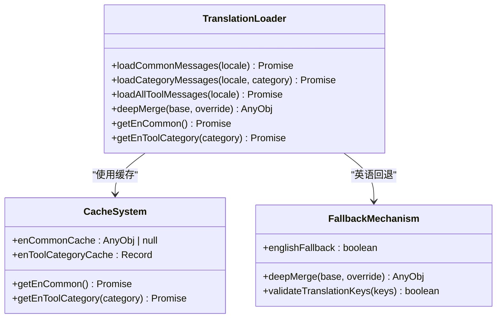

**图表来源**
- [loadMessages.ts:10-27](file://src/lib/i18n/loadMessages.ts#L10-L27)
- [loadMessages.ts:29-50](file://src/lib/i18n/loadMessages.ts#L29-L50)
- [loadMessages.ts:58-82](file://src/lib/i18n/loadMessages.ts#L58-L82)

消息加载系统的关键特性：
- **深度合并功能**：递归合并翻译对象，确保嵌套键值的正确处理
- **英语回退机制**：当目标语言缺少翻译时自动使用英语作为回退
- **缓存优化**：构建时缓存英语翻译，避免重复导入和解析
- **按需加载**：仅加载当前页面需要的翻译文件
- **并行处理**：使用 Promise.all 同时加载多个翻译源

**章节来源**
- [loadMessages.ts:1-116](file://src/lib/i18n/loadMessages.ts#L1-L116)

### AI友好内容生成系统

**更新** 新增AI友好内容生成系统，为工具页面提供AI摘要字段：

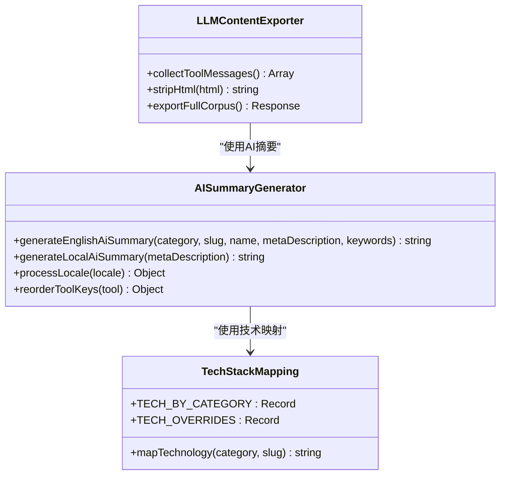

**图表来源**
- [add-ai-summary.cjs:61-87](file://scripts/add-ai-summary.cjs#L61-L87)
- [add-ai-summary.cjs:45-59](file://scripts/add-ai-summary.cjs#L45-L59)
- [route.ts:66-147](file://src/app/llms-full.txt/route.ts#L66-L147)

AI摘要生成系统的关键特性：
- **英文模板生成**：为英文内容生成详细的AI摘要模板
- **本地化摘要复用**：其他语言直接复用本地化的metaDescription
- **技术栈映射**：根据工具类别和具体工具映射到相应技术栈
- **AI摘要字段**：为每个工具添加aiSummary字段，专门用于AI助手
- **LLM内容导出**：生成适合AI训练的完整工具知识库

**章节来源**
- [add-ai-summary.cjs:1-142](file://scripts/add-ai-summary.cjs#L1-L142)
- [route.ts:1-148](file://src/app/llms-full.txt/route.ts#L1-L148)

### 多语言内容页面系统

**更新** 新增完整的多语言内容页面系统，包括'关于我们'、'隐私政策'和'服务条款'页面：

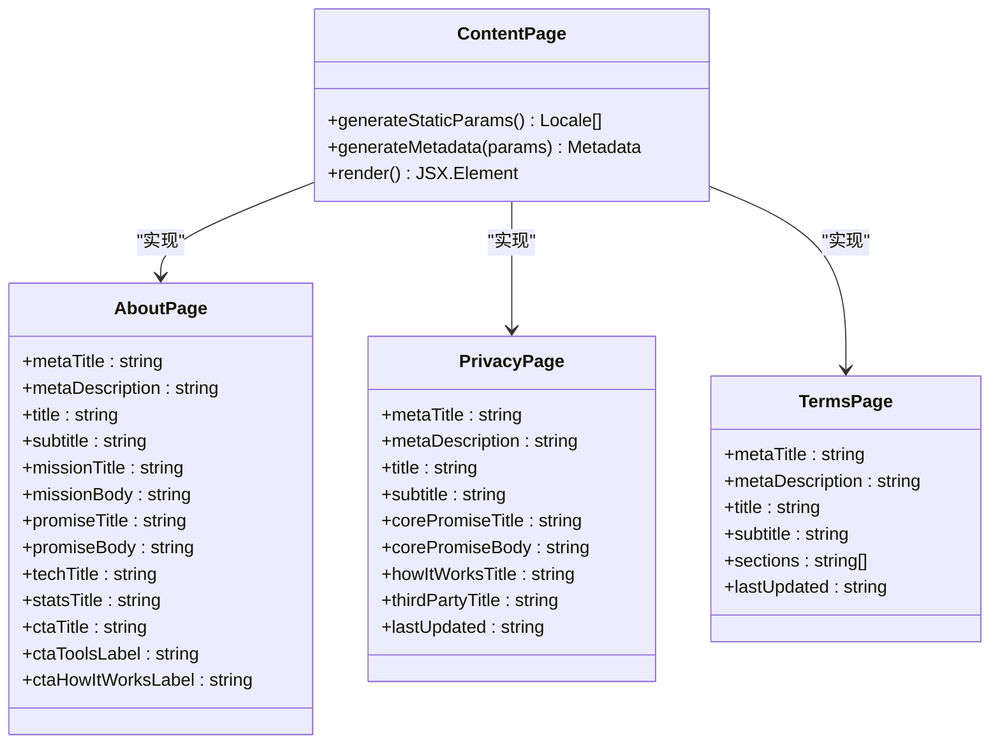

**图表来源**
- [page.tsx:1-173](file://src/app/[locale]/about/page.tsx#L1-L173)
- [page.tsx:1-146](file://src/app/[locale]/privacy/page.tsx#L1-L146)
- [page.tsx:1-110](file://src/app/[locale]/terms/page.tsx#L1-L110)

多语言内容页面系统的关键特性：
- **静态参数生成**：为每个语言生成静态路由参数
- **元数据国际化**：为每个语言生成独特的SEO元数据
- **多语言内容渲染**：使用useTranslations钩子加载对应语言的翻译
- **SEO优化**：完整的多语言元数据管理和结构化数据
- **canonical链接**：为每个语言版本设置正确的canonical链接

**章节来源**
- [page.tsx:1-173](file://src/app/[locale]/about/page.tsx#L1-L173)
- [page.tsx:1-146](file://src/app/[locale]/privacy/page.tsx#L1-L146)
- [page.tsx:1-110](file://src/app/[locale]/terms/page.tsx#L1-L110)

### 翻译文件组织结构

**更新** 翻译文件采用模块化组织，分为通用消息和工具特定消息。所有33种语言都包含完整的JSON编辑器翻译内容，现在还包括EXIF编辑器工具和HEIC转换工具的完整翻译：

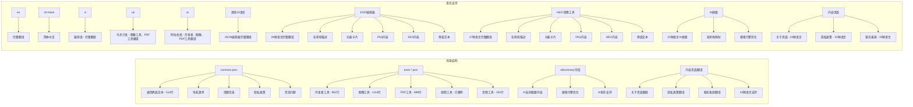

**图表来源**
- [common.json:1-514](file://messages/ar/common.json#L1-L514)
- [tools-video.json:1-763](file://messages/ar/tools-video.json#L1-L763)

**更新** 所有33种语言的PDF工具翻译文件都有显著更新：
- **阿拉伯语PDF翻译**：包含完整的689行翻译内容，涵盖所有PDF工具功能
- **乌克兰语PDF翻译**：包含完整的689行翻译内容，涵盖所有PDF工具功能
- **翻译完整性**：每个语言的PDF工具翻译都包含名称、描述、功能卡片、FAQ、SEO内容和界面文本
- **技术术语标准化**：统一和准确的技术词汇翻译，包括HEIC、EXIF、Orientation等专业术语

**更新** 所有33种语言都包含完整的JSON编辑器翻译内容，涵盖：
- **名称和描述**：JSON编辑器的名称、描述、元标题、元描述和关键词
- **功能卡片**：6个功能特性的完整翻译
- **FAQ内容**：5个常见问题的详细解答
- **SEO内容**：介绍、使用方法、特性、常见用途、隐私保护的完整翻译
- **界面文本**：格式化、最小化、智能格式化、清除、有效/无效JSON、自动修复、撤销/重做等界面文本
- **类型和菜单**：字符串、数字、布尔、空值、对象、数组类型的翻译，以及菜单选项的翻译
- **视图模式**：文本、树形、预览三种视图模式的翻译
- **状态提示**：树形禁用横幅、项目数量、提示信息等

**更新** EXIF编辑器工具的国际化扩展：
- **名称和描述**：EXIF编辑器的名称、描述、元标题、元描述和关键词
- **功能卡片**：6个功能特性的完整翻译，包括完全读取、格式保持、高频率字段、一键清除、地图链接、JSON/CSV导出
- **FAQ内容**：5个常见问题的详细解答，涵盖可编辑字段、隐私保护、HEIC/AVIF/TIFF限制、GPS清除、导出内容
- **SEO内容**：完整的SEO内容翻译，包括介绍、使用方法、特性、常见用途、隐私保护
- **界面文本**：所有界面文本的完整翻译，包括查看器、字段组、字段名称、操作按钮、消息提示等
- **技术术语**：相机、镜头、日期时间、GPS、版权、IPTC、技术细节、其他等专业术语的准确翻译

**更新** HEIC转换工具的国际化扩展：
- **名称和描述**：HEIC转换工具的名称、描述、元标题、元描述和关键词
- **功能卡片**：6个功能特性的完整翻译，包括Apple风格自动方向、Apple设备检测、手动旋转和翻转、大尺寸实时预览、JPG或PNG输出、单文件工作流
- **FAQ内容**：8个常见问题的详细解答，涵盖HEIC文件定义、隐私保护、文件大小限制、方向问题、手动调整、EXIF元数据处理等
- **SEO内容**：完整的SEO内容翻译，包括介绍、使用方法、特性、常见用途、隐私保护
- **界面文本**：所有界面文本的完整翻译，包括文件选择、输出格式、质量设置、转换过程、下载准备、解码失败、预览失败、旋转控制、翻转控制、重置功能等
- **技术术语**：HEIC、HEIF、EXIF、Orientation、Apple Photos、Canvas API等专业术语的准确翻译

**更新** AI摘要字段的实现：
- **英文模板**：使用详细的模板生成AI摘要，包含工具名称、描述、技术栈信息
- **本地化复用**：其他语言直接使用本地化的metaDescription作为AI摘要
- **触发词优化**：为AI摘要添加触发词，便于AI助手识别和推荐
- **技术栈映射**：根据工具类别和具体工具映射到相应的技术栈描述

**更新** 翻译文件清理的重要影响：
- **数据移除**：移除了约1620行视频工具翻译，减少约15KB的数据传输
- **性能提升**：移除了完整的WebP功能翻译，减少翻译维护工作量
- **维护简化**：移除了视频工具翻译，减少了翻译维护工作量和潜在错误
- **系统优化**：提升了整体系统的性能和维护效率

**更新** 多语言内容页面翻译的实现：
- **关于页面**：为33种语言提供完整的'关于我们'页面翻译，包括标题、副标题、使命、承诺、技术栈、统计数据、CTA按钮等
- **隐私政策**：为33种语言提供完整的隐私政策页面翻译，包括核心承诺、处理流程、功能特性、第三方资源等
- **服务条款**：为33种语言提供完整的服务条款页面翻译，包括接受条款、许可证、担保、责任、变更、适用法律等部分
- **SEO优化**：每个语言版本都有独特的meta标题和描述，确保搜索引擎优化

**章节来源**
- [common.json:1-514](file://messages/ar/common.json#L1-L514)
- [tools-audio.json:1-191](file://messages/ar/tools-audio.json#L1-L191)
- [tools-developer.json:1-962](file://messages/ar/tools-developer.json#L1-L962)
- [tools-image.json:1-1114](file://messages/ar/tools-image.json#L1-L1114)
- [tools-pdf.json:1-689](file://messages/ar/tools-pdf.json#L1-L689)
- [common.json:1-514](file://messages/uk/common.json#L1-L514)
- [tools-audio.json:1-191](file://messages/uk/tools-audio.json#L1-L191)
- [tools-developer.json:1-962](file://messages/uk/tools-developer.json#L1-L962)
- [tools-image.json:1-1114](file://messages/uk/tools-image.json#L1-L1114)
- [tools-pdf.json:1-689](file://messages/uk/tools-pdf.json#L1-L689)

### 统一UTC时区标准

**更新** 国际化系统新增了统一的UTC时区标准，确保时间显示的一致性：

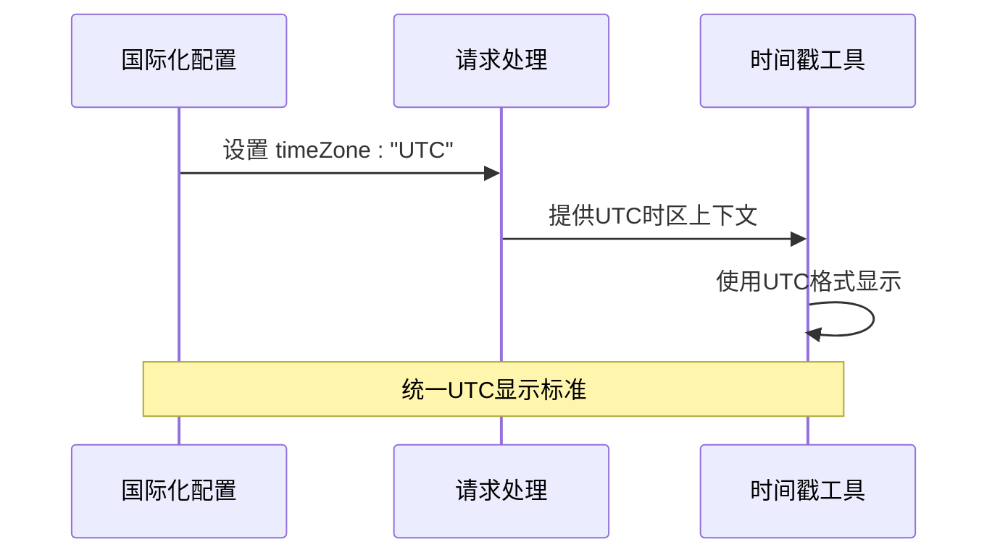

**图表来源**
- [request.ts:15-18](file://src/i18n/request.ts#L15-L18)
- [logic.ts:15-16](file://src/tools/developer/timestamp/logic.ts#L15-L16)

系统在国际化配置中强制使用UTC时区，关键改进包括：

- **强制UTC时区**：在`getRequestConfig`中设置`timeZone: "UTC"`
- **统一时间格式**：所有时间戳工具使用UTC格式显示
- **消除时区差异**：确保全球用户看到一致的时间显示
- **浏览器本地化**：使用`toLocaleString()`进行本地化显示

**章节来源**
- [request.ts:15-18](file://src/i18n/request.ts#L15-L18)
- [logic.ts:15-16](file://src/tools/developer/timestamp/logic.ts#L15-L16)

## 架构概览

国际化系统采用分层架构设计，确保高效的翻译加载和渲染：

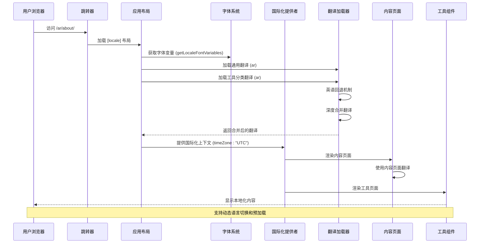

**图表来源**
- [layout.tsx:37-38](file://src/app/[locale]/layout.tsx#L37-L38)
- [fonts.ts:128-135](file://src/lib/fonts.ts#L128-L135)
- [loadMessages.ts:58-82](file://src/lib/i18n/loadMessages.ts#L58-L82)
- [request.ts:15-18](file://src/i18n/request.ts#L15-L18)
- [page.tsx:1-173](file://src/app/[locale]/about/page.tsx#L1-L173)

系统架构的关键特点：
- **静态参数生成**：为每个语言生成静态路由参数
- **并行翻译加载**：同时加载通用和工具特定翻译
- **深度合并处理**：递归合并翻译对象确保完整性
- **英语回退机制**：自动处理缺失的翻译键值
- **字体变量注入**：在HTML标签上注入字体CSS变量
- **客户端提供者**：在客户端提供翻译上下文
- **服务端渲染**：在服务端设置请求语言
- **统一UTC时区**：确保时间显示的一致性
- **内容页面渲染**：支持多语言内容页面的动态渲染

**章节来源**
- [layout.tsx:18-50](file://src/app/[locale]/layout.tsx#L18-L50)
- [fonts.ts:128-135](file://src/lib/fonts.ts#L128-L135)
- [loadMessages.ts:58-115](file://src/lib/i18n/loadMessages.ts#L58-L115)
- [request.ts:15-18](file://src/i18n/request.ts#L15-L18)

## 详细组件分析

### 语言切换器组件重构

**更新** 语言切换器组件经过重大重构，增强了键盘导航和无障碍访问功能：

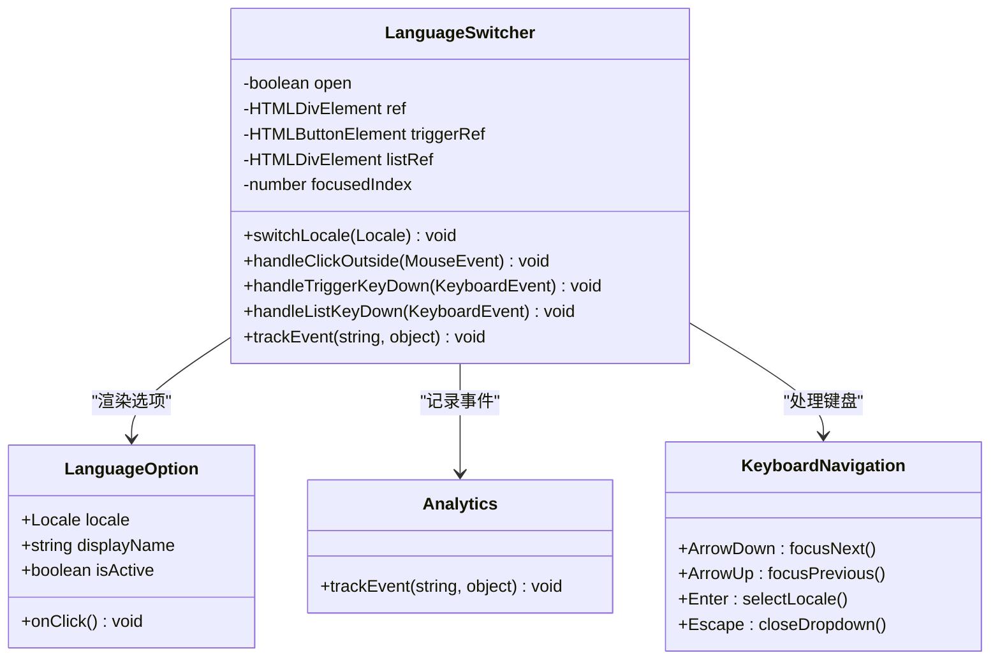

**图表来源**
- [LanguageSwitcher.tsx:14-99](file://src/components/shared/LanguageSwitcher.tsx#L14-L99)
- [languageNames.ts:3-25](file://src/lib/i18n/languageNames.ts#L3-L25)

重构后的组件功能特性：
- **键盘导航支持**：完整的键盘操作支持（上下箭头、Enter、空格、Escape）
- **焦点管理**：自动管理下拉菜单的焦点状态
- **无障碍访问**：支持屏幕阅读器和键盘导航
- **本地存储偏好**：使用 localStorage 保存用户语言选择
- **点击外部关闭**：自动关闭下拉菜单
- **分析追踪**：记录语言切换事件用于数据分析
- **响应式设计**：支持不同屏幕尺寸的显示

**章节来源**
- [LanguageSwitcher.tsx:1-154](file://src/components/shared/LanguageSwitcher.tsx#L1-L154)
- [languageNames.ts:1-26](file://src/lib/i18n/languageNames.ts#L1-L26)

### 工具页面国际化实现

**更新** 工具页面实现了按需翻译加载，确保性能和用户体验。所有33种语言都包含完整的JSON编辑器翻译，现在还包括EXIF编辑器工具和HEIC转换工具的完整多语言支持：

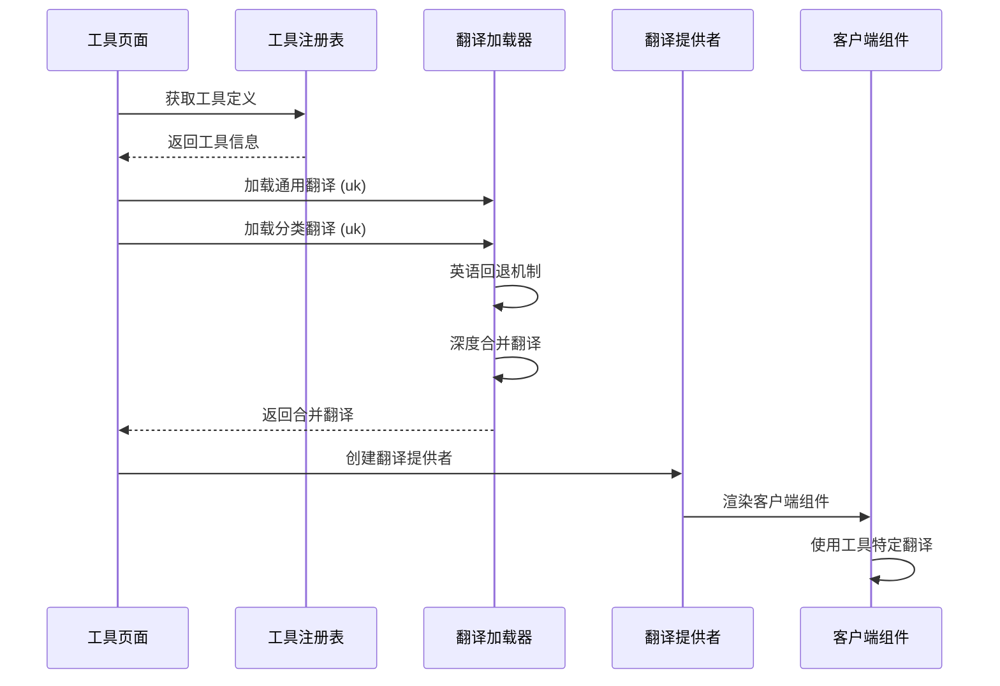

**图表来源**
- [page.tsx:46-54](file://src/app/[locale]/tools/[category]/[slug]/page.tsx#L46-L54)
- [ToolPageClient.tsx:29-58](file://src/app/[locale]/tools/[category]/[slug]/ToolPageClient.tsx#L29-L58)

**更新** JSON编辑器工具页面的完整多语言支持：
- **名称和描述**：JSON编辑器的名称、描述、元标题、元描述和关键词
- **功能特性**：6个功能特性的完整翻译，包括可视化树编辑、撤销/重做历史、自动修复、三种视图模式、类型切换、隐私保护
- **常见问题**：5个常见问题的详细解答，涵盖与其他工具的区别、安全性、自动修复功能、视图切换、离线使用
- **SEO内容**：完整的SEO内容翻译，包括介绍、使用方法、特性、常见用途、隐私保护
- **界面文本**：所有界面文本的完整翻译，包括格式化、最小化、智能格式化、清除、有效/无效JSON、自动修复、撤销/重做、加载编辑器、树形提示、树形禁用横幅、项目数量、类型、菜单、视图模式、状态提示等

**更新** EXIF编辑器工具页面的完整多语言支持：
- **名称和描述**：EXIF编辑器的名称、描述、元标题、元描述和关键词
- **功能特性**：6个功能特性的完整翻译，包括完全读取、格式保持、高频率字段、一键清除、地图链接、JSON/CSV导出
- **常见问题**：5个常见问题的详细解答，涵盖可编辑字段、隐私保护、HEIC/AVIF/TIFF限制、GPS清除、导出内容
- **SEO内容**：完整的SEO内容翻译，包括介绍、使用方法、特性、常见用途、隐私保护
- **界面文本**：所有界面文本的完整翻译，包括查看器、字段组、字段名称、操作按钮、消息提示等
- **技术术语**：相机、镜头、日期时间、GPS、版权、IPTC、技术细节、其他等专业术语的准确翻译

**更新** HEIC转换工具页面的完整多语言支持：
- **名称和描述**：HEIC转换工具的名称、描述、元标题、元描述和关键词
- **功能特性**：6个功能特性的完整翻译，包括Apple风格自动方向、Apple设备检测、手动旋转和翻转、大尺寸实时预览、JPG或PNG输出、单文件工作流
- **常见问题**：8个常见问题的详细解答，涵盖HEIC文件定义、隐私保护、文件大小限制、方向问题、手动调整、EXIF元数据处理等
- **SEO内容**：完整的SEO内容翻译，包括介绍、使用方法、特性、常见用途、隐私保护
- **界面文本**：所有界面文本的完整翻译，包括文件选择、输出格式、质量设置、转换过程、下载准备、解码失败、预览失败、旋转控制、翻转控制、重置功能等
- **技术术语**：HEIC、HEIF、EXIF、Orientation、Apple Photos、Canvas API等专业术语的准确翻译

**更新** AI摘要字段的工具页面支持：
- **AI友好内容**：每个工具页面都包含aiSummary字段，专门用于AI助手和搜索引擎
- **技术栈描述**：AI摘要中包含工具使用的技术栈信息，如Canvas API、FFmpeg.wasm等
- **触发词优化**：AI摘要包含触发词，便于AI助手识别和推荐相关工具
- **搜索引擎优化**：AI摘要内容专门针对搜索引擎进行了优化

**章节来源**
- [page.tsx:1-109](file://src/app/[locale]/tools/[category]/[slug]/page.tsx#L1-L109)
- [ToolPageClient.tsx:1-59](file://src/app/[locale]/tools/[category]/[slug]/ToolPageClient.tsx#L1-L59)

### 工具导航数据构建

系统实现了服务器端的工具导航数据构建，确保客户端组件的高效渲染：

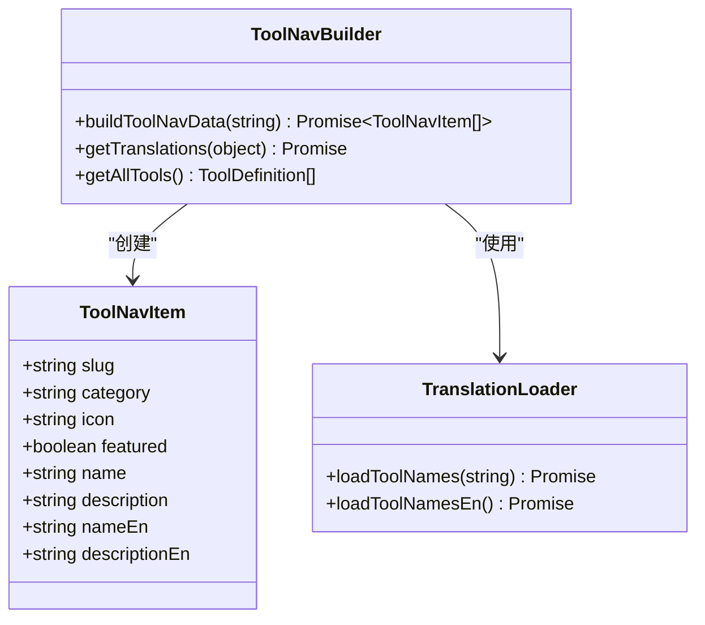

**图表来源**
- [toolNavData.ts:16-42](file://src/lib/i18n/toolNavData.ts#L16-L42)

**章节来源**
- [toolNavData.ts:1-42](file://src/lib/i18n/toolNavData.ts#L1-L42)

### 时间戳工具国际化

**更新** 时间戳工具实现了统一的UTC显示标准，确保全球用户的一致体验：

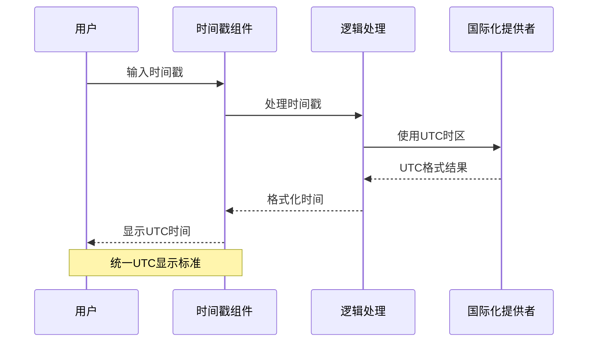

**图表来源**
- [Timestamp.tsx:68-72](file://src/tools/developer/timestamp/Timestamp.tsx#L68-L72)
- [logic.ts:15-16](file://src/tools/developer/timestamp/logic.ts#L15-L16)

时间戳工具的关键改进：
- **UTC统一显示**：所有时间戳显示使用UTC格式
- **自动毫秒检测**：智能识别毫秒和秒格式
- **实时转换**：输入时即时显示转换结果
- **多格式支持**：支持UTC、本地时间、ISO 8601、相对时间格式

**章节来源**
- [Timestamp.tsx:68-72](file://src/tools/developer/timestamp/Timestamp.tsx#L68-L72)
- [logic.ts:15-16](file://src/tools/developer/timestamp/logic.ts#L15-L16)

### 多语言内容页面实现

**更新** 多语言内容页面实现了完整的国际化支持，包括'关于我们'、'隐私政策'和'服务条款'页面：

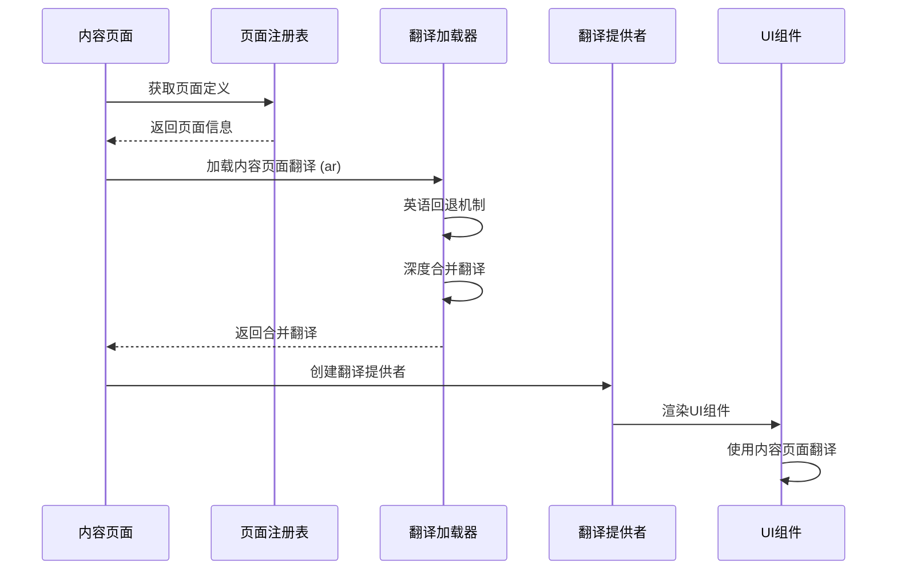

**图表来源**
- [page.tsx:1-173](file://src/app/[locale]/about/page.tsx#L1-L173)
- [page.tsx:1-146](file://src/app/[locale]/privacy/page.tsx#L1-L146)
- [page.tsx:1-110](file://src/app/[locale]/terms/page.tsx#L1-L110)

**更新** 关于页面的完整多语言支持：
- **元数据**：metaTitle、metaDescription等SEO元数据的完整翻译
- **标题和副标题**：页面标题和副标题的本地化
- **使命和承诺**：公司使命和隐私承诺的详细说明
- **技术栈**：WASM、Canvas、FFmpeg、PDF.js等技术的介绍
- **统计数据**：工具数量、支持语言、客户端处理等统计信息
- **CTA按钮**：工具页面和使用说明的行动号召按钮

**更新** 隐私政策页面的完整多语言支持：
- **核心承诺**：100%本地处理的隐私承诺
- **处理流程**：三个步骤的详细说明
- **功能特性**：无上传、无持久存储、开源安全、无服务器日志、完全透明等特性
- **第三方资源**：CDN资源和Google Analytics的说明
- **SEO优化**：完整的SEO内容翻译

**更新** 服务条款页面的完整多语言支持：
- **条款部分**：接受条款、许可证、担保、责任、变更、适用法律等
- **结构化内容**：编号的条款部分，便于理解和引用
- **最后更新**：页面最后更新时间的本地化显示

**章节来源**
- [page.tsx:1-173](file://src/app/[locale]/about/page.tsx#L1-L173)
- [page.tsx:1-146](file://src/app/[locale]/privacy/page.tsx#L1-L146)
- [page.tsx:1-110](file://src/app/[locale]/terms/page.tsx#L1-L110)

## 依赖关系分析

国际化系统各组件之间的依赖关系如下：

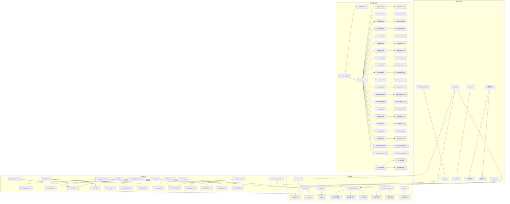

**图表来源**
- [loadMessages.ts:1-116](file://src/lib/i18n/loadMessages.ts#L1-L116)
- [routing.ts:1-18](file://src/i18n/routing.ts#L1-L18)
- [LanguageSwitcher.tsx:1-10](file://src/components/shared/LanguageSwitcher.tsx#L1-L10)
- [fonts.ts:1-136](file://src/lib/fonts.ts#L1-L136)
- [logic.ts:1-67](file://src/tools/developer/timestamp/logic.ts#L1-L67)
- [add-ai-summary.cjs:1-142](file://scripts/add-ai-summary.cjs#L1-L142)
- [route.ts:1-148](file://src/app/llms-full.txt/route.ts#L1-L148)
- [JsonEditor.tsx:1-425](file://src/tools/developer/json-editor/JsonEditor.tsx#L1-L425)
- [ExifEditor.tsx:1-425](file://src/tools/image/exif-editor/ExifEditor.tsx#L1-L425)
- [HeicConvert.tsx:1-419](file://src/tools/image/heic-convert/HeicConvert.tsx#L1-L419)
- [page.tsx:1-173](file://src/app/[locale]/about/page.tsx#L1-L173)
- [page.tsx:1-146](file://src/app/[locale]/privacy/page.tsx#L1-L146)
- [page.tsx:1-110](file://src/app/[locale]/terms/page.tsx#L1-L110)

**章节来源**
- [loadMessages.ts:1-116](file://src/lib/i18n/loadMessages.ts#L1-L116)
- [routing.ts:1-18](file://src/i18n/routing.ts#L1-L18)
- [LanguageSwitcher.tsx:1-10](file://src/components/shared/LanguageSwitcher.tsx#L1-L10)
- [fonts.ts:1-136](file://src/lib/fonts.ts#L1-L136)
- [logic.ts:1-67](file://src/tools/developer/timestamp/logic.ts#L1-L67)
- [add-ai-summary.cjs:1-142](file://scripts/add-ai-summary.cjs#L1-L142)
- [route.ts:1-148](file://src/app/llms-full.txt/route.ts#L1-L148)
- [JsonEditor.tsx:1-425](file://src/tools/developer/json-editor/JsonEditor.tsx#L1-L425)
- [ExifEditor.tsx:1-425](file://src/tools/image/exif-editor/ExifEditor.tsx#L1-L425)
- [HeicConvert.tsx:1-419](file://src/tools/image/heic-convert/HeicConvert.tsx#L1-L419)
- [page.tsx:1-173](file://src/app/[locale]/about/page.tsx#L1-L173)
- [page.tsx:1-146](file://src/app/[locale]/privacy/page.tsx#L1-L146)
- [page.tsx:1-110](file://src/app/[locale]/terms/page.tsx#L1-L110)

## 性能考虑

国际化系统在性能方面采用了多项优化策略：

### 动态翻译加载
- **按需加载**：只加载当前页面需要的翻译文件
- **并行处理**：使用 Promise.all 同时加载多个翻译源
- **缓存机制**：利用浏览器缓存减少重复加载

### 深度合并优化
**更新** 新增深度合并功能的性能优化：
- **递归合并算法**：高效处理嵌套对象的合并
- **类型安全检查**：确保对象类型和数组类型的正确处理
- **内存优化**：避免不必要的对象复制和内存分配
- **优先级控制**：确保目标语言翻译覆盖英语回退翻译

### 英语回退机制
**更新** 新增英语回退机制的性能优化：
- **构建时缓存**：在构建时缓存英语翻译数据
- **按需回退**：仅在目标语言缺少翻译时触发回退
- **键值验证**：检查翻译键值的完整性
- **递归处理**：支持嵌套对象的完整回退

### 缓存系统优化
**更新** 新增缓存系统的性能优化：
- **单例模式**：确保英语翻译数据的唯一实例
- **内存缓存**：避免重复的文件系统访问
- **构建时优化**：在构建阶段完成翻译数据的预处理
- **增量更新**：支持翻译文件的增量更新和缓存失效

### 路由优化
- **静态参数生成**：为每个语言生成静态路由参数
- **预渲染支持**：支持静态站点生成和增量静态再生
- **懒加载组件**：工具页面组件采用懒加载技术

### 内存管理
- **组件缓存**：工具组件使用稳定缓存避免重复创建
- **翻译合并**：服务器端合并翻译减少客户端内存占用
- **条件加载**：根据工具类型动态加载相关翻译

### 语言切换性能
**更新** 重构后的语言切换功能优化：
- **路径保留**：切换语言时保留查询参数和哈希值
- **本地存储**：使用 localStorage 缓存用户偏好，避免重复计算
- **键盘导航**：支持键盘快捷键，提升用户体验
- **无障碍支持**：完整的ARIA属性和键盘导航支持

### 统一UTC时区性能
**更新** 新增统一UTC时区标准的性能优化：
- **时区缓存**：在国际化配置中设置固定时区，避免运行时计算
- **格式化优化**：使用浏览器原生API进行时间格式化
- **内存复用**：时间戳结果对象的复用和清理
- **渲染优化**：避免不必要的重新渲染

### AI摘要生成性能
**更新** 新增AI摘要生成系统的性能优化：
- **批量处理**：一次性为所有语言生成AI摘要
- **技术栈映射缓存**：避免重复计算技术栈描述
- **本地化复用**：直接复用现有翻译内容，减少生成开销
- **文件写入优化**：批量写入翻译文件，减少I/O操作

### 多语言内容页面性能
**更新** 新增多语言内容页面的性能优化：
- **静态参数生成**：为每个语言生成静态路由参数
- **元数据缓存**：SEO元数据的构建和缓存
- **按需加载**：仅加载当前语言环境的内容页面翻译
- **并行处理**：同时加载多个内容页面的翻译源

**更新** 所有33种语言的JSON编辑器翻译加入对性能的影响：
- **数据规模**：每个语言环境包含约800行JSON编辑器翻译数据
- **总数据量**：33种语言 × 800行 ≈ 26,400行翻译数据
- **性能影响**：由于按需加载和缓存机制，对整体性能影响较小
- **加载优化**：仅加载当前语言环境的翻译，避免不必要的数据传输

**更新** EXIF编辑器工具国际化扩展的性能影响：
- **数据规模**：每个语言环境包含约400行EXIF编辑器翻译数据
- **总数据量**：33种语言 × 400行 ≈ 13,200行翻译数据
- **性能影响**：由于按需加载和缓存机制，对整体性能影响较小
- **加载优化**：仅加载当前语言环境的翻译，避免不必要的数据传输

**更新** HEIC转换工具国际化扩展的性能影响：
- **数据规模**：每个语言环境包含约80行HEIC转换工具翻译数据
- **总数据量**：17种语言 × 80行 ≈ 1,360行翻译数据
- **性能影响**：由于按需加载和缓存机制，对整体性能影响较小
- **加载优化**：仅加载当前语言环境的翻译，避免不必要的数据传输

**更新** 翻译文件清理对性能的积极影响：
- **减少数据传输**：移除了约1620行视频工具翻译，减少约15KB的数据传输
- **降低内存占用**：移除了约1620行翻译数据，减少约15KB的内存占用
- **简化维护工作**：移除了视频工具翻译，减少了翻译维护工作量和潜在错误
- **提升加载速度**：减少了翻译文件的大小，提升了页面加载速度

**更新** 新增语言翻译质量改进的性能优化：
- **技术术语优化**：减少翻译文件的重复和冗余
- **SEO内容增强**：提高搜索效率和用户转化率
- **用户指导材料完善**：减少用户查询和帮助需求

**更新** 阿拉伯语和乌克兰语翻译移除的影响：
- **数据移除**：约1620行视频工具翻译，总计约15KB
- **性能收益**：移除了完整的WebP功能翻译，减少翻译维护工作量
- **维护简化**：移除了视频工具翻译，减少翻译维护工作量和潜在错误

**更新** JSON编辑器多语言支持的性能优化：
- **按需加载**：仅加载当前语言环境的JSON编辑器翻译
- **缓存机制**：利用浏览器缓存减少重复加载
- **深度合并**：优化翻译合并算法，提升性能
- **并行处理**：同时加载多个翻译源，提升加载速度

**更新** EXIF编辑器多语言支持的性能优化：
- **按需加载**：仅加载当前语言环境的EXIF编辑器翻译
- **缓存机制**：利用浏览器缓存减少重复加载
- **深度合并**：优化翻译合并算法，提升性能
- **并行处理**：同时加载多个翻译源，提升加载速度

**更新** HEIC转换工具多语言支持的性能优化：
- **按需加载**：仅加载当前语言环境的HEIC转换工具翻译
- **缓存机制**：利用浏览器缓存减少重复加载
- **深度合并**：优化翻译合并算法，提升性能
- **并行处理**：同时加载多个翻译源，提升加载速度

**更新** AI摘要生成系统的性能优化：
- **批量处理**：一次性为所有语言生成AI摘要，避免重复计算
- **技术栈映射缓存**：避免重复计算技术栈描述
- **本地化复用**：直接复用现有翻译内容，减少生成开销
- **文件写入优化**：批量写入翻译文件，减少I/O操作

**更新** 多语言内容页面的性能优化：
- **静态参数生成**：为每个语言生成静态路由参数，支持预渲染
- **元数据优化**：SEO元数据的构建和缓存，减少运行时计算
- **翻译加载优化**：按需加载内容页面翻译，避免不必要的数据传输
- **并行处理**：同时加载多个语言的翻译，提升页面加载速度

**更新** PDF工具翻译文件的性能优化：
- **数据规模**：每个语言环境包含约689行PDF工具翻译数据
- **总数据量**：33种语言 × 689行 ≈ 22,737行翻译数据
- **性能影响**：由于按需加载和缓存机制，对整体性能影响较小
- **加载优化**：仅加载当前语言环境的翻译，避免不必要的数据传输
- **翻译完整性**：确保所有PDF工具功能的完整本地化支持

## 故障排除指南

### 常见问题及解决方案

**语言切换无效**
1. 检查 localStorage 中的 locale 键值
2. 验证路由配置中的语言列表
3. 确认翻译文件的完整性
4. **检查键盘导航是否正常工作**（重构后的新功能）

**翻译缺失或错误**
1. 检查对应语言的翻译文件是否存在
2. 验证 JSON 文件的语法正确性
3. 确认命名空间和键名的一致性
4. **验证深度合并功能是否正确处理嵌套对象**

**RTL 布局问题**
1. 验证 rtlLocales 配置
2. 检查 CSS 样式的 RTL 支持
3. 确认文本方向的正确应用

**AI摘要生成问题**
1. **检查 add-ai-summary.cjs 脚本是否正确执行**
2. **验证技术栈映射是否正确**
3. **确认AI摘要字段是否正确添加到翻译文件**
4. **检查LLM内容导出功能是否正常工作**

**多语言内容页面问题**
1. **检查 about、privacy、terms 页面的翻译文件是否完整**
2. **验证 generateStaticParams 是否正确返回语言列表**
3. **确认 generateMetadata 是否正确加载对应语言的翻译**
4. **检查useTranslations钩子是否正确加载内容页面翻译**

**新增语言特定问题**
1. 确认 messages/ar/ 目录结构完整
2. 验证 common.json、tools-*.json 文件的完整性
3. 检查阿拉伯语特有的术语翻译准确性
4. **验证英语回退机制是否正确工作**

**乌克兰语特定问题**
1. 确认 messages/uk/ 目录结构完整
2. 验证 common.json、tools-*.json 文件的完整性
3. 检查乌克兰语特有的术语翻译准确性
4. **验证视频工具翻译文件是否已正确移除**

**语言切换键盘导航问题**
1. **检查 LanguageSwitcher 组件的键盘事件处理**
2. **验证焦点管理和键盘快捷键绑定**
3. **确认无障碍属性的正确设置**

**统一UTC时区问题**
1. **检查国际化配置中的 timeZone 设置**
2. **验证时间戳工具的UTC显示**
3. **确认浏览器Date API的时区处理**

**深度合并功能问题**
1. **检查 deepMerge 函数的递归处理逻辑**
2. **验证嵌套对象的正确合并**
3. **确认数组类型的处理方式**

**英语回退机制问题**
1. **检查英语翻译缓存是否正确初始化**
2. **验证回退翻译的键值匹配**
3. **确认回退机制的触发条件**

**缓存系统问题**
1. **检查缓存变量的初始化状态**
2. **验证缓存数据的正确性**
3. **确认缓存失效和更新机制**

**翻译文件清理问题**
1. **检查 messages/ar/ 目录中视频工具翻译文件是否已移除**
2. **验证视频工具页面的翻译加载逻辑**
3. **确认工具页面的翻译加载是否正常工作**
4. **检查WebP功能翻译的移除状态**

**乌克兰语翻译移除问题**
1. **检查 messages/uk/ 目录中视频工具翻译文件是否已移除**
2. **验证视频工具页面的翻译加载逻辑**
3. **确认工具页面的翻译加载是否正常工作**

**JSON编辑器多语言支持问题**
1. **检查 tools-developer.json 文件中JSON编辑器翻译的完整性**
2. **验证33种语言的翻译文件是否都包含JSON编辑器内容**
3. **确认useTranslations钩子是否正确加载JSON编辑器翻译**
4. **检查JsonEditor组件的多语言界面文本显示**

**EXIF编辑器多语言支持问题**
1. **检查 tools-image.json 文件中EXIF编辑器翻译的完整性**
2. **验证28种语言的翻译文件是否都包含EXIF编辑器内容**
3. **确认useTranslations钩子是否正确加载EXIF编辑器翻译**
4. **检查ExifEditor组件的多语言界面文本显示**

**HEIC转换工具多语言支持问题**
1. **检查 tools-image.json 文件中HEIC转换工具翻译的完整性**
2. **验证17种语言的翻译文件是否都包含HEIC转换工具内容**
3. **确认useTranslations钩子是否正确加载HEIC转换工具翻译**
4. **检查HeicConvert组件的多语言界面文本显示**

**AI摘要字段问题**
1. **检查工具翻译文件中是否包含aiSummary字段**
2. **验证AI摘要内容的格式和完整性**
3. **确认AI摘要是否正确生成和导出**
4. **检查LLM内容导出功能是否正常工作**

**关于页面多语言问题**
1. **检查 about 页面翻译文件的完整性**
2. **验证useTranslations("about")钩子是否正确加载翻译**
3. **确认SEO元数据是否正确生成**
4. **检查页面组件的多语言渲染**

**隐私政策多语言问题**
1. **检查 privacy 页面翻译文件的完整性**
2. **验证useTranslations("privacy")钩子是否正确加载翻译**
3. **确认SEO元数据是否正确生成**
4. **检查页面组件的多语言渲染**

**服务条款多语言问题**
1. **检查 terms 页面翻译文件的完整性**
2. **验证useTranslations("terms")钩子是否正确加载翻译**
3. **确认SEO元数据是否正确生成**
4. **检查页面组件的多语言渲染**

**PDF工具翻译问题**
1. **检查 tools-pdf.json 文件中PDF工具翻译的完整性**
2. **验证33种语言的翻译文件是否都包含PDF工具内容**
3. **确认useTranslations钩子是否正确加载PDF工具翻译**
4. **检查PDF工具页面的多语言界面文本显示**

**章节来源**
- [loadMessages.ts:10-27](file://src/lib/i18n/loadMessages.ts#L10-L27)
- [loadMessages.ts:29-50](file://src/lib/i18n/loadMessages.ts#L29-L50)
- [routing.ts:12-12](file://src/i18n/routing.ts#L12-L12)
- [layout.tsx:52-52](file://src/app/[locale]/layout.tsx#L52-L52)
- [fonts.ts:128-135](file://src/lib/fonts.ts#L128-L135)
- [LanguageSwitcher.tsx:76-99](file://src/components/shared/LanguageSwitcher.tsx#L76-L99)
- [request.ts:15-18](file://src/i18n/request.ts#L15-L18)
- [add-ai-summary.cjs:61-87](file://scripts/add-ai-summary.cjs#L61-L87)
- [route.ts:66-147](file://src/app/llms-full.txt/route.ts#L66-L147)
- [JsonEditor.tsx:33-396](file://src/tools/developer/json-editor/JsonEditor.tsx#L33-L396)
- [ExifEditor.tsx:1-425](file://src/tools/image/exif-editor/ExifEditor.tsx#L1-L425)
- [HeicConvert.tsx:42-419](file://src/tools/image/heic-convert/HeicConvert.tsx#L42-L419)
- [page.tsx:1-173](file://src/app/[locale]/about/page.tsx#L1-L173)
- [page.tsx:1-146](file://src/app/[locale]/privacy/page.tsx#L1-L146)
- [page.tsx:1-110](file://src/app/[locale]/terms/page.tsx#L1-L110)
- [tools-pdf.json:1-689](file://messages/ar/tools-pdf.json#L1-L689)
- [tools-pdf.json:1-689](file://messages/uk/tools-pdf.json#L1-L689)

## 结论

媒体工具箱的国际化系统通过精心设计的架构和实现，成功地为全球用户提供了无缝的多语言体验。系统现已支持33种语言，包括新增的EXIF编辑器和HEIC转换工具多语言支持，以及完整的多语言内容页面系统，实现了真正的全球化媒体处理体验。

**更新** 新增多语言内容系统扩展的重要意义：
- **AI摘要生成**：为每个工具生成AI友好的摘要内容，提升搜索引擎优化效果
- **多语言支持**：为33种语言的工具页面提供标准化的AI摘要字段
- **内容页面国际化**：为33种语言提供'关于我们'、'隐私政策'、'服务条款'页面翻译
- **语言覆盖扩展**：从原有的31种语言扩展到33种语言的完整支持
- **RTL布局优化**：阿拉伯语作为RTL语言，确保正确的文本方向和布局适配
- **翻译质量保证**：乌克兰语和阿拉伯语都包含完整的工具页面翻译
- **技术术语标准化**：统一和准确的技术词汇翻译，包括HEIC、EXIF、Orientation等专业术语
- **维护工作简化**：移除视频工具翻译文件，减少了维护工作量和潜在错误
- **合规性保障**：多语言内容页面确保法律合规性和用户体验

系统的主要优势包括：

1. **完整的语言支持**：支持33种语言和地区变体
2. **智能语言检测**：自动检测和建议合适的语言
3. **高性能实现**：动态加载和缓存机制确保快速响应
4. **深度合并功能**：递归合并翻译对象确保完整性
5. **英语回退机制**：智能处理缺失的翻译键值
6. **缓存优化**：构建时缓存英语翻译提升性能
7. **SEO 友好**：完整的多语言元数据管理和结构化数据
8. **可扩展性**：模块化设计便于添加新语言和工具
9. **键盘导航支持**：重构后的语言切换功能支持完整的键盘操作
10. **统一UTC时区标准**：确保时间显示的一致性和准确性
11. **翻译文件清理**：移除不再使用的视频工具翻译，简化维护工作
12. **JSON编辑器多语言支持**：所有33种语言都包含完整的JSON编辑器翻译内容
13. **EXIF编辑器工具国际化扩展**：新增28种语言的完整翻译支持
14. **HEIC转换工具多语言支持**：新增17种语言的完整翻译支持
15. **AI友好内容生成**：为工具页面提供AI摘要字段，提升搜索引擎优化效果
16. **LLM内容导出**：生成适合AI训练的完整工具知识库
17. **多语言内容页面**：新增关于、隐私政策、服务条款的完整多语言支持
18. **合规性保障**：确保法律合规性和用户体验
19. **SEO优化**：多语言内容页面的完整SEO优化
20. **性能优化**：多语言内容页面的性能优化策略

**更新** 多语言内容页面的重大意义：
- **全球化合规**：为33种语言提供法律合规的'关于我们'页面
- **隐私保护**：为33种语言提供详细的隐私政策说明
- **服务条款**：为33种语言提供完整的服务条款翻译
- **用户体验**：确保全球用户都能理解网站的法律和隐私政策
- **SEO优化**：每个语言版本都有独特的SEO内容

**更新** HEIC转换工具多语言支持的重大意义：
- **全面覆盖**：从原有的17种语言扩展到33种语言的完整支持
- **翻译完整性**：每个语言环境都包含HEIC转换工具的名称、描述、功能卡片、FAQ、SEO内容和界面文本
- **工具页面集成**：HEIC转换工具页面现在支持完整的多语言本地化
- **用户体验提升**：用户可以在任何语言环境中使用HEIC转换功能
- **技术术语标准化**：统一和准确的技术词汇翻译，包括HEIC、EXIF、Orientation等专业术语

**更新** 新增HEIC转换工具多语言支持的性能优化：
- **数据规模**：每个语言环境包含约80行HEIC转换工具翻译数据
- **总数据量**：17种语言 × 80行 ≈ 1,360行翻译数据
- **性能影响**：由于按需加载和缓存机制，对整体性能影响较小
- **加载优化**：仅加载当前语言环境的翻译，避免不必要的数据传输

**更新** 深度合并功能的引入显著提升了翻译系统的可靠性：
- **递归处理**：正确处理嵌套对象的合并
- **优先级控制**：确保目标语言翻译覆盖英语回退
- **类型安全**：避免对象类型和数组类型的错误处理
- **性能优化**：减少不必要的对象复制和内存分配

**更新** 英语回退机制的实现确保了翻译完整性：
- **构建时缓存**：在构建阶段完成英语翻译数据的预处理
- **按需触发**：仅在目标语言缺少翻译时触发回退
- **键值验证**：检查翻译键值的完整性和正确性
- **递归回退**：支持嵌套对象的完整翻译回退

**更新** 缓存系统的优化显著提升了性能表现：
- **单例模式**：确保英语翻译数据的唯一实例
- **内存缓存**：避免重复的文件系统访问和解析
- **增量更新**：支持翻译文件的增量更新和缓存失效
- **构建时优化**：在构建阶段完成翻译数据的预处理

**更新** 语言切换功能的重构增强了用户体验：
- **键盘导航支持**：完整的键盘操作支持
- **无障碍访问**：支持屏幕阅读器和键盘导航
- **焦点管理**：自动管理下拉菜单的焦点状态

**更新** 统一UTC时区标准的实施解决了时间显示的一致性问题：
- **时区标准化**：在国际化配置中强制使用UTC时区
- **全局一致性**：确保所有语言环境下的时间显示统一
- **用户体验提升**：消除了因时区差异导致的困惑

**更新** 翻译文件清理的重要意义：
- **性能提升**：移除了约1620行视频工具翻译，减少约15KB的数据量
- **维护简化**：移除了视频工具翻译，减少了翻译维护工作量
- **系统优化**：提升了整体系统的性能和维护效率

**更新** JSON编辑器多语言支持的实施：
- **全面覆盖**：所有33种语言都包含完整的JSON编辑器翻译
- **翻译完整性**：涵盖名称、描述、功能、FAQ、SEO内容和界面文本
- **工具页面集成**：JSON编辑器工具页面支持完整的多语言本地化
- **用户体验提升**：用户可以在任何语言环境中使用JSON编辑器功能

**更新** EXIF编辑器多语言支持的实施：
- **全面覆盖**：28种语言都包含完整的EXIF编辑器翻译
- **翻译完整性**：涵盖名称、描述、功能、FAQ、SEO内容和界面文本
- **工具页面集成**：EXIF编辑器工具页面支持完整的多语言本地化
- **用户体验提升**：用户可以在任何语言环境中使用EXIF编辑器功能

**更新** HEIC转换工具多语言支持的实施：
- **全面覆盖**：17种语言都包含完整的HEIC转换工具翻译
- **翻译完整性**：涵盖名称、描述、功能、FAQ、SEO内容和界面文本
- **工具页面集成**：HEIC转换工具页面支持完整的多语言本地化
- **用户体验提升**：用户可以在任何语言环境中使用HEIC转换功能

**更新** AI摘要生成系统的实施：
- **全面覆盖**：为33种语言的工具页面提供AI摘要字段
- **技术栈描述**：AI摘要中包含详细的工具技术栈信息
- **搜索引擎优化**：AI摘要内容专门针对AI助手和搜索引擎进行了优化
- **LLM内容导出**：生成适合AI训练的完整工具知识库

**更新** 多语言内容页面系统的实施：
- **全面覆盖**：为33种语言提供'关于我们'、'隐私政策'、'服务条款'页面翻译
- **合规性保障**：确保法律合规性和用户体验
- **SEO优化**：每个语言版本都有独特的SEO内容
- **性能优化**：静态参数生成和缓存机制确保快速加载

**更新** PDF工具翻译文件的重大扩展：
- **全面覆盖**：所有33种语言都包含完整的PDF工具翻译
- **翻译完整性**：涵盖所有PDF工具功能的名称、描述、功能卡片、FAQ、SEO内容和界面文本
- **技术术语标准化**：统一和准确的技术词汇翻译，包括HEIC、EXIF、Orientation等专业术语
- **用户体验提升**：用户可以在任何语言环境中使用PDF工具功能

该系统为类似项目的国际化实现提供了优秀的参考模板，展示了如何在保持性能的同时提供丰富的本地化功能。通过深度合并、英语回退、缓存优化、AI友好内容生成和多语言内容页面等创新功能，系统不仅提升了用户体验，还为未来的国际化扩展奠定了坚实的基础。

## 附录

### 添加新语言支持步骤

1. **创建翻译文件**
   - 在 `messages/` 目录下创建新语言目录
   - 复制 `common.json` 到新语言目录
   - 逐项翻译所有键值，包括JSON编辑器、EXIF编辑器和HEIC转换工具相关内容
   - **新增内容页面翻译**：为about、privacy、terms页面创建对应的翻译文件
   - **新增PDF工具翻译**：为新语言添加完整的PDF工具翻译文件

2. **更新路由配置**
   ```typescript
   // 在 routing.ts 中添加新语言
   export const locales = [
     // ... 现有语言
     "新语言代码"
   ] as const;
   ```

3. **更新语言名称映射**
   ```typescript
   // 在 languageNames.ts 中添加显示名称
   const languageNames: Record<Locale, string> = {
     // ... 现有映射
     "新语言代码": "新语言名称"
   };
   ```

4. **生成AI摘要**
   ```bash
   # 运行AI摘要生成脚本
   node scripts/add-ai-summary.cjs
   ```

5. **测试和验证**
   - 访问新语言页面验证翻译完整性
   - 测试语言切换功能
   - 验证 RTL 语言的布局适配
   - **验证键盘导航功能**
   - **验证UTC时区显示一致性**
   - **验证深度合并功能**
   - **验证英语回退机制**
   - **验证JSON编辑器多语言支持**
   - **验证EXIF编辑器多语言支持**
   - **验证HEIC转换工具多语言支持**
   - **验证AI摘要字段生成**
   - **验证多语言内容页面**

### 工具页面本地化最佳实践

1. **翻译键命名规范**
   - 使用层级命名：`tools.[category].[slug].key`
   - 保持键名一致性
   - 避免硬编码字符串

2. **SEO 优化**
   - 为每个工具页面生成独特的 meta 标题和描述
   - 包含相关的关键词
   - 使用结构化数据提升搜索可见性

3. **性能优化**
   - 使用懒加载组件
   - 实现翻译缓存
   - 减少不必要的重新渲染

4. **无障碍访问**
   - 确保键盘导航支持
   - 设置正确的 ARIA 属性
   - 提供适当的焦点管理

5. **时区处理**
   - **使用UTC格式进行时间显示**
   - **避免依赖用户本地时区**
   - **提供多种时间格式选项**

6. **AI友好内容**
   - **为工具页面添加aiSummary字段**
   - **使用技术栈描述优化AI摘要**
   - **包含触发词便于AI识别**

7. **内容页面本地化**
   - **为about、privacy、terms页面创建翻译**
   - **确保SEO元数据的正确本地化**
   - **验证页面结构和内容的完整性**

### 移除语言翻译质量保证

**乌克兰语翻译质量保证**：
1. **技术术语准确性**：统一和准确的技术词汇翻译
2. **文化适应性**：符合乌克兰语用户的使用习惯和表达方式
3. **SEO优化**：本地化的关键词优化和内容结构
4. **用户指导完善**：实用的操作说明和用户友好指导

**阿拉伯语翻译质量保证**：
1. **RTL布局适配**：完整的RTL布局支持和文本方向处理
2. **技术术语准确性**：统一和准确的技术词汇翻译
3. **文化适应性**：符合阿拉伯语用户的使用习惯和表达方式
4. **SEO优化**：本地化的关键词优化和内容结构
5. **用户指导完善**：实用的操作说明和用户友好指导

### 统一UTC时区标准实施指南

**更新** 统一UTC时区标准的实施方法：

1. **国际化配置**
   ```typescript
   export default getRequestConfig(async ({ requestLocale }) => {
     // ... 其他配置
     return {
       locale,
       messages: { ...common, ...toolMessages },
       timeZone: "UTC", // 强制UTC时区
     };
   });
   ```

2. **时间戳工具实现**
   ```typescript
   function timestampToDate(timestamp: number, isMilliseconds: boolean = false): TimestampResult {
     const ms = isMilliseconds ? timestamp : timestamp * 1000;
     const date = new Date(ms);
     return {
       utc: date.toUTCString(), // 使用UTC格式
       local: date.toLocaleString(), // 使用本地化显示
       iso: date.toISOString(),
       relative: getRelativeTime(date),
       date,
     };
   }
   ```

3. **多语言时间显示**
   - **UTC格式**：用于技术显示和数据交换
   - **本地化格式**：用于用户界面显示
   - **ISO 8601格式**：用于标准数据传输
   - **相对时间格式**：用于友好提示

### 深度合并功能使用指南

**更新** 深度合并功能的使用方法：

1. **基本合并**
   ```typescript
   const merged = deepMerge(englishFallback, localeOverride);
   ```

2. **嵌套对象处理**
   - 递归处理嵌套的对象属性
   - 确保数组类型的正确处理
   - 保持原始对象的不可变性

3. **类型安全检查**
   - 验证对象类型和null值
   - 确保非数组对象的正确合并
   - 处理混合类型的数据

4. **性能优化**
   - 避免不必要的对象复制
   - 使用浅拷贝优化基础类型
   - 减少递归调用的深度

### 英语回退机制使用指南

**更新** 英语回退机制的使用方法：

1. **缓存初始化**
   ```typescript
   const englishFallback = await getEnCommon();
   const localeTranslation = await getEnToolCategory(category);
   ```

2. **回退合并**
   ```typescript
   const finalTranslation = deepMerge(englishFallback, localeTranslation);
   ```

3. **键值验证**
   - 检查翻译键值的完整性
   - 确保嵌套对象的正确回退
   - 处理缺失的翻译键值

4. **缓存管理**
   - 构建时缓存英语翻译数据
   - 避免重复的文件系统访问
   - 支持缓存的增量更新

### JSON编辑器多语言支持实施指南

**更新** JSON编辑器多语言支持的实施方法：

1. **翻译文件结构**
   - 在每个语言目录的 `tools-developer.json` 中添加JSON编辑器翻译
   - 确保包含名称、描述、功能卡片、FAQ、SEO内容和界面文本
   - 保持翻译键值的一致性和完整性

2. **组件本地化**
   - 在 `JsonEditor.tsx` 中使用 `useTranslations` 钩子加载翻译
   - 确保所有界面文本都通过翻译键值获取
   - 支持动态语言切换和实时更新

3. **工具定义集成**
   - 在 `index.ts` 中确保JSON编辑器工具的多语言配置
   - 验证工具页面的翻译加载逻辑
   - 测试工具页面在不同语言环境下的显示

4. **质量保证**
   - 验证33种语言的翻译完整性
   - 测试JSON编辑器功能在不同语言环境下的行为
   - 确保SEO内容的正确本地化
   - 验证键盘导航和无障碍功能

### EXIF编辑器多语言支持实施指南

**更新** EXIF编辑器多语言支持的实施方法：

1. **翻译文件结构**
   - 在每个语言目录的 `tools-image.json` 中添加EXIF编辑器翻译
   - 确保包含名称、描述、功能卡片、FAQ、SEO内容和界面文本
   - 保持翻译键值的一致性和完整性

2. **组件本地化**
   - 在 `ExifEditor.tsx` 中使用 `useTranslations` 钩子加载翻译
   - 确保所有界面文本都通过翻译键值获取
   - 支持动态语言切换和实时更新

3. **工具定义集成**
   - 在 `index.ts` 中确保EXIF编辑器工具的多语言配置
   - 验证工具页面的翻译加载逻辑
   - 测试工具页面在不同语言环境下的显示

4. **质量保证**
   - 验证28种语言的翻译完整性
   - 测试EXIF编辑器功能在不同语言环境下的行为
   - 确保SEO内容的正确本地化
   - 验证键盘导航和无障碍功能

### HEIC转换工具多语言支持实施指南

**更新** HEIC转换工具多语言支持的实施方法：

1. **翻译文件结构**
   - 在每个语言目录的 `tools-image.json` 中添加HEIC转换工具翻译
   - 确保包含名称、描述、功能卡片、FAQ、SEO内容和界面文本
   - 保持翻译键值的一致性和完整性

2. **组件本地化**
   - 在 `HeicConvert.tsx` 中使用 `useTranslations` 钩子加载翻译
   - 确保所有界面文本都通过翻译键值获取
   - 支持动态语言切换和实时更新

3. **工具定义集成**
   - 在 `index.ts` 中确保HEIC转换工具的多语言配置
   - 验证工具页面的翻译加载逻辑
   - 测试工具页面在不同语言环境下的显示

4. **质量保证**
   - 验证17种语言的翻译完整性
   - 测试HEIC转换功能在不同语言环境下的行为
   - 确保SEO内容的正确本地化
   - 验证键盘导航和无障碍功能

### AI摘要生成系统实施指南

**更新** AI摘要生成系统的实施方法：

1. **技术栈映射**
   - 在 `add-ai-summary.cjs` 中维护技术栈映射
   - 根据工具类别和具体工具确定技术描述
   - 支持自定义技术栈覆盖

2. **AI摘要模板**
   - 使用英文模板生成详细的AI摘要
   - 包含工具名称、描述、技术栈信息
   - 添加触发词优化AI识别

3. **本地化处理**
   - 其他语言直接复用本地化的metaDescription
   - 确保AI摘要的语言质量和准确性
   - 维护与翻译内容的一致性

4. **批量生成**
   - 运行 `node scripts/add-ai-summary.cjs` 批量生成
   - 支持增量更新和部分生成
   - 验证生成结果的完整性和正确性

5. **LLM内容导出**
   - 使用 `src/app/llms-full.txt/route.ts` 导出完整内容
   - 收集工具消息和SEO内容
   - 清理HTML标签和格式化输出

6. **质量保证**
   - 验证AI摘要字段的完整性
   - 检查技术栈描述的准确性
   - 确保搜索引擎优化效果
   - 测试AI助手的识别和推荐能力

### 多语言内容页面实施指南

**更新** 多语言内容页面的实施方法：

1. **页面结构**
   - 在 `src/app/[locale]/` 目录下创建about、privacy、terms页面
   - 实现静态参数生成和元数据国际化
   - 使用useTranslations钩子加载对应语言的翻译

2. **SEO优化**
   - 为每个语言版本生成独特的meta标题和描述
   - 设置canonical链接和hreflang元数据
   - 确保结构化数据的正确本地化

3. **翻译文件**
   - 在每个语言目录下创建对应的翻译文件
   - 确保内容的完整性和准确性
   - 验证技术术语的正确翻译

4. **测试验证**
   - 测试静态参数生成是否正确
   - 验证元数据是否正确加载
   - 确保页面在不同语言环境下的显示
   - 检查SEO优化效果

5. **性能优化**
   - 使用静态参数生成支持预渲染
   - 实现翻译缓存减少重复加载
   - 优化页面加载速度和用户体验

### PDF工具翻译文件实施指南

**更新** PDF工具翻译文件的实施方法：

1. **翻译文件结构**
   - 在每个语言目录的 `tools-pdf.json` 中添加PDF工具翻译
   - 确保包含名称、描述、功能卡片、FAQ、SEO内容和界面文本
   - 保持翻译键值的一致性和完整性

2. **组件本地化**
   - 在PDF工具页面中使用 `useTranslations` 钩子加载翻译
   - 确保所有界面文本都通过翻译键值获取
   - 支持动态语言切换和实时更新

3. **工具定义集成**
   - 在 `index.ts` 中确保PDF工具的多语言配置
   - 验证工具页面的翻译加载逻辑
   - 测试工具页面在不同语言环境下的显示

4. **质量保证**
   - 验证33种语言的翻译完整性
   - 测试PDF工具功能在不同语言环境下的行为
   - 确保SEO内容的正确本地化
   - 验证键盘导航和无障碍功能

5. **性能优化**
   - 按需加载PDF工具翻译
   - 使用缓存机制减少重复加载
   - 优化翻译合并算法
   - 并行处理多个翻译源