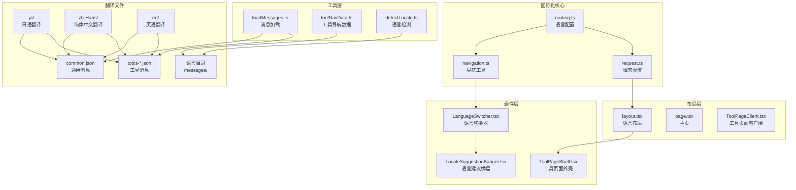
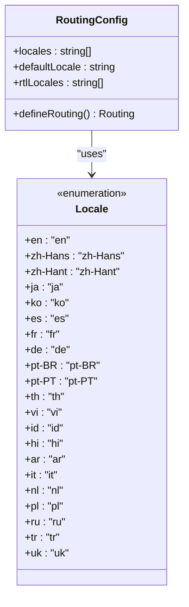
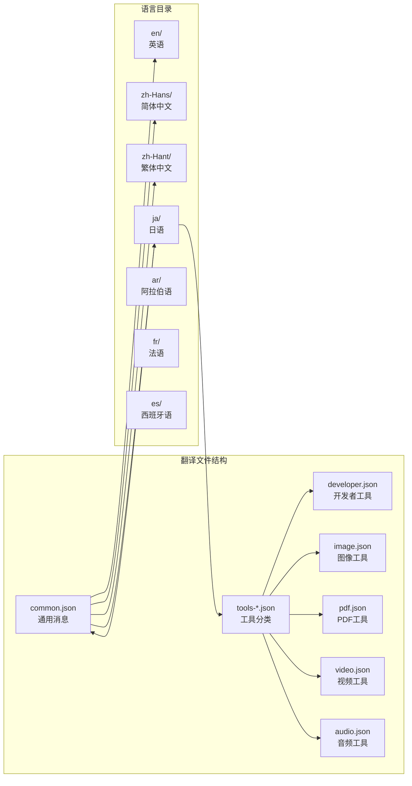
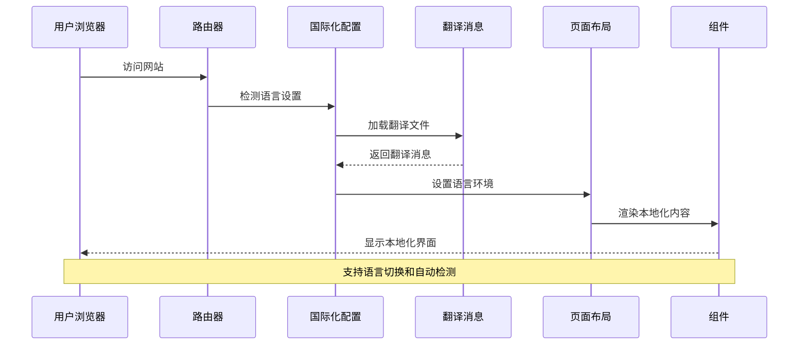
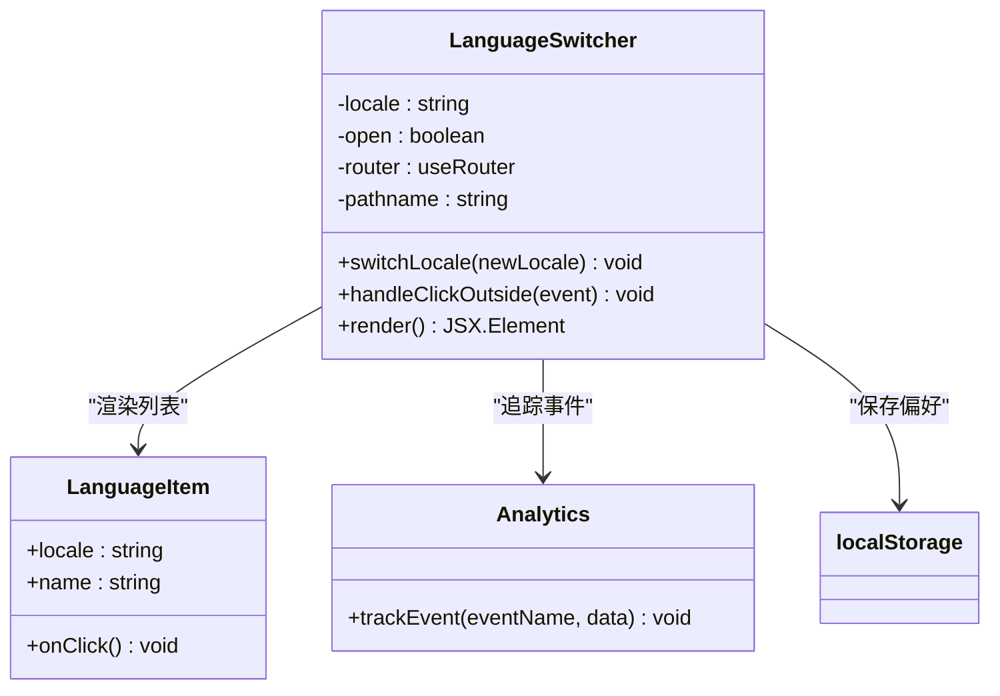
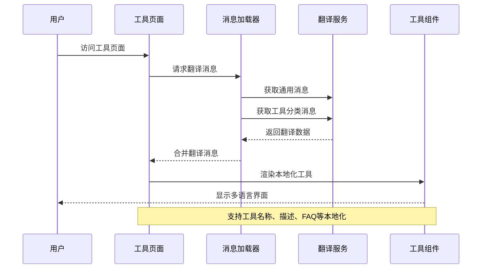

# 国际化系统

<cite>
**本文档引用的文件**
- [routing.ts](file://src/i18n/routing.ts)
- [navigation.ts](file://src/i18n/navigation.ts)
- [request.ts](file://src/i18n/request.ts)
- [LanguageSwitcher.tsx](file://src/components/shared/LanguageSwitcher.tsx)
- [LocaleSuggestionBanner.tsx](file://src/components/shared/LocaleSuggestionBanner.tsx)
- [layout.tsx](file://src/app/[locale]/layout.tsx)
- [page.tsx](file://src/app/[locale]/page.tsx)
- [loadMessages.ts](file://src/lib/i18n/loadMessages.ts)
- [languageNames.ts](file://src/lib/i18n/languageNames.ts)
- [detectLocale.ts](file://src/lib/i18n/detectLocale.ts)
- [toolNavData.ts](file://src/lib/i18n/toolNavData.ts)
- [page.tsx](file://src/app/[locale]/tools/[category]/[slug]/page.tsx)
- [ToolPageShell.tsx](file://src/components/tool/ToolPageShell.tsx)
- [common.json](file://messages/en/common.json)
- [tools-video.json](file://messages/en/tools-video.json)
- [common.json](file://messages/zh-Hans/common.json)
- [tools-video.json](file://messages/zh-Hans/tools-video.json)
- [common.json](file://messages/ja/common.json)
- [tools-developer.json](file://messages/ja/tools-developer.json)
- [tools-video.json](file://messages/ja/tools-video.json)
</cite>

## 更新摘要
**变更内容**
- 新增日语本地化改进的详细分析
- 更新翻译文件结构和内容优化
- 增强日语用户界面体验说明
- 扩展工具页面本地化实现细节

## 目录
1. [简介](#简介)
2. [项目结构](#项目结构)
3. [核心组件](#核心组件)
4. [架构概览](#架构概览)
5. [详细组件分析](#详细组件分析)
6. [日语本地化改进](#日语本地化改进)
7. [依赖关系分析](#依赖关系分析)
8. [性能考虑](#性能考虑)
9. [故障排除指南](#故障排除指南)
10. [结论](#结论)
11. [附录](#附录)

## 简介

媒体工具箱采用基于 next-intl 的国际化系统，实现了完整的多语言支持架构。该系统支持 21 种语言，包括英语、简体中文、繁体中文、日语、韩语、西班牙语、法语、德语、葡萄牙语（巴西和葡萄牙）、泰语、越南语、印尼语、印地语、阿拉伯语、意大利语、荷兰语、波兰语、俄语、土耳其语、乌克兰语等。

系统的核心特性包括：
- 基于 next-intl 的路由国际化配置
- 自动语言检测和重定向机制
- 分类管理的翻译文件结构
- 用户友好的语言切换体验
- 工具页面的动态本地化支持
- RTL 语言的布局适配
- SEO 友好的国际化优化

**更新** 新增对日语本地化的深入分析，展示了最新的翻译优化和用户体验改进。

## 项目结构

国际化系统在项目中的组织结构如下：



**图表来源**
- [routing.ts:1-18](file://src/i18n/routing.ts#L1-L18)
- [navigation.ts:1-6](file://src/i18n/navigation.ts#L1-L6)
- [request.ts:1-20](file://src/i18n/request.ts#L1-L20)

**章节来源**
- [routing.ts:1-18](file://src/i18n/routing.ts#L1-L18)
- [navigation.ts:1-6](file://src/i18n/navigation.ts#L1-L6)
- [request.ts:1-20](file://src/i18n/request.ts#L1-L20)

## 核心组件

### 语言路由配置

国际化系统的核心是基于 next-intl 的路由配置，支持 21 种语言的完整国际化：



**图表来源**
- [routing.ts:3-12](file://src/i18n/routing.ts#L3-L12)

系统支持的语言列表包括：
- **东亚语言**：中文（简体/繁体）、日语、韩语
- **欧洲语言**：英语、西班牙语、法语、德语、意大利语、荷兰语、葡萄牙语（巴西/葡萄牙）
- **其他语言**：俄语、土耳其语、乌克兰语、泰语、越南语、印尼语、印地语、阿拉伯语

**章节来源**
- [routing.ts:3-12](file://src/i18n/routing.ts#L3-L12)

### 翻译文件组织结构

翻译文件采用分类管理模式，实现了高效的资源组织：



**图表来源**
- [common.json:1-509](file://messages/ja/common.json#L1-L509)
- [tools-video.json:1-814](file://messages/ja/tools-video.json#L1-L814)

**章节来源**
- [common.json:1-509](file://messages/ja/common.json#L1-L509)
- [tools-video.json:1-814](file://messages/ja/tools-video.json#L1-L814)

## 架构概览

媒体工具箱的国际化系统采用分层架构设计，实现了从路由配置到页面渲染的完整国际化流程：



**图表来源**
- [routing.ts:14-18](file://src/i18n/routing.ts#L14-L18)
- [request.ts:6-19](file://src/i18n/request.ts#L6-L19)
- [layout.tsx:32-77](file://src/app/[locale]/layout.tsx#L32-L77)

系统架构的关键特点：
- **声明式路由配置**：使用 `defineRouting` 简化国际化路由设置
- **服务端消息加载**：在服务端预加载翻译消息，提升首屏性能
- **客户端语言切换**：支持用户主动切换语言，实时更新界面
- **自动语言检测**：根据浏览器语言偏好自动检测用户语言

**章节来源**
- [routing.ts:14-18](file://src/i18n/routing.ts#L14-L18)
- [request.ts:6-19](file://src/i18n/request.ts#L6-L19)
- [layout.tsx:32-77](file://src/app/[locale]/layout.tsx#L32-L77)

## 详细组件分析

### 语言检测与重定向机制

语言检测系统实现了智能的语言匹配算法，能够准确识别用户的语言偏好：

```mermaid
flowchart TD
A[用户访问网站] --> B{检查本地存储}
B --> |存在语言设置| C[使用存储的语言]
B --> |无存储设置| D{检查浏览器语言}
D --> E[解析浏览器语言列表]
E --> F{匹配支持的语言}
F --> |找到匹配| G[使用匹配语言]
F --> |无匹配| H[使用默认语言(en)]
C --> I[重定向到对应路由]
G --> I
H --> I
I --> J[加载翻译文件]
J --> K[渲染页面]
```

**图表来源**
- [LocaleSuggestionBanner.tsx:15-26](file://src/components/shared/LocaleSuggestionBanner.tsx#L15-L26)
- [detectLocale.ts:7-58](file://src/lib/i18n/detectLocale.ts#L7-L58)

语言检测的核心逻辑包括：
- **精确匹配**：完全匹配语言代码（如 `zh-Hans`）
- **区域匹配**：匹配语言区域（如 `pt-BR` → `pt-BR`）
- **简繁中文处理**：智能区分简体和繁体中文
- **葡萄牙语处理**：默认使用巴西葡萄牙语
- **语言前缀匹配**：匹配基础语言代码

**章节来源**
- [LocaleSuggestionBanner.tsx:15-26](file://src/components/shared/LocaleSuggestionBanner.tsx#L15-L26)
- [detectLocale.ts:7-58](file://src/lib/i18n/detectLocale.ts#L7-L58)

### 语言切换器组件

语言切换器提供了用户友好的语言切换界面，支持 21 种语言的一键切换：



**图表来源**
- [LanguageSwitcher.tsx:15-74](file://src/components/shared/LanguageSwitcher.tsx#L15-L74)
- [languageNames.ts:3-26](file://src/lib/i18n/languageNames.ts#L3-L26)

语言切换器的功能特性：
- **下拉菜单界面**：提供直观的语言选择界面
- **实时切换**：切换语言后立即更新页面内容
- **偏好保存**：使用 `localStorage` 保存用户语言偏好
- **事件追踪**：记录语言切换行为用于分析
- **键盘导航**：支持键盘快捷键操作

**章节来源**
- [LanguageSwitcher.tsx:15-74](file://src/components/shared/LanguageSwitcher.tsx#L15-L74)
- [languageNames.ts:3-26](file://src/lib/i18n/languageNames.ts#L3-L26)

### 工具页面国际化实现

工具页面的国际化实现了动态加载翻译、组件本地化和工具描述的多语言支持：



**图表来源**
- [page.tsx:33-109](file://src/app/[locale]/tools/[category]/[slug]/page.tsx#L33-L109)
- [loadMessages.ts:32-56](file://src/lib/i18n/loadMessages.ts#L32-L56)

工具页面国际化的实现细节：
- **动态消息加载**：按需加载特定工具的翻译消息
- **命名空间隔离**：使用 `tools.{category}.{slug}` 命名空间
- **SEO 优化**：生成多语言的 SEO 元数据
- **JSON-LD 结构化数据**：支持多语言的结构化搜索结果

**章节来源**
- [page.tsx:33-109](file://src/app/[locale]/tools/[category]/[slug]/page.tsx#L33-L109)
- [loadMessages.ts:32-56](file://src/lib/i18n/loadMessages.ts#L32-L56)

### RTL 语言支持策略

系统实现了对 RTL（从右到左）语言的完整支持，包括阿拉伯语等语言的布局适配：

```mermaid
graph TB
subgraph "RTL 支持架构"
A[rtlLocales 配置] --> B[dir="rtl" 属性]
B --> C[CSS RTL 样式]
C --> D[布局镜像]
D --> E[文本对齐调整]
E --> F[图标方向修正]
end
subgraph "支持的 RTL 语言"
G[阿拉伯语(ar)]
H[希伯来语(iw)]
I[波斯语(fa)]
end
A --> G
A --> H
A --> I
```

**图表来源**
- [routing.ts:12-12](file://src/i18n/routing.ts#L12-L12)
- [layout.tsx:52-52](file://src/app/[locale]/layout.tsx#L52-L52)

RTL 支持的具体实现：
- **动态方向检测**：根据语言配置自动设置 `dir` 属性
- **CSS 样式适配**：提供 RTL 专用的样式规则
- **布局镜像**：自动镜像页面布局和组件排列
- **文本对齐**：支持从右到左的文本显示

**章节来源**
- [routing.ts:12-12](file://src/i18n/routing.ts#L12-L12)
- [layout.tsx:52-52](file://src/app/[locale]/layout.tsx#L52-L52)

## 日语本地化改进

### 日语翻译文件优化

日语本地化系统经过全面优化，提供了高质量的日语用户体验：

#### 通用消息优化

日语通用消息文件包含了完整的界面本地化内容：

- **站点信息**：`"siteName"`、`"siteDescription"` 提供了准确的站点描述
- **用户界面元素**：按钮、输入框、提示信息的完整日语翻译
- **导航和分类**：所有导航项和工具分类的准确翻译
- **隐私和帮助信息**：详细的隐私政策和使用说明

#### 开发者工具本地化

开发者工具的完整日语本地化：

- **工具名称和描述**：每个开发工具的准确日语名称和功能描述
- **SEO 内容**：针对日语用户的搜索引擎优化内容
- **FAQ 和帮助**：详细的常见问题解答和技术支持
- **技术术语**：准确的编程和技术术语翻译

#### 视频工具本地化

视频编辑工具的全面日语支持：

- **工具功能**：视频压缩、转换、编辑等功能的详细说明
- **参数设置**：质量、分辨率、帧率等参数的日语描述
- **使用场景**：各种使用场景和最佳实践的说明
- **技术规格**：支持的格式和编码标准的详细信息

### 日语用户体验优化

#### 界面布局适配

- **文本长度适配**：考虑到日语文本的特点，优化了界面布局
- **按钮尺寸调整**：根据日语标签长度调整按钮大小
- **间距优化**：改善了日语界面的视觉平衡

#### 交互体验改进

- **加载状态**：`"ffmpegLoading"`、`"ffmpegLoadingHint"` 提供了清晰的处理状态
- **错误处理**：`"ffmpegLoadError"`、`"unsupportedVideoCodec"` 等错误信息的准确翻译
- **进度反馈**：处理过程中的实时状态更新

#### 无障碍访问支持

- **屏幕阅读器兼容**：确保日语界面的无障碍访问
- **键盘导航**：完整的键盘操作支持
- **高对比度模式**：支持高对比度显示模式

**章节来源**
- [common.json:1-509](file://messages/ja/common.json#L1-L509)
- [tools-developer.json:1-809](file://messages/ja/tools-developer.json#L1-L809)
- [tools-video.json:1-814](file://messages/ja/tools-video.json#L1-L814)

## 依赖关系分析

国际化系统的依赖关系展现了清晰的模块化架构：

```mermaid
graph TD
subgraph "核心依赖"
A[routing.ts] --> B[next-intl/routing]
C[navigation.ts] --> D[next-intl/navigation]
E[request.ts] --> F[next-intl/server]
end
subgraph "组件依赖"
G[LanguageSwitcher.tsx] --> H[@/i18n/routing]
G --> I[@/i18n/navigation]
J[LocaleSuggestionBanner.tsx] --> K[@/lib/i18n/detectLocale]
L[ToolPageShell.tsx] --> M[next-intl]
end
subgraph "工具依赖"
N[loadMessages.ts] --> O[@/lib/registry/types]
P[toolNavData.ts] --> Q[@/lib/registry]
R[detectLocale.ts] --> S[@/i18n/routing]
end
subgraph "布局依赖"
T[layout.tsx] --> U[NextIntlClientProvider]
V[page.tsx] --> W[NextIntlClientProvider]
X[ToolPageClient.tsx] --> Y[NextIntlClientProvider]
end
A --> G
A --> J
C --> G
E --> T
E --> V
N --> T
N --> V
P --> T
R --> J
```

**图表来源**
- [routing.ts:1-1](file://src/i18n/routing.ts#L1-L1)
- [navigation.ts:1-1](file://src/i18n/navigation.ts#L1-L1)
- [request.ts:1-1](file://src/i18n/request.ts#L1-L1)

**章节来源**
- [routing.ts:1-1](file://src/i18n/routing.ts#L1-L1)
- [navigation.ts:1-1](file://src/i18n/navigation.ts#L1-L1)
- [request.ts:1-1](file://src/i18n/request.ts#L1-L1)

## 性能考虑

国际化系统在性能方面采用了多项优化策略：

### 1. 消息加载优化

- **按需加载**：工具页面仅加载相关分类的翻译消息
- **并发加载**：使用 `Promise.all` 并发加载多个翻译文件
- **缓存机制**：浏览器自动缓存翻译文件，减少重复加载

### 2. 语言检测优化

- **本地存储**：优先使用 `localStorage` 中的语言设置
- **服务端检测**：在服务端进行语言检测，避免客户端重定向
- **智能降级**：当检测失败时快速降级到默认语言

### 3. SEO 性能优化

- **预渲染**：静态生成多语言页面，提升 SEO 表现
- **语言链接**：生成完整的语言切换链接结构
- **结构化数据**：提供多语言的 JSON-LD 结构化数据

## 故障排除指南

### 常见问题及解决方案

#### 1. 语言切换无效

**问题症状**：用户切换语言后页面未更新
**解决方案**：
- 检查 `localStorage` 中的语言设置是否正确保存
- 确认 `router.replace` 方法是否正确执行
- 验证翻译文件是否正确加载

#### 2. 语言检测错误

**问题症状**：系统无法正确识别用户语言
**解决方案**：
- 检查浏览器语言设置是否正确
- 验证 `detectBrowserLocale` 函数的逻辑
- 确认语言代码格式是否符合预期

#### 3. 翻译缺失

**问题症状**：某些文本显示为英文或键名
**解决方案**：
- 检查翻译文件是否存在对应键值
- 验证 JSON 文件格式是否正确
- 确认命名空间是否正确使用

**章节来源**
- [LanguageSwitcher.tsx:33-38](file://src/components/shared/LanguageSwitcher.tsx#L33-L38)
- [detectLocale.ts:7-58](file://src/lib/i18n/detectLocale.ts#L7-L58)

## 结论

媒体工具箱的国际化系统展现了现代前端国际化架构的最佳实践。通过基于 next-intl 的完整实现，系统成功解决了多语言支持的各个方面：

### 主要成就

1. **完整的语言支持**：支持 21 种语言，覆盖全球主要市场
2. **智能语言检测**：自动识别用户语言偏好，提供无缝体验
3. **高效的性能优化**：通过按需加载和缓存机制提升性能
4. **完善的 SEO 支持**：多语言页面结构化，提升搜索引擎可见性
5. **用户友好的界面**：直观的语言切换和建议功能

### 技术优势

- **模块化设计**：清晰的组件分离和职责划分
- **可扩展性**：易于添加新语言和新工具的国际化支持
- **维护性**：标准化的翻译文件结构和加载机制
- **可靠性**：完善的错误处理和降级机制

### 日语本地化特色

- **全面的翻译覆盖**：从通用界面到专业工具的完整本地化
- **用户体验优化**：针对日语用户的界面适配和交互改进
- **技术术语准确**：专业的编程和技术术语翻译
- **无障碍访问支持**：完整的无障碍功能支持

该国际化系统为媒体工具箱提供了坚实的基础，确保用户无论使用何种语言都能获得优质的本地化体验。

## 附录

### 添加新语言支持步骤

1. **添加翻译文件**
   - 在 `messages/` 目录下创建新语言的文件夹
   - 复制 `common.json` 到新语言目录
   - 翻译所有键值对

2. **更新语言配置**
   ```typescript
   // src/i18n/routing.ts
   export const locales = [
     "en", "zh-Hans", "zh-Hant", "ja", "ko",
     "es", "fr", "de", "pt-BR", "pt-PT",
     "th", "vi", "id", "hi", "ar",
     "it", "nl", "pl", "ru", "tr", "uk",
     "NEW_LANGUAGE_CODE"  // 新增语言代码
   ] as const;
   ```

3. **更新语言名称映射**
   ```typescript
   // src/lib/i18n/languageNames.ts
   export const languageNames: Record<Locale, string> = {
     // ... 现有映射
     "NEW_LANGUAGE_CODE": "新语言名称"
   };
   ```

### 本地化工具页面步骤

1. **创建翻译文件**
   - 在对应语言目录下创建 `tools-{category}.json`
   - 翻译工具名称、描述、FAQ 等内容

2. **更新消息加载**
   ```typescript
   // src/lib/i18n/loadMessages.ts
   export async function loadAllToolMessages(locale: string) {
     const categories = [
       "developer", "image", "pdf", "video", "audio",
       "NEW_CATEGORY"  // 新增工具分类
     ] as const;
   }
   ```

3. **验证翻译加载**
   - 在工具页面中验证翻译是否正确加载
   - 检查 SEO 元数据是否正确生成

### 翻译工作流程最佳实践

1. **翻译文件管理**
   - 使用统一的命名约定
   - 保持 JSON 结构的一致性
   - 定期清理未使用的翻译键

2. **质量保证**
   - 建立翻译审核流程
   - 使用翻译记忆库提高一致性
   - 进行多语言测试验证

3. **维护策略**
   - 建立翻译更新通知机制
   - 定期审查翻译质量
   - 建立社区贡献渠道

### 日语本地化最佳实践

1. **文化适应性**
   - 使用适当的敬语和礼貌表达
   - 考虑日语的语序和表达习惯
   - 确保技术术语的准确性

2. **界面适配**
   - 优化长文本的显示效果
   - 调整按钮和表单的尺寸
   - 改善视觉层次结构

3. **用户体验**
   - 提供清晰的操作指导
   - 确保无障碍访问功能
   - 优化加载和响应性能