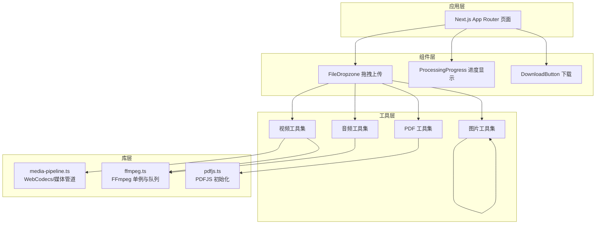
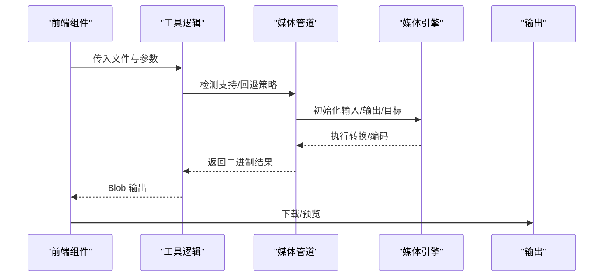
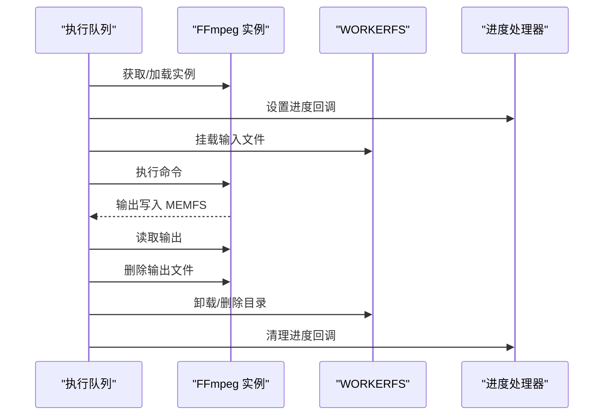
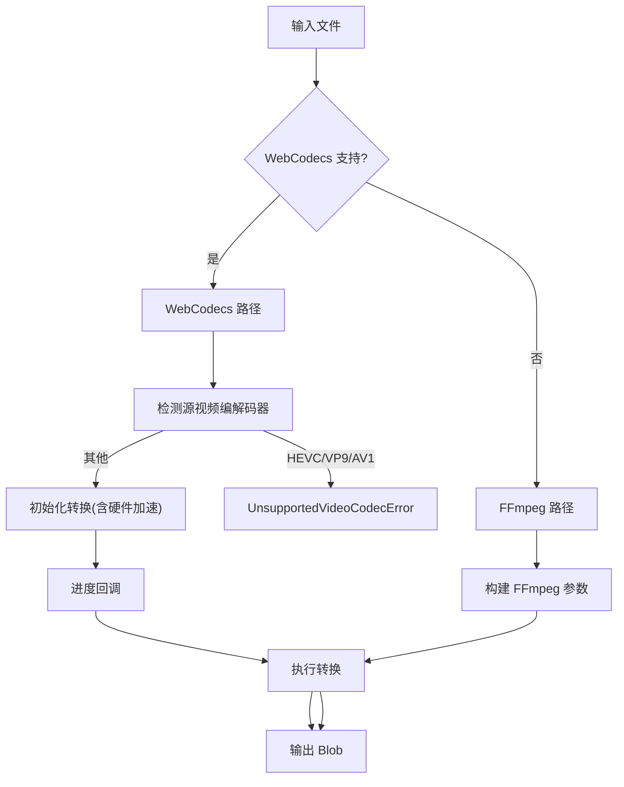
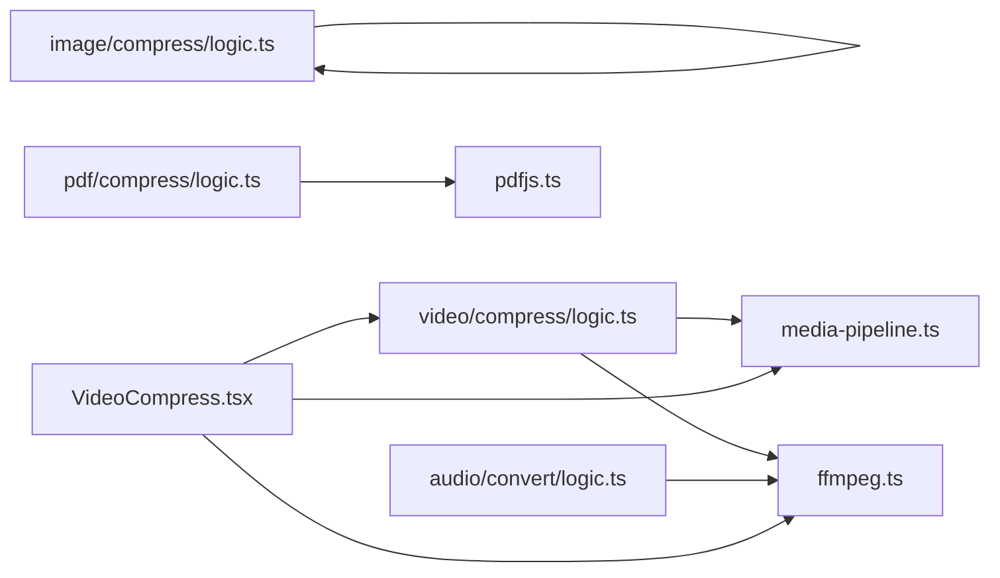

# 媒体处理管道

<cite>
**本文引用的文件**
- [README.md](file://README.md)
- [media-pipeline.ts](file://src/lib/media-pipeline.ts)
- [ffmpeg.ts](file://src/lib/ffmpeg.ts)
- [pdfjs.ts](file://src/lib/pdfjs.ts)
- [video/compress/logic.ts](file://src/tools/video/compress/logic.ts)
- [video/compress/VideoCompress.tsx](file://src/tools/video/compress/VideoCompress.tsx)
- [image/compress/logic.ts](file://src/tools/image/compress/logic.ts)
- [pdf/compress/logic.ts](file://src/tools/pdf/compress/logic.ts)
- [audio/convert/logic.ts](file://src/tools/audio/convert/logic.ts)
- [shared/ProcessingProgress.tsx](file://src/components/shared/ProcessingProgress.tsx)
- [shared/FileDropzone.tsx](file://src/components/shared/FileDropzone.tsx)
</cite>

## 目录
1. [简介](#简介)
2. [项目结构](#项目结构)
3. [核心组件](#核心组件)
4. [架构总览](#架构总览)
5. [详细组件分析](#详细组件分析)
6. [依赖关系分析](#依赖关系分析)
7. [性能考量](#性能考量)
8. [故障排查指南](#故障排查指南)
9. [结论](#结论)
10. [附录](#附录)

## 简介
本文件为“媒体工具箱”的媒体处理管道提供全面技术文档。系统在浏览器端完成全部媒体处理，不上传文件至服务器，支持多语言、PWA 离线可用，并通过 WebCodecs 与 FFmpeg.wasm 提供高性能的视频/音频处理能力；图片采用浏览器原生压缩库，PDF 使用 pdf-lib 与 pdfjs-dist 进行页面级重采样与嵌入。

## 项目结构
- 应用层：Next.js App Router 页面与工具页面组件
- 组件层：共享 UI 组件（拖拽上传、进度条、下载按钮等）
- 工具层：按类别划分的工具模块（image、video、audio、pdf、developer）
- 库层：媒体处理核心库（FFmpeg 单例、WebCodecs/媒体管道、PDFJS 初始化）

图表来源
- [README.md:55-78](file://README.md#L55-L78)
- [ffmpeg.ts:10-39](file://src/lib/ffmpeg.ts#L10-L39)
- [media-pipeline.ts:7-14](file://src/lib/media-pipeline.ts#L7-L14)
- [pdfjs.ts:3-13](file://src/lib/pdfjs.ts#L3-L13)

章节来源
- [README.md:55-78](file://README.md#L55-L78)

## 核心组件
- WebCodecs 媒体管道：基于 Mediabunny 的硬件加速视频/音频编解码，自动回退到 FFmpeg
- FFmpeg 单例与串行队列：统一加载、单线程执行、WORKERFS 直挂避免内存拷贝
- PDFJS 初始化：设置 worker 源，确保 PDF 工具可用
- 工具逻辑封装：各媒体类型处理参数、质量预设、CRF 映射、分辨率与帧率控制
- 前端交互：拖拽上传、进度显示、结果对比与下载

章节来源
- [media-pipeline.ts:7-175](file://src/lib/media-pipeline.ts#L7-L175)
- [ffmpeg.ts:10-144](file://src/lib/ffmpeg.ts#L10-L144)
- [pdfjs.ts:3-16](file://src/lib/pdfjs.ts#L3-L16)
- [video/compress/logic.ts:1-262](file://src/tools/video/compress/logic.ts#L1-L262)
- [image/compress/logic.ts:1-135](file://src/tools/image/compress/logic.ts#L1-L135)
- [pdf/compress/logic.ts:1-73](file://src/tools/pdf/compress/logic.ts#L1-L73)
- [audio/convert/logic.ts:1-35](file://src/tools/audio/convert/logic.ts#L1-L35)

## 架构总览
媒体处理管道遵循“前端 UI → 工具逻辑 → 媒体引擎（WebCodecs/FFmpeg/PDFJS）→ 结果输出”的数据流。UI 层负责文件选择、参数配置与进度反馈；工具逻辑负责参数解析与调用媒体引擎；媒体引擎负责实际编码/解码/渲染；最终输出 Blob 并提供下载。

图表来源
- [video/compress/VideoCompress.tsx:101-134](file://src/tools/video/compress/VideoCompress.tsx#L101-L134)
- [video/compress/logic.ts:87-112](file://src/tools/video/compress/logic.ts#L87-L112)
- [media-pipeline.ts:59-91](file://src/lib/media-pipeline.ts#L59-L91)
- [ffmpeg.ts:99-143](file://src/lib/ffmpeg.ts#L99-L143)

## 详细组件分析

### WebCodecs 媒体管道
- 能力检测：VideoEncoder/Decoder/AudioEncoder/AudioDecoder 是否可用
- 编解码器检测：支持 H.264/H.265 编码能力探测
- 源视频编解码器检测：识别 H.264/HEVC 等
- 转换校验：丢弃关键轨道（如不可解码的视频/未知源编解码器）时抛出回退错误
- 回退策略：对视频编解码器问题直接终止（UnsupportedVideoCodecError），对音频问题回退到 FFmpeg

图表来源
- [media-pipeline.ts:7-14](file://src/lib/media-pipeline.ts#L7-L14)
- [media-pipeline.ts:149-174](file://src/lib/media-pipeline.ts#L149-L174)
- [media-pipeline.ts:59-91](file://src/lib/media-pipeline.ts#L59-L91)

章节来源
- [media-pipeline.ts:7-175](file://src/lib/media-pipeline.ts#L7-L175)

### FFmpeg 单例与串行队列
- 单例加载：延迟加载、缓存实例、失败清理
- 进度监听：统一事件回调，范围归一化到 0-100
- 串行队列：保证 FFmpeg WASM 单线程安全，避免挂载点冲突
- WORKERFS 直挂：避免 fetchFile/writeFile 内存复制，按需读取
- 输出释放：读取后立即删除 MEMFS 文件，降低峰值内存

图表来源
- [ffmpeg.ts:75-82](file://src/lib/ffmpeg.ts#L75-L82)
- [ffmpeg.ts:99-143](file://src/lib/ffmpeg.ts#L99-L143)

章节来源
- [ffmpeg.ts:10-144](file://src/lib/ffmpeg.ts#L10-L144)

### 视频压缩工具
- 参数体系：质量预设、CRF、编码预设、分辨率、帧率、音频码率、最大码率
- CRF 到码率映射：根据分辨率缩放估算目标视频码率
- WebCodecs 优先：支持时优先使用硬件加速；遇到视频编解码器问题直接报错，音频问题回退 FFmpeg
- FFmpeg 回退：使用 scale/fps 滤镜与 libx264 编码，支持最大码率与缓冲区配置

图表来源
- [video/compress/logic.ts:87-112](file://src/tools/video/compress/logic.ts#L87-L112)
- [video/compress/logic.ts:114-206](file://src/tools/video/compress/logic.ts#L114-L206)
- [video/compress/logic.ts:208-261](file://src/tools/video/compress/logic.ts#L208-L261)
- [media-pipeline.ts:149-174](file://src/lib/media-pipeline.ts#L149-L174)

章节来源
- [video/compress/logic.ts:1-262](file://src/tools/video/compress/logic.ts#L1-L262)
- [video/compress/VideoCompress.tsx:45-134](file://src/tools/video/compress/VideoCompress.tsx#L45-L134)

### 图片压缩工具
- 格式支持：原始格式、JPEG、PNG、WebP、AVIF
- 压缩策略：browser-image-compression 默认路径；AVIF 使用 @jsquash/avif
- 尺寸与质量：支持自定义宽高或最大边长，EXIF 保留选项
- 结果统计：原始大小、压缩后大小、节省百分比

章节来源
- [image/compress/logic.ts:1-135](file://src/tools/image/compress/logic.ts#L1-L135)

### PDF 压缩工具
- 页面级重采样：逐页渲染到 Canvas，转 JPEG，再嵌入到新 PDF
- 质量配置：缩放比例与 JPEG 质量
- 进度回调：页索引与总数

章节来源
- [pdf/compress/logic.ts:1-73](file://src/tools/pdf/compress/logic.ts#L1-L73)
- [pdfjs.ts:3-13](file://src/lib/pdfjs.ts#L3-L13)

### 音频格式转换工具
- 格式映射：MP3、WAV、OGG、AAC、FLAC
- 参数构建：每种格式的编码器与质量参数
- 输出 MIME：按格式设置响应类型

章节来源
- [audio/convert/logic.ts:1-35](file://src/tools/audio/convert/logic.ts#L1-L35)

### 前端交互与状态管理
- 拖拽上传：限制大小、格式提示、隐私提示
- 进度显示：确定/不确定进度条
- 结果对比：尺寸、分辨率、时长、码率、FPS 对比

章节来源
- [shared/FileDropzone.tsx:1-144](file://src/components/shared/FileDropzone.tsx#L1-L144)
- [shared/ProcessingProgress.tsx:1-47](file://src/components/shared/ProcessingProgress.tsx#L1-L47)
- [video/compress/VideoCompress.tsx:186-623](file://src/tools/video/compress/VideoCompress.tsx#L186-L623)

## 依赖关系分析
- 工具到库：各工具逻辑依赖媒体管道与 FFmpeg 单例
- 媒体引擎：WebCodecs 优先，失败回退 FFmpeg；PDF 使用 pdfjs-dist 与 pdf-lib
- 前端组件：上传、进度、下载组件贯穿各工具页面

图表来源
- [video/compress/logic.ts:1-2](file://src/tools/video/compress/logic.ts#L1-L2)
- [audio/convert/logic.ts:1](file://src/tools/audio/convert/logic.ts#L1)
- [pdf/compress/logic.ts:1-2](file://src/tools/pdf/compress/logic.ts#L1-L2)
- [media-pipeline.ts:1-5](file://src/lib/media-pipeline.ts#L1-L5)
- [ffmpeg.ts:1-5](file://src/lib/ffmpeg.ts#L1-L5)
- [pdfjs.ts:1-3](file://src/lib/pdfjs.ts#L1-L3)
- [video/compress/VideoCompress.tsx:11-28](file://src/tools/video/compress/VideoCompress.tsx#L11-L28)

章节来源
- [video/compress/logic.ts:1-262](file://src/tools/video/compress/logic.ts#L1-L262)
- [audio/convert/logic.ts:1-35](file://src/tools/audio/convert/logic.ts#L1-L35)
- [image/compress/logic.ts:1-135](file://src/tools/image/compress/logic.ts#L1-L135)
- [pdf/compress/logic.ts:1-73](file://src/tools/pdf/compress/logic.ts#L1-L73)
- [media-pipeline.ts:1-175](file://src/lib/media-pipeline.ts#L1-L175)
- [ffmpeg.ts:1-144](file://src/lib/ffmpeg.ts#L1-L144)
- [pdfjs.ts:1-16](file://src/lib/pdfjs.ts#L1-L16)
- [video/compress/VideoCompress.tsx:11-28](file://src/tools/video/compress/VideoCompress.tsx#L11-L28)

## 性能考量
- 并发与串行
  - FFmpeg 采用 Promise 队列串行执行，避免并发挂载冲突与 WASM 单线程限制
  - WebCodecs 并发能力取决于浏览器硬件与驱动，优先使用硬件加速
- 内存优化
  - WORKERFS 直挂输入文件，避免两次内存拷贝
  - 输出读取后立即删除 MEMFS 文件，降低峰值内存占用
- 码率与分辨率
  - CRF 到码率映射随分辨率缩放，结合最大码率上限控制输出体积
  - 分辨率与帧率下采样仅在超过源规格时启用
- 进度与可观测性
  - FFmpeg 进度事件归一化到 0-100
  - WebCodecs 转换提供进度回调
- 资源管理
  - PDF 页面渲染后释放 Canvas GPU 内存
  - 图片压缩使用 Web Worker 与 Canvas，避免阻塞主线程

章节来源
- [ffmpeg.ts:75-82](file://src/lib/ffmpeg.ts#L75-L82)
- [ffmpeg.ts:105-142](file://src/lib/ffmpeg.ts#L105-L142)
- [video/compress/logic.ts:70-85](file://src/tools/video/compress/logic.ts#L70-L85)
- [video/compress/logic.ts:220-259](file://src/tools/video/compress/logic.ts#L220-L259)
- [pdf/compress/logic.ts:44-48](file://src/tools/pdf/compress/logic.ts#L44-L48)

## 故障排查指南
- 不支持的视频编解码器
  - 现象：抛出 UnsupportedVideoCodecError，无法回退到 FFmpeg
  - 处理：提示安装 HEVC 扩展（Windows + Chromium）
- WebCodecs 回退错误
  - 现象：音频问题可回退 FFmpeg，视频问题抛错
  - 处理：记录 isVideoCodecIssue 区分场景
- FFmpeg 加载失败
  - 现象：CDN 加载 core/wasm 失败
  - 处理：清理实例并重新尝试加载
- 进度异常
  - 现象：进度不在 0-100 或无进度
  - 处理：确认事件回调设置与清理，确保串行队列正确推进
- PDF 渲染失败
  - 现象：Canvas.toBlob 失败
  - 处理：检查页面渲染参数与 JPEG 质量，释放 Canvas 内存

章节来源
- [media-pipeline.ts:32-53](file://src/lib/media-pipeline.ts#L32-L53)
- [media-pipeline.ts:98-104](file://src/lib/media-pipeline.ts#L98-L104)
- [ffmpeg.ts:20-28](file://src/lib/ffmpeg.ts#L20-L28)
- [ffmpeg.ts:41-58](file://src/lib/ffmpeg.ts#L41-L58)
- [pdf/compress/logic.ts:36-42](file://src/tools/pdf/compress/logic.ts#L36-L42)

## 结论
该媒体处理管道以 WebCodecs 为首选，结合 FFmpeg.wasm 与专用库实现跨媒体类型的高性能本地处理。通过串行队列、WORKERFS 直挂与进度统一回调，系统在浏览器端实现了稳定、可扩展且低内存占用的处理链路。UI 层提供直观的参数配置与结果对比，满足多样化的媒体处理需求。

## 附录

### 扩展新工具的步骤
- 创建目录与文件：src/tools/{分类}/{slug}/ 下的 index.ts、{Name}.tsx、logic.ts
- 注册工具：在工具注册表中添加导入与注册
- 国际化：在 21 个 locale 的翻译文件中添加键值
- 参考路径
  - 工具注册表位置：src/lib/registry/index.ts
  - 工具模板参考：video/compress/index.ts、VideoCompress.tsx、logic.ts

章节来源
- [README.md:80-84](file://README.md#L80-L84)