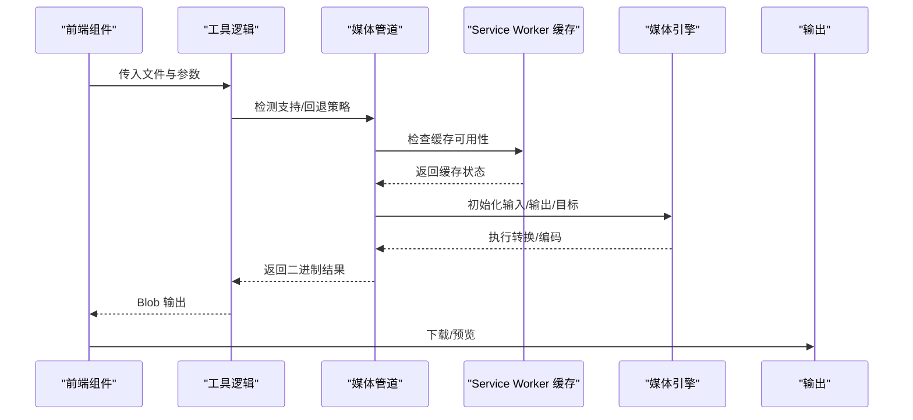
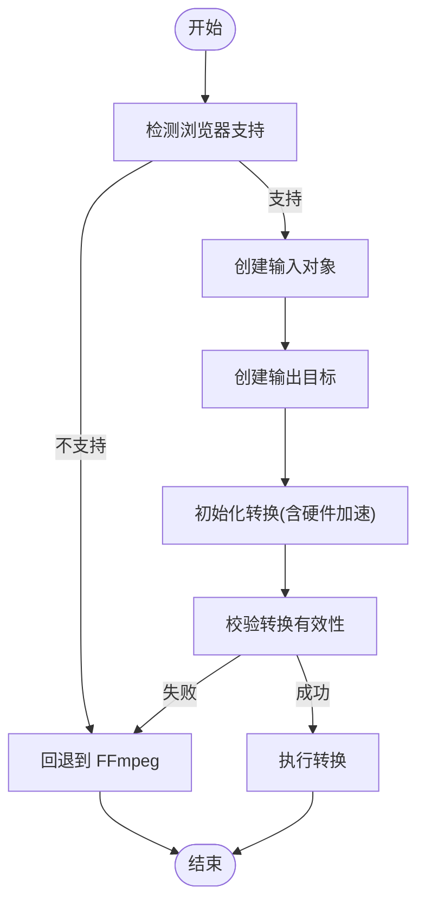
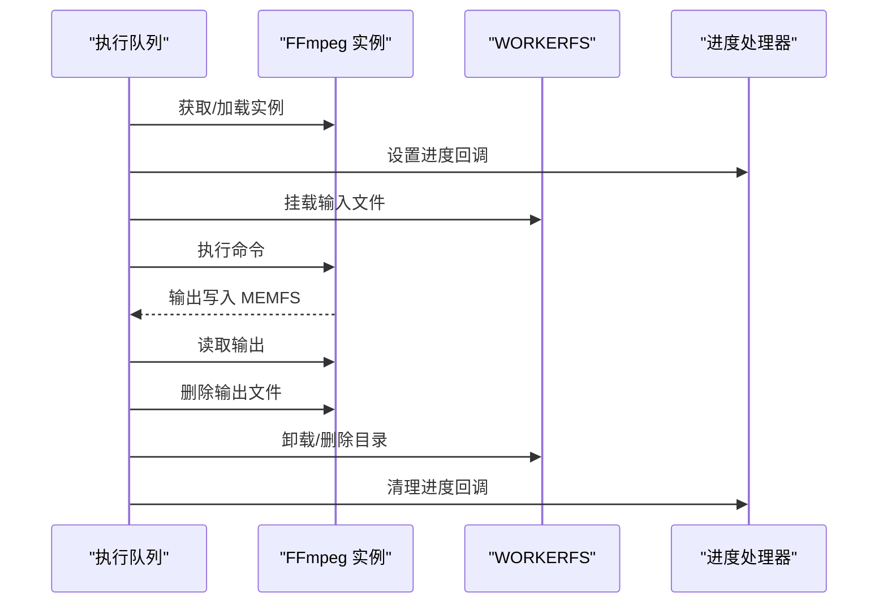
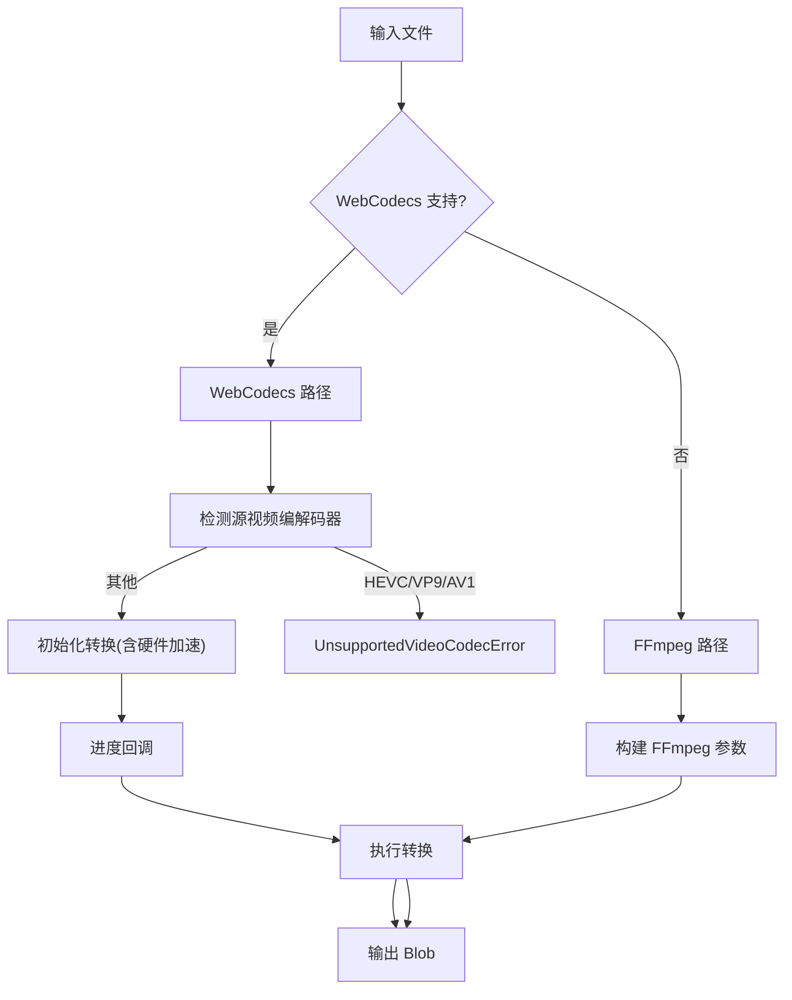
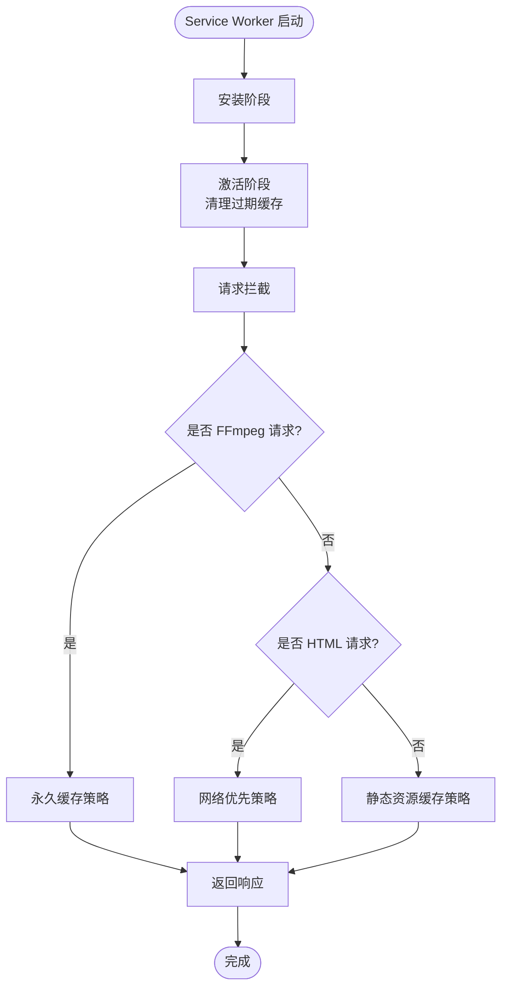
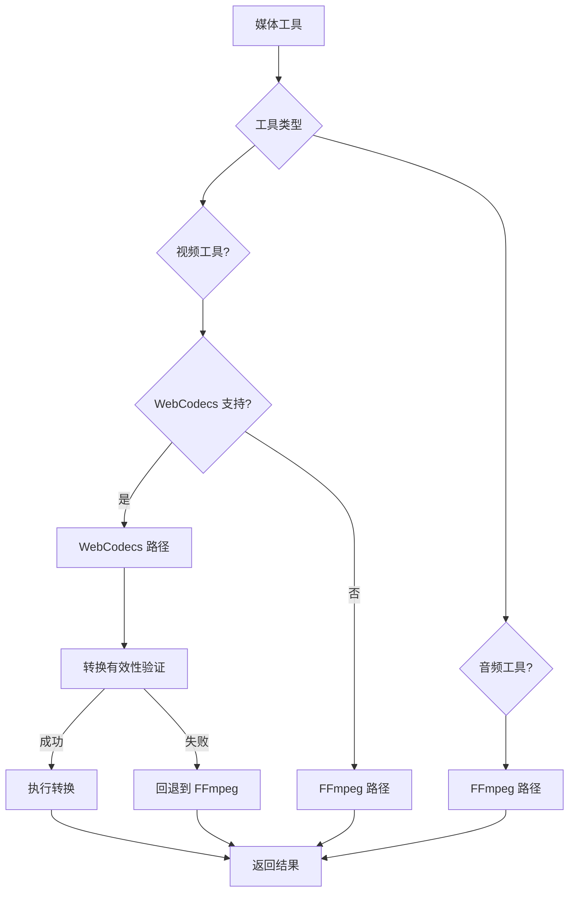
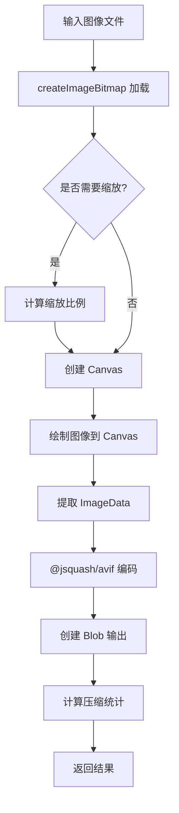
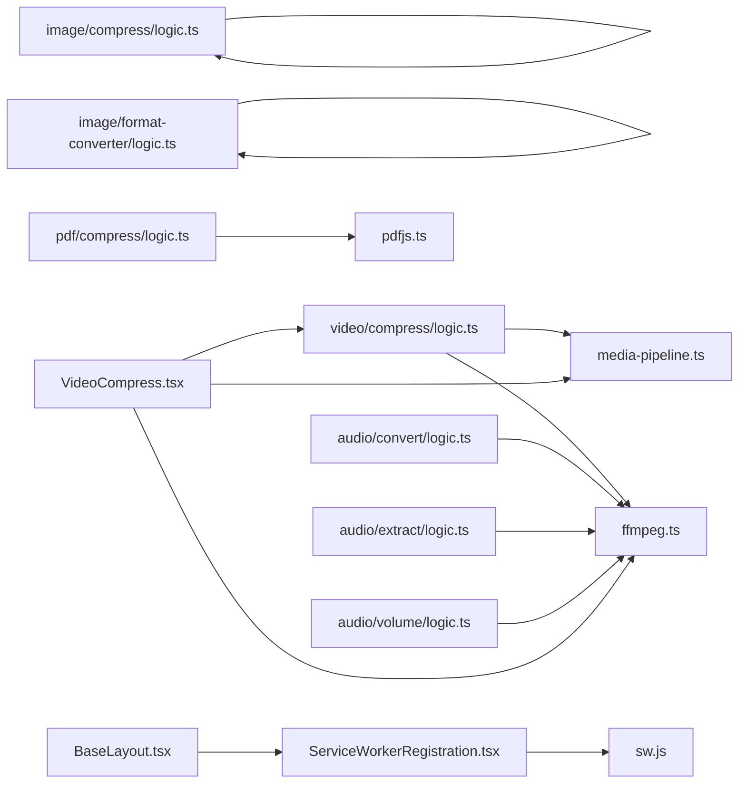
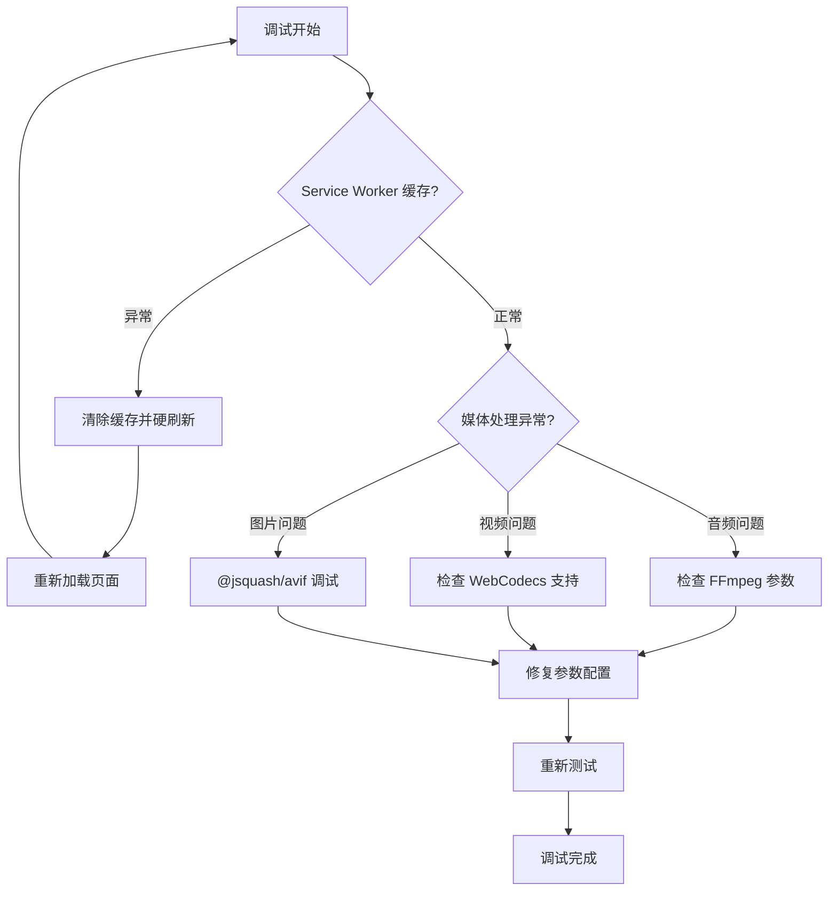

# 媒体处理管道

<cite>
**本文引用的文件**
- [CLAUDE.md](file://CLAUDE.md)
- [media-pipeline.ts](file://src/lib/media-pipeline.ts)
- [ffmpeg.ts](file://src/lib/ffmpeg.ts)
- [sw.js](file://public/sw.js)
- [ServiceWorkerRegistration.tsx](file://src/components/shared/ServiceWorkerRegistration.tsx)
- [BaseLayout.tsx](file://src/components/layout/BaseLayout.tsx)
- [video/compress/logic.ts](file://src/tools/video/compress/logic.ts)
- [audio/convert/logic.ts](file://src/tools/audio/convert/logic.ts)
- [audio/extract/logic.ts](file://src/tools/audio/extract/logic.ts)
- [audio/volume/logic.ts](file://src/tools/audio/volume/logic.ts)
- [image/compress/logic.ts](file://src/tools/image/compress/logic.ts)
- [image/format-converter/logic.ts](file://src/tools/image/format-converter/logic.ts)
- [pdf/compress/logic.ts](file://src/tools/pdf/compress/logic.ts)
- [video/info/logic.ts](file://src/tools/video/info/logic.ts)
</cite>

## 更新摘要
**所做更改**
- 新增 Service Worker 缓存系统的详细说明和调试指南
- 更新 FFmpeg.wasm 音频处理的指导原则和最佳实践
- 完善 WebCodecs/Mediabunny 管道的优先级策略和回退机制
- 补充 @jsquash/avif 编码的实现细节和性能考量
- 增强媒体处理管道的调试程序和故障排查流程

## 目录
1. [简介](#简介)
2. [项目结构](#项目结构)
3. [核心组件](#核心组件)
4. [架构总览](#架构总览)
5. [详细组件分析](#详细组件分析)
6. [Service Worker 缓存系统](#service-worker-缓存系统)
7. [FFmpeg.wasm 音频处理指导](#ffmpeg-wasm-音频处理指导)
8. [WebCodecs/Mediabunny 管道优先级](#webcodecsmediabunny-管道优先级)
9. [@jsquash/avif 编码实现](#jsquashavif-编码实现)
10. [依赖关系分析](#依赖关系分析)
11. [性能考量](#性能考量)
12. [调试程序与故障排查](#调试程序与故障排查)
13. [结论](#结论)
14. [附录](#附录)

## 简介
本文件为"媒体工具箱"的媒体处理管道提供全面技术文档。系统在浏览器端完成全部媒体处理，不上传文件至服务器，支持多语言、PWA 离线可用，并通过 WebCodecs 与 FFmpeg.wasm 提供高性能的视频/音频处理能力；图片采用浏览器原生压缩库，PDF 使用 pdf-lib 与 pdfjs-dist 进行页面级重采样与嵌入。

**更新** 本次更新重点反映了 CLAUDE.md 中关于媒体处理管道的最新指导原则，包括 Service Worker 缓存系统、FFmpeg.wasm 音频处理规范、WebCodecs/Mediabunny 管道优先级策略以及 @jsquash/avif 编码的具体实现。

## 项目结构
- 应用层：Next.js App Router 页面与工具页面组件
- 组件层：共享 UI 组件（拖拽上传、进度条、下载按钮等）
- 工具层：按类别划分的工具模块（image、video、audio、pdf、developer）
- 库层：媒体处理核心库（FFmpeg 单例、WebCodecs/媒体管道、PDFJS 初始化）

```mermaid
graph TB
subgraph "应用层"
APP["Next.js App Router 页面"]
END
subgraph "组件层"
FDZ["FileDropzone 拖拽上传"]
PP["ProcessingProgress 进度显示"]
DL["DownloadButton 下载"]
SW["ServiceWorkerRegistration Service Worker 注册"]
END
subgraph "工具层"
VID["视频工具集"]
IMG["图片工具集"]
AUD["音频工具集"]
PDF["PDF 工具集"]
DEV["开发者工具集"]
END
subgraph "库层"
MP["media-pipeline.ts<br/>WebCodecs/媒体管道"]
FF["ffmpeg.ts<br/>FFmpeg 单例与队列"]
PJ["pdfjs.ts<br/>PDFJS 初始化"]
CACHE["sw.js<br/>Service Worker 缓存"]
END
APP --> FDZ
APP --> PP
APP --> DL
APP --> SW
FDZ --> VID
FDZ --> IMG
FDZ --> AUD
FDZ --> PDF
VID --> MP
VID --> FF
IMG --> IMG
AUD --> FF
PDF --> PJ
SW --> CACHE
```

**图表来源**
- [BaseLayout.tsx:16-24](file://src/components/layout/BaseLayout.tsx#L16-L24)
- [ServiceWorkerRegistration.tsx:5-15](file://src/components/shared/ServiceWorkerRegistration.tsx#L5-L15)
- [CLAUDE.md:69-75](file://CLAUDE.md#L69-L75)

**章节来源**
- [CLAUDE.md:17-75](file://CLAUDE.md#L17-L75)

## 核心组件
- WebCodecs 媒体管道：基于 Mediabunny 的硬件加速视频/音频编解码，自动回退到 FFmpeg
- FFmpeg 单例与串行队列：统一加载、单线程执行、WORKERFS 直挂避免内存拷贝
- PDFJS 初始化：设置 worker 源，确保 PDF 工具可用
- Service Worker 缓存系统：永久缓存 FFmpeg wasm 核心文件和静态资源
- 工具逻辑封装：各媒体类型处理参数、质量预设、CRF 映射、分辨率与帧率控制
- 前端交互：拖拽上传、进度显示、结果对比与下载

**更新** 新增 Service Worker 缓存系统作为核心组件之一，提供永久缓存 FFmpeg wasm 核心文件的能力。

**章节来源**
- [media-pipeline.ts:7-175](file://src/lib/media-pipeline.ts#L7-L175)
- [ffmpeg.ts:10-150](file://src/lib/ffmpeg.ts#L10-L150)
- [sw.js:1-93](file://public/sw.js#L1-L93)
- [ServiceWorkerRegistration.tsx:1-16](file://src/components/shared/ServiceWorkerRegistration.tsx#L1-L16)

## 架构总览
媒体处理管道遵循"前端 UI → 工具逻辑 → 媒体引擎（WebCodecs/FFmpeg/PDFJS）→ 结果输出"的数据流。UI 层负责文件选择、参数配置与进度反馈；工具逻辑负责参数解析与调用媒体引擎；媒体引擎负责实际编码/解码/渲染；最终输出 Blob 并提供下载。



**图表来源**
- [video/compress/logic.ts:87-112](file://src/tools/video/compress/logic.ts#L87-L112)
- [media-pipeline.ts:59-91](file://src/lib/media-pipeline.ts#L59-L91)
- [sw.js:30-50](file://public/sw.js#L30-L50)

## 详细组件分析

### WebCodecs 媒体管道
- 能力检测：VideoEncoder/Decoder/AudioEncoder/AudioDecoder 是否可用
- 编解码器检测：支持 H.264/H.265 编码能力探测
- 源视频编解码器检测：识别 H.264/HEVC 等
- 转换校验：丢弃关键轨道（如不可解码的视频/未知源编解码器）时抛出回退错误
- 回退策略：对视频编解码器问题直接终止（UnsupportedVideoCodecError），对音频问题回退到 FFmpeg



**图表来源**
- [media-pipeline.ts:7-14](file://src/lib/media-pipeline.ts#L7-L14)
- [media-pipeline.ts:149-174](file://src/lib/media-pipeline.ts#L149-L174)
- [media-pipeline.ts:59-91](file://src/lib/media-pipeline.ts#L59-L91)

**章节来源**
- [media-pipeline.ts:7-175](file://src/lib/media-pipeline.ts#L7-L175)

### FFmpeg 单例与串行队列
- 单例加载：延迟加载、缓存实例、失败清理
- 进度监听：统一事件回调，范围归一化到 0-100
- 串行队列：保证 FFmpeg WASM 单线程安全，避免挂载点冲突
- WORKERFS 直挂：避免 fetchFile/writeFile 内存复制，按需读取
- 输出释放：读取后立即删除 MEMFS 文件，降低峰值内存



**图表来源**
- [ffmpeg.ts:75-82](file://src/lib/ffmpeg.ts#L75-L82)
- [ffmpeg.ts:99-143](file://src/lib/ffmpeg.ts#L99-L143)

**章节来源**
- [ffmpeg.ts:10-150](file://src/lib/ffmpeg.ts#L10-L150)

### 视频压缩工具
- 参数体系：质量预设、CRF、编码预设、分辨率、帧率、音频码率、最大码率
- CRF 到码率映射：根据分辨率缩放估算目标视频码率
- WebCodecs 优先：支持时优先使用硬件加速；遇到视频编解码器问题直接报错，音频问题回退 FFmpeg
- FFmpeg 回退：使用 scale/fps 滤镜与 libx264 编码，支持最大码率与缓冲区配置



**图表来源**
- [video/compress/logic.ts:87-112](file://src/tools/video/compress/logic.ts#L87-L112)
- [video/compress/logic.ts:114-206](file://src/tools/video/compress/logic.ts#L114-L206)
- [video/compress/logic.ts:208-261](file://src/tools/video/compress/logic.ts#L208-L261)

**章节来源**
- [video/compress/logic.ts:1-262](file://src/tools/video/compress/logic.ts#L1-L262)

### 图片压缩与格式转换工具
- 格式支持：原始格式、JPEG、PNG、WebP、AVIF
- 压缩策略：browser-image-compression 默认路径；AVIF 使用 @jsquash/avif
- 尺寸与质量：支持自定义宽高或最大边长，EXIF 保留选项
- 结果统计：原始大小、压缩后大小、节省百分比
- AVIF 编码：使用 @jsquash/avif 库进行高效编码，支持质量控制和速度调节

**更新** 新增 @jsquash/avif 编码的专门实现，提供更高效的 AVIF 压缩方案。

**章节来源**
- [image/compress/logic.ts:1-135](file://src/tools/image/compress/logic.ts#L1-L135)
- [image/format-converter/logic.ts:1-161](file://src/tools/image/format-converter/logic.ts#L1-L161)

### PDF 压缩工具
- 页面级重采样：逐页渲染到 Canvas，转 JPEG，再嵌入到新 PDF
- 质量配置：缩放比例与 JPEG 质量
- 进度回调：页索引与总数

**章节来源**
- [pdf/compress/logic.ts:1-54](file://src/tools/pdf/compress/logic.ts#L1-L54)

### 音频处理工具
- 格式转换：支持 MP3、WAV、OGG、AAC、FLAC、M4A、Opus 格式
- 音频提取：支持时间范围提取和淡入淡出效果
- 音量调整：支持百分比和 dB 单位的音量调节
- 参数构建：每种格式的编码器与质量参数，输出 MIME 类型设置

**更新** 音频处理工具完全基于 FFmpeg.wasm 实现，提供统一的音频处理能力。

**章节来源**
- [audio/convert/logic.ts:1-131](file://src/tools/audio/convert/logic.ts#L1-L131)
- [audio/extract/logic.ts:1-131](file://src/tools/audio/extract/logic.ts#L1-L131)
- [audio/volume/logic.ts:1-53](file://src/tools/audio/volume/logic.ts#L1-L53)

### 视频信息工具
- FFprobe 功能：通过 FFmpeg 日志输出解析视频信息
- 流信息提取：容器格式、时长、比特率、视频/音频流详情
- 缩略图生成：基于浏览器 <video> + <canvas> API 生成缩略图

**章节来源**
- [video/info/logic.ts:1-272](file://src/tools/video/info/logic.ts#L1-L272)

## Service Worker 缓存系统
Service Worker 提供了永久缓存机制，显著提升媒体处理工具的加载性能和用户体验。

### 缓存策略
- FFmpeg wasm 核心文件：永久缓存（版本固定 URL）
- 静态资源：缓存优先策略，提升后续访问速度
- HTML 页面：网络优先策略，确保内容实时性

### 缓存配置
- 缓存名称：`privadeck-v1`、`privadeck-ffmpeg-v1`、`privadeck-static-v1`
- FFmpeg URL 列表：包含核心 JS 和 WASM 文件
- 缓存淘汰：激活时清理过期缓存



**图表来源**
- [sw.js:11-28](file://public/sw.js#L11-L28)
- [sw.js:30-92](file://public/sw.js#L30-L92)

**章节来源**
- [sw.js:1-93](file://public/sw.js#L1-L93)
- [ServiceWorkerRegistration.tsx:1-16](file://src/components/shared/ServiceWorkerRegistration.tsx#L1-L16)
- [BaseLayout.tsx:16-24](file://src/components/layout/BaseLayout.tsx#L16-L24)

## FFmpeg.wasm 音频处理指导
音频处理工具严格遵循统一的 FFmpeg.wasm 处理模式，确保一致的性能和用户体验。

### 处理流程
1. **参数验证**：检查音频格式、比特率、采样率等参数的有效性
2. **格式映射**：根据目标格式选择合适的编解码器和复用器
3. **滤镜链构建**：根据用户选项构建音频滤镜链（音量、淡入淡出等）
4. **执行转换**：通过 execWithMount 方法执行 FFmpeg 命令
5. **结果输出**：返回 Blob 对象和适当的 MIME 类型

### 最佳实践
- **参数限制**：对 Opus 格式的比特率进行 256 kbps 上限限制
- **质量控制**：提供标准比特率选项和自定义质量设置
- **兼容性**：确保不同格式间的容器兼容性和标签保留

**章节来源**
- [audio/convert/logic.ts:1-131](file://src/tools/audio/convert/logic.ts#L1-L131)
- [audio/extract/logic.ts:1-131](file://src/tools/audio/extract/logic.ts#L1-L131)
- [audio/volume/logic.ts:1-53](file://src/tools/audio/volume/logic.ts#L1-L53)

## WebCodecs/Mediabunny 管道优先级
媒体处理管道采用明确的优先级策略，确保在不同场景下选择最优的处理方案。

### 优先级策略
1. **音频工具**：全部使用 FFmpeg.wasm（trim/convert/extract/volume）
2. **视频工具**：优先使用 WebCodecs/Mediabunny，失败时回退到 FFmpeg
3. **特殊工具**：video/info 直接使用 FFmpeg

### 回退机制
- **视频编解码器问题**：直接抛出 UnsupportedVideoCodecError，不进行回退
- **音频编解码器问题**：记录 isVideoCodecIssue 标志，区分处理场景
- **性能考虑**：对于不支持的视频编解码器，避免性能较差的 FFmpeg 回退



**图表来源**
- [video/compress/logic.ts:94-112](file://src/tools/video/compress/logic.ts#L94-L112)
- [media-pipeline.ts:59-91](file://src/lib/media-pipeline.ts#L59-L91)

**章节来源**
- [CLAUDE.md:84-92](file://CLAUDE.md#L84-L92)
- [video/compress/logic.ts:1-262](file://src/tools/video/compress/logic.ts#L1-L262)
- [media-pipeline.ts:1-175](file://src/lib/media-pipeline.ts#L1-L175)

## @jsquash/avif 编码实现
AVIF 编码采用 @jsquash/avif 库，提供高效的无损和有损压缩方案。

### 编码流程
1. **图像加载**：使用 createImageBitmap 将文件加载到内存
2. **尺寸调整**：根据用户选项进行等比缩放
3. **像素数据提取**：通过 Canvas 获取 ImageData 对象
4. **AVIF 编码**：使用 @jsquash/avif 库进行高效编码
5. **结果输出**：返回 Blob 对象和压缩统计信息

### 性能优化
- **质量控制**：支持 0-100 的质量范围映射
- **速度调节**：提供 1-8 的速度等级，平衡压缩速度和质量
- **内存管理**：及时释放 Canvas 和 ImageData 对象
- **尺寸限制**：避免超大图像导致的内存溢出



**图表来源**
- [image/compress/logic.ts:36-81](file://src/tools/image/compress/logic.ts#L36-L81)
- [image/format-converter/logic.ts:56-73](file://src/tools/image/format-converter/logic.ts#L56-L73)

**章节来源**
- [image/compress/logic.ts:1-135](file://src/tools/image/compress/logic.ts#L1-L135)
- [image/format-converter/logic.ts:1-161](file://src/tools/image/format-converter/logic.ts#L1-L161)

## 依赖关系分析
- 工具到库：各工具逻辑依赖媒体管道与 FFmpeg 单例
- 媒体引擎：WebCodecs 优先，失败回退 FFmpeg；PDF 使用 pdfjs-dist 与 pdf-lib
- 前端组件：上传、进度、下载组件贯穿各工具页面
- 缓存系统：Service Worker 提供永久缓存，提升加载性能



**图表来源**
- [video/compress/logic.ts:1-2](file://src/tools/video/compress/logic.ts#L1-L2)
- [audio/convert/logic.ts:1](file://src/tools/audio/convert/logic.ts#L1)
- [audio/extract/logic.ts:1](file://src/tools/audio/extract/logic.ts#L1)
- [audio/volume/logic.ts:1](file://src/tools/audio/volume/logic.ts#L1)
- [pdf/compress/logic.ts:1-2](file://src/tools/pdf/compress/logic.ts#L1-L2)
- [media-pipeline.ts:1-5](file://src/lib/media-pipeline.ts#L1-L5)
- [ffmpeg.ts:1-5](file://src/lib/ffmpeg.ts#L1-L5)
- [ServiceWorkerRegistration.tsx:1-16](file://src/components/shared/ServiceWorkerRegistration.tsx#L1-L16)
- [BaseLayout.tsx:16-24](file://src/components/layout/BaseLayout.tsx#L16-L24)

**章节来源**
- [CLAUDE.md:69-75](file://CLAUDE.md#L69-L75)
- [video/compress/logic.ts:1-262](file://src/tools/video/compress/logic.ts#L1-L262)
- [audio/convert/logic.ts:1-131](file://src/tools/audio/convert/logic.ts#L1-L131)
- [audio/extract/logic.ts:1-131](file://src/tools/audio/extract/logic.ts#L1-L131)
- [audio/volume/logic.ts:1-53](file://src/tools/audio/volume/logic.ts#L1-L53)
- [image/compress/logic.ts:1-135](file://src/tools/image/compress/logic.ts#L1-L135)
- [image/format-converter/logic.ts:1-161](file://src/tools/image/format-converter/logic.ts#L1-L161)
- [pdf/compress/logic.ts:1-54](file://src/tools/pdf/compress/logic.ts#L1-L54)
- [media-pipeline.ts:1-175](file://src/lib/media-pipeline.ts#L1-L175)
- [ffmpeg.ts:1-150](file://src/lib/ffmpeg.ts#L1-L150)
- [ServiceWorkerRegistration.tsx:1-16](file://src/components/shared/ServiceWorkerRegistration.tsx#L1-L16)
- [BaseLayout.tsx:16-24](file://src/components/layout/BaseLayout.tsx#L16-L24)

## 性能考量
- 并发与串行
  - FFmpeg 采用 Promise 队列串行执行，避免并发挂载冲突与 WASM 单线程限制
  - WebCodecs 并发能力取决于浏览器硬件与驱动，优先使用硬件加速
- 内存优化
  - WORKERFS 直挂输入文件，避免两次内存拷贝
  - 输出读取后立即删除 MEMFS 文件，降低峰值内存占用
  - Service Worker 缓存永久存储 FFmpeg wasm 核心文件，减少重复下载
- 码率与分辨率
  - CRF 到码率映射随分辨率缩放，结合最大码率上限控制输出体积
  - 分辨率与帧率下采样仅在超过源规格时启用
- 进度与可观测性
  - FFmpeg 进度事件归一化到 0-100
  - WebCodecs 转换提供进度回调
- 资源管理
  - PDF 页面渲染后释放 Canvas GPU 内存
  - 图片压缩使用 Web Worker 与 Canvas，避免阻塞主线程
  - @jsquash/avif 编码及时释放内存资源

**更新** 新增 Service Worker 缓存系统的性能考量，以及 @jsquash/avif 编码的内存管理策略。

**章节来源**
- [ffmpeg.ts:75-82](file://src/lib/ffmpeg.ts#L75-L82)
- [ffmpeg.ts:105-142](file://src/lib/ffmpeg.ts#L105-L142)
- [sw.js:30-50](file://public/sw.js#L30-L50)
- [image/compress/logic.ts:36-81](file://src/tools/image/compress/logic.ts#L36-L81)

## 调试程序与故障排查

### Service Worker 调试
当媒体工具处理结果不符合预期时，首先检查 Service Worker 缓存状态：

1. **清除缓存**：在浏览器开发者工具中清除 Service Worker 缓存
2. **硬刷新**：强制重新加载页面，绕过缓存
3. **检查网络面板**：确认 FFmpeg wasm 文件是否从缓存加载
4. **验证缓存**：检查缓存存储中的 privadeck-ffmpeg-v1 缓存

### 媒体处理调试
- **不支持的视频编解码器**
  - 现象：抛出 UnsupportedVideoCodecError，无法回退到 FFmpeg
  - 处理：提示安装 HEVC 扩展（Windows + Chromium）
- **WebCodecs 回退错误**
  - 现象：音频问题可回退 FFmpeg，视频问题抛错
  - 处理：记录 isVideoCodecIssue 区分场景
- **FFmpeg 加载失败**
  - 现象：CDN 加载 core/wasm 失败
  - 处理：清理实例并重新尝试加载
- **进度异常**
  - 现象：进度不在 0-100 或无进度
  - 处理：确认事件回调设置与清理，确保串行队列正确推进
- **PDF 渲染失败**
  - 现象：Canvas.toBlob 失败
  - 处理：检查页面渲染参数与 JPEG 质量，释放 Canvas 内存
- **AVIF 编码问题**
  - 现象：@jsquash/avif 编码失败或内存溢出
  - 处理：检查图像尺寸限制，确保及时释放 Canvas 资源



**图表来源**
- [sw.js:11-28](file://public/sw.js#L11-L28)
- [video/compress/logic.ts:94-112](file://src/tools/video/compress/logic.ts#L94-L112)
- [image/compress/logic.ts:36-81](file://src/tools/image/compress/logic.ts#L36-L81)

**章节来源**
- [CLAUDE.md:92-105](file://CLAUDE.md#L92-L105)
- [media-pipeline.ts:32-53](file://src/lib/media-pipeline.ts#L32-L53)
- [ffmpeg.ts:20-28](file://src/lib/ffmpeg.ts#L20-L28)
- [sw.js:30-50](file://public/sw.js#L30-L50)

## 结论
该媒体处理管道以 WebCodecs 为首选，结合 FFmpeg.wasm 与专用库实现跨媒体类型的高性能本地处理。通过串行队列、WORKERFS 直挂与进度统一回调，系统在浏览器端实现了稳定、可扩展且低内存占用的处理链路。新增的 Service Worker 缓存系统进一步提升了性能，而 @jsquash/avif 编码提供了高效的图像压缩方案。UI 层提供直观的参数配置与结果对比，满足多样化的媒体处理需求。

**更新** 本次更新完善了 Service Worker 缓存系统、FFmpeg.wasm 音频处理指导、WebCodecs/Mediabunny 管道优先级策略以及 @jsquash/avif 编码实现，为开发者提供了更全面的媒体处理解决方案。

## 附录

### 扩展新工具的步骤
- 创建目录与文件：src/tools/{分类}/{slug}/ 下的 index.ts、{Name}.tsx、logic.ts
- 注册工具：在工具注册表中添加导入与注册
- 国际化：在 21 个 locale 的翻译文件中添加键值
- 参考路径
  - 工具注册表位置：src/lib/registry/index.ts
  - 工具模板参考：video/compress/index.ts、VideoCompress.tsx、logic.ts

**更新** 新增 Service Worker 缓存系统的集成指导，确保新工具能够充分利用缓存优势。

**章节来源**
- [CLAUDE.md:21-33](file://CLAUDE.md#L21-L33)
- [CLAUDE.md:92-105](file://CLAUDE.md#L92-L105)