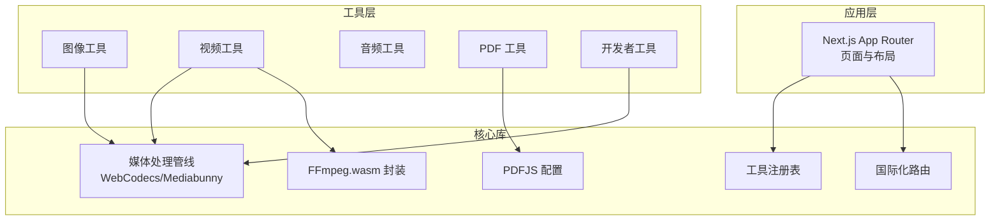
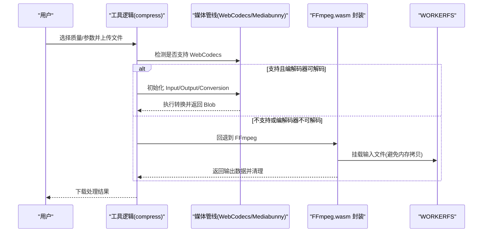
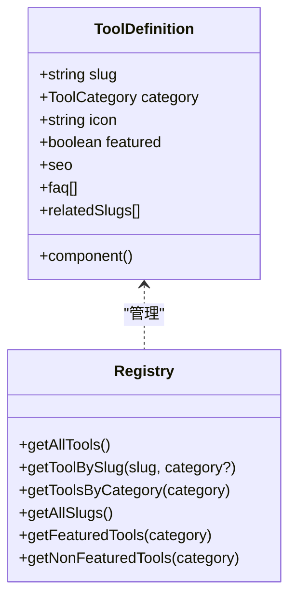
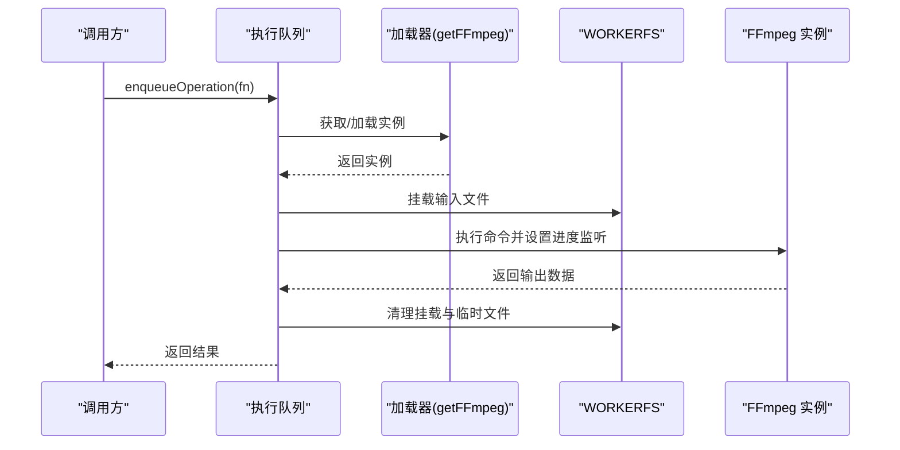
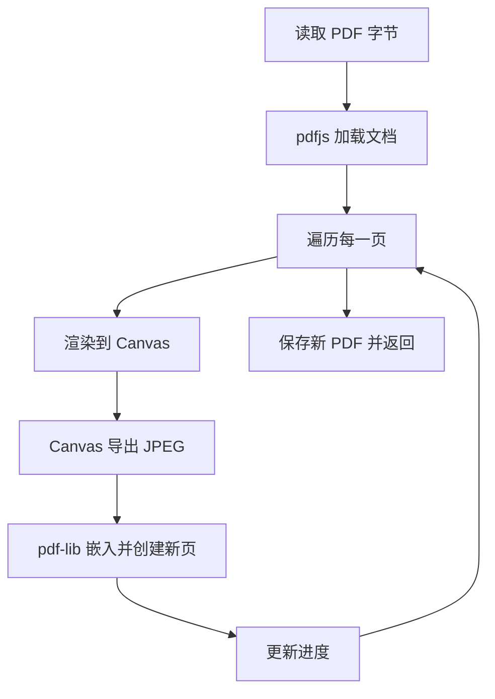
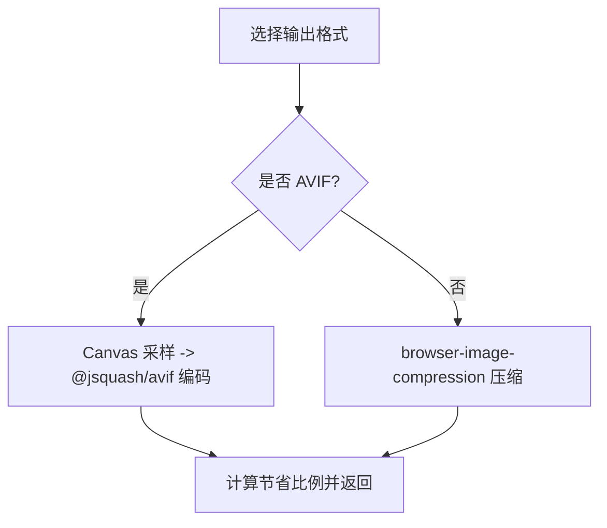
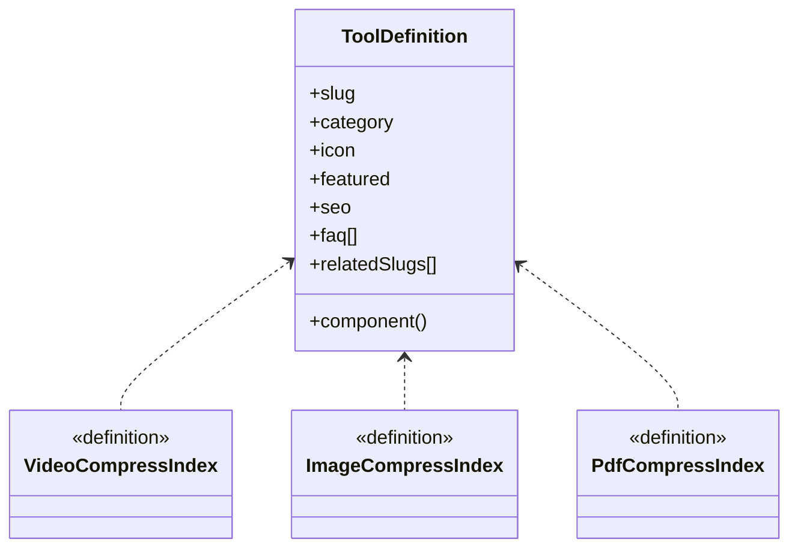
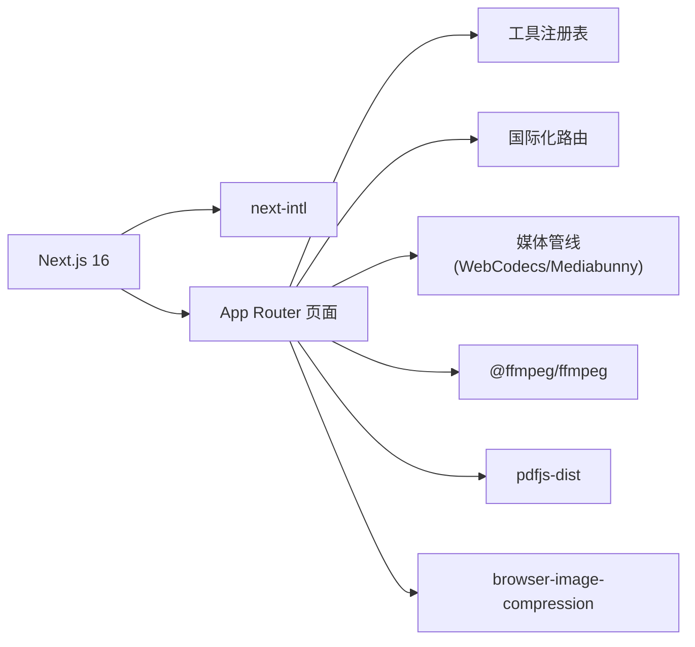

# 技术架构

<cite>
**本文引用的文件**
- [README.md](file://README.md)
- [package.json](file://package.json)
- [next.config.ts](file://next.config.ts)
- [src/app/layout.tsx](file://src/app/layout.tsx)
- [src/lib/media-pipeline.ts](file://src/lib/media-pipeline.ts)
- [src/lib/ffmpeg.ts](file://src/lib/ffmpeg.ts)
- [src/lib/pdfjs.ts](file://src/lib/pdfjs.ts)
- [src/lib/registry/index.ts](file://src/lib/registry/index.ts)
- [src/lib/registry/types.ts](file://src/lib/registry/types.ts)
- [src/i18n/routing.ts](file://src/i18n/routing.ts)
- [src/tools/video/compress/logic.ts](file://src/tools/video/compress/logic.ts)
- [src/tools/image/compress/logic.ts](file://src/tools/image/compress/logic.ts)
- [src/tools/pdf/compress/logic.ts](file://src/tools/pdf/compress/logic.ts)
- [src/tools/video/compress/index.ts](file://src/tools/video/compress/index.ts)
- [src/tools/image/compress/index.ts](file://src/tools/image/compress/index.ts)
- [src/tools/pdf/compress/index.ts](file://src/tools/pdf/compress/index.ts)
- [patches/@ffmpeg__ffmpeg@0.12.15.patch](file://patches/@ffmpeg__ffmpeg@0.12.15.patch)
</cite>

## 目录
1. [引言](#引言)
2. [项目结构](#项目结构)
3. [核心组件](#核心组件)
4. [架构总览](#架构总览)
5. [详细组件分析](#详细组件分析)
6. [依赖关系分析](#依赖关系分析)
7. [性能考量](#性能考量)
8. [故障排查指南](#故障排查指南)
9. [结论](#结论)
10. [附录](#附录)

## 引言
本项目是一个浏览器端多媒体工具箱，强调隐私与离线能力：所有媒体处理在本地完成，不上传文件，不依赖服务器。系统采用双引擎架构：以 WebCodecs 为基础的硬件加速路径（通过 Mediabunny 提供），作为首选；当浏览器不支持或遇到特定编解码器限制时，自动回退到 FFmpeg.wasm 路径。同时，系统基于 Next.js App Router 实现静态生成（SSG）与国际化（next-intl），覆盖 21 种语言，并通过 PWA 支持离线使用。

## 项目结构
项目采用按功能域划分的目录组织方式，核心模块包括：
- 应用层：Next.js App Router 页面与布局
- 工具层：按类别划分的工具模块（image、video、audio、pdf、developer）
- 核心库：媒体处理管线、FFmpeg.wasm 封装、PDFJS 配置、工具注册表、国际化路由
- 国际化资源：多语言翻译文件（messages）

图表来源
- [src/app/layout.tsx:1-48](file://src/app/layout.tsx#L1-L48)
- [src/lib/registry/index.ts:1-164](file://src/lib/registry/index.ts#L1-L164)
- [src/lib/media-pipeline.ts:1-175](file://src/lib/media-pipeline.ts#L1-L175)
- [src/lib/ffmpeg.ts:1-144](file://src/lib/ffmpeg.ts#L1-L144)
- [src/lib/pdfjs.ts:1-16](file://src/lib/pdfjs.ts#L1-L16)
- [src/i18n/routing.ts:1-18](file://src/i18n/routing.ts#L1-L18)

章节来源
- [README.md:55-78](file://README.md#L55-L78)
- [next.config.ts:1-13](file://next.config.ts#L1-L13)

## 核心组件
- 工具注册表：集中管理工具元数据与动态导入，支持按分类检索、特色工具筛选与全量枚举。
- 媒体处理管线：封装 WebCodecs/Mediabunny 能力，提供编解码器检测、硬件加速、进度回调与错误降级。
- FFmpeg.wasm 封装：单例加载、串行队列执行、WORKERFS 挂载避免内存拷贝、进度事件绑定与清理。
- PDFJS 配置：延迟初始化与 Worker 路径配置，保障 PDF 处理的稳定性。
- 国际化与静态生成：基于 next-intl 的路由与构建配置，输出静态站点，支持多语言与 hreflang。

章节来源
- [src/lib/registry/index.ts:1-164](file://src/lib/registry/index.ts#L1-L164)
- [src/lib/registry/types.ts:1-22](file://src/lib/registry/types.ts#L1-L22)
- [src/lib/media-pipeline.ts:1-175](file://src/lib/media-pipeline.ts#L1-L175)
- [src/lib/ffmpeg.ts:1-144](file://src/lib/ffmpeg.ts#L1-L144)
- [src/lib/pdfjs.ts:1-16](file://src/lib/pdfjs.ts#L1-L16)
- [src/i18n/routing.ts:1-18](file://src/i18n/routing.ts#L1-L18)
- [next.config.ts:1-13](file://next.config.ts#L1-L13)

## 架构总览
双引擎架构的核心思想是“优先硬件加速、次选 wasm 解决方案”。视频处理流程如下：
- 若浏览器支持 WebCodecs 且源文件编解码器可被解码，则使用 Mediabunny 执行转换，支持硬件加速与进度回调。
- 若检测到不支持的视频编解码器（如 H.265/HEVC、VP9、AV1），抛出专用错误，阻止回退到 FFmpeg（因性能不佳）。
- 对于其他编解码问题（如音频），或当 WebCodecs 不可用时，回退到 FFmpeg.wasm，通过 WORKERFS 直接挂载文件，避免内存复制。
- 图像与 PDF 工具分别使用 browser-image-compression 与 pdf-lib/pdfjs-dist 进行纯前端处理。

图表来源
- [src/tools/video/compress/logic.ts:87-112](file://src/tools/video/compress/logic.ts#L87-L112)
- [src/lib/media-pipeline.ts:59-91](file://src/lib/media-pipeline.ts#L59-L91)
- [src/lib/ffmpeg.ts:99-143](file://src/lib/ffmpeg.ts#L99-L143)

章节来源
- [src/tools/video/compress/logic.ts:1-262](file://src/tools/video/compress/logic.ts#L1-L262)
- [src/lib/media-pipeline.ts:1-175](file://src/lib/media-pipeline.ts#L1-L175)
- [src/lib/ffmpeg.ts:1-144](file://src/lib/ffmpeg.ts#L1-L144)

## 详细组件分析

### 工具注册表与工厂模式
- 注册表负责收集所有工具的元数据（slug、category、icon、SEO、FAQ、相关工具等），并通过动态导入实现按需加载。
- 工厂方法体现在工具定义中的 component 字段，返回异步组件加载函数，结合注册表统一调度。
- 设计模式体现：
  - 注册表模式：集中存储与查询工具定义
  - 工厂模式：按需动态导入组件
  - 策略模式：不同工具类别共享统一的页面壳与展示策略

图表来源
- [src/lib/registry/types.ts:5-21](file://src/lib/registry/types.ts#L5-L21)
- [src/lib/registry/index.ts:135-164](file://src/lib/registry/index.ts#L135-L164)

章节来源
- [src/lib/registry/index.ts:1-164](file://src/lib/registry/index.ts#L1-L164)
- [src/lib/registry/types.ts:1-22](file://src/lib/registry/types.ts#L1-L22)

### 媒体处理管线（WebCodecs/Mediabunny）
- 能力检测：Video/Audio 编解码器存在性判断，以及针对 HEVC 编码能力的探测。
- 转换验证：对丢弃轨道与有效性进行严格校验，防止无声或黑屏等无声无画问题。
- 错误策略：区分“可回退”与“不可回退”的编解码器问题，避免性能劣化的回退路径。
- 进度回调：通过 Conversion.onProgress 提供实时进度反馈。

图表来源
- [src/lib/media-pipeline.ts:7-14](file://src/lib/media-pipeline.ts#L7-L14)
- [src/lib/media-pipeline.ts:59-91](file://src/lib/media-pipeline.ts#L59-L91)
- [src/lib/media-pipeline.ts:149-174](file://src/lib/media-pipeline.ts#L149-L174)

章节来源
- [src/lib/media-pipeline.ts:1-175](file://src/lib/media-pipeline.ts#L1-L175)

### FFmpeg.wasm 封装（单例与串行队列）
- 单例加载：避免重复下载与初始化开销。
- 串行队列：保证 FFmpeg WASM 的单线程执行约束，避免挂载点冲突。
- WORKERFS 挂载：直接读取磁盘，避免内存拷贝；执行完成后清理临时文件与挂载点。
- 进度事件：统一转换为 0-100 的百分比回调。

图表来源
- [src/lib/ffmpeg.ts:75-82](file://src/lib/ffmpeg.ts#L75-L82)
- [src/lib/ffmpeg.ts:99-143](file://src/lib/ffmpeg.ts#L99-L143)

章节来源
- [src/lib/ffmpeg.ts:1-144](file://src/lib/ffmpeg.ts#L1-L144)
- [patches/@ffmpeg__ffmpeg@0.12.15.patch:1-14](file://patches/@ffmpeg__ffmpeg@0.12.15.patch#L1-L14)

### PDF 处理（pdf-lib + pdfjs-dist）
- 使用 pdfjs-dist 渲染页面为 Canvas，再导出为 JPEG，最后嵌入到新的 PDF 文档。
- 逐页处理并提供进度回调，处理完成后销毁源文档以释放内存。
- Canvas 内存及时回收，避免长时间占用。

图表来源
- [src/tools/pdf/compress/logic.ts:12-66](file://src/tools/pdf/compress/logic.ts#L12-L66)
- [src/lib/pdfjs.ts:1-16](file://src/lib/pdfjs.ts#L1-L16)

章节来源
- [src/tools/pdf/compress/logic.ts:1-73](file://src/tools/pdf/compress/logic.ts#L1-L73)
- [src/lib/pdfjs.ts:1-16](file://src/lib/pdfjs.ts#L1-L16)

### 图像压缩（browser-image-compression + @jsquash/avif）
- 支持多种输出格式（JPEG/PNG/WebP/AVIF），并提供预设与自定义尺寸。
- AVIF 路径通过 Canvas 采样与 @jsquash/avif 编码实现；非 AVIF 路径使用 browser-image-compression。
- 提供压缩率统计与原图/压缩图尺寸对比。

图表来源
- [src/tools/image/compress/logic.ts:83-123](file://src/tools/image/compress/logic.ts#L83-L123)

章节来源
- [src/tools/image/compress/logic.ts:1-135](file://src/tools/image/compress/logic.ts#L1-L135)

### 工具定义与页面壳（策略模式）
- 每个工具通过 index.ts 暴露 ToolDefinition，统一包含 SEO、FAQ、相关工具等策略信息。
- 页面壳（ToolPageShell）与工具页面（ToolPageClient）配合，形成一致的用户体验与导航策略。

图表来源
- [src/tools/video/compress/index.ts:1-49](file://src/tools/video/compress/index.ts#L1-L49)
- [src/tools/image/compress/index.ts:1-37](file://src/tools/image/compress/index.ts#L1-L37)
- [src/tools/pdf/compress/index.ts:1-37](file://src/tools/pdf/compress/index.ts#L1-L37)
- [src/lib/registry/types.ts:5-21](file://src/lib/registry/types.ts#L5-L21)

章节来源
- [src/tools/video/compress/index.ts:1-49](file://src/tools/video/compress/index.ts#L1-L49)
- [src/tools/image/compress/index.ts:1-37](file://src/tools/image/compress/index.ts#L1-L37)
- [src/tools/pdf/compress/index.ts:1-37](file://src/tools/pdf/compress/index.ts#L1-L37)

## 依赖关系分析
- 框架与运行时：Next.js 16（App Router、SSG）、React 19、TypeScript。
- 媒体处理：@ffmpeg/ffmpeg（wasm）、@ffmpeg/util（BlobURL）、mediabunny（WebCodecs）、browser-image-compression（图像）、pdf-lib + pdfjs-dist（PDF）。
- 国际化：next-intl（21 个语言环境）。
- 构建配置：静态导出（export）、禁用图片优化、尾斜杠。

图表来源
- [package.json:11-32](file://package.json#L11-L32)
- [next.config.ts:1-13](file://next.config.ts#L1-L13)
- [src/lib/media-pipeline.ts:1-175](file://src/lib/media-pipeline.ts#L1-L175)
- [src/lib/ffmpeg.ts:1-144](file://src/lib/ffmpeg.ts#L1-L144)
- [src/lib/pdfjs.ts:1-16](file://src/lib/pdfjs.ts#L1-L16)

章节来源
- [package.json:1-45](file://package.json#L1-L45)
- [next.config.ts:1-13](file://next.config.ts#L1-L13)

## 性能考量
- 硬件加速优先：WebCodecs/Mediabunny 在支持的平台上提供显著性能优势，减少 CPU 占用与内存峰值。
- 内存管理：
  - FFmpeg.wasm 使用 WORKERFS 挂载避免内存拷贝；执行后立即删除 MEMFS 文件，降低峰值内存。
  - PDF 处理中 Canvas 在使用后重置宽高以释放 GPU 内存。
- 串行执行：通过 Promise 队列保证 FFmpeg WASM 的单线程约束，避免并发挂载冲突。
- 错误降级：对不可回退的编解码器问题直接失败，避免低效回退导致的性能灾难。
- 构建优化：静态导出与 PWA 支持离线使用，减少网络与服务器压力。

章节来源
- [src/lib/ffmpeg.ts:99-143](file://src/lib/ffmpeg.ts#L99-L143)
- [src/tools/pdf/compress/logic.ts:44-48](file://src/tools/pdf/compress/logic.ts#L44-L48)
- [src/lib/media-pipeline.ts:32-53](file://src/lib/media-pipeline.ts#L32-L53)

## 故障排查指南
- WebCodecs 回退错误：
  - 当出现 WebCodecsFallbackError 且标记为视频编解码器问题时，应提示用户更换编码或安装浏览器扩展（如 HEVC 扩展）。
  - 其他编解码器问题可回退到 FFmpeg。
- FFmpeg 加载失败：
  - 检查 CDN 可达性与 BlobURL 生成；确认 patch 修复了打包器导入问题。
  - 查看进度事件绑定与清理逻辑，确保异常时正确释放资源。
- PDF 处理异常：
  - 确认 pdfjs 的 worker 路径已配置；逐页渲染失败时检查 Canvas 输出与嵌入流程。
- 国际化与静态生成：
  - 确保路由配置与构建输出为 export；检查多语言翻译键是否齐全。

章节来源
- [src/lib/media-pipeline.ts:32-53](file://src/lib/media-pipeline.ts#L32-L53)
- [src/lib/ffmpeg.ts:14-39](file://src/lib/ffmpeg.ts#L14-L39)
- [patches/@ffmpeg__ffmpeg@0.12.15.patch:1-14](file://patches/@ffmpeg__ffmpeg@0.12.15.patch#L1-L14)
- [src/lib/pdfjs.ts:3-13](file://src/lib/pdfjs.ts#L3-L13)
- [src/i18n/routing.ts:1-18](file://src/i18n/routing.ts#L1-L18)
- [next.config.ts:6-10](file://next.config.ts#L6-L10)

## 结论
本项目通过“WebCodecs + FFmpeg.wasm”的双引擎架构，在隐私优先的前提下实现了高性能的浏览器端媒体处理。注册表模式、工厂模式与策略模式贯穿工具体系，使新增工具成本低、维护简单。Next.js App Router 与 next-intl 的组合提供了优秀的静态生成与国际化能力。未来可在以下方向演进：进一步完善 WebCodecs 能力检测与引导、探索更多硬件加速编解码器、优化大文件处理的内存与并发模型、增强错误诊断与用户提示。

## 附录
- 架构演进要点：
  - 初期采用单一 FFmpeg.wasm 路径，性能受限。
  - 引入 WebCodecs/Mediabunny 作为首选路径，显著提升性能。
  - 针对不可回退的编解码器问题建立明确的错误策略，避免劣化回退。
  - 通过注册表与工厂模式标准化工具接入流程，便于扩展。
- 未来发展方向：
  - 扩展更多硬件编解码器支持与能力检测。
  - 优化大文件与长视频的分块处理与进度反馈。
  - 增强工具间的组合与批量处理能力。
  - 持续完善国际化与 SEO 元数据。