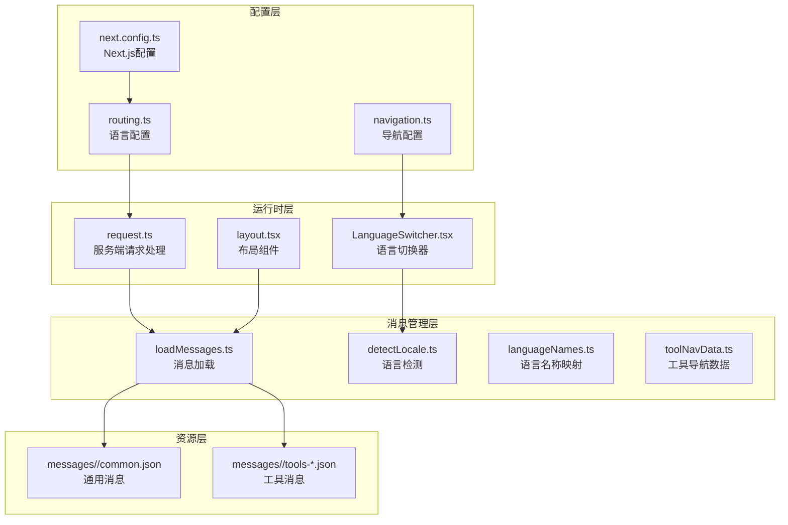
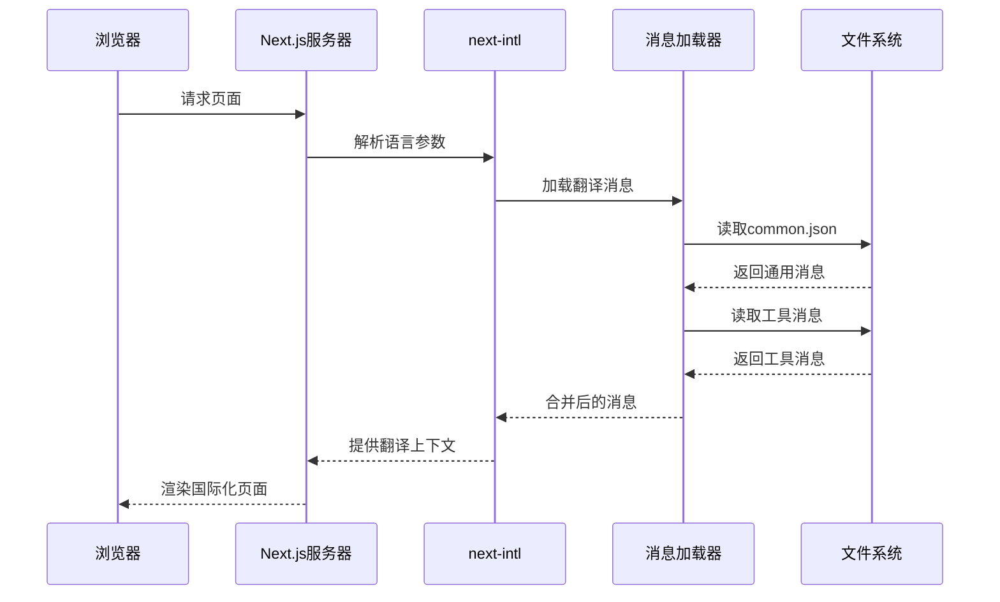
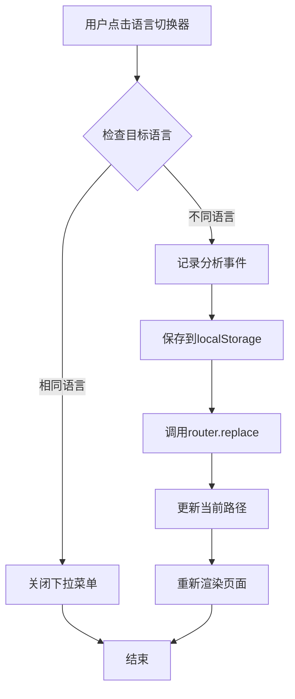
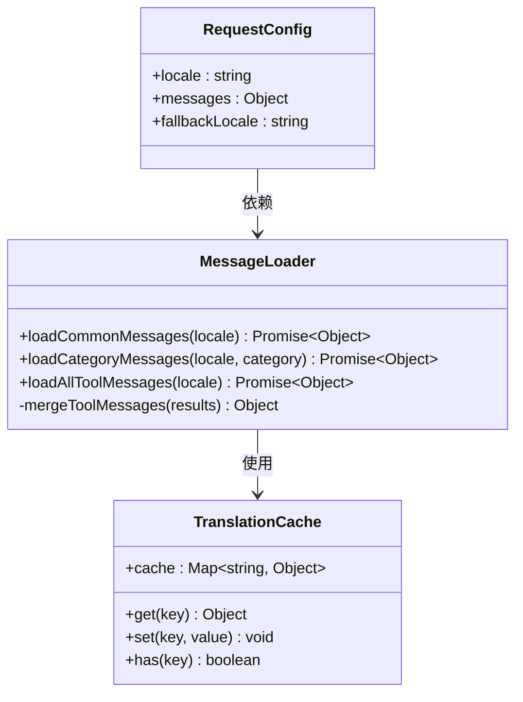
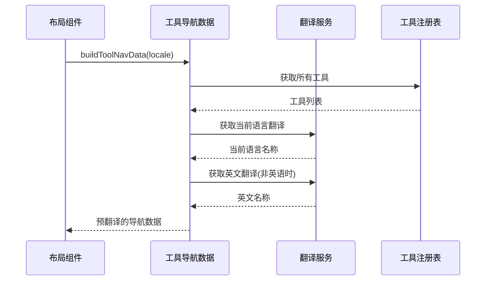
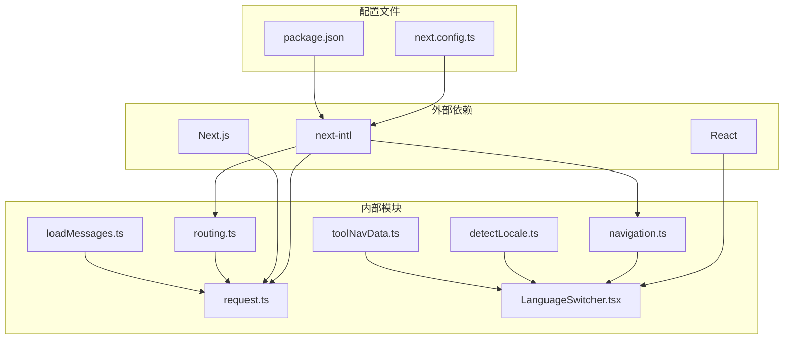

# 国际化架构

<cite>
**本文档引用的文件**
- [routing.ts](file://src/i18n/routing.ts)
- [navigation.ts](file://src/i18n/navigation.ts)
- [request.ts](file://src/i18n/request.ts)
- [next.config.ts](file://next.config.ts)
- [package.json](file://package.json)
- [LanguageSwitcher.tsx](file://src/components/shared/LanguageSwitcher.tsx)
- [layout.tsx](file://src/app/[locale]/layout.tsx)
- [layout.tsx](file://src/app/layout.tsx)
- [loadMessages.ts](file://src/lib/i18n/loadMessages.ts)
- [detectLocale.ts](file://src/lib/i18n/detectLocale.ts)
- [languageNames.ts](file://src/lib/i18n/languageNames.ts)
- [toolNavData.ts](file://src/lib/i18n/toolNavData.ts)
</cite>

## 目录
1. [简介](#简介)
2. [项目结构](#项目结构)
3. [核心组件](#核心组件)
4. [架构概览](#架构概览)
5. [详细组件分析](#详细组件分析)
6. [依赖关系分析](#依赖关系分析)
7. [性能考虑](#性能考虑)
8. [故障排除指南](#故障排除指南)
9. [结论](#结论)

## 简介

本项目采用 next-intl 库构建了完整的国际化系统，支持 21 种语言和地区变体，包括简体中文、繁体中文、英语、日语、韩语等主流语言。系统实现了动态语言切换、自动语言检测、国际化路由处理等核心功能，并通过模块化设计实现了通用消息与工具特定消息的分离管理。

## 项目结构

国际化系统主要由以下层次组成：



**图表来源**
- [routing.ts:1-18](file://src/i18n/routing.ts#L1-L18)
- [navigation.ts:1-6](file://src/i18n/navigation.ts#L1-L6)
- [request.ts:1-20](file://src/i18n/request.ts#L1-L20)

**章节来源**
- [routing.ts:1-18](file://src/i18n/routing.ts#L1-L18)
- [next.config.ts:1-30](file://next.config.ts#L1-L30)

## 核心组件

### 语言配置系统

系统定义了完整的语言支持矩阵，包含 21 种语言和地区变体：

| 语言代码 | 语言名称 | 脚本类型 |
|---------|----------|----------|
| en | English | Latin |
| zh-Hans | 简体中文 | Han Simplified |
| zh-Hant | 繁體中文 | Han Traditional |
| ja | 日本語 | Japanese |
| ko | 한국어 | Hangul |
| es | Español | Latin |
| fr | Français | Latin |
| de | Deutsch | Latin |
| pt-BR | Português (Brasil) | Latin |
| pt-PT | Português (Portugal) | Latin |
| th | ไทย | Thai |
| vi | Tiếng Việt | Latin |
| id | Bahasa Indonesia | Latin |
| hi | हिन्दी | Devanagari |
| ar | العربية | Arabic |
| it | Italiano | Latin |
| nl | Nederlands | Latin |
| pl | Polski | Latin |
| ru | Русский | Cyrillic |
| tr | Türkçe | Latin |
| uk | Українська | Cyrillic |

**章节来源**
- [routing.ts:3-8](file://src/i18n/routing.ts#L3-L8)

### 消息管理系统

系统采用模块化消息管理策略，将翻译资源分为两类：

1. **通用消息 (Common Messages)**：包含导航、页脚、隐私政策、使用指南等全局内容
2. **工具特定消息 (Tool-specific Messages)**：按工具类别组织的翻译资源

消息文件组织结构：
```
messages/
├── en/
│   ├── common.json          # 通用消息
│   ├── tools-audio.json     # 音频工具
│   ├── tools-image.json     # 图像工具
│   ├── tools-pdf.json       # PDF 工具
│   ├── tools-video.json     # 视频工具
│   └── tools-developer.json # 开发者工具
└── zh-Hans/
    ├── common.json
    └── tools-*.json
```

**章节来源**
- [loadMessages.ts:1-56](file://src/lib/i18n/loadMessages.ts#L1-L56)

## 架构概览

国际化系统采用客户端和服务端协同的工作模式：



**图表来源**
- [request.ts:6-19](file://src/i18n/request.ts#L6-L19)
- [loadMessages.ts:8-13](file://src/lib/i18n/loadMessages.ts#L8-L13)

## 详细组件分析

### 动态语言切换机制

语言切换器组件实现了完整的动态语言切换功能：



**图表来源**
- [LanguageSwitcher.tsx:33-38](file://src/components/shared/LanguageSwitcher.tsx#L33-L38)

关键特性：
- **本地存储持久化**：使用 localStorage 保存用户选择的语言偏好
- **无刷新切换**：通过 Next.js 路由 API 实现无缝语言切换
- **分析追踪**：记录语言切换事件用于产品优化

**章节来源**
- [LanguageSwitcher.tsx:1-74](file://src/components/shared/LanguageSwitcher.tsx#L1-L74)

### 自动语言检测系统

系统实现了智能的语言检测机制，能够根据浏览器语言偏好和地理位置信息自动选择最合适的语言：

```mermaid
flowchart TD
A[浏览器语言列表] --> B{遍历语言偏好}
B --> C{精确匹配?}
C --> |是| D[返回匹配语言]
C --> |否| E{地区代码匹配?}
E --> |是| F[返回地区语言]
E --> |否| G{中文特殊处理?}
G --> |是| H[根据地区选择简/繁体]
G --> |否| I{葡萄牙语处理?}
I --> |是| J[默认pt-BR]
I --> |否| K{语言前缀匹配?}
K --> |是| L[返回匹配语言]
K --> |否| M[返回默认语言(en)]
```

**图表来源**
- [detectLocale.ts:7-57](file://src/lib/i18n/detectLocale.ts#L7-L57)

**章节来源**
- [detectLocale.ts:1-58](file://src/lib/i18n/detectLocale.ts#L1-L58)

### 国际化路由系统

系统采用基于路径的语言前缀设计，每个语言都有独立的路由空间：

```mermaid
graph LR
A[/] --> B[/en/]
A --> C[/zh-Hans/]
A --> D[/zh-Hant/]
A --> E[/ja/]
A --> F[/ko/]
B --> G[/tools/]
B --> H[/privacy/]
B --> I[/how-it-works/]
C --> J[/工具/]
C --> K[/隐私政策/]
C --> L[/使用指南/]
```

**图表来源**
- [routing.ts:3-11](file://src/i18n/routing.ts#L3-L11)

**章节来源**
- [routing.ts:14-18](file://src/i18n/routing.ts#L14-L18)

### 翻译文件加载与缓存机制

系统实现了高效的翻译文件加载策略：



**图表来源**
- [loadMessages.ts:8-55](file://src/lib/i18n/loadMessages.ts#L8-L55)
- [request.ts:12-18](file://src/i18n/request.ts#L12-L18)

**章节来源**
- [loadMessages.ts:1-56](file://src/lib/i18n/loadMessages.ts#L1-L56)
- [request.ts:1-20](file://src/i18n/request.ts#L1-L20)

### 工具导航数据预处理

系统实现了服务器端的工具导航数据预处理，避免在客户端传输未翻译的内容：



**图表来源**
- [toolNavData.ts:16-42](file://src/lib/i18n/toolNavData.ts#L16-L42)

**章节来源**
- [toolNavData.ts:1-42](file://src/lib/i18n/toolNavData.ts#L1-L42)

## 依赖关系分析

国际化系统的核心依赖关系如下：



**图表来源**
- [package.json:22-23](file://package.json#L22-L23)
- [next.config.ts:2](file://next.config.ts#L2)

**章节来源**
- [package.json:1-45](file://package.json#L1-L45)
- [next.config.ts:1-30](file://next.config.ts#L1-L30)

## 性能考虑

### 按需加载优化

系统采用了多种性能优化策略：

1. **延迟加载**：工具消息采用按需加载，只在需要时才加载对应类别的翻译
2. **并行加载**：使用 Promise.all 并行加载多个消息文件，减少等待时间
3. **缓存机制**：利用 Next.js 的内置缓存和浏览器缓存机制
4. **代码分割**：每个语言的消息文件独立打包，避免不必要的资源加载

### 内存管理

- **消息合并策略**：通用消息和工具消息分别加载，避免重复内存占用
- **工具导航数据预处理**：在服务器端完成翻译，减少客户端内存压力
- **语言切换优化**：使用本地存储避免每次重新计算语言偏好

## 故障排除指南

### 常见问题及解决方案

#### 1. 语言切换不生效

**症状**：切换语言后页面仍显示原语言

**可能原因**：
- 路由参数未正确传递
- 本地存储被清除
- 缓存问题

**解决方案**：
- 检查 LanguageSwitcher 组件的 router.replace 调用
- 验证 localStorage 中的 locale 键值
- 清除浏览器缓存后重试

#### 2. 自动语言检测失败

**症状**：无法正确识别用户浏览器语言

**可能原因**：
- 浏览器语言设置异常
- 特殊地区代码处理错误
- 语言列表配置不完整

**解决方案**：
- 检查 detectLocale 函数中的语言匹配逻辑
- 验证路由配置中的语言列表
- 添加调试日志查看实际的浏览器语言列表

#### 3. 翻译消息加载错误

**症状**：页面出现占位符而非翻译文本

**可能原因**：
- 翻译文件格式错误
- 文件路径配置错误
- 语言代码不匹配

**解决方案**：
- 验证 JSON 文件格式的有效性
- 检查 messages 目录结构是否正确
- 确认语言代码与路由配置一致

#### 4. 工具导航数据不显示

**症状**：工具列表显示英文或空白

**可能原因**：
- 翻译命名空间配置错误
- 工具注册表数据问题
- 服务器端渲染错误

**解决方案**：
- 检查 toolNames 命名空间的翻译键
- 验证工具注册表的数据完整性
- 查看服务器端日志中的错误信息

**章节来源**
- [LanguageSwitcher.tsx:33-38](file://src/components/shared/LanguageSwitcher.tsx#L33-L38)
- [detectLocale.ts:7-57](file://src/lib/i18n/detectLocale.ts#L7-L57)
- [loadMessages.ts:8-13](file://src/lib/i18n/loadMessages.ts#L8-L13)

## 结论

本国际化系统通过 next-intl 库实现了完整的多语言支持，具有以下优势：

1. **模块化设计**：通用消息与工具消息分离，便于维护和扩展
2. **智能检测**：自动语言检测结合用户偏好设置
3. **性能优化**：按需加载和缓存机制确保良好的用户体验
4. **灵活配置**：支持 21 种语言和地区变体
5. **开发友好**：清晰的代码结构和完善的错误处理

系统在保持代码简洁性的同时，提供了强大的国际化功能，为媒体工具箱的全球化发展奠定了坚实基础。建议在未来继续完善翻译质量控制和多语言测试流程，以进一步提升用户体验。