# 媒体处理管道

<cite>
**本文档引用的文件**
- [media-pipeline.ts](file://src/lib/media-pipeline.ts)
- [ffmpeg.ts](file://src/lib/ffmpeg.ts)
- [compress/logic.ts](file://src/tools/video/compress/logic.ts)
- [format-convert/logic.ts](file://src/tools/video/format-convert/logic.ts)
- [compress/VideoCompress.tsx](file://src/tools/video/compress/VideoCompress.tsx)
- [format-convert/VideoFormatConvert.tsx](file://src/tools/video/format-convert/VideoFormatConvert.tsx)
- [info/logic.ts](file://src/tools/video/info/logic.ts)
- [VideoUploader.tsx](file://src/components/shared/VideoUploader.tsx)
- [package.json](file://package.json)
</cite>

## 目录
1. [简介](#简介)
2. [项目结构](#项目结构)
3. [核心组件](#核心组件)
4. [架构概览](#架构概览)
5. [详细组件分析](#详细组件分析)
6. [依赖关系分析](#依赖关系分析)
7. [性能考虑](#性能考虑)
8. [故障排除指南](#故障排除指南)
9. [结论](#结论)
10. [附录](#附录)

## 简介

媒体处理管道是一个基于 WebCodecs 和 FFmpeg.wasm 的现代化媒体处理系统。该系统提供了智能的引擎切换机制，在支持 WebCodecs 的现代浏览器中优先使用硬件加速的 WebCodecs 引擎，同时为不支持或不兼容的场景提供 FFmpeg.wasm 作为后备方案。

该管道专注于视频处理任务，包括压缩、格式转换、信息提取等核心功能，通过统一的 API 接口为各种媒体处理工具提供服务。

## 项目结构

项目采用模块化架构设计，主要分为以下几个层次：

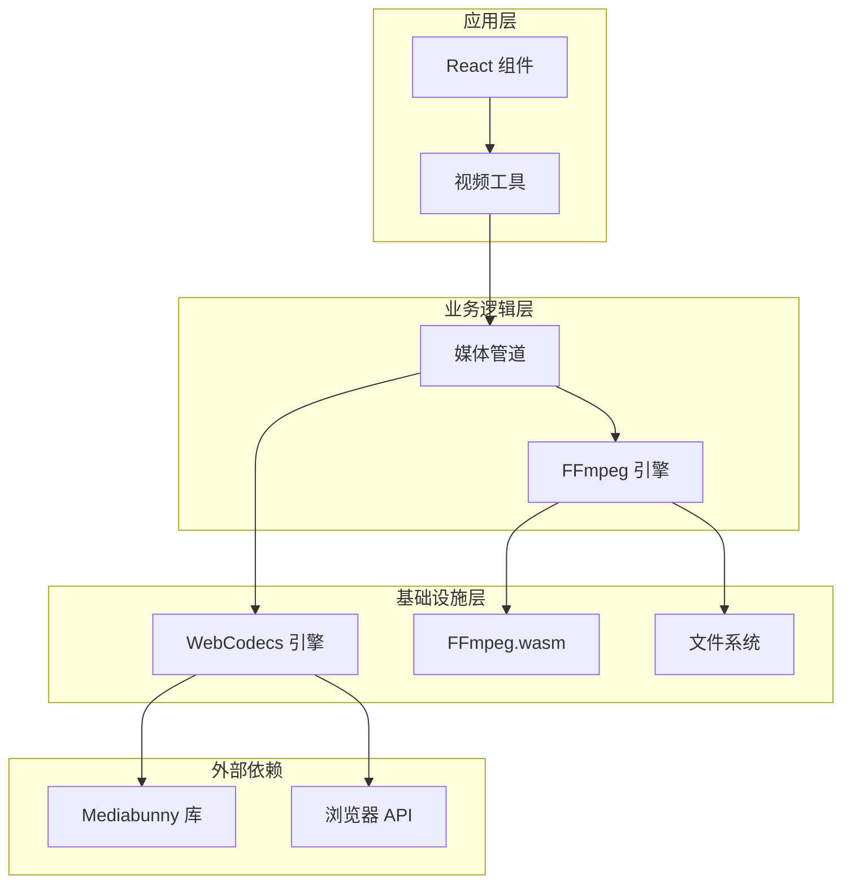

**图表来源**
- [media-pipeline.ts:1-105](file://src/lib/media-pipeline.ts#L1-L105)
- [ffmpeg.ts:1-144](file://src/lib/ffmpeg.ts#L1-L144)

**章节来源**
- [package.json:1-45](file://package.json#L1-L45)

## 核心组件

### WebCodecs 引擎

WebCodecs 引擎是基于浏览器原生 WebCodecs API 的硬件加速媒体处理引擎。它通过 Mediabunny 库提供高级接口，支持以下特性：

- **硬件加速解码/编码**：利用 GPU 进行视频解码和编码
- **多格式支持**：支持多种视频和音频格式
- **实时处理**：低延迟的媒体流处理能力
- **智能轨道管理**：自动处理音轨和视频轨的分离与合并

### FFmpeg.wasm 引擎

FFmpeg.wasm 引擎提供完整的 FFmpeg 功能的 WebAssembly 实现，具有以下特点：

- **完整功能集**：支持所有 FFmpeg 编解码器和滤镜
- **跨平台兼容性**：在所有支持 WebAssembly 的浏览器中运行
- **文件系统抽象**：通过 WORKERFS 提供虚拟文件系统
- **进度监控**：详细的处理进度反馈

### 智能切换机制

系统实现了智能的引擎选择策略，根据浏览器能力和媒体格式自动选择最优的处理引擎：

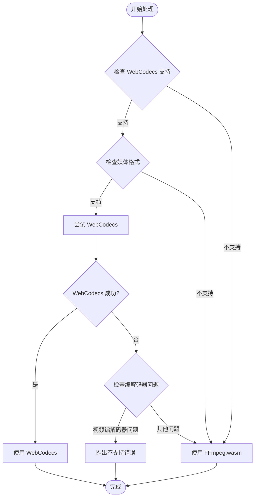

**图表来源**
- [compress/logic.ts:85-110](file://src/tools/video/compress/logic.ts#L85-L110)
- [format-convert/logic.ts:32-56](file://src/tools/video/format-convert/logic.ts#L32-L56)

**章节来源**
- [media-pipeline.ts:7-14](file://src/lib/media-pipeline.ts#L7-L14)
- [compress/logic.ts:85-110](file://src/tools/video/compress/logic.ts#L85-L110)

## 架构概览

媒体处理管道采用分层架构设计，确保了良好的可维护性和扩展性：

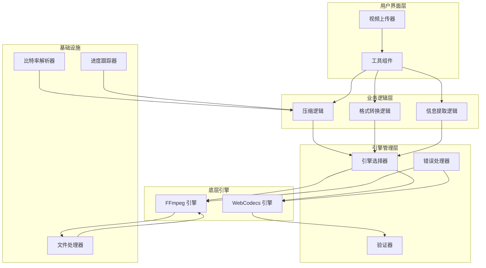

**图表来源**
- [compress/VideoCompress.tsx:1-529](file://src/tools/video/compress/VideoCompress.tsx#L1-L529)
- [format-convert/VideoFormatConvert.tsx:1-141](file://src/tools/video/format-convert/VideoFormatConvert.tsx#L1-L141)
- [media-pipeline.ts:16-91](file://src/lib/media-pipeline.ts#L16-L91)

## 详细组件分析

### WebCodecs 引擎实现

WebCodecs 引擎通过 Mediabunny 库提供统一的 API 接口，支持硬件加速的媒体处理：

#### 引擎支持检测

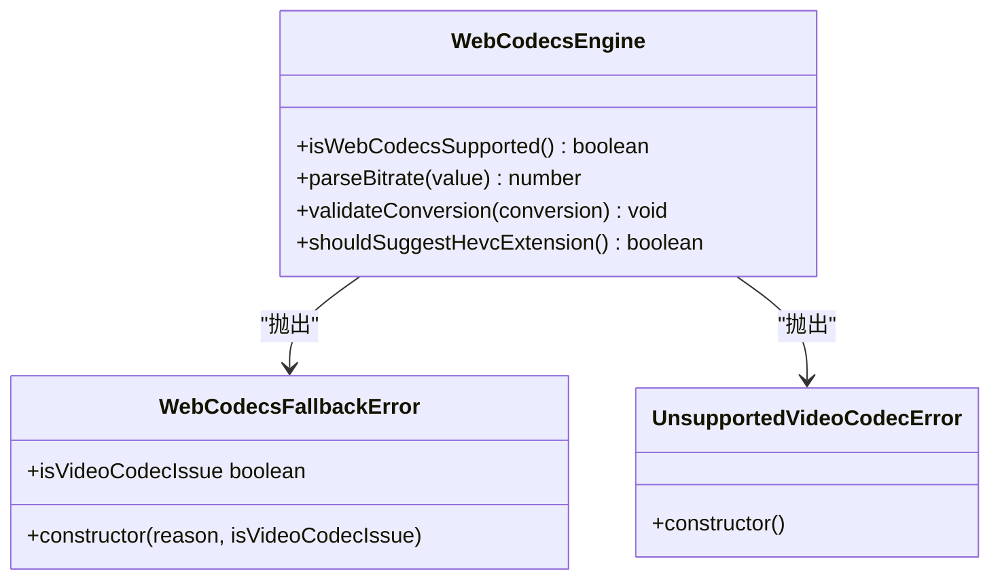

**图表来源**
- [media-pipeline.ts:7-14](file://src/lib/media-pipeline.ts#L7-L14)
- [media-pipeline.ts:32-41](file://src/lib/media-pipeline.ts#L32-L41)
- [media-pipeline.ts:48-53](file://src/lib/media-pipeline.ts#L48-L53)

#### 轨道验证机制

WebCodecs 引擎实现了严格的轨道验证机制，确保处理结果的质量：

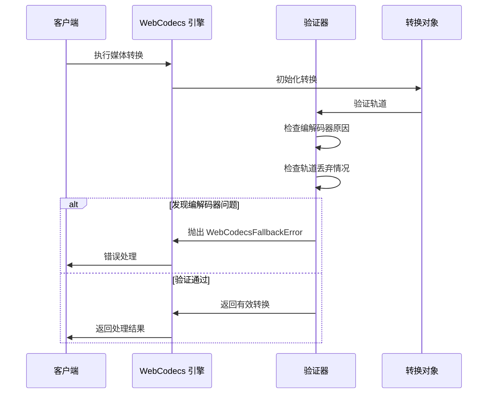

**图表来源**
- [media-pipeline.ts:59-91](file://src/lib/media-pipeline.ts#L59-L91)
- [compress/logic.ts:172-201](file://src/tools/video/compress/logic.ts#L172-L201)

**章节来源**
- [media-pipeline.ts:59-91](file://src/lib/media-pipeline.ts#L59-L91)

### FFmpeg.wasm 引擎实现

FFmpeg.wasm 引擎提供了完整的媒体处理能力，通过单线程队列确保操作的原子性：

#### 文件系统抽象

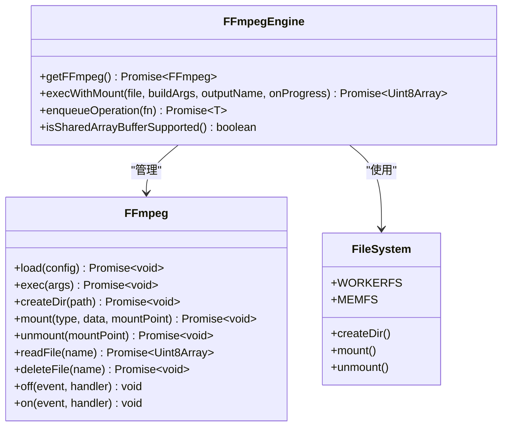

**图表来源**
- [ffmpeg.ts:10-39](file://src/lib/ffmpeg.ts#L10-L39)
- [ffmpeg.ts:99-143](file://src/lib/ffmpeg.ts#L99-L143)

#### 进度监控机制

FFmpeg 引擎实现了精确的进度监控，通过事件驱动的方式提供实时反馈：

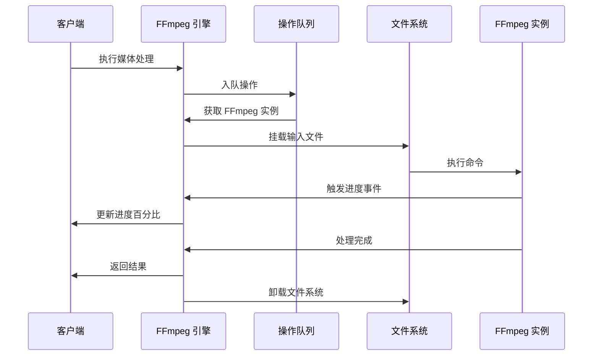

**图表来源**
- [ffmpeg.ts:41-58](file://src/lib/ffmpeg.ts#L41-L58)
- [ffmpeg.ts:105-142](file://src/lib/ffmpeg.ts#L105-L142)

**章节来源**
- [ffmpeg.ts:41-58](file://src/lib/ffmpeg.ts#L41-L58)
- [ffmpeg.ts:105-142](file://src/lib/ffmpeg.ts#L105-L142)

### 媒体处理工具集成

#### 视频压缩工具

视频压缩工具提供了简单和高级两种模式，支持多种质量配置：

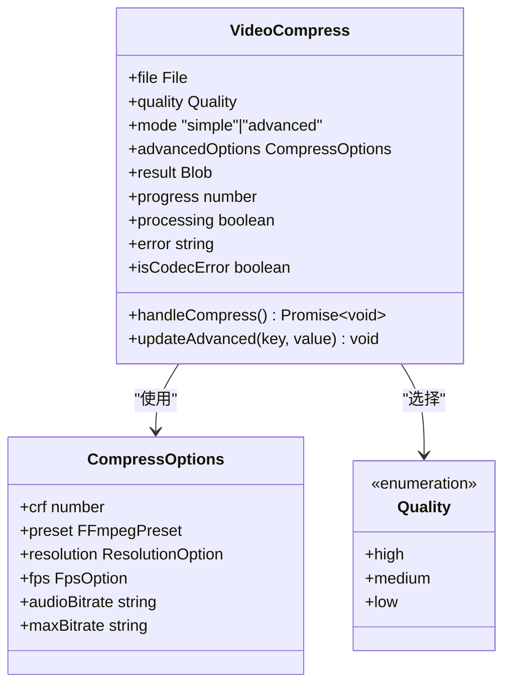

**图表来源**
- [compress/VideoCompress.tsx:45-529](file://src/tools/video/compress/VideoCompress.tsx#L45-L529)
- [compress/logic.ts:21-28](file://src/tools/video/compress/logic.ts#L21-L28)

#### 格式转换工具

格式转换工具支持多种输出格式，包括 MP4、MKV 和 AVI：

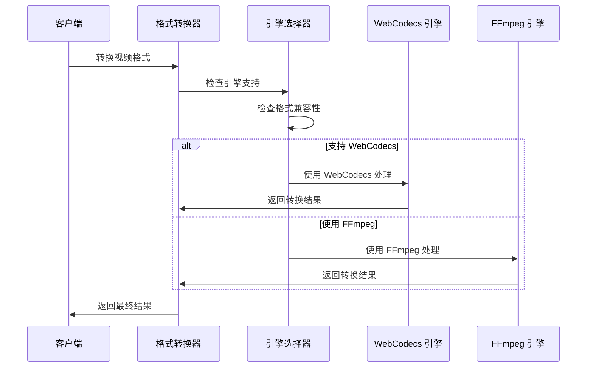

**图表来源**
- [format-convert/VideoFormatConvert.tsx:14-141](file://src/tools/video/format-convert/VideoFormatConvert.tsx#L14-L141)
- [format-convert/logic.ts:32-56](file://src/tools/video/format-convert/logic.ts#L32-L56)

**章节来源**
- [compress/VideoCompress.tsx:45-529](file://src/tools/video/compress/VideoCompress.tsx#L45-L529)
- [format-convert/VideoFormatConvert.tsx:14-141](file://src/tools/video/format-convert/VideoFormatConvert.tsx#L14-L141)

## 依赖关系分析

项目的核心依赖关系如下：

```mermaid
graph TB
subgraph "核心依赖"
Mediabunny[mediabunny ^1.40.1]
FFmpeg[ffmpeg ^0.12.15]
Util[@ffmpeg/util ^0.12.2]
end
subgraph "前端框架"
NextJS[next ^16.2.1]
React[react ^19.2.3]
ReactDOM[react-dom ^19.2.3]
end
subgraph "工具库"
Lucide[lucide-react ^0.577.0]
Tailwind[tailwind-merge ^3.5.0]
clsx ^2.1.1
end
subgraph "媒体处理"
BrowserCompression[browser-image-compression ^2.0.2]
JSQuash[@jsquash/avif ^2.1.1]
HEIC[heic2any ^0.0.4]
end
subgraph "开发工具"
ESLint[eslint ^9]
TypeScript[typescript ^5]
TailwindCSS[tailwindcss ^4]
end
Mediabunny --> NextJS
FFmpeg --> NextJS
Util --> FFmpeg
React --> NextJS
ReactDOM --> React
Lucide --> React
BrowserCompression --> NextJS
JSQuash --> NextJS
HEIC --> NextJS
```

**图表来源**
- [package.json:11-32](file://package.json#L11-L32)

**章节来源**
- [package.json:11-32](file://package.json#L11-L32)

## 性能考虑

### 硬件加速 vs 软件解码

系统在性能优化方面采用了多层次的策略：

#### WebCodecs 硬件加速优势

- **GPU 利用率**：充分利用现代 GPU 的并行计算能力
- **内存效率**：减少 CPU 内存拷贝，降低内存占用
- **实时性能**：提供更好的实时处理体验
- **功耗优化**：相比 CPU 解码更节能

#### FFmpeg.wasm 软件解码特点

- **兼容性**：支持所有 FFmpeg 编解码器
- **稳定性**：经过充分测试的成熟实现
- **功能完整性**：提供完整的媒体处理功能集
- **可预测性**：性能表现相对稳定

### 浏览器适配策略

系统针对不同浏览器环境实施了差异化的适配策略：

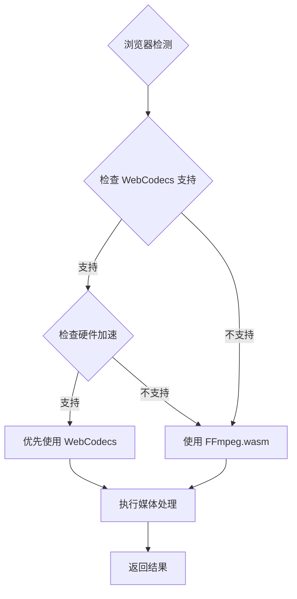

**图表来源**
- [compress/logic.ts:92-110](file://src/tools/video/compress/logic.ts#L92-L110)
- [format-convert/logic.ts:38-56](file://src/tools/video/format-convert/logic.ts#L38-L56)

**章节来源**
- [compress/logic.ts:92-110](file://src/tools/video/compress/logic.ts#L92-L110)
- [format-convert/logic.ts:38-56](file://src/tools/video/format-convert/logic.ts#L38-L56)

## 故障排除指南

### 错误处理策略

系统实现了完善的错误处理机制，针对不同类型的错误提供相应的处理策略：

#### WebCodecsFallbackError

当 WebCodecs 引擎无法处理特定媒体时抛出此错误：

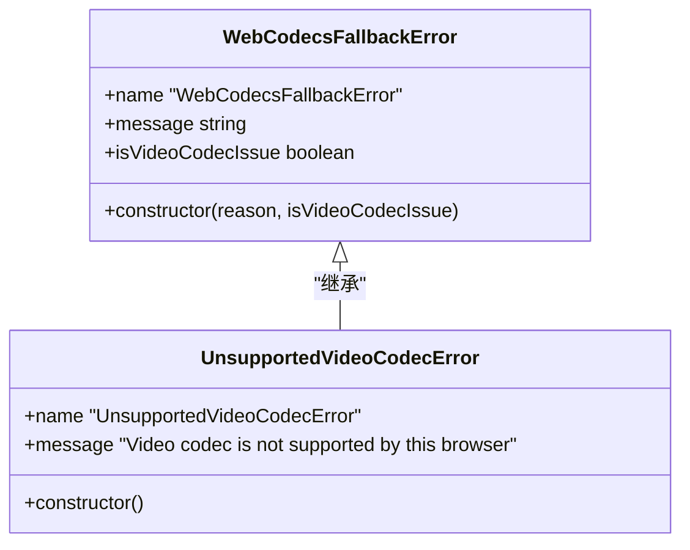

**图表来源**
- [media-pipeline.ts:32-41](file://src/lib/media-pipeline.ts#L32-L41)
- [media-pipeline.ts:48-53](file://src/lib/media-pipeline.ts#L48-L53)

#### 编解码器问题诊断

系统提供了专门的诊断机制来识别和处理编解码器相关问题：

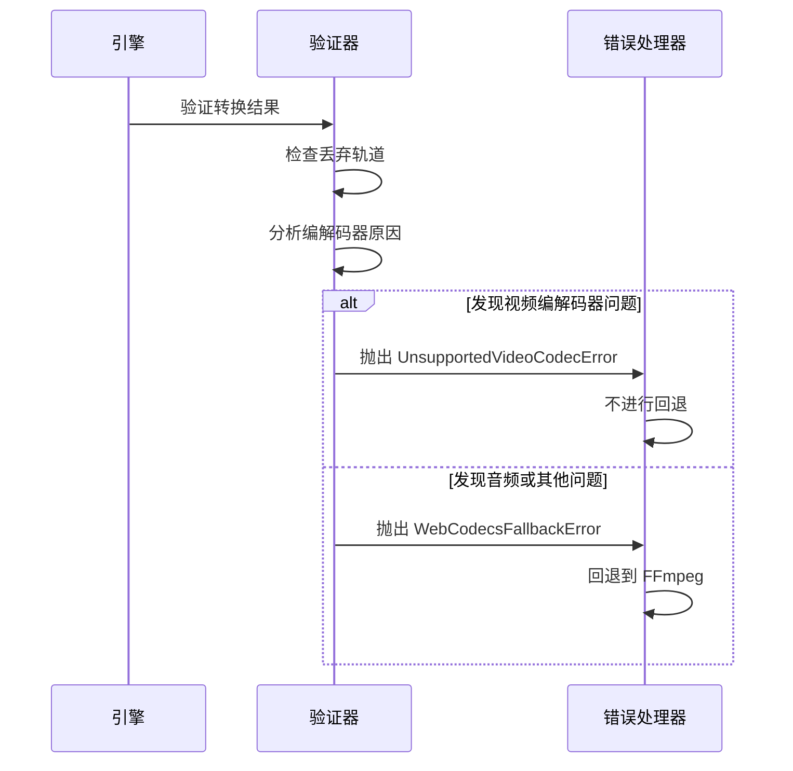

**图表来源**
- [media-pipeline.ts:68-87](file://src/lib/media-pipeline.ts#L68-L87)
- [compress/logic.ts:96-107](file://src/tools/video/compress/logic.ts#L96-L107)

**章节来源**
- [media-pipeline.ts:32-53](file://src/lib/media-pipeline.ts#L32-L53)
- [compress/logic.ts:96-107](file://src/tools/video/compress/logic.ts#L96-L107)

### 性能监控和调试

系统提供了多种性能监控和调试工具：

#### 进度跟踪

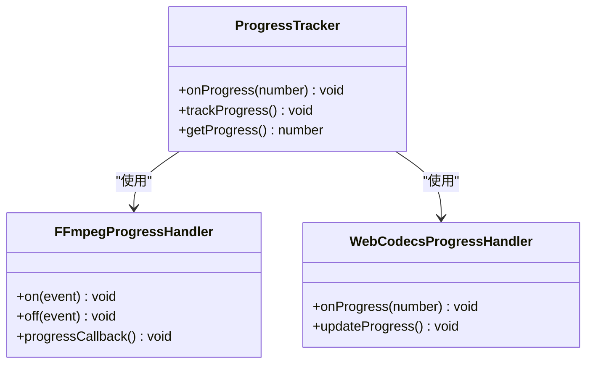

**图表来源**
- [ffmpeg.ts:41-58](file://src/lib/ffmpeg.ts#L41-L58)
- [compress/logic.ts:192-196](file://src/tools/video/compress/logic.ts#L192-L196)

**章节来源**
- [ffmpeg.ts:41-58](file://src/lib/ffmpeg.ts#L41-L58)
- [compress/logic.ts:192-196](file://src/tools/video/compress/logic.ts#L192-L196)

## 结论

媒体处理管道通过智能的引擎切换机制，成功地在现代 Web 技术和传统 FFmpeg 工具之间建立了平衡。该系统的主要优势包括：

1. **性能优化**：优先使用硬件加速的 WebCodecs 引擎，显著提升处理速度
2. **兼容性保障**：为不支持的场景提供 FFmpeg.wasm 作为可靠的后备方案
3. **用户体验**：提供直观的用户界面和实时的进度反馈
4. **可扩展性**：模块化的架构设计便于功能扩展和维护

通过合理的错误处理策略和性能监控机制，系统能够在各种浏览器环境中提供稳定可靠的服务。

## 附录

### 代码示例

#### 集成媒体处理管道

```typescript
// 基本使用示例
import { compressVideo } from '@/tools/video/compress/logic';

try {
  const compressedBlob = await compressVideo(
    file,
    'medium',
    (progress) => console.log(`进度: ${progress}%`)
  );
  console.log('压缩完成:', compressedBlob);
} catch (error) {
  if (error instanceof UnsupportedVideoCodecError) {
    console.log('不支持的编解码器');
  } else {
    console.error('处理失败:', error.message);
  }
}
```

#### 自定义配置

```typescript
// 高级配置示例
const customOptions = {
  crf: 28,
  preset: 'fast',
  resolution: '720p',
  fps: '30',
  audioBitrate: '128k',
  maxBitrate: '5M'
};

await compressVideo(file, customOptions);
```

#### 错误处理最佳实践

```typescript
// 错误处理示例
try {
  const result = await convertVideoFormat(file, 'mp4');
} catch (error) {
  if (error instanceof UnsupportedVideoCodecError) {
    // 处理不支持的编解码器
    showUnsupportedCodecMessage();
  } else if (error instanceof WebCodecsFallbackError) {
    // 处理 WebCodecs 回退
    fallbackToFFmpeg();
  } else {
    // 处理其他错误
    showError(error.message);
  }
}
```

**章节来源**
- [compress/logic.ts:85-110](file://src/tools/video/compress/logic.ts#L85-L110)
- [format-convert/logic.ts:32-56](file://src/tools/video/format-convert/logic.ts#L32-L56)