# WebCodecs视频处理

<cite>
**本文档引用的文件**
- [README.md](file://README.md)
- [package.json](file://package.json)
- [media-pipeline.ts](file://src/lib/media-pipeline.ts)
- [ffmpeg.ts](file://src/lib/ffmpeg.ts)
- [VideoCompress.tsx](file://src/tools/video/compress/VideoCompress.tsx)
- [logic.ts](file://src/tools/video/compress/logic.ts)
- [VideoFormatConvert.tsx](file://src/tools/video/format-convert/VideoFormatConvert.tsx)
- [logic.ts](file://src/tools/video/format-convert/logic.ts)
- [VideoInfo.tsx](file://src/tools/video/info/VideoInfo.tsx)
- [logic.ts](file://src/tools/video/info/logic.ts)
- [VideoUploader.tsx](file://src/components/shared/VideoUploader.tsx)
</cite>

## 目录
1. [简介](#简介)
2. [项目结构](#项目结构)
3. [核心组件](#核心组件)
4. [架构概览](#架构概览)
5. [详细组件分析](#详细组件分析)
6. [依赖关系分析](#依赖关系分析)
7. [性能考虑](#性能考虑)
8. [故障排除指南](#故障排除指南)
9. [结论](#结论)

## 简介

WebCodecs视频处理是一个基于浏览器端的多媒体工具箱项目，专注于提供本地化的视频处理能力。该项目采用WebCodecs技术作为主要处理引擎，同时保留FFmpeg.wasm作为后备方案，确保在各种浏览器环境下的兼容性和性能表现。

项目的核心特性包括：
- **隐私优先** - 所有处理都在浏览器本地完成，文件永不离开用户设备
- **硬件加速** - 利用WebCodecs的硬件编码器提升处理性能
- **多格式支持** - 支持MP4、MKV、AVI等多种视频格式
- **智能回退** - 当WebCodecs不支持时自动切换到FFmpeg.wasm
- **实时预览** - 提供处理前后的对比预览功能

## 项目结构

项目采用模块化的组织方式，主要分为以下几个核心部分：

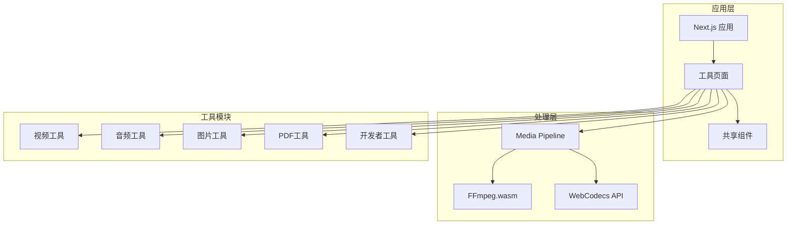

**图表来源**
- [README.md:55-78](file://README.md#L55-L78)

**章节来源**
- [README.md:55-78](file://README.md#L55-L78)
- [package.json:11-32](file://package.json#L11-L32)

## 核心组件

### Media Pipeline 核心架构

项目的核心是Media Pipeline，它提供了统一的视频处理接口，支持WebCodecs和FFmpeg两种处理后端：

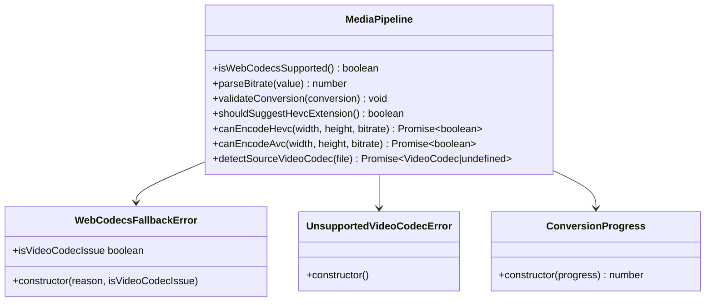

**图表来源**
- [media-pipeline.ts:7-175](file://src/lib/media-pipeline.ts#L7-L175)

### FFmpeg 处理引擎

FFmpeg.wasm提供了完整的视频处理能力，通过WORKERFS实现高效的文件挂载：

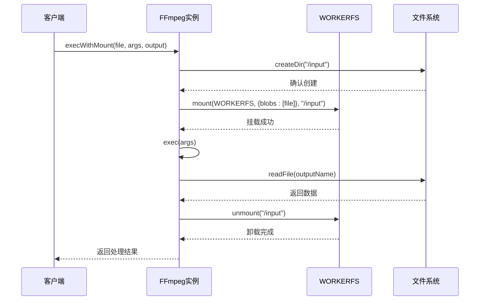

**图表来源**
- [ffmpeg.ts:99-144](file://src/lib/ffmpeg.ts#L99-L144)

**章节来源**
- [media-pipeline.ts:1-175](file://src/lib/media-pipeline.ts#L1-L175)
- [ffmpeg.ts:1-144](file://src/lib/ffmpeg.ts#L1-L144)

## 架构概览

项目采用了双引擎架构，结合了WebCodecs的硬件加速优势和FFmpeg.wasm的全面兼容性：

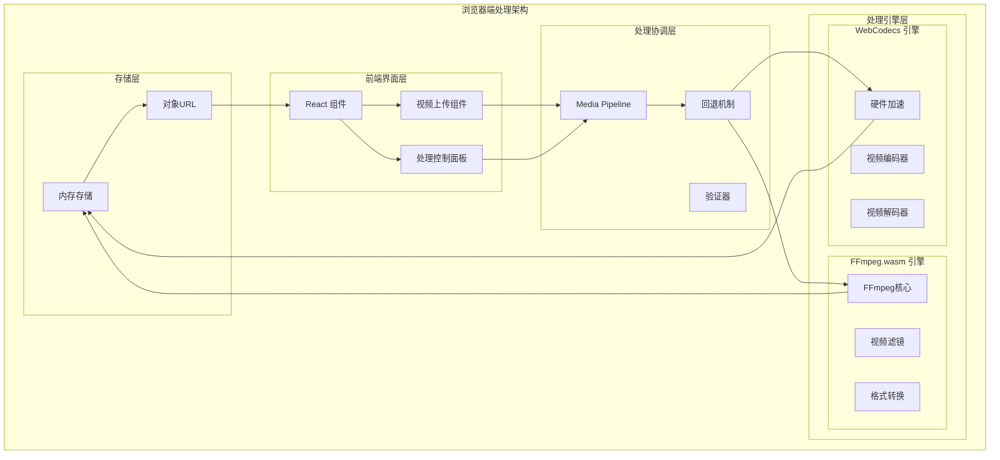

**图表来源**
- [media-pipeline.ts:1-175](file://src/lib/media-pipeline.ts#L1-L175)
- [ffmpeg.ts:1-144](file://src/lib/ffmpeg.ts#L1-L144)

## 详细组件分析

### 视频压缩工具

视频压缩工具提供了简单和高级两种模式，支持多种质量级别和编码选项：

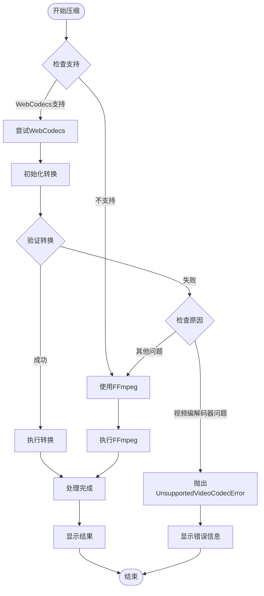

**图表来源**
- [VideoCompress.tsx:101-134](file://src/tools/video/compress/VideoCompress.tsx#L101-L134)
- [logic.ts:87-112](file://src/tools/video/compress/logic.ts#L87-L112)

#### 压缩参数配置

工具支持多种压缩参数配置，包括质量级别、分辨率、帧率等：

| 参数类型 | 可选值 | 默认值 | 描述 |
|---------|--------|--------|------|
| 质量级别 | high, medium, low | medium | 预设质量配置 |
| 编码器 | avc, hevc | avc | 视频编码格式选择 |
| 分辨率 | original, 1080p, 720p, 480p, 360p | original | 输出视频分辨率 |
| 帧率 | original, 30, 24, 15 | original | 输出视频帧率 |
| 音频比特率 | 64k, 96k, 128k, 192k, 256k | 128k | 音频质量设置 |

**章节来源**
- [VideoCompress.tsx:30-44](file://src/tools/video/compress/VideoCompress.tsx#L30-L44)
- [VideoCompress.tsx:186-624](file://src/tools/video/compress/VideoCompress.tsx#L186-L624)
- [logic.ts:32-54](file://src/tools/video/compress/logic.ts#L32-L54)

### 视频格式转换工具

格式转换工具支持MP4、MKV、AVI三种格式之间的转换，具有智能的流复制检测功能：

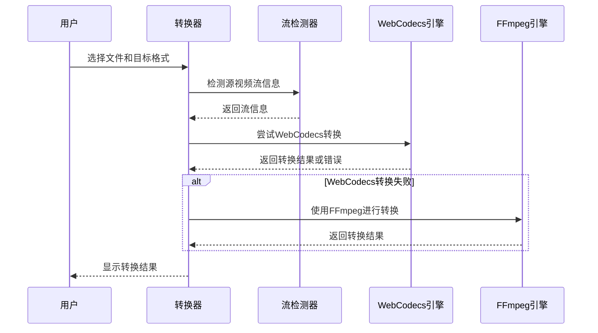

**图表来源**
- [VideoFormatConvert.tsx:66-92](file://src/tools/video/format-convert/VideoFormatConvert.tsx#L66-L92)
- [logic.ts:38-63](file://src/tools/video/format-convert/logic.ts#L38-L63)

#### 格式转换策略

不同格式的转换策略有所不同：

| 目标格式 | 转换方式 | 特殊说明 |
|---------|----------|----------|
| MP4 | 总是转码 | 使用H.264编码，AAC音频 |
| MKV | 智能检测 | 编码器匹配时使用流复制 |
| AVI | 总是转码 | 使用H.264编码，AAC音频 |

**章节来源**
- [VideoFormatConvert.tsx:14-225](file://src/tools/video/format-convert/VideoFormatConvert.tsx#L14-L225)
- [logic.ts:12-31](file://src/tools/video/format-convert/logic.ts#L12-L31)

### 视频信息分析工具

视频信息分析工具提供了全面的媒体信息检测和可视化功能：

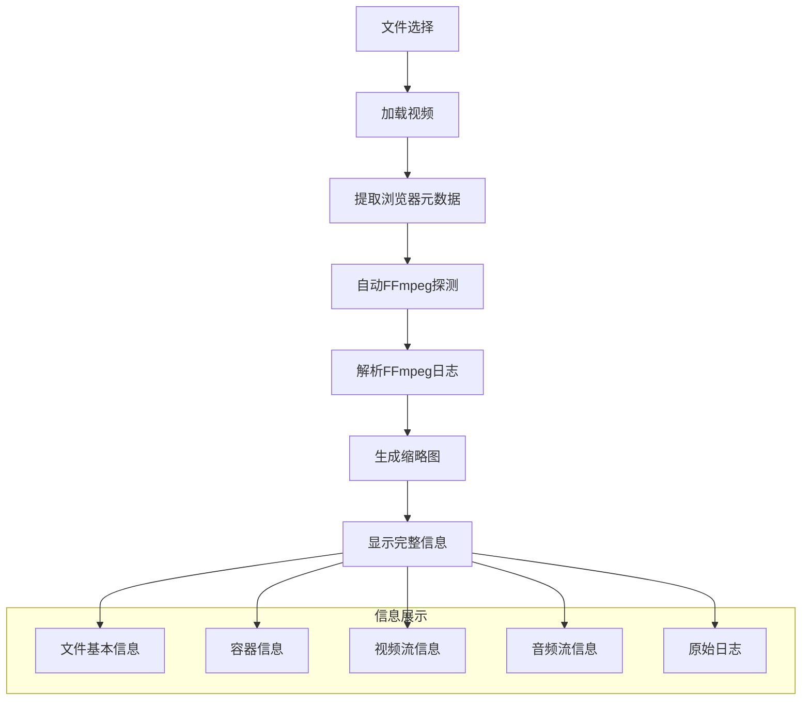

**图表来源**
- [VideoInfo.tsx:36-58](file://src/tools/video/info/VideoInfo.tsx#L36-L58)
- [logic.ts:33-71](file://src/tools/video/info/logic.ts#L33-L71)

**章节来源**
- [VideoInfo.tsx:1-308](file://src/tools/video/info/VideoInfo.tsx#L1-L308)
- [logic.ts:1-272](file://src/tools/video/info/logic.ts#L1-L272)

### 共享组件 - 视频上传器

视频上传器组件提供了统一的文件上传、元数据提取和预览功能：

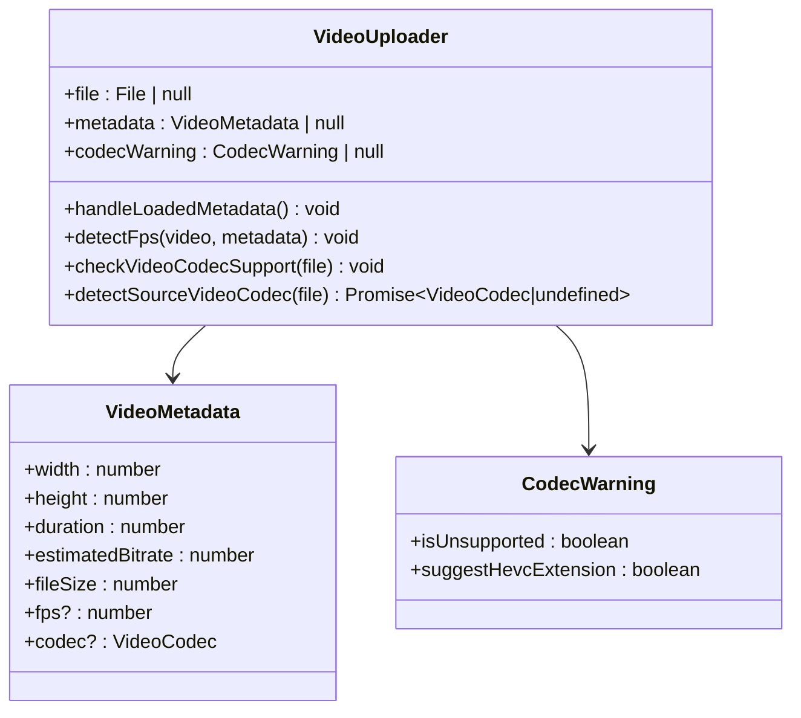

**图表来源**
- [VideoUploader.tsx:68-125](file://src/components/shared/VideoUploader.tsx#L68-L125)

**章节来源**
- [VideoUploader.tsx:1-393](file://src/components/shared/VideoUploader.tsx#L1-L393)

## 依赖关系分析

项目的技术栈和依赖关系如下：

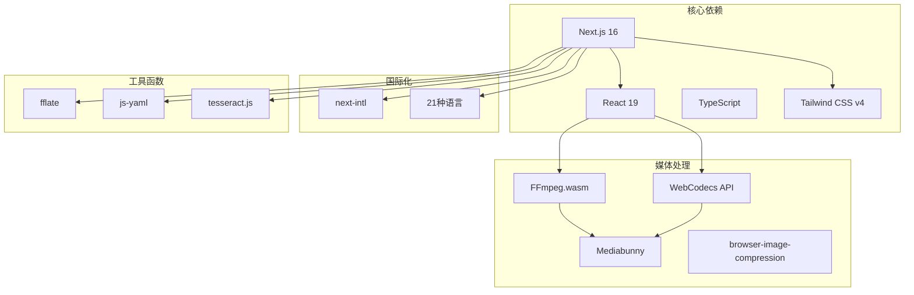

**图表来源**
- [package.json:11-32](file://package.json#L11-L32)

**章节来源**
- [package.json:1-45](file://package.json#L1-L45)
- [README.md:26-33](file://README.md#L26-L33)

## 性能考虑

### 硬件加速优化

项目充分利用了现代浏览器的硬件加速能力：

1. **WebCodecs硬件编码** - 自动检测和使用GPU硬件编码器
2. **智能回退机制** - 当硬件不支持时自动切换到软件编码
3. **内存管理优化** - 使用WORKERFS避免重复内存拷贝
4. **并发控制** - 通过Promise队列确保FFmpeg操作的串行执行

### 内存使用优化

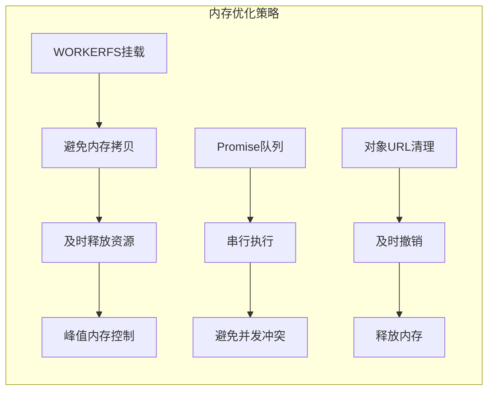

**图表来源**
- [ffmpeg.ts:117-141](file://src/lib/ffmpeg.ts#L117-L141)

### 性能监控

项目实现了多层次的性能监控和进度反馈：

1. **WebCodecs进度回调** - 实时显示转换进度
2. **FFmpeg进度事件** - 通过progress事件获取处理状态
3. **元数据预览** - 提供处理前后的对比预览
4. **性能指标统计** - 记录文件大小变化和处理时间

## 故障排除指南

### 常见问题及解决方案

| 问题类型 | 症状描述 | 解决方案 |
|---------|----------|----------|
| WebCodecs不支持 | 显示"不支持此功能"提示 | 检查浏览器版本和启用硬件加速 |
| 视频编解码器不支持 | 抛出UnsupportedVideoCodecError | 安装HEVC扩展或使用FFmpeg |
| 内存不足 | 处理过程中页面卡顿 | 减小输入文件大小或降低质量设置 |
| 进度条不更新 | 处理无响应 | 检查浏览器控制台错误日志 |

### 错误处理机制

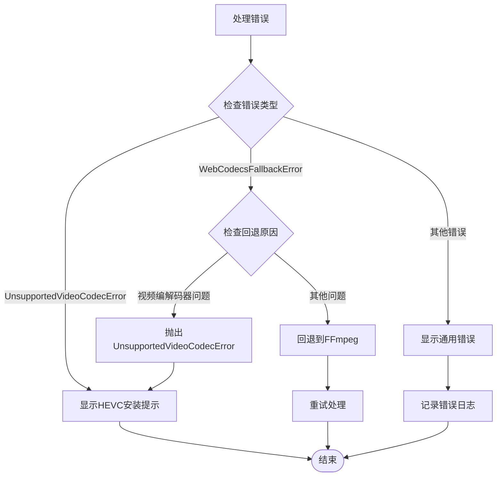

**图表来源**
- [VideoCompress.tsx:123-134](file://src/tools/video/compress/VideoCompress.tsx#L123-L134)
- [VideoUploader.tsx:303-315](file://src/components/shared/VideoUploader.tsx#L303-L315)

**章节来源**
- [VideoCompress.tsx:123-134](file://src/tools/video/compress/VideoCompress.tsx#L123-L134)
- [VideoUploader.tsx:303-315](file://src/components/shared/VideoUploader.tsx#L303-L315)

## 结论

WebCodecs视频处理项目展现了现代浏览器多媒体处理的强大能力。通过巧妙地结合WebCodecs的硬件加速优势和FFmpeg.wasm的全面兼容性，项目实现了高性能、低延迟的本地视频处理体验。

### 主要优势

1. **隐私保护** - 所有处理都在浏览器本地完成，确保用户数据安全
2. **性能卓越** - 利用硬件加速显著提升处理速度
3. **兼容性强** - 智能回退机制确保在各种环境下正常工作
4. **用户体验佳** - 实时预览和进度反馈提供流畅的操作体验

### 技术亮点

- **双引擎架构** - WebCodecs + FFmpeg.wasm的混合处理模式
- **智能检测** - 自动检测编解码器支持情况
- **内存优化** - 通过WORKERFS实现高效的文件处理
- **错误处理** - 完善的异常捕获和用户提示机制

该项目为浏览器端多媒体处理提供了一个优秀的参考实现，展示了现代Web技术在多媒体领域的强大潜力。