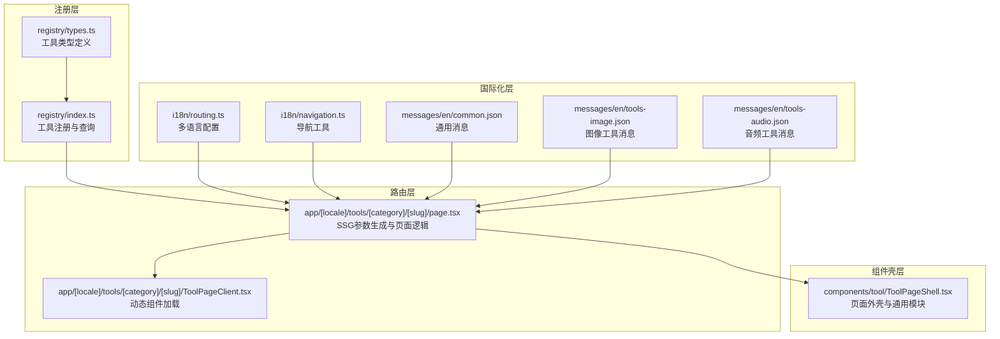
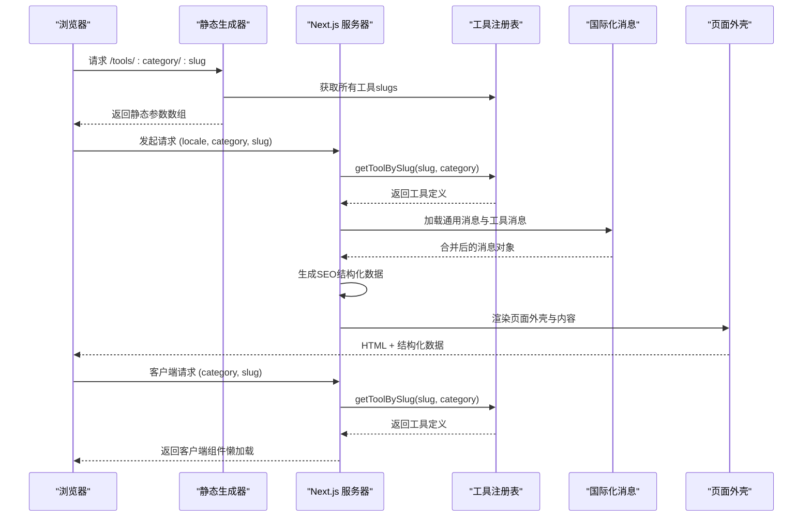
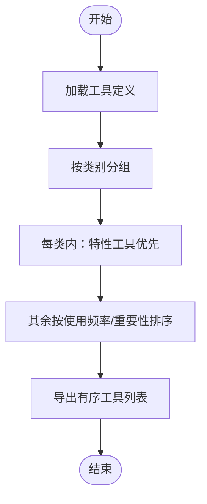
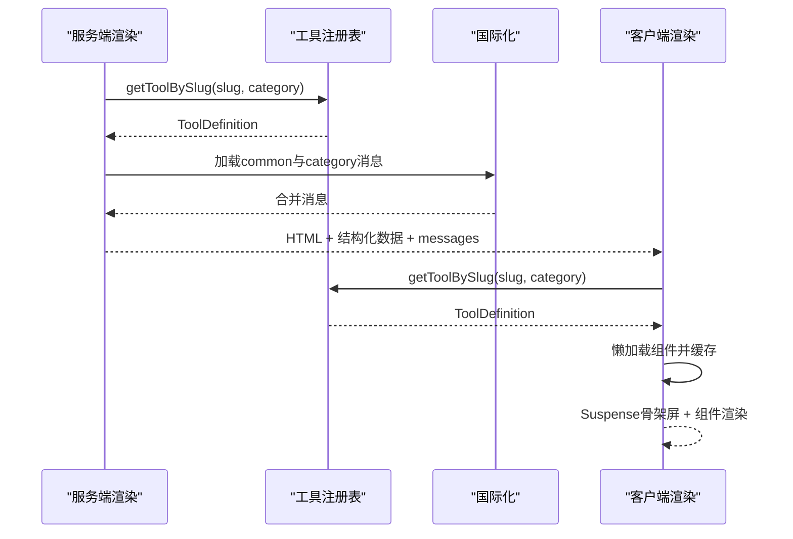
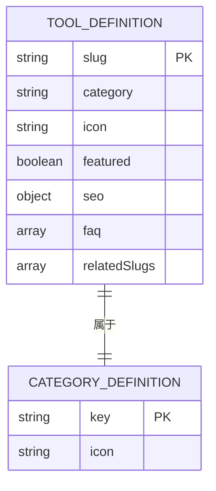
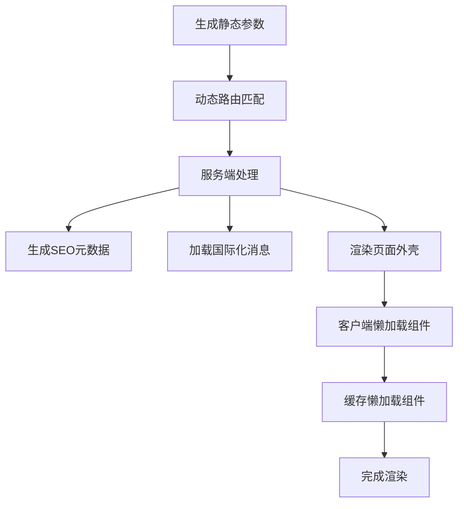
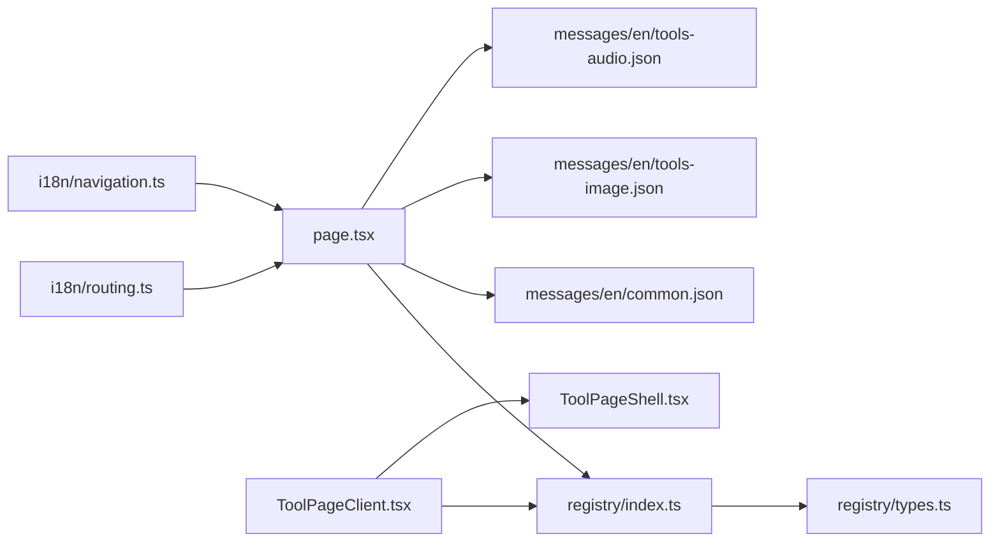

# 工具注册系统

<cite>
**本文档引用的文件**
- [src/lib/registry/index.ts](file://src/lib/registry/index.ts)
- [src/lib/registry/types.ts](file://src/lib/registry/types.ts)
- [src/app/[locale]/tools/[category]/[slug]/page.tsx](file://src/app/[locale]/tools/[category]/[slug]/page.tsx)
- [src/app/[locale]/tools/[category]/[slug]/ToolPageClient.tsx](file://src/app/[locale]/tools/[category]/[slug]/ToolPageClient.tsx)
- [src/components/tool/ToolPageShell.tsx](file://src/components/tool/ToolPageShell.tsx)
- [src/i18n/routing.ts](file://src/i18n/routing.ts)
- [src/i18n/navigation.ts](file://src/i18n/navigation.ts)
- [messages/en/common.json](file://messages/en/common.json)
- [messages/en/tools-image.json](file://messages/en/tools-image.json)
- [messages/en/tools-audio.json](file://messages/en/tools-audio.json)
- [src/tools/audio/convert/index.ts](file://src/tools/audio/convert/index.ts)
- [src/tools/image/compress/index.ts](file://src/tools/image/compress/index.ts)
</cite>

## 目录
1. [简介](#简介)
2. [项目结构](#项目结构)
3. [核心组件](#核心组件)
4. [架构总览](#架构总览)
5. [详细组件分析](#详细组件分析)
6. [依赖关系分析](#依赖关系分析)
7. [性能考虑](#性能考虑)
8. [故障排除指南](#故障排除指南)
9. [结论](#结论)
10. [附录](#附录)

## 简介
本项目采用“工具注册表”模式统一管理所有在线工具（图像、视频、音频、PDF、开发者工具）。通过集中注册与声明式元数据，系统实现了：
- 工具元数据的统一存储与查询
- 工具分类体系的清晰设计
- 动态加载与页面渲染的自动化流程
- 国际化消息与SEO结构化数据的集成
- 在Next.js App Router中的SSG/SSR路由生成与懒加载渲染

该系统以类型安全为核心，确保工具注册、路由生成、页面渲染与国际化消息的一致性。

## 项目结构
工具注册系统主要由以下层次组成：
- 注册层：集中注册所有工具元数据，提供查询接口
- 路由层：基于工具元数据生成静态参数，支持多语言
- 页面层：按工具动态加载对应组件并渲染
- 国际化层：按工具类别与slug加载翻译消息
- 组件壳层：封装工具页面通用布局与功能模块



**图表来源**
- [src/lib/registry/index.ts:1-164](file://src/lib/registry/index.ts#L1-L164)
- [src/lib/registry/types.ts:1-22](file://src/lib/registry/types.ts#L1-L22)
- [src/app/[locale]/tools/[category]/[slug]/page.tsx](file://src/app/[locale]/tools/[category]/[slug]/page.tsx#L1-L109)
- [src/app/[locale]/tools/[category]/[slug]/ToolPageClient.tsx](file://src/app/[locale]/tools/[category]/[slug]/ToolPageClient.tsx#L1-L59)
- [src/i18n/routing.ts:1-18](file://src/i18n/routing.ts#L1-L18)
- [src/i18n/navigation.ts:1-6](file://src/i18n/navigation.ts#L1-L6)
- [messages/en/common.json:1-508](file://messages/en/common.json#L1-L508)
- [messages/en/tools-image.json:1-822](file://messages/en/tools-image.json#L1-L822)
- [messages/en/tools-audio.json:1-191](file://messages/en/tools-audio.json#L1-L191)
- [src/components/tool/ToolPageShell.tsx:1-54](file://src/components/tool/ToolPageShell.tsx#L1-L54)

**章节来源**
- [src/lib/registry/index.ts:1-164](file://src/lib/registry/index.ts#L1-L164)
- [src/lib/registry/types.ts:1-22](file://src/lib/registry/types.ts#L1-L22)
- [src/app/[locale]/tools/[category]/[slug]/page.tsx](file://src/app/[locale]/tools/[category]/[slug]/page.tsx#L1-L109)
- [src/app/[locale]/tools/[category]/[slug]/ToolPageClient.tsx](file://src/app/[locale]/tools/[category]/[slug]/ToolPageClient.tsx#L1-L59)
- [src/i18n/routing.ts:1-18](file://src/i18n/routing.ts#L1-L18)
- [src/i18n/navigation.ts:1-6](file://src/i18n/navigation.ts#L1-L6)
- [messages/en/common.json:1-508](file://messages/en/common.json#L1-L508)
- [messages/en/tools-image.json:1-822](file://messages/en/tools-image.json#L1-L822)
- [messages/en/tools-audio.json:1-191](file://messages/en/tools-audio.json#L1-L191)
- [src/components/tool/ToolPageShell.tsx:1-54](file://src/components/tool/ToolPageShell.tsx#L1-L54)

## 核心组件
- 工具注册表：集中导入并注册所有工具元数据，提供按slug/category查询、分类筛选、特性工具筛选等能力
- 工具类型定义：严格约束工具元数据字段，包括slug、category、icon、是否特性推荐、组件懒加载函数、SEO结构化数据、FAQ键值对、相关工具slug列表
- 路由页面：生成静态参数（SSG），解析locale/category/slug，加载工具元数据与翻译，注入结构化数据，渲染客户端页面
- 客户端页面：基于工具元数据进行懒加载渲染，缓存懒加载组件，避免重复加载
- 页面外壳：封装工具页面通用布局（标题、描述、隐私指示、功能卡片、使用说明、为什么选择等）
- 多语言配置：定义可用语言、默认语言、RTL语言集合；提供导航工具
- 国际化消息：按类别与slug加载工具专用翻译，合并通用消息

**章节来源**
- [src/lib/registry/index.ts:1-164](file://src/lib/registry/index.ts#L1-L164)
- [src/lib/registry/types.ts:1-22](file://src/lib/registry/types.ts#L1-L22)
- [src/app/[locale]/tools/[category]/[slug]/page.tsx](file://src/app/[locale]/tools/[category]/[slug]/page.tsx#L1-L109)
- [src/app/[locale]/tools/[category]/[slug]/ToolPageClient.tsx](file://src/app/[locale]/tools/[category]/[slug]/ToolPageClient.tsx#L1-L59)
- [src/components/tool/ToolPageShell.tsx:1-54](file://src/components/tool/ToolPageShell.tsx#L1-L54)
- [src/i18n/routing.ts:1-18](file://src/i18n/routing.ts#L1-L18)
- [src/i18n/navigation.ts:1-6](file://src/i18n/navigation.ts#L1-L6)
- [messages/en/common.json:1-508](file://messages/en/common.json#L1-L508)
- [messages/en/tools-image.json:1-822](file://messages/en/tools-image.json#L1-L822)
- [messages/en/tools-audio.json:1-191](file://messages/en/tools-audio.json#L1-L191)

## 架构总览
系统采用“声明式元数据 + 动态懒加载”的架构，核心流程如下：
- 注册阶段：在注册表中集中导入各工具的元数据定义
- 路由阶段：根据注册表生成静态参数，支持多语言
- 渲染阶段：服务端生成页面与SEO结构化数据，客户端按需懒加载工具组件
- 国际化阶段：按工具类别与slug加载翻译，合并通用消息



**图表来源**
- [src/app/[locale]/tools/[category]/[slug]/page.tsx](file://src/app/[locale]/tools/[category]/[slug]/page.tsx#L13-L31)
- [src/lib/registry/index.ts:139-147](file://src/lib/registry/index.ts#L139-L147)
- [src/app/[locale]/tools/[category]/[slug]/ToolPageClient.tsx](file://src/app/[locale]/tools/[category]/[slug]/ToolPageClient.tsx#L29-L42)
- [messages/en/common.json:1-508](file://messages/en/common.json#L1-L508)
- [messages/en/tools-image.json:1-822](file://messages/en/tools-image.json#L1-L822)
- [messages/en/tools-audio.json:1-191](file://messages/en/tools-audio.json#L1-L191)

## 详细组件分析

### 工具注册表与类型系统
- 注册表职责
  - 集中导入各工具元数据（不导入实际组件，仅导入元数据）
  - 提供getAllTools/getToolBySlug/getToolsByCategory/getAllSlugs/getFeaturedTools/getNonFeaturedTools等查询方法
  - 按类别与特性标记组织工具顺序，便于前端展示
- 类型系统
  - ToolCategory限定为"developer"|"image"|"pdf"|"video"|"audio"
  - ToolDefinition包含slug、category、icon、featured、component懒加载函数、SEO结构化数据、FAQ键值对、相关工具slug列表
  - CategoryDefinition用于类别图标等扩展信息

```mermaid
classDiagram
class ToolDefinition {
+string slug
+ToolCategory category
+string icon
+boolean featured
+function component()
+object seo
+array faq
+array relatedSlugs
}
class CategoryDefinition {
+ToolCategory key
+string icon
}
class Registry {
+getAllTools() ToolDefinition[]
+getToolBySlug(slug, category?) ToolDefinition
+getToolsByCategory(category) ToolDefinition[]
+getAllSlugs() {category, slug}[]
+getFeaturedTools(category) ToolDefinition[]
+getNonFeaturedTools(category) ToolDefinition[]
}
Registry --> ToolDefinition : "管理"
ToolDefinition --> CategoryDefinition : "关联"
```

**图表来源**
- [src/lib/registry/types.ts:3-21](file://src/lib/registry/types.ts#L3-L21)
- [src/lib/registry/index.ts:66-163](file://src/lib/registry/index.ts#L66-L163)

**章节来源**
- [src/lib/registry/index.ts:1-164](file://src/lib/registry/index.ts#L1-L164)
- [src/lib/registry/types.ts:1-22](file://src/lib/registry/types.ts#L1-L22)

### 工具分类体系设计
- 分类枚举：developer、image、pdf、video、audio
- 展示顺序：注册表中按“特性工具优先、使用频率或类别重要性排序”，便于前端侧边栏与首页展示
- 类别介绍与关键词：通过国际化消息提供类别名称、描述与关键词，支持SEO与搜索



**图表来源**
- [src/lib/registry/index.ts:66-133](file://src/lib/registry/index.ts#L66-L133)
- [messages/en/common.json:118-144](file://messages/en/common.json#L118-L144)

**章节来源**
- [src/lib/registry/index.ts:66-133](file://src/lib/registry/index.ts#L66-L133)
- [messages/en/common.json:118-144](file://messages/en/common.json#L118-L144)

### 工具动态加载与页面渲染
- 服务端渲染流程
  - generateStaticParams：遍历所有工具slugs与locales，生成静态路由参数，支持SSG
  - 页面逻辑：setRequestLocale、getToolBySlug、加载通用与工具消息、生成SEO结构化数据（工具、面包屑、FAQ）
  - 注入NextIntlClientProvider，传递合并后的messages
- 客户端渲染流程
  - ToolPageClient：从注册表获取工具定义，基于懒加载函数动态导入组件
  - 使用Map缓存懒加载组件，避免重复创建
  - 使用Suspense提供骨架屏，提升用户体验



**图表来源**
- [src/app/[locale]/tools/[category]/[slug]/page.tsx](file://src/app/[locale]/tools/[category]/[slug]/page.tsx#L13-L31)
- [src/app/[locale]/tools/[category]/[slug]/page.tsx](file://src/app/[locale]/tools/[category]/[slug]/page.tsx#L46-L54)
- [src/app/[locale]/tools/[category]/[slug]/page.tsx](file://src/app/[locale]/tools/[category]/[slug]/page.tsx#L100-L107)
- [src/app/[locale]/tools/[category]/[slug]/ToolPageClient.tsx](file://src/app/[locale]/tools/[category]/[slug]/ToolPageClient.tsx#L29-L42)

**章节来源**
- [src/app/[locale]/tools/[category]/[slug]/page.tsx](file://src/app/[locale]/tools/[category]/[slug]/page.tsx#L1-L109)
- [src/app/[locale]/tools/[category]/[slug]/ToolPageClient.tsx](file://src/app/[locale]/tools/[category]/[slug]/ToolPageClient.tsx#L1-L59)

### 工具配置选项与验证机制
- 工具元数据字段
  - slug：工具唯一标识，用于路由与消息键
  - category：所属类别
  - icon：Lucide图标名
  - featured：是否在特性工具中展示
  - component：懒加载函数，返回组件Promise
  - seo：结构化数据类型（WebApplication/SoftwareApplication）
  - faq：FAQ键值对数组，用于动态生成问答
  - relatedSlugs：相关工具slug列表
- 验证与约束
  - 类型系统强制字段存在性与类型正确性
  - 注册表查询方法保证slug唯一性与category一致性
  - 国际化消息键与工具定义保持一致，避免运行时缺失



**图表来源**
- [src/lib/registry/types.ts:5-21](file://src/lib/registry/types.ts#L5-L21)

**章节来源**
- [src/lib/registry/types.ts:1-22](file://src/lib/registry/types.ts#L1-L22)

### 工具扩展最佳实践
- 新增工具步骤
  - 在对应类别目录下创建工具目录与index.ts元数据文件
  - 在元数据文件中定义slug、category、icon、component懒加载函数、seo、faq、relatedSlugs
  - 在注册表中导入该工具元数据（不导入组件）
  - 在国际化消息中添加common与tools.*.*键值
  - 如需SSG预渲染，确认generateStaticParams覆盖到该工具
- 命名规范
  - slug使用全小写短横线分隔，与路由一致
  - icon使用Lucide图标名
  - FAQ键使用tools.<category>.<slug>.faq.q<number>/a<number>格式
  - relatedSlugs指向同类别内相关工具
- 性能建议
  - 将常用工具置于特性工具前列，提升首屏展示效率
  - 使用懒加载组件，减少初始包体积
  - 利用客户端缓存懒加载组件，避免重复创建

**章节来源**
- [src/lib/registry/index.ts:3-64](file://src/lib/registry/index.ts#L3-L64)
- [src/tools/audio/convert/index.ts:1-37](file://src/tools/audio/convert/index.ts#L1-L37)
- [src/tools/image/compress/index.ts:1-37](file://src/tools/image/compress/index.ts#L1-L37)
- [messages/en/common.json:243-497](file://messages/en/common.json#L243-L497)
- [messages/en/tools-image.json:1-822](file://messages/en/tools-image.json#L1-L822)
- [messages/en/tools-audio.json:1-191](file://messages/en/tools-audio.json#L1-L191)

### 在Next.js App Router中的应用实例
- 动态路由与SSG
  - 路由路径：/tools/[category]/[slug]
  - generateStaticParams：遍历locales与slugs，生成静态参数
  - generateMetadata：基于工具元数据生成SEO标题、描述与结构化数据
- 多语言支持
  - locales定义与默认语言设置
  - 导航工具Link/redirect/usePathname/useRouter/getPathname
- 页面渲染
  - 服务端：setRequestLocale、getToolBySlug、加载消息、生成JSON-LD
  - 客户端：懒加载组件、骨架屏、相关工具与FAQ渲染



**图表来源**
- [src/app/[locale]/tools/[category]/[slug]/page.tsx](file://src/app/[locale]/tools/[category]/[slug]/page.tsx#L13-L31)
- [src/i18n/routing.ts:3-12](file://src/i18n/routing.ts#L3-L12)
- [src/i18n/navigation.ts:4-5](file://src/i18n/navigation.ts#L4-L5)
- [src/components/tool/ToolPageShell.tsx:15-52](file://src/components/tool/ToolPageShell.tsx#L15-L52)

**章节来源**
- [src/app/[locale]/tools/[category]/[slug]/page.tsx](file://src/app/[locale]/tools/[category]/[slug]/page.tsx#L1-L109)
- [src/i18n/routing.ts:1-18](file://src/i18n/routing.ts#L1-L18)
- [src/i18n/navigation.ts:1-6](file://src/i18n/navigation.ts#L1-L6)
- [src/components/tool/ToolPageShell.tsx:1-54](file://src/components/tool/ToolPageShell.tsx#L1-L54)

## 依赖关系分析
- 内聚性
  - 注册表高度内聚，集中管理工具元数据与查询逻辑
  - 页面层与国际化层解耦，通过消息键与工具定义关联
- 耦合度
  - 路由页面依赖注册表与国际化消息
  - 客户端页面依赖注册表与页面外壳
  - 工具元数据定义依赖类型系统
- 循环依赖
  - 无循环依赖：注册表不导入组件，仅导入元数据；页面层通过懒加载导入组件



**图表来源**
- [src/lib/registry/index.ts:1-164](file://src/lib/registry/index.ts#L1-L164)
- [src/lib/registry/types.ts:1-22](file://src/lib/registry/types.ts#L1-L22)
- [src/app/[locale]/tools/[category]/[slug]/page.tsx](file://src/app/[locale]/tools/[category]/[slug]/page.tsx#L1-L109)
- [src/app/[locale]/tools/[category]/[slug]/ToolPageClient.tsx](file://src/app/[locale]/tools/[category]/[slug]/ToolPageClient.tsx#L1-L59)
- [src/components/tool/ToolPageShell.tsx:1-54](file://src/components/tool/ToolPageShell.tsx#L1-L54)
- [src/i18n/routing.ts:1-18](file://src/i18n/routing.ts#L1-L18)
- [src/i18n/navigation.ts:1-6](file://src/i18n/navigation.ts#L1-L6)
- [messages/en/common.json:1-508](file://messages/en/common.json#L1-L508)
- [messages/en/tools-image.json:1-822](file://messages/en/tools-image.json#L1-L822)
- [messages/en/tools-audio.json:1-191](file://messages/en/tools-audio.json#L1-L191)

**章节来源**
- [src/lib/registry/index.ts:1-164](file://src/lib/registry/index.ts#L1-L164)
- [src/lib/registry/types.ts:1-22](file://src/lib/registry/types.ts#L1-L22)
- [src/app/[locale]/tools/[category]/[slug]/page.tsx](file://src/app/[locale]/tools/[category]/[slug]/page.tsx#L1-L109)
- [src/app/[locale]/tools/[category]/[slug]/ToolPageClient.tsx](file://src/app/[locale]/tools/[category]/[slug]/ToolPageClient.tsx#L1-L59)
- [src/components/tool/ToolPageShell.tsx:1-54](file://src/components/tool/ToolPageShell.tsx#L1-L54)
- [src/i18n/routing.ts:1-18](file://src/i18n/routing.ts#L1-L18)
- [src/i18n/navigation.ts:1-6](file://src/i18n/navigation.ts#L1-L6)
- [messages/en/common.json:1-508](file://messages/en/common.json#L1-L508)
- [messages/en/tools-image.json:1-822](file://messages/en/tools-image.json#L1-L822)
- [messages/en/tools-audio.json:1-191](file://messages/en/tools-audio.json#L1-L191)

## 性能考虑
- 懒加载与缓存
  - 使用懒加载函数延迟导入组件，减少初始包体积
  - 客户端使用Map缓存懒加载组件，避免重复创建
- 骨架屏
  - Suspense提供骨架屏，改善首屏渲染体验
- SSG与静态参数
  - generateStaticParams生成静态路由参数，提升SSG效率
- 国际化消息合并
  - 合并通用消息与工具消息，避免重复加载

**章节来源**
- [src/app/[locale]/tools/[category]/[slug]/ToolPageClient.tsx](file://src/app/[locale]/tools/[category]/[slug]/ToolPageClient.tsx#L26-L42)
- [src/app/[locale]/tools/[category]/[slug]/page.tsx](file://src/app/[locale]/tools/[category]/[slug]/page.tsx#L46-L54)

## 故障排除指南
- 工具未找到
  - 检查slug与category是否与注册表一致
  - 确认工具已在注册表中导入
- 路由参数缺失
  - 确认generateStaticParams已覆盖该工具
  - 检查locales配置是否包含目标语言
- 国际化消息缺失
  - 确认common与tools.*.*键存在
  - 检查命名空间与工具slug一致
- 客户端懒加载失败
  - 检查component懒加载函数返回的组件路径
  - 确认组件导出default

**章节来源**
- [src/lib/registry/index.ts:139-147](file://src/lib/registry/index.ts#L139-L147)
- [src/app/[locale]/tools/[category]/[slug]/page.tsx](file://src/app/[locale]/tools/[category]/[slug]/page.tsx#L13-L22)
- [messages/en/common.json:243-497](file://messages/en/common.json#L243-L497)
- [src/app/[locale]/tools/[category]/[slug]/ToolPageClient.tsx](file://src/app/[locale]/tools/[category]/[slug]/ToolPageClient.tsx#L33-L42)

## 结论
工具注册系统通过“声明式元数据 + 动态懒加载 + 类型约束 + 国际化集成”的设计，实现了工具的可扩展、可维护与高性能渲染。其核心优势包括：
- 统一的工具元数据管理与查询接口
- 清晰的分类体系与展示顺序
- 自动化的SSG路由生成与页面渲染
- 可扩展的国际化与SEO结构化数据
- 在Next.js App Router中的无缝集成

该系统为新增工具提供了标准化流程与最佳实践，确保新工具能够快速上线并保持一致的用户体验与性能表现。

## 附录
- 工具元数据字段参考
  - slug：工具唯一标识
  - category：工具类别
  - icon：图标名称
  - featured：是否特性展示
  - component：懒加载函数
  - seo：结构化数据类型
  - faq：FAQ键值对数组
  - relatedSlugs：相关工具slug列表
- 国际化键命名规范
  - common：通用键
  - categories：类别名称与描述
  - tools.<category>.<slug>：工具名称、描述、SEO、FAQ、使用说明等

**章节来源**
- [src/lib/registry/types.ts:5-21](file://src/lib/registry/types.ts#L5-L21)
- [messages/en/common.json:243-497](file://messages/en/common.json#L243-L497)
- [messages/en/tools-image.json:1-822](file://messages/en/tools-image.json#L1-L822)
- [messages/en/tools-audio.json:1-191](file://messages/en/tools-audio.json#L1-L191)