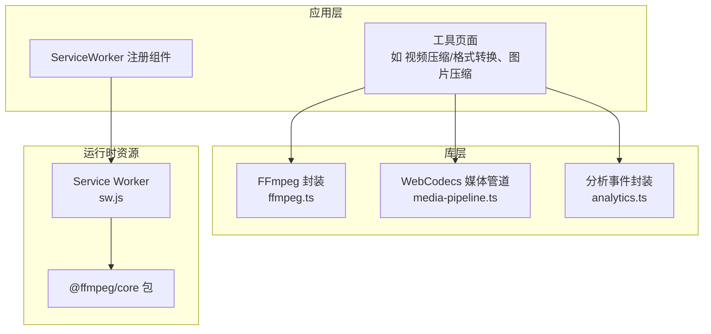
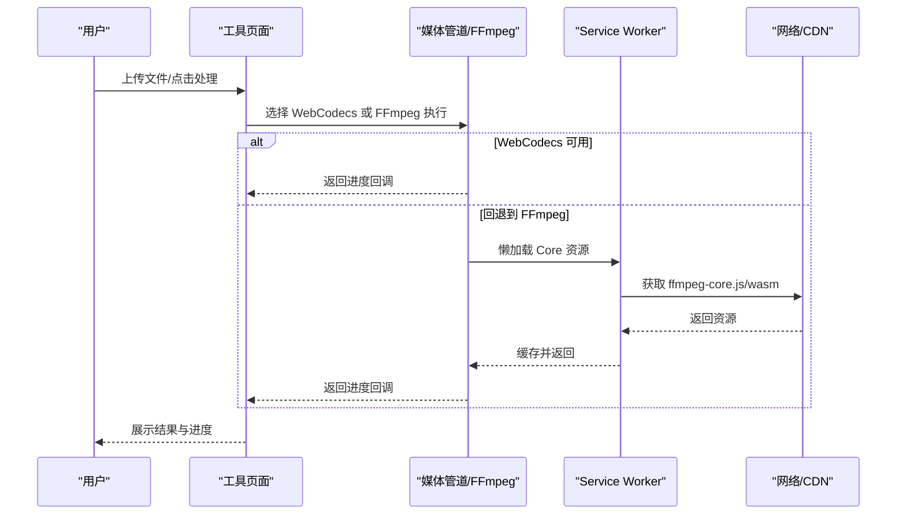
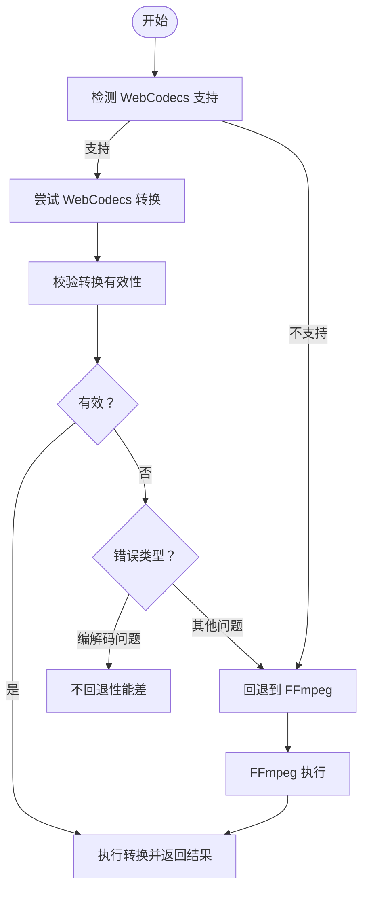
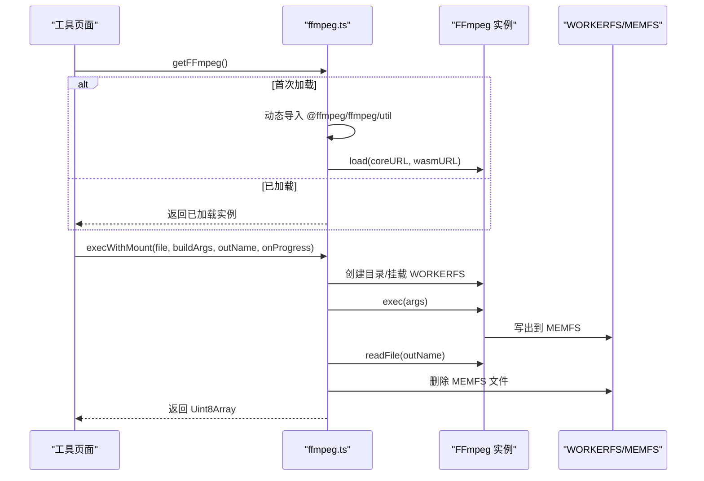
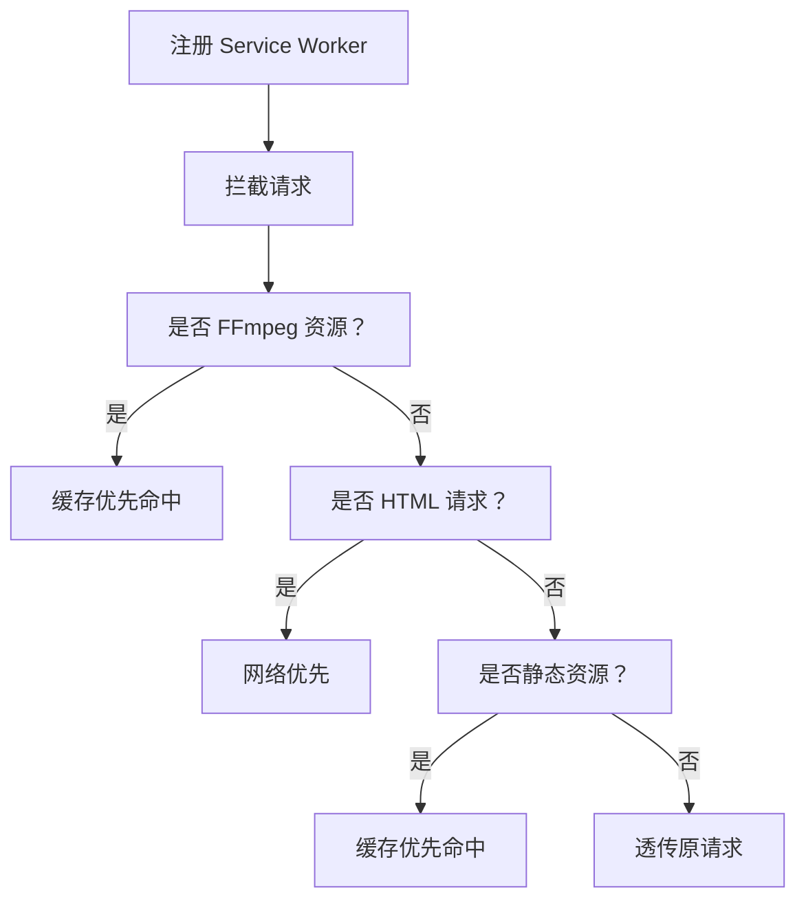
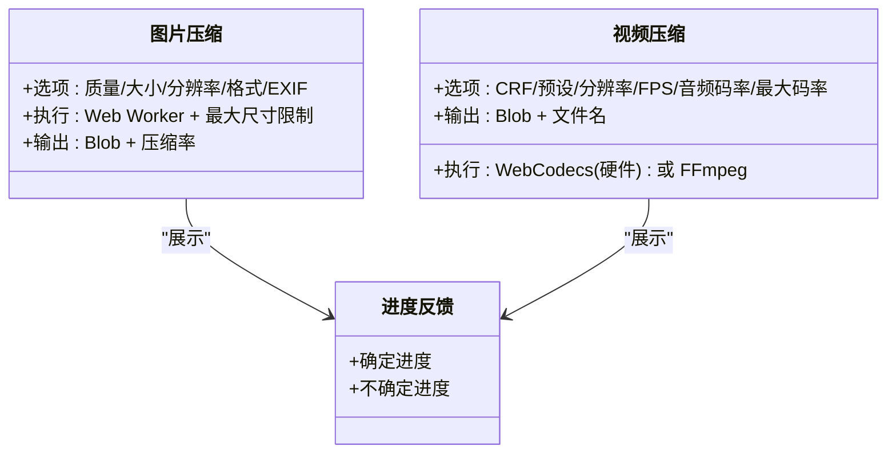
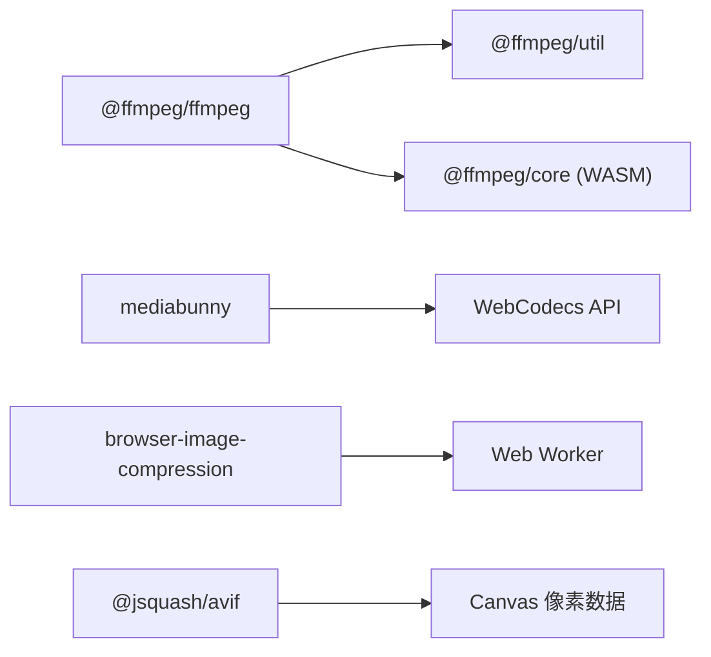

# 性能优化策略

<cite>
**本文引用的文件**
- [ffmpeg.ts](file://src/lib/ffmpeg.ts)
- [media-pipeline.ts](file://src/lib/media-pipeline.ts)
- [sw.js](file://public/sw.js)
- [ServiceWorkerRegistration.tsx](file://src/components/shared/ServiceWorkerRegistration.tsx)
- [analytics.ts](file://src/lib/analytics.ts)
- [logic.ts（视频压缩）](file://src/tools/video/compress/logic.ts)
- [logic.ts（视频格式转换）](file://src/tools/video/format-convert/logic.ts)
- [ImageCompress.tsx](file://src/tools/image/compress/ImageCompress.tsx)
- [logic.ts（图片压缩）](file://src/tools/image/compress/logic.ts)
- [ProcessingProgress.tsx](file://src/components/shared/ProcessingProgress.tsx)
- [package.json](file://package.json)
- [@ffmpeg__ffmpeg@0.12.15.patch](file://patches/@ffmpeg__ffmpeg@0.12.15.patch)
</cite>

## 目录
1. [简介](#简介)
2. [项目结构](#项目结构)
3. [核心组件](#核心组件)
4. [架构总览](#架构总览)
5. [详细组件分析](#详细组件分析)
6. [依赖关系分析](#依赖关系分析)
7. [性能考量与优化建议](#性能考量与优化建议)
8. [故障排查指南](#故障排查指南)
9. [结论](#结论)
10. [附录：性能监控与调试方法](#附录性能监控与调试方法)

## 简介
本技术文档聚焦于媒体处理工具箱在浏览器端的性能优化策略，涵盖以下主题：
- WebCodecs 硬件加速的性能优势与适用场景
- FFmpeg.wasm 的内存管理、懒加载与任务串行化
- PWA 缓存策略（Service Worker 注册与缓存控制）
- 图片与视频处理的性能瓶颈与优化方案（预览生成、进度反馈）
- 性能监控与调试方法（关键指标与分析）
- 实际优化案例与效果对比思路

## 项目结构
项目采用 Next.js 应用结构，媒体处理能力通过“库层”封装与“工具页”调用分离，便于在不同工具中复用优化策略。

图表来源
- [ffmpeg.ts:1-144](file://src/lib/ffmpeg.ts#L1-L144)
- [media-pipeline.ts:1-105](file://src/lib/media-pipeline.ts#L1-L105)
- [sw.js:1-93](file://public/sw.js#L1-L93)
- [ServiceWorkerRegistration.tsx:1-16](file://src/components/shared/ServiceWorkerRegistration.tsx#L1-L16)
- [package.json:1-45](file://package.json#L1-L45)

章节来源
- [ffmpeg.ts:1-144](file://src/lib/ffmpeg.ts#L1-L144)
- [media-pipeline.ts:1-105](file://src/lib/media-pipeline.ts#L1-L105)
- [sw.js:1-93](file://public/sw.js#L1-L93)
- [ServiceWorkerRegistration.tsx:1-16](file://src/components/shared/ServiceWorkerRegistration.tsx#L1-L16)
- [package.json:1-45](file://package.json#L1-L45)

## 核心组件
- FFmpeg 封装（懒加载、内存管理、任务队列）
- WebCodecs 媒体管道（硬件加速、回退策略、编解码校验）
- PWA 缓存（Service Worker、静态资源与 FFmpeg 资源缓存）
- 工具逻辑（视频压缩/格式转换、图片压缩）
- 进度反馈与分析埋点

章节来源
- [ffmpeg.ts:1-144](file://src/lib/ffmpeg.ts#L1-L144)
- [media-pipeline.ts:1-105](file://src/lib/media-pipeline.ts#L1-L105)
- [sw.js:1-93](file://public/sw.js#L1-L93)
- [ServiceWorkerRegistration.tsx:1-16](file://src/components/shared/ServiceWorkerRegistration.tsx#L1-L16)
- [logic.ts（视频压缩）:1-257](file://src/tools/video/compress/logic.ts#L1-L257)
- [logic.ts（视频格式转换）:1-134](file://src/tools/video/format-convert/logic.ts#L1-L134)
- [logic.ts（图片压缩）:1-135](file://src/tools/image/compress/logic.ts#L1-L135)
- [ImageCompress.tsx:1-373](file://src/tools/image/compress/ImageCompress.tsx#L1-L373)
- [ProcessingProgress.tsx:1-47](file://src/components/shared/ProcessingProgress.tsx#L1-L47)
- [analytics.ts:1-138](file://src/lib/analytics.ts#L1-L138)

## 架构总览
整体流程：用户在工具页选择输入文件，前端根据能力选择 WebCodecs 或 FFmpeg 执行；执行过程中通过进度回调更新 UI；PWA 缓存关键资源以降低重复加载成本；分析埋点记录处理耗时与错误。

图表来源
- [logic.ts（视频压缩）:85-110](file://src/tools/video/compress/logic.ts#L85-L110)
- [logic.ts（视频格式转换）:32-56](file://src/tools/video/format-convert/logic.ts#L32-L56)
- [ffmpeg.ts:10-39](file://src/lib/ffmpeg.ts#L10-L39)
- [sw.js:30-50](file://public/sw.js#L30-L50)

## 详细组件分析

### WebCodecs 硬件加速
- 能力检测：通过全局对象存在性判断是否支持编码器/解码器
- 硬件加速：优先使用硬件加速路径，提升视频压缩/转码性能
- 回退策略：当检测到不支持的编解码或转换无效时，抛出自定义错误并按需回退到 FFmpeg
- 兼容性提示：针对 Windows 上 Chromium 浏览器可提示安装 HEVC 扩展以启用 H.265 解码

图表来源
- [media-pipeline.ts:7-14](file://src/lib/media-pipeline.ts#L7-L14)
- [media-pipeline.ts:28-91](file://src/lib/media-pipeline.ts#L28-L91)
- [media-pipeline.ts:93-104](file://src/lib/media-pipeline.ts#L93-L104)
- [logic.ts（视频压缩）:92-110](file://src/tools/video/compress/logic.ts#L92-L110)
- [logic.ts（视频格式转换）:37-56](file://src/tools/video/format-convert/logic.ts#L37-L56)

章节来源
- [media-pipeline.ts:1-105](file://src/lib/media-pipeline.ts#L1-L105)
- [logic.ts（视频压缩）:85-110](file://src/tools/video/compress/logic.ts#L85-L110)
- [logic.ts（视频格式转换）:32-56](file://src/tools/video/format-convert/logic.ts#L32-L56)

### FFmpeg.wasm 内存管理与懒加载
- 懒加载：首次使用时动态导入并加载 Core 资源，避免初始包体积膨胀
- 进度回调：统一设置/清理进度监听，保证单次执行期间回调唯一
- 任务串行化：通过 Promise 队列确保 FFmpeg 单线程执行，避免挂载点冲突
- 内存优化：使用 WORKERFS 直接挂载 File 对象，避免两次内存拷贝；读取输出后立即删除 MEMFS 文件，降低峰值内存占用
- 补丁适配：对 @ffmpeg/ffmpeg 的 worker 加载行为进行打包兼容调整

图表来源
- [ffmpeg.ts:10-39](file://src/lib/ffmpeg.ts#L10-L39)
- [ffmpeg.ts:99-143](file://src/lib/ffmpeg.ts#L99-L143)
- [ffmpeg.ts:75-82](file://src/lib/ffmpeg.ts#L75-L82)
- [ffmpeg.ts:41-58](file://src/lib/ffmpeg.ts#L41-L58)

章节来源
- [ffmpeg.ts:1-144](file://src/lib/ffmpeg.ts#L1-L144)
- [package.json:11-31](file://package.json#L11-L31)
- [@ffmpeg__ffmpeg@0.12.15.patch:1-14](file://patches/@ffmpeg__ffmpeg@0.12.15.patch#L1-L14)

### PWA 缓存策略（Service Worker）
- 注册：在客户端组件中注册 /sw.js，失败静默处理
- 缓存策略：
  - FFmpeg 核心资源（含版本号）永久缓存（cache-first）
  - HTML 采用 network-first，保持内容新鲜
  - 静态资源（JS/CSS/图片等）采用 cache-first
- 生命周期：install 跳过等待，activate 清理旧缓存并 claim 控制权

图表来源
- [ServiceWorkerRegistration.tsx:5-12](file://src/components/shared/ServiceWorkerRegistration.tsx#L5-L12)
- [sw.js:30-92](file://public/sw.js#L30-L92)

章节来源
- [ServiceWorkerRegistration.tsx:1-16](file://src/components/shared/ServiceWorkerRegistration.tsx#L1-L16)
- [sw.js:1-93](file://public/sw.js#L1-L93)

### 图片与视频处理的性能瓶颈与优化
- 图片压缩
  - 使用 browser-image-compression 并启用 Web Worker 与最大尺寸限制，避免主线程阻塞
  - AVIF 路径先将图像绘制到 Canvas 获取像素数据再编码，减少额外库依赖
  - 支持 EXIF 保留与多格式输出（JPEG/PNG/WEBP/AVIF）
- 视频压缩/格式转换
  - 优先 WebCodecs 硬件加速；对不支持的编解码直接报错，避免低性能回退
  - 统一进度回调与错误分类，保障用户体验
- 进度反馈
  - 提供确定/不确定两种进度条样式，结合本地化文案提升感知

图表来源
- [logic.ts（图片压缩）:83-123](file://src/tools/image/compress/logic.ts#L83-L123)
- [ImageCompress.tsx:138-178](file://src/tools/image/compress/ImageCompress.tsx#L138-L178)
- [logic.ts（视频压缩）:203-256](file://src/tools/video/compress/logic.ts#L203-L256)
- [logic.ts（视频格式转换）:117-133](file://src/tools/video/format-convert/logic.ts#L117-L133)
- [ProcessingProgress.tsx:14-46](file://src/components/shared/ProcessingProgress.tsx#L14-L46)

章节来源
- [logic.ts（图片压缩）:1-135](file://src/tools/image/compress/logic.ts#L1-L135)
- [ImageCompress.tsx:1-373](file://src/tools/image/compress/ImageCompress.tsx#L1-L373)
- [logic.ts（视频压缩）:1-257](file://src/tools/video/compress/logic.ts#L1-L257)
- [logic.ts（视频格式转换）:1-134](file://src/tools/video/format-convert/logic.ts#L1-L134)
- [ProcessingProgress.tsx:1-47](file://src/components/shared/ProcessingProgress.tsx#L1-L47)

## 依赖关系分析
- 核心依赖
  - @ffmpeg/ffmpeg：WASM 版本的 FFmpeg，配合 @ffmpeg/util 提供懒加载与 BlobURL
  - mediabunny：WebCodecs 媒体转换库，提供硬件加速与缓冲目标
  - browser-image-compression：图片压缩库，支持 Web Worker 与多格式
  - @jsquash/avif：AVIF 编码器，用于 Canvas 像素数据编码
- 打包补丁：对 @ffmpeg/ffmpeg 的 worker 导入行为进行打包兼容处理，避免构建器误解析

图表来源
- [package.json:11-31](file://package.json#L11-L31)
- [@ffmpeg__ffmpeg@0.12.15.patch:1-14](file://patches/@ffmpeg__ffmpeg@0.12.15.patch#L1-L14)

章节来源
- [package.json:1-45](file://package.json#L1-L45)
- [@ffmpeg__ffmpeg@0.12.15.patch:1-14](file://patches/@ffmpeg__ffmpeg@0.12.15.patch#L1-L14)

## 性能考量与优化建议
- WebCodecs 优势与场景
  - 优势：利用 GPU 硬件加速，显著降低 CPU 占用与耗时
  - 场景：MP4/MKV 等受支持的容器与编解码组合；对 H.264/AAC 的转码与缩放
  - 注意：对 HEVC/VP9/AV1 等编解码器可能不支持，应避免回退到 FFmpeg 以防止性能劣化
- FFmpeg.wasm 优化
  - 懒加载与缓存：通过 Service Worker 缓存核心资源，减少二次加载时间
  - 任务串行化：避免并发挂载点冲突，保证稳定性
  - 内存拷贝规避：使用 WORKERFS 挂载 File 对象，读取后及时删除 MEMFS 输出
  - 进度回调：仅保留当前任务的回调，避免重复绑定导致的抖动
- 图片处理
  - Web Worker：开启 useWebWorker，避免主线程阻塞
  - 最大尺寸：合理设置 maxWidthOrHeight，避免超大图像直接进入压缩
  - AVIF：适合高保真场景，但注意浏览器兼容性
- 视频处理
  - 分辨率/FPS 下采样：仅在必要时降采样，避免过度损失画质
  - 码率上限：设置 maxBitrate 与缓冲参数，平衡质量与体积
- PWA 缓存
  - FFmpeg 资源版本化缓存，HTML 网络优先，静态资源缓存优先，提升离线与重复访问体验

[本节为通用性能指导，无需列出章节来源]

## 故障排查指南
- WebCodecs 不可用
  - 现象：抛出 WebCodecsFallbackError，或提示不支持的编解码
  - 处理：检查源视频编解码器；Windows 上 Chromium 可提示安装 HEVC 扩展
- FFmpeg 加载失败
  - 现象：load 抛错或 terminate 后重试
  - 处理：确认 CDN 可达性；检查 Service Worker 缓存状态
- 进度异常
  - 现象：进度回调未触发或重复绑定
  - 处理：确保 setProgressHandler 在队列内原子设置/清理
- 内存溢出风险
  - 现象：大文件处理峰值内存过高
  - 处理：使用 WORKERFS 挂载；读取输出后立即删除 MEMFS 文件；限制最大分辨率

章节来源
- [media-pipeline.ts:28-91](file://src/lib/media-pipeline.ts#L28-L91)
- [media-pipeline.ts:93-104](file://src/lib/media-pipeline.ts#L93-L104)
- [ffmpeg.ts:20-28](file://src/lib/ffmpeg.ts#L20-L28)
- [ffmpeg.ts:41-58](file://src/lib/ffmpeg.ts#L41-L58)
- [ffmpeg.ts:129-132](file://src/lib/ffmpeg.ts#L129-L132)

## 结论
通过 WebCodecs 硬件加速与 FFmpeg.wasm 的协同、完善的 PWA 缓存策略、严格的内存与任务管理，以及清晰的进度反馈与分析埋点，系统在浏览器端实现了高效、稳定且可感知的媒体处理体验。后续可在以下方向持续优化：
- 更细粒度的编解码能力探测与提示
- 增强 Service Worker 缓存的健康检查与失效策略
- 引入更多硬件编解码器的支持与回退路径
- 逐步引入更丰富的性能指标与可视化面板

[本节为总结性内容，无需列出章节来源]

## 附录：性能监控与调试方法
- 关键指标
  - 处理时长：从开始到完成的总耗时（毫秒）
  - 进度更新频率：UI 响应流畅度
  - 内存峰值：峰值内存与释放时机
  - 资源加载：FFmpeg 核心资源命中率与延迟
- 数据采集
  - 使用分析埋点记录 process_complete 与 process_error 事件，包含工具类别、工具 slug、耗时与错误信息
  - 本地化隐私处理：截断过长字符串，避免记录文件名
- 调试建议
  - 开启浏览器性能面板，观察主线程占用与内存曲线
  - 使用 Network 面板验证 Service Worker 缓存命中情况
  - 在工具页增加日志开关，打印关键步骤耗时

章节来源
- [analytics.ts:66-76](file://src/lib/analytics.ts#L66-L76)
- [analytics.ts:128-137](file://src/lib/analytics.ts#L128-L137)
- [logic.ts（视频压缩）:92-110](file://src/tools/video/compress/logic.ts#L92-L110)
- [logic.ts（视频格式转换）:37-56](file://src/tools/video/format-convert/logic.ts#L37-L56)