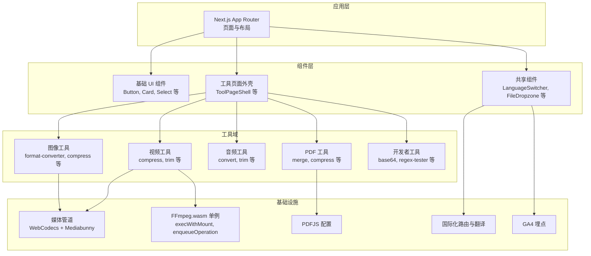
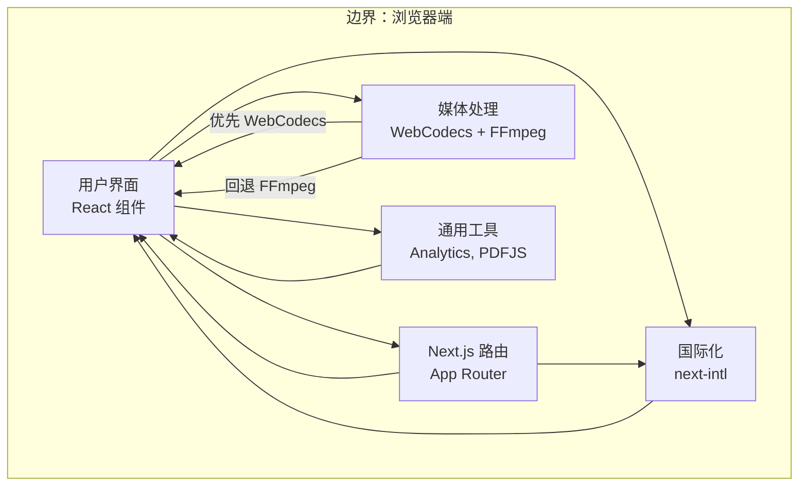
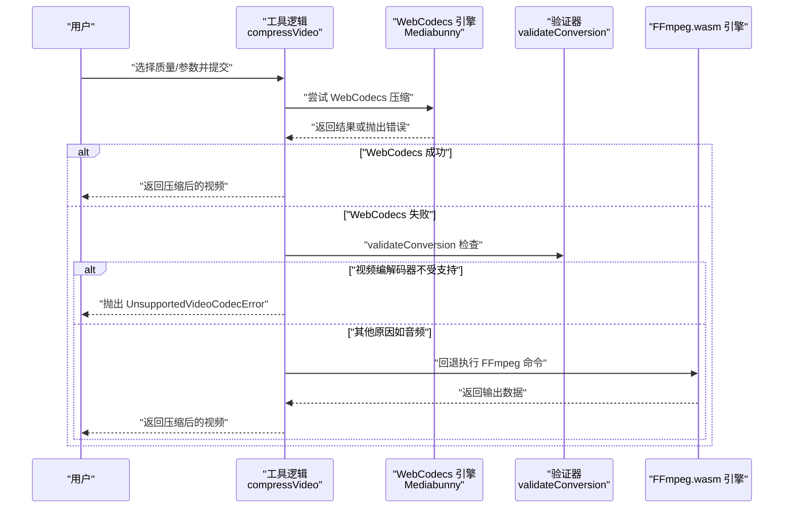
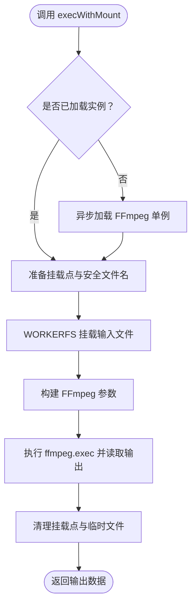
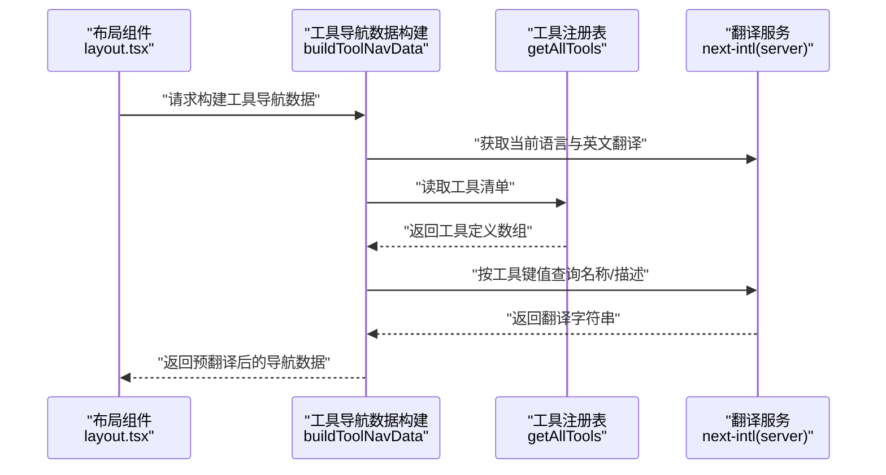
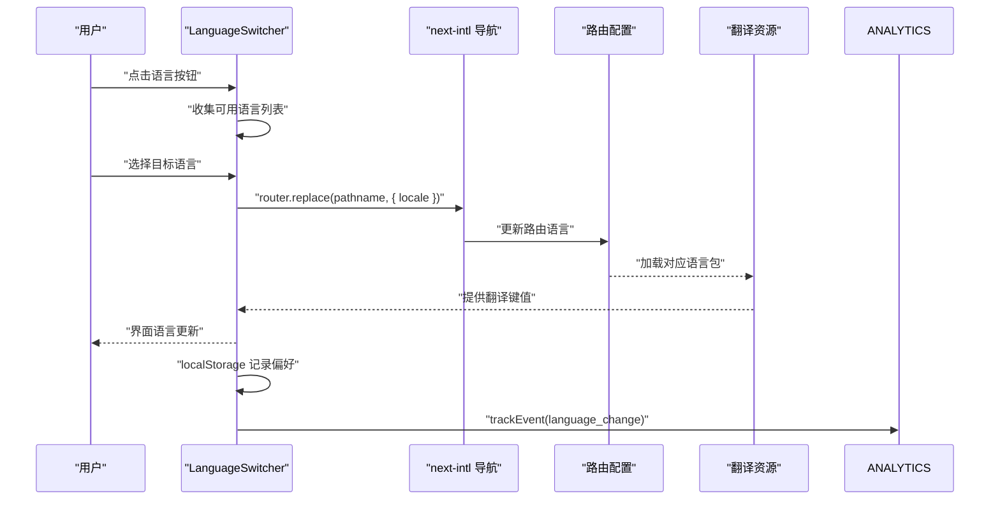
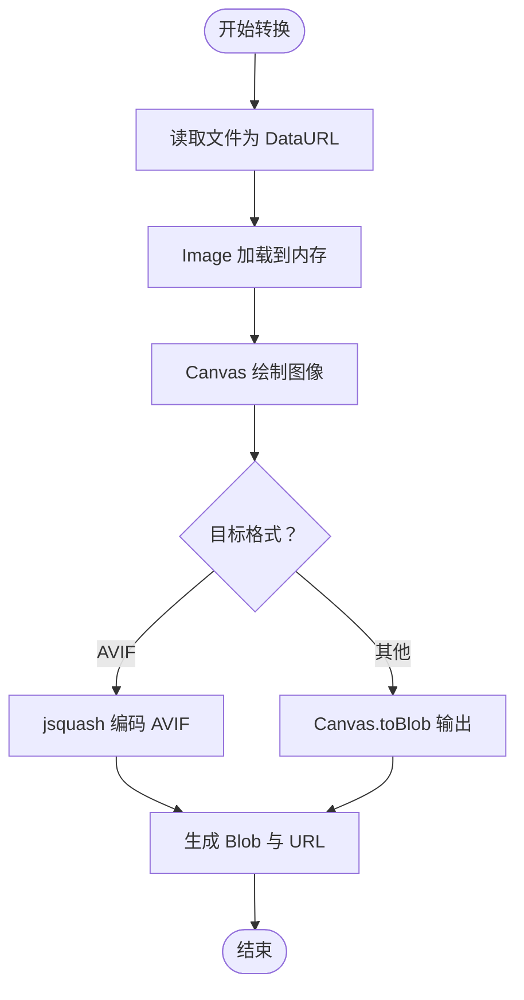
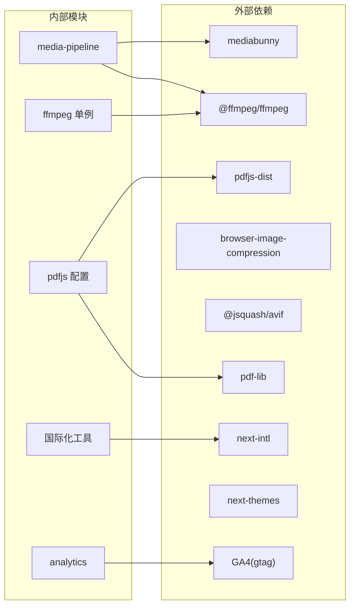

# 架构设计

<cite>
**本文引用的文件**
- [README.md](file://README.md)
- [package.json](file://package.json)
- [src/app/layout.tsx](file://src/app/layout.tsx)
- [src/lib/media-pipeline.ts](file://src/lib/media-pipeline.ts)
- [src/lib/ffmpeg.ts](file://src/lib/ffmpeg.ts)
- [src/lib/pdfjs.ts](file://src/lib/pdfjs.ts)
- [src/lib/analytics.ts](file://src/lib/analytics.ts)
- [src/i18n/routing.ts](file://src/i18n/routing.ts)
- [src/components/shared/LanguageSwitcher.tsx](file://src/components/shared/LanguageSwitcher.tsx)
- [src/lib/i18n/toolNavData.ts](file://src/lib/i18n/toolNavData.ts)
- [src/lib/i18n/languageNames.ts](file://src/lib/i18n/languageNames.ts)
- [src/tools/video/compress/logic.ts](file://src/tools/video/compress/logic.ts)
- [src/tools/image/format-converter/logic.ts](file://src/tools/image/format-converter/logic.ts)
</cite>

## 目录
1. [引言](#引言)
2. [项目结构](#项目结构)
3. [核心组件](#核心组件)
4. [架构总览](#架构总览)
5. [详细组件分析](#详细组件分析)
6. [依赖分析](#依赖分析)
7. [性能考虑](#性能考虑)
8. [故障排查指南](#故障排查指南)
9. [结论](#结论)
10. [附录](#附录)

## 引言
本架构设计文档面向 PrivaDeck 媒体工具箱，系统性阐述其整体架构模式与关键技术实现，重点覆盖以下方面：
- 组件化架构、分层架构与模块化设计
- 媒体处理管道：WebCodecs 引擎与 FFmpeg.wasm 引擎的智能切换机制
- 工具注册表系统：工具的动态加载与管理
- 国际化系统：多语言支持与动态语言切换机制
- 性能优化策略：懒加载、缓存与内存管理
- 系统边界与组件交互：数据流与控制流

## 项目结构
PrivaDeck 基于 Next.js App Router 构建，采用“按功能域划分”的模块化组织方式，核心目录与职责如下：
- src/app：页面级路由与根布局元数据
- src/components：UI 组件库与页面外壳
- src/tools：五大工具域（image、video、audio、pdf、developer），每个工具以“工具名/index.ts + {ToolName}.tsx + logic.ts”的三件套组织
- src/lib：核心库与基础设施（媒体管道、FFmpeg 单例、PDFJS、分析埋点、国际化工具）
- src/i18n：国际化路由配置与导航
- messages：21 种语言的翻译资源

图表来源
- [src/app/layout.tsx:1-48](file://src/app/layout.tsx#L1-L48)
- [src/lib/media-pipeline.ts:1-105](file://src/lib/media-pipeline.ts#L1-L105)
- [src/lib/ffmpeg.ts:1-144](file://src/lib/ffmpeg.ts#L1-L144)
- [src/lib/pdfjs.ts:1-16](file://src/lib/pdfjs.ts#L1-L16)
- [src/i18n/routing.ts:1-18](file://src/i18n/routing.ts#L1-L18)
- [src/components/shared/LanguageSwitcher.tsx:1-74](file://src/components/shared/LanguageSwitcher.tsx#L1-L74)

章节来源
- [README.md:55-78](file://README.md#L55-L78)

## 核心组件
本节聚焦媒体处理与国际化两大核心子系统，并概述其职责与协作关系。

- 媒体处理管道（WebCodecs + FFmpeg）
  - WebCodecs 引擎：基于 Mediabunny 的硬件加速编解码，优先使用；当检测到不支持的编解码器或转换无效时触发回退
  - FFmpeg.wasm 引擎：通过单例加载与串行队列执行，避免并发冲突；使用 WORKERFS 挂载输入文件，减少内存拷贝
- 工具注册表系统
  - 工具定义与注册：工具以模块形式存在，统一由注册表暴露接口，供页面外壳与导航构建使用
  - 导航预翻译：服务端构建阶段读取翻译，避免将大量翻译数据序列化到客户端
- 国际化系统
  - 路由与语言：定义支持语言列表、默认语言与 RTL 列表；语言切换通过导航与本地存储持久化
  - 动态语言切换：组件监听路由变化并更新界面语言，同时记录分析事件

章节来源
- [src/lib/media-pipeline.ts:1-105](file://src/lib/media-pipeline.ts#L1-L105)
- [src/lib/ffmpeg.ts:1-144](file://src/lib/ffmpeg.ts#L1-L144)
- [src/lib/i18n/toolNavData.ts:1-42](file://src/lib/i18n/toolNavData.ts#L1-L42)
- [src/i18n/routing.ts:1-18](file://src/i18n/routing.ts#L1-L18)
- [src/components/shared/LanguageSwitcher.tsx:1-74](file://src/components/shared/LanguageSwitcher.tsx#L1-L74)

## 架构总览
下图展示 PrivaDeck 的系统边界与主要模块交互：页面层负责路由与渲染；工具层承载具体业务逻辑；基础设施层提供媒体处理、国际化与分析能力。

图表来源
- [src/app/layout.tsx:1-48](file://src/app/layout.tsx#L1-L48)
- [src/lib/media-pipeline.ts:1-105](file://src/lib/media-pipeline.ts#L1-L105)
- [src/lib/ffmpeg.ts:1-144](file://src/lib/ffmpeg.ts#L1-L144)
- [src/lib/pdfjs.ts:1-16](file://src/lib/pdfjs.ts#L1-L16)
- [src/lib/analytics.ts:1-138](file://src/lib/analytics.ts#L1-L138)
- [src/i18n/routing.ts:1-18](file://src/i18n/routing.ts#L1-L18)

## 详细组件分析

### 媒体处理管道：WebCodecs 与 FFmpeg 智能切换
媒体处理管道采用“优先 WebCodecs、异常回退 FFmpeg”的策略，确保在支持硬件加速的场景下获得最佳性能，在不支持或不兼容的场景下仍能保证功能可用。

图表来源
- [src/tools/video/compress/logic.ts:85-110](file://src/tools/video/compress/logic.ts#L85-L110)
- [src/lib/media-pipeline.ts:59-91](file://src/lib/media-pipeline.ts#L59-L91)
- [src/lib/ffmpeg.ts:99-143](file://src/lib/ffmpeg.ts#L99-L143)

章节来源
- [src/tools/video/compress/logic.ts:1-257](file://src/tools/video/compress/logic.ts#L1-L257)
- [src/lib/media-pipeline.ts:1-105](file://src/lib/media-pipeline.ts#L1-L105)
- [src/lib/ffmpeg.ts:1-144](file://src/lib/ffmpeg.ts#L1-L144)

### FFmpeg.wasm 单例与串行队列
FFmpeg.wasm 作为单线程运行时，采用“单例 + Promise 队列”的模式确保并发安全与顺序执行。同时通过 WORKERFS 直接挂载输入文件，避免两次内存拷贝，显著降低峰值内存占用。

图表来源
- [src/lib/ffmpeg.ts:99-143](file://src/lib/ffmpeg.ts#L99-L143)

章节来源
- [src/lib/ffmpeg.ts:1-144](file://src/lib/ffmpeg.ts#L1-L144)

### 工具注册表与导航预翻译
工具注册表统一暴露工具清单，页面外壳与导航构建在服务端阶段读取翻译，避免将翻译数据带入客户端包体，提升首屏性能与安全性。

图表来源
- [src/lib/i18n/toolNavData.ts:16-42](file://src/lib/i18n/toolNavData.ts#L16-L42)

章节来源
- [src/lib/i18n/toolNavData.ts:1-42](file://src/lib/i18n/toolNavData.ts#L1-L42)

### 国际化系统：动态语言切换
语言切换通过 next-intl 的路由与导航 API 实现，组件监听路由变化并更新界面语言，同时将切换事件上报分析系统。

图表来源
- [src/components/shared/LanguageSwitcher.tsx:15-38](file://src/components/shared/LanguageSwitcher.tsx#L15-L38)
- [src/i18n/routing.ts:14-17](file://src/i18n/routing.ts#L14-L17)
- [src/lib/analytics.ts:106-124](file://src/lib/analytics.ts#L106-L124)

章节来源
- [src/components/shared/LanguageSwitcher.tsx:1-74](file://src/components/shared/LanguageSwitcher.tsx#L1-L74)
- [src/i18n/routing.ts:1-18](file://src/i18n/routing.ts#L1-L18)
- [src/lib/analytics.ts:1-138](file://src/lib/analytics.ts#L1-L138)

### 图像格式转换示例：浏览器端图像处理
图像工具以纯浏览器 API 实现，避免外部依赖，典型流程包括 Canvas 渲染、像素数据处理与编码输出。

图表来源
- [src/tools/image/format-converter/logic.ts:75-158](file://src/tools/image/format-converter/logic.ts#L75-L158)

章节来源
- [src/tools/image/format-converter/logic.ts:1-161](file://src/tools/image/format-converter/logic.ts#L1-L161)

## 依赖分析
- 外部依赖与版本约束
  - 媒体处理：@ffmpeg/ffmpeg、pdf-lib、pdfjs-dist、browser-image-compression、@jsquash/avif、mediabunny
  - 国际化：next-intl
  - 主题与 UI：next-themes、lucide-react、tailwind-merge
  - 分析埋点：GA4（window.gtag）
- 内部耦合与内聚
  - 工具逻辑与基础设施解耦：工具仅依赖抽象接口（如媒体管道、FFmpeg 单例）
  - 注册表与导航：服务端构建阶段完成翻译拼装，客户端仅消费结果
  - 语言切换：组件通过 next-intl 导航 API 与本地存储协同工作

图表来源
- [package.json:11-32](file://package.json#L11-L32)
- [src/lib/media-pipeline.ts:1-105](file://src/lib/media-pipeline.ts#L1-L105)
- [src/lib/ffmpeg.ts:1-144](file://src/lib/ffmpeg.ts#L1-L144)
- [src/lib/pdfjs.ts:1-16](file://src/lib/pdfjs.ts#L1-L16)
- [src/lib/analytics.ts:1-138](file://src/lib/analytics.ts#L1-L138)
- [src/i18n/routing.ts:1-18](file://src/i18n/routing.ts#L1-L18)

章节来源
- [package.json:1-45](file://package.json#L1-L45)

## 性能考虑
- 懒加载与按需引入
  - FFmpeg 单例：首次使用时才加载核心与 wasm 资源，避免首屏阻塞
  - Mediabunny：在 WebCodecs 可用时按需引入，减少不必要的包体
  - PDFJS：延迟配置 worker 路径，仅在需要时初始化
- 缓存与内存管理
  - FFmpeg 单例：全局持有实例，避免重复初始化
  - WORKERFS 挂载：直接从磁盘按需读取，避免将整个文件复制到内存
  - 输出释放：读取 MEMFS 数据后立即删除临时文件，降低峰值内存
- 并发控制
  - FFmpeg 串行队列：通过 Promise 队列保证单线程执行，避免挂载点冲突
- 用户体验
  - 进度回调：统一进度回调范围（0-100），便于 UI 展示
  - 语言切换：本地存储偏好，避免每次刷新重算

章节来源
- [src/lib/ffmpeg.ts:10-39](file://src/lib/ffmpeg.ts#L10-L39)
- [src/lib/ffmpeg.ts:75-82](file://src/lib/ffmpeg.ts#L75-L82)
- [src/lib/ffmpeg.ts:105-142](file://src/lib/ffmpeg.ts#L105-L142)
- [src/lib/media-pipeline.ts:7-14](file://src/lib/media-pipeline.ts#L7-L14)
- [src/lib/pdfjs.ts:3-13](file://src/lib/pdfjs.ts#L3-L13)

## 故障排查指南
- WebCodecs 回退问题
  - 现象：某些视频在 WebCodecs 下无法解码或转换无效
  - 排查：检查 validateConversion 是否抛出 WebCodecsFallbackError；若为视频编解码器问题，将抛出 UnsupportedVideoCodecError，此时不应回退至 FFmpeg
  - 处理：提示用户安装 HEVC 扩展（Windows + Chromium）或改用 FFmpeg
- FFmpeg 加载失败
  - 现象：加载 coreURL 或 wasmURL 失败
  - 排查：确认 CDN 可达性与跨域设置；检查实例状态并在失败后终止
  - 处理：重试加载或降级为其他工具
- 进度回调异常
  - 现象：进度不在 0-100 区间
  - 排查：setProgressHandler 对进度进行归一化处理；检查回调触发频率
  - 处理：在 UI 层做边界保护
- 语言切换失效
  - 现象：切换语言后界面未更新
  - 排查：确认 next-intl 路由配置与本地存储；检查导航 replace 是否成功
  - 处理：刷新页面或重新触发路由更新

章节来源
- [src/lib/media-pipeline.ts:28-53](file://src/lib/media-pipeline.ts#L28-L53)
- [src/lib/media-pipeline.ts:93-104](file://src/lib/media-pipeline.ts#L93-L104)
- [src/lib/ffmpeg.ts:14-39](file://src/lib/ffmpeg.ts#L14-L39)
- [src/lib/ffmpeg.ts:41-58](file://src/lib/ffmpeg.ts#L41-L58)
- [src/components/shared/LanguageSwitcher.tsx:15-38](file://src/components/shared/LanguageSwitcher.tsx#L15-L38)

## 结论
PrivaDeck 采用清晰的分层与模块化架构：页面层专注路由与渲染，工具层承载业务逻辑，基础设施层提供媒体处理、国际化与分析能力。媒体处理管道通过 WebCodecs 优先与 FFmpeg 回退的策略实现高性能与高兼容性；工具注册表与导航预翻译提升了首屏性能与可维护性；国际化系统支持 21 种语言并具备动态切换能力。配合懒加载、串行队列与内存释放等优化手段，系统在浏览器端实现了隐私优先、离线可用且性能优异的媒体工具箱。

## 附录
- 关键技术选型
  - 媒体处理：WebCodecs + Mediabunny（硬件加速）与 FFmpeg.wasm（兼容性保障）
  - PDF 处理：pdf-lib + pdfjs-dist
  - 图像处理：browser-image-compression 与 @jsquash/avif
  - 国际化：next-intl（21 个语言环境）
  - 主题：next-themes（深色/浅色自动跟随系统）
  - 分析：GA4（window.gtag）

章节来源
- [README.md:26-34](file://README.md#L26-L34)
- [package.json:11-32](file://package.json#L11-L32)