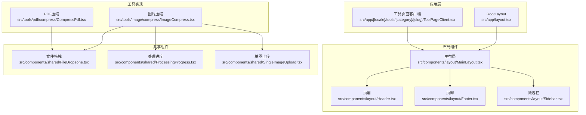
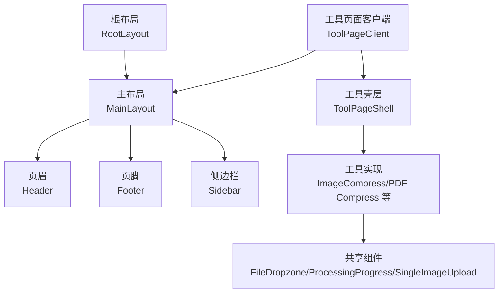
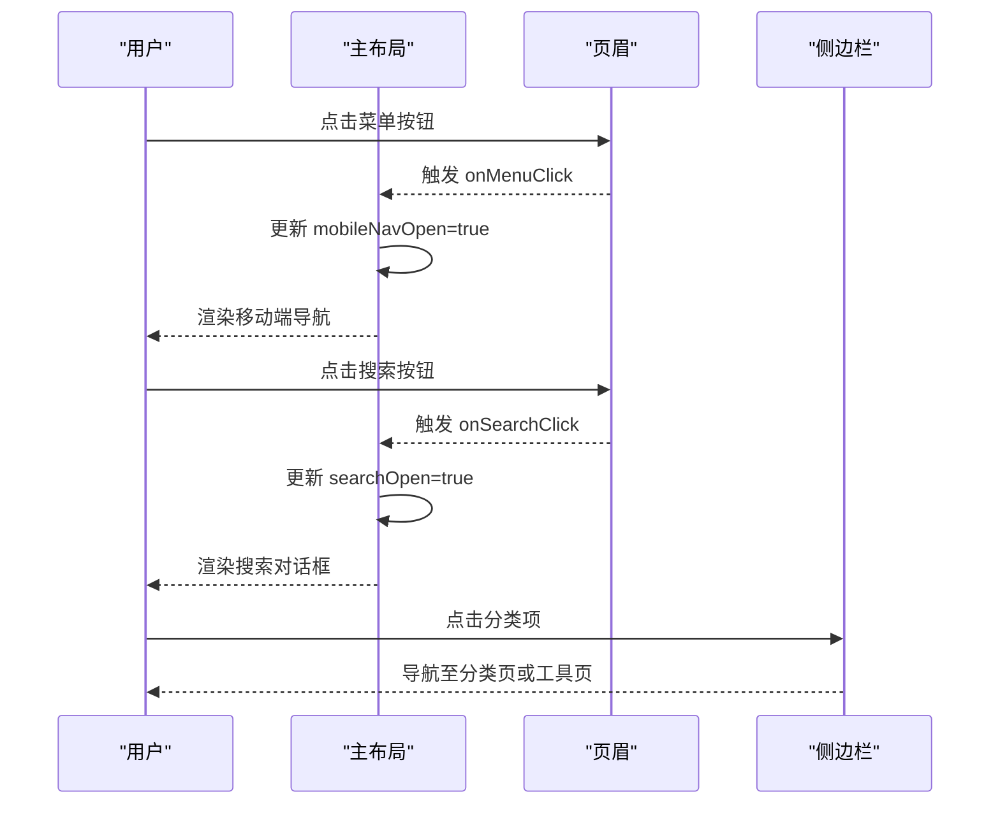
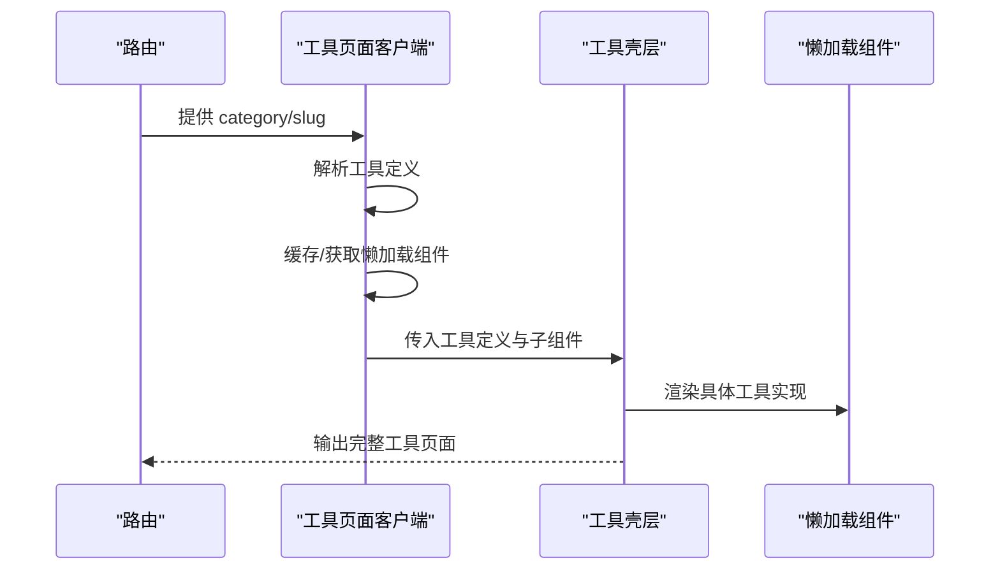
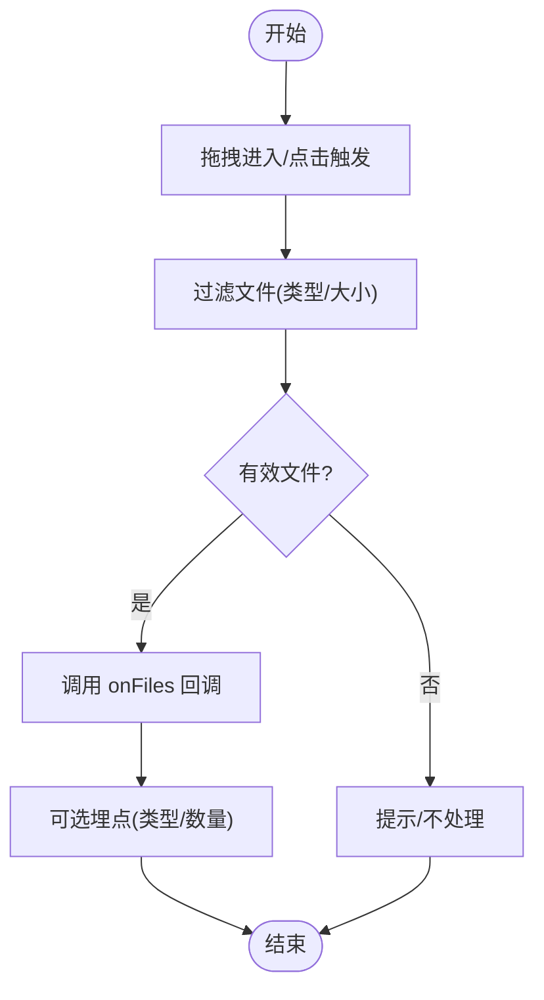
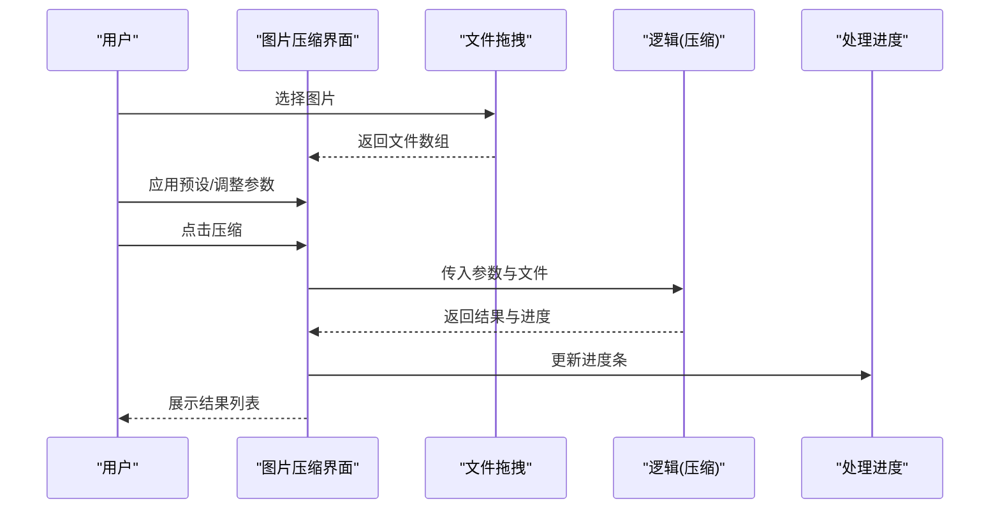
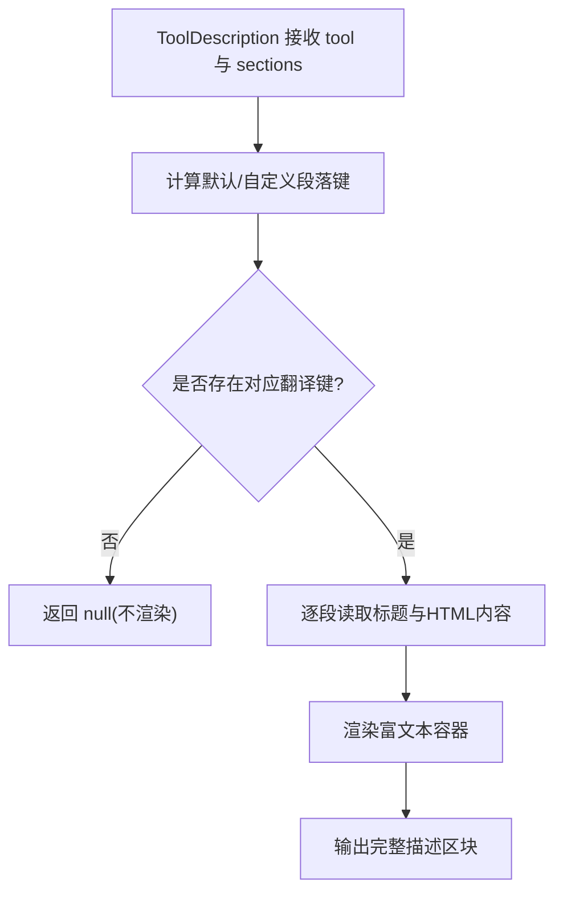
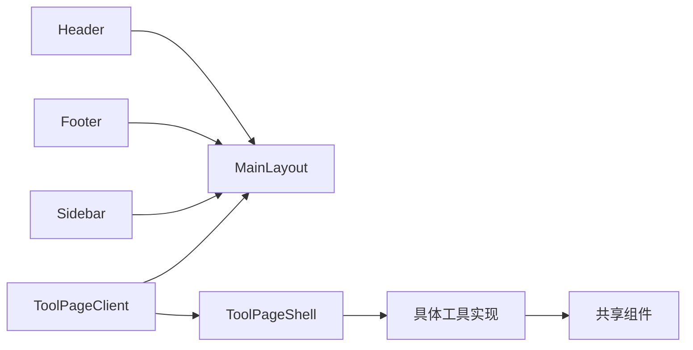

# 组件架构模式

<cite>
**本文引用的文件**
- [src/app/layout.tsx](file://src/app/layout.tsx)
- [src/components/layout/MainLayout.tsx](file://src/components/layout/MainLayout.tsx)
- [src/components/layout/Header.tsx](file://src/components/layout/Header.tsx)
- [src/components/layout/Footer.tsx](file://src/components/layout/Footer.tsx)
- [src/components/layout/Sidebar.tsx](file://src/components/layout/Sidebar.tsx)
- [src/app/[locale]/tools/[category]/[slug]/ToolPageClient.tsx](file://src/app/[locale]/tools/[category]/[slug]/ToolPageClient.tsx)
- [src/components/tool/ToolPageShell.tsx](file://src/components/tool/ToolPageShell.tsx)
- [src/components/tool/ToolDescription.tsx](file://src/components/tool/ToolDescription.tsx)
- [src/components/shared/FileDropzone.tsx](file://src/components/shared/FileDropzone.tsx)
- [src/components/shared/ProcessingProgress.tsx](file://src/components/shared/ProcessingProgress.tsx)
- [src/components/shared/SingleImageUpload.tsx](file://src/components/shared/SingleImageUpload.tsx)
- [src/tools/image/compress/ImageCompress.tsx](file://src/tools/image/compress/ImageCompress.tsx)
- [src/tools/pdf/compress/CompressPdf.tsx](file://src/tools/pdf/compress/CompressPdf.tsx)
</cite>

## 目录
1. [引言](#引言)
2. [项目结构](#项目结构)
3. [核心组件](#核心组件)
4. [架构总览](#架构总览)
5. [组件详解](#组件详解)
6. [依赖关系分析](#依赖关系分析)
7. [性能考量](#性能考量)
8. [故障排查指南](#故障排查指南)
9. [结论](#结论)
10. [附录](#附录)

## 引言
本文件系统性梳理媒体工具箱项目的组件架构模式，重点阐释以下主题：
- 容器组件与展示组件的分离原则：通过工具壳层、页面客户端与具体工具实现的职责划分，确保状态管理与渲染逻辑清晰解耦。
- 布局组件的设计模式：主布局、侧边栏、页眉与页脚的组合策略，统一导航、搜索与响应式交互。
- 共享组件的抽象化设计：文件拖拽、单图上传、处理进度等可复用组件的接口与行为规范。
- 工具页面组件的模板模式：工具壳层、描述组件与相关工具推荐的标准化结构，提升一致性与可维护性。
- 组件间通信与状态管理：props 向下传递、事件回调向上冒泡、上下文与懒加载的配合使用。
- 最佳实践与性能优化建议：按需加载、内存释放、动画与交互的节流与防抖。

## 项目结构
项目采用基于功能域的组织方式，按“应用层”“组件层”“工具层”“国际化与配置”等维度分层。根布局负责全局元数据与视口配置；布局组件提供站点级导航与内容区包裹；共享组件提供跨工具复用能力；工具页面客户端负责动态加载具体工具实现；各工具目录包含页面逻辑与业务逻辑（logic）。

图表来源
- [src/app/layout.tsx:1-48](file://src/app/layout.tsx#L1-L48)
- [src/components/layout/MainLayout.tsx:1-57](file://src/components/layout/MainLayout.tsx#L1-L57)
- [src/components/layout/Header.tsx:1-291](file://src/components/layout/Header.tsx#L1-L291)
- [src/components/layout/Footer.tsx:1-115](file://src/components/layout/Footer.tsx#L1-L115)
- [src/components/layout/Sidebar.tsx:1-143](file://src/components/layout/Sidebar.tsx#L1-L143)
- [src/app/[locale]/tools/[category]/[slug]/ToolPageClient.tsx:1-59](file://src/app/[locale]/tools/[category]/[slug]/ToolPageClient.tsx#L1-L59)
- [src/components/shared/FileDropzone.tsx:1-144](file://src/components/shared/FileDropzone.tsx#L1-L144)
- [src/components/shared/ProcessingProgress.tsx:1-47](file://src/components/shared/ProcessingProgress.tsx#L1-L47)
- [src/components/shared/SingleImageUpload.tsx:1-180](file://src/components/shared/SingleImageUpload.tsx#L1-L180)
- [src/tools/image/compress/ImageCompress.tsx:1-373](file://src/tools/image/compress/ImageCompress.tsx#L1-L373)
- [src/tools/pdf/compress/CompressPdf.tsx:1-131](file://src/tools/pdf/compress/CompressPdf.tsx#L1-L131)

章节来源
- [src/app/layout.tsx:1-48](file://src/app/layout.tsx#L1-L48)
- [src/components/layout/MainLayout.tsx:1-57](file://src/components/layout/MainLayout.tsx#L1-L57)
- [src/components/layout/Header.tsx:1-291](file://src/components/layout/Header.tsx#L1-L291)
- [src/components/layout/Footer.tsx:1-115](file://src/components/layout/Footer.tsx#L1-L115)
- [src/components/layout/Sidebar.tsx:1-143](file://src/components/layout/Sidebar.tsx#L1-L143)
- [src/app/[locale]/tools/[category]/[slug]/ToolPageClient.tsx:1-59](file://src/app/[locale]/tools/[category]/[slug]/ToolPageClient.tsx#L1-L59)

## 核心组件
- 主布局组件：统一承载页眉、内容区、页脚、移动端导航与搜索对话框，提供全局状态（菜单、搜索）与快捷键支持。
- 页眉组件：包含移动端菜单按钮、品牌标识、分类下拉菜单、搜索触发、语言切换与主题切换、分享按钮。
- 页脚组件：展示分类与工具链接、关于与隐私链接、版权信息。
- 侧边栏组件：提供首页、全部工具入口与按分类展开的工具列表，支持路径高亮与嵌套展开。
- 工具页面客户端：根据路由参数解析工具定义，稳定缓存懒加载组件，包裹工具壳层并注入面包屑、相关工具与FAQ。
- 工具壳层：封装标题、本地优先隐私提示、工具内容容器与工具介绍卡片区域。
- 共享组件：文件拖拽、单图上传、处理进度等，提供一致的交互与可配置能力。

章节来源
- [src/components/layout/MainLayout.tsx:16-56](file://src/components/layout/MainLayout.tsx#L16-L56)
- [src/components/layout/Header.tsx:21-116](file://src/components/layout/Header.tsx#L21-L116)
- [src/components/layout/Footer.tsx:44-114](file://src/components/layout/Footer.tsx#L44-L114)
- [src/components/layout/Sidebar.tsx:27-112](file://src/components/layout/Sidebar.tsx#L27-L112)
- [src/app/[locale]/tools/[category]/[slug]/ToolPageClient.tsx:29-57](file://src/app/[locale]/tools/[category]/[slug]/ToolPageClient.tsx#L29-L57)
- [src/components/tool/ToolPageShell.tsx:15-52](file://src/components/tool/ToolPageShell.tsx#L15-L52)
- [src/components/shared/FileDropzone.tsx:42-143](file://src/components/shared/FileDropzone.tsx#L42-L143)
- [src/components/shared/ProcessingProgress.tsx:14-46](file://src/components/shared/ProcessingProgress.tsx#L14-L46)
- [src/components/shared/SingleImageUpload.tsx:27-179](file://src/components/shared/SingleImageUpload.tsx#L27-L179)

## 架构总览
该架构以“布局容器 + 页面壳层 + 工具实现”的三层结构为核心，结合共享组件与懒加载策略，形成高内聚、低耦合的组件体系。

图表来源
- [src/app/layout.tsx:41-47](file://src/app/layout.tsx#L41-L47)
- [src/components/layout/MainLayout.tsx:35-55](file://src/components/layout/MainLayout.tsx#L35-L55)
- [src/components/layout/Header.tsx:54-115](file://src/components/layout/Header.tsx#L54-L115)
- [src/components/layout/Footer.tsx:58-112](file://src/components/layout/Footer.tsx#L58-L112)
- [src/components/layout/Sidebar.tsx:42-111](file://src/components/layout/Sidebar.tsx#L42-L111)
- [src/app/[locale]/tools/[category]/[slug]/ToolPageClient.tsx:46-57](file://src/app/[locale]/tools/[category]/[slug]/ToolPageClient.tsx#L46-L57)
- [src/components/tool/ToolPageShell.tsx:19-51](file://src/components/tool/ToolPageShell.tsx#L19-L51)
- [src/tools/image/compress/ImageCompress.tsx:183-372](file://src/tools/image/compress/ImageCompress.tsx#L183-L372)
- [src/tools/pdf/compress/CompressPdf.tsx:47-130](file://src/tools/pdf/compress/CompressPdf.tsx#L47-L130)
- [src/components/shared/FileDropzone.tsx:78-142](file://src/components/shared/FileDropzone.tsx#L78-L142)
- [src/components/shared/ProcessingProgress.tsx:22-45](file://src/components/shared/ProcessingProgress.tsx#L22-L45)
- [src/components/shared/SingleImageUpload.tsx:106-178](file://src/components/shared/SingleImageUpload.tsx#L106-L178)

## 组件详解

### 布局组件：主布局、页眉、页脚与侧边栏
- 主布局负责：
  - 状态管理：移动端导航与搜索弹窗的开关状态。
  - 快捷键：全局 Ctrl/Cmd+K 打开搜索。
  - 结构：页眉、主内容区、页脚、移动端导航与搜索对话框。
- 页眉负责：
  - 移动端菜单按钮与桌面端分类下拉菜单。
  - 搜索触发、语言切换、主题切换、分享按钮。
  - 路由变化时自动关闭菜单。
- 页脚负责：
  - 分类到工具的链接网格，限制显示数量。
  - 关于与隐私链接、版权信息。
- 侧边栏负责：
  - 首页与全部工具入口。
  - 按分类展开工具列表，支持路径高亮与嵌套展开。

图表来源
- [src/components/layout/MainLayout.tsx:16-56](file://src/components/layout/MainLayout.tsx#L16-L56)
- [src/components/layout/Header.tsx:58-112](file://src/components/layout/Header.tsx#L58-L112)
- [src/components/layout/Sidebar.tsx:66-108](file://src/components/layout/Sidebar.tsx#L66-L108)

章节来源
- [src/components/layout/MainLayout.tsx:16-56](file://src/components/layout/MainLayout.tsx#L16-L56)
- [src/components/layout/Header.tsx:21-116](file://src/components/layout/Header.tsx#L21-L116)
- [src/components/layout/Footer.tsx:44-114](file://src/components/layout/Footer.tsx#L44-L114)
- [src/components/layout/Sidebar.tsx:27-112](file://src/components/layout/Sidebar.tsx#L27-L112)

### 工具页面客户端与工具壳层
- 工具页面客户端：
  - 解析路由参数，定位工具定义。
  - 使用稳定缓存的懒加载组件，避免重复加载。
  - 包裹工具壳层，注入面包屑、相关工具与FAQ。
- 工具壳层：
  - 标题与描述、本地优先隐私提示。
  - 工具内容容器与“如何使用”“特性卡片”“为什么选择”“工具描述”等模块化区域。

图表来源
- [src/app/[locale]/tools/[category]/[slug]/ToolPageClient.tsx:29-57](file://src/app/[locale]/tools/[category]/[slug]/ToolPageClient.tsx#L29-L57)
- [src/components/tool/ToolPageShell.tsx:15-52](file://src/components/tool/ToolPageShell.tsx#L15-L52)

章节来源
- [src/app/[locale]/tools/[category]/[slug]/ToolPageClient.tsx:29-57](file://src/app/[locale]/tools/[category]/[slug]/ToolPageClient.tsx#L29-L57)
- [src/components/tool/ToolPageShell.tsx:15-52](file://src/components/tool/ToolPageShell.tsx#L15-L52)

### 共享组件：文件拖拽、单图上传与处理进度
- 文件拖拽组件：
  - 支持拖拽进入/离开、点击触发、文件过滤与大小限制。
  - 可选统计埋点（类型、数量）。
- 单图上传组件：
  - 基于文件拖拽，扩展预览缩略图、尺寸读取、错误回退、灯箱查看与替换/移除操作。
  - 内部管理对象URL生命周期，避免内存泄漏。
- 处理进度组件：
  - 支持确定/不确定两种进度条形态，可自定义标签文本。

图表来源
- [src/components/shared/FileDropzone.tsx:55-76](file://src/components/shared/FileDropzone.tsx#L55-L76)
- [src/components/shared/SingleImageUpload.tsx:43-87](file://src/components/shared/SingleImageUpload.tsx#L43-L87)
- [src/components/shared/ProcessingProgress.tsx:22-43](file://src/components/shared/ProcessingProgress.tsx#L22-L43)

章节来源
- [src/components/shared/FileDropzone.tsx:42-143](file://src/components/shared/FileDropzone.tsx#L42-L143)
- [src/components/shared/SingleImageUpload.tsx:27-179](file://src/components/shared/SingleImageUpload.tsx#L27-L179)
- [src/components/shared/ProcessingProgress.tsx:14-46](file://src/components/shared/ProcessingProgress.tsx#L14-L46)

### 工具页面实现示例：图片压缩与PDF压缩
- 图片压缩：
  - 文件网格选择、预设与高级设置（质量、最大体积、分辨率、自定义尺寸与比例锁定）。
  - 进度跟踪与结果列表展示，支持逐个移除。
- PDF压缩：
  - 文件拖拽、质量选择、进度条与结果统计（原体积/压缩后体积/节省百分比）。

图表来源
- [src/tools/image/compress/ImageCompress.tsx:138-178](file://src/tools/image/compress/ImageCompress.tsx#L138-L178)
- [src/tools/pdf/compress/CompressPdf.tsx:28-45](file://src/tools/pdf/compress/CompressPdf.tsx#L28-L45)
- [src/components/shared/FileDropzone.tsx:78-142](file://src/components/shared/FileDropzone.tsx#L78-L142)
- [src/components/shared/ProcessingProgress.tsx:22-43](file://src/components/shared/ProcessingProgress.tsx#L22-L43)

章节来源
- [src/tools/image/compress/ImageCompress.tsx:63-372](file://src/tools/image/compress/ImageCompress.tsx#L63-L372)
- [src/tools/pdf/compress/CompressPdf.tsx:10-130](file://src/tools/pdf/compress/CompressPdf.tsx#L10-L130)

### 工具描述组件：模板模式下的内容渲染
- 工具描述组件：
  - 通过命名空间读取多段落内容（简介、使用方法、特性、应用场景、隐私说明）。
  - 若对应翻译键不存在则静默不渲染。
  - 使用富文本容器安全渲染 HTML 内容。

图表来源
- [src/components/tool/ToolDescription.tsx:21-45](file://src/components/tool/ToolDescription.tsx#L21-L45)

章节来源
- [src/components/tool/ToolDescription.tsx:12-45](file://src/components/tool/ToolDescription.tsx#L12-L45)

## 依赖关系分析
- 组件耦合：
  - 布局组件对导航数据与上下文有依赖，但通过 Provider 与 props 传递降低耦合。
  - 工具页面客户端与工具壳层之间通过工具定义解耦，具体实现通过懒加载注入。
  - 共享组件通过明确的 props 接口与回调，实现跨工具复用。
- 外部依赖：
  - 国际化与路由：使用 next-intl 与自定义导航工具。
  - 媒体处理：工具逻辑与媒体管道在各自目录中实现，组件仅负责 UI 与状态。
- 循环依赖：
  - 当前结构未见明显循环依赖；若新增共享上下文，应避免在布局与工具之间形成双向依赖。

图表来源
- [src/components/layout/MainLayout.tsx:3-9](file://src/components/layout/MainLayout.tsx#L3-L9)
- [src/app/[locale]/tools/[category]/[slug]/ToolPageClient.tsx:6-9](file://src/app/[locale]/tools/[category]/[slug]/ToolPageClient.tsx#L6-L9)
- [src/components/tool/ToolPageShell.tsx:6-9](file://src/components/tool/ToolPageShell.tsx#L6-L9)

章节来源
- [src/components/layout/MainLayout.tsx:3-9](file://src/components/layout/MainLayout.tsx#L3-L9)
- [src/app/[locale]/tools/[category]/[slug]/ToolPageClient.tsx:6-9](file://src/app/[locale]/tools/[category]/[slug]/ToolPageClient.tsx#L6-L9)
- [src/components/tool/ToolPageShell.tsx:6-9](file://src/components/tool/ToolPageShell.tsx#L6-L9)

## 性能考量
- 懒加载与缓存：
  - 工具页面客户端使用稳定缓存的懒加载组件，避免重复加载与内存占用。
- 事件与状态：
  - 页眉菜单使用防抖/定时器控制关闭，减少频繁重绘。
  - 单图上传组件在组件卸载时撤销对象URL，防止内存泄漏。
- 动画与交互：
  - 进度条使用确定/不确定两种形态，避免长任务阻塞 UI。
  - 拖拽高亮与阴影效果通过过渡类名控制，保持流畅体验。
- 数据流：
  - 通过 props 向下传递与回调向上冒泡，避免全局状态污染。

章节来源
- [src/app/[locale]/tools/[category]/[slug]/ToolPageClient.tsx:27-42](file://src/app/[locale]/tools/[category]/[slug]/ToolPageClient.tsx#L27-L42)
- [src/components/layout/Header.tsx:41-52](file://src/components/layout/Header.tsx#L41-L52)
- [src/components/shared/SingleImageUpload.tsx:43-87](file://src/components/shared/SingleImageUpload.tsx#L43-L87)
- [src/components/shared/ProcessingProgress.tsx:22-43](file://src/components/shared/ProcessingProgress.tsx#L22-L43)

## 故障排查指南
- 拖拽无响应：
  - 检查拖拽事件是否被阻止默认行为，确认文件类型与大小限制是否导致过滤。
- 预览异常或内存泄漏：
  - 确认对象URL在组件卸载时已撤销，预览失败时降级为占位图标。
- 进度条不更新：
  - 确认工具逻辑正确回调进度，且 UI 层正确接收与渲染。
- 路由跳转后菜单未关闭：
  - 检查路由监听是否生效，确保菜单状态在路由变化时被清理。

章节来源
- [src/components/shared/FileDropzone.tsx:78-95](file://src/components/shared/FileDropzone.tsx#L78-L95)
- [src/components/shared/SingleImageUpload.tsx:43-87](file://src/components/shared/SingleImageUpload.tsx#L43-L87)
- [src/components/layout/Header.tsx:37-49](file://src/components/layout/Header.tsx#L37-L49)

## 结论
该项目通过清晰的容器-展示分离、模板化的工具页面结构与高度复用的共享组件，实现了可扩展、可维护的前端架构。布局组件统一了导航与交互，工具壳层标准化了页面结构，共享组件提供了稳定的输入输出契约。配合懒加载与状态管理最佳实践，整体具备良好的性能与可演进性。

## 附录
- 设计原则速览：
  - 容器组件负责状态与流程编排，展示组件专注渲染与交互。
  - 工具页面采用“壳层 + 描述 + 工具实现”的模板模式，保证一致性。
  - 共享组件以 props 与回调为核心接口，便于跨工具复用。
  - 通过上下文与懒加载降低耦合，提升性能与开发效率。