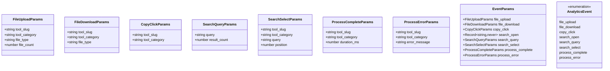
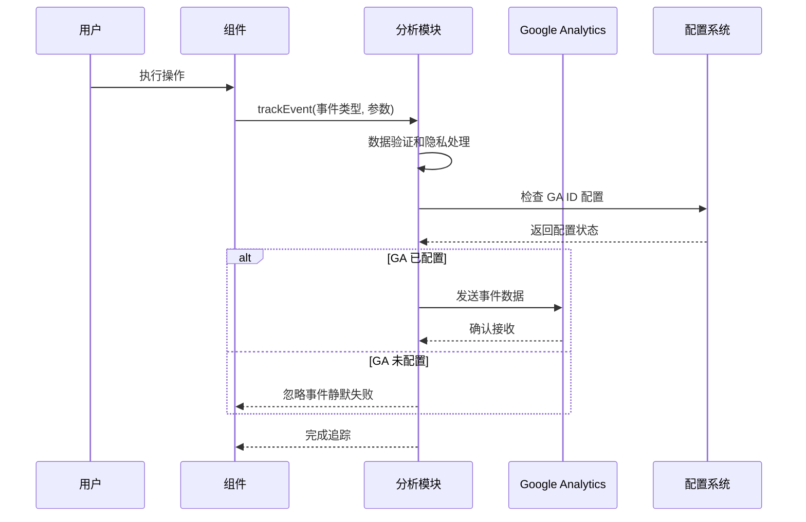
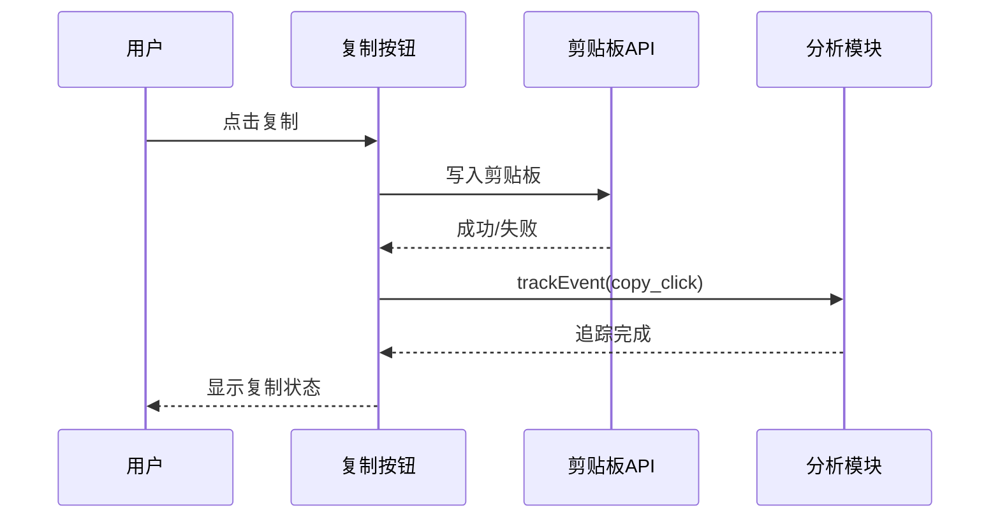
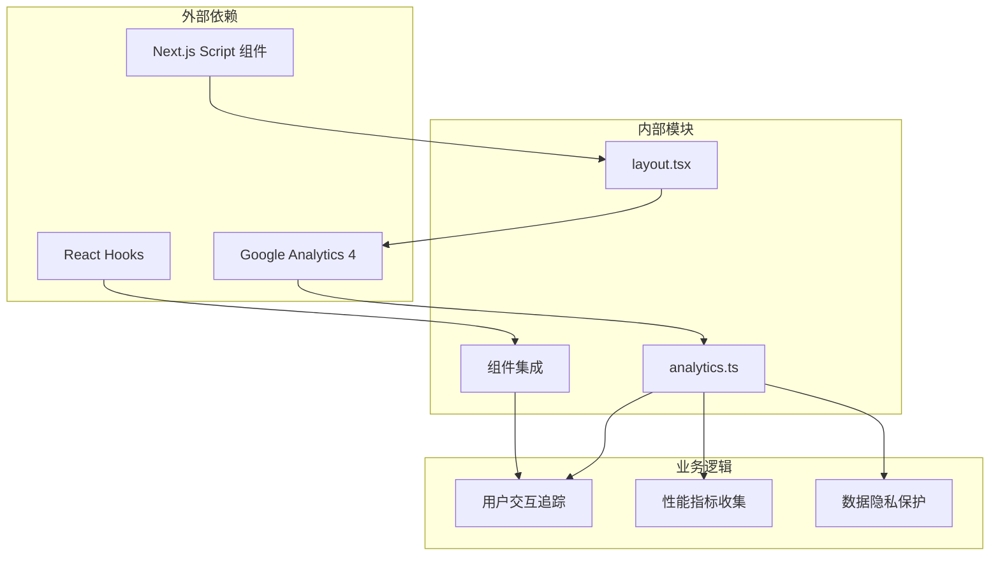

# 分析统计模块

<cite>
**本文档引用的文件**
- [analytics.ts](file://src/lib/analytics.ts)
- [layout.tsx](file://src/app/[locale]/layout.tsx)
- [layout.tsx](file://src/app/(home)/layout.tsx)
- [CopyButton.tsx](file://src/components/shared/CopyButton.tsx)
- [DownloadButton.tsx](file://src/components/shared/DownloadButton.tsx)
- [Header.tsx](file://src/components/layout/Header.tsx)
- [SearchDialog.tsx](file://src/components/shared/SearchDialog.tsx)
- [ToolPageClient.tsx](file://src/app/[locale]/tools/[category]/[slug]/ToolPageClient.tsx)
- [package.json](file://package.json)
</cite>

## 目录
1. [简介](#简介)
2. [项目结构](#项目结构)
3. [核心组件](#核心组件)
4. [架构概览](#架构概览)
5. [详细组件分析](#详细组件分析)
6. [依赖关系分析](#依赖关系分析)
7. [性能考虑](#性能考虑)
8. [故障排除指南](#故障排除指南)
9. [结论](#结论)

## 简介

PrivaDeck 分析统计模块是一个基于 Google Analytics 4 (GA4) 的前端分析解决方案，专为媒体工具箱应用设计。该模块实现了全面的用户行为追踪功能，包括工具使用情况、用户交互行为和性能数据收集。模块采用类型安全的设计，确保事件参数的正确性和数据隐私保护。

该分析模块的核心特性包括：
- 类型安全的事件追踪系统
- 自动化的数据隐私保护机制
- 细粒度的用户行为分析
- 性能指标收集
- 无缝的 Google Analytics 集成

## 项目结构

分析统计模块在项目中的组织结构如下：

```mermaid
graph TB
subgraph "分析模块核心"
A[src/lib/analytics.ts] --> B[事件定义]
A --> C[追踪函数]
A --> D[工具追踪器工厂]
end
subgraph "配置层"
E[src/app/[locale]/layout.tsx] --> F[GA ID 验证]
G[src/app/(home)/layout.tsx] --> F
F --> H[Google Analytics 脚本注入]
end
subgraph "组件集成"
I[src/components/shared/CopyButton.tsx] --> J[复制点击追踪]
K[src/components/shared/DownloadButton.tsx] --> L[文件下载追踪]
M[src/components/layout/Header.tsx] --> N[分享按钮追踪]
O[src/components/shared/SearchDialog.tsx] --> P[搜索行为追踪]
end
subgraph "工具页面"
Q[src/app/[locale]/tools/[category]/[slug]/ToolPageClient.tsx] --> R[工具页面追踪]
end
A --> E
A --> I
A --> K
A --> M
A --> O
A --> Q
```

**图表来源**
- [analytics.ts:1-138](file://src/lib/analytics.ts#L1-L138)
- [layout.tsx:15-72](file://src/app/[locale]/layout.tsx#L15-L72)
- [CopyButton.tsx:31-33](file://src/components/shared/CopyButton.tsx#L31-L33)

**章节来源**
- [analytics.ts:1-138](file://src/lib/analytics.ts#L1-L138)
- [layout.tsx:13-72](file://src/app/[locale]/layout.tsx#L13-L72)

## 核心组件

### 事件参数接口系统

分析模块定义了完整的事件参数接口系统，确保所有追踪事件都有明确的数据结构：



**图表来源**
- [analytics.ts:11-94](file://src/lib/analytics.ts#L11-L94)

### 数据隐私保护机制

模块实现了多层次的数据隐私保护措施：

1. **字符串截断机制**：敏感信息自动截断到 100 字符限制
2. **文件名过滤**：绝不记录任何文件名信息
3. **参数验证**：严格的类型检查和参数验证

**章节来源**
- [analytics.ts:98-124](file://src/lib/analytics.ts#L98-L124)

## 架构概览

分析模块采用分层架构设计，确保代码的可维护性和扩展性：



**图表来源**
- [analytics.ts:106-124](file://src/lib/analytics.ts#L106-L124)
- [layout.tsx:13-14](file://src/app/[locale]/layout.tsx#L13-L14)

## 详细组件分析

### Google Analytics 集成配置

#### 环境变量验证

模块通过严格的环境变量验证确保 GA ID 的有效性：

```mermaid
flowchart TD
A[读取 NEXT_PUBLIC_GA_ID] --> B{格式验证}
B --> |匹配 G-[A-Z0-9]+| C[设置为 gaId]
B --> |不匹配| D[设置为 undefined]
C --> E[注入 GA 脚本]
D --> F[跳过 GA 集成]
E --> G[初始化 gtag]
F --> H[仅本地开发模式]
```

**图表来源**
- [layout.tsx:13-14](file://src/app/[locale]/layout.tsx#L13-L14)
- [layout.tsx:62-72](file://src/app/[locale]/layout.tsx#L62-L72)

#### 脚本注入机制

模块采用延迟加载策略，确保不影响页面初始渲染性能：

**章节来源**
- [layout.tsx:48-58](file://src/app/[locale]/layout.tsx#L48-L58)
- [layout.tsx:62-72](file://src/app/[locale]/layout.tsx#L62-L72)

### 用户交互追踪组件

#### 复制按钮追踪

复制按钮组件实现了精确的用户行为追踪：



**图表来源**
- [CopyButton.tsx:23-33](file://src/components/shared/CopyButton.tsx#L23-L33)

#### 文件下载追踪

下载按钮组件提供了完整的文件操作追踪：

**章节来源**
- [DownloadButton.tsx:37-44](file://src/components/shared/DownloadButton.tsx#L37-L44)

#### 分享按钮追踪

分享功能支持多种分享方式的统一追踪：

**章节来源**
- [Header.tsx:243-277](file://src/components/layout/Header.tsx#L243-L277)

### 搜索行为分析

搜索对话框实现了全面的搜索行为追踪：

```mermaid
flowchart TD
A[打开搜索对话框] --> B[trackEvent(search_open)]
C[输入搜索关键词] --> D[防抖处理]
D --> E[trackEvent(search_query)]
F[选择搜索结果] --> G[trackEvent(search_select)]
B --> H[显示搜索界面]
E --> I[更新搜索结果]
G --> J[导航到工具页面]
```

**图表来源**
- [SearchDialog.tsx:69](file://src/components/shared/SearchDialog.tsx#L69)
- [SearchDialog.tsx:79](file://src/components/shared/SearchDialog.tsx#L79)
- [SearchDialog.tsx:48](file://src/components/shared/SearchDialog.tsx#L48)

**章节来源**
- [SearchDialog.tsx:45-83](file://src/components/shared/SearchDialog.tsx#L45-L83)

### 工具页面性能追踪

工具页面集成了专门的性能监控机制：

**章节来源**
- [ToolPageClient.tsx:29-58](file://src/app/[locale]/tools/[category]/[slug]/ToolPageClient.tsx#L29-L58)

## 依赖关系分析

分析模块的依赖关系图展示了各组件间的协作关系：



**图表来源**
- [analytics.ts:106-137](file://src/lib/analytics.ts#L106-L137)
- [package.json:22](file://package.json#L22)

**章节来源**
- [package.json:11-32](file://package.json#L11-L32)

## 性能考虑

### 延迟加载策略

分析模块采用了多层延迟加载策略来优化性能：

1. **脚本延迟加载**：使用 `afterInteractive` 策略确保不影响首屏渲染
2. **条件加载**：只有在 GA ID 有效时才注入脚本
3. **异步初始化**：Google Analytics 脚本异步加载，不阻塞页面其他资源

### 内存管理

模块实现了高效的内存管理机制：

- **事件参数缓存**：避免重复的对象创建
- **防抖机制**：搜索查询使用 300ms 防抖，减少不必要的事件发送
- **清理机制**：及时清理定时器和事件监听器

### 网络优化

- **最小化请求**：只发送必要的事件数据
- **批量处理**：合理安排事件发送时机
- **错误恢复**：网络失败时的优雅降级

## 故障排除指南

### 常见问题诊断

#### GA ID 配置问题

**症状**：分析数据无法正常收集
**解决方案**：
1. 检查环境变量 `NEXT_PUBLIC_GA_ID` 是否正确设置
2. 验证 GA ID 格式是否符合 `G-[A-Z0-9]+` 模式
3. 确认 Google Analytics 账户配置正确

#### 事件追踪失败

**症状**：特定事件无法被追踪
**排查步骤**：
1. 检查 `window.gtag` 是否可用
2. 验证事件参数类型是否正确
3. 确认组件是否在客户端环境中运行

#### 数据隐私问题

**症状**：敏感信息泄露或数据过大
**防护措施**：
1. 确保所有字符串都经过截断处理
2. 验证文件名等敏感信息是否被过滤
3. 检查自定义参数的大小限制

**章节来源**
- [analytics.ts:106-124](file://src/lib/analytics.ts#L106-L124)
- [layout.tsx:13-14](file://src/app/[locale]/layout.tsx#L13-L14)

## 结论

PrivaDeck 分析统计模块提供了一个完整、类型安全且注重隐私的前端分析解决方案。通过精心设计的架构和严格的隐私保护机制，该模块能够在不影响用户体验的前提下收集有价值的分析数据。

### 主要优势

1. **类型安全**：完整的 TypeScript 接口定义确保事件参数的正确性
2. **隐私优先**：内置的数据隐私保护机制符合现代数据保护标准
3. **性能优化**：多层延迟加载和内存管理策略确保最佳性能
4. **易于集成**：简洁的 API 设计使得组件集成变得简单直观
5. **可扩展性**：模块化的架构支持未来功能的扩展

### 最佳实践建议

1. **事件命名规范**：遵循模块中定义的事件命名约定
2. **参数验证**：始终验证事件参数的有效性
3. **性能监控**：定期检查分析模块对页面性能的影响
4. **隐私合规**：确保所有数据收集符合相关法律法规
5. **错误处理**：实现适当的错误处理和降级策略

该分析模块为 PrivaDeck 提供了强大的用户行为洞察能力，同时保持了对用户隐私的高度尊重和对性能的极致优化。