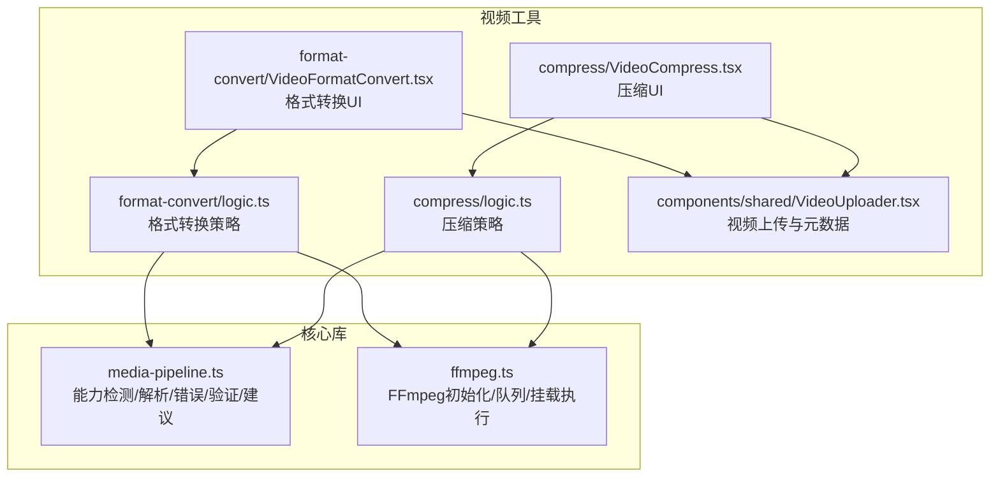
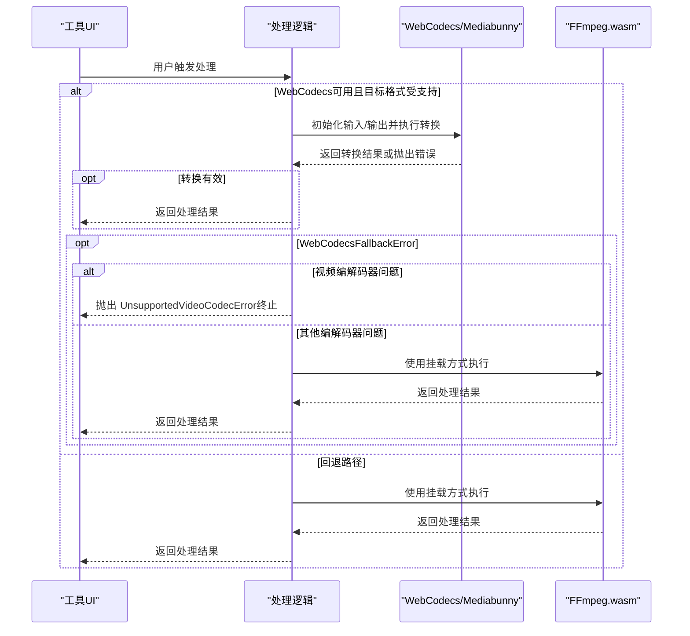
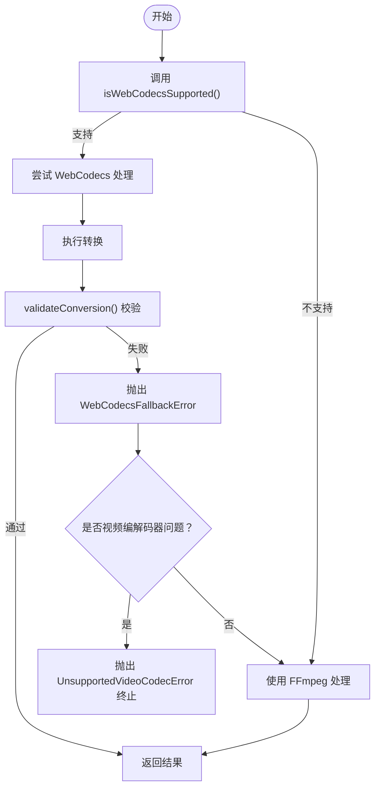
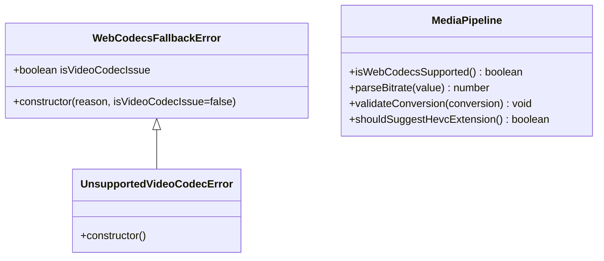
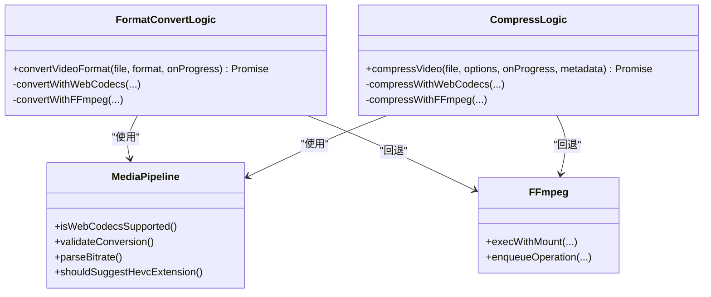
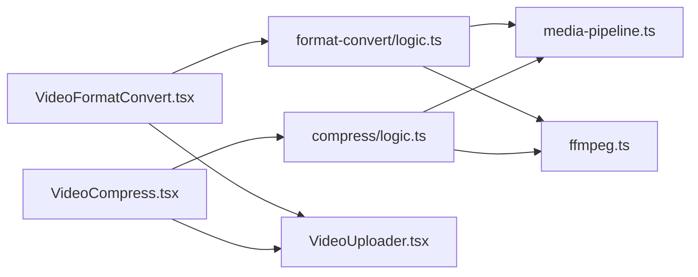

# 媒体处理管道

<cite>
**本文档引用的文件**
- [media-pipeline.ts](file://src/lib/media-pipeline.ts)
- [ffmpeg.ts](file://src/lib/ffmpeg.ts)
- [logic.ts（格式转换）](file://src/tools/video/format-convert/logic.ts)
- [VideoFormatConvert.tsx](file://src/tools/video/format-convert/VideoFormatConvert.tsx)
- [logic.ts（压缩）](file://src/tools/video/compress/logic.ts)
- [VideoCompress.tsx](file://src/tools/video/compress/VideoCompress.tsx)
- [VideoUploader.tsx](file://src/components/shared/VideoUploader.tsx)
</cite>

## 目录
1. [简介](#简介)
2. [项目结构](#项目结构)
3. [核心组件](#核心组件)
4. [架构总览](#架构总览)
5. [详细组件分析](#详细组件分析)
6. [依赖关系分析](#依赖关系分析)
7. [性能考量](#性能考量)
8. [故障排除指南](#故障排除指南)
9. [结论](#结论)
10. [附录](#附录)

## 简介
本文件面向 PrivaDeck 媒体处理管道，系统性阐述基于 WebCodecs 与 FFmpeg 的智能选择机制与错误处理策略。重点覆盖以下主题：
- isWebCodecsSupported() 浏览器能力检测
- parseBitrate() 比特率字符串解析
- WebCodecsFallbackError 与 UnsupportedVideoCodecError 的错误类型与处理策略
- validateConversion() 转换验证机制
- shouldSuggestHevcExtension() 硬件加速建议
- 工厂模式与策略模式在媒体处理中的应用
- 在不同场景下如何选择合适的处理引擎并优雅处理编解码器不兼容问题

## 项目结构
媒体处理相关代码主要分布在以下模块：
- 核心库：src/lib 下的 media-pipeline.ts（WebCodecs/错误/验证/建议）、ffmpeg.ts（FFmpeg 初始化与执行队列）
- 视频工具：src/tools/video 下的格式转换与压缩逻辑及前端页面
- 共享组件：src/components/shared 下的视频上传与元数据展示

图表来源
- [media-pipeline.ts:1-105](file://src/lib/media-pipeline.ts#L1-L105)
- [ffmpeg.ts:1-144](file://src/lib/ffmpeg.ts#L1-L144)
- [logic.ts（格式转换）:1-134](file://src/tools/video/format-convert/logic.ts#L1-L134)
- [VideoFormatConvert.tsx:1-141](file://src/tools/video/format-convert/VideoFormatConvert.tsx#L1-L141)
- [logic.ts（压缩）:1-257](file://src/tools/video/compress/logic.ts#L1-L257)
- [VideoCompress.tsx:1-529](file://src/tools/video/compress/VideoCompress.tsx#L1-L529)
- [VideoUploader.tsx:1-242](file://src/components/shared/VideoUploader.tsx#L1-L242)

章节来源
- [media-pipeline.ts:1-105](file://src/lib/media-pipeline.ts#L1-L105)
- [ffmpeg.ts:1-144](file://src/lib/ffmpeg.ts#L1-L144)
- [logic.ts（格式转换）:1-134](file://src/tools/video/format-convert/logic.ts#L1-L134)
- [VideoFormatConvert.tsx:1-141](file://src/tools/video/format-convert/VideoFormatConvert.tsx#L1-L141)
- [logic.ts（压缩）:1-257](file://src/tools/video/compress/logic.ts#L1-L257)
- [VideoCompress.tsx:1-529](file://src/tools/video/compress/VideoCompress.tsx#L1-L529)
- [VideoUploader.tsx:1-242](file://src/components/shared/VideoUploader.tsx#L1-L242)

## 核心组件
- 能力检测与解析
  - isWebCodecsSupported(): 检测浏览器是否具备 VideoEncoder/VideoDecoder/AudioEncoder/AudioDecoder
  - parseBitrate(): 将形如 "192k"、"1.5M" 的字符串解析为比特率（bps）
- 错误类型
  - WebCodecsFallbackError: 当 WebCodecs 无法处理源视频时抛出，携带 isVideoCodecIssue 标记
  - UnsupportedVideoCodecError: 当浏览器完全不支持目标编解码器时抛出，作为终止错误
- 转换验证
  - validateConversion(): 校验 Mediabunny 转换结果，若存在编解码器相关丢轨或整体无效则抛出 WebCodecsFallbackError
- 硬件加速建议
  - shouldSuggestHevcExtension(): 在 Windows + Chromium + WebCodecs 支持条件下，建议安装 HEVC 扩展以获得硬件解码

章节来源
- [media-pipeline.ts:7-14](file://src/lib/media-pipeline.ts#L7-L14)
- [media-pipeline.ts:21-26](file://src/lib/media-pipeline.ts#L21-L26)
- [media-pipeline.ts:32-41](file://src/lib/media-pipeline.ts#L32-L41)
- [media-pipeline.ts:48-53](file://src/lib/media-pipeline.ts#L48-L53)
- [media-pipeline.ts:59-91](file://src/lib/media-pipeline.ts#L59-L91)
- [media-pipeline.ts:98-104](file://src/lib/media-pipeline.ts#L98-L104)

## 架构总览
媒体处理采用“策略 + 回退”的双引擎架构：
- 优先使用 WebCodecs（Mediabunny）进行硬件加速处理
- 遇到编解码器不兼容或转换失败时，回退至 FFmpeg.wasm
- 通过统一的错误类型与验证机制，确保用户得到明确反馈与可操作建议

图表来源
- [logic.ts（格式转换）:32-56](file://src/tools/video/format-convert/logic.ts#L32-L56)
- [logic.ts（压缩）:85-110](file://src/tools/video/compress/logic.ts#L85-L110)
- [media-pipeline.ts:59-91](file://src/lib/media-pipeline.ts#L59-L91)
- [ffmpeg.ts:99-143](file://src/lib/ffmpeg.ts#L99-L143)

## 详细组件分析

### WebCodecs 能力检测与回退策略
- isWebCodecsSupported() 用于判断浏览器是否具备 WebCodecs 编解码器能力
- 在格式转换与压缩逻辑中，均先尝试 WebCodecs；失败后依据错误类型决定是否回退到 FFmpeg
- 对于视频编解码器问题（如 H.265/HEVC、VP9、AV1），直接终止并提示不支持，避免低性能回退

图表来源
- [media-pipeline.ts:7-14](file://src/lib/media-pipeline.ts#L7-L14)
- [media-pipeline.ts:59-91](file://src/lib/media-pipeline.ts#L59-L91)
- [logic.ts（格式转换）:32-56](file://src/tools/video/format-convert/logic.ts#L32-L56)
- [logic.ts（压缩）:85-110](file://src/tools/video/compress/logic.ts#L85-L110)

章节来源
- [media-pipeline.ts:7-14](file://src/lib/media-pipeline.ts#L7-L14)
- [media-pipeline.ts:59-91](file://src/lib/media-pipeline.ts#L59-L91)
- [logic.ts（格式转换）:32-56](file://src/tools/video/format-convert/logic.ts#L32-L56)
- [logic.ts（压缩）:85-110](file://src/tools/video/compress/logic.ts#L85-L110)

### 错误类型与处理策略
- WebCodecsFallbackError
  - 用途：指示 WebCodecs 无法处理当前源视频，需回退到 FFmpeg
  - 关键字段：isVideoCodecIssue 标识是否存在视频编解码器问题
- UnsupportedVideoCodecError
  - 用途：浏览器完全不支持目标编解码器，属于终止错误
  - 行为：不再回退到 FFmpeg，直接向用户提示不支持

图表来源
- [media-pipeline.ts:32-53](file://src/lib/media-pipeline.ts#L32-L53)

章节来源
- [media-pipeline.ts:32-53](file://src/lib/media-pipeline.ts#L32-L53)

### 转换验证机制 validateConversion()
- 目标：确保没有关键轨道被丢弃（尤其是编解码器相关原因）
- 逻辑要点：
  - 过滤出编解码器相关丢轨原因（undecodable_source_codec、unknown_source_codec、no_encodable_target_codec）
  - 若存在视频轨道因 undecodable_source_codec 被丢弃，则标记为视频编解码器问题
  - 若整体转换无效，同样抛出 WebCodecsFallbackError
- 影响：防止无声静音或画面缺失等“静默失败”

图表来源
- [media-pipeline.ts:59-91](file://src/lib/media-pipeline.ts#L59-L91)

章节来源
- [media-pipeline.ts:59-91](file://src/lib/media-pipeline.ts#L59-L91)

### 硬件加速建议 shouldSuggestHevcExtension()
- 条件：Windows + Chromium + WebCodecs 可用
- 目的：当检测到可能缺少 HEVC 扩展导致解码失败时，向用户提示安装扩展以启用硬件加速

图表来源
- [media-pipeline.ts:98-104](file://src/lib/media-pipeline.ts#L98-L104)

章节来源
- [media-pipeline.ts:98-104](file://src/lib/media-pipeline.ts#L98-L104)

### 比特率解析 parseBitrate()
- 功能：将 "192k"、"1.5M" 等字符串解析为 bps
- 应用：在压缩逻辑中用于计算音频/视频比特率上限

图表来源
- [media-pipeline.ts:21-26](file://src/lib/media-pipeline.ts#L21-L26)

章节来源
- [media-pipeline.ts:21-26](file://src/lib/media-pipeline.ts#L21-L26)

### 工具实现与设计模式
- 工厂模式
  - 格式转换逻辑根据目标格式选择输出格式（MP4/MKV），并决定是否转码
  - 压缩逻辑根据质量或高级选项构建编码参数
- 策略模式
  - WebCodecs 与 FFmpeg 分别作为两种处理策略，运行时动态选择
  - UI 层仅关心结果，不感知底层引擎差异

图表来源
- [logic.ts（格式转换）:32-134](file://src/tools/video/format-convert/logic.ts#L32-L134)
- [logic.ts（压缩）:85-257](file://src/tools/video/compress/logic.ts#L85-L257)
- [media-pipeline.ts:1-105](file://src/lib/media-pipeline.ts#L1-L105)
- [ffmpeg.ts:99-143](file://src/lib/ffmpeg.ts#L99-L143)

章节来源
- [logic.ts（格式转换）:32-134](file://src/tools/video/format-convert/logic.ts#L32-L134)
- [logic.ts（压缩）:85-257](file://src/tools/video/compress/logic.ts#L85-L257)
- [media-pipeline.ts:1-105](file://src/lib/media-pipeline.ts#L1-L105)
- [ffmpeg.ts:1-144](file://src/lib/ffmpeg.ts#L1-L144)

### 场景化示例与最佳实践
- 场景一：格式转换（MP4/MKV）
  - 优先 WebCodecs（MP4/MKV），失败时对非视频编解码器问题回退 FFmpeg
  - 对视频编解码器问题直接终止并提示不支持
- 场景二：视频压缩（CRF/分辨率/FPS/音频比特率）
  - WebCodecs 优先，失败按上述规则回退
  - 使用 parseBitrate() 设置最大比特率上限，避免超限
- 场景三：硬件加速建议
  - UI 层在出现编解码器错误时，结合 shouldSuggestHevcExtension() 提示安装 HEVC 扩展

章节来源
- [logic.ts（格式转换）:32-56](file://src/tools/video/format-convert/logic.ts#L32-L56)
- [logic.ts（压缩）:85-110](file://src/tools/video/compress/logic.ts#L85-L110)
- [media-pipeline.ts:98-104](file://src/lib/media-pipeline.ts#L98-L104)

## 依赖关系分析
- 工具层依赖核心库
  - 格式转换与压缩逻辑均导入 media-pipeline.ts 中的能力检测、解析、验证与建议函数
  - UI 层在渲染错误信息时也调用 shouldSuggestHevcExtension() 以提供用户提示
- FFmpeg 层
  - 通过 execWithMount() 与 WORKERFS 挂载输入文件，避免内存复制
  - 通过 Promise 队列串行化 FFmpeg 操作，保证单线程一致性

图表来源
- [VideoFormatConvert.tsx:1-141](file://src/tools/video/format-convert/VideoFormatConvert.tsx#L1-L141)
- [VideoCompress.tsx:1-529](file://src/tools/video/compress/VideoCompress.tsx#L1-L529)
- [logic.ts（格式转换）:1-134](file://src/tools/video/format-convert/logic.ts#L1-L134)
- [logic.ts（压缩）:1-257](file://src/tools/video/compress/logic.ts#L1-L257)
- [media-pipeline.ts:1-105](file://src/lib/media-pipeline.ts#L1-L105)
- [ffmpeg.ts:1-144](file://src/lib/ffmpeg.ts#L1-L144)
- [VideoUploader.tsx:1-242](file://src/components/shared/VideoUploader.tsx#L1-L242)

章节来源
- [VideoFormatConvert.tsx:1-141](file://src/tools/video/format-convert/VideoFormatConvert.tsx#L1-L141)
- [VideoCompress.tsx:1-529](file://src/tools/video/compress/VideoCompress.tsx#L1-L529)
- [logic.ts（格式转换）:1-134](file://src/tools/video/format-convert/logic.ts#L1-L134)
- [logic.ts（压缩）:1-257](file://src/tools/video/compress/logic.ts#L1-L257)
- [media-pipeline.ts:1-105](file://src/lib/media-pipeline.ts#L1-L105)
- [ffmpeg.ts:1-144](file://src/lib/ffmpeg.ts#L1-L144)
- [VideoUploader.tsx:1-242](file://src/components/shared/VideoUploader.tsx#L1-L242)

## 性能考量
- WebCodecs 硬件加速优先：在支持的浏览器上显著降低 CPU 占用
- FFmpeg 单线程串行化：通过 Promise 队列避免并发挂载冲突，减少内存峰值
- WORKERFS 挂载：避免将文件完整复制到内存，直接从磁盘按需读取
- 比特率与分辨率控制：在压缩时合理设置 CRF、分辨率与最大比特率，平衡质量与体积

## 故障排除指南
- 症状：提示“视频编解码器不受支持”
  - 原因：浏览器完全不支持目标编解码器（如 H.265/HEVC、VP9、AV1）
  - 处理：直接终止，不回退到 FFmpeg；建议更换容器或编解码器
- 症状：提示“转换无效”或“某些轨道被丢弃”
  - 原因：编解码器相关问题导致丢轨
  - 处理：对非视频编解码器问题回退 FFmpeg；对视频编解码器问题终止并提示
- 症状：Windows 上 HEVC 无法播放
  - 建议：安装 HEVC 视频扩展以启用硬件解码

章节来源
- [media-pipeline.ts:32-53](file://src/lib/media-pipeline.ts#L32-L53)
- [media-pipeline.ts:59-91](file://src/lib/media-pipeline.ts#L59-L91)
- [media-pipeline.ts:98-104](file://src/lib/media-pipeline.ts#L98-L104)

## 结论
PrivaDeck 的媒体处理管道通过“WebCodecs 优先 + FFmpeg 回退”的策略，在保证兼容性的前提下最大化利用硬件加速。借助统一的错误类型与验证机制，系统能够清晰地区分编解码器不兼容与一般性转换失败，并在必要时向用户提供可操作的建议（如安装 HEVC 扩展）。工厂与策略模式的应用使得工具层与引擎层解耦，便于扩展更多格式与处理场景。

## 附录
- 相关实现位置参考
  - 能力检测与解析：[media-pipeline.ts:7-26](file://src/lib/media-pipeline.ts#L7-L26)
  - 错误类型与验证：[media-pipeline.ts:32-91](file://src/lib/media-pipeline.ts#L32-L91)
  - 硬件加速建议：[media-pipeline.ts:98-104](file://src/lib/media-pipeline.ts#L98-L104)
  - FFmpeg 初始化与执行：[ffmpeg.ts:10-143](file://src/lib/ffmpeg.ts#L10-L143)
  - 格式转换策略：[logic.ts（格式转换）:32-134](file://src/tools/video/format-convert/logic.ts#L32-L134)
  - 压缩策略与参数：[logic.ts（压缩）:85-257](file://src/tools/video/compress/logic.ts#L85-L257)
  - UI 与元数据：[VideoFormatConvert.tsx:1-141](file://src/tools/video/format-convert/VideoFormatConvert.tsx#L1-L141)、[VideoCompress.tsx:1-529](file://src/tools/video/compress/VideoCompress.tsx#L1-L529)、[VideoUploader.tsx:1-242](file://src/components/shared/VideoUploader.tsx#L1-L242)