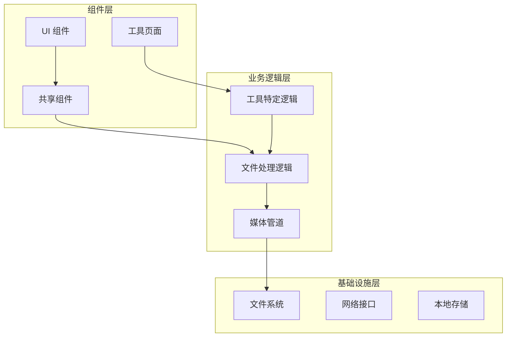
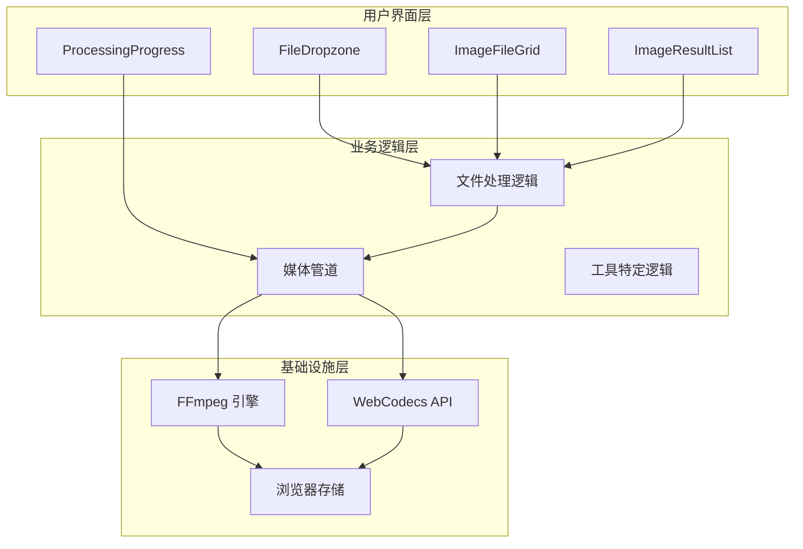
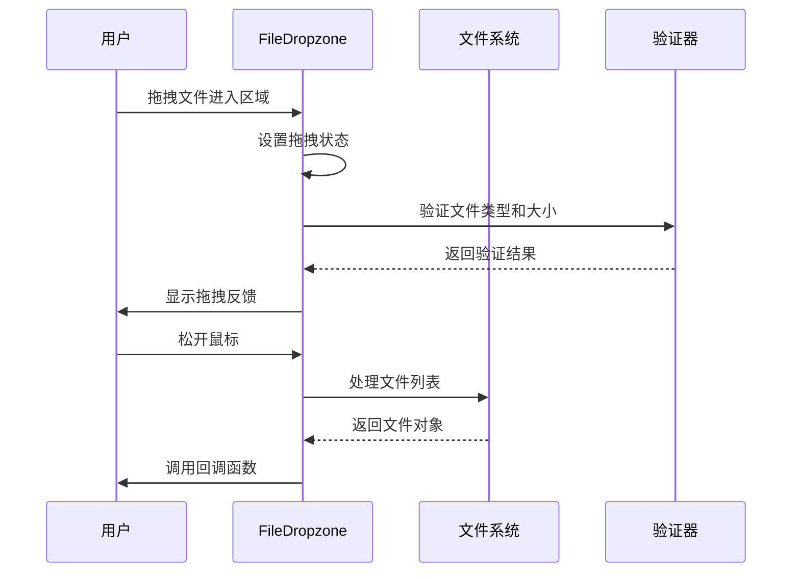
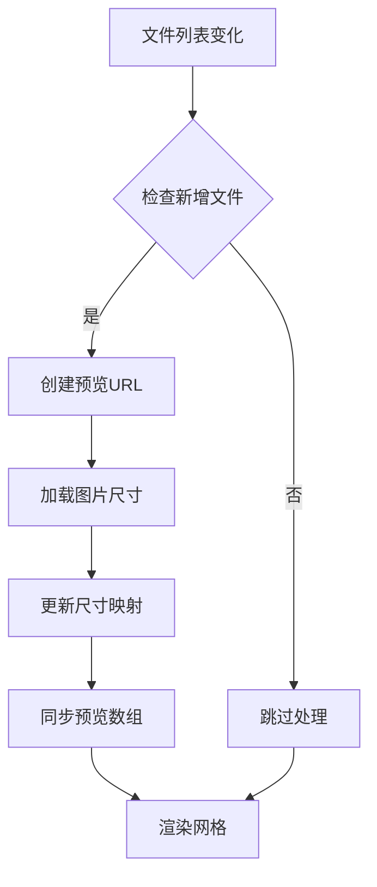
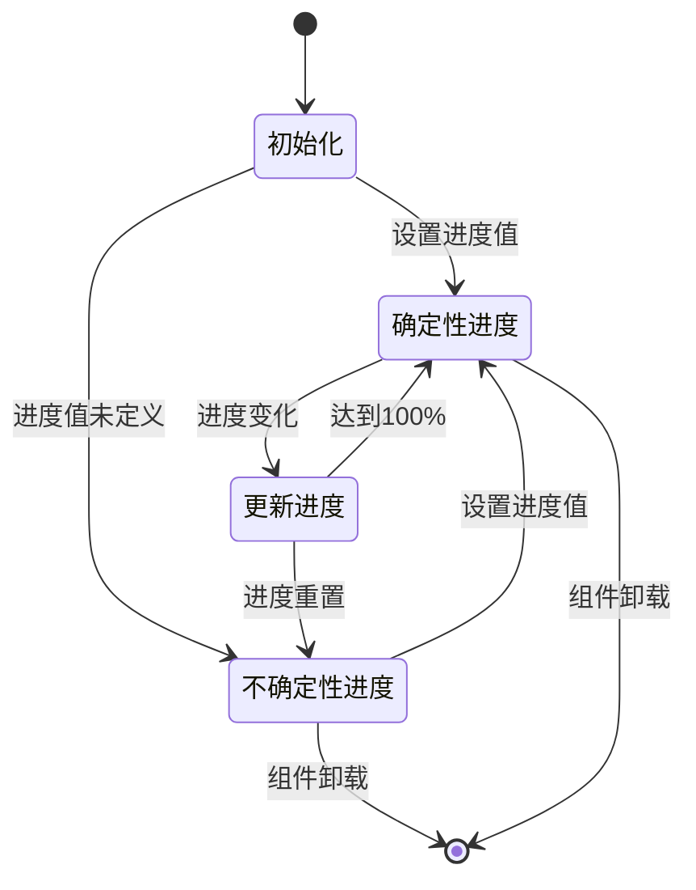
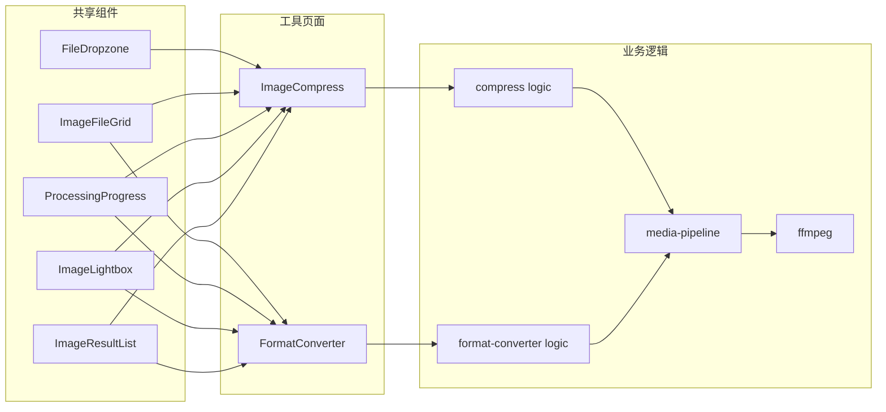
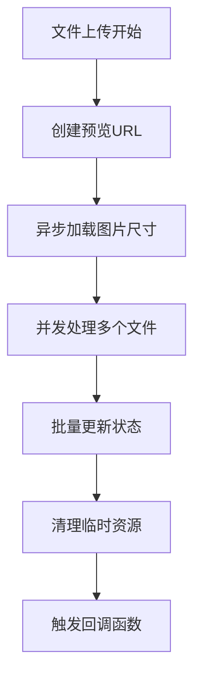

# 文件处理系统

<cite>
**本文档引用的文件**
- [FileDropzone.tsx](file://src/components/shared/FileDropzone.tsx)
- [ProcessingProgress.tsx](file://src/components/shared/ProcessingProgress.tsx)
- [ImageFileGrid.tsx](file://src/components/shared/ImageFileGrid.tsx)
- [ImageLightbox.tsx](file://src/components/shared/ImageLightbox.tsx)
- [ImageResultList.tsx](file://src/components/shared/ImageResultList.tsx)
- [media-pipeline.ts](file://src/lib/media-pipeline.ts)
- [ffmpeg.ts](file://src/lib/ffmpeg.ts)
- [ImageCompress.tsx](file://src/tools/image/compress/ImageCompress.tsx)
- [FormatConverter.tsx](file://src/tools/image/format-converter/FormatConverter.tsx)
- [compress logic.ts](file://src/tools/image/compress/logic.ts)
- [format-converter logic.ts](file://src/tools/image/format-converter/logic.ts)
- [useTextFileDrop.ts](file://src/hooks/useTextFileDrop.ts)
</cite>

## 目录
1. [简介](#简介)
2. [项目结构](#项目结构)
3. [核心组件](#核心组件)
4. [架构概览](#架构概览)
5. [详细组件分析](#详细组件分析)
6. [依赖关系分析](#依赖关系分析)
7. [性能考虑](#性能考虑)
8. [故障排除指南](#故障排除指南)
9. [结论](#结论)

## 简介

PrivaDeck 文件处理系统是一个基于 React 和 Next.js 构建的现代化文件处理平台，专注于图像和视频文件的处理与转换。该系统提供了直观的拖拽界面、强大的文件验证机制和实时进度跟踪功能，支持多种文件格式的压缩、转换和编辑操作。

系统的核心特性包括：
- 智能文件拖拽上传组件
- 多格式文件验证和大小限制
- 实时进度跟踪和状态管理
- 响应式图片网格展示
- 高级图片处理功能（压缩、格式转换、尺寸调整）
- 完整的文件处理流程管理

## 项目结构

文件处理系统采用模块化架构设计，主要分为以下几个层次：

**图表来源**
- [FileDropzone.tsx:1-144](file://src/components/shared/FileDropzone.tsx#L1-L144)
- [ImageFileGrid.tsx:1-226](file://src/components/shared/ImageFileGrid.tsx#L1-L226)

**章节来源**
- [FileDropzone.tsx:1-144](file://src/components/shared/FileDropzone.tsx#L1-L144)
- [ImageFileGrid.tsx:1-226](file://src/components/shared/ImageFileGrid.tsx#L1-L226)

## 核心组件

### 文件拖拽组件 (FileDropzone)

FileDropzone 是整个文件处理系统的核心交互组件，提供了直观的拖拽上传体验和强大的文件验证功能。

**主要功能特性：**
- 支持拖拽和点击两种文件选择方式
- 智能文件类型过滤和大小限制
- 实时拖拽状态反馈
- 多文件支持和批量处理
- 隐私保护提示和安全传输

**技术实现要点：**
- 使用 React Hooks 管理拖拽状态和文件列表
- 通过 HTML5 File API 处理文件读取和验证
- 支持自定义文件类型接受规则
- 集成分析事件追踪功能

**章节来源**
- [FileDropzone.tsx:42-144](file://src/components/shared/FileDropzone.tsx#L42-L144)

### 进度跟踪系统 (ProcessingProgress)

ProcessingProgress 提供了直观的进度可视化和状态反馈机制，支持确定性和不确定性进度显示。

**核心功能：**
- 确定性进度条（0-100%）
- 不确定性动画进度条
- 自定义状态文本覆盖
- 响应式设计适配不同屏幕尺寸

**实现特点：**
- 使用 CSS 动画实现流畅的进度过渡效果
- 支持百分比数值显示和标签文本自定义
- 内置防抖动和边界值处理

**章节来源**
- [ProcessingProgress.tsx:14-47](file://src/components/shared/ProcessingProgress.tsx#L14-L47)

### 图片网格组件 (ImageFileGrid)

ImageFileGrid 是一个功能丰富的图片管理组件，提供了图片预览、批量操作和响应式布局功能。

**主要特性：**
- 响应式网格布局（3-6列自适应）
- 图片预览和尺寸信息显示
- 批量文件添加和删除功能
- 图片放大查看器集成
- 键盘导航支持

**技术实现：**
- 使用 React Refs 管理文件引用和预览URL
- 实现增量同步机制优化性能
- 支持拖拽添加新文件
- 集成图片维度检测和缓存管理

**章节来源**
- [ImageFileGrid.tsx:17-226](file://src/components/shared/ImageFileGrid.tsx#L17-L226)

## 架构概览

系统采用分层架构设计，确保各组件间的松耦合和高内聚：

**图表来源**
- [media-pipeline.ts:1-105](file://src/lib/media-pipeline.ts#L1-L105)
- [ffmpeg.ts:1-144](file://src/lib/ffmpeg.ts#L1-L144)

**章节来源**
- [media-pipeline.ts:1-105](file://src/lib/media-pipeline.ts#L1-L105)
- [ffmpeg.ts:1-144](file://src/lib/ffmpeg.ts#L1-L144)

## 详细组件分析

### FileDropzone 组件深度解析

FileDropzone 组件实现了完整的拖拽上传功能，包含以下核心功能模块：

#### 拖拽逻辑实现

**图表来源**
- [FileDropzone.tsx:55-76](file://src/components/shared/FileDropzone.tsx#L55-L76)

#### 文件验证机制

组件内置了多层次的文件验证系统：

1. **类型验证**：支持通配符匹配和精确类型匹配
2. **大小限制**：动态大小检查和错误处理
3. **格式转换**：将技术规范转换为用户友好的显示格式

**章节来源**
- [FileDropzone.tsx:19-40](file://src/components/shared/FileDropzone.tsx#L19-L40)
- [FileDropzone.tsx:55-76](file://src/components/shared/FileDropzone.tsx#L55-L76)

### ImageFileGrid 组件详细分析

ImageFileGrid 组件提供了高级的图片管理功能，其核心实现包括：

#### 图片预览和缓存管理

**图表来源**
- [ImageFileGrid.tsx:42-74](file://src/components/shared/ImageFileGrid.tsx#L42-L74)

#### 批量操作功能

组件支持多种批量操作模式：

1. **文件添加**：通过拖拽或点击添加新文件
2. **文件删除**：单个文件移除和全部清空
3. **预览查看**：图片放大查看和全屏预览
4. **键盘导航**：支持键盘快捷键操作

**章节来源**
- [ImageFileGrid.tsx:76-90](file://src/components/shared/ImageFileGrid.tsx#L76-L90)
- [ImageFileGrid.tsx:104-226](file://src/components/shared/ImageFileGrid.tsx#L104-L226)

### ProcessingProgress 组件实现

ProcessingProgress 组件提供了灵活的进度显示方案：

#### 进度计算和状态管理

**图表来源**
- [ProcessingProgress.tsx:14-47](file://src/components/shared/ProcessingProgress.tsx#L14-L47)

#### 用户反馈机制

组件通过多种方式提供用户反馈：

1. **视觉反馈**：进度条颜色和动画效果
2. **文本反馈**：状态描述和百分比显示
3. **无障碍支持**：键盘导航和屏幕阅读器兼容

**章节来源**
- [ProcessingProgress.tsx:14-47](file://src/components/shared/ProcessingProgress.tsx#L14-L47)

## 依赖关系分析

系统组件间的依赖关系体现了清晰的分层架构：

**图表来源**
- [ImageCompress.tsx:1-373](file://src/tools/image/compress/ImageCompress.tsx#L1-L373)
- [FormatConverter.tsx:1-135](file://src/tools/image/format-converter/FormatConverter.tsx#L1-L135)

**章节来源**
- [ImageCompress.tsx:1-373](file://src/tools/image/compress/ImageCompress.tsx#L1-L373)
- [FormatConverter.tsx:1-135](file://src/tools/image/format-converter/FormatConverter.tsx#L1-L135)

## 性能考虑

### 内存管理优化

系统在多个层面实现了内存优化策略：

1. **URL 对象管理**：使用引用计数和清理机制避免内存泄漏
2. **增量同步**：只处理新增文件，减少不必要的计算
3. **缓存策略**：智能缓存预览URL和图片尺寸信息

### 并发处理机制

**图表来源**
- [ImageFileGrid.tsx:42-74](file://src/components/shared/ImageFileGrid.tsx#L42-L74)

### 浏览器兼容性

系统针对不同浏览器环境提供了优化方案：

1. **WebCodecs 支持检测**：自动选择最佳处理方案
2. **降级策略**：FFmpeg 作为后备处理引擎
3. **性能监控**：实时监控处理性能并调整策略

**章节来源**
- [media-pipeline.ts:7-14](file://src/lib/media-pipeline.ts#L7-L14)
- [media-pipeline.ts:59-91](file://src/lib/media-pipeline.ts#L59-L91)

## 故障排除指南

### 常见问题诊断

#### 文件上传失败

**可能原因：**
1. 文件类型不被支持
2. 文件大小超过限制
3. 浏览器兼容性问题

**解决方案：**
- 检查 accept 属性配置
- 验证文件大小限制设置
- 确认浏览器对相关格式的支持

#### 进度显示异常

**可能原因：**
1. 进度回调函数未正确设置
2. 进度值超出有效范围
3. 组件状态同步问题

**解决方案：**
- 确保进度值在 0-100 范围内
- 检查回调函数的调用时机
- 验证组件重新渲染逻辑

#### 图片预览问题

**可能原因：**
1. URL 对象未正确创建
2. 图片尺寸加载失败
3. 内存资源不足

**解决方案：**
- 检查文件读取权限
- 验证图片格式兼容性
- 实施适当的内存清理策略

**章节来源**
- [ImageFileGrid.tsx:34-40](file://src/components/shared/ImageFileGrid.tsx#L34-L40)
- [ImageResultList.tsx:26-50](file://src/components/shared/ImageResultList.tsx#L26-L50)

## 结论

PrivaDeck 文件处理系统通过精心设计的组件架构和优化的性能策略，为用户提供了高效、可靠的文件处理体验。系统的主要优势包括：

1. **用户体验优秀**：直观的拖拽界面和实时反馈机制
2. **功能强大**：支持多种文件格式和复杂的处理操作
3. **性能优异**：智能缓存和内存管理策略
4. **可扩展性强**：模块化设计便于功能扩展和维护

该系统为文件处理领域提供了一个高质量的参考实现，展示了现代前端技术在多媒体处理方面的最佳实践。