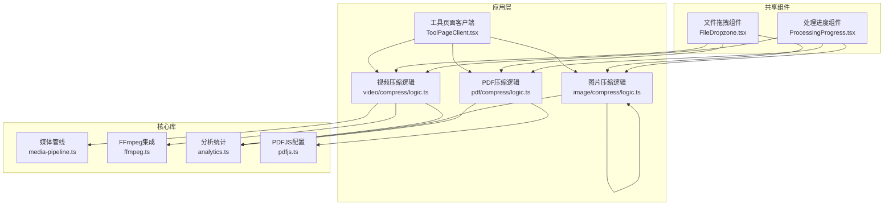
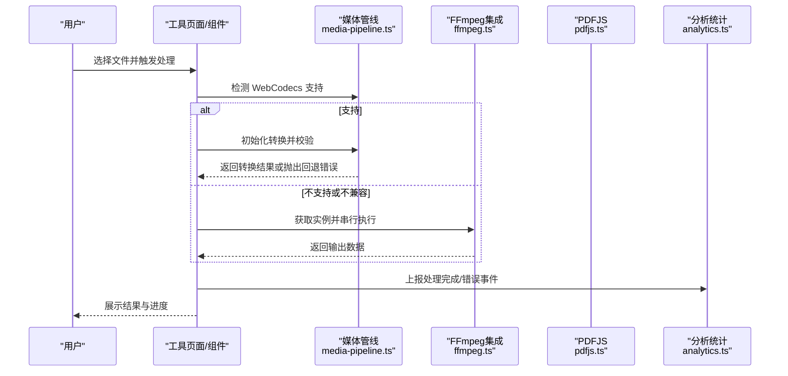
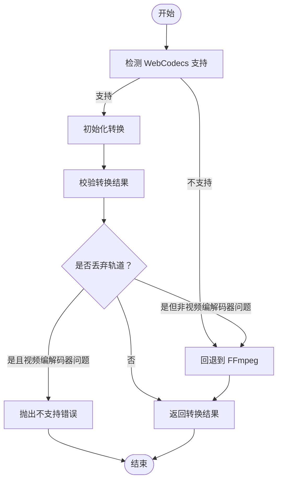
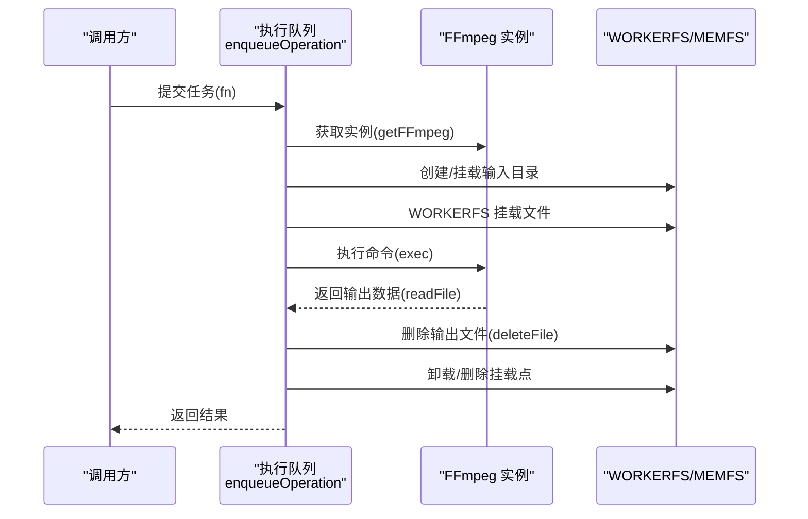
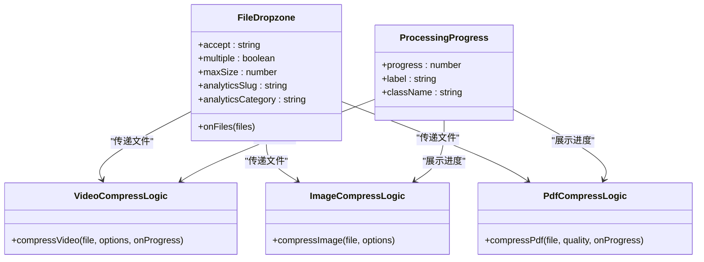
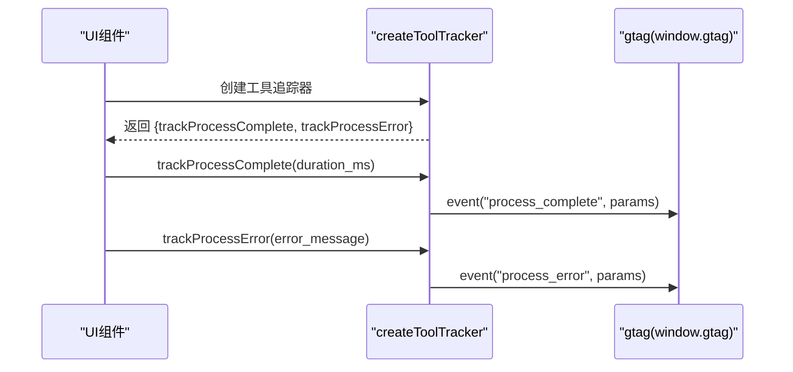
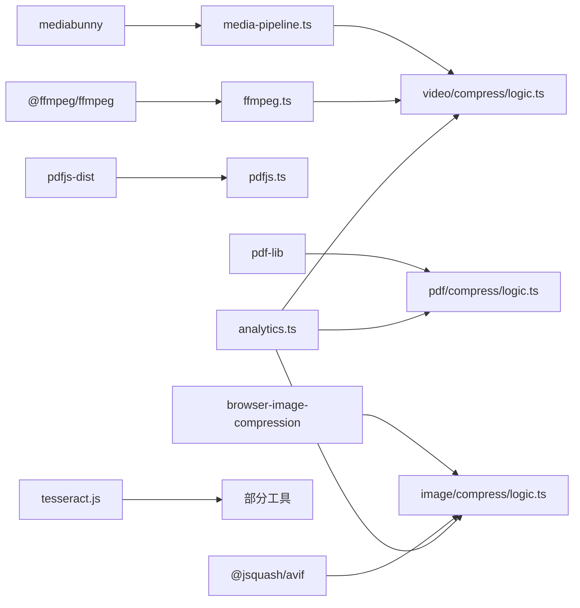

# 核心模块

<cite>
**本文引用的文件**
- [package.json](file://package.json)
- [media-pipeline.ts](file://src/lib/media-pipeline.ts)
- [ffmpeg.ts](file://src/lib/ffmpeg.ts)
- [analytics.ts](file://src/lib/analytics.ts)
- [FileDropzone.tsx](file://src/components/shared/FileDropzone.tsx)
- [ProcessingProgress.tsx](file://src/components/shared/ProcessingProgress.tsx)
- [logic.ts（视频压缩）](file://src/tools/video/compress/logic.ts)
- [logic.ts（图片压缩）](file://src/tools/image/compress/logic.ts)
- [logic.ts（PDF压缩）](file://src/tools/pdf/compress/logic.ts)
- [pdfjs.ts](file://src/lib/pdfjs.ts)
- [ToolPageClient.tsx](file://src/app/[locale]/tools/[category]/[slug]/ToolPageClient.tsx)
- [index.ts（视频压缩工具定义）](file://src/tools/video/compress/index.ts)
- [index.ts（图片压缩工具定义）](file://src/tools/image/compress/index.ts)
- [index.ts（PDF压缩工具定义）](file://src/tools/pdf/compress/index.ts)
</cite>

## 目录
1. [简介](#简介)
2. [项目结构](#项目结构)
3. [核心组件](#核心组件)
4. [架构总览](#架构总览)
5. [详细组件分析](#详细组件分析)
6. [依赖关系分析](#依赖关系分析)
7. [性能考虑](#性能考虑)
8. [故障排除指南](#故障排除指南)
9. [结论](#结论)
10. [附录](#附录)

## 简介
本文件面向 PrivaDeck 媒体工具箱的核心模块，聚焦以下主题：
- 媒体处理管道：WebCodecs 与 FFmpeg 的智能选择机制、错误处理策略与性能优化
- FFmpeg.wasm 集成：实例管理、任务队列与内存优化
- 文件处理系统：拖拽组件、文件验证与进度跟踪
- 分析统计模块：Google Analytics 集成与用户行为追踪
- 公共接口与配置选项：各模块对外暴露的 API 与可调参数

## 项目结构
PrivaDeck 采用 Next.js 应用结构，核心能力集中在 src/lib 与 src/components/shared，以及各工具目录下的逻辑与页面组件。关键模块分布如下：
- 处理管线与编解码：src/lib/media-pipeline.ts
- FFmpeg.wasm 集成：src/lib/ffmpeg.ts
- 分析统计：src/lib/analytics.ts
- 文件处理 UI 组件：src/components/shared/FileDropzone.tsx、ProcessingProgress.tsx
- 工具逻辑：src/tools/{video,image,pdf}/.../logic.ts
- PDFJS 配置：src/lib/pdfjs.ts
- 工具页面客户端加载：src/app/[locale]/tools/[category]/[slug]/ToolPageClient.tsx

图表来源
- [ToolPageClient.tsx:29-58](file://src/app/[locale]/tools/[category]/[slug]/ToolPageClient.tsx#L29-L58)
- [logic.ts（视频压缩）:85-110](file://src/tools/video/compress/logic.ts#L85-L110)
- [logic.ts（图片压缩）:83-123](file://src/tools/image/compress/logic.ts#L83-L123)
- [logic.ts（PDF压缩）:12-66](file://src/tools/pdf/compress/logic.ts#L12-L66)
- [media-pipeline.ts:7-14](file://src/lib/media-pipeline.ts#L7-L14)
- [ffmpeg.ts:10-39](file://src/lib/ffmpeg.ts#L10-L39)
- [analytics.ts:106-137](file://src/lib/analytics.ts#L106-L137)
- [pdfjs.ts:3-13](file://src/lib/pdfjs.ts#L3-L13)

章节来源
- [package.json:11-31](file://package.json#L11-L31)
- [ToolPageClient.tsx:29-58](file://src/app/[locale]/tools/[category]/[slug]/ToolPageClient.tsx#L29-L58)

## 核心组件
本节概述核心模块职责与交互方式。

- 媒体处理管线（WebCodecs + FFmpeg）
  - 能力：检测浏览器对 WebCodecs 的支持；在不支持或不兼容时回退到 FFmpeg；校验转换结果是否丢弃关键轨道；针对特定硬件编解码器给出扩展建议。
  - 关键导出：能力检测、解析码率字符串、错误类型、转换校验、HEVC 扩展建议。
  - 参考路径：[media-pipeline.ts:7-105](file://src/lib/media-pipeline.ts#L7-L105)

- FFmpeg.wasm 集成
  - 能力：单例化 FFmpeg 实例、懒加载核心资源、串行化执行队列、WORKERFS 挂载输入文件避免内存复制、统一进度回调。
  - 关键导出：获取实例、入队执行、挂载执行、并发控制。
  - 参考路径：[ffmpeg.ts:10-144](file://src/lib/ffmpeg.ts#L10-L144)

- 分析统计（Google Analytics）
  - 能力：事件参数接口与隐私裁剪、统一事件上报函数、工具页便捷追踪器工厂。
  - 关键导出：事件类型、trackEvent、createToolTracker。
  - 参考路径：[analytics.ts:106-137](file://src/lib/analytics.ts#L106-L137)

- 文件处理 UI 组件
  - FileDropzone：拖拽/点击上传、大小过滤、格式提示、隐私提示、上传事件追踪。
  - ProcessingProgress：确定/不确定进度条、百分比显示。
  - 参考路径：
    - [FileDropzone.tsx:42-143](file://src/components/shared/FileDropzone.tsx#L42-L143)
    - [ProcessingProgress.tsx:14-46](file://src/components/shared/ProcessingProgress.tsx#L14-L46)

- PDFJS 配置
  - 能力：首次使用时设置 worker 源，避免重复配置。
  - 参考路径：[pdfjs.ts:3-13](file://src/lib/pdfjs.ts#L3-L13)

章节来源
- [media-pipeline.ts:7-105](file://src/lib/media-pipeline.ts#L7-L105)
- [ffmpeg.ts:10-144](file://src/lib/ffmpeg.ts#L10-L144)
- [analytics.ts:106-137](file://src/lib/analytics.ts#L106-L137)
- [FileDropzone.tsx:42-143](file://src/components/shared/FileDropzone.tsx#L42-L143)
- [ProcessingProgress.tsx:14-46](file://src/components/shared/ProcessingProgress.tsx#L14-L46)
- [pdfjs.ts:3-13](file://src/lib/pdfjs.ts#L3-L13)

## 架构总览
媒体处理采用“优先 WebCodecs，失败回退 FFmpeg”的策略，并结合工具级进度反馈与分析统计，形成端侧高性能、可观测的处理链路。

图表来源
- [media-pipeline.ts:7-105](file://src/lib/media-pipeline.ts#L7-L105)
- [ffmpeg.ts:75-82](file://src/lib/ffmpeg.ts#L75-L82)
- [logic.ts（视频压缩）:85-110](file://src/tools/video/compress/logic.ts#L85-L110)
- [analytics.ts:128-137](file://src/lib/analytics.ts#L128-L137)

## 详细组件分析

### WebCodecs 与 FFmpeg 智能选择机制
- 能力检测：通过检测 VideoEncoder/Decoder 与 AudioEncoder/Decoder 是否可用判断浏览器支持情况。
- 回退策略：
  - 若因编解码器不受支持导致轨道被丢弃，则抛出 WebCodecsFallbackError；若为视频编解码器问题则直接视为不支持，不再回退至 FFmpeg。
  - 其他原因（如音频）允许回退至 FFmpeg。
- 进度与校验：转换对象提供进度回调；validateConversion 确保未丢弃关键轨道。
- 参考路径：
  - [media-pipeline.ts:7-105](file://src/lib/media-pipeline.ts#L7-L105)

图表来源
- [media-pipeline.ts:59-91](file://src/lib/media-pipeline.ts#L59-L91)
- [logic.ts（视频压缩）:92-110](file://src/tools/video/compress/logic.ts#L92-L110)

章节来源
- [media-pipeline.ts:7-105](file://src/lib/media-pipeline.ts#L7-L105)
- [logic.ts（视频压缩）:85-110](file://src/tools/video/compress/logic.ts#L85-L110)

### FFmpeg.wasm 集成：实例管理、任务队列与内存优化
- 单例与懒加载：getFFmpeg 保证仅加载一次核心资源，失败时清理实例并抛错。
- 串行化执行：enqueueOperation 将所有操作串接在单一 Promise 队列上，规避并发挂载点冲突。
- 内存优化：
  - 使用 WORKERFS 挂载原生 File 对象，避免两次全量内存拷贝；
  - 执行完成后立即删除 MEMFS 中的输出文件，降低峰值内存；
  - 进度回调在队列内原子设置/清除，避免竞态。
- 参考路径：
  - [ffmpeg.ts:10-144](file://src/lib/ffmpeg.ts#L10-L144)

图表来源
- [ffmpeg.ts:75-143](file://src/lib/ffmpeg.ts#L75-L143)

章节来源
- [ffmpeg.ts:10-144](file://src/lib/ffmpeg.ts#L10-L144)

### 文件处理系统：拖拽、验证与进度跟踪
- FileDropzone
  - 接受 accept/multiple/maxSize 等参数，过滤超大文件，统计首文件扩展名与数量，触发上传事件追踪。
  - UI 提示支持拖拽、格式与大小限制、隐私提示。
  - 参考路径：[FileDropzone.tsx:42-143](file://src/components/shared/FileDropzone.tsx#L42-L143)
- ProcessingProgress
  - 支持确定/不确定进度，显示百分比与动画进度条。
  - 参考路径：[ProcessingProgress.tsx:14-46](file://src/components/shared/ProcessingProgress.tsx#L14-L46)
- 工具侧集成
  - 视频压缩：compressVideo 在 WebCodecs 成功后直接返回 Blob，失败时回退 FFmpeg 并返回 Blob。
  - 图片压缩：browser-image-compression 与 @jsquash/avif 提供多格式压缩路径。
  - PDF 压缩：pdf-lib + pdfjs-dist 渲染页面为 JPEG 后嵌入生成新 PDF。
  - 参考路径：
    - [logic.ts（视频压缩）:85-110](file://src/tools/video/compress/logic.ts#L85-L110)
    - [logic.ts（图片压缩）:83-123](file://src/tools/image/compress/logic.ts#L83-L123)
    - [logic.ts（PDF压缩）:12-66](file://src/tools/pdf/compress/logic.ts#L12-L66)

图表来源
- [FileDropzone.tsx:9-17](file://src/components/shared/FileDropzone.tsx#L9-L17)
- [ProcessingProgress.tsx:6-12](file://src/components/shared/ProcessingProgress.tsx#L6-L12)
- [logic.ts（视频压缩）:85-110](file://src/tools/video/compress/logic.ts#L85-L110)
- [logic.ts（图片压缩）:83-123](file://src/tools/image/compress/logic.ts#L83-L123)
- [logic.ts（PDF压缩）:12-66](file://src/tools/pdf/compress/logic.ts#L12-L66)

章节来源
- [FileDropzone.tsx:42-143](file://src/components/shared/FileDropzone.tsx#L42-L143)
- [ProcessingProgress.tsx:14-46](file://src/components/shared/ProcessingProgress.tsx#L14-L46)
- [logic.ts（视频压缩）:85-110](file://src/tools/video/compress/logic.ts#L85-L110)
- [logic.ts（图片压缩）:83-123](file://src/tools/image/compress/logic.ts#L83-L123)
- [logic.ts（PDF压缩）:12-66](file://src/tools/pdf/compress/logic.ts#L12-L66)

### 分析统计模块：Google Analytics 集成与用户行为追踪
- 事件参数接口：涵盖文件上传/下载、复制点击、搜索、相关工具点击、FAQ 展开、主题/语言切换、分享、处理完成/错误等。
- 隐私保护：对长字符串进行截断，避免记录文件名等敏感信息。
- 工具页便捷追踪器：createToolTracker 为每个工具页面生成专用追踪器，自动填充工具标识与分类。
- 参考路径：[analytics.ts:106-137](file://src/lib/analytics.ts#L106-L137)

图表来源
- [analytics.ts:128-137](file://src/lib/analytics.ts#L128-L137)

章节来源
- [analytics.ts:106-137](file://src/lib/analytics.ts#L106-L137)

### 工具页面客户端加载与路由集成
- ToolPageClient 使用动态导入与缓存稳定化，按路由参数加载对应工具组件，包裹面包屑、页面外壳与相关工具/FAQ 区块。
- 参考路径：[ToolPageClient.tsx:29-58](file://src/app/[locale]/tools/[category]/[slug]/ToolPageClient.tsx#L29-L58)

章节来源
- [ToolPageClient.tsx:29-58](file://src/app/[locale]/tools/[category]/[slug]/ToolPageClient.tsx#L29-L58)

## 依赖关系分析
- 外部依赖
  - @ffmpeg/ffmpeg：FFmpeg.wasm 核心与工具
  - mediabunny：WebCodecs 编解码管线
  - pdfjs-dist、pdf-lib：PDF 解析与重写
  - browser-image-compression、@jsquash/avif：图片压缩与 AVIF 编码
  - tesseract.js：OCR（部分工具）
- 内部模块耦合
  - 工具逻辑依赖媒体管线与 FFmpeg 集成，UI 组件负责输入与进度展示，分析统计贯穿处理流程。
- 参考路径：
  - [package.json:11-31](file://package.json#L11-L31)

图表来源
- [package.json:11-31](file://package.json#L11-L31)
- [media-pipeline.ts:126-126](file://src/lib/media-pipeline.ts#L126-L126)
- [ffmpeg.ts:15-28](file://src/lib/ffmpeg.ts#L15-L28)
- [pdfjs.ts:4-10](file://src/lib/pdfjs.ts#L4-L10)
- [logic.ts（视频压缩）:1-10](file://src/tools/video/compress/logic.ts#L1-L10)
- [logic.ts（图片压缩）:1-1](file://src/tools/image/compress/logic.ts#L1-L1)
- [logic.ts（PDF压缩）:1-2](file://src/tools/pdf/compress/logic.ts#L1-L2)

章节来源
- [package.json:11-31](file://package.json#L11-L31)

## 性能考虑
- WebCodecs 优先：在支持的浏览器中利用硬件加速与流式处理，减少内存占用与 CPU 开销。
- FFmpeg.wasm 优化：
  - 串行化执行避免并发挂载点冲突；
  - WORKERFS 直接读取原生 File，避免额外拷贝；
  - 输出读取后立即删除 MEMFS 文件，降低峰值内存。
- 图片压缩：根据目标尺寸与质量参数选择合适算法与工作线程，必要时降采样后再编码。
- PDF 压缩：按质量配置缩放与 JPEG 压缩比，逐页渲染并及时释放画布资源。
- 参考路径：
  - [media-pipeline.ts:17-26](file://src/lib/media-pipeline.ts#L17-L26)
  - [ffmpeg.ts:99-143](file://src/lib/ffmpeg.ts#L99-L143)
  - [logic.ts（图片压缩）:83-123](file://src/tools/image/compress/logic.ts#L83-L123)
  - [logic.ts（PDF压缩）:12-66](file://src/tools/pdf/compress/logic.ts#L12-L66)

## 故障排除指南
- WebCodecs 回退错误
  - 症状：抛出 WebCodecsFallbackError，可能伴随视频编解码器问题。
  - 处理：检查源视频编解码器；对于视频编解码器问题，直接提示不支持，不再回退。
  - 参考路径：[media-pipeline.ts:32-53](file://src/lib/media-pipeline.ts#L32-L53)
- FFmpeg 加载失败
  - 症状：加载 coreURL/wasmURL 失败。
  - 处理：确保网络可达与跨域配置正确；捕获异常后终止实例并重试。
  - 参考路径：[ffmpeg.ts:14-39](file://src/lib/ffmpeg.ts#L14-L39)
- 进度异常
  - 症状：进度回调值不在 0-1 范围。
  - 处理：在设置进度处理器时进行边界校验；确保在任务前后正确注册/注销。
  - 参考路径：[ffmpeg.ts:41-58](file://src/lib/ffmpeg.ts#L41-L58)
- PDF 渲染失败
  - 症状：Canvas toBlob 失败或页面渲染异常。
  - 处理：检查 Canvas 宽高与上下文；确保释放 GPU 资源；重试或提示用户更换质量。
  - 参考路径：[logic.ts（PDF压缩）:36-48](file://src/tools/pdf/compress/logic.ts#L36-L48)

章节来源
- [media-pipeline.ts:32-53](file://src/lib/media-pipeline.ts#L32-L53)
- [ffmpeg.ts:14-39](file://src/lib/ffmpeg.ts#L14-L39)
- [ffmpeg.ts:41-58](file://src/lib/ffmpeg.ts#L41-L58)
- [logic.ts（PDF压缩）:36-48](file://src/tools/pdf/compress/logic.ts#L36-L48)

## 结论
本核心模块通过 WebCodecs 优先、FFmpeg 回退、严格的错误处理与内存优化，构建了高性能、可观测的媒体处理体系。配合文件拖拽与进度反馈组件，以及基于 Google Analytics 的行为追踪，为用户提供流畅、透明的端侧处理体验。工具定义与页面客户端加载进一步保证了功能的可扩展性与可维护性。

## 附录

### 公共接口与配置选项速查
- 媒体管线
  - isWebCodecsSupported(): 判断浏览器支持
  - parseBitrate(value: string): 解析码率字符串
  - validateConversion(conversion): 校验转换结果
  - shouldSuggestHevcExtension(): 建议安装 HEVC 扩展
  - 参考路径：[media-pipeline.ts:7-105](file://src/lib/media-pipeline.ts#L7-L105)
- FFmpeg 集成
  - getFFmpeg(): 获取单例实例
  - enqueueOperation(fn): 入队执行
  - execWithMount(file, buildArgs, outputName, onProgress?): 挂载执行
  - 参考路径：[ffmpeg.ts:10-144](file://src/lib/ffmpeg.ts#L10-L144)
- 分析统计
  - trackEvent(event, params?): 统一事件上报
  - createToolTracker(slug, category): 工具页追踪器工厂
  - 参考路径：[analytics.ts:106-137](file://src/lib/analytics.ts#L106-L137)
- 文件处理 UI
  - FileDropzone(props): 拖拽/点击上传、过滤与追踪
  - ProcessingProgress(props): 进度展示
  - 参考路径：
    - [FileDropzone.tsx:42-143](file://src/components/shared/FileDropzone.tsx#L42-L143)
    - [ProcessingProgress.tsx:14-46](file://src/components/shared/ProcessingProgress.tsx#L14-L46)
- 工具定义
  - 视频压缩：slug="compress"，category="video"
  - 图片压缩：slug="compress"，category="image"
  - PDF 压缩：slug="compress"，category="pdf"
  - 参考路径：
    - [index.ts（视频压缩）:3-46](file://src/tools/video/compress/index.ts#L3-L46)
    - [index.ts（图片压缩）:3-34](file://src/tools/image/compress/index.ts#L3-L34)
    - [index.ts（PDF压缩）:3-34](file://src/tools/pdf/compress/index.ts#L3-L34)