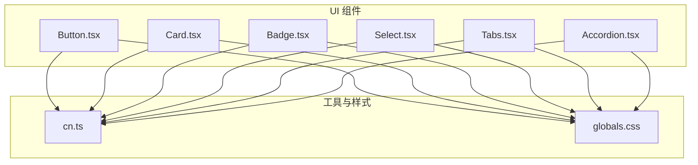
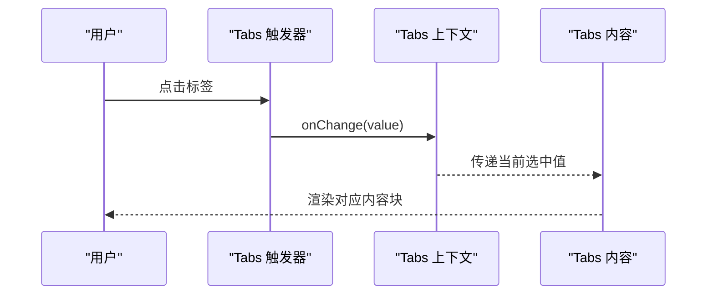
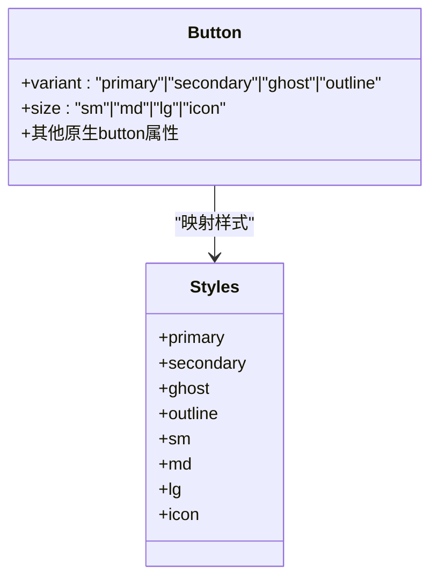
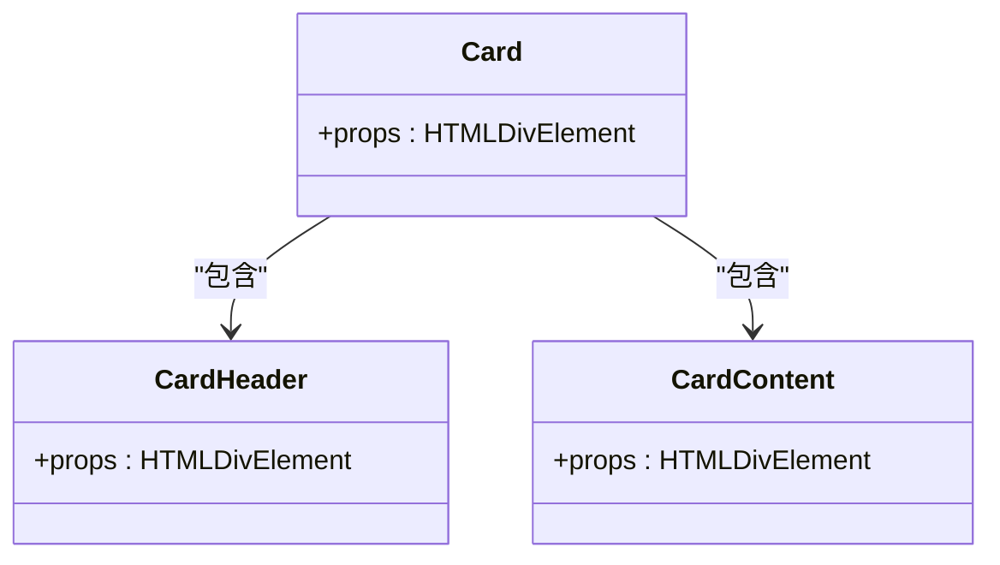
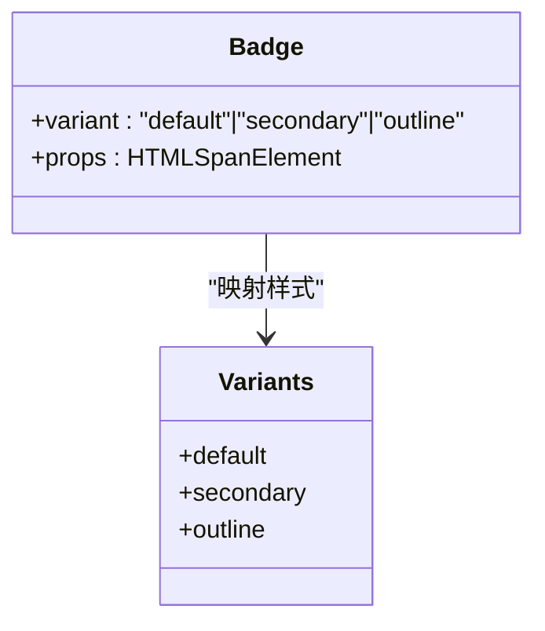
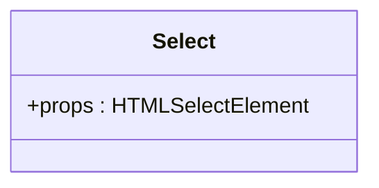
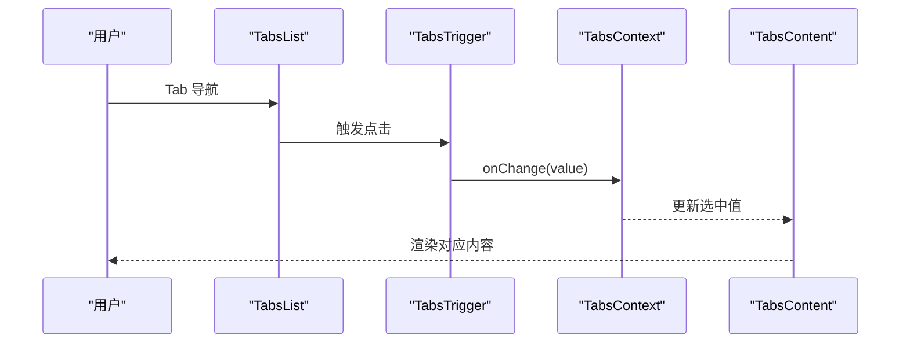
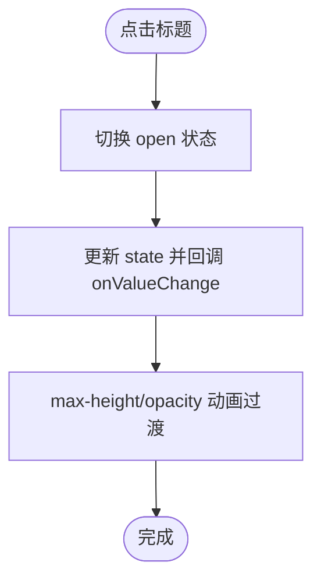
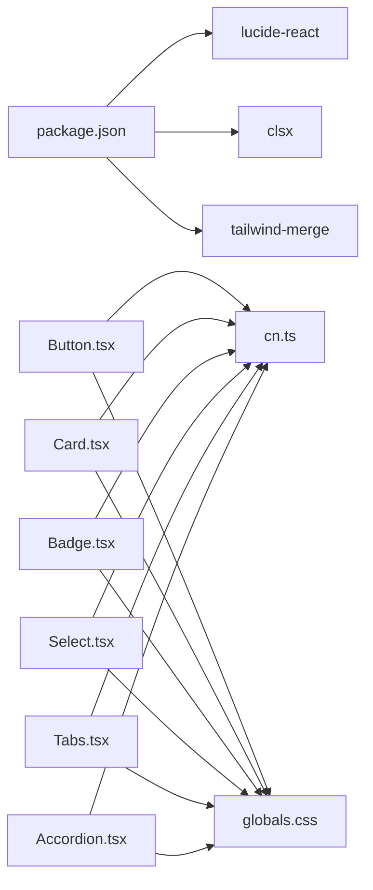

# UI组件库

<cite>
**本文引用的文件**
- [Button.tsx](file://src/components/ui/Button.tsx)
- [Card.tsx](file://src/components/ui/Card.tsx)
- [Badge.tsx](file://src/components/ui/Badge.tsx)
- [Select.tsx](file://src/components/ui/Select.tsx)
- [Tabs.tsx](file://src/components/ui/Tabs.tsx)
- [Accordion.tsx](file://src/components/ui/Accordion.tsx)
- [cn.ts](file://src/lib/utils/cn.ts)
- [globals.css](file://src/app/globals.css)
- [package.json](file://package.json)
</cite>

## 目录
1. [简介](#简介)
2. [项目结构](#项目结构)
3. [核心组件](#核心组件)
4. [架构总览](#架构总览)
5. [详细组件分析](#详细组件分析)
6. [依赖关系分析](#依赖关系分析)
7. [性能考量](#性能考量)
8. [故障排查指南](#故障排查指南)
9. [结论](#结论)
10. [附录](#附录)

## 简介
本文件为 PrivaDeck 媒体工具箱的 UI 组件库提供系统化、可操作的技术文档。重点覆盖以下原子级组件：按钮(Button)、卡片(Card)、徽章(Badge)、选择器(Select)、标签页(Tabs)与手风琴(Accordion)。文档从设计原则、实现细节、API 定义、CSS 变量定制、主题适配、无障碍支持到使用示例与最佳实践进行全链路说明，并辅以可视化图示帮助不同技术背景的读者快速理解与应用。

## 项目结构
UI 组件集中位于 src/components/ui 目录，采用“按功能分层”的组织方式：
- 每个组件独立文件，职责单一，便于复用与测试
- 使用 forwardRef 包裹受控组件，确保 DOM 引用可用
- 通过 cn 工具函数合并 Tailwind 类名，统一风格与可维护性
- 主题与动画由全局样式文件统一定义，组件通过 CSS 变量与动画类实现一致的视觉与交互体验

图表来源
- [Button.tsx:1-42](file://src/components/ui/Button.tsx#L1-L42)
- [Card.tsx:1-33](file://src/components/ui/Card.tsx#L1-L33)
- [Badge.tsx:1-28](file://src/components/ui/Badge.tsx#L1-L28)
- [Select.tsx:1-18](file://src/components/ui/Select.tsx#L1-L18)
- [Tabs.tsx:1-102](file://src/components/ui/Tabs.tsx#L1-L102)
- [Accordion.tsx:1-63](file://src/components/ui/Accordion.tsx#L1-L63)
- [cn.ts:1-7](file://src/lib/utils/cn.ts#L1-L7)
- [globals.css:1-128](file://src/app/globals.css#L1-L128)

章节来源
- [Button.tsx:1-42](file://src/components/ui/Button.tsx#L1-L42)
- [Card.tsx:1-33](file://src/components/ui/Card.tsx#L1-L33)
- [Badge.tsx:1-28](file://src/components/ui/Badge.tsx#L1-L28)
- [Select.tsx:1-18](file://src/components/ui/Select.tsx#L1-L18)
- [Tabs.tsx:1-102](file://src/components/ui/Tabs.tsx#L1-L102)
- [Accordion.tsx:1-63](file://src/components/ui/Accordion.tsx#L1-L63)
- [cn.ts:1-7](file://src/lib/utils/cn.ts#L1-L7)
- [globals.css:1-128](file://src/app/globals.css#L1-L128)

## 核心组件
本节概述各组件的设计目标与通用能力：
- 统一的类名合并策略：通过 cn 合并基础类与变体类，避免冲突并提升可读性
- 主题变量驱动：组件样式广泛使用 CSS 变量，确保浅色/深色主题与品牌色系的一致性
- 无障碍优先：按钮与交互元素具备焦点可见性、禁用态与 ARIA 属性
- 动画与过渡：使用预置动画类与 CSS 过渡，保证流畅的用户反馈

章节来源
- [cn.ts:1-7](file://src/lib/utils/cn.ts#L1-L7)
- [globals.css:1-128](file://src/app/globals.css#L1-L128)

## 架构总览
组件间协作遵循“组合优于继承”的原则，通过上下文与受控/非受控模式实现状态共享与解耦。

图表来源
- [Tabs.tsx:16-38](file://src/components/ui/Tabs.tsx#L16-L38)
- [Tabs.tsx:59-86](file://src/components/ui/Tabs.tsx#L59-L86)
- [Tabs.tsx:88-101](file://src/components/ui/Tabs.tsx#L88-L101)

## 详细组件分析

### 按钮 Button
- 设计原则
  - 四种样式变体：主按钮(primary)、次按钮(secondary)、幽灵(ghost)、描边(outline)，分别适用于强调、次要、无背景与边框场景
  - 三种尺寸：小(sm)、中(md)、大(lg)、图标(icon)，满足不同信息密度与空间约束
  - 交互反馈：悬停发光(glow)、按下缩放(scale)、聚焦环(focus-visible ring)、禁用态不响应与透明度
- 关键实现点
  - 使用 CSS 变量控制渐变与发光效果，确保主题一致性
  - 通过 forwardRef 暴露 DOM 引用，便于聚焦或自定义行为
  - 支持原生 button 属性（如 type、disabled、onClick 等）
- API 定义
  - props
    - variant?: "primary" | "secondary" | "ghost" | "outline"
    - size?: "sm" | "md" | "lg" | "icon"
    - 其他原生 HTMLButtonElement 属性
- CSS 变量与主题适配
  - 依赖：--primary、--primary-foreground、--glow-primary、--muted、--muted-foreground、--border
  - 深浅色自动切换由全局 CSS 提供
- 无障碍支持
  - 聚焦可见性：focus-visible:outline-none + focus-visible:ring-2
  - 禁用态：pointer-events-none + opacity-50
- 使用示例与最佳实践
  - 示例路径：[Button.tsx:27-40](file://src/components/ui/Button.tsx#L27-L40)
  - 最佳实践
    - 图标按钮仅传入 icon 尺寸，保持视觉平衡
    - 在表单提交等关键动作使用 primary
    - 链接或次要操作使用 secondary/ghost
    - 大面积区域交互使用 lg；紧凑区域使用 sm

图表来源
- [Button.tsx:4-25](file://src/components/ui/Button.tsx#L4-L25)
- [Button.tsx:27-40](file://src/components/ui/Button.tsx#L27-L40)

章节来源
- [Button.tsx:1-42](file://src/components/ui/Button.tsx#L1-L42)
- [globals.css:21-57](file://src/app/globals.css#L21-L57)

### 卡片 Card
- 设计原则
  - 结构化内容容器：Card、CardHeader、CardContent 三段式组织，语义清晰
  - 阴影与过渡：默认阴影与悬停增强阴影，提升层级感与动效体验
  - 响应式布局：通过内边距与排版类在不同屏幕尺寸下保持良好阅读体验
- 关键实现点
  - 使用 CSS 变量 --shadow-card 与 --shadow-card-hover 控制阴影强度
  - 分离头部与内容区，便于灵活组合
- API 定义
  - Card
    - props: HTMLDivElement 属性
  - CardHeader
    - props: HTMLDivElement 属性
  - CardContent
    - props: HTMLDivElement 属性
- CSS 变量与主题适配
  - 依赖：--card、--card-foreground、--border、--shadow-card、--shadow-card-hover
- 无障碍支持
  - 作为静态容器，无需特殊 ARIA 属性
- 使用示例与最佳实践
  - 示例路径：[Card.tsx:4-32](file://src/components/ui/Card.tsx#L4-L32)
  - 最佳实践
    - 将标题放入 CardHeader，正文放入 CardContent
    - 在列表或网格中使用统一的内边距与圆角

图表来源
- [Card.tsx:4-32](file://src/components/ui/Card.tsx#L4-L32)

章节来源
- [Card.tsx:1-33](file://src/components/ui/Card.tsx#L1-L33)
- [globals.css:21-57](file://src/app/globals.css#L21-L57)

### 徽章 Badge
- 设计原则
  - 标签化展示：用于状态、类型、标签等轻量信息
  - 三种样式：默认(default)、次级(secondary)、描边(outline)，满足不同重要程度
  - 圆角胶囊形状，紧凑内边距，适合行内与列表场景
- 关键实现点
  - 通过 variant 映射不同背景与文本色
  - 使用 CSS 变量 --primary、--muted、--border 实现主题联动
- API 定义
  - props
    - variant?: "default" | "secondary" | "outline"
    - 其他原生 HTMLSpanElement 属性
- CSS 变量与主题适配
  - 依赖：--primary、--primary-foreground、--muted、--muted-foreground、--border
- 无障碍支持
  - 作为装饰性元素，建议配合 aria-label 或语义化文本
- 使用示例与最佳实践
  - 示例路径：[Badge.tsx:16-27](file://src/components/ui/Badge.tsx#L16-L27)
  - 最佳实践
    - 与按钮、标签页等组件组合使用，突出状态或新特性
    - 避免在长文本中频繁使用，以免影响可读性

图表来源
- [Badge.tsx:4-14](file://src/components/ui/Badge.tsx#L4-L14)
- [Badge.tsx:16-27](file://src/components/ui/Badge.tsx#L16-L27)

章节来源
- [Badge.tsx:1-28](file://src/components/ui/Badge.tsx#L1-L28)
- [globals.css:21-57](file://src/app/globals.css#L21-L57)

### 选择器 Select
- 设计原则
  - 原生 select 的现代化封装：保留原生语义与键盘交互，同时统一外观
  - 焦点态高亮：聚焦时显示品牌色环，提升可发现性
  - 边框与背景：与整体设计语言一致，支持禁用态
- 关键实现点
  - 使用 forwardRef 暴露原生 select DOM
  - 通过 CSS 变量 --border、--background、--foreground、--primary 控制外观
- API 定义
  - props: HTMLSelectElement 属性
- CSS 变量与主题适配
  - 依赖：--border、--background、--foreground、--primary
- 无障碍支持
  - 保持原生 select 的可访问性：label 关联、键盘导航、屏幕阅读器友好
- 使用示例与最佳实践
  - 示例路径：[Select.tsx:4-17](file://src/components/ui/Select.tsx#L4-L17)
  - 最佳实践
    - 与 Form 组件组合使用，提供明确 label
    - 大量选项时考虑虚拟滚动或分组选项

图表来源
- [Select.tsx:4-17](file://src/components/ui/Select.tsx#L4-L17)

章节来源
- [Select.tsx:1-18](file://src/components/ui/Select.tsx#L1-L18)
- [globals.css:21-57](file://src/app/globals.css#L21-L57)

### 标签页 Tabs
- 设计原则
  - 受控/非受控双模式：defaultValue 与 value/onValueChange 可自由选择
  - 列表与触发器分离：TabsList 承载多个 TabsTrigger，简洁清晰
  - 内容懒加载：仅渲染当前激活项，减少不必要的重渲染
- 关键实现点
  - 使用 Context 传递当前值与变更回调，避免深层传递
  - 触发器根据激活状态应用不同样式与阴影
  - 内容容器仅在匹配时渲染，提升性能
- API 定义
  - Tabs
    - defaultValue?: string
    - value?: string
    - onValueChange?: (value: string) => void
    - children: ReactNode
    - className?: string
  - TabsList
    - children: ReactNode
    - className?: string
  - TabsTrigger
    - value: string
    - children: ReactNode
    - className?: string
  - TabsContent
    - value: string
    - children: ReactNode
    - className?: string
- CSS 变量与主题适配
  - 依赖：--muted、--background、--foreground、--primary、--border
- 无障碍支持
  - 语义化结构：列表与按钮组合，便于键盘导航
  - 焦点管理：Tab 键顺序合理，激活项有视觉反馈
- 使用示例与最佳实践
  - 示例路径：[Tabs.tsx:16-38](file://src/components/ui/Tabs.tsx#L16-L38)、[Tabs.tsx:59-86](file://src/components/ui/Tabs.tsx#L59-L86)、[Tabs.tsx:88-101](file://src/components/ui/Tabs.tsx#L88-L101)
  - 最佳实践
    - 为每个触发器提供唯一 value
    - 将相关联的内容放在同一 TabsContent 下
    - 避免在内容中嵌套复杂交互导致焦点丢失

图表来源
- [Tabs.tsx:16-38](file://src/components/ui/Tabs.tsx#L16-L38)
- [Tabs.tsx:59-86](file://src/components/ui/Tabs.tsx#L59-L86)
- [Tabs.tsx:88-101](file://src/components/ui/Tabs.tsx#L88-L101)

章节来源
- [Tabs.tsx:1-102](file://src/components/ui/Tabs.tsx#L1-L102)
- [globals.css:21-57](file://src/app/globals.css#L21-L57)

### 手风琴 Accordion
- 设计原则
  - 层级化信息展示：标题可点击展开/收起，内容区域平滑过渡
  - 状态管理：内部使用 useState 管理开合状态，支持外部回调
  - 动画与可访问性：旋转指示符图标、溢出隐藏与透明度过渡
- 关键实现点
  - AccordionItem 内部维护 open 状态，点击切换并触发 onValueChange
  - 内容容器使用 max-height 与 opacity 控制展开/收起动画
  - 通过 aria-expanded 标注当前状态
- API 定义
  - Accordion
    - children: ReactNode
    - className?: string
  - AccordionItem
    - title: string
    - children: ReactNode
    - defaultOpen?: boolean
    - onValueChange?: (open: boolean) => void
- CSS 变量与主题适配
  - 依赖：--border、--muted、--foreground
- 无障碍支持
  - aria-expanded 标记当前状态
  - 点击头部分隔线即可切换，符合常见手风琴交互
- 使用示例与最佳实践
  - 示例路径：[Accordion.tsx:7-15](file://src/components/ui/Accordion.tsx#L7-L15)、[Accordion.tsx:17-62](file://src/components/ui/Accordion.tsx#L17-L62)
  - 最佳实践
    - 标题简明扼要，内容区域避免过长文本
    - 合理设置默认展开项，避免一次性加载过多内容

图表来源
- [Accordion.tsx:28-62](file://src/components/ui/Accordion.tsx#L28-L62)

章节来源
- [Accordion.tsx:1-63](file://src/components/ui/Accordion.tsx#L1-L63)
- [globals.css:21-57](file://src/app/globals.css#L21-L57)

## 依赖关系分析
- 组件依赖
  - 所有组件均依赖 cn 工具函数进行类名合并
  - 主题与动画依赖全局样式中的 CSS 变量与动画定义
- 外部依赖
  - lucide-react：图标库，用于 Accordion 的 ChevronDown
  - clsx/tailwind-merge：类名合并与冲突修复
- 潜在风险
  - 若 CSS 变量未正确注入，组件将失去主题一致性
  - 过度使用动画可能影响低端设备性能

图表来源
- [package.json:11-31](file://package.json#L11-L31)
- [cn.ts:1-7](file://src/lib/utils/cn.ts#L1-L7)
- [globals.css:1-128](file://src/app/globals.css#L1-L128)

章节来源
- [package.json:11-31](file://package.json#L11-L31)
- [cn.ts:1-7](file://src/lib/utils/cn.ts#L1-L7)
- [globals.css:1-128](file://src/app/globals.css#L1-L128)

## 性能考量
- 渲染优化
  - TabsContent 仅渲染当前激活项，降低重渲染成本
  - Accordion 使用 max-height 与 opacity 控制动画，避免复杂布局抖动
- 动画策略
  - 通过 prefers-reduced-motion: reduce 自动降级动画，兼顾可访问性与性能
- 样式合并
  - cn 工具函数合并类名并去重，避免重复样式导致的渲染开销

章节来源
- [Tabs.tsx:97-101](file://src/components/ui/Tabs.tsx#L97-L101)
- [Accordion.tsx:50-59](file://src/components/ui/Accordion.tsx#L50-L59)
- [globals.css:122-127](file://src/app/globals.css#L122-L127)
- [cn.ts:4-6](file://src/lib/utils/cn.ts#L4-L6)

## 故障排查指南
- 样式异常
  - 症状：组件颜色与主题不一致
  - 排查：确认 CSS 变量是否正确注入，检查 :root 与 .dark 块
  - 参考：[globals.css:21-57](file://src/app/globals.css#L21-L57)
- 动画不生效
  - 症状：点击后无过渡或闪烁
  - 排查：确认动画类是否存在，检查 prefers-reduced-motion 设置
  - 参考：[globals.css:70-86](file://src/app/globals.css#L70-L86)
- 无障碍问题
  - 症状：键盘无法导航或屏幕阅读器无法识别
  - 排查：确认按钮具有 type="button"，TabsTrigger 使用正确的 role 与 aria-* 属性
  - 参考：[Tabs.tsx:68-85](file://src/components/ui/Tabs.tsx#L68-L85)、[Accordion.tsx:32-48](file://src/components/ui/Accordion.tsx#L32-L48)
- 性能问题
  - 症状：大量内容切换卡顿
  - 排查：确认 TabsContent 是否正确按需渲染，Accordion 是否限制了最大高度
  - 参考：[Tabs.tsx:97-101](file://src/components/ui/Tabs.tsx#L97-L101)、[Accordion.tsx:50-59](file://src/components/ui/Accordion.tsx#L50-L59)

章节来源
- [globals.css:21-57](file://src/app/globals.css#L21-L57)
- [globals.css:70-86](file://src/app/globals.css#L70-L86)
- [Tabs.tsx:68-85](file://src/components/ui/Tabs.tsx#L68-L85)
- [Accordion.tsx:32-48](file://src/components/ui/Accordion.tsx#L32-L48)
- [Tabs.tsx:97-101](file://src/components/ui/Tabs.tsx#L97-L101)
- [Accordion.tsx:50-59](file://src/components/ui/Accordion.tsx#L50-L59)

## 结论
本 UI 组件库以“主题变量驱动 + 组合模式 + 无障碍优先”为核心理念，通过 Button、Card、Badge、Select、Tabs、Accordion 六大原子组件构建一致、可扩展且高性能的界面基础。建议在实际项目中：
- 严格遵循组件 API 与样式约定，避免破坏主题一致性
- 在复杂场景下优先使用 Tabs 与 Accordion 进行内容组织
- 重视无障碍与性能，结合 CSS 变量与动画策略实现最佳用户体验

## 附录
- 组件属性速查
  - Button: variant, size, 原生 button 属性
  - Card/CardHeader/CardContent: 原生 div 属性
  - Badge: variant, 原生 span 属性
  - Select: 原生 select 属性
  - Tabs: defaultValue, value, onValueChange, children, className
  - TabsList/TabsTrigger/TabsContent: children, className
  - Accordion/AccordionItem: children, className, defaultOpen, onValueChange
- CSS 变量参考
  - --background, --foreground, --primary, --primary-foreground, --muted, --muted-foreground, --border, --card, --card-foreground, --accent, --accent-foreground
  - --glow-primary, --glow-primary-strong, --gradient-primary
  - --shadow-card, --shadow-card-hover
- 动画类参考
  - .animate-fade-in, .animate-fade-in-scale, .text-gradient, .gradient-border

章节来源
- [Button.tsx:7-10](file://src/components/ui/Button.tsx#L7-L10)
- [Card.tsx:4-16](file://src/components/ui/Card.tsx#L4-L16)
- [Badge.tsx:6-8](file://src/components/ui/Badge.tsx#L6-L8)
- [Select.tsx:4-17](file://src/components/ui/Select.tsx#L4-L17)
- [Tabs.tsx:16-38](file://src/components/ui/Tabs.tsx#L16-L38)
- [Tabs.tsx:40-57](file://src/components/ui/Tabs.tsx#L40-L57)
- [Tabs.tsx:59-86](file://src/components/ui/Tabs.tsx#L59-L86)
- [Tabs.tsx:88-101](file://src/components/ui/Tabs.tsx#L88-L101)
- [Accordion.tsx:7-15](file://src/components/ui/Accordion.tsx#L7-L15)
- [Accordion.tsx:17-62](file://src/components/ui/Accordion.tsx#L17-L62)
- [globals.css:5-19](file://src/app/globals.css#L5-L19)
- [globals.css:21-57](file://src/app/globals.css#L21-L57)
- [globals.css:85-120](file://src/app/globals.css#L85-L120)