# 共享组件

<cite>
**本文引用的文件**
- [FileDropzone.tsx](file://src/components/shared/FileDropzone.tsx)
- [ImageResultList.tsx](file://src/components/shared/ImageResultList.tsx)
- [ProcessingProgress.tsx](file://src/components/shared/ProcessingProgress.tsx)
- [DownloadButton.tsx](file://src/components/shared/DownloadButton.tsx)
- [CopyButton.tsx](file://src/components/shared/CopyButton.tsx)
- [TextArea.tsx](file://src/components/shared/TextArea.tsx)
- [ThemeToggle.tsx](file://src/components/shared/ThemeToggle.tsx)
- [LanguageSwitcher.tsx](file://src/components/shared/LanguageSwitcher.tsx)
- [ImageLightbox.tsx](file://src/components/shared/ImageLightbox.tsx)
- [brand.ts](file://src/lib/brand.ts)
- [useTextFileDrop.ts](file://src/hooks/useTextFileDrop.ts)
- [common.json（英文）](file://messages/en/common.json)
- [globals.css](file://src/app/globals.css)
</cite>

## 目录
1. [简介](#简介)
2. [项目结构](#项目结构)
3. [核心组件](#核心组件)
4. [架构总览](#架构总览)
5. [详细组件分析](#详细组件分析)
6. [依赖关系分析](#依赖关系分析)
7. [性能考量](#性能考量)
8. [故障排查指南](#故障排查指南)
9. [结论](#结论)
10. [附录](#附录)

## 简介
本文件系统化梳理 PrivaDeck 媒体工具箱中的共享组件，重点覆盖以下组件：文件拖拽上传区（FileDropzone）、结果图片列表（ImageResultList）、处理进度条（ProcessingProgress）、下载按钮（DownloadButton）、复制按钮（CopyButton）、文本区域（TextArea）、主题切换器（ThemeToggle）、语言切换器（LanguageSwitcher）。文档从设计理念、数据结构与状态管理、渲染与交互、动画与视觉反馈、错误处理与性能优化等维度进行深入解析，并给出属性配置、事件处理与使用示例，以及组件间协作模式。

## 项目结构
共享组件集中位于 src/components/shared 目录下，配合品牌命名策略（brand.ts）、国际化文案（messages/en/common.json）、全局样式（globals.css）与拖拽钩子（useTextFileDrop.ts）共同构成一致的用户体验与视觉风格。

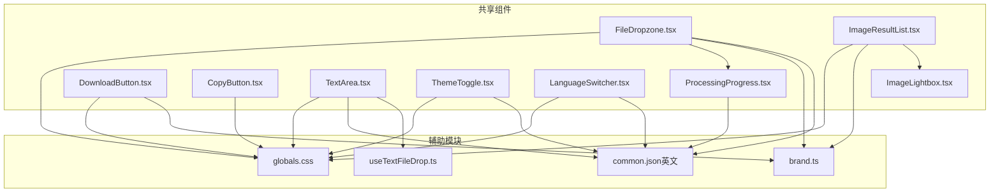

图表来源
- [FileDropzone.tsx:1-144](file://src/components/shared/FileDropzone.tsx#L1-L144)
- [ImageResultList.tsx:1-141](file://src/components/shared/ImageResultList.tsx#L1-L141)
- [ProcessingProgress.tsx:1-47](file://src/components/shared/ProcessingProgress.tsx#L1-L47)
- [DownloadButton.tsx:1-54](file://src/components/shared/DownloadButton.tsx#L1-L54)
- [CopyButton.tsx:1-57](file://src/components/shared/CopyButton.tsx#L1-L57)
- [TextArea.tsx:1-74](file://src/components/shared/TextArea.tsx#L1-L74)
- [ThemeToggle.tsx:1-36](file://src/components/shared/ThemeToggle.tsx#L1-L36)
- [LanguageSwitcher.tsx:1-74](file://src/components/shared/LanguageSwitcher.tsx#L1-L74)
- [ImageLightbox.tsx:1-60](file://src/components/shared/ImageLightbox.tsx#L1-L60)
- [brand.ts:1-7](file://src/lib/brand.ts#L1-L7)
- [useTextFileDrop.ts:1-75](file://src/hooks/useTextFileDrop.ts#L1-L75)
- [common.json（英文）:1-508](file://messages/en/common.json#L1-L508)
- [globals.css:1-128](file://src/app/globals.css#L1-L128)

章节来源
- [FileDropzone.tsx:1-144](file://src/components/shared/FileDropzone.tsx#L1-L144)
- [ImageResultList.tsx:1-141](file://src/components/shared/ImageResultList.tsx#L1-L141)
- [ProcessingProgress.tsx:1-47](file://src/components/shared/ProcessingProgress.tsx#L1-L47)
- [DownloadButton.tsx:1-54](file://src/components/shared/DownloadButton.tsx#L1-L54)
- [CopyButton.tsx:1-57](file://src/components/shared/CopyButton.tsx#L1-L57)
- [TextArea.tsx:1-74](file://src/components/shared/TextArea.tsx#L1-L74)
- [ThemeToggle.tsx:1-36](file://src/components/shared/ThemeToggle.tsx#L1-L36)
- [LanguageSwitcher.tsx:1-74](file://src/components/shared/LanguageSwitcher.tsx#L1-L74)
- [ImageLightbox.tsx:1-60](file://src/components/shared/ImageLightbox.tsx#L1-L60)
- [brand.ts:1-7](file://src/lib/brand.ts#L1-L7)
- [useTextFileDrop.ts:1-75](file://src/hooks/useTextFileDrop.ts#L1-L75)
- [common.json（英文）:1-508](file://messages/en/common.json#L1-L508)
- [globals.css:1-128](file://src/app/globals.css#L1-L128)

## 核心组件
- 文件拖拽组件（FileDropzone）
  - 设计理念：提供“拖放即传”的直观入口，结合视觉高亮与隐私提示，确保用户在本地处理的前提下完成文件上传。
  - 关键能力：拖拽区域高亮、文件类型过滤（accept）、大小限制（maxSize）、多文件支持（multiple）、统计埋点（analytics）。
- 结果展示组件（ImageResultList）
  - 设计理念：以网格卡片形式展示处理后的图像结果，支持缩略图点击预览、移除单个结果、批量下载。
  - 关键能力：Blob URL 缓存与回收、预览弹层（ImageLightbox）、品牌命名下载、元信息展示。
- 进度指示器（ProcessingProgress）
  - 设计理念：清晰传达处理状态，支持确定性进度与不确定性动画，提升用户耐心与预期管理。
  - 关键能力：确定性进度条（0–100）、百分比显示、无限循环动画、可定制标签。
- 下载按钮（DownloadButton）
  - 设计理念：统一下载入口，自动处理 Blob/URL 生命周期，增强品牌识别与埋点。
  - 关键能力：Blob/URL 自动创建与回收、品牌文件名、可选埋点。
- 复制按钮（CopyButton）
  - 设计理念：一键复制文本到剪贴板，提供即时反馈与埋点。
  - 关键能力：Clipboard API、成功态图标与文案切换、2 秒自动复位。
- 文本区域（TextArea）
  - 设计理念：在富文本输入基础上集成“拖拽文本文件”能力，兼顾可用性与隐私。
  - 关键能力：拖拽高亮、占位提示、字数统计、文件拖入读取（useTextFileDrop）。
- 主题切换器（ThemeToggle）
  - 设计理念：三态切换（浅色/深色/系统），即时生效并记录变更。
  - 关键能力：next-themes 集成、无障碍标签、埋点。
- 语言切换器（LanguageSwitcher）
  - 设计理念：下拉选择语言，支持点击外部关闭，持久化到本地存储。
  - 关键能力：路由跳转、事件监听、无障碍标签、埋点。

章节来源
- [FileDropzone.tsx:9-17](file://src/components/shared/FileDropzone.tsx#L9-L17)
- [ImageResultList.tsx:10-19](file://src/components/shared/ImageResultList.tsx#L10-L19)
- [ProcessingProgress.tsx:6-12](file://src/components/shared/ProcessingProgress.tsx#L6-L12)
- [DownloadButton.tsx:10-16](file://src/components/shared/DownloadButton.tsx#L10-L16)
- [CopyButton.tsx:9-19](file://src/components/shared/CopyButton.tsx#L9-L19)
- [TextArea.tsx:11-15](file://src/components/shared/TextArea.tsx#L11-L15)
- [ThemeToggle.tsx:9-35](file://src/components/shared/ThemeToggle.tsx#L9-L35)
- [LanguageSwitcher.tsx:11-38](file://src/components/shared/LanguageSwitcher.tsx#L11-L38)

## 架构总览
共享组件围绕“本地处理、隐私优先”的设计原则构建，通过统一的样式变量、动画与无障碍标签，形成一致的交互体验。组件间协作体现在：
- FileDropzone 与 ProcessingProgress：前者负责收集文件，后者负责展示处理阶段。
- ImageResultList 与 ImageLightbox：前者展示结果，后者提供全屏预览。
- DownloadButton 与 Brand 命名：统一输出文件名前缀。
- TextArea 与 useTextFileDrop：前者提供 UI，后者提供拖拽读取能力。
- ThemeToggle 与 LanguageSwitcher：前者控制外观，后者控制语言。

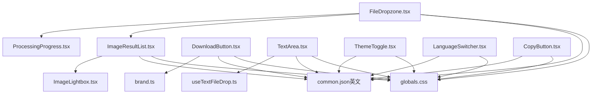

图表来源
- [FileDropzone.tsx:1-144](file://src/components/shared/FileDropzone.tsx#L1-L144)
- [ImageResultList.tsx:1-141](file://src/components/shared/ImageResultList.tsx#L1-L141)
- [ProcessingProgress.tsx:1-47](file://src/components/shared/ProcessingProgress.tsx#L1-L47)
- [DownloadButton.tsx:1-54](file://src/components/shared/DownloadButton.tsx#L1-L54)
- [CopyButton.tsx:1-57](file://src/components/shared/CopyButton.tsx#L1-L57)
- [TextArea.tsx:1-74](file://src/components/shared/TextArea.tsx#L1-L74)
- [ThemeToggle.tsx:1-36](file://src/components/shared/ThemeToggle.tsx#L1-L36)
- [LanguageSwitcher.tsx:1-74](file://src/components/shared/LanguageSwitcher.tsx#L1-L74)
- [ImageLightbox.tsx:1-60](file://src/components/shared/ImageLightbox.tsx#L1-L60)
- [brand.ts:1-7](file://src/lib/brand.ts#L1-L7)
- [useTextFileDrop.ts:1-75](file://src/hooks/useTextFileDrop.ts#L1-L75)
- [common.json（英文）:1-508](file://messages/en/common.json#L1-L508)
- [globals.css:1-128](file://src/app/globals.css#L1-L128)

## 详细组件分析

### 文件拖拽组件（FileDropzone）
- 设计要点
  - 拖拽区域视觉反馈：拖入时高亮边框、背景高光、发光阴影；离开或释放后恢复常态。
  - 文件类型与大小约束：通过 accept 与 maxSize 过滤，超出限制的文件会被忽略。
  - 多文件支持：multiple=true 时允许一次选择多个文件。
  - 隐私提示：强调“本地处理、数据不出站”，提升用户信任。
  - 埋点：上传事件包含工具 slug、分类、文件类型与数量。
- 数据与状态
  - props：accept、multiple、onFiles、maxSize、className、analyticsSlug、analyticsCategory。
  - 内部状态：dragging（布尔）。
  - 工具函数：formatSize、formatAccept（用于人性化展示）。
- 渲染与交互
  - 区域点击触发隐藏的 <input type="file">，同时支持拖拽释放直接读取。
  - 通过 e.dataTransfer.files 获取文件列表，过滤后调用 onFiles 回调。
- 动画与样式
  - 使用 CSS 变量与 Tailwind 类组合实现高亮与发光效果。
  - 支持无障碍标签与键盘交互。
- 错误处理
  - 忽略空文件列表；对不满足条件的文件静默过滤。
- 性能建议
  - 对大文件建议设置合理 maxSize，避免内存压力。
  - 将 onFiles 中的后续处理（如压缩/转换）放入异步流程，避免阻塞 UI。

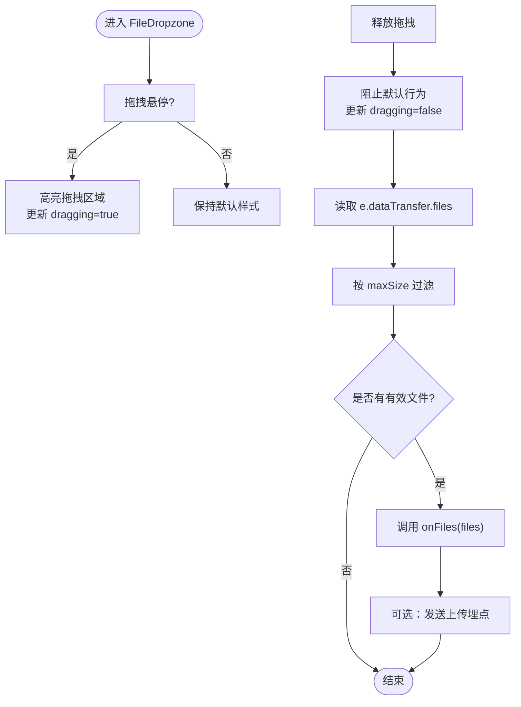

图表来源
- [FileDropzone.tsx:55-76](file://src/components/shared/FileDropzone.tsx#L55-L76)

章节来源
- [FileDropzone.tsx:9-17](file://src/components/shared/FileDropzone.tsx#L9-L17)
- [FileDropzone.tsx:19-40](file://src/components/shared/FileDropzone.tsx#L19-L40)
- [FileDropzone.tsx:55-76](file://src/components/shared/FileDropzone.tsx#L55-L76)
- [FileDropzone.tsx:78-143](file://src/components/shared/FileDropzone.tsx#L78-L143)
- [common.json（英文）:21-33](file://messages/en/common.json#L21-L33)
- [brand.ts:3-6](file://src/lib/brand.ts#L3-L6)
- [globals.css:33-38](file://src/app/globals.css#L33-L38)

### 结果展示组件（ImageResultList）
- 设计要点
  - 卡片网格布局，每项包含缩略图、删除按钮、文件名与可选元信息、下载按钮。
  - 点击缩略图打开 ImageLightbox 弹层，Esc 键关闭。
  - 删除时同步维护预览索引，避免越界。
- 数据结构
  - ImageResultItem：包含 blob、filename、可选 meta。
  - props：results（数组）、onRemove（回调）。
- 渲染与交互
  - 使用 useMemo 与 useRef 维护 Blob→URL 的缓存映射，新增结果创建 URL，移除结果撤销 URL。
  - handleDownload 调用品牌命名策略生成文件名并触发下载。
  - handleRemove 同步更新预览索引，再调用父级回调。
- 错误处理
  - URL 查找失败时回退为空字符串，避免崩溃。
- 性能建议
  - 大量结果时考虑虚拟滚动或分页加载。
  - 控制缩略图尺寸与懒加载策略。

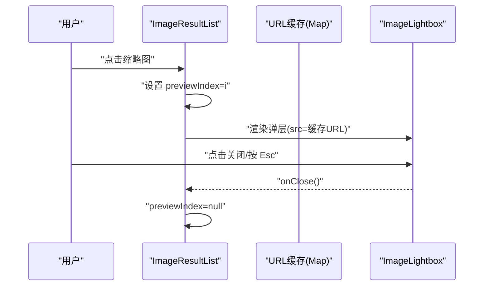

图表来源
- [ImageResultList.tsx:21-76](file://src/components/shared/ImageResultList.tsx#L21-L76)
- [ImageResultList.tsx:131-137](file://src/components/shared/ImageResultList.tsx#L131-L137)
- [ImageLightbox.tsx:13-31](file://src/components/shared/ImageLightbox.tsx#L13-L31)

章节来源
- [ImageResultList.tsx:10-19](file://src/components/shared/ImageResultList.tsx#L10-L19)
- [ImageResultList.tsx:21-76](file://src/components/shared/ImageResultList.tsx#L21-L76)
- [ImageResultList.tsx:78-140](file://src/components/shared/ImageResultList.tsx#L78-L140)
- [ImageLightbox.tsx:13-31](file://src/components/shared/ImageLightbox.tsx#L13-L31)
- [brand.ts:3-6](file://src/lib/brand.ts#L3-L6)

### 进度指示器（ProcessingProgress）
- 设计要点
  - 支持确定性进度（progress 0–100）与不确定性动画（无 progress）。
  - 自定义标签覆盖默认文案，便于国际化。
- 数据与状态
  - props：progress（可选）、label（可选）、className。
  - 内部状态：根据是否传入 progress 判断是否为确定性。
- 渲染与交互
  - 确定性：宽度随进度变化，带过渡动画。
  - 不确定性：使用 CSS 动画在容器内移动。
- 动画与样式
  - 使用 CSS 变量与动画帧定义（globals.css）实现平滑过渡与脉冲效果。

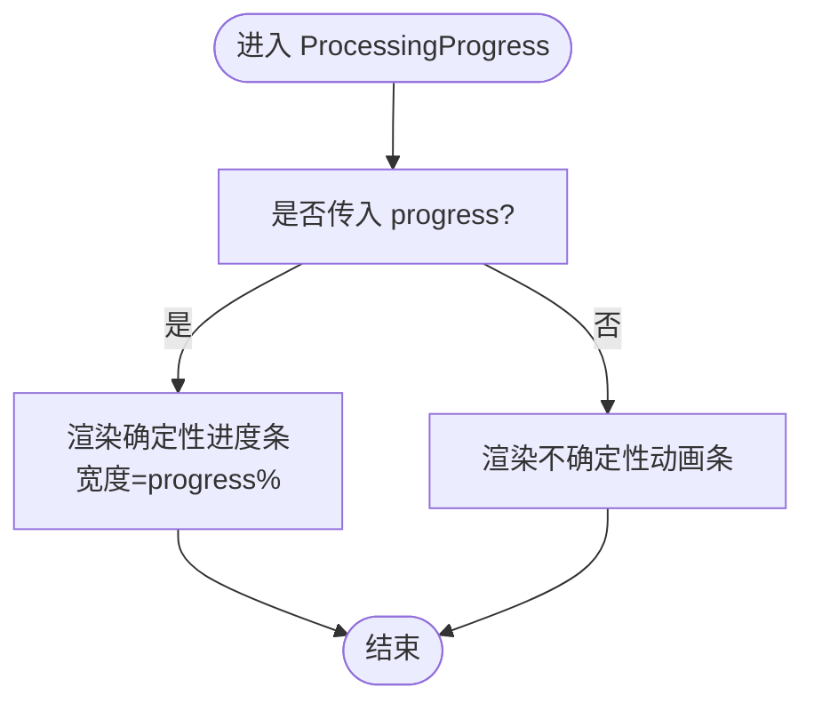

图表来源
- [ProcessingProgress.tsx:14-45](file://src/components/shared/ProcessingProgress.tsx#L14-L45)
- [globals.css:65-68](file://src/app/globals.css#L65-L68)

章节来源
- [ProcessingProgress.tsx:6-12](file://src/components/shared/ProcessingProgress.tsx#L6-L12)
- [ProcessingProgress.tsx:14-45](file://src/components/shared/ProcessingProgress.tsx#L14-L45)
- [common.json（英文）](file://messages/en/common.json#L20)

### 下载按钮（DownloadButton）
- 设计要点
  - 统一下载入口，自动处理 Blob/URL 生命周期，避免内存泄漏。
  - 品牌命名策略保证输出文件名一致性。
  - 可选埋点记录下载事件。
- 数据与状态
  - props：data（Blob 或 data URL）、filename、className、analyticsSlug、analyticsCategory。
- 实现机制
  - 若 data 为 Blob，创建临时 URL；若为字符串则直接使用。
  - 触发 a.click() 下载，结束后撤销临时 URL。
  - 发送埋点（含文件扩展名）。
- 用户体验优化
  - 立即反馈下载动作，避免二次点击。
  - 品牌前缀提升识别度。

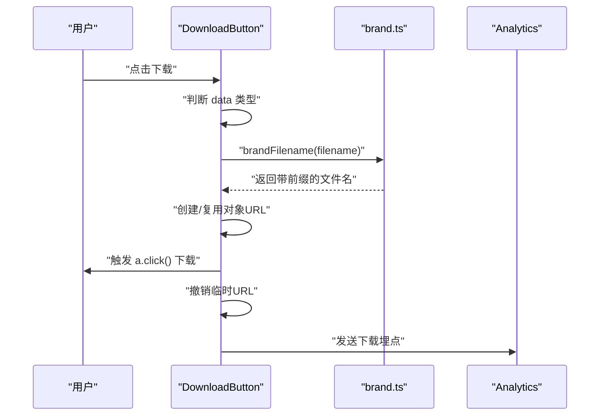

图表来源
- [DownloadButton.tsx:18-45](file://src/components/shared/DownloadButton.tsx#L18-L45)
- [brand.ts:3-6](file://src/lib/brand.ts#L3-L6)

章节来源
- [DownloadButton.tsx:10-16](file://src/components/shared/DownloadButton.tsx#L10-L16)
- [DownloadButton.tsx:18-45](file://src/components/shared/DownloadButton.tsx#L18-L45)
- [brand.ts:3-6](file://src/lib/brand.ts#L3-L6)

### 复制按钮（CopyButton）
- 设计要点
  - 一键复制文本到剪贴板，成功后图标与文案切换并自动复位。
  - 可选埋点记录复制事件。
- 数据与状态
  - props：text、className、analyticsSlug、analyticsCategory。
  - 内部状态：copied（布尔）。
- 实现机制
  - Clipboard API 写入文本，异常时静默忽略。
  - 2 秒后重置 copied 状态。
  - 发送埋点（含工具分类）。
- 用户体验优化
  - 成功态使用对勾图标与“已复制”文案，提升确认感。

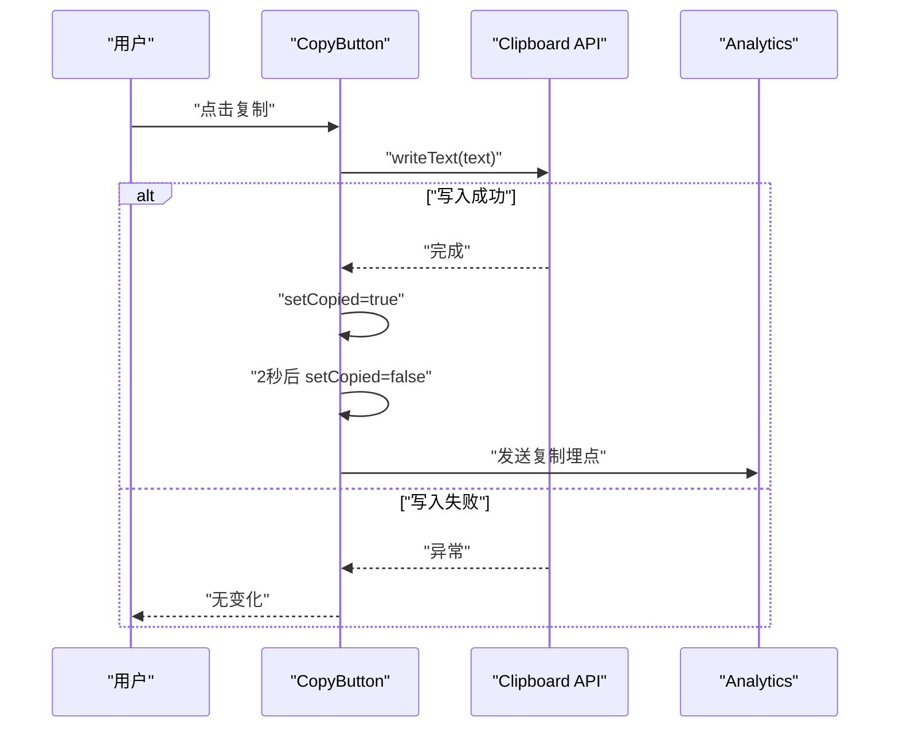

图表来源
- [CopyButton.tsx:9-34](file://src/components/shared/CopyButton.tsx#L9-L34)

章节来源
- [CopyButton.tsx:9-19](file://src/components/shared/CopyButton.tsx#L9-L19)
- [CopyButton.tsx:23-34](file://src/components/shared/CopyButton.tsx#L23-L34)

### 文本区域（TextArea）
- 设计要点
  - 在 textarea 基础上增加“拖拽文本文件”能力，支持多种文本格式。
  - 提供字数统计与占位提示，改善输入体验。
- 数据与状态
  - props：继承原生 textarea 属性，新增 showCount、onFileDrop、acceptFileTypes。
  - 内部状态：isDragging（由 useTextFileDrop 返回）。
- 渲染与交互
  - 当启用 onFileDrop 时，将 useTextFileDrop 返回的 dragHandlers 应用于外层容器。
  - 拖拽悬停时高亮边框并显示“拖放文件”提示。
  - 空值且未拖拽时显示“支持拖拽文件”的占位提示。
  - 字数统计可选显示。
- 动画与样式
  - 拖拽高亮使用半透明背景与模糊效果，避免遮挡内容。
- 错误处理
  - 文件读取异常静默忽略，不影响主输入。
- 性能建议
  - 对超大文本文件建议限制 maxSize 并采用流式处理策略。

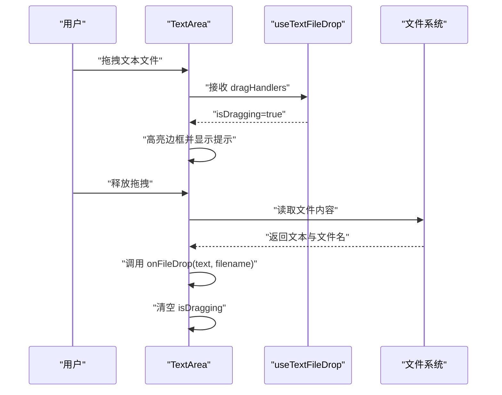

图表来源
- [TextArea.tsx:17-72](file://src/components/shared/TextArea.tsx#L17-L72)
- [useTextFileDrop.ts:12-74](file://src/hooks/useTextFileDrop.ts#L12-L74)

章节来源
- [TextArea.tsx:11-15](file://src/components/shared/TextArea.tsx#L11-L15)
- [TextArea.tsx:17-72](file://src/components/shared/TextArea.tsx#L17-L72)
- [useTextFileDrop.ts:12-74](file://src/hooks/useTextFileDrop.ts#L12-L74)
- [common.json（英文）:64-66](file://messages/en/common.json#L64-L66)

### 主题切换器（ThemeToggle）
- 设计要点
  - 三态切换：light → dark → system → light，循环切换。
  - 图标随当前主题变化，提供无障碍标签。
  - 切换后发送埋点，便于分析用户偏好。
- 数据与状态
  - props：无。
  - 内部状态：mounted（避免水合不一致）、theme（来自 next-themes）。
- 实现机制
  - 使用 useTheme 获取/设置 theme。
  - mounted 保护 SSR 客户端渲染期间的空占位。
  - 发送埋点包含目标主题。
- 用户体验优化
  - 圆角按钮、悬停高亮、居中图标，符合移动端操作习惯。

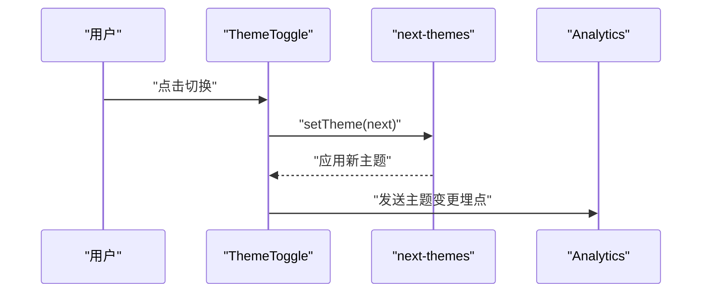

图表来源
- [ThemeToggle.tsx:9-35](file://src/components/shared/ThemeToggle.tsx#L9-L35)

章节来源
- [ThemeToggle.tsx:9-35](file://src/components/shared/ThemeToggle.tsx#L9-L35)
- [common.json（英文）](file://messages/en/common.json#L41)

### 语言切换器（LanguageSwitcher）
- 设计要点
  - 下拉菜单展示所有可用语言，支持点击外部区域关闭。
  - 切换后持久化到 localStorage，并通过路由跳转到对应语言路径。
  - 发送埋点记录语言变更（from/to）。
- 数据与状态
  - props：dropdownDirection（up/down，默认 down）。
  - 内部状态：open（布尔）、ref（容器引用）。
- 实现机制
  - 使用 useLocale/useRouter/usePathname 获取上下文并导航。
  - 监听文档级 mousedown 事件，点击外部关闭。
  - switchLocale 写入 localStorage 并 replace 路由。
- 用户体验优化
  - 下拉列表支持键盘导航与无障碍标签。
  - 滚动条与定位方向可配置（向上/向下）。

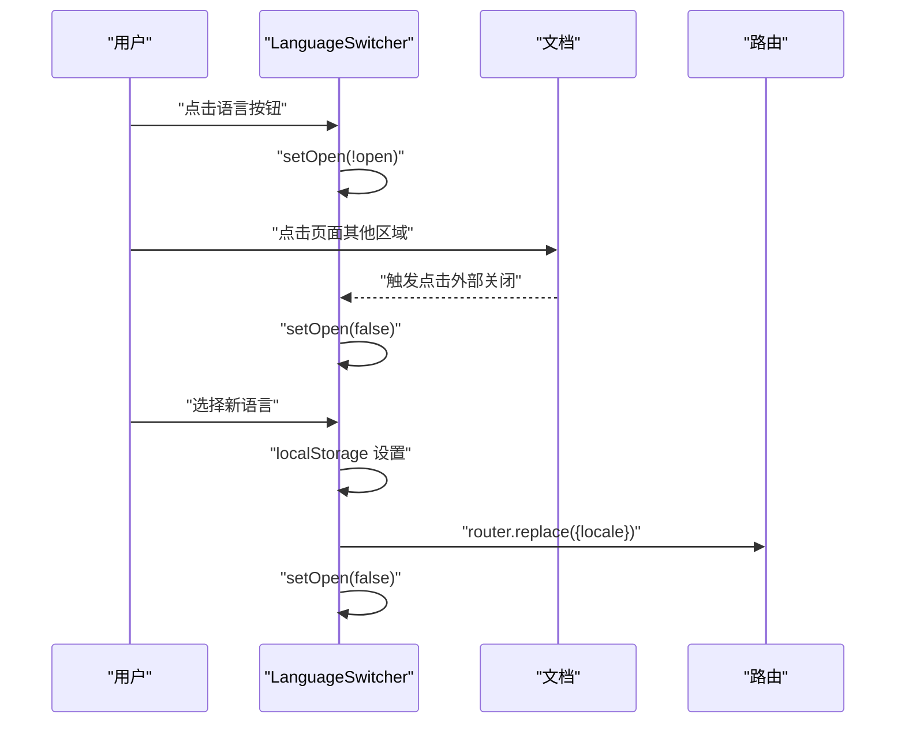

图表来源
- [LanguageSwitcher.tsx:15-72](file://src/components/shared/LanguageSwitcher.tsx#L15-L72)

章节来源
- [LanguageSwitcher.tsx:11-13](file://src/components/shared/LanguageSwitcher.tsx#L11-L13)
- [LanguageSwitcher.tsx:15-72](file://src/components/shared/LanguageSwitcher.tsx#L15-L72)

## 依赖关系分析
- 组件内聚与耦合
  - FileDropzone 与 ProcessingProgress：前者负责输入，后者负责状态可视化，低耦合。
  - ImageResultList 与 ImageLightbox：结果与预览解耦，通过 props 传递 URL 与回调。
  - DownloadButton 与 Brand：下载侧仅依赖命名策略，职责单一。
  - TextArea 与 useTextFileDrop：UI 与逻辑分离，便于测试与复用。
  - ThemeToggle/LanguageSwitcher：与路由/主题库耦合，但对外暴露简单接口。
- 外部依赖
  - next-intl：国际化文案与翻译。
  - next-themes：主题状态管理。
  - lucide-react：图标库。
  - Clipboard API：复制按钮。
  - Analytics：埋点追踪。
- 潜在循环依赖
  - 未发现直接循环依赖；各组件通过 props 与回调通信，遵循单向数据流。

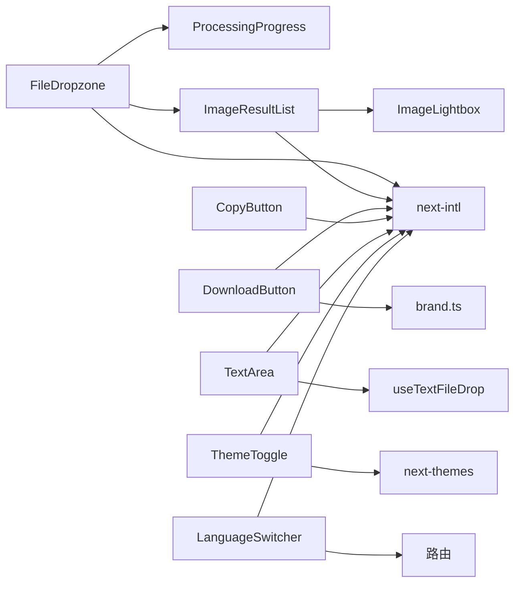

图表来源
- [FileDropzone.tsx:1-144](file://src/components/shared/FileDropzone.tsx#L1-L144)
- [ImageResultList.tsx:1-141](file://src/components/shared/ImageResultList.tsx#L1-L141)
- [ProcessingProgress.tsx:1-47](file://src/components/shared/ProcessingProgress.tsx#L1-L47)
- [DownloadButton.tsx:1-54](file://src/components/shared/DownloadButton.tsx#L1-L54)
- [CopyButton.tsx:1-57](file://src/components/shared/CopyButton.tsx#L1-L57)
- [TextArea.tsx:1-74](file://src/components/shared/TextArea.tsx#L1-L74)
- [ThemeToggle.tsx:1-36](file://src/components/shared/ThemeToggle.tsx#L1-L36)
- [LanguageSwitcher.tsx:1-74](file://src/components/shared/LanguageSwitcher.tsx#L1-L74)
- [ImageLightbox.tsx:1-60](file://src/components/shared/ImageLightbox.tsx#L1-L60)
- [brand.ts:1-7](file://src/lib/brand.ts#L1-L7)
- [useTextFileDrop.ts:1-75](file://src/hooks/useTextFileDrop.ts#L1-L75)
- [common.json（英文）:1-508](file://messages/en/common.json#L1-L508)

章节来源
- [FileDropzone.tsx:1-144](file://src/components/shared/FileDropzone.tsx#L1-L144)
- [ImageResultList.tsx:1-141](file://src/components/shared/ImageResultList.tsx#L1-L141)
- [ProcessingProgress.tsx:1-47](file://src/components/shared/ProcessingProgress.tsx#L1-L47)
- [DownloadButton.tsx:1-54](file://src/components/shared/DownloadButton.tsx#L1-L54)
- [CopyButton.tsx:1-57](file://src/components/shared/CopyButton.tsx#L1-L57)
- [TextArea.tsx:1-74](file://src/components/shared/TextArea.tsx#L1-L74)
- [ThemeToggle.tsx:1-36](file://src/components/shared/ThemeToggle.tsx#L1-L36)
- [LanguageSwitcher.tsx:1-74](file://src/components/shared/LanguageSwitcher.tsx#L1-L74)
- [ImageLightbox.tsx:1-60](file://src/components/shared/ImageLightbox.tsx#L1-L60)
- [brand.ts:1-7](file://src/lib/brand.ts#L1-L7)
- [useTextFileDrop.ts:1-75](file://src/hooks/useTextFileDrop.ts#L1-L75)
- [common.json（英文）:1-508](file://messages/en/common.json#L1-L508)

## 性能考量
- 文件处理
  - FileDropzone：建议设置合理的 maxSize，避免一次性加载过多文件导致内存峰值过高。
  - ImageResultList：Blob URL 缓存与撤销需及时清理，避免内存泄漏；对大量结果建议虚拟化。
- UI 动画
  - ProcessingProgress 的确定性进度使用过渡动画，注意在高频更新场景下避免过度重排。
  - globals.css 中的动画帧在高刷新率设备上更顺滑，但在低性能设备上可考虑减少动画复杂度。
- 网络与离线
  - DownloadButton 与 CopyButton 为纯前端操作，无需网络；ThemeToggle/LanguageSwitcher 依赖路由与本地存储，适合离线使用。
- 可访问性
  - 所有按钮均提供 aria-label，确保屏幕阅读器友好。
  - ImageLightbox 支持 Esc 关闭与焦点管理，提升键盘可达性。

## 故障排查指南
- 拖拽无效
  - 检查是否正确传递 onFiles 与 accept/maxSize；确认浏览器支持 File API。
  - 确认未被父级事件拦截（e.stopPropagation）。
- 下载失败
  - 确认 data 类型（Blob 或 data URL）；若为 Blob，确保在下载后撤销临时 URL。
  - 检查品牌命名策略是否正确生成文件名。
- 复制失败
  - 确保运行环境支持 Clipboard API（HTTPS 或 localhost）；异常时会静默忽略。
- 预览不显示
  - 检查 Blob 是否存在对应的 URL 缓存；确认 previewIndex 未越界。
- 主题/语言切换无响应
  - 确认 next-themes 与路由配置正确；检查埋点事件是否触发。
- 文本拖拽不生效
  - 确认 onFileDrop 已传入；检查 useTextFileDrop 的 accept 与 maxSize 配置。

章节来源
- [FileDropzone.tsx:55-76](file://src/components/shared/FileDropzone.tsx#L55-L76)
- [DownloadButton.tsx:27-45](file://src/components/shared/DownloadButton.tsx#L27-L45)
- [CopyButton.tsx:23-34](file://src/components/shared/CopyButton.tsx#L23-L34)
- [ImageResultList.tsx:26-50](file://src/components/shared/ImageResultList.tsx#L26-L50)
- [ThemeToggle.tsx](file://src/components/shared/ThemeToggle.tsx#L28)
- [LanguageSwitcher.tsx:33-38](file://src/components/shared/LanguageSwitcher.tsx#L33-L38)
- [useTextFileDrop.ts:47-68](file://src/hooks/useTextFileDrop.ts#L47-L68)

## 结论
共享组件围绕“隐私优先、本地处理、一致体验”的核心理念构建，通过明确的职责划分、简洁的 props 接口与完善的国际化与无障碍支持，实现了高度可复用与可维护的 UI 基础设施。建议在业务工具中统一引入这些组件，以降低开发成本并提升用户体验的一致性。

## 附录
- 组件属性与事件一览（摘要）
  - FileDropzone
    - 属性：accept、multiple、onFiles、maxSize、className、analyticsSlug、analyticsCategory
    - 事件：拖拽进入/离开/释放、点击触发文件选择
  - ImageResultList
    - 属性：results、onRemove
    - 事件：点击缩略图预览、点击删除、点击下载
  - ProcessingProgress
    - 属性：progress（可选）、label（可选）、className
  - DownloadButton
    - 属性：data（Blob 或 data URL）、filename、className、analyticsSlug、analyticsCategory
  - CopyButton
    - 属性：text、className、analyticsSlug、analyticsCategory
  - TextArea
    - 属性：继承 textarea，新增 showCount、onFileDrop、acceptFileTypes
  - ThemeToggle
    - 属性：无
  - LanguageSwitcher
    - 属性：dropdownDirection（up/down）

章节来源
- [FileDropzone.tsx:9-17](file://src/components/shared/FileDropzone.tsx#L9-L17)
- [ImageResultList.tsx:16-19](file://src/components/shared/ImageResultList.tsx#L16-L19)
- [ProcessingProgress.tsx:6-12](file://src/components/shared/ProcessingProgress.tsx#L6-L12)
- [DownloadButton.tsx:10-16](file://src/components/shared/DownloadButton.tsx#L10-L16)
- [CopyButton.tsx:9-19](file://src/components/shared/CopyButton.tsx#L9-L19)
- [TextArea.tsx:11-15](file://src/components/shared/TextArea.tsx#L11-L15)
- [ThemeToggle.tsx:9-10](file://src/components/shared/ThemeToggle.tsx#L9-L10)
- [LanguageSwitcher.tsx:11-13](file://src/components/shared/LanguageSwitcher.tsx#L11-L13)