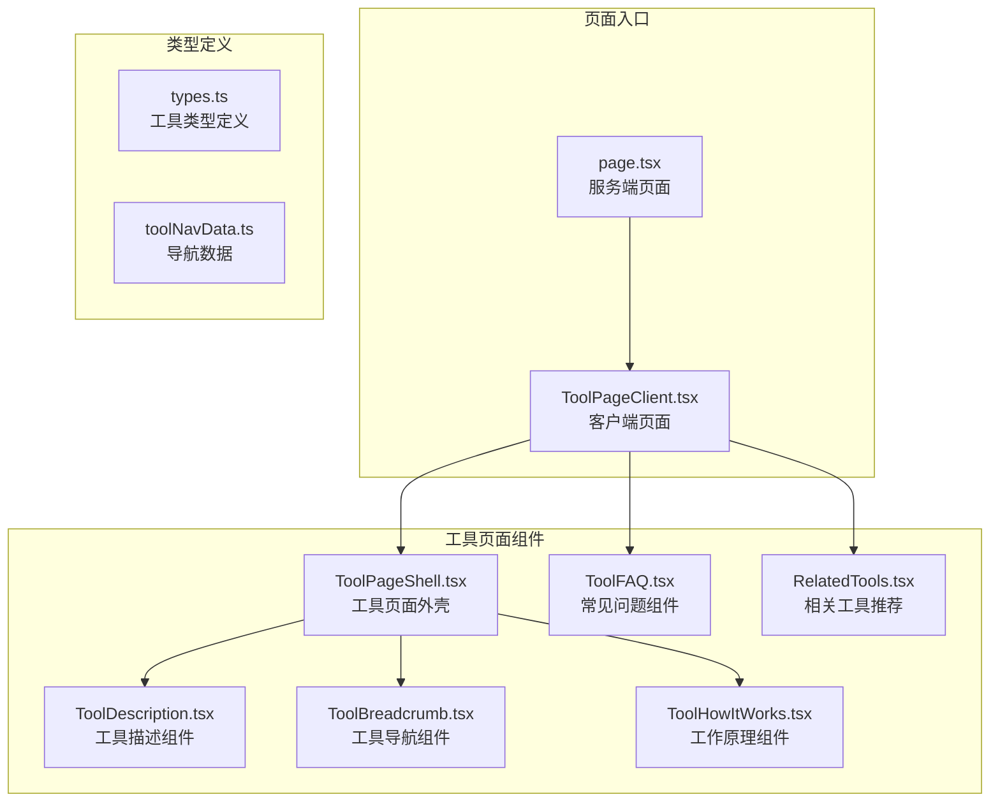
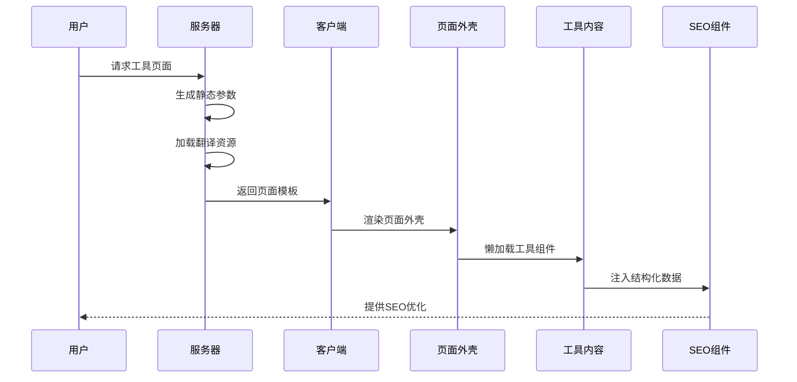
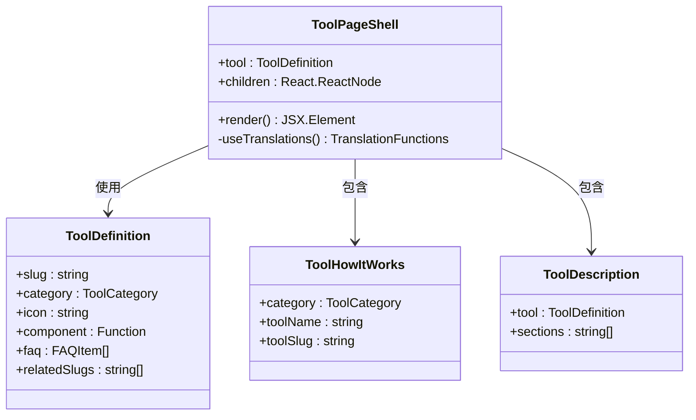
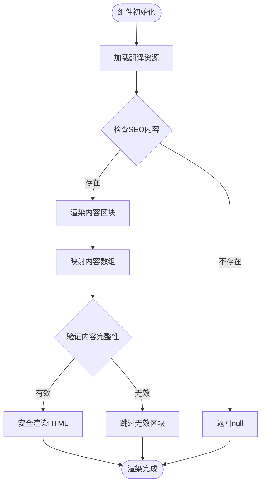
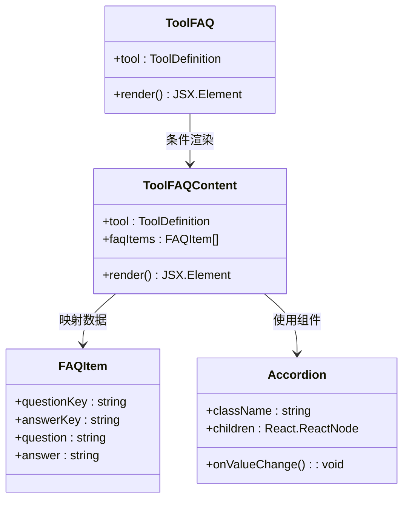
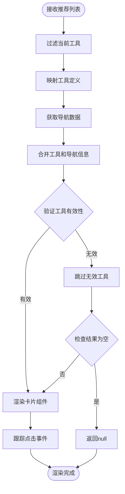
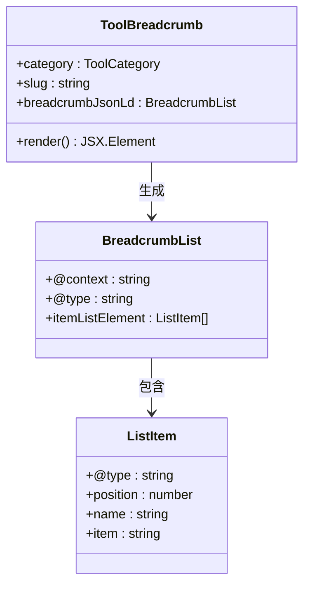
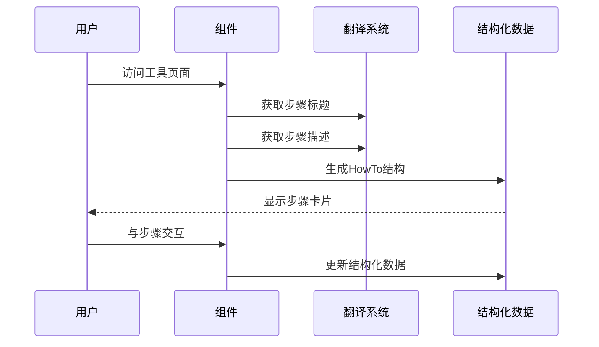
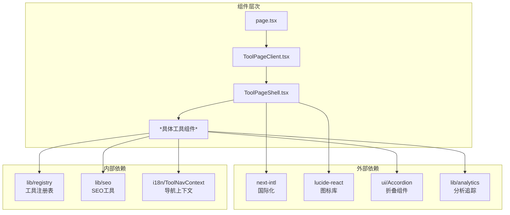

# 工具页面组件

<cite>
**本文档引用的文件**
- [ToolPageShell.tsx](file://src/components/tool/ToolPageShell.tsx)
- [ToolDescription.tsx](file://src/components/tool/ToolDescription.tsx)
- [ToolFAQ.tsx](file://src/components/tool/ToolFAQ.tsx)
- [RelatedTools.tsx](file://src/components/tool/RelatedTools.tsx)
- [ToolBreadcrumb.tsx](file://src/components/tool/ToolBreadcrumb.tsx)
- [ToolHowItWorks.tsx](file://src/components/tool/ToolHowItWorks.tsx)
- [ToolPageClient.tsx](file://src/app/[locale]/tools/[category]/[slug]/ToolPageClient.tsx)
- [page.tsx](file://src/app/[locale]/tools/[category]/[slug]/page.tsx)
- [types.ts](file://src/lib/registry/types.ts)
- [toolNavData.ts](file://src/lib/i18n/toolNavData.ts)
</cite>

## 目录
1. [简介](#简介)
2. [项目结构](#项目结构)
3. [核心组件](#核心组件)
4. [架构概览](#架构概览)
5. [详细组件分析](#详细组件分析)
6. [依赖分析](#依赖分析)
7. [性能考虑](#性能考虑)
8. [故障排除指南](#故障排除指南)
9. [结论](#结论)

## 简介

PrivaDeck 媒体工具箱的工具页面组件是一套完整的工具页面解决方案，提供了专业的媒体处理工具展示和交互体验。该组件系统采用模块化设计，包含工具页面外壳、内容展示、导航、推荐和FAQ等功能模块，支持多语言国际化和SEO优化。

## 项目结构

工具页面组件位于 `src/components/tool/` 目录下，采用按功能分组的组织方式：



**图表来源**
- [ToolPageShell.tsx:1-54](file://src/components/tool/ToolPageShell.tsx#L1-L54)
- [ToolPageClient.tsx:1-59](file://src/app/[locale]/tools/[category]/[slug]/ToolPageClient.tsx#L1-L59)
- [types.ts:1-22](file://src/lib/registry/types.ts#L1-L22)

**章节来源**
- [ToolPageShell.tsx:1-54](file://src/components/tool/ToolPageShell.tsx#L1-L54)
- [ToolPageClient.tsx:1-59](file://src/app/[locale]/tools/[category]/[slug]/ToolPageClient.tsx#L1-L59)

## 核心组件

### 工具页面外壳 (ToolPageShell)

ToolPageShell 是工具页面的核心容器组件，负责整体布局结构和内容组织。它采用响应式设计，确保在不同设备上的最佳显示效果。

**主要特性：**
- 动态标题和描述渲染
- 本地处理隐私指示器
- 内容区域容器
- 组件组合模式

**配置选项：**
- `tool`: ToolDefinition 类型，包含工具元数据
- `children`: React.ReactNode，工具具体功能组件

**章节来源**
- [ToolPageShell.tsx:10-13](file://src/components/tool/ToolPageShell.tsx#L10-L13)
- [ToolPageShell.tsx:15-52](file://src/components/tool/ToolPageShell.tsx#L15-L52)

### 工具描述组件 (ToolDescription)

ToolDescription 负责渲染工具的详细描述内容，支持Markdown解析和SEO优化。

**核心功能：**
- 多段落内容渲染
- Markdown到HTML转换
- SEO友好的结构化内容
- 国际化内容支持

**数据结构：**
```typescript
interface ToolDescriptionProps {
  tool: { category: string; slug: string };
  sections?: string[]; // 默认: ["intro", "howToUse", "features", "useCases", "privacy"]
}
```

**章节来源**
- [ToolDescription.tsx:7-10](file://src/components/tool/ToolDescription.tsx#L7-L10)
- [ToolDescription.tsx:21-45](file://src/components/tool/ToolDescription.tsx#L21-L45)

## 架构概览

工具页面采用客户端-服务端混合架构，结合了现代React的最佳实践：



**图表来源**
- [page.tsx:33-108](file://src/app/[locale]/tools/[category]/[slug]/page.tsx#L33-L108)
- [ToolPageClient.tsx:29-58](file://src/app/[locale]/tools/[category]/[slug]/ToolPageClient.tsx#L29-L58)

## 详细组件分析

### 工具页面外壳 (ToolPageShell)

ToolPageShell 作为页面的主要容器，实现了以下关键功能：



**图表来源**
- [ToolPageShell.tsx:10-13](file://src/components/tool/ToolPageShell.tsx#L10-L13)
- [types.ts:5-16](file://src/lib/registry/types.ts#L5-L16)

**实现特点：**
- 使用 next-intl 进行国际化
- 条件渲染隐私指示器
- 组件嵌套结构清晰
- 响应式布局设计

**章节来源**
- [ToolPageShell.tsx:15-52](file://src/components/tool/ToolPageShell.tsx#L15-L52)

### 工具描述组件 (ToolDescription)

ToolDescription 实现了动态内容渲染和SEO优化：



**图表来源**
- [ToolDescription.tsx:21-45](file://src/components/tool/ToolDescription.tsx#L21-L45)

**Markdown处理机制：**
- 使用 `dangerouslySetInnerHTML` 进行HTML渲染
- 支持prose样式类进行内容美化
- 防止XSS攻击的安全措施

**章节来源**
- [ToolDescription.tsx:12-19](file://src/components/tool/ToolDescription.tsx#L12-L19)
- [ToolDescription.tsx:21-45](file://src/components/tool/ToolDescription.tsx#L21-L45)

### 常见问题组件 (ToolFAQ)

ToolFAQ 提供了交互式的问答系统：



**图表来源**
- [ToolFAQ.tsx:8-16](file://src/components/tool/ToolFAQ.tsx#L8-L16)
- [ToolFAQ.tsx:18-50](file://src/components/tool/ToolFAQ.tsx#L18-L50)

**折叠逻辑实现：**
- 使用 Accordion 组件实现折叠展开
- 动态事件监听器
- 性能优化的事件处理

**章节来源**
- [ToolFAQ.tsx:18-50](file://src/components/tool/ToolFAQ.tsx#L18-L50)

### 相关工具推荐 (RelatedTools)

RelatedTools 实现了智能的工具推荐算法：



**图表来源**
- [RelatedTools.tsx:22-30](file://src/components/tool/RelatedTools.tsx#L22-L30)
- [RelatedTools.tsx:34-54](file://src/components/tool/RelatedTools.tsx#L34-L54)

**推荐算法特点：**
- 基于工具slug的关联性
- 导航数据预处理
- 性能优化的懒加载
- 事件追踪分析

**章节来源**
- [RelatedTools.tsx:17-55](file://src/components/tool/RelatedTools.tsx#L17-L55)

### 工具导航组件 (ToolBreadcrumb)

ToolBreadcrumb 提供了完整的面包屑导航系统：



**图表来源**
- [ToolBreadcrumb.tsx:23-52](file://src/components/tool/ToolBreadcrumb.tsx#L23-L52)
- [ToolBreadcrumb.tsx:14-77](file://src/components/tool/ToolBreadcrumb.tsx#L14-L77)

**导航生成机制：**
- 动态生成结构化数据
- 多语言支持
- SEO优化的JSON-LD格式

**章节来源**
- [ToolBreadcrumb.tsx:14-77](file://src/components/tool/ToolBreadcrumb.tsx#L14-L77)

### 工作原理组件 (ToolHowItWorks)

ToolHowItWorks 展示了工具的使用步骤：



**图表来源**
- [ToolHowItWorks.tsx:15-57](file://src/components/tool/ToolHowItWorks.tsx#L15-L57)
- [ToolHowItWorks.tsx:59-101](file://src/components/tool/ToolHowItWorks.tsx#L59-L101)

**步骤展示逻辑：**
- 条件渲染工具特定步骤
- 文本和文件处理分类
- 动画效果和视觉引导

**章节来源**
- [ToolHowItWorks.tsx:15-101](file://src/components/tool/ToolHowItWorks.tsx#L15-L101)

## 依赖分析

工具页面组件之间的依赖关系如下：



**图表来源**
- [ToolPageClient.tsx:1-9](file://src/app/[locale]/tools/[category]/[slug]/ToolPageClient.tsx#L1-L9)
- [ToolPageShell.tsx:3-9](file://src/components/tool/ToolPageShell.tsx#L3-L9)

**依赖关系特点：**
- 最小化外部依赖
- 内聚性高，耦合度低
- 支持模块化开发
- 易于测试和维护

**章节来源**
- [ToolPageClient.tsx:1-9](file://src/app/[locale]/tools/[category]/[slug]/ToolPageClient.tsx#L1-L9)
- [ToolPageShell.tsx:3-9](file://src/components/tool/ToolPageShell.tsx#L3-L9)

## 性能考虑

### 懒加载策略

工具页面采用了多层性能优化：

1. **组件懒加载**: 使用 React.lazy 和缓存机制
2. **翻译资源分离**: 按需加载翻译文件
3. **结构化数据预生成**: 服务端生成SEO数据

### 内存优化

- 使用 useMemo 缓存懒加载组件
- 条件渲染减少DOM节点
- 事件委托优化交互性能

### 网络优化

- 预加载FFmpeg资源（视频/音频工具）
- CDN加速静态资源
- 压缩和缓存策略

## 故障排除指南

### 常见问题及解决方案

**问题1: 工具页面不显示内容**
- 检查工具注册表中的组件路径
- 验证翻译文件是否完整
- 确认懒加载组件是否正确导入

**问题2: SEO数据缺失**
- 检查结构化数据生成函数
- 验证JSON-LD格式正确性
- 确认页面元数据生成逻辑

**问题3: 性能问题**
- 分析组件渲染时间
- 检查懒加载缓存机制
- 优化翻译资源加载

**章节来源**
- [page.tsx:46-54](file://src/app/[locale]/tools/[category]/[slug]/page.tsx#L46-L54)
- [ToolPageClient.tsx:33-42](file://src/app/[locale]/tools/[category]/[slug]/ToolPageClient.tsx#L33-L42)

## 结论

PrivaDeck 媒体工具箱的工具页面组件系统展现了现代前端开发的最佳实践。通过模块化设计、国际化支持、SEO优化和性能优化，该系统为用户提供了一致且高效的工具使用体验。

**核心优势：**
- 完整的工具页面解决方案
- 强大的国际化支持
- 优秀的SEO优化
- 良好的性能表现
- 易于扩展和维护

该组件系统为类似的应用程序提供了可复用的架构模式和实现参考，是构建专业工具网站的理想选择。