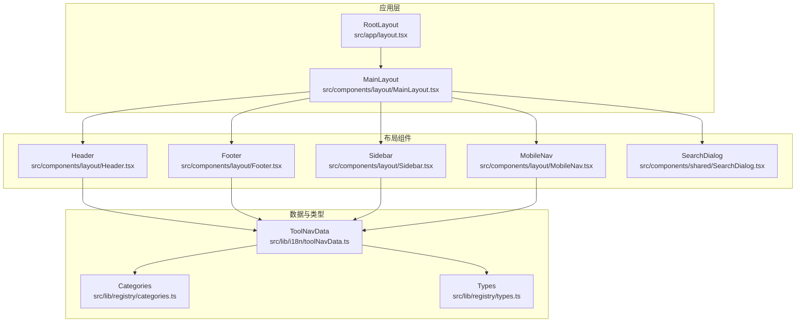
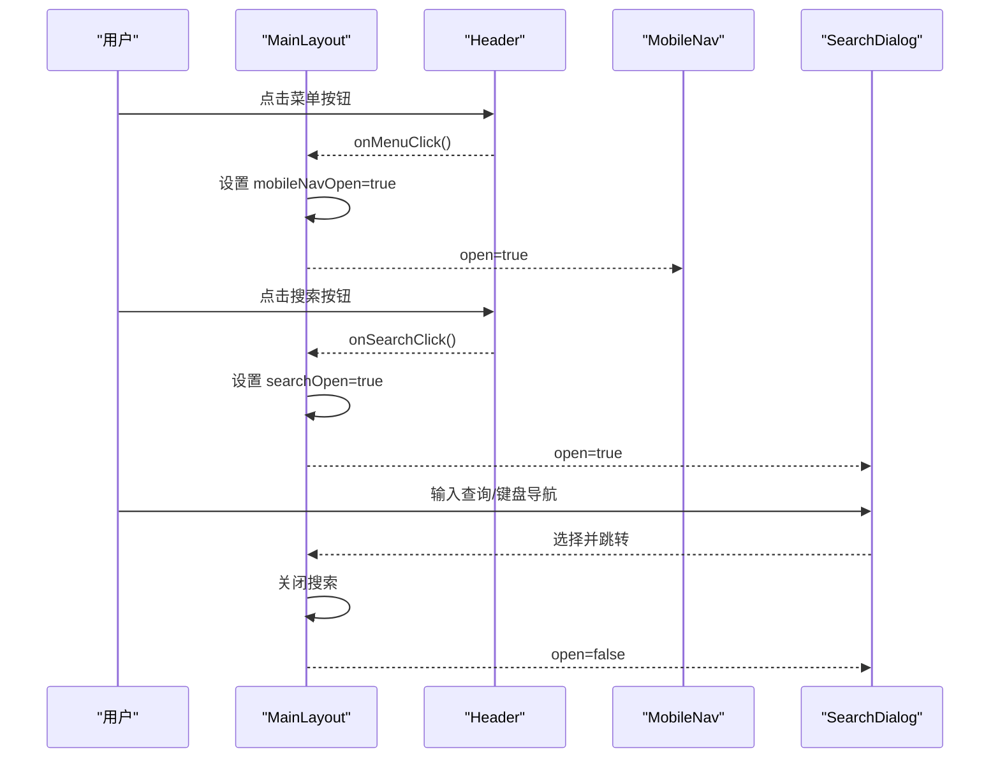
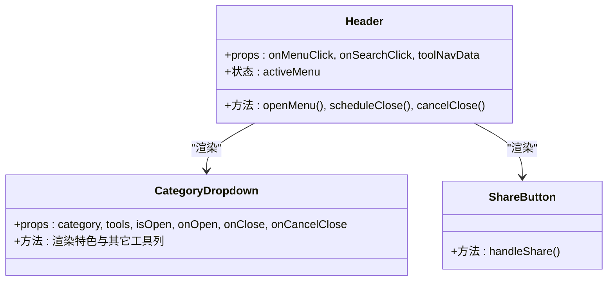
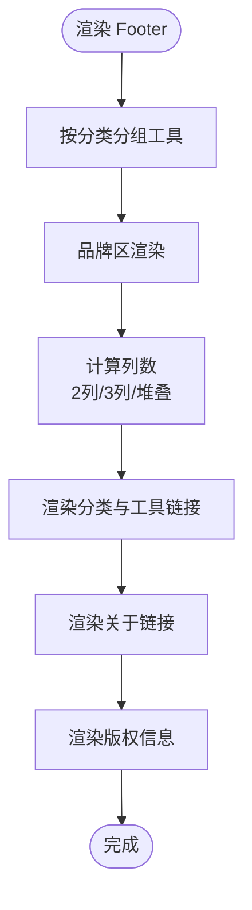
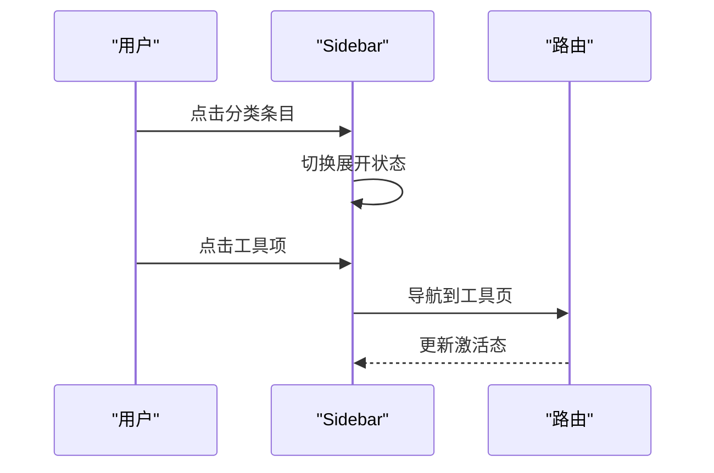
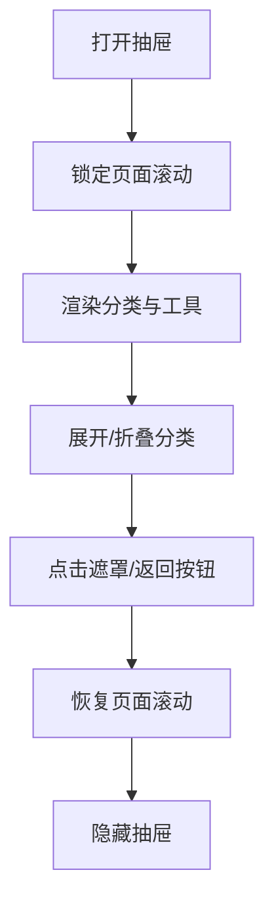
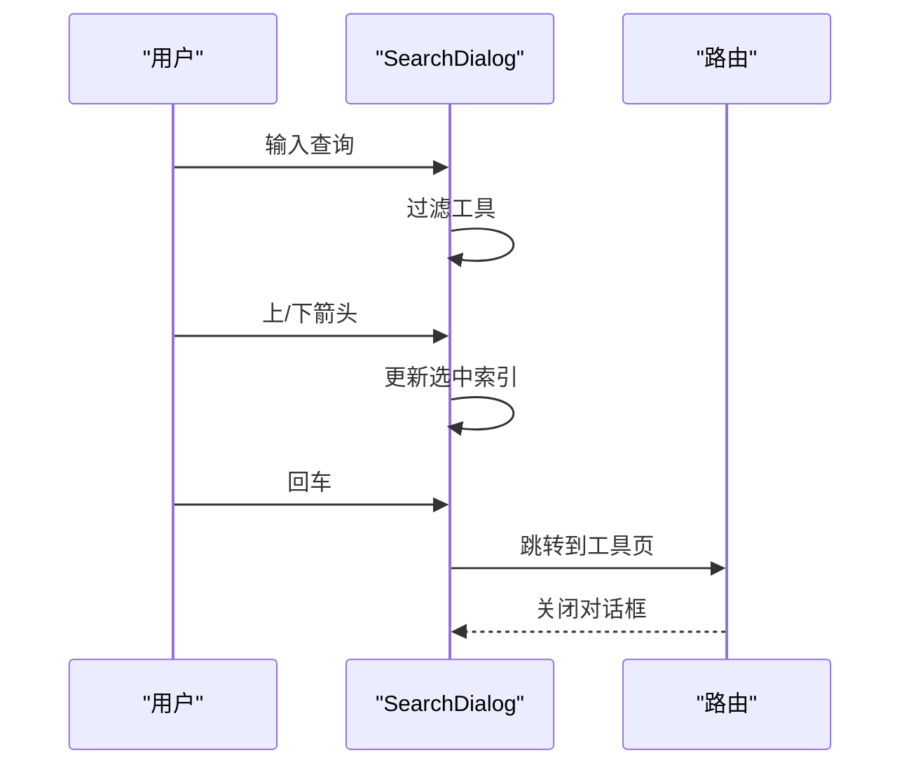
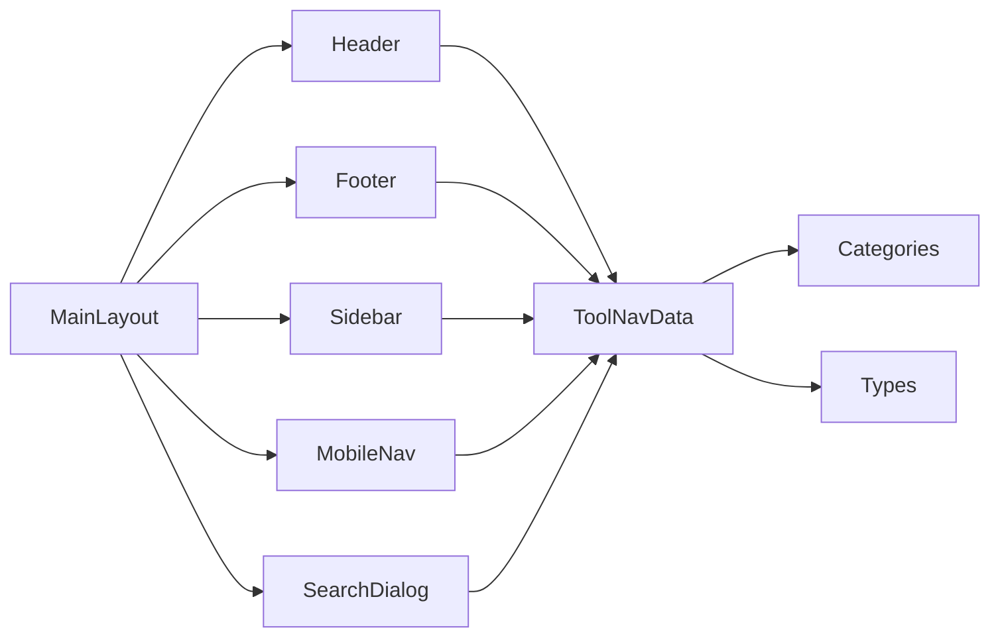

# 布局组件

<cite>
**本文引用的文件**
- [MainLayout.tsx](file://src/components/layout/MainLayout.tsx)
- [Header.tsx](file://src/components/layout/Header.tsx)
- [Footer.tsx](file://src/components/layout/Footer.tsx)
- [Sidebar.tsx](file://src/components/layout/Sidebar.tsx)
- [MobileNav.tsx](file://src/components/layout/MobileNav.tsx)
- [SearchDialog.tsx](file://src/components/shared/SearchDialog.tsx)
- [toolNavData.ts](file://src/lib/i18n/toolNavData.ts)
- [categories.ts](file://src/lib/registry/categories.ts)
- [types.ts](file://src/lib/registry/types.ts)
- [globals.css](file://src/app/globals.css)
- [layout.tsx](file://src/app/layout.tsx)
</cite>

## 目录
1. [简介](#简介)
2. [项目结构](#项目结构)
3. [核心组件](#核心组件)
4. [架构总览](#架构总览)
5. [详细组件分析](#详细组件分析)
6. [依赖分析](#依赖分析)
7. [性能考虑](#性能考虑)
8. [故障排除指南](#故障排除指南)
9. [结论](#结论)
10. [附录](#附录)

## 简介
本文件面向 PrivaDeck 媒体工具箱的布局组件，系统化梳理主布局（MainLayout）、头部（Header）、页脚（Footer）、侧边栏（Sidebar）、移动端导航（MobileNav）与搜索对话框（SearchDialog）的架构、交互与样式实现。重点覆盖：
- 主布局的整体结构、网格系统与响应式断点
- 头部的导航结构、品牌标识、语言切换、主题切换与分享功能
- 页脚的信息组织、链接管理与版权展示
- 侧边栏的菜单结构、展开收起逻辑与移动端适配
- 移动端导航的手势支持、抽屉效果与导航状态管理
- 搜索对话框的搜索逻辑、结果展示与快捷键支持
- 组件的布局属性、样式定制与主题适配
- 响应式设计、无障碍访问与跨设备兼容性
- 组件间的层级关系与数据传递机制

## 项目结构
布局组件位于 src/components/layout，配合共享组件 src/components/shared 中的 SearchDialog，以及国际化与工具导航数据源 src/lib/i18n 与 src/lib/registry。

图表来源
- [layout.tsx:41-47](file://src/app/layout.tsx#L41-L47)
- [MainLayout.tsx:16-56](file://src/components/layout/MainLayout.tsx#L16-L56)
- [Header.tsx:21-116](file://src/components/layout/Header.tsx#L21-L116)
- [Footer.tsx:44-114](file://src/components/layout/Footer.tsx#L44-L114)
- [Sidebar.tsx:27-112](file://src/components/layout/Sidebar.tsx#L27-L112)
- [MobileNav.tsx:20-161](file://src/components/layout/MobileNav.tsx#L20-L161)
- [SearchDialog.tsx:24-188](file://src/components/shared/SearchDialog.tsx#L24-L188)
- [toolNavData.ts:16-42](file://src/lib/i18n/toolNavData.ts#L16-L42)
- [categories.ts:3-9](file://src/lib/registry/categories.ts#L3-L9)
- [types.ts:3-21](file://src/lib/registry/types.ts#L3-L21)

章节来源
- [layout.tsx:1-48](file://src/app/layout.tsx#L1-L48)
- [MainLayout.tsx:1-57](file://src/components/layout/MainLayout.tsx#L1-L57)
- [Header.tsx:1-291](file://src/components/layout/Header.tsx#L1-L291)
- [Footer.tsx:1-115](file://src/components/layout/Footer.tsx#L1-L115)
- [Sidebar.tsx:1-143](file://src/components/layout/Sidebar.tsx#L1-L143)
- [MobileNav.tsx:1-162](file://src/components/layout/MobileNav.tsx#L1-L162)
- [SearchDialog.tsx:1-189](file://src/components/shared/SearchDialog.tsx#L1-L189)
- [toolNavData.ts:1-42](file://src/lib/i18n/toolNavData.ts#L1-L42)
- [categories.ts:1-10](file://src/lib/registry/categories.ts#L1-L10)
- [types.ts:1-22](file://src/lib/registry/types.ts#L1-L22)

## 核心组件
- 主布局（MainLayout）
  - 职责：承载 Header、Footer、MobileNav、SearchDialog 与页面内容；统一处理移动端导航与搜索的开关状态；提供工具导航数据上下文。
  - 关键点：全局 Ctrl/Cmd+K 快捷键打开/关闭搜索；容器采用最小高度与纵向布局，内容区设置最大宽度与内边距。
- 头部（Header）
  - 职责：移动端菜单按钮、品牌标识、桌面端分类下拉菜单、搜索入口、语言切换、主题切换、分享按钮。
  - 关键点：分类下拉菜单支持悬停展开、路由变化自动关闭；工具按分类分组并区分“特色”与“其他”两列展示。
- 页脚（Footer）
  - 职责：品牌信息、各分类下的工具链接（每类最多显示若干个）、关于与隐私链接、版权信息。
  - 关键点：响应式网格布局，按屏幕尺寸调整列数；顶部与底部区域清晰分离。
- 侧边栏（Sidebar）
  - 职责：首页与全部工具入口、按分类展开的工具列表；根据当前路径高亮激活项。
  - 关键点：仅在桌面端可见；工具列表在分类激活时展开；支持图标映射与路径匹配。
- 移动端导航（MobileNav）
  - 职责：移动端抽屉式导航，支持分类展开/折叠、语言与主题切换、点击遮罩关闭。
  - 关键点：打开时锁定页面滚动；路由变化自动关闭；支持展开状态记忆。
- 搜索对话框（SearchDialog）
  - 职责：全局搜索工具，支持键盘导航、快捷键、结果高亮与跳转。
  - 关键点：输入查询后过滤工具；支持上下箭头选择、回车确认、Esc 关闭；记录搜索事件与埋点。

章节来源
- [MainLayout.tsx:16-56](file://src/components/layout/MainLayout.tsx#L16-L56)
- [Header.tsx:21-116](file://src/components/layout/Header.tsx#L21-L116)
- [Footer.tsx:44-114](file://src/components/layout/Footer.tsx#L44-L114)
- [Sidebar.tsx:27-112](file://src/components/layout/Sidebar.tsx#L27-L112)
- [MobileNav.tsx:20-161](file://src/components/layout/MobileNav.tsx#L20-L161)
- [SearchDialog.tsx:24-188](file://src/components/shared/SearchDialog.tsx#L24-L188)

## 架构总览
整体采用“根布局包裹主布局”的结构，主布局作为页面骨架，承载头部、内容区、页脚与交互组件。工具导航数据通过 Provider 注入，供头部、页脚、侧边栏与移动端导航共享。

图表来源
- [MainLayout.tsx:35-56](file://src/components/layout/MainLayout.tsx#L35-L56)
- [Header.tsx:92-102](file://src/components/layout/Header.tsx#L92-L102)
- [MobileNav.tsx:20-54](file://src/components/layout/MobileNav.tsx#L20-L54)
- [SearchDialog.tsx:24-98](file://src/components/shared/SearchDialog.tsx#L24-L98)

## 详细组件分析

### 主布局（MainLayout）
- 结构与职责
  - 提供最小高度与纵向布局容器，内容区限制最大宽度并设置内外边距。
  - 通过 ToolNavProvider 将工具导航数据注入子组件树。
  - 全局监听 Ctrl/Cmd+K 打开/关闭搜索对话框。
- 状态管理
  - mobileNavOpen：控制移动端导航抽屉显示。
  - searchOpen：控制搜索对话框显示。
- 数据流
  - 接收 toolNavData 并向下传递给 Header、Footer、MobileNav、SearchDialog。
- 响应式与无障碍
  - 使用语义化容器与类名，结合 Tailwind 实现响应式断点。
  - 未发现无障碍标签缺失问题，建议在按钮上补充 aria-label 以增强可访问性。

章节来源
- [MainLayout.tsx:16-56](file://src/components/layout/MainLayout.tsx#L16-L56)
- [toolNavData.ts:16-42](file://src/lib/i18n/toolNavData.ts#L16-L42)

### 头部（Header）
- 导航结构
  - 移动端菜单按钮：触发 MainLayout 的菜单开关。
  - 品牌标识：包含图标与站点名称，点击回到首页。
  - 桌面端分类导航：基于 categories 生成下拉菜单，按工具分类分组。
- 用户状态与功能
  - 搜索入口：显示快捷键提示，支持 Ctrl/Cmd+K。
  - 语言切换器：多语言切换。
  - 主题切换器：明暗主题切换。
  - 分享按钮：优先使用 Web Share API，否则复制链接到剪贴板。
- 下拉菜单逻辑
  - 鼠标进入展开、离开延时关闭；路由变化时自动关闭。
  - 工具分为“特色”与“其他”两类，分别渲染不同布局。
- 图标映射
  - 通过工具图标名称映射到具体 Lucide 图标组件。

图表来源
- [Header.tsx:21-116](file://src/components/layout/Header.tsx#L21-L116)
- [Header.tsx:118-241](file://src/components/layout/Header.tsx#L118-L241)
- [Header.tsx:243-278](file://src/components/layout/Header.tsx#L243-L278)

章节来源
- [Header.tsx:21-116](file://src/components/layout/Header.tsx#L21-L116)
- [Header.tsx:118-241](file://src/components/layout/Header.tsx#L118-L241)
- [Header.tsx:243-278](file://src/components/layout/Header.tsx#L243-L278)
- [categories.ts:3-9](file://src/lib/registry/categories.ts#L3-L9)
- [types.ts:3-21](file://src/lib/registry/types.ts#L3-L21)

### 页脚（Footer）
- 信息组织
  - 左侧品牌区：站点名称、标语、隐私徽标。
  - 中部分类区：按类别展示工具链接，每类最多显示固定数量。
  - 右侧关于区：如何工作、隐私政策等链接。
- 版权信息
  - 底部展示版权与保留权利声明。
- 响应式布局
  - 在小屏为堆叠布局，在中屏为两列，在大屏为三列网格。

图表来源
- [Footer.tsx:44-114](file://src/components/layout/Footer.tsx#L44-L114)
- [categories.ts:3-9](file://src/lib/registry/categories.ts#L3-L9)

章节来源
- [Footer.tsx:44-114](file://src/components/layout/Footer.tsx#L44-L114)

### 侧边栏（Sidebar）
- 菜单结构
  - 首页与全部工具入口。
  - 分类条目：点击展开显示该分类下的所有工具。
  - 工具列表：根据当前路径高亮选中项。
- 展开收起逻辑
  - 通过路径前缀判断是否展开；激活态使用强调色背景。
- 图标映射
  - 通过 iconMap 将分类图标名称映射到具体图标组件。

图表来源
- [Sidebar.tsx:27-112](file://src/components/layout/Sidebar.tsx#L27-L112)

章节来源
- [Sidebar.tsx:27-112](file://src/components/layout/Sidebar.tsx#L27-L112)
- [categories.ts:3-9](file://src/lib/registry/categories.ts#L3-L9)
- [types.ts:3-21](file://src/lib/registry/types.ts#L3-L21)

### 移动端导航（MobileNav）
- 抽屉效果
  - 固定定位左侧抽屉，宽度固定；点击遮罩或返回按钮关闭。
- 展开收起逻辑
  - 支持按分类展开/折叠；路由变化自动关闭。
- 交互细节
  - 锁定页面滚动防止背景滚动；展开状态记忆当前分类。
- 语言与主题
  - 在抽屉底部提供语言切换与主题切换控件。

图表来源
- [MobileNav.tsx:20-161](file://src/components/layout/MobileNav.tsx#L20-L161)

章节来源
- [MobileNav.tsx:20-161](file://src/components/layout/MobileNav.tsx#L20-L161)

### 搜索对话框（SearchDialog）
- 搜索逻辑
  - 输入查询后对工具名称与描述进行多语言匹配（含英文备用字段）。
  - 过滤结果按顺序展示，支持键盘上下移动选择。
- 快捷键支持
  - 支持 Enter 确认、Esc 关闭、Ctrl/Cmd+K 打开/关闭。
- 结果展示
  - 每条结果包含工具名称、简述与分类标签；高亮选中项。
- 事件追踪
  - 记录打开、查询与选择事件，便于分析用户行为。

图表来源
- [SearchDialog.tsx:24-188](file://src/components/shared/SearchDialog.tsx#L24-L188)

章节来源
- [SearchDialog.tsx:24-188](file://src/components/shared/SearchDialog.tsx#L24-L188)

## 依赖分析
- 组件耦合
  - MainLayout 作为枢纽，向上接收工具导航数据，向下分发给 Header、Footer、MobileNav、SearchDialog。
  - Header、Footer、Sidebar、MobileNav、SearchDialog 共同消费工具导航数据与分类定义。
- 外部依赖
  - 工具导航数据构建：通过服务端函数构建预翻译数据，避免在客户端序列化过多内容。
  - 分类定义：集中于 categories.ts，被多个组件复用。
  - 类型定义：ToolCategory、ToolNavItem 等类型确保数据一致性。

图表来源
- [MainLayout.tsx:35-56](file://src/components/layout/MainLayout.tsx#L35-L56)
- [Header.tsx:21-116](file://src/components/layout/Header.tsx#L21-L116)
- [Footer.tsx:44-114](file://src/components/layout/Footer.tsx#L44-L114)
- [Sidebar.tsx:27-112](file://src/components/layout/Sidebar.tsx#L27-L112)
- [MobileNav.tsx:20-161](file://src/components/layout/MobileNav.tsx#L20-L161)
- [SearchDialog.tsx:24-188](file://src/components/shared/SearchDialog.tsx#L24-L188)
- [toolNavData.ts:16-42](file://src/lib/i18n/toolNavData.ts#L16-L42)
- [categories.ts:3-9](file://src/lib/registry/categories.ts#L3-L9)
- [types.ts:3-21](file://src/lib/registry/types.ts#L3-L21)

章节来源
- [toolNavData.ts:16-42](file://src/lib/i18n/toolNavData.ts#L16-L42)
- [categories.ts:3-9](file://src/lib/registry/categories.ts#L3-L9)
- [types.ts:3-21](file://src/lib/registry/types.ts#L3-L21)

## 性能考虑
- 数据加载
  - 工具导航数据在服务端构建并注入，减少客户端传输与解析成本。
- 渲染优化
  - 头部下拉菜单使用 useMemo 对工具按分类分组，避免重复计算。
  - 侧边栏与移动端导航使用路径匹配高亮，避免深层重渲染。
- 交互性能
  - 搜索对话框使用防抖式查询事件记录，降低频繁埋点带来的开销。
- 动画与滚动
  - 抽屉与菜单使用轻量动画，建议在“减少动态效果”偏好下自动降级。

## 故障排除指南
- 搜索无法打开
  - 检查 MainLayout 是否正确绑定 Ctrl/Cmd+K 快捷键；确认 SearchDialog 的 open 状态同步。
- 分类下拉不显示
  - 确认工具导航数据已正确传入 Header，并检查 categories 定义是否完整。
- 移动端抽屉无法关闭
  - 检查 MobileNav 的遮罩点击回调与路由变化关闭逻辑。
- 分享失败
  - 若浏览器不支持 Web Share API，会回退到复制链接；检查剪贴板权限与错误处理。
- 页面滚动异常
  - 打开抽屉时需锁定滚动，关闭时恢复；若出现滚动问题，检查副作用清理逻辑。

章节来源
- [MainLayout.tsx:24-33](file://src/components/layout/MainLayout.tsx#L24-L33)
- [Header.tsx:27-35](file://src/components/layout/Header.tsx#L27-L35)
- [MobileNav.tsx:43-52](file://src/components/layout/MobileNav.tsx#L43-L52)
- [SearchDialog.tsx:86-96](file://src/components/shared/SearchDialog.tsx#L86-L96)
- [Header.tsx:246-266](file://src/components/layout/Header.tsx#L246-L266)

## 结论
PrivaDeck 布局组件围绕“数据驱动 + 响应式 + 无障碍”的设计原则构建，通过 Provider 统一管理工具导航数据，利用分类定义与类型约束保证一致性。主布局承担枢纽角色，头部、页脚、侧边栏与移动端导航协同提供完整的导航体验，搜索对话框则强化了全局可达性与可用性。整体架构清晰、扩展性强，适合在多语言与多设备场景下稳定运行。

## 附录

### 布局属性与样式定制
- 全局样式
  - 使用 CSS 变量定义主题色与阴影，支持明暗主题自动切换。
  - 提供动画变量与渐变边框等视觉增强。
- 组件样式
  - 头部使用粘性定位与模糊背景，提升可读性。
  - 页脚采用网格布局与分隔线，增强信息层次。
  - 侧边栏与移动端导航使用固定定位与阴影，确保层级清晰。
  - 搜索对话框采用半透明背景与模糊效果，突出焦点。

章节来源
- [globals.css:21-57](file://src/app/globals.css#L21-L57)
- [globals.css:85-86](file://src/app/globals.css#L85-L86)
- [Header.tsx:55-114](file://src/components/layout/Header.tsx#L55-L114)
- [Footer.tsx:59-112](file://src/components/layout/Footer.tsx#L59-L112)
- [Sidebar.tsx:43-111](file://src/components/layout/Sidebar.tsx#L43-L111)
- [MobileNav.tsx:65-158](file://src/components/layout/MobileNav.tsx#L65-L158)
- [SearchDialog.tsx:120-185](file://src/components/shared/SearchDialog.tsx#L120-L185)

### 响应式断点与适配
- 断点策略
  - 移动优先：移动端抽屉与菜单为主要交互方式。
  - 桌面端：头部分类导航、侧边栏与页脚网格布局。
  - 页脚网格：小屏堆叠、中屏两列、大屏三列。
- 无障碍支持
  - 建议为按钮添加 aria-label；为下拉菜单添加 role 与 aria-* 属性；为搜索输入添加占位符与标签。
- 跨设备兼容性
  - 分享功能检测 Web Share API；剪贴板回退；滚动锁定在移动端更可靠。

章节来源
- [Header.tsx:77-89](file://src/components/layout/Header.tsx#L77-L89)
- [Footer.tsx:79-83](file://src/components/layout/Footer.tsx#L79-L83)
- [MobileNav.tsx:43-52](file://src/components/layout/MobileNav.tsx#L43-L52)
- [SearchDialog.tsx:24-98](file://src/components/shared/SearchDialog.tsx#L24-L98)