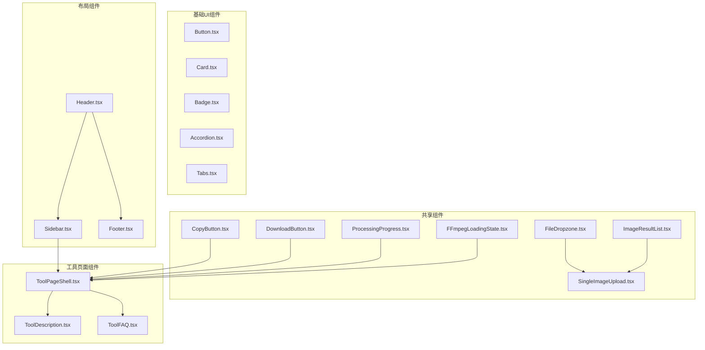
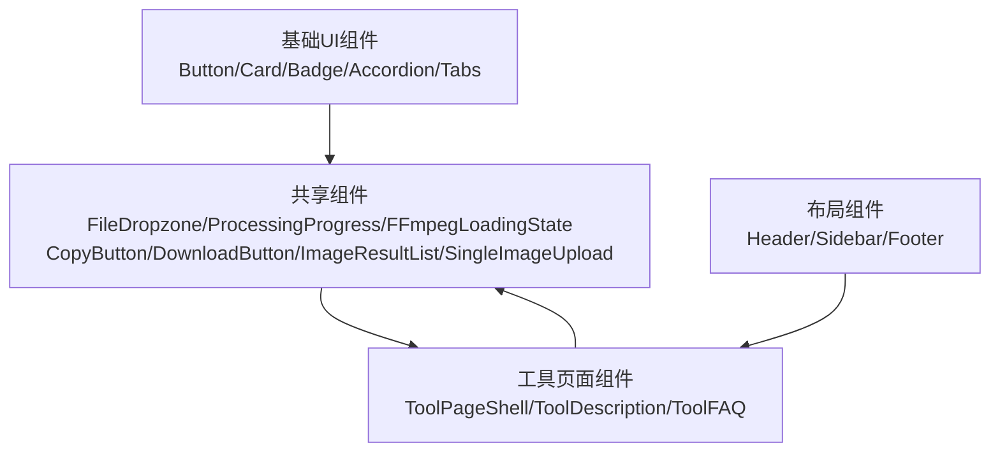
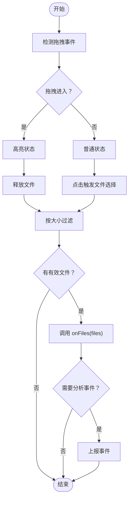
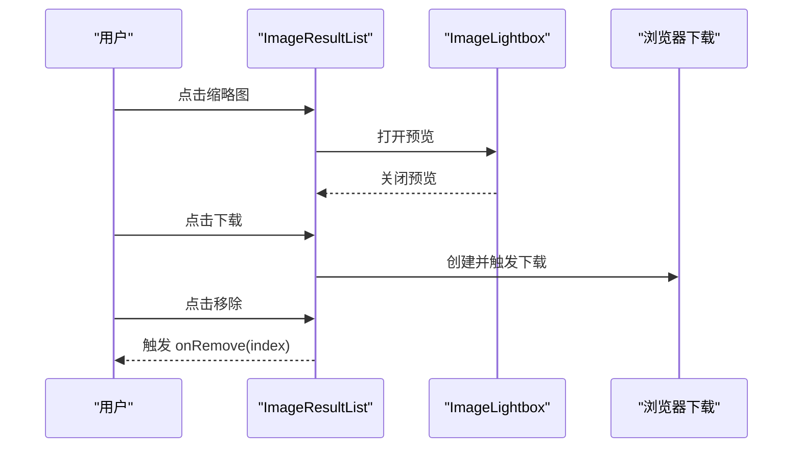
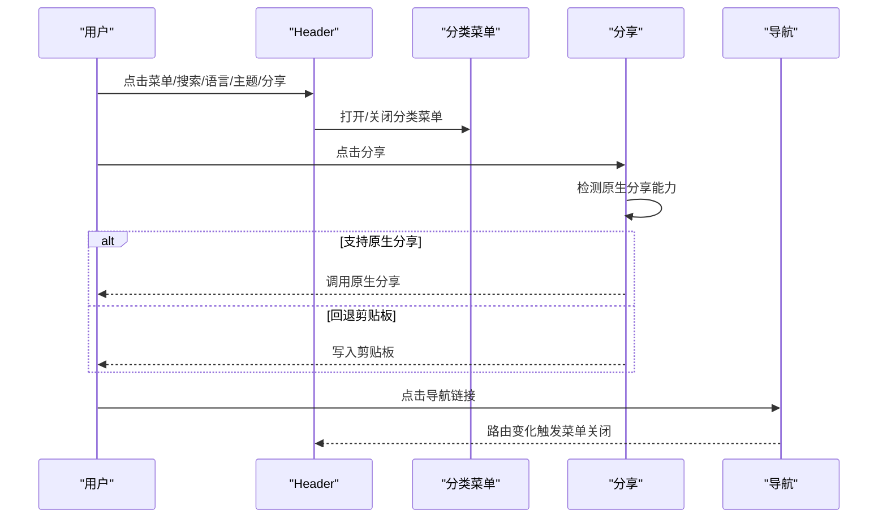
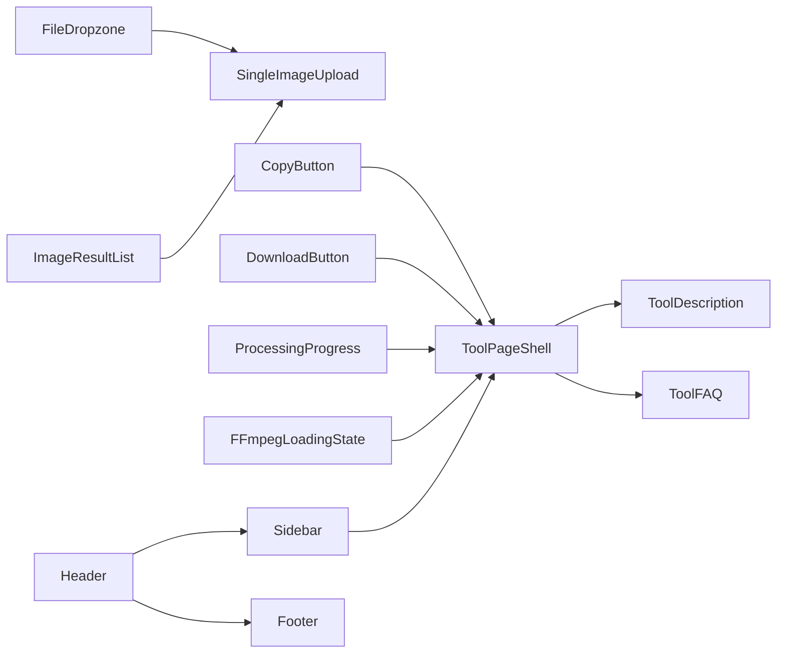

# 组件系统

<cite>
**本文引用的文件**
- [src/components/shared/FileDropzone.tsx](file://src/components/shared/FileDropzone.tsx)
- [src/components/shared/ProcessingProgress.tsx](file://src/components/shared/ProcessingProgress.tsx)
- [src/components/shared/FFmpegLoadingState.tsx](file://src/components/shared/FFmpegLoadingState.tsx)
- [src/components/shared/CopyButton.tsx](file://src/components/shared/CopyButton.tsx)
- [src/components/shared/DownloadButton.tsx](file://src/components/shared/DownloadButton.tsx)
- [src/components/shared/ImageResultList.tsx](file://src/components/shared/ImageResultList.tsx)
- [src/components/shared/SingleImageUpload.tsx](file://src/components/shared/SingleImageUpload.tsx)
- [src/components/ui/Button.tsx](file://src/components/ui/Button.tsx)
- [src/components/ui/Card.tsx](file://src/components/ui/Card.tsx)
- [src/components/ui/Badge.tsx](file://src/components/ui/Badge.tsx)
- [src/components/ui/Accordion.tsx](file://src/components/ui/Accordion.tsx)
- [src/components/ui/Tabs.tsx](file://src/components/ui/Tabs.tsx)
- [src/components/layout/Header.tsx](file://src/components/layout/Header.tsx)
- [src/components/layout/Sidebar.tsx](file://src/components/layout/Sidebar.tsx)
- [src/components/layout/Footer.tsx](file://src/components/layout/Footer.tsx)
- [src/components/tool/ToolPageShell.tsx](file://src/components/tool/ToolPageShell.tsx)
- [src/components/tool/ToolDescription.tsx](file://src/components/tool/ToolDescription.tsx)
- [src/components/tool/ToolFAQ.tsx](file://src/components/tool/ToolFAQ.tsx)
</cite>

## 目录
1. [简介](#简介)
2. [项目结构](#项目结构)
3. [核心组件](#核心组件)
4. [架构总览](#架构总览)
5. [组件详解](#组件详解)
6. [依赖关系分析](#依赖关系分析)
7. [性能考量](#性能考量)
8. [故障排查指南](#故障排查指南)
9. [结论](#结论)
10. [附录](#附录)

## 简介
本文件面向 PrivaDeck 媒体工具箱的前端组件体系，系统化梳理共享组件（文件拖拽、结果展示、进度指示器等）、基础 UI 原子组件（按钮、卡片、徽章等）、布局组件（头部、侧边栏、页脚）以及工具页面外壳与页面内容组件（工具描述、FAQ、相关工具推荐等）。文档提供组件职责、属性、事件、可定制项、组合模式、响应式与无障碍建议，并通过图示帮助理解组件间的调用与数据流。

## 项目结构
组件按功能域分层组织：
- 共享组件：跨工具复用的通用交互与状态展示组件
- 基础 UI 组件：按钮、卡片、徽章、手风琴、标签页等原子组件
- 布局组件：头部导航、侧边栏、页脚等页面骨架
- 工具页面组件：工具页面外壳与页面内容组件（描述、FAQ、特性卡等）

图表来源
- [src/components/shared/FileDropzone.tsx:1-144](file://src/components/shared/FileDropzone.tsx#L1-L144)
- [src/components/shared/ProcessingProgress.tsx:1-47](file://src/components/shared/ProcessingProgress.tsx#L1-L47)
- [src/components/shared/FFmpegLoadingState.tsx:1-20](file://src/components/shared/FFmpegLoadingState.tsx#L1-L20)
- [src/components/shared/CopyButton.tsx:1-57](file://src/components/shared/CopyButton.tsx#L1-L57)
- [src/components/shared/DownloadButton.tsx:1-54](file://src/components/shared/DownloadButton.tsx#L1-L54)
- [src/components/shared/ImageResultList.tsx:1-141](file://src/components/shared/ImageResultList.tsx#L1-L141)
- [src/components/shared/SingleImageUpload.tsx:1-180](file://src/components/shared/SingleImageUpload.tsx#L1-L180)
- [src/components/ui/Button.tsx:1-42](file://src/components/ui/Button.tsx#L1-L42)
- [src/components/ui/Card.tsx:1-33](file://src/components/ui/Card.tsx#L1-L33)
- [src/components/ui/Badge.tsx:1-28](file://src/components/ui/Badge.tsx#L1-L28)
- [src/components/ui/Accordion.tsx:1-63](file://src/components/ui/Accordion.tsx#L1-L63)
- [src/components/ui/Tabs.tsx:1-102](file://src/components/ui/Tabs.tsx#L1-L102)
- [src/components/layout/Header.tsx:1-291](file://src/components/layout/Header.tsx#L1-L291)
- [src/components/layout/Sidebar.tsx:1-143](file://src/components/layout/Sidebar.tsx#L1-L143)
- [src/components/layout/Footer.tsx:1-115](file://src/components/layout/Footer.tsx#L1-L115)
- [src/components/tool/ToolPageShell.tsx:1-54](file://src/components/tool/ToolPageShell.tsx#L1-L54)
- [src/components/tool/ToolDescription.tsx:1-46](file://src/components/tool/ToolDescription.tsx#L1-L46)
- [src/components/tool/ToolFAQ.tsx:1-51](file://src/components/tool/ToolFAQ.tsx#L1-L51)

章节来源
- [src/components/shared/FileDropzone.tsx:1-144](file://src/components/shared/FileDropzone.tsx#L1-L144)
- [src/components/shared/ProcessingProgress.tsx:1-47](file://src/components/shared/ProcessingProgress.tsx#L1-L47)
- [src/components/shared/FFmpegLoadingState.tsx:1-20](file://src/components/shared/FFmpegLoadingState.tsx#L1-L20)
- [src/components/shared/CopyButton.tsx:1-57](file://src/components/shared/CopyButton.tsx#L1-L57)
- [src/components/shared/DownloadButton.tsx:1-54](file://src/components/shared/DownloadButton.tsx#L1-L54)
- [src/components/shared/ImageResultList.tsx:1-141](file://src/components/shared/ImageResultList.tsx#L1-L141)
- [src/components/shared/SingleImageUpload.tsx:1-180](file://src/components/shared/SingleImageUpload.tsx#L1-L180)
- [src/components/ui/Button.tsx:1-42](file://src/components/ui/Button.tsx#L1-L42)
- [src/components/ui/Card.tsx:1-33](file://src/components/ui/Card.tsx#L1-L33)
- [src/components/ui/Badge.tsx:1-28](file://src/components/ui/Badge.tsx#L1-L28)
- [src/components/ui/Accordion.tsx:1-63](file://src/components/ui/Accordion.tsx#L1-L63)
- [src/components/ui/Tabs.tsx:1-102](file://src/components/ui/Tabs.tsx#L1-L102)
- [src/components/layout/Header.tsx:1-291](file://src/components/layout/Header.tsx#L1-L291)
- [src/components/layout/Sidebar.tsx:1-143](file://src/components/layout/Sidebar.tsx#L1-L143)
- [src/components/layout/Footer.tsx:1-115](file://src/components/layout/Footer.tsx#L1-L115)
- [src/components/tool/ToolPageShell.tsx:1-54](file://src/components/tool/ToolPageShell.tsx#L1-L54)
- [src/components/tool/ToolDescription.tsx:1-46](file://src/components/tool/ToolDescription.tsx#L1-L46)
- [src/components/tool/ToolFAQ.tsx:1-51](file://src/components/tool/ToolFAQ.tsx#L1-L51)

## 核心组件
- 文件拖拽上传：支持拖拽、点击选择、类型与大小限制、隐私提示、分析事件上报
- 处理进度：确定/不确定进度条与百分比显示
- FFmpeg 加载态：加载中安全提示与动画
- 结果列表：图片结果网格、缩略预览、下载、移除
- 单图上传：带缩略图、尺寸与文件大小展示、替换/删除、图片预览弹窗
- 复制按钮：复制到剪贴板、成功反馈、分析事件
- 下载按钮：Blob 或数据 URL 下载、品牌化文件名、分析事件
- 基础 UI：按钮、卡片、徽章、手风琴、标签页
- 布局：头部导航、侧边栏、页脚
- 工具页面：页面外壳、工具描述、FAQ

章节来源
- [src/components/shared/FileDropzone.tsx:1-144](file://src/components/shared/FileDropzone.tsx#L1-L144)
- [src/components/shared/ProcessingProgress.tsx:1-47](file://src/components/shared/ProcessingProgress.tsx#L1-L47)
- [src/components/shared/FFmpegLoadingState.tsx:1-20](file://src/components/shared/FFmpegLoadingState.tsx#L1-L20)
- [src/components/shared/ImageResultList.tsx:1-141](file://src/components/shared/ImageResultList.tsx#L1-L141)
- [src/components/shared/SingleImageUpload.tsx:1-180](file://src/components/shared/SingleImageUpload.tsx#L1-L180)
- [src/components/shared/CopyButton.tsx:1-57](file://src/components/shared/CopyButton.tsx#L1-L57)
- [src/components/shared/DownloadButton.tsx:1-54](file://src/components/shared/DownloadButton.tsx#L1-L54)
- [src/components/ui/Button.tsx:1-42](file://src/components/ui/Button.tsx#L1-L42)
- [src/components/ui/Card.tsx:1-33](file://src/components/ui/Card.tsx#L1-L33)
- [src/components/ui/Badge.tsx:1-28](file://src/components/ui/Badge.tsx#L1-L28)
- [src/components/ui/Accordion.tsx:1-63](file://src/components/ui/Accordion.tsx#L1-L63)
- [src/components/ui/Tabs.tsx:1-102](file://src/components/ui/Tabs.tsx#L1-L102)
- [src/components/layout/Header.tsx:1-291](file://src/components/layout/Header.tsx#L1-L291)
- [src/components/layout/Sidebar.tsx:1-143](file://src/components/layout/Sidebar.tsx#L1-L143)
- [src/components/layout/Footer.tsx:1-115](file://src/components/layout/Footer.tsx#L1-L115)
- [src/components/tool/ToolPageShell.tsx:1-54](file://src/components/tool/ToolPageShell.tsx#L1-L54)
- [src/components/tool/ToolDescription.tsx:1-46](file://src/components/tool/ToolDescription.tsx#L1-L46)
- [src/components/tool/ToolFAQ.tsx:1-51](file://src/components/tool/ToolFAQ.tsx#L1-L51)

## 架构总览
组件系统采用“共享组件 + 基础 UI + 布局 + 页面外壳”的分层设计，工具页面通过外壳统一承载描述、特性、FAQ 等内容模块，同时复用上传、结果展示、进度与下载等共享组件，确保一致性与可维护性。

图表来源
- [src/components/ui/Button.tsx:1-42](file://src/components/ui/Button.tsx#L1-L42)
- [src/components/ui/Card.tsx:1-33](file://src/components/ui/Card.tsx#L1-L33)
- [src/components/ui/Badge.tsx:1-28](file://src/components/ui/Badge.tsx#L1-L28)
- [src/components/ui/Accordion.tsx:1-63](file://src/components/ui/Accordion.tsx#L1-L63)
- [src/components/ui/Tabs.tsx:1-102](file://src/components/ui/Tabs.tsx#L1-L102)
- [src/components/shared/FileDropzone.tsx:1-144](file://src/components/shared/FileDropzone.tsx#L1-L144)
- [src/components/shared/ProcessingProgress.tsx:1-47](file://src/components/shared/ProcessingProgress.tsx#L1-L47)
- [src/components/shared/FFmpegLoadingState.tsx:1-20](file://src/components/shared/FFmpegLoadingState.tsx#L1-L20)
- [src/components/shared/CopyButton.tsx:1-57](file://src/components/shared/CopyButton.tsx#L1-L57)
- [src/components/shared/DownloadButton.tsx:1-54](file://src/components/shared/DownloadButton.tsx#L1-L54)
- [src/components/shared/ImageResultList.tsx:1-141](file://src/components/shared/ImageResultList.tsx#L1-L141)
- [src/components/shared/SingleImageUpload.tsx:1-180](file://src/components/shared/SingleImageUpload.tsx#L1-L180)
- [src/components/layout/Header.tsx:1-291](file://src/components/layout/Header.tsx#L1-L291)
- [src/components/layout/Sidebar.tsx:1-143](file://src/components/layout/Sidebar.tsx#L1-L143)
- [src/components/layout/Footer.tsx:1-115](file://src/components/layout/Footer.tsx#L1-L115)
- [src/components/tool/ToolPageShell.tsx:1-54](file://src/components/tool/ToolPageShell.tsx#L1-L54)
- [src/components/tool/ToolDescription.tsx:1-46](file://src/components/tool/ToolDescription.tsx#L1-L46)
- [src/components/tool/ToolFAQ.tsx:1-51](file://src/components/tool/ToolFAQ.tsx#L1-L51)

## 组件详解

### 共享组件

#### 文件拖拽上传（FileDropzone）
- 职责：提供拖拽与点击两种文件选择方式；支持类型过滤、大小限制；显示格式与大小提示；隐私提示；可选分析事件上报
- 关键属性
  - accept: 字符串，文件类型过滤
  - multiple: 布尔，是否多选
  - maxSize: 数字（字节），最大文件大小
  - onFiles(files): 回调，返回选中的文件数组
  - className: 自定义样式
  - analyticsSlug/analyticsCategory: 分析事件参数
- 行为要点
  - 拖拽进入/离开切换高亮态
  - 过滤超过 maxSize 的文件
  - 触发分析事件（文件类型、数量）
- 使用示例路径
  - [单图上传使用文件拖拽:95-103](file://src/components/shared/SingleImageUpload.tsx#L95-L103)

图表来源
- [src/components/shared/FileDropzone.tsx:55-76](file://src/components/shared/FileDropzone.tsx#L55-L76)

章节来源
- [src/components/shared/FileDropzone.tsx:1-144](file://src/components/shared/FileDropzone.tsx#L1-L144)

#### 处理进度（ProcessingProgress）
- 职责：显示处理进度，支持确定与不确定两种形态
- 关键属性
  - progress?: 数字 0–100（确定进度），未传入则为不确定
  - label?: 自定义状态文本
  - className: 自定义样式
- 行为要点
  - 确定进度：显示百分比与进度条
  - 不确定进度：显示动画进度条
- 使用示例路径
  - [工具页面外壳中使用进度指示器:40-42](file://src/components/tool/ToolPageShell.tsx#L40-L42)

章节来源
- [src/components/shared/ProcessingProgress.tsx:1-47](file://src/components/shared/ProcessingProgress.tsx#L1-L47)

#### FFmpeg 加载态（FFmpegLoadingState）
- 职责：在 FFmpeg 初始化阶段提供加载中与安全提示
- 行为要点
  - 展示盾牌图标与旋转加载动画
  - 显示加载文案与提示
- 使用示例路径
  - [工具页面外壳中使用加载态:40-42](file://src/components/tool/ToolPageShell.tsx#L40-L42)

章节来源
- [src/components/shared/FFmpegLoadingState.tsx:1-20](file://src/components/shared/FFmpegLoadingState.tsx#L1-L20)

#### 图片结果列表（ImageResultList）
- 职责：以网格形式展示图片结果，支持缩略预览、下载、移除
- 关键属性
  - results: 结果数组，包含 Blob、文件名与可选元信息
  - onRemove(index): 移除回调
- 性能要点
  - 使用 URL 缓存避免重复创建对象 URL
  - 渲染时同步缓存，移除后及时撤销 URL
- 使用示例路径
  - [单图上传结果渲染:106-178](file://src/components/shared/SingleImageUpload.tsx#L106-L178)

图表来源
- [src/components/shared/ImageResultList.tsx:21-141](file://src/components/shared/ImageResultList.tsx#L21-L141)

章节来源
- [src/components/shared/ImageResultList.tsx:1-141](file://src/components/shared/ImageResultList.tsx#L1-L141)

#### 单图上传（SingleImageUpload）
- 职责：封装文件选择、预览、尺寸探测、替换/删除、缩略预览弹窗
- 关键属性
  - file: File|null 当前文件
  - onFileChange(file): 文件变更回调
  - accept/maxSize/disabled/className/analyticsSlug/analyticsCategory
- 行为要点
  - 无文件时渲染文件拖拽区域
  - 有文件时渲染缩略图、尺寸与大小、操作按钮
  - 预览错误时回退占位图标
- 使用示例路径
  - [单图上传作为工具输入:27-178](file://src/components/shared/SingleImageUpload.tsx#L27-L178)

章节来源
- [src/components/shared/SingleImageUpload.tsx:1-180](file://src/components/shared/SingleImageUpload.tsx#L1-L180)

#### 复制按钮（CopyButton）
- 职责：一键复制文本到剪贴板，提供成功反馈与分析事件
- 关键属性
  - text: 待复制文本
  - className/analyticsSlug/analyticsCategory
- 行为要点
  - 成功复制后短暂切换为“已复制”状态
  - 可选分析事件上报
- 使用示例路径
  - [工具页面外壳中使用复制按钮:40-42](file://src/components/tool/ToolPageShell.tsx#L40-L42)

章节来源
- [src/components/shared/CopyButton.tsx:1-57](file://src/components/shared/CopyButton.tsx#L1-L57)

#### 下载按钮（DownloadButton）
- 职责：下载 Blob 或数据 URL，自动添加品牌化文件名，可选分析事件
- 关键属性
  - data: Blob|string
  - filename: 下载文件名
  - className/analyticsSlug/analyticsCategory
- 行为要点
  - 自动处理对象 URL 生命周期
  - 品牌化文件名策略
- 使用示例路径
  - [工具页面外壳中使用下载按钮:40-42](file://src/components/tool/ToolPageShell.tsx#L40-L42)

章节来源
- [src/components/shared/DownloadButton.tsx:1-54](file://src/components/shared/DownloadButton.tsx#L1-L54)

### 基础 UI 组件库

#### 按钮（Button）
- 类型与尺寸
  - variant: primary | secondary | ghost | outline
  - size: sm | md | lg | icon
- 行为要点
  - 支持禁用态、焦点可见轮廓、过渡动画
  - 尺寸与变体样式映射集中管理
- 使用示例路径
  - [复制/下载按钮基于 Button:37-55](file://src/components/shared/CopyButton.tsx#L37-L55)
  - [结果列表下载按钮:116-125](file://src/components/shared/ImageResultList.tsx#L116-L125)

章节来源
- [src/components/ui/Button.tsx:1-42](file://src/components/ui/Button.tsx#L1-L42)

#### 卡片（Card）
- 组件族：Card、CardHeader、CardContent
- 行为要点
  - 统一边框、背景、阴影与悬停效果
  - 语义化结构便于内容组织
- 使用示例路径
  - [工具页面外壳容器:40-42](file://src/components/tool/ToolPageShell.tsx#L40-L42)

章节来源
- [src/components/ui/Card.tsx:1-33](file://src/components/ui/Card.tsx#L1-L33)

#### 徽章（Badge）
- 类型
  - variant: default | secondary | outline
- 行为要点
  - 统一圆角与内边距，支持描边与渐变风格
- 使用示例路径
  - [工具页面外壳本地仅限标识:28-38](file://src/components/tool/ToolPageShell.tsx#L28-L38)

章节来源
- [src/components/ui/Badge.tsx:1-28](file://src/components/ui/Badge.tsx#L1-L28)

#### 手风琴（Accordion）
- 组件族：Accordion、AccordionItem
- 行为要点
  - 受控/非受控值管理
  - 动画展开/收起与方向指示
- 使用示例路径
  - [工具页面 FAQ 使用手风琴:33-47](file://src/components/tool/ToolFAQ.tsx#L33-L47)

章节来源
- [src/components/ui/Accordion.tsx:1-63](file://src/components/ui/Accordion.tsx#L1-L63)

#### 标签页（Tabs）
- 组件族：Tabs、TabsList、TabsTrigger、TabsContent
- 行为要点
  - 上下文传递当前选中值与变更回调
  - 支持受控/非受控模式
- 使用示例路径
  - [工具页面内容切换（概念性）:19-52](file://src/components/tool/ToolPageShell.tsx#L19-L52)

章节来源
- [src/components/ui/Tabs.tsx:1-102](file://src/components/ui/Tabs.tsx#L1-L102)

### 布局组件系统

#### 头部（Header）
- 职责：移动端菜单、站点 Logo、分类导航、搜索、语言切换、主题切换、分享
- 行为要点
  - 分类下拉菜单，支持鼠标进入/离开延时关闭
  - 路由变化时自动关闭菜单
  - 分享按钮优先使用 Web Share API，否则回退到剪贴板
- 使用示例路径
  - [头部导航与工具分类:77-89](file://src/components/layout/Header.tsx#L77-L89)

图表来源
- [src/components/layout/Header.tsx:21-116](file://src/components/layout/Header.tsx#L21-L116)
- [src/components/layout/Header.tsx:243-278](file://src/components/layout/Header.tsx#L243-L278)
- [src/components/layout/Header.tsx:37-48](file://src/components/layout/Header.tsx#L37-L48)

章节来源
- [src/components/layout/Header.tsx:1-291](file://src/components/layout/Header.tsx#L1-L291)

#### 侧边栏（Sidebar）
- 职责：首页、全部工具、按分类展开的工具列表
- 行为要点
  - 当前路径激活态高亮
  - 分类展开时显示工具子列表
- 使用示例路径
  - [侧边栏工具导航:66-108](file://src/components/layout/Sidebar.tsx#L66-L108)

章节来源
- [src/components/layout/Sidebar.tsx:1-143](file://src/components/layout/Sidebar.tsx#L1-L143)

#### 页脚（Footer）
- 职责：品牌信息、分类链接、关于与隐私链接、版权信息
- 行为要点
  - 分类链接按组展示，桌面端网格布局
- 使用示例路径
  - [页脚分类链接与关于区:78-103](file://src/components/layout/Footer.tsx#L78-L103)

章节来源
- [src/components/layout/Footer.tsx:1-115](file://src/components/layout/Footer.tsx#L1-L115)

### 工具页面组件

#### 工具页面外壳（ToolPageShell）
- 职责：统一页面标题、本地仅限标识、工具描述与特性、工作原理、为什么选择我们、工具描述等模块容器
- 行为要点
  - 使用工具国际化命名空间动态读取标题与描述
  - 容器卡片与背景模糊提升视觉层次
- 使用示例路径
  - [工具页面外壳结构:15-52](file://src/components/tool/ToolPageShell.tsx#L15-L52)

章节来源
- [src/components/tool/ToolPageShell.tsx:1-54](file://src/components/tool/ToolPageShell.tsx#L1-L54)

#### 工具描述（ToolDescription）
- 职责：根据工具国际化资源渲染 SEO 内容段落（默认包含 intro、howToUse、features、useCases、privacy）
- 行为要点
  - 不存在对应资源时静默不渲染
  - 使用富文本容器渲染 HTML 内容
- 使用示例路径
  - [工具描述渲染:21-44](file://src/components/tool/ToolDescription.tsx#L21-L44)

章节来源
- [src/components/tool/ToolDescription.tsx:1-46](file://src/components/tool/ToolDescription.tsx#L1-L46)

#### 工具 FAQ（ToolFAQ）
- 职责：根据工具注册表中的问题与答案键渲染手风琴式 FAQ
- 行为要点
  - 去除国际化键前缀，映射相对键
  - 展开时上报分析事件
- 使用示例路径
  - [工具 FAQ 渲染:18-49](file://src/components/tool/ToolFAQ.tsx#L18-L49)

章节来源
- [src/components/tool/ToolFAQ.tsx:1-51](file://src/components/tool/ToolFAQ.tsx#L1-L51)

## 依赖关系分析

图表来源
- [src/components/shared/FileDropzone.tsx:1-144](file://src/components/shared/FileDropzone.tsx#L1-L144)
- [src/components/shared/SingleImageUpload.tsx:1-180](file://src/components/shared/SingleImageUpload.tsx#L1-L180)
- [src/components/shared/ImageResultList.tsx:1-141](file://src/components/shared/ImageResultList.tsx#L1-L141)
- [src/components/shared/CopyButton.tsx:1-57](file://src/components/shared/CopyButton.tsx#L1-L57)
- [src/components/shared/DownloadButton.tsx:1-54](file://src/components/shared/DownloadButton.tsx#L1-L54)
- [src/components/shared/ProcessingProgress.tsx:1-47](file://src/components/shared/ProcessingProgress.tsx#L1-L47)
- [src/components/shared/FFmpegLoadingState.tsx:1-20](file://src/components/shared/FFmpegLoadingState.tsx#L1-L20)
- [src/components/tool/ToolPageShell.tsx:1-54](file://src/components/tool/ToolPageShell.tsx#L1-L54)
- [src/components/tool/ToolDescription.tsx:1-46](file://src/components/tool/ToolDescription.tsx#L1-L46)
- [src/components/tool/ToolFAQ.tsx:1-51](file://src/components/tool/ToolFAQ.tsx#L1-L51)
- [src/components/layout/Header.tsx:1-291](file://src/components/layout/Header.tsx#L1-L291)
- [src/components/layout/Sidebar.tsx:1-143](file://src/components/layout/Sidebar.tsx#L1-L143)
- [src/components/layout/Footer.tsx:1-115](file://src/components/layout/Footer.tsx#L1-L115)

章节来源
- [src/components/shared/FileDropzone.tsx:1-144](file://src/components/shared/FileDropzone.tsx#L1-L144)
- [src/components/shared/SingleImageUpload.tsx:1-180](file://src/components/shared/SingleImageUpload.tsx#L1-L180)
- [src/components/shared/ImageResultList.tsx:1-141](file://src/components/shared/ImageResultList.tsx#L1-L141)
- [src/components/shared/CopyButton.tsx:1-57](file://src/components/shared/CopyButton.tsx#L1-L57)
- [src/components/shared/DownloadButton.tsx:1-54](file://src/components/shared/DownloadButton.tsx#L1-L54)
- [src/components/shared/ProcessingProgress.tsx:1-47](file://src/components/shared/ProcessingProgress.tsx#L1-L47)
- [src/components/shared/FFmpegLoadingState.tsx:1-20](file://src/components/shared/FFmpegLoadingState.tsx#L1-L20)
- [src/components/tool/ToolPageShell.tsx:1-54](file://src/components/tool/ToolPageShell.tsx#L1-L54)
- [src/components/tool/ToolDescription.tsx:1-46](file://src/components/tool/ToolDescription.tsx#L1-L46)
- [src/components/tool/ToolFAQ.tsx:1-51](file://src/components/tool/ToolFAQ.tsx#L1-L51)
- [src/components/layout/Header.tsx:1-291](file://src/components/layout/Header.tsx#L1-L291)
- [src/components/layout/Sidebar.tsx:1-143](file://src/components/layout/Sidebar.tsx#L1-L143)
- [src/components/layout/Footer.tsx:1-115](file://src/components/layout/Footer.tsx#L1-L115)

## 性能考量
- 对象 URL 管理
  - 在图片结果列表与单图上传中，对 Blob/URL 进行缓存并在不再使用时撤销，避免内存泄漏
- 渲染优化
  - 使用 useMemo 同步 URL 缓存与映射，减少重复计算
  - 确定进度条使用固定宽度样式，避免频繁重排
- 事件与分析
  - 仅在必要时上报分析事件，避免高频触发
- 无障碍与可访问性
  - 按钮与交互元素具备焦点可见轮廓与键盘可达性
  - 手风琴使用 aria-expanded 标注状态
  - 图片加载错误时提供降级占位与错误标记

## 故障排查指南
- 文件拖拽无效或无法选择
  - 检查 accept 与 maxSize 是否导致过滤掉所有文件
  - 确认 onFiles 回调正确接收文件数组
  - 参考路径：[文件拖拽处理逻辑:55-76](file://src/components/shared/FileDropzone.tsx#L55-L76)
- 图片预览空白或闪烁
  - 确保预览 URL 正确创建与撤销
  - 检查图片加载错误回调是否触发降级
  - 参考路径：[单图上传预览与错误处理:43-87](file://src/components/shared/SingleImageUpload.tsx#L43-L87)
- 下载失败或文件名异常
  - 确认 data 类型（Blob 或数据 URL）与 filename
  - 检查品牌化文件名策略是否生效
  - 参考路径：[下载按钮实现:27-45](file://src/components/shared/DownloadButton.tsx#L27-L45)
- 进度条不更新
  - 确认传入的 progress 值范围与更新时机
  - 参考路径：[进度指示器:14-46](file://src/components/shared/ProcessingProgress.tsx#L14-L46)
- 分享失败
  - 检查浏览器是否支持 Web Share API，回退到剪贴板时需注意权限
  - 参考路径：[分享按钮实现:246-266](file://src/components/layout/Header.tsx#L246-L266)

章节来源
- [src/components/shared/FileDropzone.tsx:55-76](file://src/components/shared/FileDropzone.tsx#L55-L76)
- [src/components/shared/SingleImageUpload.tsx:43-87](file://src/components/shared/SingleImageUpload.tsx#L43-L87)
- [src/components/shared/DownloadButton.tsx:27-45](file://src/components/shared/DownloadButton.tsx#L27-L45)
- [src/components/shared/ProcessingProgress.tsx:14-46](file://src/components/shared/ProcessingProgress.tsx#L14-L46)
- [src/components/layout/Header.tsx:246-266](file://src/components/layout/Header.tsx#L246-L266)

## 结论
该组件系统通过清晰的分层与职责划分，实现了高复用、易维护与一致性的用户体验。共享组件覆盖媒体处理流程中的关键交互点，基础 UI 提供统一的视觉与行为规范，布局组件保证页面结构的一致性，工具页面外壳与内容组件则将工具信息与交互整合为完整的页面体验。配合合理的性能与无障碍实践，可在多语言环境下稳定运行。

## 附录

### 组件属性与事件速查
- FileDropzone
  - 属性：accept、multiple、maxSize、onFiles(files)、className、analyticsSlug、analyticsCategory
  - 事件：拖拽进入/离开、释放文件、点击选择
- ProcessingProgress
  - 属性：progress（0–100）、label、className
- FFmpegLoadingState
  - 属性：无
- ImageResultList
  - 属性：results、onRemove(index)
  - 事件：打开预览、下载、移除
- SingleImageUpload
  - 属性：file、onFileChange(file)、accept、maxSize、disabled、className、analyticsSlug、analyticsCategory
- CopyButton
  - 属性：text、className、analyticsSlug、analyticsCategory
- DownloadButton
  - 属性：data、filename、className、analyticsSlug、analyticsCategory
- Button
  - 属性：variant、size、className
- Card/CardHeader/CardContent
  - 属性：className
- Badge
  - 属性：variant、className
- Accordion/AccordionItem
  - 属性：defaultOpen、onValueChange(open)
- Tabs/TabsList/TabsTrigger/TabsContent
  - 属性：defaultValue、value、onValueChange(value)

### 组合模式与集成建议
- 工具页面外壳
  - 使用 ToolPageShell 包裹工具输入与输出，内部嵌套 ToolDescription、ToolFAQ、ToolFeatureCards、ToolHowItWorks、ToolWhySection 等
  - 在外壳中统一放置本地仅限标识与结果容器
- 上传与结果
  - 单图上传组件可直接替代文件拖拽区域，内部复用 FileDropzone
  - 图片结果列表负责网格展示与下载，支持缩略预览与移除
- 交互与分析
  - 在关键交互处（复制、下载、分享、FAQ 展开）上报分析事件
- 响应式与无障碍
  - 使用语义化标签与 aria 属性标注状态
  - 遵循最小点击目标、对比度与键盘导航要求
- 主题与品牌
  - 通过 CSS 变量与渐变色保持视觉一致性
  - 品牌化文件名策略统一下载体验