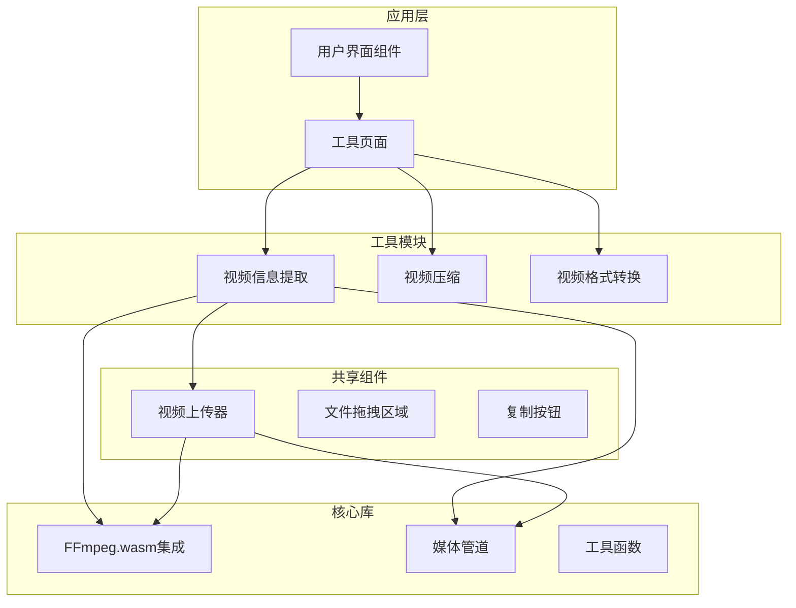
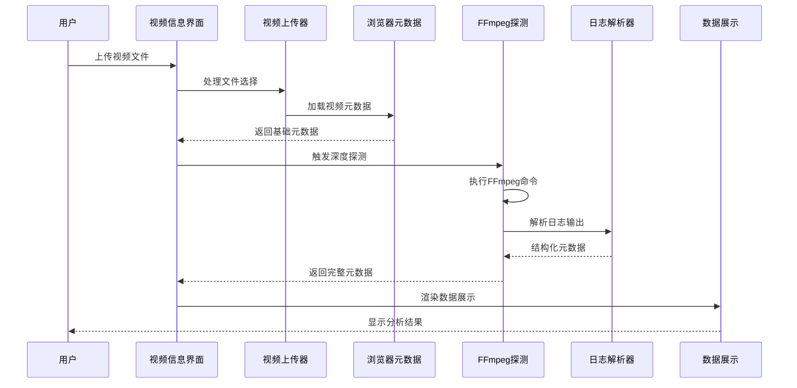
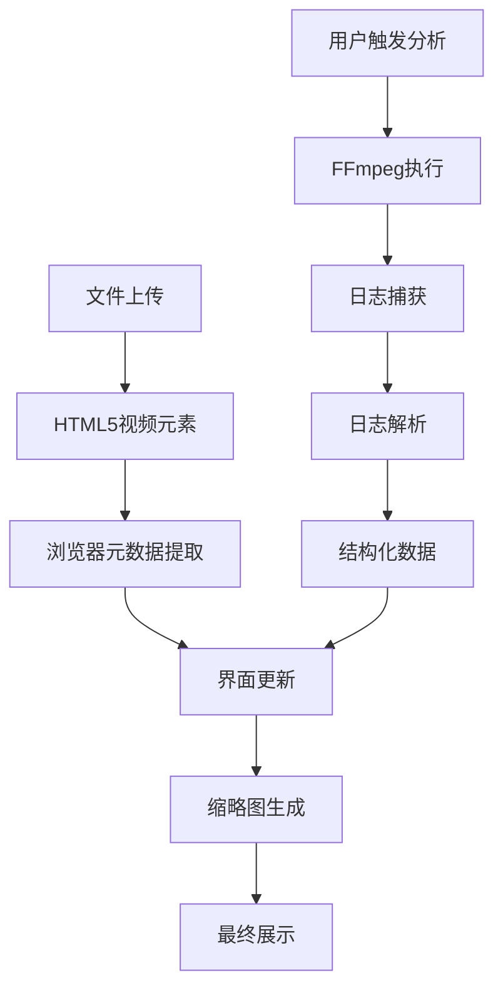
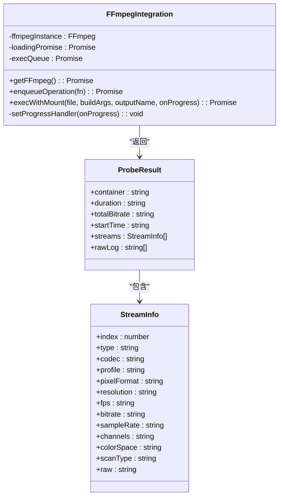
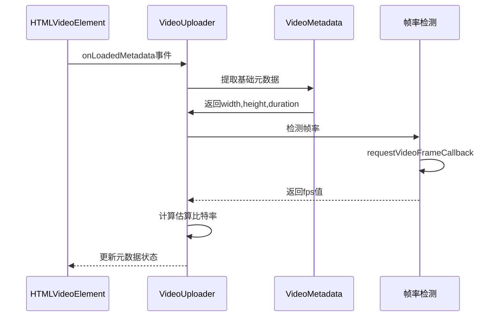
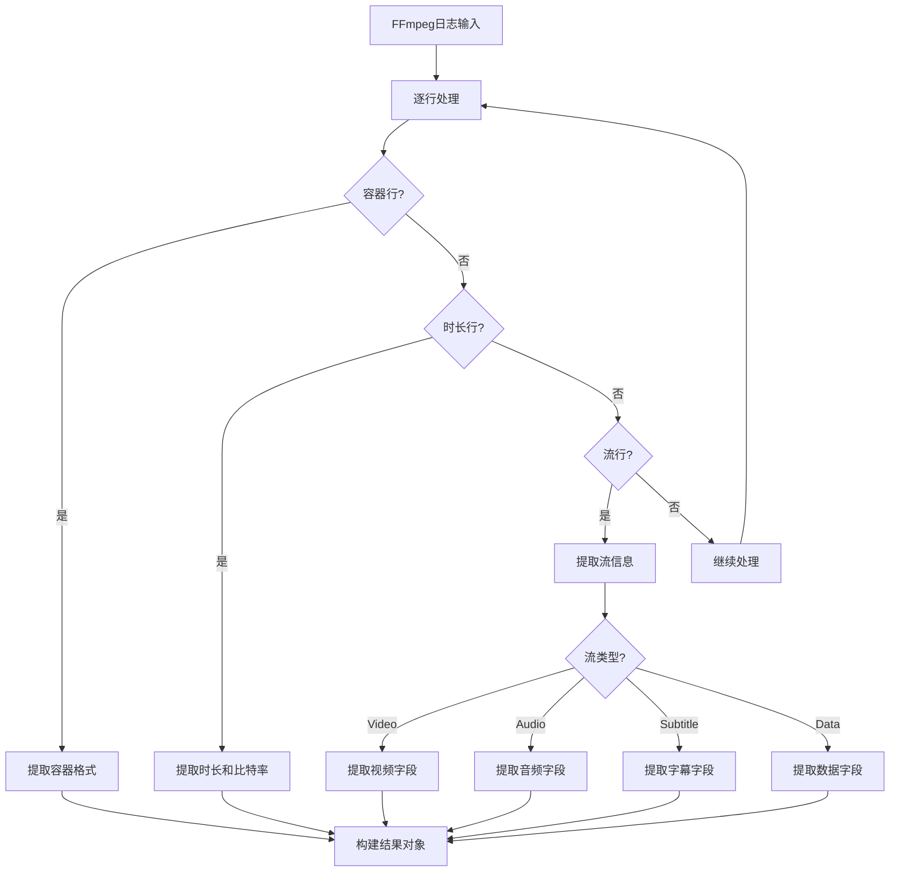
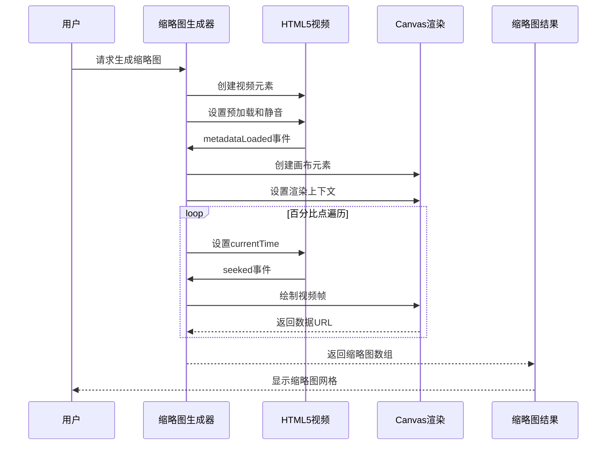

# 视频信息提取工具

<cite>
**本文档引用的文件**
- [README.md](file://README.md)
- [package.json](file://package.json)
- [index.ts](file://src/lib/registry/index.ts)
- [ffmpeg.ts](file://src/lib/ffmpeg.ts)
- [media-pipeline.ts](file://src/lib/media-pipeline.ts)
- [VideoUploader.tsx](file://src/components/shared/VideoUploader.tsx)
- [VideoInfo.tsx](file://src/tools/video/info/VideoInfo.tsx)
- [logic.ts](file://src/tools/video/info/logic.ts)
- [tools-video.json](file://messages/en/tools-video.json)
- [tools-video.json](file://messages/zh-Hans/tools-video.json)
</cite>

## 目录
1. [简介](#简介)
2. [项目结构](#项目结构)
3. [核心组件](#核心组件)
4. [架构概览](#架构概览)
5. [详细组件分析](#详细组件分析)
6. [依赖关系分析](#依赖关系分析)
7. [性能考虑](#性能考虑)
8. [故障排除指南](#故障排除指南)
9. [结论](#结论)
10. [附录](#附录)

## 简介

视频信息提取工具是一个基于浏览器的多媒体分析工具，专门用于检测和提取视频文件的详细元数据。该工具采用隐私优先的设计理念，所有处理过程都在本地浏览器环境中完成，无需将文件上传到服务器。

该工具的核心功能包括：
- **容器格式解析**：识别和分析视频容器格式（如 MP4、WebM、MKV、AVI 等）
- **编解码器信息提取**：检测视频和音频编解码器类型（H.264、H.265、VP9、AAC、Opus 等）
- **媒体属性读取**：提取分辨率、帧率、比特率、时长等关键媒体属性
- **多轨道支持**：分析视频轨道、音频轨道和字幕轨道
- **色彩信息分析**：识别色彩空间、像素格式和扫描类型

## 项目结构

该项目采用模块化架构设计，主要分为以下几个核心部分：



**图表来源**
- [README.md:55-78](file://README.md#L55-L78)
- [index.ts:66-133](file://src/lib/registry/index.ts#L66-L133)

**章节来源**
- [README.md:1-89](file://README.md#L1-L89)
- [package.json:1-45](file://package.json#L1-L45)

## 核心组件

### FFmpeg.wasm 集成

工具使用 FFmpeg.wasm 实现视频元数据的深度分析。FFmpeg.wasm 是 FFmpeg 的 WebAssembly 版本，能够在浏览器中执行完整的视频处理任务。

关键特性：
- **单线程执行**：通过 Promise 队列确保 FFmpeg 操作的串行执行
- **内存优化**：使用 WORKERFS 挂载避免内存复制
- **进度跟踪**：提供详细的处理进度反馈
- **错误处理**：完善的异常捕获和恢复机制

### 视频上传器组件

VideoUploader 组件负责处理视频文件的上传和基础元数据提取：

- **浏览器原生元数据**：利用 HTML5 `<video>` API 获取分辨率、时长、估算比特率
- **帧率检测**：通过 requestVideoFrameCallback API 精确测量帧率
- **编解码器支持检测**：使用 Mediabunny 检测 WebCodecs 兼容性
- **文件格式验证**：支持多种视频格式的自动识别

### 视频信息提取逻辑

logic.ts 文件实现了核心的元数据解析算法：

- **日志解析**：解析 FFmpeg 输出的详细日志信息
- **正则表达式匹配**：使用精确的正则表达式提取各种元数据字段
- **格式标准化**：将提取的数据转换为统一的结构化格式
- **错误容错**：处理不完整或格式异常的日志信息

**章节来源**
- [ffmpeg.ts:1-144](file://src/lib/ffmpeg.ts#L1-L144)
- [VideoUploader.tsx:1-393](file://src/components/shared/VideoUploader.tsx#L1-L393)
- [logic.ts:1-272](file://src/tools/video/info/logic.ts#L1-L272)

## 架构概览

视频信息提取工具采用分层架构设计，确保各组件职责明确且松耦合：



**图表来源**
- [VideoInfo.tsx:36-74](file://src/tools/video/info/VideoInfo.tsx#L36-L74)
- [ffmpeg.ts:75-82](file://src/lib/ffmpeg.ts#L75-L82)
- [logic.ts:33-71](file://src/tools/video/info/logic.ts#L33-L71)

### 数据流架构



**图表来源**
- [VideoUploader.tsx:98-125](file://src/components/shared/VideoUploader.tsx#L98-L125)
- [logic.ts:82-140](file://src/tools/video/info/logic.ts#L82-L140)
- [VideoInfo.tsx:60-74](file://src/tools/video/info/VideoInfo.tsx#L60-L74)

## 详细组件分析

### FFmpeg.wasm 集成组件

#### 核心功能实现



**图表来源**
- [ffmpeg.ts:10-82](file://src/lib/ffmpeg.ts#L10-L82)
- [logic.ts:19-26](file://src/tools/video/info/logic.ts#L19-L26)

#### 执行队列管理

FFmpeg.wasm 采用 Promise 队列确保操作的串行执行，避免并发冲突：

- **队列初始化**：`execQueue = Promise.resolve()` 创建初始状态
- **任务封装**：每个操作都被包装在队列中执行
- **错误隔离**：单个任务失败不影响其他任务
- **资源清理**：自动清理挂载点和临时文件

**章节来源**
- [ffmpeg.ts:7-82](file://src/lib/ffmpeg.ts#L7-L82)

### 视频上传器组件

#### 元数据提取流程



**图表来源**
- [VideoUploader.tsx:98-125](file://src/components/shared/VideoUploader.tsx#L98-L125)
- [VideoUploader.tsx:214-252](file://src/components/shared/VideoUploader.tsx#L214-L252)

#### 编解码器支持检测

组件集成了 WebCodecs 兼容性检测功能：

- **自动检测**：检查浏览器是否支持 WebCodecs API
- **编解码器验证**：使用 Mediabunny 验证具体编解码器支持
- **警告提示**：对不支持的编解码器提供用户友好的警告
- **扩展建议**：在 Windows 平台上建议安装 HEVC 扩展

**章节来源**
- [VideoUploader.tsx:131-212](file://src/components/shared/VideoUploader.tsx#L131-L212)
- [media-pipeline.ts:7-143](file://src/lib/media-pipeline.ts#L7-L143)

### 元数据解析组件

#### 正则表达式解析策略



**图表来源**
- [logic.ts:82-140](file://src/tools/video/info/logic.ts#L82-L140)

#### 字段提取算法

每个元数据字段都有对应的提取函数，使用精确的正则表达式模式：

- **编解码器名称**：`/^(\S+)/` 匹配第一个非空白字符序列
- **分辨率**：`\b(\d{2,5}x\d{2,5})\b` 匹配标准分辨率格式
- **帧率**：优先匹配 `fps` 关键字，回退到 `tbr`（≤300）
- **比特率**：`(\d+)\s*kb/s` 匹配数字后跟 kb/s
- **像素格式**：`\b(yuv\w+|rgb\w+|bgr\w+|gray\w*|nv\d+)\b` 匹配常见像素格式
- **色彩空间**：识别 bt709、bt2020、smpte170m 等标准色彩空间
- **扫描类型**：检测 progressive、interlaced、top.first、bottom.first

**章节来源**
- [logic.ts:142-224](file://src/tools/video/info/logic.ts#L142-L224)

### 缩略图生成功能

#### 实时缩略图生成



**图表来源**
- [logic.ts:230-271](file://src/tools/video/info/logic.ts#L230-L271)

## 依赖关系分析

### 核心依赖关系

```mermaid
graph TB
subgraph "外部依赖"
FFmpegWASM[@ffmpeg/ffmpeg]
Mediabunny[mediabunny]
BrowserCompression[browser-image-compression]
end
subgraph "内部模块"
Registry[工具注册表]
FFmpegLib[FFmpeg集成]
MediaPipeline[媒体管道]
VideoUploader[视频上传器]
VideoInfo[视频信息工具]
end
subgraph "UI组件"
VideoInfoUI[视频信息界面]
SharedComponents[共享组件]
end
Registry --> VideoInfo
FFmpegWASM --> FFmpegLib
Mediabunny --> MediaPipeline
FFmpegLib --> VideoInfo
MediaPipeline --> VideoUploader
VideoUploader --> VideoInfoUI
SharedComponents --> VideoInfoUI
```

**图表来源**
- [package.json:11-31](file://package.json#L11-L31)
- [index.ts:20-27](file://src/lib/registry/index.ts#L20-L27)

### 工具注册和路由

工具采用集中式注册机制，所有工具在注册表中统一管理：

- **分类组织**：按功能分类（image、video、audio、pdf、developer）
- **元数据定义**：包含图标、SEO配置、相关工具链接
- **动态加载**：使用 React.lazy 实现按需加载
- **国际化支持**：每个工具都有完整的多语言支持

**章节来源**
- [index.ts:66-133](file://src/lib/registry/index.ts#L66-L133)
- [index.ts:1-164](file://src/lib/registry/index.ts#L1-164)

## 性能考虑

### 内存优化策略

1. **WORKERFS 挂载**：避免将文件复制到内存中，直接从磁盘读取
2. **Promise 队列**：串行执行 FFmpeg 操作，避免内存峰值
3. **及时清理**：操作完成后立即释放挂载点和临时文件
4. **渐进式加载**：缩略图按需生成，避免一次性生成所有帧

### 缓存机制

- **FFmpeg 核心缓存**：首次加载后浏览器缓存，后续使用无需重复下载
- **文件对象 URL 缓存**：使用 URL.createObjectURL 创建的 URL 在组件卸载时清理
- **元数据缓存**：已提取的元数据在组件生命周期内缓存使用

### 并发控制

- **单实例限制**：确保同一时间只有一个 FFmpeg 实例运行
- **操作队列**：所有 FFmpeg 操作排队执行，避免竞态条件
- **进度回调原子性**：进度回调在操作开始和结束时正确设置和清除

## 故障排除指南

### 常见问题和解决方案

#### SharedArrayBuffer 不支持

**症状**：工具显示不支持的提示信息

**原因**：浏览器不支持 SharedArrayBuffer API

**解决方案**：
- 使用支持 HTTPS 的现代浏览器
- 确保浏览器版本满足要求
- 考虑使用 PWA 安装获得更好的支持

#### FFmpeg 加载失败

**症状**：FFmpeg 核心文件加载超时或失败

**原因**：
- 网络连接问题
- CDN 服务不可用
- 浏览器阻止了某些资源

**解决方案**：
- 检查网络连接
- 刷新页面重试
- 清除浏览器缓存
- 尝试不同的网络环境

#### 元数据提取不完整

**症状**：某些元数据字段显示为未知或空值

**原因**：
- 视频文件损坏
- 编解码器不受支持
- FFmpeg 版本限制

**解决方案**：
- 验证视频文件完整性
- 尝试其他视频格式
- 检查浏览器编解码器支持情况

**章节来源**
- [VideoInfo.tsx:76-82](file://src/tools/video/info/VideoInfo.tsx#L76-L82)
- [ffmpeg.ts:20-28](file://src/lib/ffmpeg.ts#L20-L28)

## 结论

视频信息提取工具是一个功能完整、性能优异的浏览器端多媒体分析工具。其设计特点包括：

**技术优势**：
- 完全本地化处理，确保用户隐私
- 基于 WebAssembly 的高性能执行
- 模块化架构，易于维护和扩展
- 多语言支持，国际化程度高

**功能特色**：
- 深度元数据分析，支持多种编解码器
- 实时缩略图生成，提升用户体验
- 完整的错误处理和用户反馈机制
- 灵活的配置选项和自定义能力

**应用场景**：
- 视频处理前的质量评估
- 格式兼容性检查
- 技术规格文档生成
- 故障诊断和问题排查

该工具为用户提供了一个强大而易用的视频元数据分析解决方案，特别适合需要在本地环境中进行多媒体分析的场景。

## 附录

### 支持的元数据字段

| 字段类别 | 字段名称 | 描述 | 支持格式 |
|---------|----------|------|----------|
| 基本信息 | 文件名 | 视频文件的原始名称 | 所有格式 |
| 基本信息 | 文件大小 | 视频文件的字节大小 | 所有格式 |
| 基本信息 | 文件类型 | MIME 类型标识 | 所有格式 |
| 基本信息 | 分辨率 | 视频帧的宽度和高度 | 所有格式 |
| 基本信息 | 时长 | 视频的总播放时长 | 所有格式 |
| 基本信息 | 估算比特率 | 基于文件大小和时长的估算值 | 所有格式 |
| 基本信息 | 帧率 | 视频的每秒帧数 | 所有格式 |
| 容器信息 | 容器格式 | 视频封装格式（MP4、WebM等） | 所有格式 |
| 容器信息 | 总比特率 | 容器层面的总比特率 | 支持的格式 |
| 容器信息 | 起始时间 | 视频在容器中的起始偏移 | 支持的格式 |
| 视频流 | 编解码器 | 视频编码格式（H.264、VP9等） | 所有格式 |
| 视频流 | 配置文件 | 编解码器配置（如 High、Main） | 支持的格式 |
| 视频流 | 像素格式 | 像素数据的存储格式 | 支持的格式 |
| 视频流 | 分辨率 | 视频帧的实际分辨率 | 支持的格式 |
| 视频流 | 帧率 | 视频流的帧率 | 支持的格式 |
| 视频流 | 比特率 | 视频流的编码比特率 | 支持的格式 |
| 视频流 | 色彩空间 | 视觉色彩表示标准（BT.709、BT.2020） | 支持的格式 |
| 视频流 | 扫描类型 | 视频的扫描方式（逐行、隔行） | 支持的格式 |
| 音频流 | 编解码器 | 音频编码格式（AAC、Opus等） | 所有格式 |
| 音频流 | 采样率 | 音频的采样频率 | 支持的格式 |
| 音频流 | 声道布局 | 音频的声道配置（立体声、5.1等） | 支持的格式 |
| 音频流 | 比特率 | 音频流的编码比特率 | 支持的格式 |

### 格式兼容性矩阵

| 容器格式 | 视频编解码器 | 音频编解码器 | 支持状态 |
|---------|-------------|-------------|----------|
| MP4 | H.264、H.265、VP9 | AAC、MP3、Opus | 完全支持 |
| WebM | VP8、VP9、AV1 | Vorbis、Opus | 完全支持 |
| MKV | H.264、H.265、VP9、AV1 | AAC、MP3、Opus、Vorbis | 完全支持 |
| AVI | H.264、MJPEG | PCM、MP3 | 部分支持 |
| MOV | H.264、ProRes | AAC、AC-3 | 完全支持 |

### 性能基准

- **加载时间**：FFmpeg 核心首次加载约 3-5 秒
- **元数据提取**：小型文件 1-2 秒，大型文件 5-10 秒
- **内存使用**：峰值约 50-100MB（取决于视频大小）
- **CPU 使用**：根据视频复杂度，通常 50-150% CPU 使用率