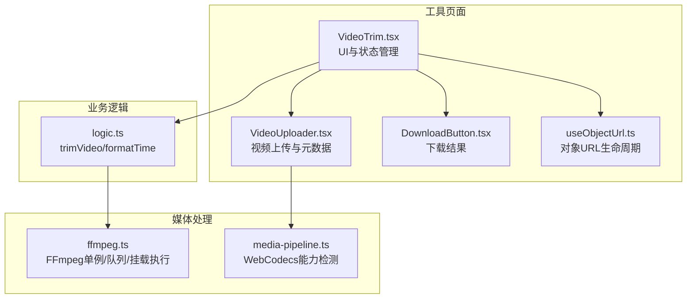
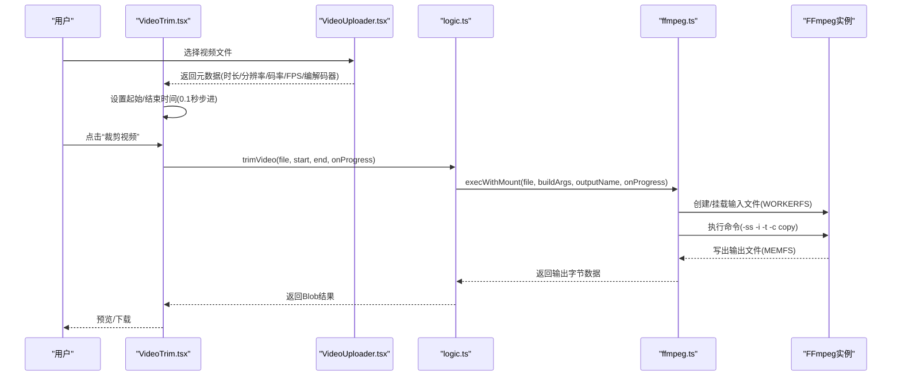
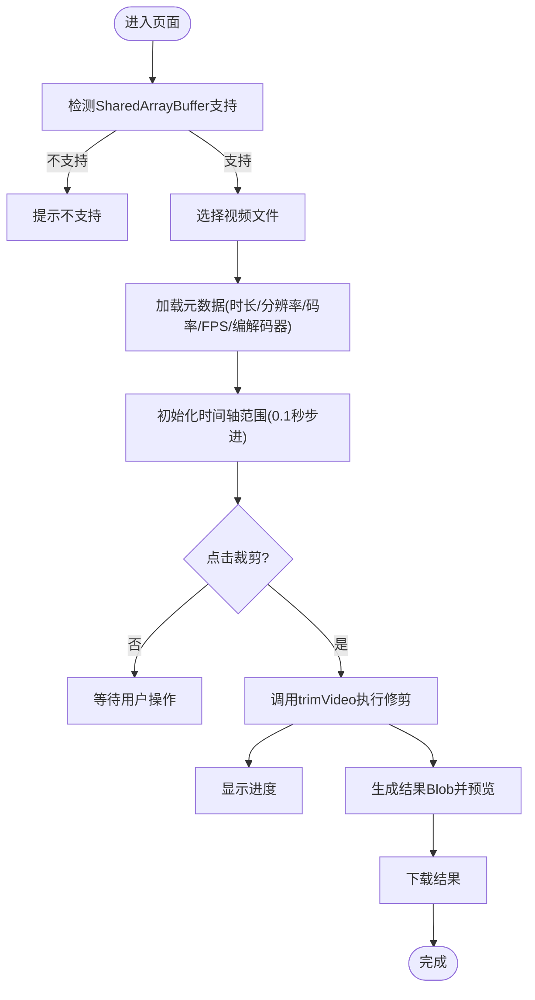
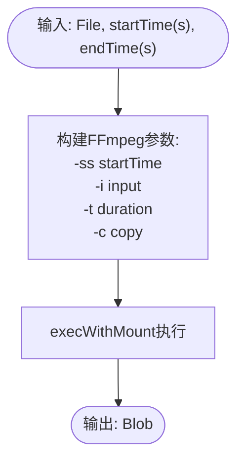
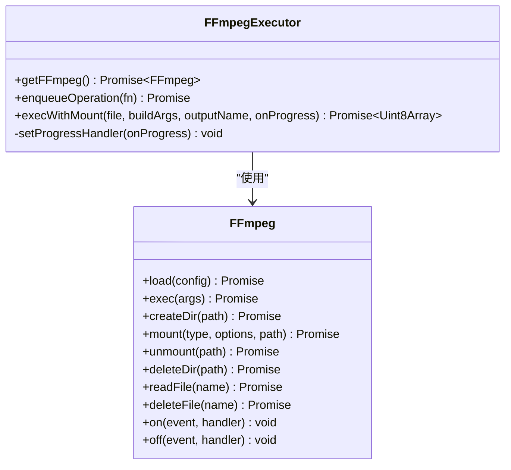
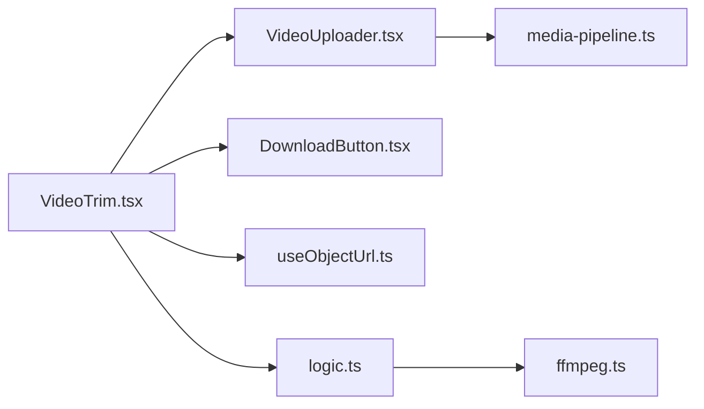

# 视频修剪工具

<cite>
**本文引用的文件**
- [VideoTrim.tsx](file://src/tools/video/trim/VideoTrim.tsx)
- [logic.ts](file://src/tools/video/trim/logic.ts)
- [ffmpeg.ts](file://src/lib/ffmpeg.ts)
- [media-pipeline.ts](file://src/lib/media-pipeline.ts)
- [VideoUploader.tsx](file://src/components/shared/VideoUploader.tsx)
- [DownloadButton.tsx](file://src/components/shared/DownloadButton.tsx)
- [useObjectUrl.ts](file://src/lib/hooks/useObjectUrl.ts)
- [README.md](file://README.md)
- [tools-video.json](file://messages/zh-Hans/tools-video.json)
- [index.ts](file://src/tools/video/trim/index.ts)
</cite>

## 目录
1. [简介](#简介)
2. [项目结构](#项目结构)
3. [核心组件](#核心组件)
4. [架构总览](#架构总览)
5. [详细组件分析](#详细组件分析)
6. [依赖关系分析](#依赖关系分析)
7. [性能考量](#性能考量)
8. [故障排除指南](#故障排除指南)
9. [结论](#结论)
10. [附录](#附录)

## 简介
本文件面向“视频修剪工具”的功能与实现，聚焦于浏览器端的视频时间轴操作、精确时间戳定位、关键帧处理与无损修剪算法。文档覆盖支持的时间格式与精度控制、修剪流程中的视频/音频流截取与元数据重算、性能优化策略（预加载与增量处理）、不同使用场景的修剪策略（片段提取、时长调整、内容裁剪），以及复杂需求（多段修剪、批量处理）的扩展思路。同时提供修剪前后技术参数对比与质量保证方法。

## 项目结构
视频修剪工具位于工具目录下的 video/trim 子模块，采用“页面组件 + 业务逻辑 + 媒体处理库”的分层组织方式：
- 页面组件负责用户交互与状态管理
- 业务逻辑封装 FFmpeg 命令与时间格式化
- 媒体处理库提供 FFmpeg 单例、队列化执行与进度回调
- 共享组件提供文件上传、预览、下载与对象 URL 生命周期管理

**图表来源**
- [VideoTrim.tsx:13-142](file://src/tools/video/trim/VideoTrim.tsx#L13-L142)
- [logic.ts:3-21](file://src/tools/video/trim/logic.ts#L3-L21)
- [ffmpeg.ts:99-143](file://src/lib/ffmpeg.ts#L99-L143)
- [media-pipeline.ts:7-14](file://src/lib/media-pipeline.ts#L7-L14)

**章节来源**
- [README.md:55-78](file://README.md#L55-L78)
- [VideoTrim.tsx:1-144](file://src/tools/video/trim/VideoTrim.tsx#L1-L144)
- [logic.ts:1-41](file://src/tools/video/trim/logic.ts#L1-L41)

## 核心组件
- 视频修剪页面组件：负责文件选择、时间轴滑块、进度反馈、结果预览与下载。
- 修剪逻辑：封装 FFmpeg 命令参数（输入定位、时长、流复制），并格式化时间字符串。
- FFmpeg 执行器：提供单例加载、串行队列、WORKERFS 挂载、进度回调与资源清理。
- 视频上传器：提供元数据读取（时长、分辨率、码率、FPS）、编解码器检测与警告提示。
- 下载与对象 URL：管理 Blob 对象 URL 生命周期，触发浏览器下载。

**章节来源**
- [VideoTrim.tsx:13-142](file://src/tools/video/trim/VideoTrim.tsx#L13-L142)
- [logic.ts:3-41](file://src/tools/video/trim/logic.ts#L3-L41)
- [ffmpeg.ts:99-143](file://src/lib/ffmpeg.ts#L99-L143)
- [VideoUploader.tsx:68-125](file://src/components/shared/VideoUploader.tsx#L68-L125)
- [DownloadButton.tsx:18-45](file://src/components/shared/DownloadButton.tsx#L18-L45)
- [useObjectUrl.ts:7-20](file://src/lib/hooks/useObjectUrl.ts#L7-L20)

## 架构总览
浏览器端视频修剪采用“流复制（-c copy）”策略，避免重新编码，从而实现无损与高性能的修剪。整体流程如下：

**图表来源**
- [VideoTrim.tsx:33-47](file://src/tools/video/trim/VideoTrim.tsx#L33-L47)
- [logic.ts:3-21](file://src/tools/video/trim/logic.ts#L3-L21)
- [ffmpeg.ts:99-143](file://src/lib/ffmpeg.ts#L99-L143)
- [VideoUploader.tsx:98-125](file://src/components/shared/VideoUploader.tsx#L98-L125)

## 详细组件分析

### 组件A：视频修剪页面（VideoTrim）
- 职责：文件选择、时间轴滑块、进度显示、错误处理、结果预览与下载。
- 关键行为：
  - 限制步进为 0.1 秒，实现 0.1 秒级精度的时间选择。
  - 修剪前清空结果与错误，修剪后展示尺寸变化与下载按钮。
  - 通过对象 URL 预览结果，避免内存拷贝。
- 错误处理：捕获修剪异常并显示错误信息。
- 依赖：logic.ts（trimVideo、formatTimeDisplay）、VideoUploader（元数据读取）、DownloadButton（下载）、useObjectUrl（预览）。

**图表来源**
- [VideoTrim.tsx:25-47](file://src/tools/video/trim/VideoTrim.tsx#L25-L47)
- [VideoUploader.tsx:98-125](file://src/components/shared/VideoUploader.tsx#L98-L125)

**章节来源**
- [VideoTrim.tsx:13-142](file://src/tools/video/trim/VideoTrim.tsx#L13-L142)
- [useObjectUrl.ts:7-20](file://src/lib/hooks/useObjectUrl.ts#L7-L20)

### 组件B：修剪逻辑（logic.ts）
- 职责：构建 FFmpeg 命令参数，执行流复制修剪，并格式化时间字符串。
- 关键实现：
  - 使用输入定位（-ss 在 -i 之前）实现快速跳转，随后使用 -t 控制相对时长。
  - 采用“-c copy”实现无损流复制，避免重新编码。
  - 时间格式化支持毫秒级显示，便于 UI 展示。
- 输出：返回 Blob，类型继承自输入文件类型。

**图表来源**
- [logic.ts:13-21](file://src/tools/video/trim/logic.ts#L13-L21)

**章节来源**
- [logic.ts:3-41](file://src/tools/video/trim/logic.ts#L3-L41)

### 组件C：FFmpeg 执行器（ffmpeg.ts）
- 职责：提供 FFmpeg 单例、串行队列、WORKERFS 挂载、进度回调与资源清理。
- 关键特性：
  - 单例加载与错误恢复，确保核心资源稳定。
  - Promise 队列串行化所有 FFmpeg 操作，避免并发冲突。
  - WORKERFS 挂载避免内存拷贝，提升大文件处理效率。
  - 进度回调统一转换为 0-100 的整数百分比。
  - MEMFS 输出文件读取后立即删除，降低峰值内存占用。

**图表来源**
- [ffmpeg.ts:10-143](file://src/lib/ffmpeg.ts#L10-L143)

**章节来源**
- [ffmpeg.ts:1-144](file://src/lib/ffmpeg.ts#L1-L144)

### 组件D：视频上传器（VideoUploader）
- 职责：文件上传、元数据读取、编解码器检测、FPS 估算与警告提示。
- 关键实现：
  - 通过 HTMLVideoElement 获取时长、分辨率、FPS。
  - 使用 mediabunny 检测视频/音频编解码器，若存在不可解码的视频编解码器，提示安装 HEVC 扩展（Windows + Chromium）。
  - 计算估算码率，格式化显示尺寸与时长。
- 与修剪的关系：提供初始时长与结束时间，作为时间轴范围的边界。

**章节来源**
- [VideoUploader.tsx:68-125](file://src/components/shared/VideoUploader.tsx#L68-L125)
- [media-pipeline.ts:59-91](file://src/lib/media-pipeline.ts#L59-L91)
- [media-pipeline.ts:98-104](file://src/lib/media-pipeline.ts#L98-L104)

### 组件E：下载与对象 URL（DownloadButton、useObjectUrl）
- 职责：管理结果 Blob 的对象 URL 生命周期，触发浏览器下载。
- 关键实现：
  - useObjectUrl 在组件挂载时创建对象 URL，在卸载时自动回收。
  - DownloadButton 根据数据类型选择 URL 或 Blob，触发下载并可上报分析事件。

**章节来源**
- [DownloadButton.tsx:18-45](file://src/components/shared/DownloadButton.tsx#L18-L45)
- [useObjectUrl.ts:7-20](file://src/lib/hooks/useObjectUrl.ts#L7-L20)

## 依赖关系分析
- VideoTrim 依赖 VideoUploader（元数据）、logic（修剪）、DownloadButton（下载）、useObjectUrl（预览）。
- logic 依赖 ffmpeg（执行器）。
- ffmpeg 为独立模块，提供 FFmpeg 单例与执行封装。
- VideoUploader 依赖 media-pipeline（编解码器检测）。

**图表来源**
- [VideoTrim.tsx:1-12](file://src/tools/video/trim/VideoTrim.tsx#L1-L12)
- [logic.ts](file://src/tools/video/trim/logic.ts#L1)
- [ffmpeg.ts](file://src/lib/ffmpeg.ts#L1)
- [VideoUploader.tsx:1-9](file://src/components/shared/VideoUploader.tsx#L1-L9)
- [media-pipeline.ts](file://src/lib/media-pipeline.ts#L1)

**章节来源**
- [VideoTrim.tsx:1-12](file://src/tools/video/trim/VideoTrim.tsx#L1-L12)
- [logic.ts](file://src/tools/video/trim/logic.ts#L1)
- [ffmpeg.ts](file://src/lib/ffmpeg.ts#L1)
- [VideoUploader.tsx:1-9](file://src/components/shared/VideoUploader.tsx#L1-L9)
- [media-pipeline.ts](file://src/lib/media-pipeline.ts#L1)

## 性能考量
- 预加载与挂载：通过 WORKERFS 直接挂载 File 对象，避免 fetchFile + writeFile 的两次全量内存拷贝，降低峰值内存占用。
- 串行队列：Promise 队列确保 FFmpeg 操作串行执行，避免并发挂载点冲突与资源竞争。
- 进度回调：统一将 FFmpeg 进度事件映射为 0-100 的整数百分比，UI 可及时反馈处理进度。
- 流复制：-c copy 避免重新编码，显著提升处理速度并保证无损质量。
- 资源清理：输出文件读取后立即删除 MEMFS 文件，释放内存。
- FPS 估算：通过 requestVideoFrameCallback 估算 FPS，辅助用户判断时间轴精度与预览体验。

**章节来源**
- [ffmpeg.ts:99-143](file://src/lib/ffmpeg.ts#L99-L143)
- [VideoUploader.tsx:214-252](file://src/components/shared/VideoUploader.tsx#L214-L252)

## 故障排除指南
- SharedArrayBuffer 不支持：页面会提示需要支持 SharedArrayBuffer 的现代浏览器。这是 FFmpeg.wasm 运行的必要条件。
- 编解码器不支持：当检测到视频使用不受支持的编解码器（如 HEVC/VP9/AV1）时，会提示安装 HEVC 扩展（Windows + Chromium）或回退到 FFmpeg。
- 修剪失败：捕获异常并显示错误信息；检查输入文件是否损坏、浏览器内存是否充足、网络是否稳定（加载 FFmpeg 核心）。
- 结果为空：确认已设置起止时间且结束时间大于起始时间；检查输出文件是否成功写入 MEMFS 并被读取。

**章节来源**
- [VideoTrim.tsx:25-31](file://src/tools/video/trim/VideoTrim.tsx#L25-L31)
- [VideoUploader.tsx:131-212](file://src/components/shared/VideoUploader.tsx#L131-L212)
- [media-pipeline.ts:32-53](file://src/lib/media-pipeline.ts#L32-L53)

## 结论
视频修剪工具通过“流复制 + WORKERFS 挂载 + 串行队列”的组合，实现了浏览器端的高效、无损视频修剪。0.1 秒级时间轴精度、实时进度反馈与预览下载，为用户提供了良好的交互体验。对于复杂需求（多段修剪、批量处理），可在现有架构基础上扩展为多个修剪任务的队列化执行与结果合并，同时保持进度与错误处理的一致性。

## 附录

### 支持的时间格式与精度控制
- 时间格式：支持“分:秒”、“时:分:秒”，并以毫秒级字符串形式传递给 FFmpeg。
- 精度控制：滑块步进为 0.1 秒，实现 0.1 秒级时间选择；内部以秒为单位进行计算与传递。

**章节来源**
- [logic.ts:23-35](file://src/tools/video/trim/logic.ts#L23-L35)
- [VideoTrim.tsx:82-96](file://src/tools/video/trim/VideoTrim.tsx#L82-L96)

### 修剪实现原理与算法
- 输入定位：使用 -ss 在 -i 之前进行快速跳转，避免全文件扫描。
- 时长控制：使用 -t 指定相对时长，确保从定位点开始截取指定长度。
- 流复制：使用 -c copy 实现视频/音频流的直接复制，避免重新编码。
- 输出命名：根据输入扩展名生成输出文件名，保持容器一致性。

**章节来源**
- [logic.ts:13-21](file://src/tools/video/trim/logic.ts#L13-L21)

### 修剪前后的技术参数对比与质量保证
- 时长对比：UI 实时显示起始、结束与片段时长，帮助用户预估输出大小。
- 尺寸对比：展示原始与输出文件大小，计算节省百分比。
- 质量保证：采用流复制，无重新编码，画质零损失；音频轨与视频轨同步处理，避免音画不同步。

**章节来源**
- [VideoTrim.tsx:69-75](file://src/tools/video/trim/VideoTrim.tsx#L69-L75)
- [VideoTrim.tsx:120-135](file://src/tools/video/trim/VideoTrim.tsx#L120-L135)

### 使用场景与策略
- 片段提取：设置起止时间，快速提取指定片段，适合社交媒体热点剪辑。
- 时长调整：通过滑块微调起止点，实现精确时长控制。
- 内容裁剪：结合视频分辨率与目标平台要求，配合尺寸调整工具使用。
- 多段修剪与批量处理：当前页面未内置多段与批量功能。可在现有队列化执行器基础上扩展，将多个修剪任务加入队列顺序执行，并在完成后统一下载或合并。

**章节来源**
- [VideoTrim.tsx:33-47](file://src/tools/video/trim/VideoTrim.tsx#L33-L47)
- [ffmpeg.ts:75-82](file://src/lib/ffmpeg.ts#L75-L82)

### 工具注册与国际化
- 工具注册：通过工具定义文件导出，声明分类、图标、SEO 结构化数据与 FAQ。
- 国际化：工具名称、描述、FAQ 与 SEO 内容在多语言翻译文件中维护。

**章节来源**
- [index.ts:3-34](file://src/tools/video/trim/index.ts#L3-L34)
- [tools-video.json:81-160](file://messages/zh-Hans/tools-video.json#L81-L160)