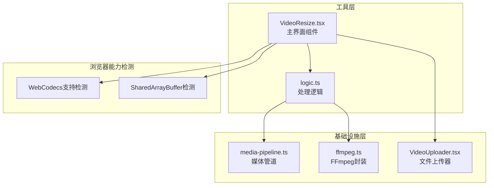
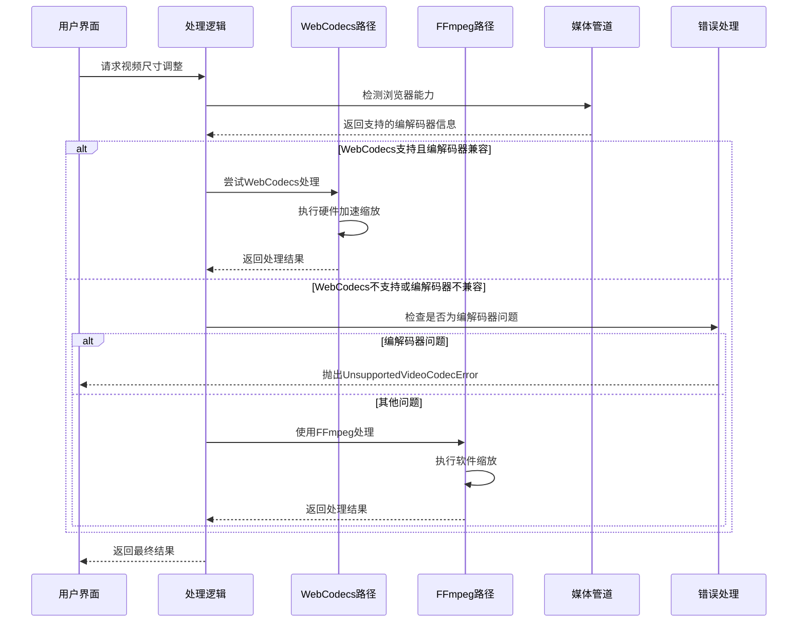
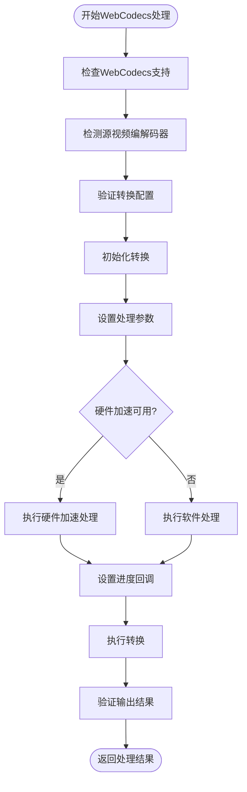
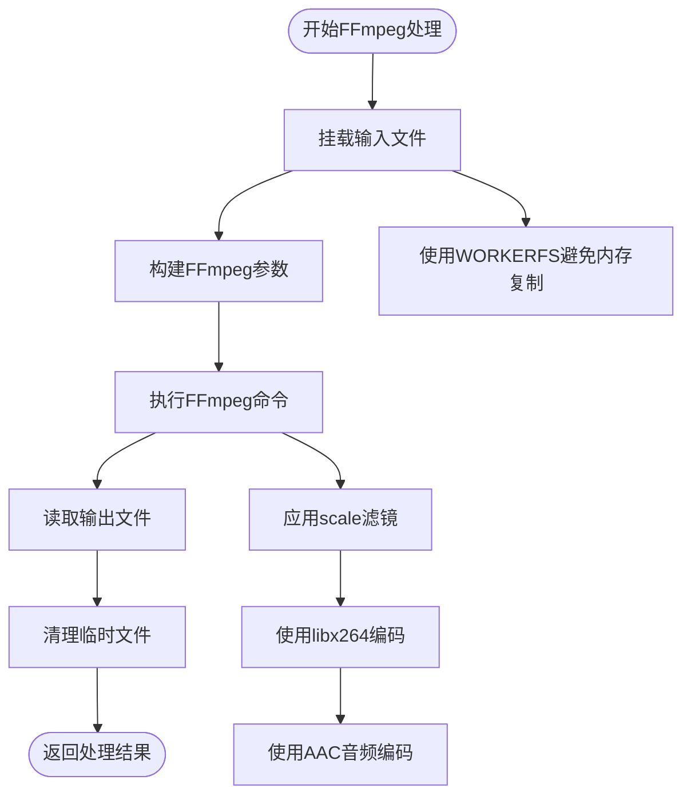
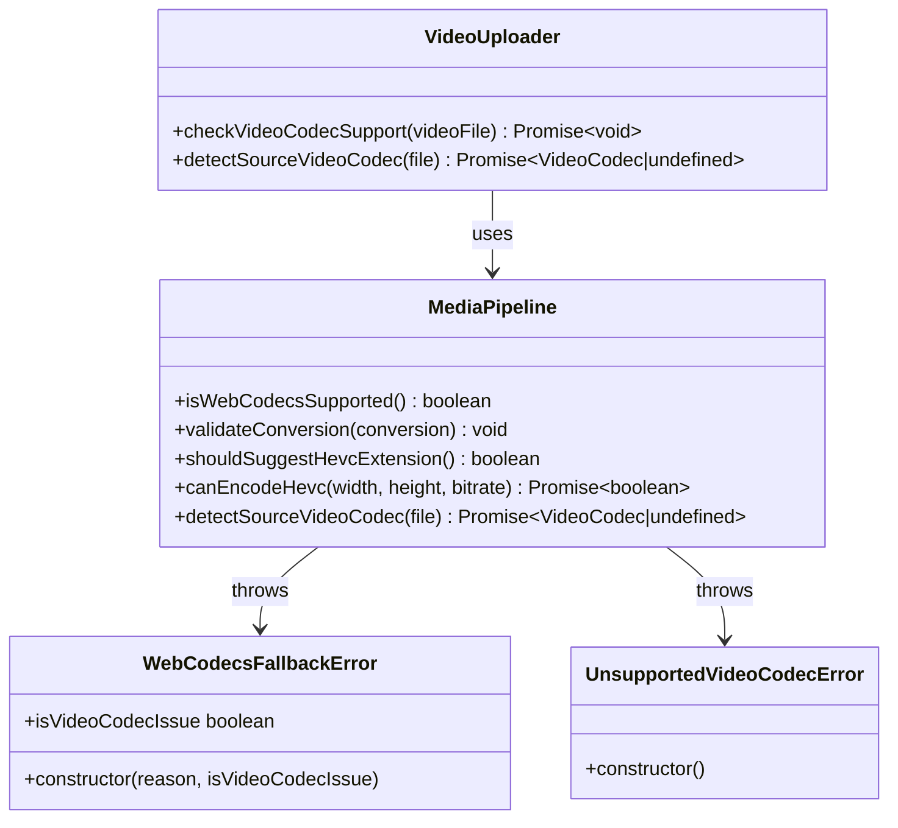
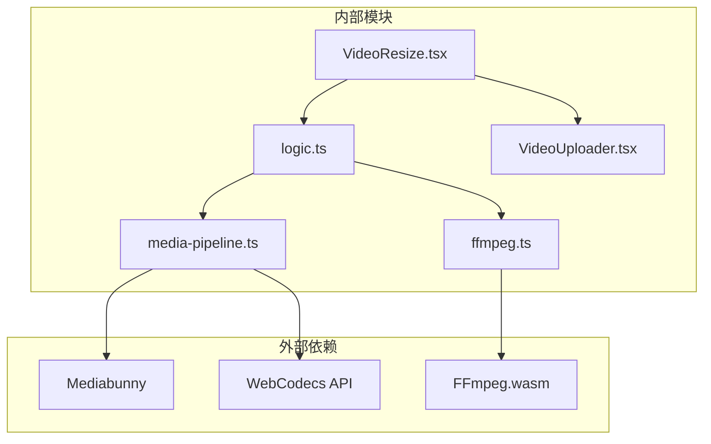

# 视频尺寸调整工具

<cite>
**本文档引用的文件**
- [VideoResize.tsx](file://src/tools/video/resize/VideoResize.tsx)
- [logic.ts](file://src/tools/video/resize/logic.ts)
- [media-pipeline.ts](file://src/lib/media-pipeline.ts)
- [ffmpeg.ts](file://src/lib/ffmpeg.ts)
- [VideoUploader.tsx](file://src/components/shared/VideoUploader.tsx)
- [README.md](file://README.md)
</cite>

## 目录
1. [简介](#简介)
2. [项目结构](#项目结构)
3. [核心组件](#核心组件)
4. [架构概览](#架构概览)
5. [详细组件分析](#详细组件分析)
6. [依赖关系分析](#依赖关系分析)
7. [性能考虑](#性能考虑)
8. [故障排除指南](#故障排除指南)
9. [结论](#结论)

## 简介

视频尺寸调整工具是一个基于浏览器的多媒体处理工具，专门用于调整视频的分辨率和尺寸。该工具提供了多种预设选项（720p、480p、360p）以及自定义宽度调整功能，支持在不上传文件到服务器的情况下进行本地视频处理。

该工具的核心优势在于其灵活的处理架构，能够根据用户的浏览器能力自动选择最优的处理路径：
- **WebCodecs + Mediabunny**：现代浏览器的硬件加速处理
- **FFmpeg.wasm**：兼容性回退方案
- **智能错误处理**：针对不支持的编解码器提供明确的用户指导

## 项目结构

该项目采用模块化的工具架构，每个工具都独立封装，便于维护和扩展。视频尺寸调整工具位于 `src/tools/video/resize/` 目录下，包含完整的前端界面和处理逻辑。

**图表来源**
- [VideoResize.tsx:1-173](file://src/tools/video/resize/VideoResize.tsx#L1-L173)
- [logic.ts:1-117](file://src/tools/video/resize/logic.ts#L1-L117)
- [media-pipeline.ts:1-175](file://src/lib/media-pipeline.ts#L1-L175)
- [ffmpeg.ts:1-144](file://src/lib/ffmpeg.ts#L1-L144)

**章节来源**
- [README.md:55-78](file://README.md#L55-L78)

## 核心组件

### 主界面组件 (VideoResize.tsx)

主界面组件负责用户交互和状态管理，提供了直观的视频尺寸调整界面：

- **预设选项**：720p、480p、360p标准分辨率
- **自定义宽度**：支持任意宽度调整（步长为2像素）
- **进度显示**：实时显示处理进度百分比
- **错误处理**：区分编解码器错误和其他处理错误
- **结果展示**：预览调整后的视频并提供下载功能

### 处理逻辑组件 (logic.ts)

处理逻辑组件实现了核心的视频尺寸调整算法，采用双路径架构：

- **WebCodecs路径**：利用现代浏览器的硬件加速能力
- **FFmpeg路径**：作为兼容性回退方案
- **智能回退**：针对不支持的编解码器提供明确的错误提示

### 媒体管道组件 (media-pipeline.ts)

媒体管道组件提供了浏览器媒体处理能力的抽象层：

- **编解码器检测**：自动检测浏览器支持的编解码器
- **错误分类**：区分编解码器问题和其他处理问题
- **硬件加速支持**：检测和利用硬件编码能力
- **HEVC扩展建议**：为Windows用户推荐安装HEVC扩展

### FFmpeg封装组件 (ffmpeg.ts)

FFmpeg封装组件提供了WebAssembly版本的FFmpeg的便捷接口：

- **单例模式**：确保FFmpeg实例的唯一性和高效复用
- **Promise队列**：序列化并发操作，避免内存冲突
- **WORKERFS挂载**：避免大文件的内存复制开销
- **进度回调**：提供精确的处理进度反馈

**章节来源**
- [VideoResize.tsx:21-173](file://src/tools/video/resize/VideoResize.tsx#L21-L173)
- [logic.ts:12-117](file://src/tools/video/resize/logic.ts#L12-L117)
- [media-pipeline.ts:7-175](file://src/lib/media-pipeline.ts#L7-L175)
- [ffmpeg.ts:10-144](file://src/lib/ffmpeg.ts#L10-L144)

## 架构概览

该工具采用了"能力检测 + 智能回退"的架构设计，确保在各种浏览器环境下都能提供最佳的用户体验。

**图表来源**
- [logic.ts:18-36](file://src/tools/video/resize/logic.ts#L18-L36)
- [media-pipeline.ts:32-53](file://src/lib/media-pipeline.ts#L32-L53)
- [media-pipeline.ts:66-91](file://src/lib/media-pipeline.ts#L66-L91)

## 详细组件分析

### WebCodecs处理流程

WebCodecs路径是该工具的高性能核心，利用现代浏览器的硬件加速能力：

**图表来源**
- [logic.ts:38-92](file://src/tools/video/resize/logic.ts#L38-L92)
- [media-pipeline.ts:59-91](file://src/lib/media-pipeline.ts#L59-L91)

### FFmpeg处理流程

FFmpeg路径提供了广泛的兼容性保证，适用于所有浏览器环境：

**图表来源**
- [ffmpeg.ts:99-144](file://src/lib/ffmpeg.ts#L99-L144)
- [logic.ts:94-116](file://src/tools/video/resize/logic.ts#L94-L116)

### 编解码器支持检测机制

该工具实现了复杂的编解码器支持检测系统：

**图表来源**
- [media-pipeline.ts:7-175](file://src/lib/media-pipeline.ts#L7-L175)
- [VideoUploader.tsx:131-212](file://src/components/shared/VideoUploader.tsx#L131-L212)

**章节来源**
- [logic.ts:18-36](file://src/tools/video/resize/logic.ts#L18-L36)
- [media-pipeline.ts:59-91](file://src/lib/media-pipeline.ts#L59-L91)
- [VideoUploader.tsx:131-212](file://src/components/shared/VideoUploader.tsx#L131-L212)

## 依赖关系分析

该工具的依赖关系相对简洁，主要依赖于几个核心模块：

**图表来源**
- [logic.ts:1-2](file://src/tools/video/resize/logic.ts#L1-L2)
- [media-pipeline.ts:4-5](file://src/lib/media-pipeline.ts#L4-L5)
- [ffmpeg.ts:1-2](file://src/lib/ffmpeg.ts#L1-L2)

### 关键依赖特性

1. **Mediabunny集成**：提供WebCodecs的高级封装
2. **FFmpeg.wasm兼容**：确保在所有浏览器中的功能一致性
3. **渐进式增强**：优先使用高性能路径，优雅降级
4. **错误隔离**：编解码器错误与处理错误分离处理

**章节来源**
- [README.md:26-33](file://README.md#L26-L33)
- [logic.ts:1-2](file://src/tools/video/resize/logic.ts#L1-L2)

## 性能考虑

### 处理速度对比

| 处理方式 | 速度表现 | 内存占用 | 兼容性 |
|---------|----------|----------|--------|
| WebCodecs + 硬件加速 | 最快 | 低 | 现代浏览器 |
| WebCodecs + 软件处理 | 中等 | 中等 | 支持WebCodecs |
| FFmpeg.wasm | 较慢 | 高 | 所有浏览器 |

### 内存优化策略

1. **WORKERFS挂载**：避免大文件的完整内存复制
2. **Promise队列**：串行化FFmpeg操作，减少内存峰值
3. **及时清理**：处理完成后立即释放临时资源
4. **对象URL管理**：使用专用Hook管理Blob URL生命周期

### 网络优化

1. **CDN加载**：FFmpeg核心文件从CDN按需加载
2. **懒加载**：仅在需要时加载处理模块
3. **缓存策略**：重复使用已加载的FFmpeg实例

## 故障排除指南

### 常见问题及解决方案

#### 编解码器不支持错误

**症状**：出现"视频编解码器不受支持"错误提示

**原因分析**：
- 浏览器不支持特定视频编解码器（如H.265/HEVC）
- 源视频使用了不常见的编解码器

**解决方案**：
1. 对于Windows + Chrome用户，安装HEVC视频扩展
2. 使用其他浏览器（如Firefox、Safari）
3. 重新编码视频为广泛支持的格式

#### 处理进度异常

**症状**：进度条卡在某个百分比

**排查步骤**：
1. 检查浏览器控制台是否有JavaScript错误
2. 确认文件大小是否过大（超过浏览器限制）
3. 尝试刷新页面重新开始处理

#### 内存不足错误

**症状**：处理过程中出现内存不足警告

**解决方法**：
1. 关闭其他占用内存的标签页
2. 减小目标分辨率或视频长度
3. 使用桌面版浏览器（通常有更大内存限制）

**章节来源**
- [VideoResize.tsx:60-71](file://src/tools/video/resize/VideoResize.tsx#L60-L71)
- [media-pipeline.ts:32-53](file://src/lib/media-pipeline.ts#L32-L53)
- [ffmpeg.ts:41-58](file://src/lib/ffmpeg.ts#L41-L58)

## 结论

视频尺寸调整工具展现了现代浏览器多媒体处理的最佳实践。通过智能的能力检测和渐进式增强架构，该工具能够在保证功能完整性的同时，最大化利用现代浏览器的硬件加速能力。

### 主要优势

1. **隐私保护**：所有处理都在本地完成，无文件上传
2. **性能优异**：优先使用WebCodecs硬件加速
3. **兼容性强**：完善的回退机制确保跨浏览器支持
4. **用户体验**：直观的界面和实时进度反馈
5. **错误处理**：清晰的错误分类和用户指导

### 技术亮点

- **双路径架构**：WebCodecs + FFmpeg.wasm的智能选择
- **编解码器检测**：自动识别和处理不支持的编解码器
- **内存优化**：WORKERFS挂载和Promise队列减少内存占用
- **渐进式增强**：根据浏览器能力提供最佳体验

该工具为浏览器端视频处理提供了一个优秀的参考实现，展示了如何在现代Web环境中平衡性能、兼容性和用户体验。