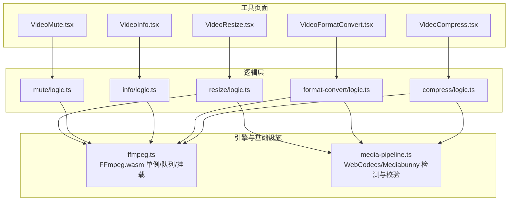
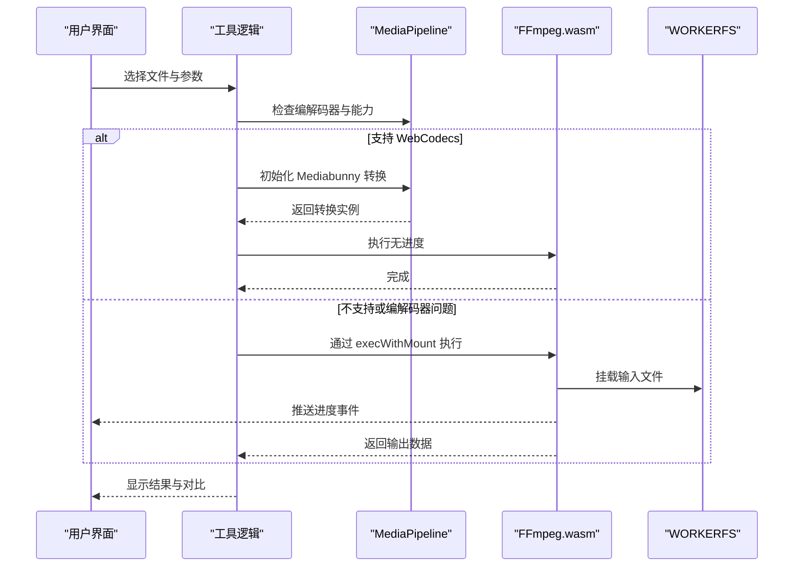
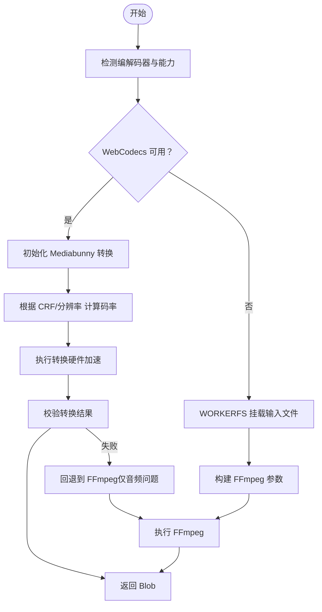
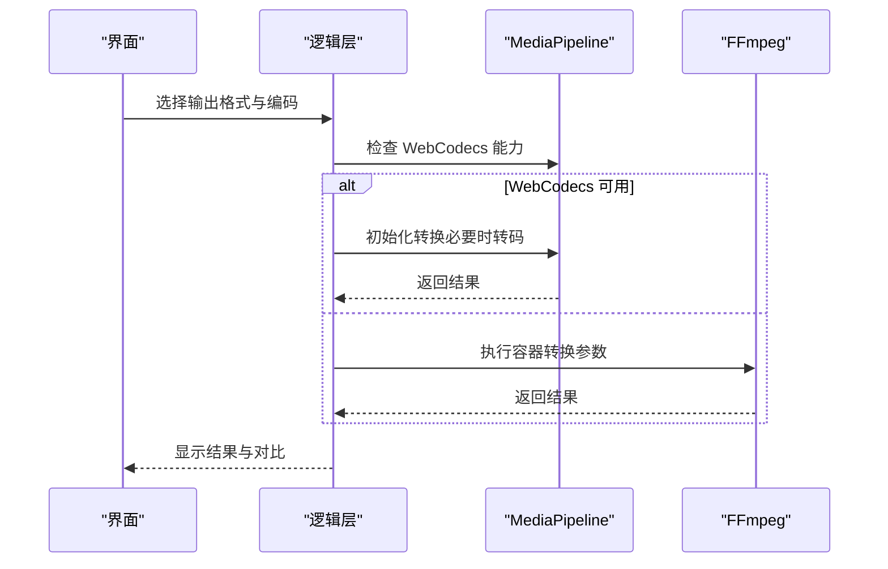
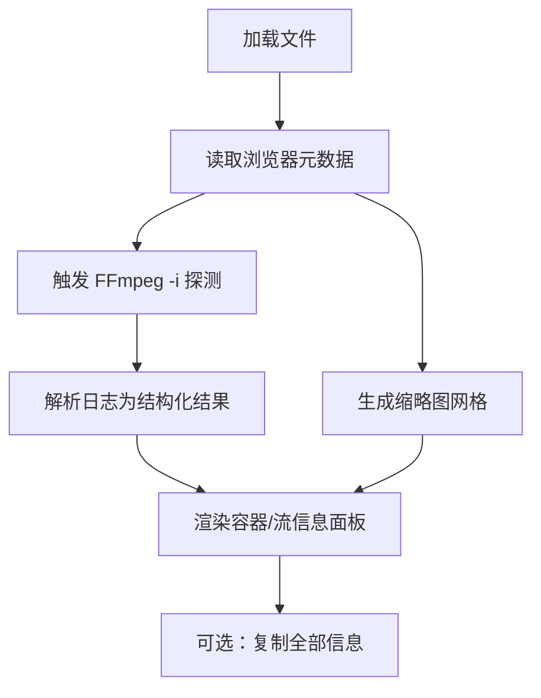
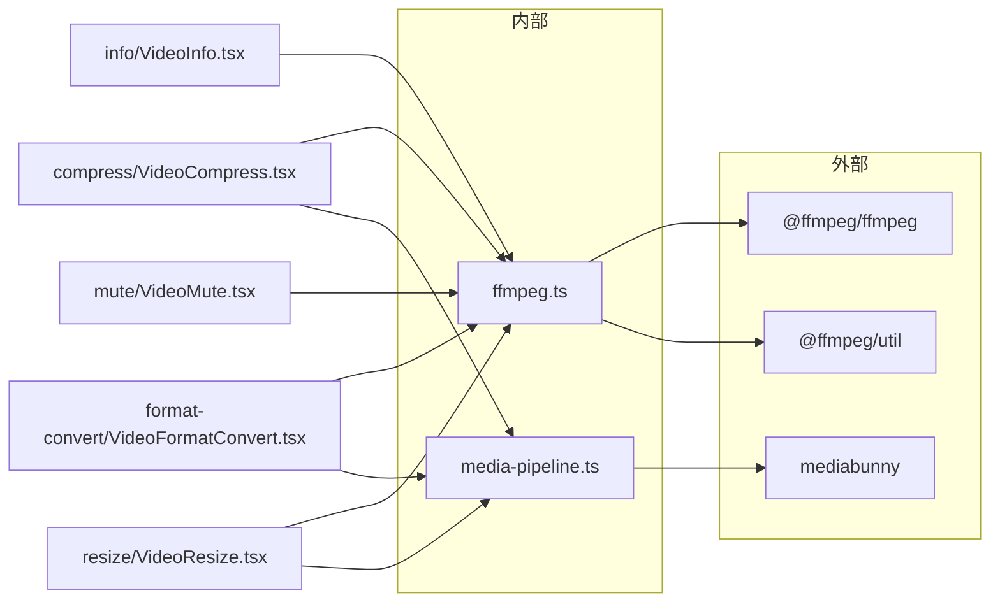

# 视频工具

<cite>
**本文引用的文件**
- [README.md](file://README.md)
- [package.json](file://package.json)
- [ffmpeg.ts](file://src/lib/ffmpeg.ts)
- [media-pipeline.ts](file://src/lib/media-pipeline.ts)
- [VideoCompress.tsx](file://src/tools/video/compress/VideoCompress.tsx)
- [logic.ts（压缩）](file://src/tools/video/compress/logic.ts)
- [VideoFormatConvert.tsx](file://src/tools/video/format-convert/VideoFormatConvert.tsx)
- [logic.ts（格式转换）](file://src/tools/video/format-convert/logic.ts)
- [VideoInfo.tsx](file://src/tools/video/info/VideoInfo.tsx)
- [logic.ts（信息提取）](file://src/tools/video/info/logic.ts)
- [VideoMute.tsx](file://src/tools/video/mute/VideoMute.tsx)
- [logic.ts（静音）](file://src/tools/video/mute/logic.ts)
- [VideoResize.tsx](file://src/tools/video/resize/VideoResize.tsx)
- [logic.ts（尺寸调整）](file://src/tools/video/resize/logic.ts)
</cite>

## 目录
1. [简介](#简介)
2. [项目结构](#项目结构)
3. [核心组件](#核心组件)
4. [架构总览](#架构总览)
5. [详细组件分析](#详细组件分析)
6. [依赖关系分析](#依赖关系分析)
7. [性能考量](#性能考量)
8. [故障排除指南](#故障排除指南)
9. [结论](#结论)
10. [附录](#附录)

## 简介
本项目是一个浏览器端多媒体工具箱，所有文件处理均在本地完成，零上传、零服务器。视频工具模块提供以下能力：
- 视频压缩：基于预设与高级参数，支持 H.264/H.265 编码、分辨率与帧率调整、音频码率控制、最大码率限制与 CRF 控制。
- 格式转换：支持 MP4、MKV、AVI 输出，自动检测是否可进行流复制（尤其是 MKV），否则进行转码。
- 尺寸调整：提供常见分辨率预设与自定义宽度，保持宽高比。
- 静音：移除音频轨道，保留视频。
- 信息提取：结合浏览器原生元数据与 FFmpeg 日志解析，输出容器、流、像素格式、色彩空间、扫描类型等详细信息，并生成关键帧缩略图。

技术要点：
- 引擎与加速：优先使用 WebCodecs（Mediabunny）进行硬件加速处理；对不支持或不兼容的编解码器回退至 FFmpeg.wasm。
- 进度与内存：通过 WORKERFS 挂载输入文件避免全量内存拷贝，执行队列串行化以规避单线程限制。
- 国际化与多语言：覆盖 21 种语言，工具页面按分类组织，便于扩展与维护。

章节来源
- [README.md: 1-89:1-89](file://README.md#L1-L89)

## 项目结构
视频工具位于 src/tools/video 下，每个工具由三部分组成：
- 客户端页面组件：负责 UI、状态管理、进度显示与结果预览。
- 业务逻辑模块：封装具体处理流程，统一调用 FFmpeg 或 WebCodecs。
- 工具注册与路由：通过 Next.js App Router 与工具注册表组织页面。

图表来源
- [VideoCompress.tsx: 1-624:1-624](file://src/tools/video/compress/VideoCompress.tsx#L1-L624)
- [VideoFormatConvert.tsx: 1-225:1-225](file://src/tools/video/format-convert/VideoFormatConvert.tsx#L1-L225)
- [VideoInfo.tsx: 1-308:1-308](file://src/tools/video/info/VideoInfo.tsx#L1-L308)
- [VideoMute.tsx: 1-98:1-98](file://src/tools/video/mute/VideoMute.tsx#L1-L98)
- [VideoResize.tsx: 1-173:1-173](file://src/tools/video/resize/VideoResize.tsx#L1-L173)
- [ffmpeg.ts: 1-144:1-144](file://src/lib/ffmpeg.ts#L1-L144)
- [media-pipeline.ts: 1-175:1-175](file://src/lib/media-pipeline.ts#L1-L175)

章节来源
- [README.md: 55-78:55-78](file://README.md#L55-L78)
- [package.json: 11-32:11-32](file://package.json#L11-L32)

## 核心组件
- FFmpeg.wasm 封装：提供单例加载、进度监听、执行队列与 WORKERFS 挂载，避免内存拷贝与并发冲突。
- WebCodecs/Mediabunny 管线：检测浏览器编解码能力，自动选择硬件加速路径；对不支持的编解码器抛出错误并提示安装扩展（如 Windows 上的 HEVC 扩展）。
- 视频工具逻辑：统一抽象“简单模式（预设）”与“高级模式（参数）”，在 WebCodecs 与 FFmpeg 之间无缝切换。

章节来源
- [ffmpeg.ts: 10-144:10-144](file://src/lib/ffmpeg.ts#L10-L144)
- [media-pipeline.ts: 7-175:7-175](file://src/lib/media-pipeline.ts#L7-L175)

## 架构总览
整体处理流程分为两条路径：
- WebCodecs 路径：适合大多数 H.264/H.265 浏览器可解码的视频，优先硬件加速，性能更佳。
- FFmpeg 路径：当 WebCodecs 不可用或编解码器不受支持时回退，保证兼容性。

图表来源
- [logic.ts（压缩）: 87-112:87-112](file://src/tools/video/compress/logic.ts#L87-L112)
- [logic.ts（格式转换）: 38-63:38-63](file://src/tools/video/format-convert/logic.ts#L38-L63)
- [logic.ts（尺寸调整）: 12-36:12-36](file://src/tools/video/resize/logic.ts#L12-L36)
- [ffmpeg.ts: 99-144:99-144](file://src/lib/ffmpeg.ts#L99-L144)

## 详细组件分析

### 视频压缩（VideoCompress）
- 功能概览
  - 提供“高质量/中等质量/低质量”三档预设，以及“高级模式”精细参数（CRF、编码预设、分辨率、帧率、音频码率、最大码率）。
  - 自动检测源视频编解码器，优先输出同编码格式（H.264/H.265），并在不支持时回退。
  - 结果对比：显示源与输出的尺寸、时长、码率、FPS 与节省百分比。
- 技术实现
  - WebCodecs 路径：使用 Mediabunny 的 Conversion，自动计算视频码率（基于 CRF 与分辨率），启用硬件加速，严格校验转换结果。
  - FFmpeg 路径：通过 execWithMount 执行 scale/fps + libx264 + aac 组合，支持最大码率与缓冲区设置。
  - 进度：WebCodecs 使用转换实例回调；FFmpeg 通过进度事件映射到 0-100。
- 参数调优建议
  - CRF 与分辨率：CRF 降低显著提升质量但增大体积；分辨率按目标平台（移动端/桌面）选择。
  - 最大码率：用于控制峰值带宽，配合缓冲区参数提升稳定性。
  - 编码预设：越快的预设越快但质量略降；“fast”在速度与质量间较均衡。
- 错误处理
  - 对于不支持的视频编解码器（如 H.265/HEVC、VP9、AV1），直接抛出“不支持视频编解码器”错误，避免性能劣化回退。
  - 对于音频问题导致的转换失败，回退至 FFmpeg。

图表来源
- [logic.ts（压缩）: 87-112:87-112](file://src/tools/video/compress/logic.ts#L87-L112)
- [logic.ts（压缩）: 114-206:114-206](file://src/tools/video/compress/logic.ts#L114-L206)
- [logic.ts（压缩）: 208-262:208-262](file://src/tools/video/compress/logic.ts#L208-L262)
- [ffmpeg.ts: 99-144:99-144](file://src/lib/ffmpeg.ts#L99-L144)

章节来源
- [VideoCompress.tsx: 45-624:45-624](file://src/tools/video/compress/VideoCompress.tsx#L45-L624)
- [logic.ts（压缩）: 21-54:21-54](file://src/tools/video/compress/logic.ts#L21-L54)
- [logic.ts（压缩）: 70-85:70-85](file://src/tools/video/compress/logic.ts#L70-L85)

### 格式转换（VideoFormatConvert）
- 功能概览
  - 支持输出为 MP4、MKV、AVI；MP4/AVI 总是转码；MKV 若目标编码与源一致则进行流复制以提升性能。
  - 自动检测源视频编解码器，智能提示是否需要转码。
- 技术实现
  - WebCodecs 路径：根据目标容器选择 Mp4OutputFormat 或 MkvOutputFormat；若需转码则指定输出编码（默认 H.264）。
  - FFmpeg 路径：直接传入各容器的转码参数数组。
- 使用建议
  - 导出 MKV 且目标编码与源一致时可获得更快的速度与更低的 CPU 占用。
  - 导出 MP4/AVI 时会强制转码，注意时间成本。

图表来源
- [VideoFormatConvert.tsx: 14-225:14-225](file://src/tools/video/format-convert/VideoFormatConvert.tsx#L14-L225)
- [logic.ts（格式转换）: 38-63:38-63](file://src/tools/video/format-convert/logic.ts#L38-L63)
- [logic.ts（格式转换）: 65-133:65-133](file://src/tools/video/format-convert/logic.ts#L65-L133)
- [logic.ts（格式转换）: 135-152:135-152](file://src/tools/video/format-convert/logic.ts#L135-L152)

章节来源
- [VideoFormatConvert.tsx: 14-225:14-225](file://src/tools/video/format-convert/VideoFormatConvert.tsx#L14-L225)
- [logic.ts（格式转换）: 6-10:6-10](file://src/tools/video/format-convert/logic.ts#L6-L10)
- [logic.ts（格式转换）: 12-36:12-36](file://src/tools/video/format-convert/logic.ts#L12-L36)

### 信息提取（VideoInfo）
- 功能概览
  - 自动读取浏览器原生元数据（尺寸、时长、估计码率、FPS），触发 FFmpeg 日志解析，提取容器、流、像素格式、色彩空间、扫描类型等。
  - 自动生成关键帧缩略图网格，便于直观判断质量与内容。
- 技术实现
  - 浏览器元数据：通过 VideoUploader 提供的回调自动触发 FFmpeg 探测。
  - FFmpeg 探测：通过 -i 输出日志，解析容器、时长、总码率与各流详情。
  - 缩略图：使用 <video>+<canvas> 生成指定时间点截图。
- 输出与复制
  - 提供“复制全部信息”按钮，一键复制结构化文本，便于分享与记录。

图表来源
- [VideoInfo.tsx: 23-308:23-308](file://src/tools/video/info/VideoInfo.tsx#L23-L308)
- [logic.ts（信息提取）: 33-71:33-71](file://src/tools/video/info/logic.ts#L33-L71)
- [logic.ts（信息提取）: 82-140:82-140](file://src/tools/video/info/logic.ts#L82-L140)
- [logic.ts（信息提取）: 230-272:230-272](file://src/tools/video/info/logic.ts#L230-L272)

章节来源
- [VideoInfo.tsx: 23-308:23-308](file://src/tools/video/info/VideoInfo.tsx#L23-L308)
- [logic.ts（信息提取）: 3-26:3-26](file://src/tools/video/info/logic.ts#L3-L26)

### 静音（VideoMute）
- 功能概览
  - 移除音频轨道，保留视频，适用于需要无声视频的场景（如社交平台、背景视频等）。
- 技术实现
  - FFmpeg 路径：禁用音频轨道（-an），视频轨道直接复制（-c:v copy）。
- 使用建议
  - 输出容器与原文件扩展名一致，避免不必要的转码。

章节来源
- [VideoMute.tsx: 13-98:13-98](file://src/tools/video/mute/VideoMute.tsx#L13-L98)
- [logic.ts（静音）: 3-14:3-14](file://src/tools/video/mute/logic.ts#L3-L14)

### 尺寸调整（VideoResize）
- 功能概览
  - 提供 720p/480p/360p 预设与自定义宽度，保持宽高比，输出 H.264 MP4。
- 技术实现
  - WebCodecs 路径：使用 Mediabunny 的 Conversion，设置目标宽度与 contain 适配，启用硬件加速。
  - FFmpeg 路径：通过 scale 滤镜调整宽度（高度按比例自动），输出 MP4。
- 错误处理
  - 对于不支持的视频编解码器，直接抛出“不支持视频编解码器”错误，避免性能劣化回退。

章节来源
- [VideoResize.tsx: 21-173:21-173](file://src/tools/video/resize/VideoResize.tsx#L21-L173)
- [logic.ts（尺寸调整）: 12-36:12-36](file://src/tools/video/resize/logic.ts#L12-L36)
- [logic.ts（尺寸调整）: 38-92:38-92](file://src/tools/video/resize/logic.ts#L38-L92)
- [logic.ts（尺寸调整）: 94-117:94-117](file://src/tools/video/resize/logic.ts#L94-L117)

## 依赖关系分析
- 外部依赖
  - FFmpeg.wasm：提供跨浏览器的命令行视频处理能力。
  - Mediabunny：提供 WebCodecs 的封装与硬件加速能力。
  - @ffmpeg/util：将核心资源转为 Blob URL，便于加载。
- 内部依赖
  - ffmpeg.ts：统一 FFmpeg 加载、进度与执行队列。
  - media-pipeline.ts：统一编解码器检测、能力查询与错误类型。

图表来源
- [package.json: 11-32:11-32](file://package.json#L11-L32)
- [ffmpeg.ts: 1-144:1-144](file://src/lib/ffmpeg.ts#L1-L144)
- [media-pipeline.ts: 1-175:1-175](file://src/lib/media-pipeline.ts#L1-L175)

章节来源
- [package.json: 11-32:11-32](file://package.json#L11-L32)

## 性能考量
- 硬件加速优先
  - WebCodecs（Mediabunny）在支持的平台上提供最佳性能；优先启用“prefer-hardware”。
  - 对于 H.265/HEVC，Windows Chrome 可通过安装 HEVC 扩展提升解码能力。
- 内存与 I/O
  - 使用 WORKERFS 挂载避免将文件完整复制到内存；执行完成后及时释放 MEMFS 数据。
  - 执行队列串行化，避免并发挂载点冲突与资源争用。
- 参数权衡
  - CRF 与分辨率是影响体积与质量的关键；最大码率与缓冲区有助于稳定码控。
  - 预设“fast”在速度与质量间取得良好平衡；更快速预设会牺牲一定质量。
- 回退策略
  - WebCodecs 不可用或编解码器不受支持时回退至 FFmpeg；音频问题可继续回退，避免整体失败。

章节来源
- [media-pipeline.ts: 98-123:98-123](file://src/lib/media-pipeline.ts#L98-L123)
- [ffmpeg.ts: 99-144:99-144](file://src/lib/ffmpeg.ts#L99-L144)
- [logic.ts（压缩）: 70-85:70-85](file://src/tools/video/compress/logic.ts#L70-L85)
- [logic.ts（压缩）: 246-252:246-252](file://src/tools/video/compress/logic.ts#L246-L252)

## 故障排除指南
- “不支持视频编解码器”
  - 症状：工具直接报错，提示不支持当前视频编解码器。
  - 原因：WebCodecs 无法解码该编解码器（如 H.265/HEVC、VP9、AV1）。
  - 处理：避免回退到 FFmpeg（性能差），改用其他工具或更换源视频。
- “需要安装 HEVC 扩展（Windows + Chrome）”
  - 症状：提示安装 HEVC 视频扩展。
  - 处理：根据提示安装扩展后重试。
- “进度未更新或卡住”
  - 症状：进度停留在 0 或长时间无响应。
  - 处理：确认浏览器支持 SharedArrayBuffer；检查网络与 CDN 加载 FFmpeg 核心资源；尝试刷新页面。
- “输出体积异常增大”
  - 症状：压缩后体积反而增大。
  - 处理：降低 CRF、选择更低分辨率、启用最大码率限制；确认源视频是否已高度压缩。
- “音频丢失或静音无效”
  - 症状：导出视频无声音。
  - 处理：确认静音工具是否正确执行；检查源视频是否存在音频轨道。

章节来源
- [media-pipeline.ts: 32-53:32-53](file://src/lib/media-pipeline.ts#L32-L53)
- [media-pipeline.ts: 98-104:98-104](file://src/lib/media-pipeline.ts#L98-L104)
- [VideoCompress.tsx: 123-134:123-134](file://src/tools/video/compress/VideoCompress.tsx#L123-L134)
- [VideoFormatConvert.tsx: 174-184:174-184](file://src/tools/video/format-convert/VideoFormatConvert.tsx#L174-L184)
- [VideoResize.tsx: 122-132:122-132](file://src/tools/video/resize/VideoResize.tsx#L122-L132)

## 结论
本视频工具模块通过 WebCodecs 与 FFmpeg.wasm 的双轨设计，在性能与兼容性之间取得平衡。借助 Mediabunny 的硬件加速与严格的编解码器校验，用户可在浏览器内高效完成视频压缩、格式转换、尺寸调整、静音与信息提取等任务。同时，完善的错误提示与参数调优建议帮助用户在不同场景下实现质量与性能的最佳折中。

## 附录
- 支持的容器与编码
  - 输出容器：MP4、MKV、AVI。
  - 视频编码：H.264（AVC）、H.265（HEVC，受浏览器支持限制）。
  - 音频编码：AAC（默认）。
- 关键术语
  - CRF：恒定速率因子，数值越小质量越高、体积越大。
  - 码率：单位时间内传输的数据量，常以 kbps/Mbps 表示。
  - 硬件加速：利用 GPU 或专用解码芯片提升处理效率。
- 使用场景与参数建议
  - 社交平台短视频：分辨率 720p/480p，CRF 28-33，最大码率 2-5M。
  - 桌面演示视频：分辨率 1080p，CRF 23-28，最大码率 5-10M。
  - 存储受限环境：降低分辨率与 CRF，启用最大码率限制。