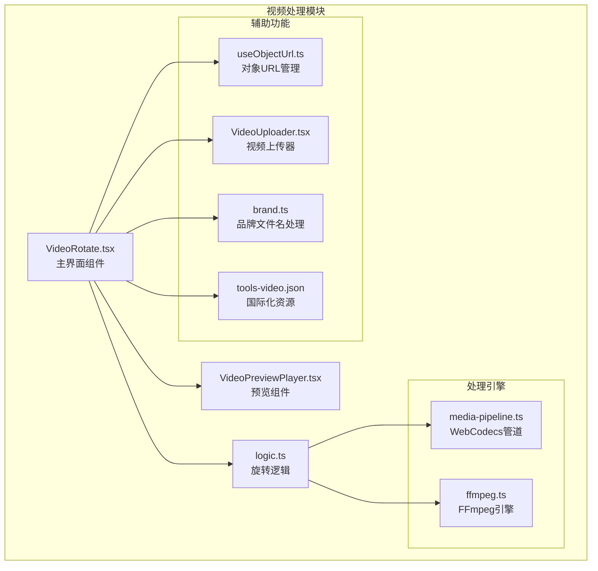
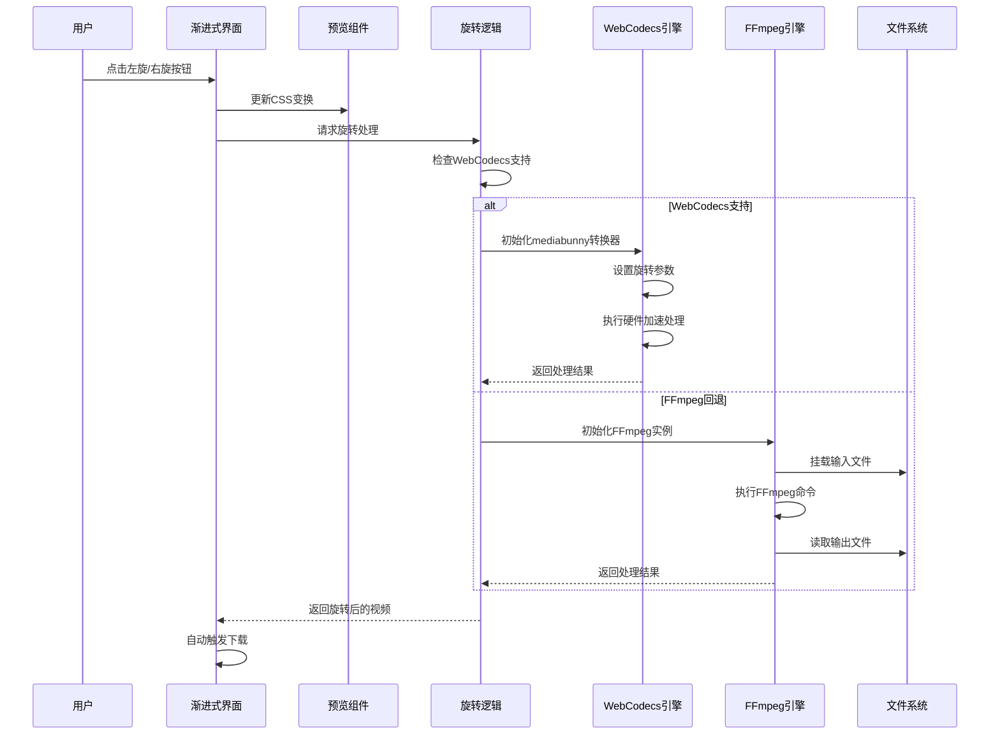
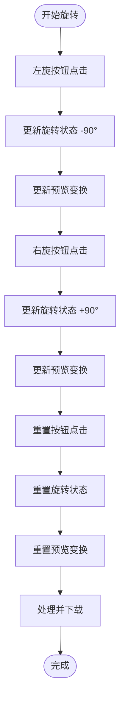
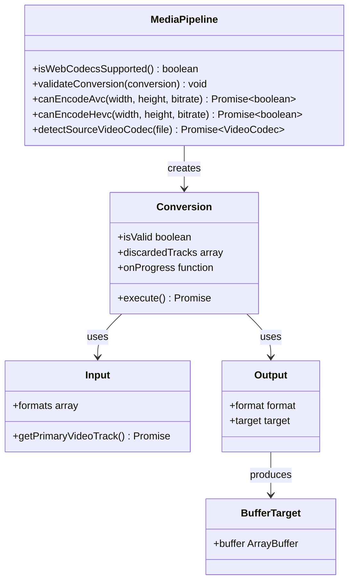
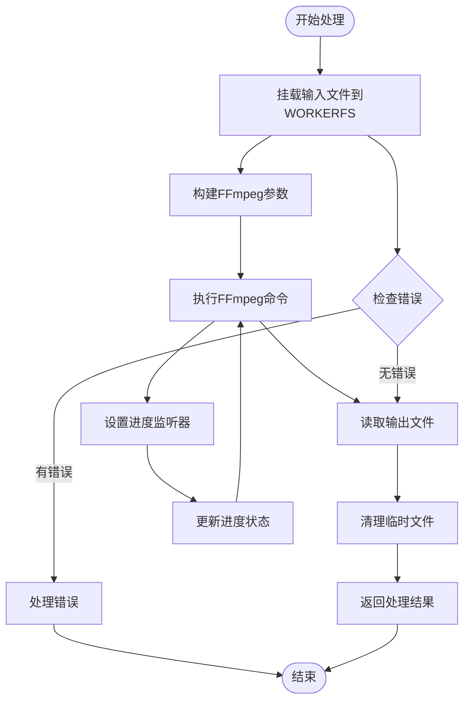
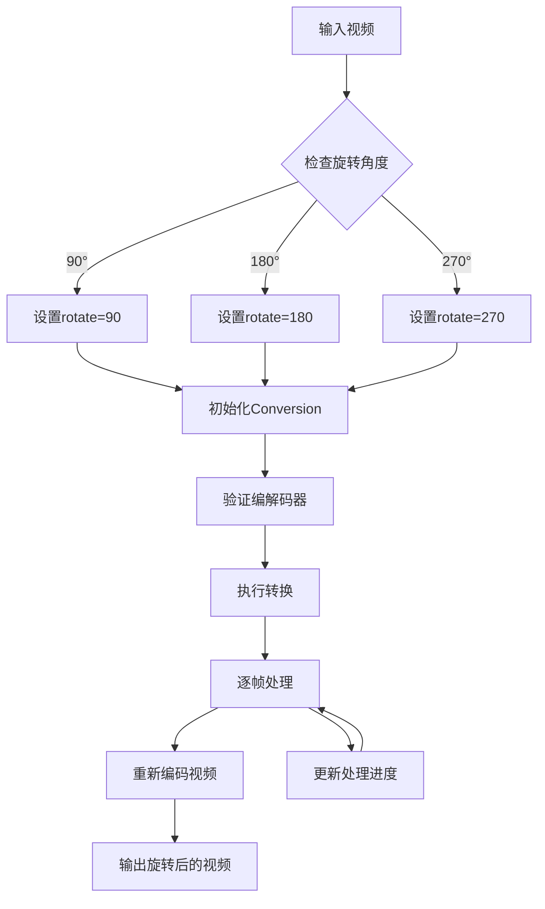
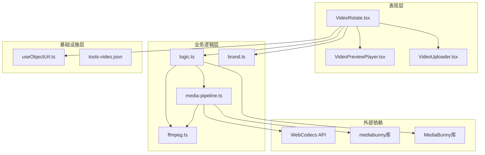
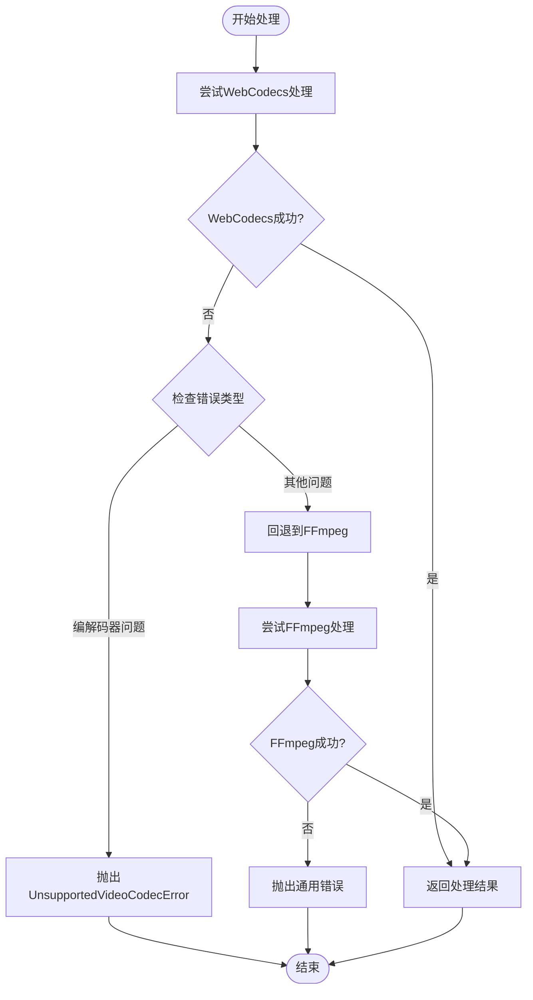

# 视频旋转工具

<cite>
**本文档引用的文件**
- [VideoRotate.tsx](file://src/tools/video/rotate/VideoRotate.tsx)
- [VideoPreviewPlayer.tsx](file://src/tools/video/rotate/VideoPreviewPlayer.tsx)
- [logic.ts](file://src/tools/video/rotate/logic.ts)
- [media-pipeline.ts](file://src/lib/media-pipeline.ts)
- [ffmpeg.ts](file://src/lib/ffmpeg.ts)
- [useObjectUrl.ts](file://src/lib/hooks/useObjectUrl.ts)
- [VideoUploader.tsx](file://src/components/shared/VideoUploader.tsx)
- [brand.ts](file://src/lib/brand.ts)
- [tools-video.json](file://messages/zh-Hans/tools-video.json)
</cite>

## 更新摘要
**变更内容**
- 新增渐进式旋转系统，支持左旋、右旋、重置操作
- 新增VideoPreviewPlayer.tsx专用预览组件
- 改进WebCodecs处理引擎，使用mediabunny库
- 实现自动下载功能，处理完成后自动触发文件下载
- 优化用户界面，提供更好的用户体验

## 目录
1. [简介](#简介)
2. [项目结构](#项目结构)
3. [核心组件](#核心组件)
4. [架构概览](#架构概览)
5. [详细组件分析](#详细组件分析)
6. [依赖关系分析](#依赖关系分析)
7. [性能考虑](#性能考虑)
8. [故障排除指南](#故障排除指南)
9. [结论](#结论)

## 简介

视频旋转工具是一个基于浏览器的视频处理工具，允许用户将视频旋转90°、180°或270°。该工具采用了渐进式旋转系统，用户可以通过点击左旋或右旋按钮逐步实现所需的旋转角度。工具提供了两种处理路径：基于WebCodecs的硬件加速处理和基于FFmpeg.wasm的传统处理方式。工具支持多种视频格式，包括MP4、WebM、MKV和AVI，并在处理过程中保持音视频的同步。

## 项目结构

视频旋转工具位于项目的视频处理模块中，采用模块化的架构设计：

**图表来源**
- [VideoRotate.tsx:1-208](file://src/tools/video/rotate/VideoRotate.tsx#L1-L208)
- [VideoPreviewPlayer.tsx:1-181](file://src/tools/video/rotate/VideoPreviewPlayer.tsx#L1-L181)
- [logic.ts:1-94](file://src/tools/video/rotate/logic.ts#L1-L94)
- [media-pipeline.ts:1-175](file://src/lib/media-pipeline.ts#L1-L175)
- [ffmpeg.ts:1-144](file://src/lib/ffmpeg.ts#L1-L144)

**章节来源**
- [VideoRotate.tsx:1-208](file://src/tools/video/rotate/VideoRotate.tsx#L1-L208)
- [VideoPreviewPlayer.tsx:1-181](file://src/tools/video/rotate/VideoPreviewPlayer.tsx#L1-L181)
- [logic.ts:1-94](file://src/tools/video/rotate/logic.ts#L1-L94)

## 核心组件

### 主界面组件 (VideoRotate.tsx)

主界面组件负责用户交互和状态管理，提供直观的视频旋转操作界面：

- **渐进式旋转控制**: 提供左旋、右旋、重置三个按钮，支持逐步旋转
- **文件上传**: 集成VideoUploader组件，支持多种视频格式的拖拽上传
- **实时预览**: 使用VideoPreviewPlayer组件提供旋转预览功能
- **进度显示**: 实时显示处理进度
- **自动下载**: 处理完成后自动触发文件下载
- **错误处理**: 处理各种异常情况，包括编解码器不支持

### 预览组件 (VideoPreviewPlayer.tsx)

VideoPreviewPlayer.tsx是一个专门的视频预览组件，提供：

- **CSS变换预览**: 通过transform属性实时显示旋转效果
- **播放控制**: 包含播放/暂停、进度条、音量控制等标准播放器功能
- **交互式预览**: 点击视频可切换播放状态
- **状态同步**: 与主界面的旋转状态保持同步

### 旋转逻辑组件 (logic.ts)

旋转逻辑组件实现了核心的视频旋转算法：

- **角度映射**: 将旋转角度映射到相应的FFmpeg滤镜参数
- **WebCodecs支持**: 基于mediabunny库的硬件加速处理
- **错误处理**: 实现了完善的错误处理机制
- **进度回调**: 支持进度状态的实时反馈

**章节来源**
- [VideoRotate.tsx:23-208](file://src/tools/video/rotate/VideoRotate.tsx#L23-L208)
- [VideoPreviewPlayer.tsx:20-181](file://src/tools/video/rotate/VideoPreviewPlayer.tsx#L20-L181)
- [logic.ts:10-94](file://src/tools/video/rotate/logic.ts#L10-L94)

## 架构概览

视频旋转工具采用了渐进式旋转系统和双引擎架构，提供了灵活的处理方案：

**图表来源**
- [VideoRotate.tsx:55-81](file://src/tools/video/rotate/VideoRotate.tsx#L55-L81)
- [logic.ts:10-20](file://src/tools/video/rotate/logic.ts#L10-L20)
- [media-pipeline.ts:26-91](file://src/lib/media-pipeline.ts#L26-L91)
- [ffmpeg.ts:99-143](file://src/lib/ffmpeg.ts#L99-L143)

## 详细组件分析

### 渐进式旋转系统

渐进式旋转系统提供了直观的旋转操作体验：

**图表来源**
- [VideoRotate.tsx:16-108](file://src/tools/video/rotate/VideoRotate.tsx#L16-L108)

渐进式旋转系统的特点：
- **直观操作**: 用户通过连续点击实现90°递增旋转
- **实时预览**: CSS变换提供即时视觉反馈
- **状态管理**: 通过animationRotation和rotation状态区分预览和实际旋转
- **灵活控制**: 支持任意角度组合（90°、180°、270°）

### WebCodecs处理引擎

WebCodecs处理引擎基于mediabunny库提供了硬件加速的视频处理能力：

**图表来源**
- [media-pipeline.ts:59-91](file://src/lib/media-pipeline.ts#L59-L91)
- [media-pipeline.ts:149-174](file://src/lib/media-pipeline.ts#L149-L174)

WebCodecs处理引擎的特点：
- **硬件加速**: 利用GPU进行视频编码解码
- **实时处理**: 支持流式处理和实时预览
- **高质量输出**: 保持视频的高质量特性
- **自动回退**: 当编解码器不支持时自动切换到FFmpeg

### FFmpeg处理引擎

FFmpeg处理引擎提供了传统的视频处理能力：

**图表来源**
- [ffmpeg.ts:99-143](file://src/lib/ffmpeg.ts#L99-L143)

FFmpeg处理引擎的特点：
- **参数化处理**: 支持复杂的视频处理参数
- **进度跟踪**: 提供详细的处理进度反馈
- **内存优化**: 使用WORKERFS避免内存拷贝
- **队列管理**: 串行化处理任务避免冲突

### 旋转算法实现

旋转算法基于mediabunny库的WebCodecs管道实现：

**图表来源**
- [logic.ts:26-94](file://src/tools/video/rotate/logic.ts#L26-L94)

旋转算法的关键特性：
- **硬件加速**: 使用WebCodecs API进行GPU加速处理
- **像素重排**: 通过rotate参数实现像素位置的重新排列
- **保持质量**: 在重新编码过程中保持视频质量
- **角度映射**: 90°、180°、270°分别对应不同的rotate参数
- **性能优化**: 180°旋转通过两次90°旋转实现

**章节来源**
- [VideoRotate.tsx:16-108](file://src/tools/video/rotate/VideoRotate.tsx#L16-L108)
- [VideoPreviewPlayer.tsx:20-181](file://src/tools/video/rotate/VideoPreviewPlayer.tsx#L20-L181)
- [logic.ts:26-94](file://src/tools/video/rotate/logic.ts#L26-L94)

## 依赖关系分析

视频旋转工具的依赖关系展现了清晰的分层架构：

**图表来源**
- [VideoRotate.tsx:3-14](file://src/tools/video/rotate/VideoRotate.tsx#L3-L14)
- [logic.ts:1-35](file://src/tools/video/rotate/logic.ts#L1-L35)
- [media-pipeline.ts:1-175](file://src/lib/media-pipeline.ts#L1-L175)

**章节来源**
- [VideoRotate.tsx:3-14](file://src/tools/video/rotate/VideoRotate.tsx#L3-L14)
- [logic.ts:1-35](file://src/tools/video/rotate/logic.ts#L1-L35)

## 性能考虑

### 内存使用优化

视频旋转工具采用了多种内存优化策略：

1. **WORKERFS挂载**: 使用WORKERFS避免完整的文件内存拷贝
2. **及时清理**: 处理完成后立即删除MEMFS中的临时文件
3. **对象URL管理**: 自动管理Object URL的生命周期
4. **串行化处理**: 通过Promise队列避免并发操作导致的内存峰值
5. **渐进式预览**: CSS变换预览避免实际视频处理的内存开销

### 处理速度提升

为了提升处理速度，工具实现了以下优化：

1. **硬件加速**: WebCodecs引擎利用GPU进行视频处理
2. **进度预估**: 基于FFmpeg的进度事件提供准确的处理进度
3. **智能回退**: 当WebCodecs不可用时自动切换到FFmpeg
4. **编解码器检测**: 预先检测源视频的编解码器类型
5. **自动下载**: 处理完成后自动触发文件下载，减少用户操作步骤

### 性能基准测试

根据工具的实现，可以预期以下性能特征：

- **WebCodecs模式**: 处理速度通常比传统模式快2-4倍
- **内存使用**: 通常不超过原始视频文件大小的2-3倍
- **处理时间**: 取决于视频长度和复杂度，一般在几秒到几分钟之间
- **预览响应**: CSS变换预览响应时间小于100ms

**章节来源**
- [ffmpeg.ts:99-143](file://src/lib/ffmpeg.ts#L99-L143)
- [media-pipeline.ts:110-141](file://src/lib/media-pipeline.ts#L110-L141)
- [VideoPreviewPlayer.tsx:100-121](file://src/tools/video/rotate/VideoPreviewPlayer.tsx#L100-L121)

## 故障排除指南

### 常见问题及解决方案

1. **编解码器不支持**
   - 症状: 显示"Unsupported video codec"错误
   - 解决方案: 安装HEVC扩展程序或使用其他浏览器

2. **浏览器兼容性问题**
   - 症状: 页面显示不支持提示
   - 解决方案: 更新到最新版本的现代浏览器

3. **处理进度停滞**
   - 症状: 进度条长时间不动
   - 解决方案: 检查网络连接，尝试刷新页面重新开始

4. **输出文件损坏**
   - 症状: 下载的视频无法播放
   - 解决方案: 重新处理，检查磁盘空间是否充足

5. **自动下载失败**
   - 症状: 处理完成后未自动下载
   - 解决方案: 检查浏览器弹窗阻止设置，手动点击下载按钮

### 错误处理机制

工具实现了多层次的错误处理：

**图表来源**
- [logic.ts:15-20](file://src/tools/video/rotate/logic.ts#L15-L20)
- [media-pipeline.ts:32-41](file://src/lib/media-pipeline.ts#L32-L41)

**章节来源**
- [logic.ts:15-20](file://src/tools/video/rotate/logic.ts#L15-L20)
- [media-pipeline.ts:32-53](file://src/lib/media-pipeline.ts#L32-L53)

## 结论

视频旋转工具是一个功能完整、性能优秀的浏览器端视频处理工具。其主要特点包括：

1. **渐进式旋转系统**: 通过左旋、右旋、重置按钮提供直观的旋转操作体验
2. **硬件加速处理**: 基于WebCodecs和mediabunny库的GPU加速处理
3. **实时预览功能**: VideoPreviewPlayer组件提供CSS变换预览
4. **自动下载功能**: 处理完成后自动触发文件下载
5. **用户友好界面**: 简洁直观的操作界面和实时进度反馈
6. **质量保证**: 在处理过程中保持视频和音频的质量
7. **错误处理**: 实现了完善的错误检测和处理机制
8. **性能优化**: 采用多种技术优化内存使用和处理速度

该工具为用户提供了一个无需服务器、完全在浏览器中运行的视频旋转解决方案，适用于各种视频处理场景，从简单的个人视频修正到专业的视频编辑工作流程。渐进式旋转系统特别适合需要精确控制旋转角度的用户，而自动下载功能则提升了整体用户体验。