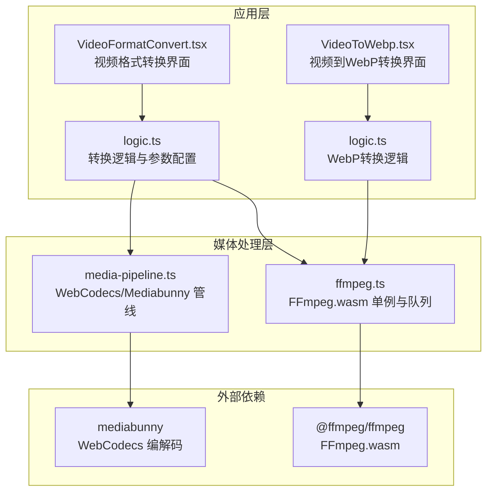
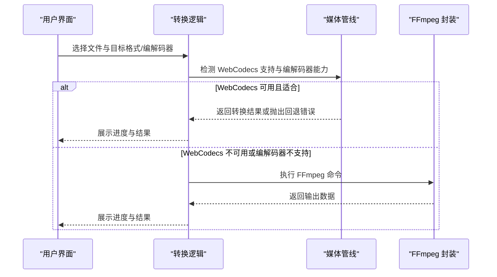
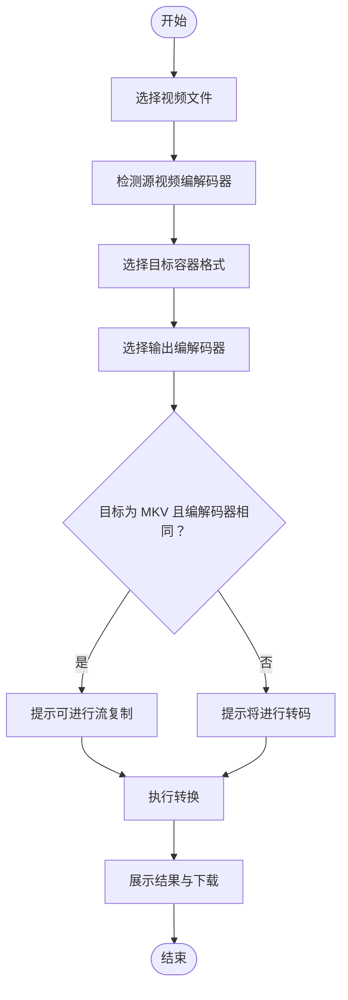
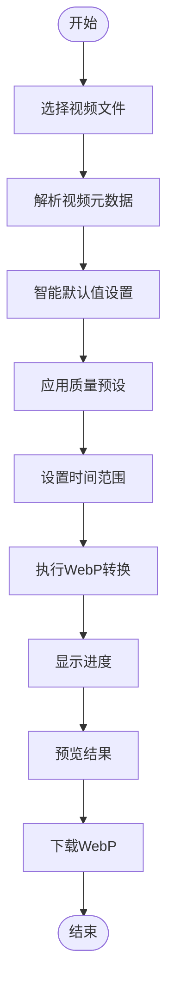
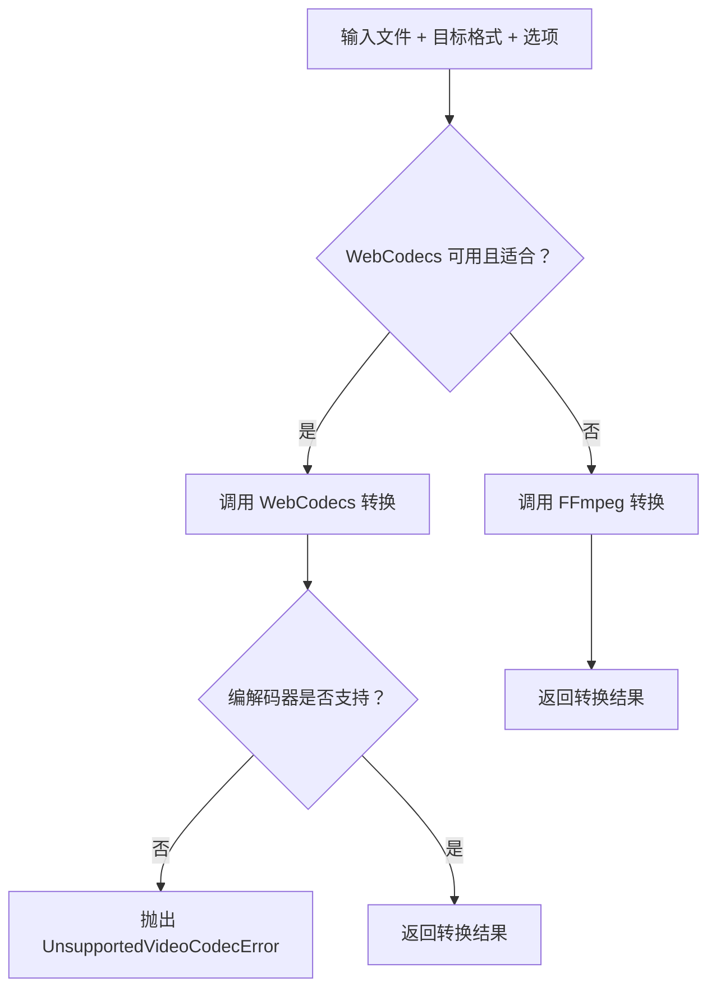
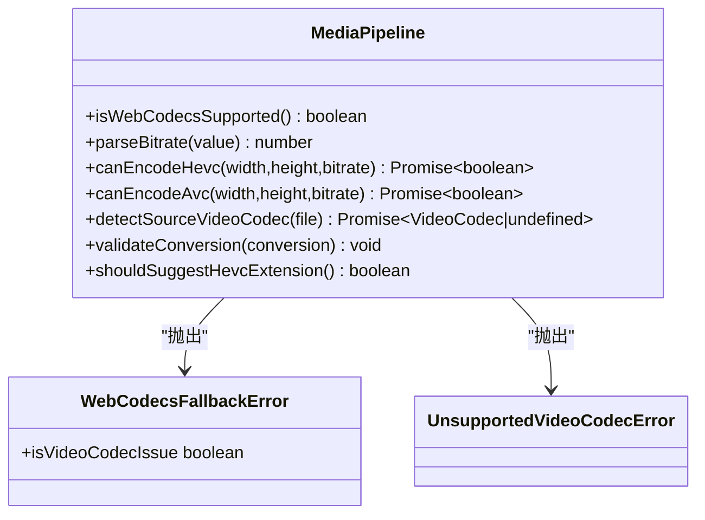
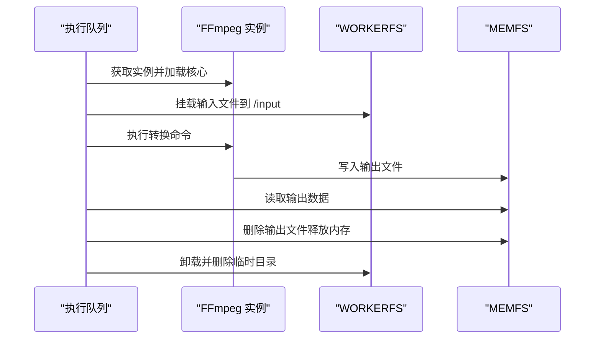
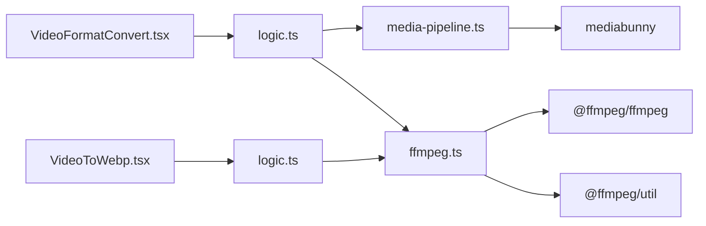

# 视频格式转换工具

<cite>
**本文档引用的文件**
- [README.md](file://README.md)
- [package.json](file://package.json)
- [ffmpeg.ts](file://src/lib/ffmpeg.ts)
- [media-pipeline.ts](file://src/lib/media-pipeline.ts)
- [VideoFormatConvert.tsx](file://src/tools/video/format-convert/VideoFormatConvert.tsx)
- [logic.ts](file://src/tools/video/format-convert/logic.ts)
- [VideoToWebp.tsx](file://src/tools/video/to-webp/VideoToWebp.tsx)
- [logic.ts](file://src/tools/video/to-webp/logic.ts)
- [index.ts](file://src/tools/video/to-webp/index.ts)
</cite>

## 更新摘要
**变更内容**
- 新增视频到WebP转换工具的详细分析，包括质量预设功能
- 更新用户界面反馈机制的描述
- 增加智能默认值设置的说明
- 扩展转换参数设置部分以包含WebP特定参数

## 目录
1. [简介](#简介)
2. [项目结构](#项目结构)
3. [核心组件](#核心组件)
4. [架构总览](#架构总览)
5. [详细组件分析](#详细组件分析)
6. [依赖关系分析](#依赖关系分析)
7. [性能考虑](#性能考虑)
8. [故障排除指南](#故障排除指南)
9. [结论](#结论)
10. [附录](#附录)

## 简介
本项目是一个基于浏览器的视频格式转换工具，所有处理均在本地完成，不涉及任何文件上传或服务器参与，确保用户隐私与安全。工具采用现代前端技术栈，结合 FFmpeg.wasm 与 WebCodecs/Mediabunny 提供高性能的视频处理能力，覆盖 MP4、MKV、AVI 等常见容器格式之间的转换，以及新增的视频到WebP动画转换功能。

## 项目结构
项目采用 Next.js App Router 结构，核心功能集中在 `src/tools/video` 模块中，配合 `src/lib` 下的媒体处理与 FFmpeg 封装层实现完整的转换流程。新增的视频到WebP工具提供了专门的转换界面和参数配置。

**图表来源**
- [VideoFormatConvert.tsx:1-225](file://src/tools/video/format-convert/VideoFormatConvert.tsx#L1-L225)
- [VideoToWebp.tsx:1-279](file://src/tools/video/to-webp/VideoToWebp.tsx#L1-L279)
- [logic.ts:1-152](file://src/tools/video/format-convert/logic.ts#L1-L152)
- [logic.ts:1-45](file://src/tools/video/to-webp/logic.ts#L1-L45)
- [media-pipeline.ts:1-175](file://src/lib/media-pipeline.ts#L1-L175)
- [ffmpeg.ts:1-144](file://src/lib/ffmpeg.ts#L1-L144)

**章节来源**
- [README.md:55-78](file://README.md#L55-L78)
- [package.json:11-32](file://package.json#L11-L32)

## 核心组件
- 视频格式转换界面组件：负责文件选择、格式与编解码器选择、进度展示与结果下载。
- 视频到WebP转换界面组件：提供质量预设、智能默认值、时间范围选择和实时预览功能。
- 转换逻辑模块：根据目标容器与编解码器选择最优处理路径（WebCodecs 或 FFmpeg），并生成输出文件。
- 媒体管线模块：封装 WebCodecs/Mediabunny 能力检测、编解码器验证与错误处理。
- FFmpeg 封装：提供单例加载、进度监听、文件挂载与序列化执行队列，避免内存拷贝与并发冲突。

**章节来源**
- [VideoFormatConvert.tsx:14-224](file://src/tools/video/format-convert/VideoFormatConvert.tsx#L14-L224)
- [VideoToWebp.tsx:33-279](file://src/tools/video/to-webp/VideoToWebp.tsx#L33-L279)
- [logic.ts:38-151](file://src/tools/video/format-convert/logic.ts#L38-L151)
- [logic.ts:13-44](file://src/tools/video/to-webp/logic.ts#L13-L44)
- [media-pipeline.ts:7-175](file://src/lib/media-pipeline.ts#L7-L175)
- [ffmpeg.ts:10-144](file://src/lib/ffmpeg.ts#L10-L144)

## 架构总览
系统通过"界面 → 逻辑 → 媒体管线/FFmpeg"的分层设计实现容器转换与编解码器重封装的统一处理。WebCodecs 路径优先用于 MP4/MKV，自动进行流复制或转码；FFmpeg 路径用于 AVI 或 WebCodecs 不可用时的回退方案。新增的视频到WebP工具专门使用FFmpeg路径进行动画WebP生成。

**图表来源**
- [VideoFormatConvert.tsx:66-92](file://src/tools/video/format-convert/VideoFormatConvert.tsx#L66-L92)
- [VideoToWebp.tsx:84-102](file://src/tools/video/to-webp/VideoToWebp.tsx#L84-L102)
- [logic.ts:38-63](file://src/tools/video/format-convert/logic.ts#L38-L63)
- [media-pipeline.ts:59-91](file://src/lib/media-pipeline.ts#L59-L91)
- [ffmpeg.ts:99-143](file://src/lib/ffmpeg.ts#L99-L143)

## 详细组件分析

### 组件一：视频格式转换界面（VideoFormatConvert）
- 功能职责
  - 文件上传与元数据解析，识别源视频编解码器。
  - 目标容器格式（MP4/MKV/AVI）与输出编解码器（H.264/H.265）选择。
  - 进度条显示与结果预览，提供下载按钮。
  - 错误提示与 HEVC 扩展安装建议。
- 关键交互
  - 当目标为 MKV 且编解码器与源一致时，提示可进行流复制以提升性能。
  - 当目标为 MKV 且编解码器不一致时，提示将进行转码。
- 用户体验
  - 自动检测 H.265 编码能力并在不可用时禁用相应选项。
  - 对不支持的编解码器直接报错，避免无效尝试。

**图表来源**
- [VideoFormatConvert.tsx:105-172](file://src/tools/video/format-convert/VideoFormatConvert.tsx#L105-L172)

**章节来源**
- [VideoFormatConvert.tsx:14-224](file://src/tools/video/format-convert/VideoFormatConvert.tsx#L14-L224)

### 组件二：视频到WebP转换界面（VideoToWebp）
- 功能职责
  - 文件上传与元数据解析，识别源视频时长、分辨率和帧率。
  - 质量预设选择（small/balanced/high）与智能默认值设置。
  - 时间范围选择与实时预览功能。
  - 进度显示与结果下载。
- 质量预设功能
  - small：低质量预设（FPS: 8, 质量: 50）
  - balanced：平衡预设（FPS: 12, 质量: 75）
  - high：高质量预设（FPS: 15, 质量: 90）
- 智能默认值设置
  - 基于视频时长的智能时间范围选择：短于5秒使用完整时长，5-30秒使用5秒，超过30秒使用10秒。
  - 自动设置宽度为原视频宽度或1280px的较小值。
  - 应用平衡预设作为初始设置。
- 用户界面反馈
  - 实时进度显示与错误处理。
  - 转换结果预览与下载功能。
  - 原始文件大小与输出文件大小对比。

**图表来源**
- [VideoToWebp.tsx:115-131](file://src/tools/video/to-webp/VideoToWebp.tsx#L115-L131)
- [VideoToWebp.tsx:137-158](file://src/tools/video/to-webp/VideoToWebp.tsx#L137-L158)
- [VideoToWebp.tsx:160-171](file://src/tools/video/to-webp/VideoToWebp.tsx#L160-L171)

**章节来源**
- [VideoToWebp.tsx:33-279](file://src/tools/video/to-webp/VideoToWebp.tsx#L33-L279)

### 组件三：转换逻辑（logic.ts）
- 功能职责
  - 根据目标容器与编解码器选择处理路径：WebCodecs 优先，失败时回退至 FFmpeg。
  - 定义各容器的默认编解码器参数：MP4 使用 H.264 + AAC，MKV 默认流复制 + 流复制，AVI 使用 H.264 + AAC。
  - 对 MKV 的流复制/转码决策：当目标编解码器与源一致时走流复制，否则转码。
  - WebP转换逻辑：使用FFmpeg生成动画WebP文件。
- 参数配置
  - 输出容器与 MIME 类型映射。
  - WebCodecs 转换时的硬件加速偏好与音频编码器选择。
  - WebP转换参数：帧率、宽度、质量、时间范围。
- 错误处理
  - WebCodecs 回退错误区分视频编解码器问题与其他问题。
  - 对于不支持的视频编解码器（如 H.265/HEVC、VP9、AV1）直接抛出"不受支持的视频编解码器"错误。

**图表来源**
- [logic.ts:38-63](file://src/tools/video/format-convert/logic.ts#L38-L63)
- [media-pipeline.ts:32-53](file://src/lib/media-pipeline.ts#L32-L53)

**章节来源**
- [logic.ts:12-31](file://src/tools/video/format-convert/logic.ts#L12-L31)
- [logic.ts:65-133](file://src/tools/video/format-convert/logic.ts#L65-L133)
- [logic.ts:135-151](file://src/tools/video/format-convert/logic.ts#L135-L151)
- [logic.ts:13-44](file://src/tools/video/to-webp/logic.ts#L13-L44)

### 组件四：媒体管线与编解码器能力检测（media-pipeline.ts）
- 能力检测
  - WebCodecs 支持检测：VideoEncoder/VideoDecoder/AudioEncoder/AudioDecoder 是否可用。
  - H.264/H.265 编码能力检测：基于 mediabunny 的 canEncodeVideo 接口。
  - 源视频编解码器检测：通过 Mediabunny 输入流获取主视频轨的编解码器信息。
- 错误模型
  - WebCodecsFallbackError：指示 WebCodecs 无法处理的场景（可能为视频编解码器问题或其他）。
  - UnsupportedVideoCodecError：终端错误，明确不支持的视频编解码器。
- 质量与兼容性
  - validateConversion：校验转换过程中是否丢弃关键轨道（视频/音频），防止无声或无画面输出。
  - shouldSuggestHevcExtension：在 Windows + Chromium 场景下建议安装 HEVC 扩展以启用硬件解码。

**图表来源**
- [media-pipeline.ts:7-175](file://src/lib/media-pipeline.ts#L7-L175)

**章节来源**
- [media-pipeline.ts:7-14](file://src/lib/media-pipeline.ts#L7-L14)
- [media-pipeline.ts:107-141](file://src/lib/media-pipeline.ts#L107-L141)
- [media-pipeline.ts:149-174](file://src/lib/media-pipeline.ts#L149-L174)

### 组件五：FFmpeg 封装（ffmpeg.ts）
- 单例加载与缓存：避免重复下载核心资源，提升二次转换性能。
- 进度监听：统一订阅 FFmpeg 进度事件，转换界面实时更新百分比。
- 文件挂载与内存优化：使用 WORKERFS 直接挂载 File 对象，避免两次内存拷贝；转换完成后立即释放 MEMFS 输出副本。
- 串行化执行：通过 Promise 队列保证 FFmpeg WASM 单线程限制下的安全执行，防止挂载点冲突。

**图表来源**
- [ffmpeg.ts:99-143](file://src/lib/ffmpeg.ts#L99-L143)

**章节来源**
- [ffmpeg.ts:10-39](file://src/lib/ffmpeg.ts#L10-L39)
- [ffmpeg.ts:41-58](file://src/lib/ffmpeg.ts#L41-L58)
- [ffmpeg.ts:99-143](file://src/lib/ffmpeg.ts#L99-L143)

## 依赖关系分析
- 依赖管理
  - @ffmpeg/ffmpeg：提供 FFmpeg.wasm 的核心能力。
  - mediabunny：提供 WebCodecs 编解码与容器输出能力。
  - @ffmpeg/util：将 CDN 资源转换为 Blob URL，便于浏览器加载。
- 模块耦合
  - VideoFormatConvert 仅依赖 logic.ts 与媒体管线接口，保持界面与逻辑分离。
  - VideoToWebp 依赖 logic.ts 中的 FFmpeg封装，专门处理WebP转换。
  - logic.ts 作为门面，协调 media-pipeline.ts 与 ffmpeg.ts，实现路径选择与错误传播。
  - ffmpeg.ts 与 media-pipeline.ts 互不直接依赖，通过上层逻辑调度。

**图表来源**
- [VideoFormatConvert.tsx:1-13](file://src/tools/video/format-convert/VideoFormatConvert.tsx#L1-L13)
- [VideoToWebp.tsx:1-13](file://src/tools/video/to-webp/VideoToWebp.tsx#L1-L13)
- [logic.ts:1-2](file://src/tools/video/format-convert/logic.ts#L1-L2)
- [logic.ts:1-2](file://src/tools/video/to-webp/logic.ts#L1-L2)
- [media-pipeline.ts:1-5](file://src/lib/media-pipeline.ts#L1-L5)
- [ffmpeg.ts:1-6](file://src/lib/ffmpeg.ts#L1-L6)

**章节来源**
- [package.json:11-32](file://package.json#L11-L32)

## 性能考虑
- 路径选择
  - WebCodecs 优先：在支持的浏览器与容器（MP4/MKV）上，利用硬件加速与流复制显著提升性能。
  - FFmpeg 回退：对 AVI 或 WebCodecs 不支持的场景提供稳定回退。
  - WebP专用：视频到WebP转换专门使用FFmpeg路径，确保高质量输出。
- 内存优化
  - WORKERFS 直接挂载文件，避免额外内存拷贝。
  - 转换完成后立即删除 MEMFS 输出文件，降低峰值内存占用。
- 并发控制
  - 通过 Promise 队列串行化 FFmpeg 操作，避免挂载点冲突与资源竞争。
- 编解码器选择
  - 自动根据源视频编解码器与目标容器决定是否进行流复制，减少不必要的转码开销。
- 质量预设优化
  - 预设参数经过优化，平衡文件大小与视觉质量。
  - 智能默认值减少用户手动调整的工作量。

**章节来源**
- [logic.ts:44-62](file://src/tools/video/format-convert/logic.ts#L44-L62)
- [VideoToWebp.tsx:15-20](file://src/tools/video/to-webp/VideoToWebp.tsx#L15-L20)
- [ffmpeg.ts:8-82](file://src/lib/ffmpeg.ts#L8-L82)
- [ffmpeg.ts:121-132](file://src/lib/ffmpeg.ts#L121-L132)

## 故障排除指南
- 不支持的视频编解码器
  - 现象：转换失败并提示不受支持的视频编解码器。
  - 原因：当前浏览器无法通过 WebCodecs 解码该视频编解码器（如 H.265/HEVC、VP9、AV1）。
  - 处理：改用 FFmpeg 路径或安装 HEVC 扩展（Windows + Chromium）。
- WebCodecs 回退错误
  - 现象：WebCodecs 转换被标记为不可用并回退。
  - 原因：非视频编解码器问题（如音频不支持）时仍可回退至 FFmpeg。
  - 处理：检查音频轨道或目标容器兼容性。
- 进度异常
  - 现象：进度不更新或异常跳变。
  - 处理：确认浏览器支持 SharedArrayBuffer 或 WebCodecs；检查网络与资源加载状态。
- 输出质量与体积
  - 现象：输出文件体积过大或画质下降。
  - 处理：选择合适的编解码器（H.264 通用性强，H.265 压缩率更高但需硬件支持）；必要时使用 FFmpeg 路径进行精细参数控制。
- WebP转换问题
  - 现象：WebP转换失败或质量不佳。
  - 处理：检查视频时长和分辨率；调整质量预设；确认浏览器支持SharedArrayBuffer。

**章节来源**
- [media-pipeline.ts:32-53](file://src/lib/media-pipeline.ts#L32-L53)
- [media-pipeline.ts:88-91](file://src/lib/media-pipeline.ts#L88-L91)
- [VideoFormatConvert.tsx:82-91](file://src/tools/video/format-convert/VideoFormatConvert.tsx#L82-L91)
- [VideoToWebp.tsx:231-235](file://src/tools/video/to-webp/VideoToWebp.tsx#L231-L235)

## 结论
本工具通过 WebCodecs 与 FFmpeg 的双轨设计，在保证跨平台兼容性的同时最大化性能与用户体验。对于容器格式转换与编解码器重封装，系统提供了智能路径选择、严格的编解码器验证与内存优化策略，适用于多种应用场景（如社交媒体分享、视频编辑与存储优化）。新增的视频到WebP转换工具进一步扩展了功能范围，提供了质量预设、智能默认值和良好的用户界面反馈机制，满足现代Web应用对高性能动画图像的需求。

## 附录

### 支持的输入输出格式组合
- MP4 → AVI：转码（容器差异 + 编解码器要求）
- MP4 → MKV：可流复制（若编解码器一致）或转码（若编解码器不一致）
- MOV → MKV：可流复制（若编解码器一致）或转码（若编解码器不一致）
- WEBM → MP4：转码（容器差异 + 编解码器要求）
- 视频 → WebP：动画WebP生成（使用FFmpeg）

说明：具体可用性取决于源视频编解码器与目标容器的兼容性，以及浏览器的 WebCodecs 支持情况。

**章节来源**
- [logic.ts:12-31](file://src/tools/video/format-convert/logic.ts#L12-L31)
- [logic.ts:93-103](file://src/tools/video/format-convert/logic.ts#L93-L103)
- [logic.ts:13-44](file://src/tools/video/to-webp/logic.ts#L13-L44)

### 质量损失控制与最佳策略
- 社交媒体分享：优先 H.264（MP4），确保广泛兼容；如需更高压缩率且目标平台支持，可选 H.265（MKV）。
- 视频编辑：优先保持源编解码器（MKV 流复制），减少质量损失与转码时间。
- 存储优化：在保证可播放性的前提下选择更高压缩比的编解码器（如 H.265），注意目标设备兼容性。
- WebP转换：使用平衡预设作为默认选择，根据需求调整质量预设。

**章节来源**
- [VideoFormatConvert.tsx:160-172](file://src/tools/video/format-convert/VideoFormatConvert.tsx#L160-L172)
- [media-pipeline.ts:98-104](file://src/lib/media-pipeline.ts#L98-L104)
- [VideoToWebp.tsx:15-20](file://src/tools/video/to-webp/VideoToWebp.tsx#L15-L20)

### 转换参数设置（当前实现范围）
- 目标容器：MP4、MKV、AVI
- 输出编解码器：H.264（AVC）、H.265（HEVC）
- 音频轨道：AAC（MP4/MKV/AVI）
- 进度回调：支持 0–100% 实时反馈
- 硬件加速：WebCodecs 路径优先使用硬件加速
- WebP参数：
  - 质量预设：small（FPS: 8, 质量: 50）、balanced（FPS: 12, 质量: 75）、high（FPS: 15, 质量: 90）
  - 帧率：可调节范围（受视频帧率限制）
  - 宽度：可调节范围（偶数约束）
  - 质量：10-100范围
  - 时间范围：基于视频时长的智能默认值

说明：当前实现主要通过容器与编解码器选择实现"重封装/转码"，未暴露分辨率、比特率、帧率等细粒度参数。如需精细化控制，可在 FFmpeg 路径中扩展参数接口。

**章节来源**
- [logic.ts:16-30](file://src/tools/video/format-convert/logic.ts#L16-L30)
- [logic.ts:105-114](file://src/tools/video/format-convert/logic.ts#L105-L114)
- [logic.ts:13-44](file://src/tools/video/to-webp/logic.ts#L13-L44)
- [VideoToWebp.tsx:15-20](file://src/tools/video/to-webp/VideoToWebp.tsx#L15-L20)
- [ffmpeg.ts:51-57](file://src/lib/ffmpeg.ts#L51-L57)

### 智能默认值设置
- 时间范围智能选择：
  - 视频时长 < 5秒：使用完整时长
  - 5秒 ≤ 视频时长 < 30秒：使用5秒
  - 视频时长 ≥ 30秒：使用10秒
- 宽度智能设置：原视频宽度与1280px的较小值
- 质量预设：平衡预设作为初始设置
- 帧率智能限制：不超过视频源帧率且不超过30fps

**章节来源**
- [VideoToWebp.tsx:121-130](file://src/tools/video/to-webp/VideoToWebp.tsx#L121-L130)
- [VideoToWebp.tsx:61-63](file://src/tools/video/to-webp/VideoToWebp.tsx#L61-L63)