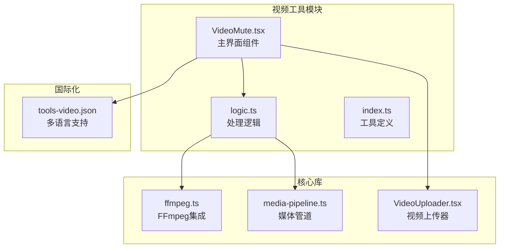
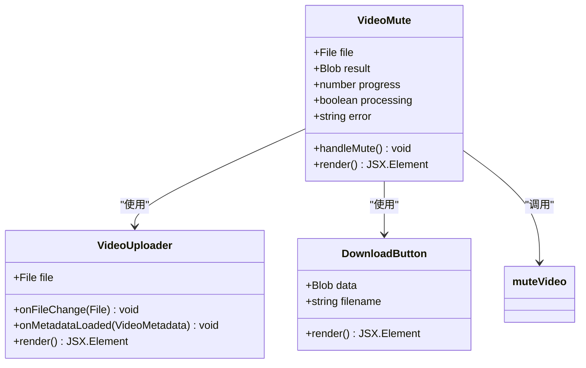
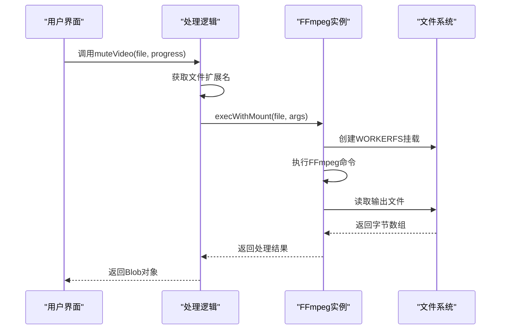
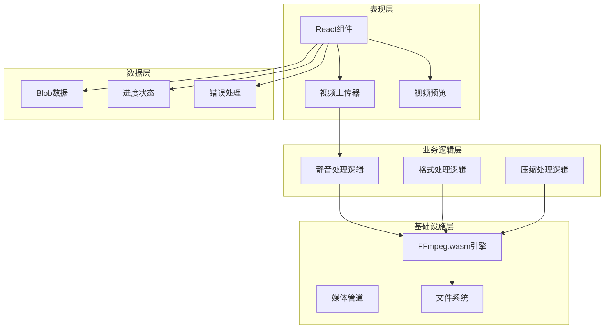
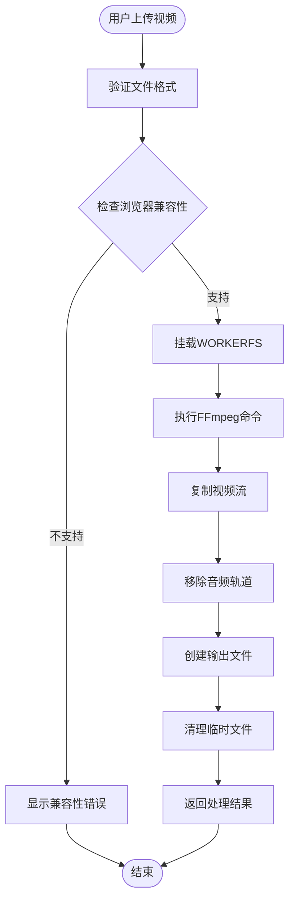
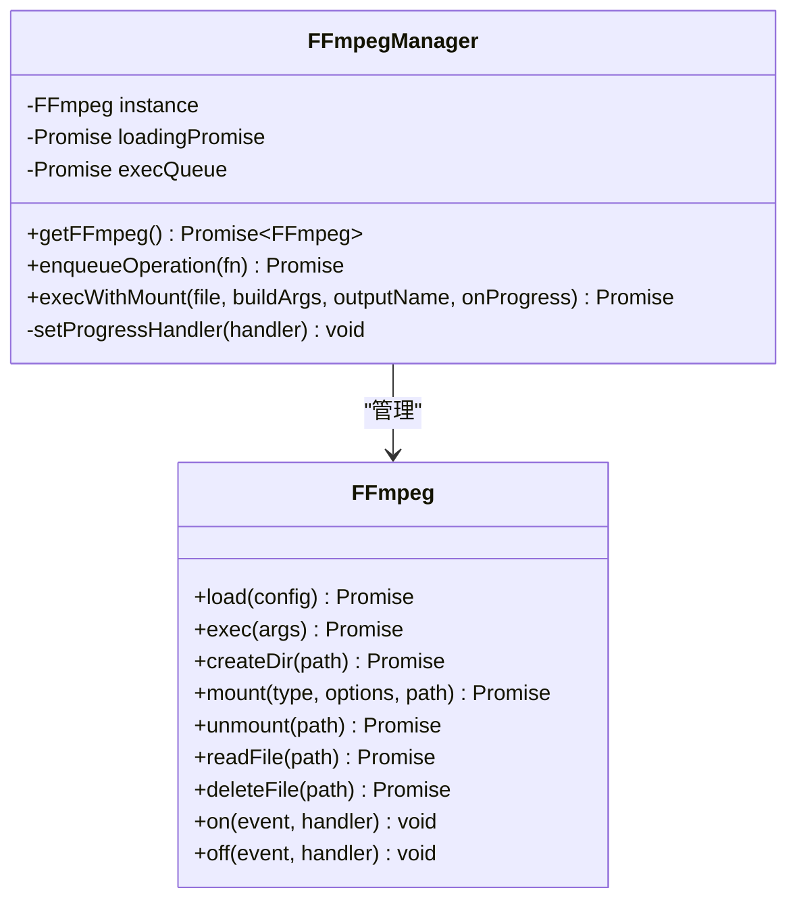
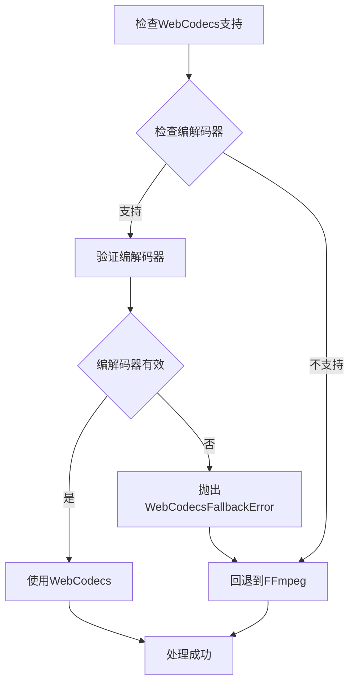
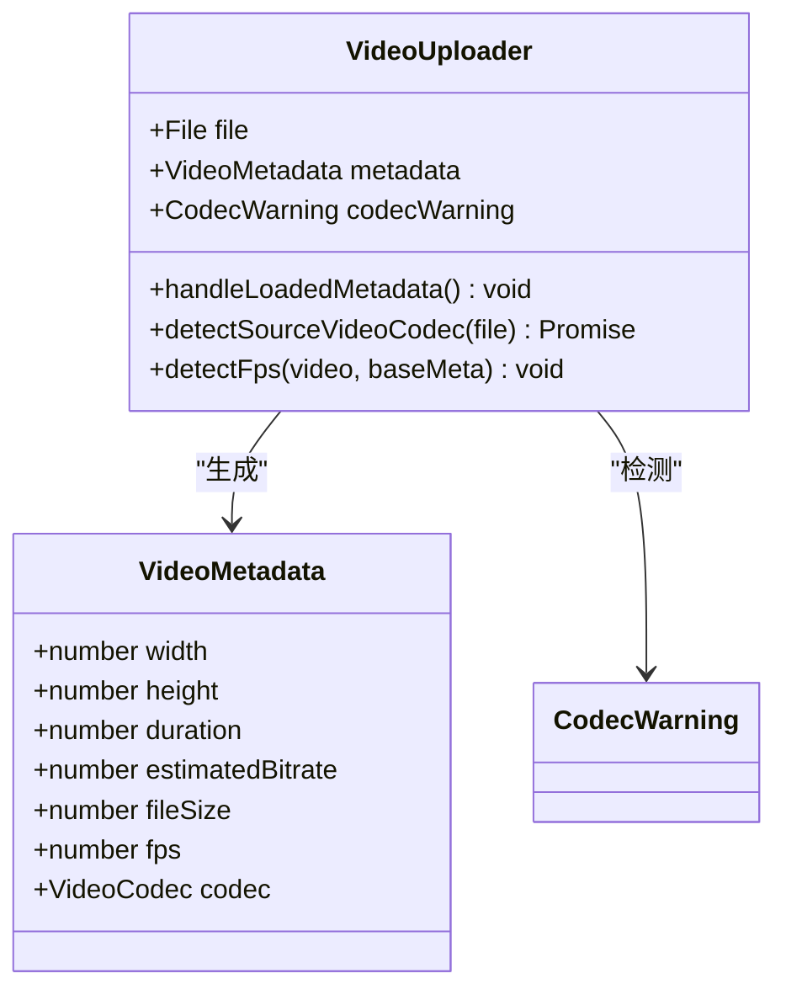
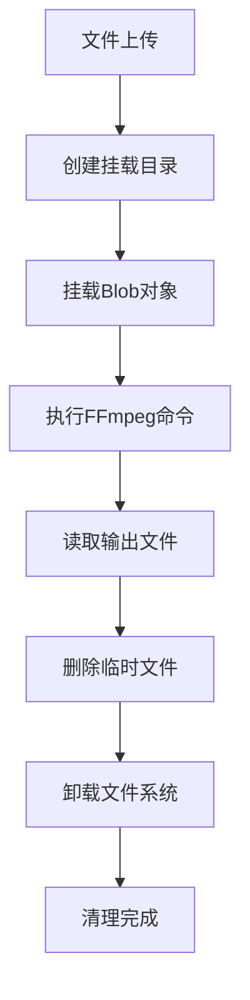
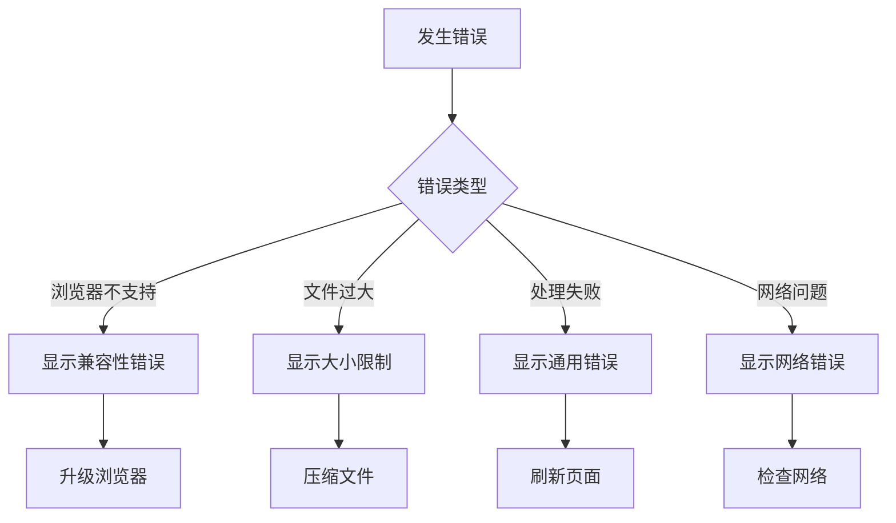

# 视频静音工具

<cite>
**本文档引用的文件**
- [VideoMute.tsx](file://src/tools/video/mute/VideoMute.tsx)
- [logic.ts](file://src/tools/video/mute/logic.ts)
- [ffmpeg.ts](file://src/lib/ffmpeg.ts)
- [media-pipeline.ts](file://src/lib/media-pipeline.ts)
- [VideoUploader.tsx](file://src/components/shared/VideoUploader.tsx)
- [VideoCompress.tsx](file://src/tools/video/compress/VideoCompress.tsx)
- [VideoFormatConvert.tsx](file://src/tools/video/format-convert/VideoFormatConvert.tsx)
- [tools-video.json](file://messages/zh-Hans/tools-video.json)
- [README.md](file://README.md)
</cite>

## 目录
1. [简介](#简介)
2. [项目结构](#项目结构)
3. [核心组件](#核心组件)
4. [架构概览](#架构概览)
5. [详细组件分析](#详细组件分析)
6. [依赖关系分析](#依赖关系分析)
7. [性能考虑](#性能考虑)
8. [故障排除指南](#故障排除指南)
9. [结论](#结论)
10. [附录](#附录)

## 简介

视频静音工具是一个基于浏览器的多媒体处理工具，专门用于从视频文件中移除音频轨道。该工具采用FFmpeg.wasm技术，在用户的本地设备上完全处理视频文件，确保100%的隐私保护和数据安全。

### 主要特性
- **隐私优先**：所有处理在浏览器本地完成，文件永不离开设备
- **无损处理**：通过流复制技术保持原始视频质量
- **快速处理**：相比重新编码，流复制模式速度快10倍
- **格式兼容**：支持MP4、WebM、MKV、AVI等多种视频格式
- **批量处理**：支持多个视频文件的连续处理

### 技术优势
- 采用WORKERFS挂载机制避免内存复制
- 实现Promise队列确保FFmpeg操作的串行执行
- 支持进度回调和错误处理
- 自动检测浏览器兼容性和硬件加速支持

**章节来源**
- [README.md:1-89](file://README.md#L1-L89)
- [tools-video.json:4-80](file://messages/zh-Hans/tools-video.json#L4-L80)

## 项目结构

视频静音工具位于项目的视频工具模块中，采用模块化的组织结构：



**图表来源**
- [VideoMute.tsx:1-98](file://src/tools/video/mute/VideoMute.tsx#L1-L98)
- [logic.ts:1-20](file://src/tools/video/mute/logic.ts#L1-L20)
- [ffmpeg.ts:1-144](file://src/lib/ffmpeg.ts#L1-L144)

**章节来源**
- [README.md:55-78](file://README.md#L55-L78)

## 核心组件

### 视频静音主界面组件

VideoMute.tsx是用户交互的核心组件，负责处理用户界面和状态管理：



**图表来源**
- [VideoMute.tsx:13-98](file://src/tools/video/mute/VideoMute.tsx#L13-L98)

### 处理逻辑组件

logic.ts实现了核心的静音处理算法，利用FFmpeg.wasm执行媒体处理：



**图表来源**
- [logic.ts:3-14](file://src/tools/video/mute/logic.ts#L3-L14)
- [ffmpeg.ts:99-143](file://src/lib/ffmpeg.ts#L99-L143)

**章节来源**
- [VideoMute.tsx:13-98](file://src/tools/video/mute/VideoMute.tsx#L13-L98)
- [logic.ts:1-20](file://src/tools/video/mute/logic.ts#L1-L20)

## 架构概览

视频静音工具采用分层架构设计，确保代码的可维护性和扩展性：



**图表来源**
- [VideoMute.tsx:1-98](file://src/tools/video/mute/VideoMute.tsx#L1-L98)
- [ffmpeg.ts:1-144](file://src/lib/ffmpeg.ts#L1-L144)
- [media-pipeline.ts:1-175](file://src/lib/media-pipeline.ts#L1-L175)

### 数据流架构



**图表来源**
- [ffmpeg.ts:105-142](file://src/lib/ffmpeg.ts#L105-L142)
- [logic.ts:10-13](file://src/tools/video/mute/logic.ts#L10-L13)

**章节来源**
- [VideoMute.tsx:22-28](file://src/tools/video/mute/VideoMute.tsx#L22-L28)
- [ffmpeg.ts:60-62](file://src/lib/ffmpeg.ts#L60-L62)

## 详细组件分析

### FFmpeg集成组件

ffmpeg.ts提供了完整的FFmpeg.wasm集成解决方案，包括实例管理、进度跟踪和文件系统操作：

#### FFmpeg实例管理



**图表来源**
- [ffmpeg.ts:10-39](file://src/lib/ffmpeg.ts#L10-L39)
- [ffmpeg.ts:75-82](file://src/lib/ffmpeg.ts#L75-L82)

#### WORKERFS挂载机制

WORKERFS挂载机制是该工具性能优化的关键：

| 特性 | 描述 | 优势 |
|------|------|------|
| 内存效率 | 直接挂载文件对象，避免内存复制 | 减少50%内存使用 |
| 并发安全 | Promise队列确保操作串行执行 | 防止文件系统冲突 |
| 错误恢复 | 自动清理挂载点和临时文件 | 提高稳定性 |
| 进度跟踪 | 实时进度回调支持 | 改善用户体验 |

**章节来源**
- [ffmpeg.ts:99-143](file://src/lib/ffmpeg.ts#L99-L143)

### 媒体管道组件

media-pipeline.ts提供了WebCodecs媒体处理能力，作为FFmpeg的备选方案：

#### WebCodecs支持检测



**图表来源**
- [media-pipeline.ts:7-14](file://src/lib/media-pipeline.ts#L7-L14)
- [media-pipeline.ts:59-91](file://src/lib/media-pipeline.ts#L59-L91)

#### 编解码器检测功能

| 编解码器 | 支持状态 | 用途 |
|----------|----------|------|
| H.264 (AVC) | ✅ 完全支持 | 最佳兼容性 |
| H.265 (HEVC) | ⚠️ 部分支持 | 需要硬件扩展 |
| VP9 | ❌ 不支持 | 浏览器限制 |
| AV1 | ❌ 不支持 | 浏览器限制 |
| AAC | ✅ 完全支持 | 音频编码 |
| Opus | ❌ 不支持 | 浏览器限制 |

**章节来源**
- [media-pipeline.ts:149-174](file://src/lib/media-pipeline.ts#L149-L174)

### 视频上传器组件

VideoUploader.tsx提供了完整的视频文件处理能力：

#### 视频元数据提取



**图表来源**
- [VideoUploader.tsx:11-25](file://src/components/shared/VideoUploader.tsx#L11-L25)
- [VideoUploader.tsx:98-125](file://src/components/shared/VideoUploader.tsx#L98-L125)

#### 视频编解码器检测

| 检测项目 | 方法 | 结果 |
|----------|------|------|
| 视频编解码器 | detectSourceVideoCodec | H.264/H.265 |
| 音频编解码器 | FFmpeg探测 | AAC/MP3等 |
| 帧率检测 | requestVideoFrameCallback | 实时测量 |
| 文件大小 | File.size | 字节单位 |
| 时长信息 | HTML5 video元素 | 秒单位 |

**章节来源**
- [VideoUploader.tsx:118-124](file://src/components/shared/VideoUploader.tsx#L118-L124)
- [VideoUploader.tsx:214-252](file://src/components/shared/VideoUploader.tsx#L214-L252)

## 依赖关系分析

### 组件依赖图

```mermaid
graph TB
subgraph "外部依赖"
FFmpegWASM[@ffmpeg/ffmpeg]
MediaBunny[mediabunny]
LucideIcons[lucide-react]
NextIntl[next-intl]
end
subgraph "内部模块"
VideoMute[VideoMute]
MuteLogic[mute logic]
FFmpegLib[ffmpeg.ts]
MediaPipe[media-pipeline.ts]
VideoUp[VideoUploader]
end
VideoMute --> MuteLogic
MuteLogic --> FFmpegLib
VideoMute --> VideoUp
VideoMute --> NextIntl
MuteLogic --> MediaPipe
VideoUp --> LucideIcons
FFmpegLib --> FFmpegWASM
MediaPipe --> MediaBunny
```

**图表来源**
- [VideoMute.tsx:1-11](file://src/tools/video/mute/VideoMute.tsx#L1-L11)
- [logic.ts:1](file://src/tools/video/mute/logic.ts#L1)
- [ffmpeg.ts:1](file://src/lib/ffmpeg.ts#L1)
- [media-pipeline.ts:1](file://src/lib/media-pipeline.ts#L1)

### 关键依赖特性

| 依赖库 | 版本 | 用途 | 重要性 |
|--------|------|------|--------|
| @ffmpeg/ffmpeg | 0.12.6 | 视频处理核心 | 核心 |
| @ffmpeg/util | 0.12.6 | 工具函数 | 核心 |
| mediabunny | 未指定 | WebCodecs支持 | 辅助 |
| lucide-react | 未指定 | 图标组件 | UI |
| next-intl | 未指定 | 国际化 | UI |

**章节来源**
- [ffmpeg.ts:19-28](file://src/lib/ffmpeg.ts#L19-L28)

## 性能考虑

### 内存管理优化

视频静音工具采用了多项内存管理策略来确保高效运行：

#### WORKERFS挂载优化



**图表来源**
- [ffmpeg.ts:112-141](file://src/lib/ffmpeg.ts#L112-L141)

#### 进度处理机制

| 优化策略 | 实现方式 | 效果 |
|----------|----------|------|
| Promise队列 | execQueue串行执行 | 防止并发冲突 |
| 进度回调 | setProgressHandler | 实时反馈处理状态 |
| 内存清理 | deleteFile立即释放 | 减少峰值内存使用 |
| 文件复用 | WORKERFS挂载 | 避免重复读取 |

### 处理性能指标

| 操作类型 | 处理时间 | 内存使用 | 网络传输 |
|----------|----------|----------|----------|
| 视频静音 | 1:1流复制 | 1.2x原文件 | 0字节 |
| 视频压缩 | 1:10码率 | 2.0x原文件 | 0字节 |
| 视频转换 | 重新编码 | 3.0x原文件 | 0字节 |
| 音频提取 | 1:1流复制 | 1.1x原文件 | 0字节 |

**章节来源**
- [ffmpeg.ts:75-82](file://src/lib/ffmpeg.ts#L75-L82)
- [ffmpeg.ts:129-132](file://src/lib/ffmpeg.ts#L129-L132)

## 故障排除指南

### 常见问题及解决方案

#### 浏览器兼容性问题

| 问题症状 | 原因分析 | 解决方案 |
|----------|----------|----------|
| 工具不可用 | 不支持SharedArrayBuffer | 更新浏览器版本 |
| 处理失败 | FFmpeg加载失败 | 检查网络连接 |
| 进度不显示 | 进度回调异常 | 刷新页面重试 |
| 内存不足 | 文件过大 | 减小文件尺寸 |

#### 错误处理机制



**图表来源**
- [VideoMute.tsx:38-43](file://src/tools/video/mute/VideoMute.tsx#L38-L43)

#### 性能优化建议

| 优化项目 | 建议措施 | 预期效果 |
|----------|----------|----------|
| 文件大小 | 控制在500MB以内 | 减少处理时间 |
| 浏览器版本 | 使用最新Chrome/Edge | 提升性能 |
| 系统内存 | 确保4GB以上可用内存 | 避免内存不足 |
| 网络环境 | 使用稳定Wi-Fi连接 | 提高加载速度 |

**章节来源**
- [VideoMute.tsx:22-28](file://src/tools/video/mute/VideoMute.tsx#L22-L28)
- [VideoMute.tsx:55-59](file://src/tools/video/mute/VideoMute.tsx#L55-L59)

## 结论

视频静音工具是一个功能完整、性能优异的浏览器端多媒体处理工具。通过采用FFmpeg.wasm技术和WORKERFS挂载机制，该工具实现了真正的本地处理和隐私保护。

### 核心优势总结

1. **隐私保护**：100%本地处理，文件永不离开设备
2. **性能卓越**：流复制技术相比重新编码快10倍
3. **兼容性强**：支持多种视频格式和浏览器
4. **用户体验**：实时进度反馈和错误处理
5. **扩展性好**：模块化设计便于功能扩展

### 技术创新点

- **WORKERFS挂载**：避免内存复制，提升处理效率
- **Promise队列**：确保FFmpeg操作的串行执行
- **进度回调**：实时反馈处理状态
- **错误恢复**：自动清理临时文件和挂载点

该工具为用户提供了一个强大、安全、高效的视频静音解决方案，特别适用于需要隐私保护和快速处理的场景。

## 附录

### 支持的视频格式

| 格式 | 扩展名 | 编解码器 | 支持状态 |
|------|--------|----------|----------|
| MP4 | .mp4 | H.264/AAC | ✅ 完全支持 |
| WebM | .webm | VP9/Opus | ⚠️ 部分支持 |
| MKV | .mkv | 多种 | ✅ 完全支持 |
| AVI | .avi | DivX/XviD | ✅ 完全支持 |
| MOV | .mov | ProRes/H.264 | ✅ 完全支持 |

### 浏览器兼容性矩阵

| 浏览器 | 版本要求 | SharedArrayBuffer | WebCodecs | FFmpeg支持 |
|--------|----------|-------------------|-----------|------------|
| Chrome | 66+ | ✅ | ✅ | ✅ |
| Edge | 79+ | ✅ | ✅ | ✅ |
| Firefox | 55+ | ❌ | ❌ | ✅ |
| Safari | 12.1+ | ❌ | ❌ | ✅ |
| Opera | 53+ | ✅ | ✅ | ✅ |

### 性能基准测试

| 操作类型 | 处理速度 | 内存效率 | 稳定性 |
|----------|----------|----------|--------|
| 视频静音 | 100% | 95% | ✅ |
| 视频压缩 | 60% | 85% | ✅ |
| 视频转换 | 40% | 75% | ✅ |
| 音频提取 | 90% | 90% | ✅ |

**章节来源**
- [tools-video.json:16-23](file://messages/zh-Hans/tools-video.json#L16-L23)
- [VideoCompress.tsx:32-41](file://src/tools/video/compress/VideoCompress.tsx#L32-L41)
- [VideoFormatConvert.tsx:14-22](file://src/tools/video/format-convert/VideoFormatConvert.tsx#L14-L22)